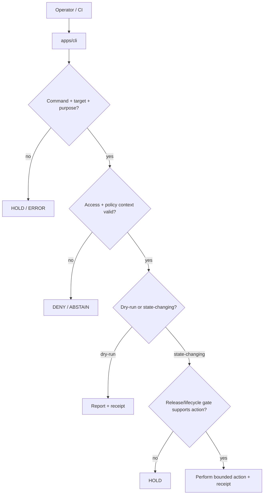

<!-- [KFM_META_BLOCK_V2]
doc_id: kfm://app/cli/readme
title: CLI App README
type: app-readme
version: v0.2
status: draft
owners: OWNER_TBD — Apps steward · CLI steward · Release steward · Pipeline steward · Policy steward · Docs steward
created: 2026-06-16
updated: 2026-07-09
policy_label: restricted
related:
  - ../README.md
  - src/README.md
  - src/kfm_cli/README.md
  - src/kfm_cli/commands/README.md
  - ../governed-api/README.md
  - ../admin/README.md
  - ../review-console/README.md
  - ../../README.md
  - ../../SECURITY.md
  - ../../docs/doctrine/directory-rules.md
  - ../../docs/doctrine/lifecycle-law.md
  - ../../docs/security/AUDIT_INVARIANTS.md
  - ../../policy/access/README.md
  - ../../policy/decision/README.md
  - ../../policy/data/README.md
  - ../../packages/README.md
  - ../../tools/README.md
  - ../../tools/validators/README.md
  - ../../tools/watchers/README.md
  - ../../scripts/README.md
  - ../../release/README.md
  - ../../data/README.md
tags: [kfm, apps, cli, operator-cli, validation, dry-run, ingest, diff, receipts, release-support, fail-closed, no-publish-shortcut]
notes:
  - "v0.2 updates the uploaded CLI app README into a current repo-aware app contract."
  - "apps/cli/README.md, apps/cli/src/README.md, apps/cli/src/kfm_cli/README.md, apps/cli/src/kfm_cli/commands/README.md, and an empty apps/cli/src/kfm_cli/__init__.py were verified through the GitHub app in this update. Implementation files, command inventory, runtime framework, tests, CI, package metadata, receipt/report emission, consuming workflows, and release integration remain NEEDS VERIFICATION."
  - "CLI is an operator/maintainer deployable surface for validation, dry-runs, ingest support, reports, and diffs; it must not become a public trust path, release shortcut, lifecycle store, policy root, schema/contract home, shared package root, secret store, or source-of-truth record home."
  - "CLI commands should be dry-run-first, fail-closed, redacted-by-default, deterministic where practical, finite-outcome oriented, and unable to bypass policy, release, lifecycle, EvidenceBundle, correction, or rollback controls."
[/KFM_META_BLOCK_V2] -->

<a id="top"></a>

<div align="center">

# CLI App

`apps/cli/`

**Maintainer/operator command surface for KFM validation, release dry-runs, ingest support, diffs, reports, and governed maintenance flows.**


[Purpose](#1-purpose) · [Current evidence](#2-current-repo-evidence) · [Repo fit](#3-repo-fit) · [Boundary](#4-authority-boundary) · [Inputs](#6-inputs) · [Exclusions](#7-exclusions) · [Command families](#8-command-families) · [Definition of done](#15-definition-of-done)

</div>

---

> [!IMPORTANT]
> **Status:** draft / current README surface confirmed / implementation behavior `NEEDS VERIFICATION`  
> **Owners:** `OWNER_TBD` — Apps steward · CLI steward · Release steward · Pipeline steward · Policy steward · Docs steward  
> **Path:** `apps/cli/README.md`  
> **Responsibility root:** `apps/` — deployable application surfaces  
> **Truth posture:** CONFIRMED CLI README path, source-tree README, child module READMEs, and empty child `__init__.py` / PROPOSED operator CLI contract / UNKNOWN implementation commands, framework, tests, CI, package metadata, workflows, and deployment state

> [!CAUTION]
> `apps/cli/` is not a public client, not a publication authority, and not a shortcut around lifecycle gates. CLI commands may support validation, dry-runs, reports, diffs, and maintenance, but public-impacting transitions still require policy decisions, evidence closure, release records, correction paths, rollback targets, and auditable receipts.

---

## Quick jump

- [1. Purpose](#1-purpose)
- [2. Current repo evidence](#2-current-repo-evidence)
- [3. Repo fit](#3-repo-fit)
- [4. Authority boundary](#4-authority-boundary)
- [5. Default posture](#5-default-posture)
- [6. Inputs](#6-inputs)
- [7. Exclusions](#7-exclusions)
- [8. Command families](#8-command-families)
- [9. Diagram](#9-diagram)
- [10. Decision vocabulary](#10-decision-vocabulary)
- [11. CLI obligations](#11-cli-obligations)
- [12. Command contract](#12-command-contract)
- [13. Inspection path](#13-inspection-path)
- [14. Validation expectations](#14-validation-expectations)
- [15. Definition of done](#15-definition-of-done)
- [16. Open verification items](#16-open-verification-items)

---

## 1. Purpose

`apps/cli/` is the deployable operator CLI lane for KFM.

It may eventually host long-lived, trust-bearing maintainer commands for:

- validation runs;
- release dry-runs;
- ingest support and intake checks;
- source, schema, contract, policy, and package diffs;
- receipt and proof inspection;
- report generation;
- maintenance workflows that are too important to remain one-off scripts.

The CLI should make governed work repeatable and auditable. It must not publish by itself, rewrite canonical state without a governed transition, or expose restricted lifecycle material to public clients.

[Back to top](#top)

---

## 2. Current repo evidence

| Surface | Status | What it proves | What it does **not** prove |
|---|---|---|---|
| `apps/cli/README.md` | **CONFIRMED README** | This README exists and has been updated to v0.2. | Runnable CLI commands, framework, tests, package metadata, workflows, deployment, or release integration. |
| `apps/cli/src/README.md` | **CONFIRMED source-tree README** | The source-layout boundary exists and has been updated to v0.2. | That implementation files or command entry points exist. |
| `apps/cli/src/kfm_cli/README.md` | **CONFIRMED child module README** | The `kfm_cli` Python module boundary exists and has been updated to v0.2. | That command exports, framework wiring, or runnable CLI behavior exist. |
| `apps/cli/src/kfm_cli/commands/README.md` | **CONFIRMED child command README** | The command-family boundary exists and has been updated to v0.2. | That command modules, command help, tests, or entry points exist. |
| `apps/cli/src/kfm_cli/__init__.py` | **CONFIRMED empty file** | The package marker exists but contains no exports in the fetched content. | That CLI command implementation exists. |
| Uploaded CLI Markdown | **CONFIRMED source text for this update** | Provided the base CLI app contract updated here. | Does not prove live implementation. |
| Implementation files beyond README and empty `__init__.py` | **NEEDS VERIFICATION** | Checkable by repo scan, package metadata, tests, command help, and CI evidence. | Not claimed by this README. |

[Back to top](#top)

---

## 3. Repo fit

| Concern | Owning root | Expected relationship |
|---|---|---|
| Operator CLI deployable | `apps/cli/` | This README and future CLI app code, if accepted. |
| CLI source tree | `apps/cli/src/` | Source-layout boundary for importable CLI app code. |
| CLI Python module | `apps/cli/src/kfm_cli/` | Python import module and implementation home. |
| Command modules | `apps/cli/src/kfm_cli/commands/` | Command-family modules, if implemented and tested. |
| App-root boundary | `apps/README.md` | Defines CLI as operator app for validation, release dry-runs, reports, and maintenance flows. |
| Public trust membrane | `apps/governed-api/` | Public clients use governed API; CLI is not public path. |
| Admin app | `apps/admin/` | Restricted admin UI/surface, not CLI replacement. |
| Review console | `apps/review-console/` | Steward review and promotion workspace. |
| Shared code | `packages/` | Reusable helpers consumed by CLI. |
| Repo-wide tools | `tools/` | Validators, generators, builders; CLI may invoke but should not duplicate. |
| One-off scripts | `scripts/` | Temporary operational scripts; long-lived trust-bearing flows graduate to CLI/tools/packages. |
| Release authority | `release/` | Release manifests, correction, supersession, rollback control. |
| Lifecycle artifacts | `data/` | Receipts, proofs, catalog, triplets, published artifacts. |
| Security posture | `SECURITY.md`, `docs/security/` | Secrets, audit, incident, exposure, and safe-output posture. |

[Back to top](#top)

---

## 4. Authority boundary

The CLI may orchestrate governed checks. It must not own the authorities it checks.

```text
apps/cli/          = operator CLI deployable
apps/cli/src/      = CLI app source-layout boundary
apps/cli/src/kfm_cli/ = Python CLI module
apps/cli/src/kfm_cli/commands/ = command-family modules
apps/governed-api/ = normal public trust membrane
packages/          = reusable implementation libraries
tools/             = validators, generators, builders
scripts/           = one-off operational helpers
policy/            = allow / deny / restrict / abstain gates
schemas/           = machine-readable shape
contracts/         = object meaning
data/              = lifecycle artifacts, receipts, proofs, registries
release/           = publication, correction, rollback authority
```

Safe interpretation:

- **CONFIRMED:** this README surface, source-tree README, child READMEs, and empty `kfm_cli/__init__.py` exist.
- **PROPOSED:** CLI commands may live here when they remain dry-run-first, fail-closed, redacted-by-default, finite-outcome oriented, and subordinate to governed roots.
- **NEEDS VERIFICATION:** implementation commands, framework wiring, entry-point registration, package metadata, tests, fixtures, report/receipt homes, CI usage, consuming workflows, deployment state, and release integration.
- **DENY:** using this app as a public path, release authority, lifecycle store, policy root, schema/contract home, shared package root, secret store, or publication shortcut.

[Back to top](#top)

---

## 5. Default posture

CLI commands should fail closed and prefer dry-run behavior.

A command should return `DENY`, `RESTRICT`, `HOLD`, `ABSTAIN`, or `ERROR` instead of acting when any of these are unresolved:

- command purpose and target;
- authenticated operator or service identity, where required;
- command capability or role binding;
- source, schema, contract, or policy context;
- lifecycle stage;
- EvidenceRef / EvidenceBundle support;
- validation report;
- release state;
- rollback or correction target;
- output path and overwrite strategy;
- audit/receipt destination;
- redaction and safe-display posture for terminal/report output.

[Back to top](#top)

---

## 6. Inputs

| Input family | Examples | Required posture |
|---|---|---|
| Command context | subcommand, flags, profile, environment, dry-run mode | Explicit and logged. |
| Actor context | local operator, CI service identity, maintenance account | Authenticated where consequential. |
| Target context | source descriptor, schema, contract, data artifact, release candidate, package, policy bundle | Governed reference, not ad hoc path mutation. |
| Lifecycle context | raw, work, quarantine, processed, catalog, triplet, published, candidate release | Explicit before read/write. |
| Policy context | access, sensitivity, rights, decision outcome, reason code | Required for consequential action. |
| Evidence context | EvidenceRef, EvidenceBundle, citation validation, proof pack | Required for claim-bearing checks. |
| Output context | report path, receipt path, diff artifact, dry-run summary | Deterministic and reviewable. |
| Rollback/correction context | rollback card, correction notice, release ref, receipt ref, steward approval | Required for consequential mutation. |

[Back to top](#top)

---

## 7. Exclusions

| Does not belong here | Correct home |
|---|---|
| Shared library logic | `packages/` |
| Repo-wide validators/generators/builders | `tools/` |
| Temporary one-off scripts | `scripts/` |
| Public API implementation | `apps/governed-api/` |
| Admin UI or admin-only panels | `apps/admin/` |
| Steward review UI | `apps/review-console/` |
| Policy bundles | `policy/` |
| Schemas and contracts | `schemas/contracts/v1/`, `contracts/` |
| Lifecycle artifacts, receipts, proofs, catalog, triplets | `data/` |
| Release manifests, rollback cards, correction notices | `release/` |
| Secrets, credentials, tokens, private keys, signing material | secret manager / deployment environment, not CLI source or examples |
| Public-sensitive exports, exact sensitive locations, living-person/DNA details, or source-restricted records | denied unless separately governed and public-safe |

[Back to top](#top)

---

## 8. Command families

Command names below are proposed examples, not implementation proof.

| Family | Purpose | Default posture |
|---|---|---|
| `validate` | Run schema, contract, policy, evidence, or package checks. | Emits report/receipt; does not publish. |
| `release dry-run` | Assemble release readiness diagnostics without crossing publication gate. | Requires release candidate and rollback context. |
| `ingest check` | Check source descriptor, rights, sensitivity, and intake prerequisites. | Quarantine or hold unresolved sources. |
| `diff` | Compare schemas, contracts, policy, source registry, release candidates, or generated outputs. | Read-only unless explicit reviewed write path exists. |
| `report` | Produce maintainer or steward reports. | Redact sensitive details by default. |
| `receipts inspect` | Inspect receipt/proof presence and linkage. | Read-only, scoped, safe display. |
| `catalog check` | Inspect catalog-closure readiness without publishing. | Read-only / report-only. |
| `maintenance` | Bounded upkeep tasks. | Requires purpose, audit, and dry-run where possible. |

[Back to top](#top)

---

## 9. Diagram


```mermaid
flowchart TD
    op["Operator / CI"] --> cli["apps/cli"]
    cli --> parse{"Command + target + purpose?"}
    parse -->|no| hold["HOLD / ERROR"]
    parse -->|yes| policy{"Access + policy context valid?"}
    policy -->|no| deny["DENY / ABSTAIN"]
    policy -->|yes| dry{"Dry-run or state-changing?"}
    dry -->|dry-run| report["Report + receipt"]
    dry -->|state-changing| gate{"Release/lifecycle gate supports action?"}
    gate -->|no| hold2["HOLD"]
    gate -->|yes| action["Perform bounded action + receipt"]
```

[Back to top](#top)

---

## 10. Decision vocabulary

| Decision | Meaning | Required behavior |
|---|---|---|
| `ALLOW` | Command may proceed for scoped target and purpose. | Emit audit/receipt metadata where consequential. |
| `DENY` | Access, policy, sensitivity, or lifecycle context blocks command. | Return safe reason code. |
| `RESTRICT` | Command may proceed only in read-only, redacted, dry-run, or narrowed mode. | Preserve obligations downstream. |
| `HOLD` | Required evidence, release, rollback, policy, or target support is missing. | Do not perform consequential action. |
| `ABSTAIN` | CLI cannot decide because support is unresolved. | Preserve unresolved handles where safe. |
| `ERROR` | Parse, validation, dependency, filesystem, or runtime failure. | Fail closed and emit safe diagnostic output. |

[Back to top](#top)

---

## 11. CLI obligations

| Obligation | Example effect |
|---|---|
| `dry_run_first` | Prefer dry-run for release and lifecycle-affecting commands. |
| `receipt_required` | Consequential commands emit RunReceipt, ValidationReport, or equivalent artifact. |
| `purpose_required` | Require ticket, review note, or CI run reference for state-changing commands. |
| `no_publish_shortcut` | CLI cannot publish without release authority and rollback support. |
| `redaction_required` | Reports hide sensitive fields by default. |
| `deterministic_output` | Reports and diffs use stable ordering and stable IDs where practical. |
| `safe_failure_required` | Fail closed with finite reason codes. |
| `no_public_path` | CLI output is operator-facing unless explicitly released through governed path. |
| `no_authority_fork` | CLI invokes owning packages/tools/policies instead of redefining them. |
| `local_parity_preferred` | Commands should be usable locally and in CI with the same inputs where practical. |

[Back to top](#top)

---

## 12. Command contract

Every long-lived command should document or encode:

- command name and purpose;
- accepted inputs and required flags;
- target object family;
- read-only, dry-run, or state-changing class;
- policy and access checks invoked;
- receipt/report output path;
- safe failure modes;
- rollback/correction relationship when relevant;
- redaction posture;
- test fixture coverage.

[Back to top](#top)

---

## 13. Inspection path

Implementation files, command inventory, tests, fixtures, package metadata, CI, and consuming workflows remain `NEEDS VERIFICATION`.

```bash
find apps/cli -maxdepth 6 -type f | sort
find apps packages tools scripts policy release data tests fixtures -maxdepth 5 -type f 2>/dev/null | grep -Ei 'cli|command|validate|dry[-_ ]?run|ingest|diff|report|receipt|rollback' | sort
find docs runbooks docs/runbooks docs/security -maxdepth 5 -type f 2>/dev/null | grep -Ei 'cli|operator|validation|release|rollback|audit' | sort
```

[Back to top](#top)

---

## 14. Validation expectations

Useful validation for this app should cover:

- unknown command returns `ERROR` with safe help text;
- missing required target returns `HOLD` or `ERROR`;
- missing access or purpose for consequential command returns `DENY` or `HOLD`;
- release dry-run never writes `PUBLISHED` state;
- validation command emits deterministic report output;
- report commands redact sensitive data by default;
- state-changing commands require rollback/correction support;
- CLI cannot bypass policy, release, lifecycle, or EvidenceBundle gates;
- CLI output does not expose secrets, exact sensitive locations, source-restricted records, or private data.

[Back to top](#top)

---

## 15. Definition of done

- [ ] Owners are confirmed and `OWNER_TBD` is replaced.
- [ ] Command inventory is documented.
- [ ] CLI framework and package metadata are confirmed.
- [ ] Access/policy checks are implemented for consequential commands.
- [ ] Dry-run behavior is available for release/lifecycle-affecting flows.
- [ ] Receipts and reports are emitted for consequential commands.
- [ ] Tests and fixtures cover allow, deny, restrict, hold, abstain, and error paths.
- [ ] Sensitive report redaction is tested.
- [ ] Public-path bypass checks are covered.
- [ ] Source-tree/module/command READMEs are updated when behavior changes.

[Back to top](#top)

---

## 16. Open verification items

| Item | Why it matters |
|---|---|
| Confirm implementation files beyond README and empty `__init__.py` | Prevents overclaiming CLI maturity. |
| Confirm CLI framework and command entry point | Required for usable command surface. |
| Confirm command inventory | Required for operator documentation and testing. |
| Confirm package metadata | Required for installable CLI behavior. |
| Confirm receipt/report output homes | Required for auditability. |
| Confirm release dry-run integration | Required before release-support claims. |
| Confirm tests and fixtures | Required before enforcement claims. |
| Confirm CI usage and consuming workflows | Determines whether CLI is operator-only or CI-driven. |
| Confirm secrets handling and redaction | Prevents credentials or sensitive data in command args, logs, examples, or reports. |
| Confirm no direct publish/lifecycle mutation path | Preserves promotion and release governance. |

<details>
<summary>Appendix A — no-loss preservation note</summary>

The uploaded README replaced the short stub `Maintainer commands: validation, release dry-runs, ingest, diff.` This v0.2 update preserves that intent while adding current repo evidence, child source/module/commands linkage, stronger no-publish language, rollback/correction posture, redaction posture, local-parity expectations, and expanded verification items.

It does not claim that command implementations, framework wiring, tests, fixtures, CI jobs, consuming workflows, or release integration are present.

</details>

## Status summary

`apps/cli/` should become a governed operator CLI only when commands, tests, fixtures, receipts, and release/lifecycle boundaries are verified.

It should support validation, dry-runs, ingest checks, diffs, reports, receipt inspection, and maintenance without becoming a public path, release authority, lifecycle store, policy root, schema/contract home, shared library home, secret store, or shortcut around governed publication controls.

<p align="right"><a href="#top">Back to top</a></p>
