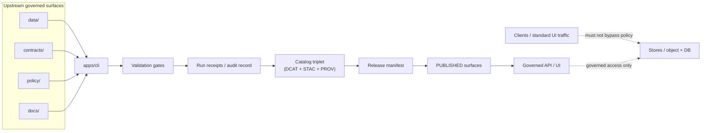

<!-- [KFM_META_BLOCK_V2]
doc_id: kfm://doc/<TODO-UUID>
title: KFM CLI
type: standard
version: v1
status: draft
owners: <TODO: confirm owners>
created: <TODO: confirm YYYY-MM-DD>
updated: <TODO: confirm YYYY-MM-DD>
policy_label: <TODO: confirm public|restricted|...>
related: [../../README.md, ../../data/, ../../contracts/, ../../policy/, ../../docs/, ../../tests/]
tags: [kfm, cli, governance, promotion, migration]
notes: [Mounted apps/cli subtree was not directly visible in this session; apps/cli role is documented, but exact command inventory, local files, and ownership need verification; some planning materials also reference packages/cli.]
[/KFM_META_BLOCK_V2] -->

# KFM CLI

_Governed command-line surface for promotion, migration, validation, and receipt-bearing operational work in Kansas Frontier Matrix._

| Field | Value |
|---|---|
| Status | **experimental** |
| Owners | **TODO — confirm** |
| Repo path | `apps/cli/README.md` |
| Working posture | **CONFIRMED / INFERRED / PROPOSED / UNKNOWN / NEEDS VERIFICATION** |
| Merge readiness | **Requires subtree verification before commit** |


**Quick jump:** [Scope](#scope) · [Repo fit](#repo-fit) · [Inputs](#accepted-inputs) · [Exclusions](#exclusions) · [Directory tree](#directory-tree) · [Quickstart](#quickstart) · [Usage](#usage) · [Diagram](#diagram) · [Tables](#tables) · [Task list](#task-list) · [FAQ](#faq) · [Appendix](#appendix)

> [!IMPORTANT]
> This README is source-grounded, but the mounted `apps/cli/` subtree was **not** directly visible in this session. Treat concrete filenames, command names, owners, and sibling links below as review-ready scaffolding until checked against the live repository.

> [!NOTE]
> In KFM, a CLI is not a convenience bypass. It should help enforce the truth path, promotion gates, receipts, and release discipline—not silently route around them.

## Scope

**CONFIRMED**

This directory is documented as the CLI surface inside the KFM app plane, with a role centered on **data promotion** and **migration-style operational work**.

**INFERRED**

Because KFM’s promotion contract requires identity/versioning checks, rights and sensitivity handling, catalog-triplet validation, QA thresholds, run receipts, and release manifests, the CLI is a natural steward-facing place to initiate or inspect those flows.

**PROPOSED**

This README treats `apps/cli/` as the home for human-invoked, release-aware operational commands that coordinate with contracts, policy, data zones, and audit artifacts.

## Repo fit

### Path

`apps/cli/README.md`

### Upstream surfaces

These are the repo-level surfaces this directory should be expected to read from or align with.

| Surface | Link | Why it is upstream |
|---|---|---|
| Root project context | [`../../README.md`](../../README.md) | System identity, doctrine, and high-level flow. |
| Contracts | [`../../contracts/`](../../contracts/) | Shared machine-readable contract families and route descriptions. |
| Policy | [`../../policy/`](../../policy/) | Fail-closed policy bundles, fixtures, and decision logic. |
| Data | [`../../data/`](../../data/) | Truth-path zones, registry entries, catalogs, and publishable artifacts. |
| Docs | [`../../docs/`](../../docs/) | Runbooks, ADRs, architecture notes, and operator guidance. |

### Downstream surfaces

These are the surfaces this directory should help feed, verify, or unblock.

| Surface | Link | Why it is downstream |
|---|---|---|
| Tests | [`../../tests/`](../../tests/) | Contract, policy, integration, and end-to-end checks should exercise CLI behavior. |
| Tools | [`../../tools/`](../../tools/) | Validators, hashers, and helper utilities are likely invoked by or alongside the CLI. |
| Infra | [`../../infra/`](../../infra/) | Promotion and deployment steps eventually meet release-bearing runtime infrastructure. |
| Published surfaces | _NEEDS VERIFICATION_ | CLI-driven promotion should contribute to governed publication, not replace it. |
| App-plane consumers | _NEEDS VERIFICATION_ | Exact sibling app links should be added after the mounted `apps/` tree is inspected. |

## Accepted inputs

This directory should accept or coordinate the kinds of inputs that are meaningful in a governed release flow.

| Belongs here | Examples | Posture |
|---|---|---|
| Release-bearing identifiers | `dataset_id`, `dataset_version_id`, run IDs, release IDs | **CONFIRMED fit** |
| Artifact references | processed outputs, manifests, receipts, catalog paths | **CONFIRMED fit** |
| Contract references | JSON Schema, OpenAPI, STAC/DCAT/PROV validation targets | **INFERRED fit** |
| Policy references | policy labels, obligation checks, approval context, redaction requirements | **INFERRED fit** |
| Migration targets | environment class, store target, schema or data migration intent | **CONFIRMED fit** |
| Audit context | reviewer identity, promotion reason, release notes, rollback reference | **INFERRED fit** |

## Exclusions

This directory should **not** become a dumping ground for unrelated scripts or an ungoverned operator backdoor.

| Does **not** belong here | Where it goes instead | Why |
|---|---|---|
| Public or end-user request handling | Governed API / UI surfaces | CLI is not a public truth surface. |
| Silent publication without gates | Nowhere | Promotion must remain governed, reviewable, and receipt-backed. |
| Long-lived business rules hidden only in scripts | `packages/`, `contracts/`, `policy/` | KFM keeps law in explicit contracts and packages, not shell glue alone. |
| Normal client access that bypasses policy | Forbidden by design | Trust membrane rules apply to public/standard client access. |
| Flat utility sprawl (`misc`, `helpers`, `random-scripts`) | Structured command groups with docs and tests | Prevents drift and weak ownership. |

## Directory tree

Mounted subtree visibility was unavailable, so this is a **review scaffold**, not a claimed live inventory.

```text
apps/cli/
├── README.md                        # this document
├── <entrypoint>                     # UNKNOWN — verify actual executable surface
├── <commands/>                      # PROPOSED — promote / migrate / validate / receipts
├── <examples-or-fixtures/>          # PROPOSED — minimal operator examples
├── <local-docs-or-command-notes/>   # PROPOSED — per-command guidance if the subtree stays large
└── <tests-link-or-references>       # PROPOSED — pair CLI behavior with repo-level tests
```

> [!TIP]
> If the live repo already uses another placement for some CLI-adjacent logic—especially provenance or attestation work—sync this tree to the mounted structure rather than forcing a redesign from the README.

## Quickstart

> [!CAUTION]
> The commands below are **pseudocode**. Replace `<cli>` with the verified entrypoint, package manager, and flag names from the mounted repository before merge.

```bash
# PSEUDOCODE — verify actual entrypoint in the live repo
<cli> help

# Validate a release-bearing artifact or spec
<cli> validate --artifact <path/to/artifact-or-spec>

# Promote a dataset version through governed gates
<cli> promote \
  --dataset-id <dataset_id> \
  --dataset-version-id <dataset_version_id>

# Run a migration or inspect migration state
<cli> migrate --target <environment-or-store>

# Inspect receipts or audit context for a prior run
<cli> receipts show --run <run_id>
```

### Expected operator preconditions

1. Work from a clean, reviewable branch.
2. Confirm the command maps to a governed artifact flow, not an ad hoc shortcut.
3. Ensure required contracts, policy bundles, and validation assets are present.
4. Capture receipts, manifests, and any release evidence the flow emits.
5. Do not treat a successful local run as publish authorization by itself.

## Usage

The exact subcommand inventory remains **NEEDS VERIFICATION**, but the directory’s command families should be organized around KFM’s release discipline.

| Command family | Why it belongs | Expected outputs / side effects | Posture |
|---|---|---|---|
| `promote` | Move validated artifacts through governed promotion steps | receipts, release manifest references, catalog updates, audit trail | **CONFIRMED fit** |
| `migrate` | Handle schema or data lifecycle evolution with rollback awareness | migration records, SQL or data-move traces, reviewable logs | **CONFIRMED fit** |
| `validate` | Run contract, catalog, quality, and gate checks before promotion | validation reports, failure details, machine-readable pass/fail | **INFERRED / PROPOSED local ownership** |
| `receipts` / `audit` | Inspect or emit receipt-bearing operator evidence | run records, audit references, provenance bundles | **INFERRED / PROPOSED local ownership** |
| `policy` | Trigger or summarize fail-closed policy evaluations | obligation results, deny reasons, gate summaries | **INFERRED / PROPOSED local ownership** |
| `doctor` / `status` | Give maintainers a safe preflight view of the local operator state | environment summary, missing inputs, blocked gates | **PROPOSED** |

### Working rule

A CLI command here should answer at least one of these questions:

- What is being promoted or migrated?
- Which gates were checked?
- Which receipts or manifests were emitted?
- What failed, and where is the review trail?
- How is rollback or correction kept visible?

If a command cannot answer those questions, it likely belongs elsewhere or needs a stronger contract.

## Diagram


```mermaid
flowchart LR
    subgraph U["Upstream governed surfaces"]
        D["data/"]
        C["contracts/"]
        P["policy/"]
        Docs["docs/"]
    end

    CLI["apps/cli"]
    V["Validation gates"]
    R["Run receipts / audit record"]
    T["Catalog triplet<br/>(DCAT + STAC + PROV)"]
    M["Release manifest"]
    Pub["PUBLISHED surfaces"]
    API["Governed API / UI"]

    D --> CLI
    C --> CLI
    P --> CLI
    Docs --> CLI

    CLI --> V
    V --> R
    R --> T
    T --> M
    M --> Pub
    Pub --> API

    Clients["Clients / standard UI traffic"] -. "must not bypass policy" .-> Stores["Stores / object + DB"]
    API -. "governed access only" .-> Stores
```

## Tables

### Artifact touchpoints

| Artifact | CLI relationship | Required before publish | Notes |
|---|---|---|---|
| Dataset spec / registry entry | Input | Yes | Identity and spec context should be stable before promotion. |
| Policy label / obligations | Input / gate | Yes, when applicable | Sensitivity and redaction cannot be bolted on after release. |
| Validation report | Output | Yes | Failed checks should stop the flow cleanly. |
| Run receipt / audit record | Output | Yes | KFM treats these as operational trust objects. |
| Catalog triplet | Output / validation target | Yes | Discovery, asset access, and lineage closure stay cross-linked. |
| Release manifest | Output | Yes | Promotion should be recorded as a governed event. |
| Rollback / correction reference | Output when relevant | Situational but critical | Destructive or release-significant operations need a reversal story. |

### Claim posture in this README

| Claim type | How this README treats it |
|---|---|
| Repo-level surfaces such as `data/`, `contracts/`, `policy/`, `docs/`, `tests/`, `tools/`, `infra/` | **CONFIRMED** |
| `apps/cli` as a documented CLI surface for promotion and migration | **CONFIRMED** |
| Exact command names, local files, and executable entrypoint | **UNKNOWN / NEEDS VERIFICATION** |
| Validation, receipts, and provenance as likely CLI-adjacent responsibilities | **INFERRED / PROPOSED** |
| Local subtree shape shown above | **PROPOSED** |

## Task list

### Definition of done for this README before merge

- [ ] Confirm the mounted `apps/cli/` subtree exists and replace the scaffolded tree with the real one.
- [ ] Replace all placeholder metadata in the KFM meta block.
- [ ] Replace pseudocode commands with the actual verified entrypoint and flags.
- [ ] Confirm exact upstream/downstream sibling links inside `apps/`.
- [ ] Add real badge targets if CI/status endpoints exist.
- [ ] Verify whether provenance-oriented CLI work lives in `apps/cli`, `packages/cli`, or both.
- [ ] Make sure no command documented here implies silent bypass of policy, receipts, or release manifests.
- [ ] Add at least one CLI-specific test or operator example link from `../../tests/` or adjacent docs.

### Review gates this directory should honor

- [ ] Fail closed when contract or policy checks are missing.
- [ ] Emit or reference receipts for release-significant operations.
- [ ] Keep destructive migration paths paired with rollback notes.
- [ ] Preserve the truth path; do not jump straight from ad hoc state to publication.
- [ ] Keep business rules in explicit packages/contracts/policy surfaces.

## FAQ

### Is this a public interface?

No. This directory is for steward-facing or operator-facing command-line work, not for normal end-user request traffic.

### Is the CLI allowed to publish directly from raw state?

No. KFM’s truth path is staged. A CLI may orchestrate movement, but it should not erase the distinction between `RAW`, `WORK/Quarantine`, `PROCESSED`, `CATALOG`, and `PUBLISHED`.

### Why are the command examples generic?

Because the mounted subtree was not directly visible in this session. This README avoids inventing a fake command surface.

### Why does this README mention both `apps/cli` and `packages/cli`?

The requested file path and repo-inventory documents point to `apps/cli`, but some planning material discusses CLI provenance work under `packages/cli`. The live repo should decide the truth; this README keeps that ambiguity visible until verified.

### What is the biggest anti-pattern for this directory?

Turning it into an operator backdoor: a place where unpublished, policy-sensitive, or release-significant actions happen without explicit contracts, receipts, or review context.

## Appendix

<details>
<summary><strong>Open verification checklist</strong></summary>

### Must verify in the mounted repo

- Actual executable entrypoint name and runtime
- Whether commands are grouped by subdirectory or a single entry surface
- Whether local tests or examples already exist
- Whether this directory owns validation directly or only shells out to `../../tools/`
- Whether provenance / attestation work is local here or elsewhere
- Whether adjacent app-plane directories should be linked explicitly

### Safe replacement targets

Replace these placeholders first:

- `<TODO-UUID>`
- owners
- created / updated dates
- policy label
- pseudocode command names
- proposed subtree placeholders

### Neighboring docs worth wiring once confirmed

- `../../README.md`
- `../../docs/`
- `../../contracts/`
- `../../policy/`
- `../../data/`
- `../../tests/`

</details>

[Back to top](#kfm-cli)
