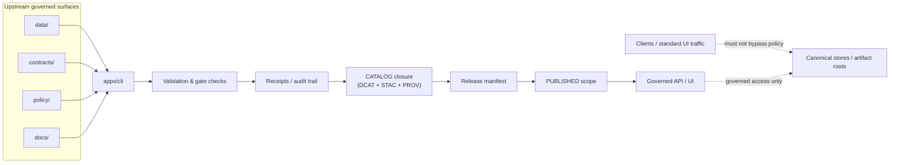

<!-- [KFM_META_BLOCK_V2]
doc_id: kfm://doc/<TODO-UUID>
title: KFM CLI
type: standard
version: v1
status: draft
owners: <TODO: confirm owners>
created: <TODO: confirm YYYY-MM-DD>
updated: <TODO: confirm YYYY-MM-DD>
policy_label: <TODO: confirm public|restricted|...>
related: [../../README.md, ../../data/, ../../contracts/, ../../policy/, ../../docs/, ../../tests/]
tags: [kfm, cli, governance, promotion, migration]
notes: [Mounted apps/cli subtree was not directly visible in this session; apps/cli is named in the corpus as a CLI surface for promotion and migration, but exact command inventory, local files, owners, and tests still need live-repo verification.]
[/KFM_META_BLOCK_V2] -->

# KFM CLI

_Governed command-line surface for promotion, migration, validation, and receipt-bearing operational work in Kansas Frontier Matrix._

| Field | Value |
|---|---|
| Status | **experimental** |
| Owners | **TODO — confirm** |
| Repo path | `apps/cli/README.md` |
| Working posture | **CONFIRMED / INFERRED / PROPOSED / UNKNOWN / NEEDS VERIFICATION** |
| Merge readiness | **Requires subtree verification before commit** |


**Quick jump:** [Scope](#scope) · [Repo fit](#repo-fit) · [Accepted inputs](#accepted-inputs) · [Exclusions](#exclusions) · [Directory tree](#directory-tree) · [Quickstart](#quickstart) · [Usage](#usage) · [Diagram](#diagram) · [Tables](#tables) · [Task list](#task-list) · [FAQ](#faq) · [Appendix](#appendix)

> [!IMPORTANT]
> This README is doctrine-grounded, but the mounted `apps/cli/` subtree was **not** directly visible in this session. Treat concrete filenames, command names, owners, package-manager assumptions, and sibling links below as **review-ready scaffolding** until checked against the live repository.

> [!NOTE]
> In KFM, a CLI is not a convenience bypass. It should help enforce the truth path, promotion gates, receipts, and release discipline—not silently route around them.

## Scope

The role of this directory is narrow on purpose: it is the steward-facing or operator-facing command surface for governed operational work.

**CONFIRMED**

A current KFM documentation compendium explicitly names `apps/cli` as the place for **CLI tools for data promotion, migration, etc.** That aligns with the broader KFM doctrine that promotion is a governed state change, not an informal file move.

**CONFIRMED**

KFM’s canonical truth path is staged:

`Source edge -> RAW -> WORK / QUARANTINE -> PROCESSED -> CATALOG -> PUBLISHED`

Promotion across that path is expected to carry typed artifacts such as dataset versions, catalog closure, decision records, release manifests, evidence bundles, and correction notices.

**INFERRED**

Given that doctrine, `apps/cli/` is best treated as the human-invoked operational surface that coordinates validation, migration, promotion, and audit-bearing maintenance work across data, contracts, policy, and release artifacts.

**PROPOSED**

This README assumes the CLI remains a **steward tool**, not a public interface and not the normal access path for standard clients.

## Repo fit

These path expectations follow the requested target path and the corpus’s documented module surfaces. Verify the actual neighboring tree before merge.

### Path

`apps/cli/README.md`

### Upstream surfaces

| Surface | Link | Why it is upstream |
|---|---|---|
| Root project context | [`../../README.md`](../../README.md) | System identity, doctrine, and high-level lifecycle. |
| Contracts | [`../../contracts/`](../../contracts/) | Shared machine-checkable contract families and examples. |
| Policy | [`../../policy/`](../../policy/) | Reason codes, obligation logic, deny-by-default evaluation, and release constraints. |
| Data | [`../../data/`](../../data/) | Truth-path zones, versioned artifacts, catalog material, and publishable outputs. |
| Docs | [`../../docs/`](../../docs/) | Runbooks, ADRs, architecture notes, and steward guidance. |

### Downstream surfaces

| Surface | Link | Why it is downstream |
|---|---|---|
| Tests | [`../../tests/`](../../tests/) | CLI behavior should be exercised by contract, policy, integration, and end-to-end checks. |
| Tools | [`../../tools/`](../../tools/) | Validators, hashers, and support utilities are likely called by or alongside CLI flows. |
| Infra | [`../../infra/`](../../infra/) | Promotion and migration eventually intersect deployment and release-bearing infrastructure. |
| Published runtime surfaces | `../../data/` and governed APIs | CLI-driven promotion should feed governed publication, not replace it. |
| Adjacent `apps/` surfaces | **NEEDS VERIFICATION** | Exact sibling links should be added after the mounted `apps/` tree is inspected. |

## Accepted inputs

This directory should accept or coordinate the kinds of inputs that matter in governed release flow.

| Belongs here | Examples | Posture |
|---|---|---|
| Release-bearing identifiers | `dataset_id`, `dataset_version_id`, run IDs, release IDs | **CONFIRMED fit** |
| Artifact references | processed outputs, manifests, receipts, catalog paths | **CONFIRMED fit** |
| Contract references | schema targets, standards profiles, payload examples | **INFERRED fit** |
| Policy references | policy labels, obligations, reviewer context, redaction requirements | **INFERRED fit** |
| Migration targets | environment class, store target, schema or data migration intent | **CONFIRMED fit** |
| Audit context | reviewer identity, promotion reason, rollback reference, release notes | **INFERRED fit** |

## Exclusions

This directory should **not** become a dumping ground for unrelated scripts or an ungoverned operator backdoor.

| Does **not** belong here | Where it goes instead | Why |
|---|---|---|
| Public or end-user request handling | Governed API / UI surfaces | CLI is not a public truth surface. |
| Silent publication without gates | Nowhere | KFM promotion is governed, reviewable, and receipt-backed. |
| Long-lived business rules hidden only in scripts | `../../contracts/`, `../../policy/`, shared packages | KFM keeps law in explicit contracts and policy surfaces, not shell glue alone. |
| Normal client access that bypasses policy | Forbidden by design | Trust membrane rules apply to public and standard client access. |
| Flat utility sprawl (`misc`, `helpers`, `random-scripts`) | Structured command groups with docs and tests | Prevents drift, weak ownership, and undocumented side effects. |

## Directory tree

Mounted subtree visibility was unavailable, so this is a **review scaffold**, not a claimed live inventory.

```text
apps/cli/
├── README.md                        # this document
├── <entrypoint>                     # UNKNOWN — verify actual executable surface
├── <command-groups/>                # INFERRED — promote / migrate / validate / receipts
├── <examples-or-fixtures/>          # PROPOSED — minimal operator examples
└── <docs-or-command-notes/>         # PROPOSED — per-command notes if the surface grows
```

> [!TIP]
> If the live repo already places some CLI-adjacent logic outside `apps/cli/`, revise this tree to match the mounted structure instead of forcing the code to mimic placeholder documentation.

## Quickstart

> [!CAUTION]
> The commands below are **pseudocode**. Replace `<cli>` with the verified entrypoint, package manager, and flag names from the mounted repository before merge.

```bash
# PSEUDOCODE — verify actual entrypoint in the live repo
<cli> --help

# Validate a release-bearing artifact or spec
<cli> validate --artifact <path/to/artifact-or-spec>

# Promote a dataset version through governed gates
<cli> promote \
  --dataset-id <dataset_id> \
  --dataset-version-id <dataset_version_id>

# Run or inspect a migration
<cli> migrate --target <environment-or-store>

# Inspect receipts or audit context for a prior run
<cli> receipts show --run <run_id>
```

### Expected operator preconditions

1. Work from a clean, reviewable branch.
2. Confirm the command maps to a governed artifact flow, not an ad hoc shortcut.
3. Ensure required contracts, policy bundles, and validation assets are present.
4. Capture receipts, manifests, and any release evidence the flow emits.
5. Do not treat a successful local run as publish authorization by itself.

## Usage

The exact subcommand inventory remains **NEEDS VERIFICATION**, but the directory’s likely command families can still be organized around KFM’s release discipline.

| Command family | Why it belongs | Expected outputs / side effects | Posture |
|---|---|---|---|
| `promote` | Move validated artifacts through governed promotion steps | receipts, release-manifest references, catalog updates, audit trail | **CONFIRMED fit** |
| `migrate` | Handle schema or data lifecycle evolution with rollback awareness | migration records, reviewable logs, reversible change notes | **CONFIRMED fit** |
| `validate` | Run contract, catalog, quality, and gate checks before promotion | validation reports, failure details, machine-readable pass/fail | **INFERRED fit** |
| `receipts` / `audit` | Inspect or emit receipt-bearing operator evidence | run records, audit references, provenance links | **INFERRED / PROPOSED** |
| `policy` | Trigger or summarize deny-by-default policy evaluations | obligation results, deny reasons, gate summaries | **INFERRED / PROPOSED** |
| `doctor` / `status` | Give maintainers a safe preflight view of local operator state | environment summary, missing inputs, blocked gates | **PROPOSED** |

### Working rule

A CLI command here should answer at least one of these questions:

- What is being promoted or migrated?
- Which gates were checked?
- Which receipts or manifests were emitted?
- What failed, and where is the review trail?
- How is rollback or correction kept visible?

If a command cannot answer those questions, it likely belongs elsewhere or needs a stronger contract.

## Diagram


```mermaid
flowchart LR
    subgraph U["Upstream governed surfaces"]
        D["data/"]
        C["contracts/"]
        P["policy/"]
        Docs["docs/"]
    end

    CLI["apps/cli"]
    V["Validation & gate checks"]
    R["Receipts / audit trail"]
    T["CATALOG closure<br/>(DCAT + STAC + PROV)"]
    M["Release manifest"]
    Pub["PUBLISHED scope"]
    API["Governed API / UI"]

    D --> CLI
    C --> CLI
    P --> CLI
    Docs --> CLI

    CLI --> V
    V --> R
    R --> T
    T --> M
    M --> Pub
    Pub --> API

    Clients["Clients / standard UI traffic"] -. "must not bypass policy" .-> Stores["Canonical stores / artifact roots"]
    API -. "governed access only" .-> Stores
```

## Tables

### Artifact touchpoints

| Artifact | CLI relationship | Required before publish | Notes |
|---|---|---|---|
| Dataset spec / registry entry | Input | Yes | Identity and spec context should be stable before promotion. |
| Policy label / obligations | Input / gate | Yes, when applicable | Sensitivity and redaction cannot be bolted on after release. |
| Validation report | Output | Yes | Failed checks should stop the flow cleanly. |
| Run receipt / audit record | Output | Yes | KFM treats these as operational trust objects. |
| Catalog closure / triplet | Output / validation target | Yes | Discovery, asset access, and lineage closure stay cross-linked. |
| Release manifest | Output | Yes | Promotion should be recorded as a governed event. |
| Rollback / correction reference | Output when relevant | Situational but critical | Destructive or release-significant actions need a reversal story. |

### Claim posture in this README

| Claim type | How this README treats it |
|---|---|
| `apps/cli` as a documented CLI surface for promotion and migration | **CONFIRMED** |
| KFM truth path, promotion discipline, fail-closed posture, and receipt-bearing release expectations | **CONFIRMED** |
| Exact command names, flags, local files, and executable entrypoint | **UNKNOWN / NEEDS VERIFICATION** |
| Validation, receipts, and policy evaluation as likely CLI-adjacent responsibilities | **INFERRED / PROPOSED** |
| Local subtree shape shown above | **PROPOSED** |

## Task list

### Definition of done for this README before merge

- [ ] Confirm the mounted `apps/cli/` subtree exists and replace the scaffolded tree with the real one.
- [ ] Replace all placeholder metadata in the KFM meta block.
- [ ] Replace pseudocode commands with the actual verified entrypoint and flags.
- [ ] Confirm exact upstream/downstream sibling links inside `apps/`.
- [ ] Add real badge targets if CI or status endpoints exist.
- [ ] Verify whether receipt or provenance-oriented CLI work lives in `apps/cli/`, another package surface, or both.
- [ ] Make sure no documented command implies silent bypass of policy, receipts, or release manifests.
- [ ] Add at least one CLI-specific test, example, or runbook link from `../../tests/` or adjacent docs.

### Review gates this directory should honor

- [ ] Fail closed when contract or policy checks are missing.
- [ ] Emit or reference receipts for release-significant operations.
- [ ] Keep destructive migration paths paired with rollback notes.
- [ ] Preserve the truth path; do not jump straight from ad hoc state to publication.
- [ ] Keep business rules in explicit packages, contracts, or policy surfaces.

## FAQ

### Is this a public interface?

No. This directory is for steward-facing or operator-facing command-line work, not for normal end-user request traffic.

### Is the CLI allowed to publish directly from raw state?

No. KFM’s truth path is staged. A CLI may orchestrate movement, but it should not erase the distinction between `RAW`, `WORK / QUARANTINE`, `PROCESSED`, `CATALOG`, and `PUBLISHED`.

### Why are the command examples generic?

Because the mounted subtree was not directly visible in this session. This README avoids inventing a fake command surface.

### Why is hydrology mentioned in a CLI README?

Because current KFM doctrine repeatedly treats hydrology as the preferred first governed thin slice: public-safe, place/time-rich, and operationally legible. That affects which end-to-end CLI flows should likely be proven first.

### What is the biggest anti-pattern for this directory?

Turning it into an operator backdoor: a place where unpublished, policy-sensitive, or release-significant actions happen without explicit contracts, receipts, or review context.

## Appendix

<details>
<summary><strong>Open verification checklist</strong></summary>

### Must verify in the mounted repo

- Actual executable entrypoint name and runtime
- Whether commands are grouped by subdirectory or exposed through one entry surface
- Whether local tests or examples already exist
- Whether this directory owns validation directly or shells out to `../../tools/`
- Whether adjacent app-plane directories should be linked explicitly
- Whether any existing README template or badge pattern should be mirrored here

### Safe replacement targets

Replace these placeholders first:

- `<TODO-UUID>`
- owners
- created / updated dates
- policy label
- pseudocode command names
- proposed subtree placeholders

### Neighboring docs worth wiring once confirmed

- `../../README.md`
- `../../docs/`
- `../../contracts/`
- `../../policy/`
- `../../data/`
- `../../tests/`

</details>

[Back to top](#kfm-cli)
