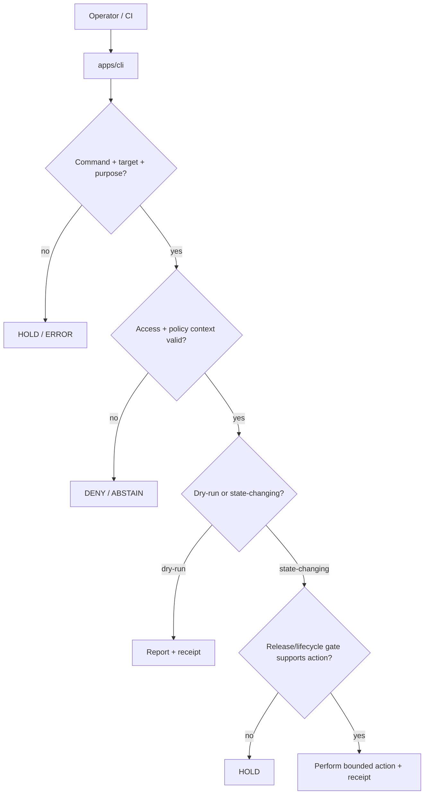

<!-- [KFM_META_BLOCK_V2]
doc_id: kfm://app/cli/readme
title: CLI App README
type: app-readme
version: v0.1
status: draft
owners: OWNER_TBD — Apps steward · CLI steward · Release steward · Pipeline steward · Policy steward · Docs steward
created: 2026-06-16
updated: 2026-06-16
policy_label: restricted
related:
  - ../README.md
  - ../governed-api/README.md
  - ../admin/README.md
  - ../review-console/README.md
  - ../../docs/doctrine/directory-rules.md
  - ../../docs/doctrine/lifecycle-law.md
  - ../../docs/security/AUDIT_INVARIANTS.md
  - ../../policy/access/README.md
  - ../../policy/decision/README.md
  - ../../policy/data/README.md
  - ../../packages/README.md
  - ../../tools/README.md
  - ../../scripts/README.md
  - ../../release/README.md
  - ../../data/README.md
tags: [kfm, apps, cli, operator-cli, validation, dry-run, ingest, diff, receipts, release-support, fail-closed]
notes:
  - "Replaces the short apps/cli stub with a governed app README."
  - "CLI is an operator/maintainer deployable surface for validation, dry-runs, ingest support, reports, and diffs; it must not become a public trust path or release shortcut."
  - "Implementation files, command inventory, runtime framework, tests, CI, package metadata, and consuming workflows remain NEEDS VERIFICATION."
[/KFM_META_BLOCK_V2] -->

<a id="top"></a>

<div align="center">

# CLI App

`apps/cli/`

**Maintainer/operator command surface for KFM validation, release dry-runs, ingest support, diffs, reports, and governed maintenance flows.**


[Purpose](#1-purpose) · [Repo fit](#2-repo-fit) · [Boundary](#3-authority-boundary) · [Inputs](#5-inputs) · [Exclusions](#6-exclusions) · [Command families](#7-command-families) · [Definition of done](#14-definition-of-done)

</div>

---

> [!IMPORTANT]
> **Status:** draft / `NEEDS VERIFICATION`  
> **Owners:** `OWNER_TBD` — Apps steward · CLI steward · Release steward · Pipeline steward · Policy steward · Docs steward  
> **Path:** `apps/cli/README.md`  
> **Responsibility root:** `apps/` — deployable application surfaces  
> **Truth posture:** CONFIRMED file path / CONFIRMED CLI role from `apps/README.md` / UNKNOWN implementation commands, framework, tests, CI, and deployment state

> [!CAUTION]
> `apps/cli/` is not a public client, not a publication authority, and not a shortcut around lifecycle gates. CLI commands may support validation, dry-runs, reports, diffs, and maintenance, but public-impacting transitions still require policy decisions, evidence closure, release records, correction paths, rollback targets, and auditable receipts.

---

## Quick jump

- [1. Purpose](#1-purpose)
- [2. Repo fit](#2-repo-fit)
- [3. Authority boundary](#3-authority-boundary)
- [4. Default posture](#4-default-posture)
- [5. Inputs](#5-inputs)
- [6. Exclusions](#6-exclusions)
- [7. Command families](#7-command-families)
- [8. Diagram](#8-diagram)
- [9. Decision vocabulary](#9-decision-vocabulary)
- [10. CLI obligations](#10-cli-obligations)
- [11. Command contract](#11-command-contract)
- [12. Inspection path](#12-inspection-path)
- [13. Validation expectations](#13-validation-expectations)
- [14. Definition of done](#14-definition-of-done)
- [15. Open verification items](#15-open-verification-items)

---

## 1. Purpose

`apps/cli/` is the deployable operator CLI lane for KFM.

It may eventually host long-lived, trust-bearing maintainer commands for:

- validation runs;
- release dry-runs;
- ingest support and intake checks;
- source, schema, contract, policy, and package diffs;
- receipt and proof inspection;
- report generation;
- maintenance workflows that are too important to remain one-off scripts.

The CLI should make governed work repeatable and auditable. It must not publish by itself, rewrite canonical state without a governed transition, or expose restricted lifecycle material to public clients.

[Back to top](#top)

---

## 2. Repo fit

| Concern | Owning root | Expected relationship |
|---|---|---|
| Operator CLI deployable | `apps/cli/` | This README and future CLI app code, if accepted |
| App-root boundary | `apps/README.md` | Defines CLI as operator app for validation, release dry-runs, reports, and maintenance flows |
| Public trust membrane | `apps/governed-api/` | Public clients use governed API; CLI is not public path |
| Admin app | `apps/admin/` | Restricted admin UI/surface, not CLI replacement |
| Review console | `apps/review-console/` | Steward review and promotion workspace |
| Shared code | `packages/` | Reusable helpers consumed by CLI |
| Repo-wide tools | `tools/` | Validators, generators, builders; CLI may invoke but should not duplicate |
| One-off scripts | `scripts/` | Temporary operational scripts; long-lived trust-bearing flows graduate to CLI/tools/packages |
| Release authority | `release/` | Release manifests, correction, supersession, rollback control |
| Lifecycle artifacts | `data/` | Receipts, proofs, catalog, triplets, published artifacts |

## 3. Authority boundary

The CLI may orchestrate governed checks. It must not own the authorities it checks.

```text
apps/cli/          = operator CLI deployable
apps/governed-api/ = normal public trust membrane
packages/          = reusable implementation libraries
tools/             = validators, generators, builders
scripts/           = one-off operational helpers
policy/            = allow / deny / restrict / abstain gates
schemas/           = machine-readable shape
contracts/         = object meaning
data/              = lifecycle artifacts, receipts, proofs, registries
release/           = publication, correction, rollback authority
```

## 4. Default posture

CLI commands should fail closed.

A command should return `DENY`, `HOLD`, `ABSTAIN`, or `ERROR` when any of these are unresolved:

- command purpose and target;
- authenticated operator or service identity, where required;
- command capability or role binding;
- source, schema, contract, or policy context;
- lifecycle stage;
- EvidenceRef / EvidenceBundle support;
- validation report;
- release state;
- rollback or correction target;
- output path and overwrite strategy;
- audit/receipt destination.

## 5. Inputs

| Input family | Examples | Required posture |
|---|---|---|
| Command context | subcommand, flags, profile, environment, dry-run mode | Explicit and logged |
| Actor context | local operator, CI service identity, maintenance account | Authenticated where consequential |
| Target context | source descriptor, schema, contract, data artifact, release candidate, package, policy bundle | Governed reference, not ad hoc path mutation |
| Lifecycle context | raw, work, quarantine, processed, catalog, triplet, published, candidate release | Explicit before read/write |
| Policy context | access, sensitivity, rights, decision outcome, reason code | Required for consequential action |
| Evidence context | EvidenceRef, EvidenceBundle, citation validation, proof pack | Required for claim-bearing checks |
| Output context | report path, receipt path, diff artifact, dry-run summary | Deterministic and reviewable |

## 6. Exclusions

| Does not belong here | Correct home |
|---|---|
| Shared library logic | `packages/` |
| Repo-wide validators/generators/builders | `tools/` |
| Temporary one-off scripts | `scripts/` |
| Public API implementation | `apps/governed-api/` |
| Admin UI or admin-only panels | `apps/admin/` |
| Steward review UI | `apps/review-console/` |
| Policy bundles | `policy/` |
| Schemas and contracts | `schemas/contracts/v1/`, `contracts/` |
| Lifecycle artifacts, receipts, proofs, catalog, triplets | `data/` |
| Release manifests, rollback cards, correction notices | `release/` |
| Secrets, credentials, tokens, private keys | Secret manager / deployment environment, not CLI source or examples |

## 7. Command families

Command names below are proposed examples, not implementation proof.

| Family | Purpose | Default posture |
|---|---|---|
| `validate` | Run schema, contract, policy, evidence, or package checks | Emits report/receipt; does not publish |
| `dry-run release` | Assemble release readiness diagnostics without crossing publication gate | Requires release candidate and rollback context |
| `ingest check` | Check source descriptor, rights, sensitivity, and intake prerequisites | Quarantine or hold unresolved sources |
| `diff` | Compare schemas, contracts, policy, source registry, release candidates, or generated outputs | Read-only unless explicit reviewed write path exists |
| `report` | Produce maintainer or steward reports | Redact sensitive details by default |
| `receipts inspect` | Inspect receipt/proof presence and linkage | Read-only, scoped, safe display |
| `maintenance` | Bounded upkeep tasks | Requires purpose, audit, and dry-run where possible |

## 8. Diagram


```mermaid
flowchart TD
    op["Operator / CI"] --> cli["apps/cli"]
    cli --> parse{"Command + target + purpose?"}
    parse -->|no| hold["HOLD / ERROR"]
    parse -->|yes| policy{"Access + policy context valid?"}
    policy -->|no| deny["DENY / ABSTAIN"]
    policy -->|yes| dry{"Dry-run or state-changing?"}
    dry -->|dry-run| report["Report + receipt"]
    dry -->|state-changing| gate{"Release/lifecycle gate supports action?"}
    gate -->|no| hold2["HOLD"]
    gate -->|yes| action["Perform bounded action + receipt"]
```

## 9. Decision vocabulary

| Decision | Meaning | Required behavior |
|---|---|---|
| `ALLOW` | Command may proceed for scoped target and purpose | Emit audit/receipt metadata where consequential |
| `DENY` | Access, policy, sensitivity, or lifecycle context blocks command | Return safe reason code |
| `RESTRICT` | Command may proceed only in read-only, redacted, dry-run, or narrowed mode | Preserve obligations downstream |
| `HOLD` | Required evidence, release, rollback, policy, or target support is missing | Do not perform consequential action |
| `ABSTAIN` | CLI cannot decide because support is unresolved | Preserve unresolved handles where safe |
| `ERROR` | Parse, validation, dependency, filesystem, or runtime failure | Fail closed and emit safe diagnostic output |

## 10. CLI obligations

| Obligation | Example effect |
|---|---|
| `dry_run_first` | Prefer dry-run for release and lifecycle-affecting commands |
| `receipt_required` | Consequential commands emit RunReceipt, ValidationReport, or equivalent artifact |
| `purpose_required` | Require ticket, review note, or CI run reference for state-changing commands |
| `no_publish_shortcut` | CLI cannot publish without release authority and rollback support |
| `redaction_required` | Reports hide sensitive fields by default |
| `deterministic_output` | Reports and diffs use stable ordering and stable IDs where practical |
| `safe_failure_required` | Fail closed with finite reason codes |
| `no_public_path` | CLI output is operator-facing unless explicitly released through governed path |

## 11. Command contract

Every long-lived command should document or encode:

- command name and purpose;
- accepted inputs and required flags;
- target object family;
- read-only, dry-run, or state-changing class;
- policy and access checks invoked;
- receipt/report output path;
- safe failure modes;
- rollback/correction relationship when relevant;
- test fixture coverage.

## 12. Inspection path

Implementation files, command inventory, tests, fixtures, package metadata, and CI remain `NEEDS VERIFICATION`.

```bash
find apps/cli -maxdepth 5 -type f | sort
find apps packages tools scripts policy release data tests fixtures -maxdepth 5 -type f 2>/dev/null | grep -Ei 'cli|command|validate|dry[-_ ]?run|ingest|diff|report|receipt|rollback' | sort
find docs runbooks docs/runbooks docs/security -maxdepth 5 -type f 2>/dev/null | grep -Ei 'cli|operator|validation|release|rollback|audit' | sort
```

## 13. Validation expectations

Useful validation for this app should cover:

- unknown command returns `ERROR` with safe help text;
- missing required target returns `HOLD` or `ERROR`;
- missing access or purpose for consequential command returns `DENY` or `HOLD`;
- release dry-run never writes `PUBLISHED` state;
- validation command emits deterministic report output;
- report commands redact sensitive data by default;
- state-changing commands require rollback/correction support;
- CLI cannot bypass policy, release, lifecycle, or EvidenceBundle gates.

## 14. Definition of done

- [ ] Owners are confirmed and `OWNER_TBD` is replaced.
- [ ] Command inventory is documented.
- [ ] CLI framework and package metadata are confirmed.
- [ ] Access/policy checks are implemented for consequential commands.
- [ ] Dry-run behavior is available for release/lifecycle-affecting flows.
- [ ] Receipts and reports are emitted for consequential commands.
- [ ] Tests and fixtures cover allow, deny, restrict, hold, abstain, and error paths.
- [ ] Sensitive report redaction is tested.
- [ ] Public-path bypass checks are covered.

## 15. Open verification items

| Item | Why it matters |
|---|---|
| Confirm implementation files beyond README | Prevents overclaiming CLI maturity |
| Confirm CLI framework and command entry point | Required for usable command surface |
| Confirm command inventory | Required for operator documentation and testing |
| Confirm receipt/report output homes | Required for auditability |
| Confirm release dry-run integration | Required before release-support claims |
| Confirm tests and fixtures | Required before enforcement claims |
| Confirm CI usage | Determines whether CLI is operator-only or CI-driven |
| Confirm secrets handling | Prevents credentials in command args, logs, or examples |

<details>
<summary>Appendix A — no-loss preservation note</summary>

The previous README was a short stub: `Maintainer commands: validation, release dry-runs, ingest, diff.` This replacement preserves that intent while adding governance boundaries, command-family expectations, fail-closed behavior, receipt posture, validation expectations, and open verification items.

It does not claim that command implementations, framework wiring, tests, fixtures, CI jobs, or release integration are present.

</details>

## Status summary

`apps/cli/` should become a governed operator CLI only when commands, tests, fixtures, receipts, and release/lifecycle boundaries are verified.

It should support validation, dry-runs, ingest checks, diffs, reports, and maintenance without becoming a public path, release authority, lifecycle store, policy root, schema/contract home, or shortcut around governed publication controls.

<p align="right"><a href="#top">Back to top</a></p>
