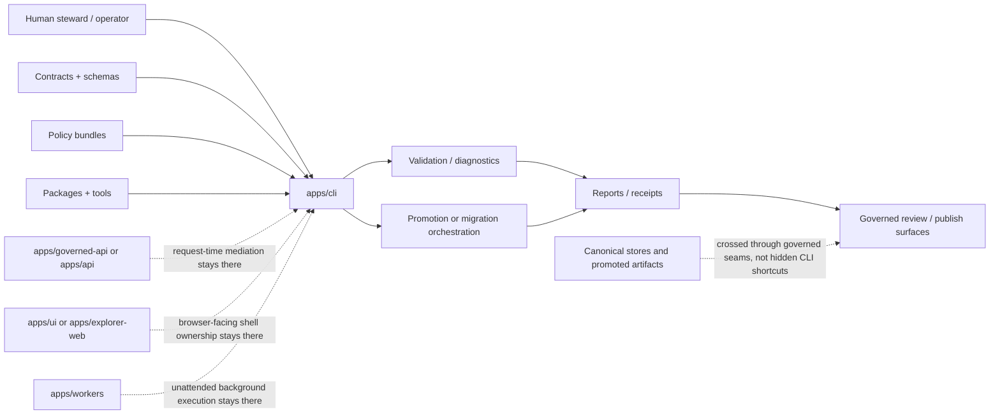

<!-- [KFM_META_BLOCK_V2]
doc_id: kfm://doc/<TODO-UUID>
title: KFM CLI
type: standard
version: v1
status: review
owners: @bartytime4life
created: 2026-02-21
updated: 2026-04-12
policy_label: public
related: [../README.md, ../workers/README.md, ../review-console/README.md, ../governed-api/README.md, ../api/README.md, ../ui/README.md, ../explorer-web/README.md, ../../README.md, ../../contracts/README.md, ../../schemas/README.md, ../../policy/README.md, ../../tests/README.md, ../../packages/README.md, ../../.github/workflows/README.md, ../../.github/CODEOWNERS]
tags: [kfm, apps, cli, governance, operator-lane, promotion]
notes: [Current public main directly shows apps/cli with README.md only. Public app-family siblings now visibly include api, explorer-web, governed-api, review-console, ui, and workers. Executable entrypoint, tests, emitted proof objects, and deeper CLI-local topology still need active-branch verification.]
[/KFM_META_BLOCK_V2] -->

# KFM CLI

Governed operator-lane boundary for local tooling, diagnostics, proof-pack helpers, and any future CLI surfaces under `apps/cli/`.

**Status:** experimental **Owners:** [`@bartytime4life`](../../.github/CODEOWNERS) **Badges:**       

**Quick jump:** [Scope](#scope) · [Repo fit](#repo-fit) · [Inputs](#inputs) · [Exclusions](#exclusions) · [Directory tree](#directory-tree) · [Quickstart](#quickstart) · [Usage](#usage) · [Diagram](#diagram) · [Reference tables](#reference-tables) · [Task list](#task-list) · [FAQ](#faq) · [Appendix](#appendix)

| Field | Value |
|---|---|
| Path | `apps/cli/README.md` |
| Repo fit | Child boundary README for the runtime-facing `apps/` family |
| Upstream | [`../README.md`](../README.md), [`../../README.md`](../../README.md) |
| CLI-local downstream | **NEEDS VERIFICATION** — no confirmed child CLI lanes are present here yet |
| Accepted inputs | Release-backed identifiers, artifact refs, migration targets, validation-safe diagnostics, receipt lookup context |
| Exclusions | Public request handling, hidden publish paths, unattended worker jobs, ad hoc business law, generic utility sprawl |
| Current public-main signal | `apps/cli/` exists on public `main`; `README.md` is still the only directly confirmed file at this path |
| Adjacent runtime surfaces | [`../explorer-web/README.md`](../explorer-web/README.md), [`../governed-api/README.md`](../governed-api/README.md), [`../api/README.md`](../api/README.md), [`../review-console/README.md`](../review-console/README.md), [`../ui/README.md`](../ui/README.md), [`../workers/README.md`](../workers/README.md) |
| Evidence boundary | March–April 2026 KFM doctrine plus current public-main repo inspection and public path-history verification; local-branch executable depth remains source-bounded |

> [!IMPORTANT]
> Treat this file as a **boundary contract first** and an **implementation index second**. Current public `main` proves that the CLI lane exists, but it does **not** yet prove a checked-in entrypoint, package-manager choice, command inventory, tests, or emitted proof objects under `apps/cli/`.

> [!NOTE]
> Human-invoked operator work belongs here. Request-time public traffic belongs in governed APIs, browser-facing shell ownership belongs in sibling runtime lanes, and unattended background execution belongs in worker or workflow lanes.

---

## Scope

`apps/cli/` is the operator-facing command-line boundary inside the runtime family documented by [`../README.md`](../README.md).

On current public `main`, two things are directly visible here:

1. `apps/cli/` is a real named app lane under `apps/`.
2. The directory is currently README-only in public view.

That means this README should do the honest thing: define what the lane is for, what it must never bypass, and what evidence must exist before command-specific documentation becomes more concrete.

### Stable laws carried into this boundary

| Stable law | Why it matters here |
|---|---|
| **CONFIRMED:** CLI is steward/operator-facing, not a public request surface | End-user traffic stays in governed API and UI surfaces. |
| **CONFIRMED:** Promotion is a governed state transition | A command finishing successfully is not publish authority by itself. |
| **CONFIRMED:** Contracts, schemas, policy, and shared packages own durable business law | CLI work should orchestrate against those surfaces, not replace them. |
| **CONFIRMED:** Receipts, manifests, review state, and correction lineage stay visible | Release-significant operator work must remain auditable. |
| **INFERRED:** Human-invoked command work and unattended background work should stay separate | Background retries, schedules, and projection jobs fit [`../workers/README.md`](../workers/README.md) or workflow lanes better. |

### What this README is not

This file is **not** proof that current public `main` already contains:

- a checked-in executable under `apps/cli/`
- a real subcommand tree
- app-local tests or fixtures under this directory
- a specific package manager, runtime, or build tool
- active workflow wiring or release automation bound to this path

Use this README to keep the boundary honest until the active branch proves more.

[Back to top](#kfm-cli)

---

## Repo fit

`apps/cli/` sits inside the runtime-facing `apps/` family, which on current public `main` visibly includes `api/`, `cli/`, `explorer-web/`, `governed-api/`, `review-console/`, `ui/`, and `workers/`. It should therefore behave like an app boundary, not like a generic scripts bucket.

### Boundary-first rule

1. Human-invoked operator flows stay explicit and receipted.
2. Request-time client traffic stays in governed APIs and shells.
3. Unattended background execution stays in worker or workflow lanes.
4. Reusable business law stays in packages, contracts, schemas, and policy.
5. Command docs remain source-bounded until a real entrypoint exists.

### Upstream and downstream links

| Direction | Path | Role |
|---|---|---|
| Upstream | [../README.md](../README.md) | Parent app-family boundary and shell law |
| Upstream | [../../README.md](../../README.md) | Repo-root posture and system identity |
| Upstream | [../../docs/README.md](../../docs/README.md) | Architecture, doctrine, ADRs, and runbooks |
| Upstream | [../../packages/README.md](../../packages/README.md) | Shared reusable logic boundary |
| Upstream | [../../contracts/README.md](../../contracts/README.md) | Contract families and examples |
| Upstream | [../../schemas/README.md](../../schemas/README.md) | Machine-checkable schema boundary |
| Upstream | [../../policy/README.md](../../policy/README.md) | Deny-by-default and obligation logic |
| Upstream | [../../tests/README.md](../../tests/README.md) | Verification burden and test placement |
| Upstream | [../../.github/workflows/README.md](../../.github/workflows/README.md) | Current public workflow-doc surface |
| Upstream | [../../infra/README.md](../../infra/README.md) | Deployment, queue, and environment-facing documentation |
| Downstream | [../explorer-web/README.md](../explorer-web/README.md) | Browser shell boundary |
| Downstream | [../review-console/README.md](../review-console/README.md) | Review and stewardship shell boundary |
| Downstream | [../governed-api/README.md](../governed-api/README.md) | Governed API boundary |
| Downstream | [../api/README.md](../api/README.md) | Public-main API lane root |
| Downstream | [../workers/README.md](../workers/README.md) | Background execution boundary |

> [!WARNING]
> Current public `main` exposes both `apps/governed-api/README.md` and an `apps/api/` path family. Keep CLI links explicit and treat final naming authority as **NEEDS VERIFICATION** on the active branch.

### Current sibling runtime surfaces

| Sibling surface | Why it matters to `apps/cli/` |
|---|---|
| [`../explorer-web/README.md`](../explorer-web/README.md) | Browser ownership stays outside CLI. |
| [`../review-console/README.md`](../review-console/README.md) | Approval, denial, rollback, and correction UI must remain trust-visible rather than buried in commands. |
| [`../governed-api/README.md`](../governed-api/README.md) and [`../api/README.md`](../api/README.md) | Request-time policy mediation, evidence shaping, and normal client access stay outside CLI. |
| [`../ui/README.md`](../ui/README.md) | Public-main repo-visible UI placeholder lane remains outside CLI ownership unless the checked-out branch proves a different split. |
| [`../workers/README.md`](../workers/README.md) | Once work becomes unattended, scheduled, or queue-driven, it belongs there instead of here. |

[Back to top](#kfm-cli)

---

## Inputs

The following inputs are appropriate for a CLI lane **if** code lands here.

| Input type | Status | Why it belongs |
|---|---|---|
| Release-backed identifiers (`dataset_id`, version refs, release refs, run IDs) | **CONFIRMED doctrine / local placement INFERRED** | CLI work should target governed objects, not ad hoc local state. |
| Artifact references (processed outputs, manifests, receipts, catalog paths) | **CONFIRMED doctrine / local placement INFERRED** | Operator flows frequently need to inspect or move proof-bearing artifacts. |
| Migration targets and environment selectors | **CONFIRMED doctrine / local placement INFERRED** | Migration is explicitly part of the documented CLI role. |
| Validation-safe diagnostic requests | **INFERRED** | Operator-facing diagnostics fit CLI better than public UI or request-time API lanes. |
| Receipt / audit lookup context | **INFERRED** | CLI is a natural place to inspect run context, rollback references, and audit summaries. |
| Fixture-backed examples | **PROPOSED** | Sample inputs and expected receipts make future commands reviewable and testable. |

### Accepted-input checklist

A CLI-bound command should usually answer these questions up front:

1. What governed object or release-backed scope does it touch?
2. Which contract, schema, or policy version defines the payload?
3. Which artifacts may it read?
4. Which receipts, manifests, or reports may it emit?
5. What is the fail-closed or rollback path if it misfires?

---

## Exclusions

The easiest way to weaken this directory is to let it become an operator backdoor.

| Exclusion | Why it is out of scope | Where it goes instead |
|---|---|---|
| Public or end-user request handling | CLI is not the public truth surface. | Governed API and app shell surfaces |
| Unattended background jobs | Human-invoked and background execution should stay distinct. | [`../workers/README.md`](../workers/README.md) and workflow lanes |
| Hidden publication without gates | Publication is a governance event, not a side effect. | Release, review, and policy-governed lanes |
| Durable business law embedded only in scripts | KFM keeps law explicit and inspectable. | [`../../contracts/README.md`](../../contracts/README.md), [`../../schemas/README.md`](../../schemas/README.md), [`../../policy/README.md`](../../policy/README.md), shared packages |
| Direct client or store bypasses | Trust membrane rules still apply here. | Governed APIs and promoted artifact paths |
| Browser-shell composition or placeholder UI-boundary reconciliation | CLI should not silently absorb browser-facing ownership. | [`../explorer-web/README.md`](../explorer-web/README.md) and [`../ui/README.md`](../ui/README.md) |
| Generic `misc/` or `helpers/` sprawl | Weak ownership and undocumented side effects accumulate fast. | Structured command groups with docs and tests once real code exists |

> [!WARNING]
> A CLI that can silently publish, silently “heal” missing proof, or silently bypass review is not a convenience. It is a trust-boundary bug.

[Back to top](#kfm-cli)

---

## Directory tree

### Current public `main` app-family snapshot

```text
apps/
├─ api/
├─ cli/
│  └─ README.md
├─ explorer-web/
├─ governed-api/
├─ review-console/
├─ ui/
├─ workers/
└─ README.md
```

> [!NOTE]
> GitHub’s public `apps/` tree currently also shows `apps/.codex/`. This README keeps the snapshot focused on named runtime lanes and the lane-level boundary README because current visible evidence does not establish `.codex/` as a public runtime surface.

### CLI-local tree

```text
apps/cli/
└─ README.md
```

### Documented expansion slots

The slots below are **not** confirmed live subdirectories. They are the most likely future fits if CLI code stays under `apps/cli/`.

| Candidate path | Status | Intended role |
|---|---|---|
| `apps/cli/commands/` | **PROPOSED** | Grouped command modules once a real entrypoint exists |
| `apps/cli/fixtures/` | **PROPOSED** | Reviewable sample inputs, receipts, and golden outputs |
| `apps/cli/docs/` | **PROPOSED** | Command-specific notes if the lane grows past one README |
| `apps/cli/tests/` | **PROPOSED / NEEDS VERIFICATION** | App-local smoke tests only if this repo keeps CLI tests here instead of `../../tests/` |

---

## Quickstart

These commands are intentionally **read-only**. They verify what exists before anyone documents more than the tree supports.

```bash
# from repo root
git rev-parse --short HEAD

printf '\n== app surface directories ==\n'
find apps -maxdepth 1 -mindepth 1 -type d | sort

printf '\n== cli-local inventory ==\n'
find apps/cli -maxdepth 2 -mindepth 1 | sort

printf '\n== current cli boundary doc ==\n'
sed -n '1,240p' apps/cli/README.md

printf '\n== parent apps boundary ==\n'
sed -n '1,240p' apps/README.md

printf '\n== nearby runtime seams ==\n'
sed -n '1,220p' apps/api/README.md
sed -n '1,220p' apps/ui/README.md
sed -n '1,220p' apps/workers/README.md
sed -n '1,220p' .github/workflows/README.md

printf '\n== search for concrete CLI entrypoints before documenting commands ==\n'
find . -maxdepth 4 \
  \( -path './.git' -prune \) -o \
  \( -type f \( -name 'package.json' -o -name 'pyproject.toml' -o -name 'go.mod' -o -name 'Cargo.toml' -o -name 'Justfile' -o -name 'Makefile' \) -print \) | sort

printf '\n== search for CLI-adjacent vocabulary ==\n'
grep -RInE '\b(cli|promote|promotion|migrate|migration|receipt|run_receipt|release_manifest|catalog_closure|validate)\b' \
  apps packages docs contracts policy tests tools scripts .github pipelines 2>/dev/null | head -n 200
```

### Sanity check before documenting real commands

```bash
# confirm whether active-branch CLI code exists before adding help/install snippets
find apps/cli -maxdepth 3 -mindepth 1 | sort
```

If that command returns only `apps/cli/README.md`, keep this README focused on the boundary and avoid pretending deeper structure is already mounted.

[Back to top](#kfm-cli)

---

## Usage

Use this file in four modes.

### 1. As a placement guide

Before adding code under `apps/cli/`, verify that the work is truly **human-invoked operator work** and not:

- reusable domain law for `../../packages/`
- request-time API logic for `../governed-api/` or `../api/`
- browser-shell composition or UI-boundary ownership for `../explorer-web/` or `../ui/`
- unattended background execution for `../workers/`

### 2. As an onboarding map

When a contributor asks, “Where should this operator flow live?”, this README should steer them toward the right seam:

- **CLI** if it is human-invoked, explicit, receipted operator work
- **UI / Explorer shell** if it is browser-facing shell composition or runtime route ownership
- **Workers** if it is unattended background execution
- **Governed API** if it is request-time trust mediation
- **Packages / contracts / policy** if it is reusable law or machine-checkable structure
- **Tests / fixtures** if it is proof of behavior

### 3. As a review checklist

Any real CLI lane added here should document:

- entrypoint and runtime
- accepted payload contract
- emitted receipts, manifests, or reports
- upstream dependencies
- failure posture
- rollback or correction path
- neighboring tests and fixtures
- why the work belongs in CLI rather than workers, API, or browser shells

### 4. As a drift detector

Use this README to catch repo-shape drift early. When `apps/README.md` changes, or when sibling runtime lanes such as `apps/api/` or `apps/ui/` move materially, this file should be re-read so it does not keep routing contributors with stale boundary assumptions.

### Command responsibilities once code lands

Literal subcommand names remain **UNKNOWN** on current public `main`, but the responsibility lanes are still clear.

| Responsibility lane | Current status | What a future CLI surface should emit or respect |
|---|---|---|
| Promotion orchestration | **CONFIRMED doctrine / command name UNKNOWN** | Run receipts, release-manifest refs, policy results, catalog-closure refs |
| Migration orchestration | **CONFIRMED doctrine / command name UNKNOWN** | Migration logs, rollback refs, target version notes |
| Validation preflight | **INFERRED local fit** | Validation reports, failure details, digest summaries |
| Receipt and audit inspection | **INFERRED local fit** | Run lookup, provenance refs, review-trail summaries |
| Environment / dependency diagnostics | **PROPOSED** | Blocked-gate summaries, missing tooling hints, safe preflight checks |

---

## Diagram


```mermaid
flowchart LR
    A[Human steward / operator] --> B[apps/cli]

    C[Contracts + schemas] --> B
    D[Policy bundles] --> B
    E[Packages + tools] --> B

    B --> F[Validation / diagnostics]
    B --> G[Promotion or migration orchestration]

    F --> H[Reports / receipts]
    G --> H
    H --> I[Governed review / publish surfaces]

    J[apps/governed-api or apps/api] -. request-time mediation stays there .-> B
    K[apps/ui or apps/explorer-web] -. browser-facing shell ownership stays there .-> B
    L[apps/workers] -. unattended background execution stays there .-> B
    M[Canonical stores and promoted artifacts] -. crossed through governed seams, not hidden CLI shortcuts .-> I
```

### Reading rule for the diagram

`apps/cli/` may participate in governed flow, but it should stay **human-invoked**, **boundary-aware**, and **downstream of contracts and policy**. It is not the sovereign truth layer, and it is not a hidden publish tunnel.

---

## Reference tables

### Current public-main CLI inventory

| Path | Current public-main signal | Interpretation |
|---|---|---|
| `apps/cli/` | Present | Named operator lane is real on current public `main` |
| `apps/cli/README.md` | Present | Boundary doc exists and should stay truthful about what is not yet proven |
| Other files under `apps/cli/` | None confirmed on public `main` | Do not invent entrypoints, flags, fixtures, or tests |
| `apps/README.md` | Present | Parent runtime boundary already reserves room for CLI, API, UI, explorer, review, and worker lanes |
| `apps/ui/README.md` | Present | Repo-visible UI placeholder exists, but it does not transfer browser-shell ownership into CLI |
| `../../.github/workflows/README.md` | Present | Public workflow-doc context exists, but that is not the same thing as proven CLI automation |

### Proof objects a CLI lane should respect

| Proof object | Why it matters | Posture |
|---|---|---|
| Release / dataset version refs | Target scope for governed promotion or migration | **CONFIRMED doctrine** |
| `validation_report` or equivalent gate output | Fail-closed evidence before movement | **CONFIRMED doctrine / local file UNKNOWN** |
| `run_receipt` | Operator audit trail and repeatability anchor | **CONFIRMED doctrine** |
| `release_manifest` | Release-scoped outward event record | **CONFIRMED doctrine** |
| Catalog closure / STAC–DCAT–PROV linkage | Publish-readiness boundary | **CONFIRMED doctrine** |
| Rollback or correction reference | Visible reversal story for release-significant work | **CONFIRMED doctrine** |

[Back to top](#kfm-cli)

---

## Task list

### Definition of done before merge

- [ ] Replace the meta-block placeholder `doc_id`.
- [ ] Keep sibling references aligned with `apps/README.md` whenever the public `apps/` family changes.
- [ ] If a real entrypoint now exists, replace the verification-first quickstart with actual install/help commands.
- [ ] Confirm whether CLI-local tests live under `apps/cli/`, `../../tests/`, or both.
- [ ] Confirm whether receipt or proof-pack helpers live here, in `../../packages/`, or in `../../tools/`.
- [ ] Recheck whether `apps/ui/` stays placeholder-only or changes enough that CLI routing language should move with it.
- [ ] Add real badge targets only after CI or release endpoints are verified.
- [ ] Keep any documented command from implying direct client/public access or silent publish behavior.

### Review gates this directory should honor

- [ ] Human-invoked flows stay distinct from worker/scheduler flows.
- [ ] Commands fail closed when required contracts, schemas, or policy bundles are missing.
- [ ] Release-significant operations emit or reference receipts and reviewable artifacts.
- [ ] Migration paths carry rollback notes or correction references.
- [ ] Reusable law stays in shared packages, contracts, schemas, or policy rather than drifting into CLI-only logic.
- [ ] Browser-facing shell ownership and API naming claims are not upgraded from README context into runtime fact without branch-local proof.

---

## FAQ

### Is `apps/cli/` confirmed on current public `main`?

Yes. The path exists, and public path history confirms that this README lane begins on current public history from 2026-02-21.

### Is there a confirmed executable under `apps/cli/` right now?

Not on the current public-main evidence reviewed for this revision. The path is real, but the CLI-local inventory is still README-only.

### Does current public `main` also expose `apps/ui/`?

Yes. It is visible as a sibling path, but its public-main state is also README-only, so it should not be used as proof that browser-shell ownership has been fully reassigned there.

### Does CLI replace governed API or workers?

No. CLI is the human-invoked operator lane. Governed APIs handle request-time trust mediation, and workers handle unattended background execution.

### Can the CLI publish directly from raw or ad hoc state?

No. KFM’s truth path remains staged, and promotion remains governed.

### What is the biggest anti-pattern here?

Turning `apps/cli/` into an operator backdoor that can bypass policy, skip receipts, or silently mutate release-bearing state.

---

## Appendix

<details>
<summary><strong>Active-branch verification checklist</strong></summary>

### Confirm on the exact branch before expanding this README

- real executable entrypoint name
- runtime / package-manager truth
- installed command groups or subcommands
- whether app-local tests or fixtures exist
- whether any CLI-local docs beyond this README exist
- whether `apps/governed-api/` or `apps/api/` is the final canonical neighbor name for outward API authority
- whether `apps/ui/` stays placeholder-only or starts carrying concrete runtime ownership that should change CLI routing language
- whether proof-pack helpers live here or in shared packages/tools

### Safe replacement targets

Replace these first when the active branch proves them:

- `<TODO-UUID>`
- any future command examples
- any future CLI-local tree entries beyond `README.md`

</details>

<details>
<summary><strong>When to keep this README small</strong></summary>

If `apps/cli/` stays README-only, keep this file boundary-focused.

If real CLI code lands, move command-specific detail into the code-owning paths and let this file stay the lane-level index.

</details>

[Back to top](#kfm-cli)