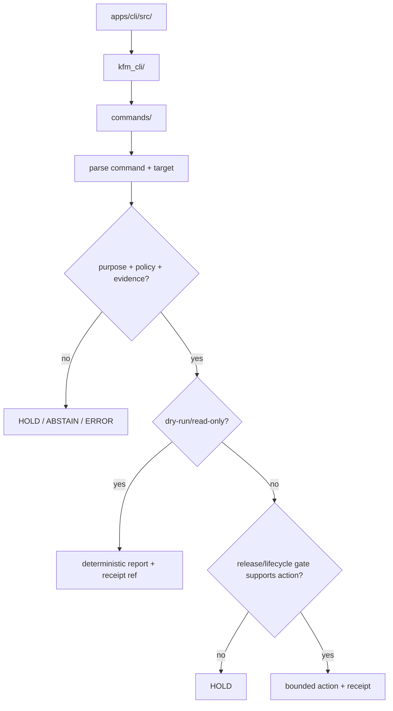

<!-- [KFM_META_BLOCK_V2]
doc_id: kfm://app/cli/src/readme
title: CLI App Source Tree README
type: app-readme
version: v0.2
status: draft
owners: OWNER_TBD — Apps steward · CLI steward · Release steward · Pipeline steward · Policy steward · Docs steward
created: 2026-06-16
updated: 2026-07-09
policy_label: restricted
related:
  - ../README.md
  - kfm_cli/README.md
  - kfm_cli/commands/README.md
  - ../../README.md
  - ../../governed-api/README.md
  - ../../admin/README.md
  - ../../review-console/README.md
  - ../../../README.md
  - ../../../SECURITY.md
  - ../../../policy/access/README.md
  - ../../../policy/decision/README.md
  - ../../../policy/data/README.md
  - ../../../packages/README.md
  - ../../../tools/README.md
  - ../../../tools/validators/README.md
  - ../../../tools/watchers/README.md
  - ../../../scripts/README.md
  - ../../../release/README.md
  - ../../../data/README.md
  - ../../../docs/security/AUDIT_INVARIANTS.md
tags: [kfm, apps, cli, src, python-src-layout, operator-cli, commands, validation, dry-run, receipts, fail-closed, no-publish-shortcut]
notes:
  - "v0.2 updates the uploaded CLI src README into a current repo-aware source-tree contract."
  - "apps/cli/src/README.md, apps/cli/src/kfm_cli/README.md, apps/cli/src/kfm_cli/commands/README.md, apps/cli/README.md, and an empty apps/cli/src/kfm_cli/__init__.py were verified through the GitHub app in this update. Implementation files, command inventory, CLI entry point, tests, fixtures, package metadata, receipt/report emission, CI, and release integration remain NEEDS VERIFICATION."
  - "src/ is an app implementation source-layout boundary only; it must not become a public path, release authority, lifecycle data store, policy root, schema/contract home, tools root, scripts root, shared package root, secret store, or source-of-truth record home."
  - "CLI source code should be dry-run-first, fail-closed, redacted-by-default, deterministic where practical, finite-outcome oriented, and unable to bypass policy, release, lifecycle, EvidenceBundle, correction, or rollback controls."
[/KFM_META_BLOCK_V2] -->

<a id="top"></a>

<div align="center">

# CLI App Source Tree

`apps/cli/src/`

**Source-layout boundary for the KFM operator CLI: importable CLI code may live here, while reusable libraries, validators, policy, lifecycle artifacts, release records, schemas, contracts, and public APIs remain in their owning roots.**


[Purpose](#1-purpose) · [Current evidence](#2-current-repo-evidence) · [Repo fit](#3-repo-fit) · [Boundary](#4-authority-boundary) · [Inputs](#6-inputs) · [Exclusions](#7-exclusions) · [Module map](#8-module-map) · [Definition of done](#15-definition-of-done)

</div>

---

> [!IMPORTANT]
> **Status:** draft / current README surface confirmed / implementation behavior `NEEDS VERIFICATION`  
> **Owners:** `OWNER_TBD` — Apps steward · CLI steward · Release steward · Pipeline steward · Policy steward · Docs steward  
> **Path:** `apps/cli/src/README.md`  
> **Responsibility root:** `apps/` — deployable application surfaces  
> **Truth posture:** CONFIRMED source-tree README path, child READMEs, and empty child `__init__.py` / PROPOSED source-tree contract / UNKNOWN implementation files, command inventory, tests, fixtures, CLI entry point, package metadata, CI, and release integration

> [!CAUTION]
> Code under `apps/cli/src/` must not publish, rewrite lifecycle state, approve release, weaken policy decisions, bypass EvidenceBundle closure, or expose restricted lifecycle material to public clients. It may orchestrate governed checks, dry-runs, reports, diffs, and receipt-oriented maintenance only within the CLI app boundary.

---

## Quick jump

- [1. Purpose](#1-purpose)
- [2. Current repo evidence](#2-current-repo-evidence)
- [3. Repo fit](#3-repo-fit)
- [4. Authority boundary](#4-authority-boundary)
- [5. Default posture](#5-default-posture)
- [6. Inputs](#6-inputs)
- [7. Exclusions](#7-exclusions)
- [8. Module map](#8-module-map)
- [9. Diagram](#9-diagram)
- [10. Source-tree obligations](#10-source-tree-obligations)
- [11. Import-surface expectations](#11-import-surface-expectations)
- [12. Inspection path](#12-inspection-path)
- [13. Validation expectations](#13-validation-expectations)
- [14. Safe change pattern](#14-safe-change-pattern)
- [15. Definition of done](#15-definition-of-done)
- [16. Open verification items](#16-open-verification-items)

---

## 1. Purpose

`apps/cli/src/` is the source-layout container for the KFM operator CLI app.

Its job is to hold importable application implementation modules, currently centered on `kfm_cli/`, that may eventually provide command parsing, command-family routing, dry-run orchestration, deterministic report output, receipt-oriented helpers, safe error handling, and adapters that invoke owning packages, tools, policy runtime, and release/lifecycle checks.

This source tree exists to support the deployable CLI app. It is not evidence that complete command implementations, tests, package metadata, command entry points, receipt/report emission, CI integration, or release integration already exist.

[Back to top](#top)

---

## 2. Current repo evidence

| Surface | Status | What it proves | What it does **not** prove |
|---|---|---|---|
| `apps/cli/src/README.md` | **CONFIRMED README** | This README exists and has been updated to v0.2. | Source implementation, command inventory, CLI entry point, package metadata, tests, fixtures, CI, or release integration. |
| `apps/cli/src/kfm_cli/README.md` | **CONFIRMED child module README** | The `kfm_cli` Python module boundary exists and has been updated to v0.2. | That command exports, framework wiring, or runnable CLI behavior exist. |
| `apps/cli/src/kfm_cli/commands/README.md` | **CONFIRMED child command README** | The command-family boundary exists and has been updated to v0.2. | That command modules, command help, tests, or entry points exist. |
| `apps/cli/src/kfm_cli/__init__.py` | **CONFIRMED empty file** | The package marker exists but contains no exports in the fetched content. | That CLI command implementation exists. |
| `apps/cli/README.md` | **CONFIRMED CLI app README** | Parent CLI app boundary exists and describes CLI as operator/maintainer surface for validation, dry-runs, ingest support, reports, and diffs. | That implementation commands, framework, tests, package metadata, or deployment state are verified. |
| Uploaded CLI src Markdown | **CONFIRMED source text for this update** | Provided the base source-tree contract updated here. | Does not prove live implementation. |
| Implementation files beyond README and empty `__init__.py` | **NEEDS VERIFICATION** | Checkable by repo scan, package metadata, tests, command help, and CI evidence. | Not claimed by this README. |

[Back to top](#top)

---

## 3. Repo fit

| Concern | Owning root | Expected relationship |
|---|---|---|
| CLI source tree | `apps/cli/src/` | Packaging/source-layout boundary for importable CLI app code. |
| CLI Python module | `apps/cli/src/kfm_cli/` | Python import module and implementation home. |
| Command modules | `apps/cli/src/kfm_cli/commands/` | Command-family modules, if implemented and tested. |
| Parent CLI app | `apps/cli/` | Operator CLI deployable boundary. |
| Public trust membrane | `apps/governed-api/` | Public clients use governed API, not CLI outputs. |
| Shared libraries | `packages/` | Reusable helpers should live here, not in app-private source. |
| Repo-wide tools | `tools/` | Validators, generators, and builders; CLI may invoke but should not fork. |
| Temporary scripts | `scripts/` | One-off operational helpers; durable command flows may graduate to CLI/tools/packages. |
| Policy gates | `policy/` | Access, sensitivity, rights, data, and decision policy. |
| Release authority | `release/` | Publication, correction, rollback control. |
| Lifecycle artifacts | `data/` | Receipts, proofs, catalog, triplets, and published artifacts. |
| Security posture | `SECURITY.md`, `docs/security/` | Secrets, audit, incident, exposure, and safe-output posture. |

[Back to top](#top)

---

## 4. Authority boundary

This source tree may contain CLI app code. It does not own the governance authorities that CLI commands inspect, validate, or request.

```text
apps/cli/src/           = CLI app source-layout boundary
apps/cli/src/kfm_cli/   = Python CLI module
apps/cli/src/kfm_cli/commands/ = command-family modules
apps/cli/               = operator CLI deployable
apps/governed-api/      = normal public trust membrane
packages/               = shared reusable libraries
tools/                  = validators, generators, builders
scripts/                = one-off operational helpers
policy/                 = finite policy decisions
schemas/                = machine-readable shape
contracts/              = object meaning
data/                   = lifecycle artifacts, receipts, proofs, registries
release/                = publication, correction, rollback authority
```

Safe interpretation:

- **CONFIRMED:** this README surface, child READMEs, and empty `kfm_cli/__init__.py` exist.
- **PROPOSED:** source modules may live here when they remain dry-run-first, fail-closed, redacted-by-default, finite-outcome oriented, and subordinate to governed roots.
- **NEEDS VERIFICATION:** implementation files, export surface, command inventory, framework wiring, CLI entry point, package metadata, tests, fixtures, report/receipt homes, CI usage, and release integration.
- **DENY:** using this source tree as a public path, release authority, lifecycle store, policy root, schema/contract home, shared library home, tools root, scripts root, secret store, or publication shortcut.

[Back to top](#top)

---

## 5. Default posture

Code in this source tree should be dry-run-first for consequential workflows and fail closed when support is unresolved.

A module or command handler should return `DENY`, `RESTRICT`, `HOLD`, `ABSTAIN`, or `ERROR` instead of performing a consequential action when any of these are missing or ambiguous:

- parsed command and target;
- command purpose or ticket/reference;
- actor or service identity where required;
- capability or role binding;
- lifecycle stage;
- source, schema, contract, policy, package, or release context;
- EvidenceRef / EvidenceBundle support;
- validation report;
- rollback or correction target;
- output path and overwrite strategy;
- receipt or audit destination;
- redaction and safe-display posture for terminal/report output.

[Back to top](#top)

---

## 6. Inputs

| Input family | Examples | Required posture |
|---|---|---|
| Command refs | command family, subcommand, flags, config profile, dry-run switch | Explicit and normalized. |
| Actor refs | operator, CI service identity, maintenance account | Authenticated where consequential. |
| Target refs | source descriptor, schema, contract, policy bundle, package, data artifact, release candidate | Governed reference, not ad hoc mutation. |
| Lifecycle refs | RAW, WORK, QUARANTINE, PROCESSED, CATALOG, TRIPLET, PUBLISHED, candidate release | Explicit before read/write. |
| Policy refs | access, rights, sensitivity, finite decision, reason code | Required before action. |
| Evidence refs | EvidenceRef, EvidenceBundle, citation validation, proof pack | Required for claim-bearing checks. |
| Output refs | stdout mode, report path, receipt path, diff artifact path | Deterministic and safe. |
| Rollback/correction refs | rollback card, correction notice, release ref, receipt ref, steward approval | Required for consequential mutation. |

[Back to top](#top)

---

## 7. Exclusions

| Does not belong here | Correct home |
|---|---|
| Shared reusable libraries | `packages/` |
| Repo-wide validators/generators/builders | `tools/` |
| Temporary one-off scripts | `scripts/` |
| Public API implementation | `apps/governed-api/` |
| Admin UI or restricted panels | `apps/admin/` |
| Steward review UI | `apps/review-console/` |
| Policy bundles | `policy/` |
| Schemas and contracts | `schemas/contracts/v1/`, `contracts/` |
| Lifecycle artifacts, receipts, proofs, catalog, triplets | `data/` |
| Release manifests, rollback cards, correction notices | `release/` |
| Secrets, credentials, tokens, private keys, signing material | secret manager / deployment environment, not CLI source or examples |
| Public-sensitive exports, exact sensitive locations, living-person/DNA details, or source-restricted records | denied unless separately governed and public-safe |

[Back to top](#top)

---

## 8. Module map

| Path | Responsibility | Status |
|---|---|---|
| `kfm_cli/` | Python import package for CLI command behavior. | CONFIRMED child README / implementation NEEDS VERIFICATION |
| `kfm_cli/__init__.py` | Initial export boundary. | CONFIRMED empty file / exports NEEDS VERIFICATION |
| `kfm_cli/commands/` | Command-family modules. | CONFIRMED child README / command modules NEEDS VERIFICATION |
| future modules | context, results, output, receipts, errors, redaction, command wiring. | PROPOSED |

[Back to top](#top)

---

## 9. Diagram



[Back to top](#top)

---

## 10. Source-tree obligations

| Obligation | Example effect |
|---|---|
| `dry_run_first` | Consequential release/lifecycle flows start in dry-run mode. |
| `minimal_exports` | Keep import surface small, reviewed, and tested. |
| `purpose_required` | State-changing commands require ticket, review note, or CI run reference. |
| `receipt_required` | Consequential commands emit RunReceipt, ValidationReport, or equivalent report refs. |
| `redaction_required` | Reports and terminal output hide sensitive fields by default. |
| `deterministic_output` | Reports and diffs use stable ordering and stable IDs where practical. |
| `safe_failure_required` | Errors return finite safe reason codes. |
| `no_authority_fork` | CLI source invokes owning packages/tools/policies instead of redefining them. |
| `no_publish_shortcut` | CLI source cannot publish without release authority and rollback support. |
| `local_parity_preferred` | Commands should be usable locally and in CI with the same inputs where practical. |

[Back to top](#top)

---

## 11. Import-surface expectations

The import surface should stay small until implementation is verified.

Candidate exported concepts may include CLI app construction, command context, command result types, safe error types, command-family registration, deterministic output helpers, redaction helpers, and receipt/report helpers. These names remain `PROPOSED` until code, tests, command inventory, and package metadata confirm them.

[Back to top](#top)

---

## 12. Inspection path

Implementation files, command inventory, tests, fixtures, package metadata, CLI entry-point wiring, and CI usage remain `NEEDS VERIFICATION`.

```bash
find apps/cli/src -maxdepth 6 -type f | sort
find apps/cli apps packages tools scripts policy release data tests fixtures -maxdepth 5 -type f 2>/dev/null | grep -Ei 'kfm_cli|cli|command|validate|dry[-_ ]?run|ingest|diff|report|receipt|rollback' | sort
find docs docs/runbooks docs/security -maxdepth 5 -type f 2>/dev/null | grep -Ei 'cli|operator|validation|release|rollback|audit' | sort
```

[Back to top](#top)

---

## 13. Validation expectations

Useful validation for this source tree should cover:

- only reviewed import names are exported;
- unknown command returns `ERROR` with safe help text;
- missing required target returns `HOLD` or `ERROR`;
- missing purpose for consequential command returns `HOLD`;
- missing access or role context returns `DENY` where required;
- release dry-run cannot write PUBLISHED state;
- reports and diffs are deterministic and redacted by default;
- state-changing commands require rollback/correction support;
- source modules do not bypass policy, release, lifecycle, or EvidenceBundle gates;
- source output does not expose secrets, exact sensitive locations, source-restricted records, or private data.

[Back to top](#top)

---

## 14. Safe change pattern

For source changes under `apps/cli/src/`:

1. Add or update command inventory and help text.
2. Add tests for allow, deny, restrict, hold, abstain, and error paths.
3. Prefer dry-run behavior before enabling state-changing behavior.
4. Keep reusable logic in `packages/` or `tools/` instead of duplicating it in app-private code.
5. Verify output redaction and no-publish behavior.
6. Update this README, `kfm_cli/README.md`, `commands/README.md`, and parent `apps/cli/README.md` when behavior changes.

[Back to top](#top)

---

## 15. Definition of done

- [ ] Owners are confirmed and `OWNER_TBD` is replaced.
- [ ] `src/` package layout and package metadata are confirmed.
- [ ] CLI entry point and command inventory are documented.
- [ ] Import module files and export surface are inventoried.
- [ ] Access/policy checks are implemented for consequential commands.
- [ ] Dry-run behavior is available for release/lifecycle-affecting flows.
- [ ] Receipts and reports are emitted for consequential commands.
- [ ] Tests and fixtures cover allow, deny, restrict, hold, abstain, and error paths.
- [ ] Sensitive output redaction is tested.
- [ ] Public-path bypass and no-publish-shortcut checks are covered.
- [ ] Parent CLI, module, and commands READMEs are updated when behavior changes.

[Back to top](#top)

---

## 16. Open verification items

| Item | Why it matters |
|---|---|
| Confirm implementation files beyond empty `__init__.py` | Prevents overclaiming source-tree maturity. |
| Confirm CLI framework and command entry point | Required for runnable command surface. |
| Confirm command inventory and help text | Required for operator usability. |
| Confirm package metadata | Required for installable CLI behavior. |
| Confirm receipt/report output homes | Required for auditability. |
| Confirm tests and fixtures | Required before enforcement claims. |
| Confirm CI usage | Determines whether CLI is operator-only or CI-driven. |
| Confirm secrets handling and redaction | Prevents credentials or sensitive data in args, logs, examples, or reports. |
| Confirm no direct publish/lifecycle mutation path | Preserves promotion and release governance. |

<details>
<summary>Appendix A — no-loss preservation note</summary>

The uploaded README added a bounded `src/` source-tree contract for the CLI app without claiming command implementations, entry-point wiring, tests, fixtures, package metadata, CI jobs, or release integration are present. This v0.2 update preserves that structure while adding current repo evidence, updated related docs, child README linkage, stronger dry-run/no-publish language, rollback/correction posture, local-parity expectations, and expanded verification items.

The observed child `kfm_cli/__init__.py` is empty, so implementation maturity remains `NEEDS VERIFICATION`.

</details>

## Status summary

`apps/cli/src/` should hold importable operator-CLI source code only after command inventory, tests, fixtures, receipts, and package metadata are verified.

It should support validation, dry-runs, ingest checks, diffs, reports, receipt inspection, and maintenance without becoming a public path, release authority, lifecycle store, policy root, schema/contract home, shared library home, tools root, scripts root, secret store, or shortcut around governed publication controls.

<p align="right"><a href="#top">Back to top</a></p>
