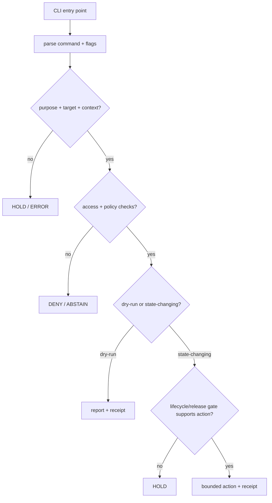

<!-- [KFM_META_BLOCK_V2]
doc_id: kfm://app/cli/src/kfm_cli/readme
title: KFM CLI Python Module README
type: app-readme
version: v0.1
status: draft
owners: OWNER_TBD — Apps steward · CLI steward · Release steward · Pipeline steward · Policy steward · Docs steward
created: 2026-06-16
updated: 2026-06-16
policy_label: restricted
related:
  - ../../README.md
  - ../../../README.md
  - ../../../governed-api/README.md
  - ../../../admin/README.md
  - ../../../review-console/README.md
  - ../../../../policy/access/README.md
  - ../../../../policy/decision/README.md
  - ../../../../policy/data/README.md
  - ../../../../packages/README.md
  - ../../../../tools/README.md
  - ../../../../scripts/README.md
  - ../../../../release/README.md
  - ../../../../data/README.md
  - ../../../../docs/security/AUDIT_INVARIANTS.md
tags: [kfm, apps, cli, python, kfm_cli, operator-cli, commands, validation, dry-run, receipts, fail-closed]
notes:
  - "Initial README for the kfm_cli Python module directory."
  - "Repository evidence confirms this README path and an empty __init__.py; implementation commands, exports, tests, fixtures, packaging metadata, and CI remain NEEDS VERIFICATION."
  - "This module should implement CLI command code only; release authority, lifecycle data, policy bundles, schemas, contracts, and public API behavior remain in their owning roots."
[/KFM_META_BLOCK_V2] -->

<a id="top"></a>

<div align="center">

# `kfm_cli` Python Module

`apps/cli/src/kfm_cli/`

**Python module boundary for the KFM operator CLI: command parsing, safe command orchestration, dry-runs, reports, and receipt-oriented maintenance helpers.**


[Purpose](#1-purpose) · [Repo fit](#2-repo-fit) · [Boundary](#3-authority-boundary) · [Inputs](#5-inputs) · [Exclusions](#6-exclusions) · [Candidate modules](#7-candidate-module-map) · [Definition of done](#14-definition-of-done)

</div>

---

> [!IMPORTANT]
> **Status:** draft / `NEEDS VERIFICATION`  
> **Owners:** `OWNER_TBD` — Apps steward · CLI steward · Release steward · Pipeline steward · Policy steward · Docs steward  
> **Path:** `apps/cli/src/kfm_cli/README.md`  
> **Responsibility root:** `apps/` — deployable application surfaces  
> **Truth posture:** CONFIRMED README path and empty `__init__.py` / PROPOSED module contract / UNKNOWN command exports, tests, fixtures, and CLI entry point

> [!CAUTION]
> Code in `kfm_cli` must not publish, rewrite canonical lifecycle state, bypass policy gates, bypass EvidenceBundle closure, or act as release authority. CLI code may orchestrate checks and emit reports or receipts; governed promotion and publication remain controlled by policy, release, lifecycle, evidence, correction, and rollback boundaries.

---

## Quick jump

- [1. Purpose](#1-purpose)
- [2. Repo fit](#2-repo-fit)
- [3. Authority boundary](#3-authority-boundary)
- [4. Default posture](#4-default-posture)
- [5. Inputs](#5-inputs)
- [6. Exclusions](#6-exclusions)
- [7. Candidate module map](#7-candidate-module-map)
- [8. Diagram](#8-diagram)
- [9. Result vocabulary](#9-result-vocabulary)
- [10. Module obligations](#10-module-obligations)
- [11. Command-handler expectations](#11-command-handler-expectations)
- [12. Inspection path](#12-inspection-path)
- [13. Validation expectations](#13-validation-expectations)
- [14. Definition of done](#14-definition-of-done)
- [15. Open verification items](#15-open-verification-items)

---

## 1. Purpose

`kfm_cli` is the proposed Python import package for the KFM operator CLI inside `apps/cli/`.

It should eventually contain command modules, typed command result objects, safe error handling, dry-run orchestration, report helpers, receipt emitters, and adapters that invoke existing packages or tools without duplicating their authority.

It should support long-lived maintainer workflows such as:

- validation commands;
- release dry-runs;
- ingest prerequisite checks;
- source, schema, contract, package, policy, and release diffs;
- receipt/proof inspection;
- redacted reports;
- bounded maintenance commands.

It must not become the home for shared reusable libraries, policy bundles, validators, release records, lifecycle artifacts, public API behavior, or one-off operational scripts.

[Back to top](#top)

---

## 2. Repo fit

| Concern | Owning root | Expected relationship |
|---|---|---|
| Python CLI module | `apps/cli/src/kfm_cli/` | This README and future CLI module files, if accepted |
| CLI app contract | `apps/cli/README.md` | Parent app boundary and command-family posture |
| Apps root | `apps/README.md` | Deployable app root and trust-membrane doctrine |
| Public trust membrane | `apps/governed-api/` | Public clients use governed API, not CLI outputs |
| Shared implementation | `packages/` | Reusable helpers consumed by CLI |
| Repo-wide tools | `tools/` | Validators, generators, and builders invoked by CLI when appropriate |
| One-off scripts | `scripts/` | Temporary scripts; long-lived trust-bearing flows graduate out of scripts |
| Policy | `policy/` | Allow / deny / restrict / abstain gates |
| Release | `release/` | Publication, correction, rollback authority |
| Lifecycle artifacts | `data/` | Receipts, proofs, catalog, triplets, and published artifacts |

## 3. Authority boundary

This module may implement command behavior. It does not own the authorities the commands inspect, validate, or request.

```text
apps/cli/src/kfm_cli/ = Python CLI command module
apps/cli/             = operator CLI deployable boundary
apps/governed-api/    = normal public trust membrane
packages/             = shared reusable libraries
tools/                = validators, generators, builders
policy/               = allow / deny / restrict / abstain gates
schemas/              = machine-readable shape
contracts/            = object meaning
data/                 = lifecycle artifacts, receipts, proofs, registries
release/              = publication, correction, rollback authority
```

## 4. Default posture

CLI module code should prefer safe finite outcomes over implicit mutation.

A command handler should return `DENY`, `HOLD`, `ABSTAIN`, or `ERROR` when any of these are unresolved:

- command target and purpose;
- actor or service identity where required;
- capability or role binding;
- lifecycle stage;
- source, schema, contract, policy, or package context;
- EvidenceRef / EvidenceBundle closure;
- validation report;
- release state;
- rollback or correction target;
- output path and overwrite strategy;
- receipt or audit destination.

## 5. Inputs

| Input family | Examples | Required posture |
|---|---|---|
| Parsed command | command family, subcommand, flags, profile, environment, dry-run switch | Explicit and normalized |
| Actor context | local operator, CI service identity, maintenance account | Authenticated where consequential |
| Target context | source descriptor, schema, contract, policy bundle, package, data artifact, release candidate | Governed reference |
| Lifecycle context | RAW, WORK, QUARANTINE, PROCESSED, CATALOG, TRIPLET, PUBLISHED, candidate release | Explicit before read/write |
| Policy context | access, sensitivity, rights, finite decision, reason code | Required before consequential action |
| Evidence context | EvidenceRef, EvidenceBundle, citation validation, proof pack | Required for claim-bearing checks |
| Output context | report path, receipt path, diff path, stdout format, machine-readable flag | Deterministic and safe |

## 6. Exclusions

| Does not belong here | Correct home |
|---|---|
| Shared reusable libraries | `packages/` |
| Repo-wide validators/generators/builders | `tools/` |
| Temporary one-off scripts | `scripts/` |
| Public API implementation | `apps/governed-api/` |
| Admin UI or restricted panels | `apps/admin/` |
| Steward review UI | `apps/review-console/` |
| Policy bundles | `policy/` |
| Schemas and contracts | `schemas/contracts/v1/`, `contracts/` |
| Lifecycle artifacts, receipts, proofs, catalog, triplets | `data/` |
| Release manifests, rollback cards, correction notices | `release/` |
| Secrets, credentials, tokens, private keys | Secret manager / deployment environment, not module source or examples |

## 7. Candidate module map

Exact files and exports remain `NEEDS VERIFICATION`. Candidate modules should be introduced only with tests and command inventory updates.

| Candidate file | Responsibility | Status |
|---|---|---|
| `__init__.py` | Minimal stable export surface | EMPTY / NEEDS VERIFICATION |
| `main.py` | CLI application entry point | PROPOSED |
| `commands/` | Command families such as validate, dry-run, ingest check, diff, report | PROPOSED |
| `context.py` | Command context, actor context, target context normalization | PROPOSED |
| `results.py` | Finite command-result and reason-code types | PROPOSED |
| `io.py` | Deterministic output, report writing, redacted display helpers | PROPOSED |
| `receipts.py` | Receipt/report emission helpers | PROPOSED |
| `errors.py` | Safe exception and error-result handling | PROPOSED |

> [!WARNING]
> Candidate names are not repo facts until files, tests, and packaging metadata confirm them.

## 8. Diagram



## 9. Result vocabulary

| Result | Meaning | Required behavior |
|---|---|---|
| `ALLOW` | Command may proceed under scoped context | Emit audit/receipt metadata where consequential |
| `DENY` | Access, policy, sensitivity, rights, or lifecycle context blocks command | Return safe reason code |
| `RESTRICT` | Command may proceed only in read-only, redacted, dry-run, or narrowed mode | Preserve obligations downstream |
| `HOLD` | Required evidence, target, release, rollback, or receipt support is missing | Do not perform consequential action |
| `ABSTAIN` | Command cannot decide because support is unresolved | Preserve unresolved handles where safe |
| `ERROR` | Parse, validation, dependency, filesystem, or runtime failure | Fail closed with safe diagnostics |

## 10. Module obligations

| Obligation | Example effect |
|---|---|
| `dry_run_first` | Prefer dry-run for release/lifecycle-affecting flows |
| `receipt_required` | Consequential commands produce RunReceipt, ValidationReport, or equivalent report refs |
| `purpose_required` | State-changing commands require ticket, review note, or CI run reference |
| `no_publish_shortcut` | CLI cannot publish without release authority and rollback support |
| `redaction_required` | Reports and terminal output hide sensitive fields by default |
| `deterministic_output` | Reports and diffs use stable ordering and stable IDs where practical |
| `safe_failure_required` | Errors return finite safe reason codes |
| `no_public_path` | CLI output is operator-facing unless explicitly released through governed path |

## 11. Command-handler expectations

Every command handler should declare or encode:

- command family and purpose;
- required inputs and flags;
- target object family;
- read-only, dry-run, or state-changing class;
- policy and access checks invoked;
- report or receipt output;
- safe failure outcomes;
- rollback/correction relationship where relevant;
- fixture coverage.

## 12. Inspection path

Implementation files, command inventory, tests, fixtures, packaging metadata, and CLI entry point remain `NEEDS VERIFICATION`.

```bash
find apps/cli/src/kfm_cli -maxdepth 5 -type f | sort
find apps/cli apps packages tools scripts policy release data tests fixtures -maxdepth 5 -type f 2>/dev/null | grep -Ei 'kfm_cli|cli|command|validate|dry[-_ ]?run|ingest|diff|report|receipt|rollback' | sort
find docs docs/runbooks docs/security -maxdepth 5 -type f 2>/dev/null | grep -Ei 'cli|operator|validation|release|rollback|audit' | sort
```

## 13. Validation expectations

Useful validation for this module should cover:

- unknown command returns `ERROR` with safe help text;
- missing required target returns `HOLD` or `ERROR`;
- missing purpose for consequential command returns `HOLD`;
- missing access or role context returns `DENY` where required;
- dry-run release command never writes PUBLISHED state;
- report commands redact sensitive material by default;
- state-changing commands require rollback/correction support;
- module functions do not bypass policy, release, lifecycle, or EvidenceBundle gates.

## 14. Definition of done

- [ ] Owners are confirmed and `OWNER_TBD` is replaced.
- [ ] Module files and command inventory are documented.
- [ ] CLI entry point and packaging metadata are confirmed.
- [ ] Access/policy checks are implemented for consequential commands.
- [ ] Dry-run behavior is available for release/lifecycle-affecting flows.
- [ ] Receipts and reports are emitted for consequential commands.
- [ ] Tests and fixtures cover allow, deny, restrict, hold, abstain, and error paths.
- [ ] Sensitive report redaction is tested.
- [ ] Public-path bypass checks are covered.

## 15. Open verification items

| Item | Why it matters |
|---|---|
| Confirm implementation files beyond empty `__init__.py` | Prevents overclaiming module maturity |
| Confirm CLI framework and command entry point | Required for usable command surface |
| Confirm command inventory | Required for operator documentation and tests |
| Confirm package metadata | Required for installable CLI behavior |
| Confirm receipt/report output homes | Required for auditability |
| Confirm tests and fixtures | Required before enforcement claims |
| Confirm CI usage | Determines whether CLI is operator-only or CI-driven |
| Confirm secrets handling | Prevents credentials in args, logs, examples, or reports |

<details>
<summary>Appendix A — no-loss preservation note</summary>

The target file was an empty placeholder. This README adds a bounded module contract for `kfm_cli` without claiming command implementations, framework wiring, tests, fixtures, package metadata, CI jobs, or release integration are present.

The observed `__init__.py` is empty, so implementation maturity remains `NEEDS VERIFICATION`.

</details>

## Status summary

`apps/cli/src/kfm_cli/` should contain Python CLI command code only after implementation, command inventory, tests, fixtures, receipts, and package metadata are verified.

It should support validation, dry-runs, ingest checks, diffs, reports, and maintenance without becoming a public path, release authority, lifecycle store, policy root, schema/contract home, or shortcut around governed publication controls.

<p align="right"><a href="#top">Back to top</a></p>
