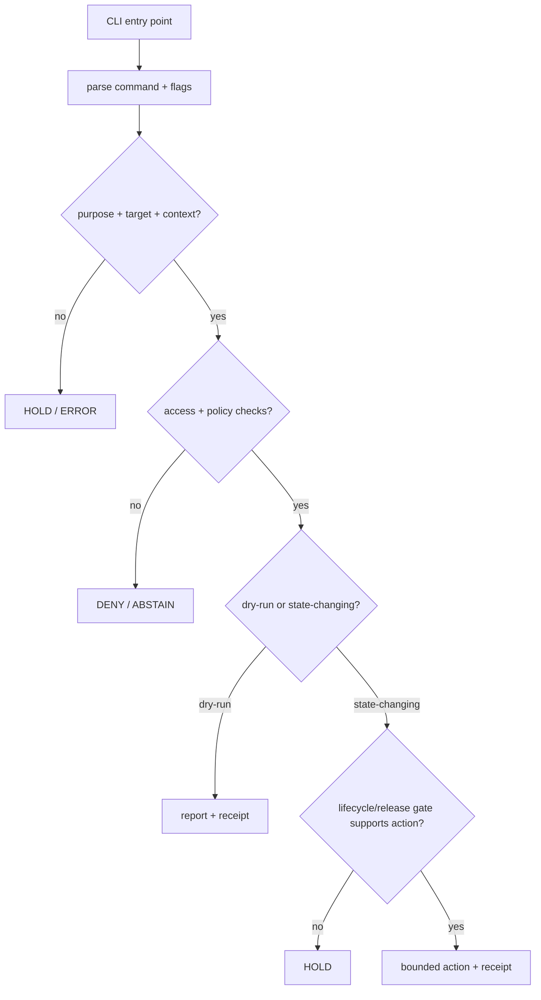

<!-- [KFM_META_BLOCK_V2]
doc_id: kfm://app/cli/src/kfm_cli/readme
title: KFM CLI Python Module README
type: app-readme
version: v0.2
status: draft
owners: OWNER_TBD — Apps steward · CLI steward · Release steward · Pipeline steward · Policy steward · Docs steward
created: 2026-06-16
updated: 2026-07-09
policy_label: restricted
related:
  - ../../README.md
  - ../../../README.md
  - ../../../governed-api/README.md
  - ../../../admin/README.md
  - ../../../review-console/README.md
  - commands/README.md
  - ../../../../README.md
  - ../../../../SECURITY.md
  - ../../../../policy/access/README.md
  - ../../../../policy/decision/README.md
  - ../../../../policy/data/README.md
  - ../../../../packages/README.md
  - ../../../../tools/README.md
  - ../../../../tools/validators/README.md
  - ../../../../tools/watchers/README.md
  - ../../../../scripts/README.md
  - ../../../../release/README.md
  - ../../../../data/README.md
  - ../../../../docs/security/AUDIT_INVARIANTS.md
tags: [kfm, apps, cli, python, kfm_cli, operator-cli, commands, validation, dry-run, receipts, fail-closed, no-publish-shortcut]
notes:
  - "v0.2 updates the uploaded kfm_cli module README into a current repo-aware Python module contract."
  - "apps/cli/src/kfm_cli/README.md, apps/cli/src/kfm_cli/commands/README.md, apps/cli/README.md, and an empty apps/cli/src/kfm_cli/__init__.py were verified through the GitHub app in this update. Implementation commands, exports, tests, fixtures, packaging metadata, entry-point wiring, receipt/report emission, CI, and release integration remain NEEDS VERIFICATION."
  - "This module should implement CLI command code only; release authority, lifecycle data, policy bundles, schemas, contracts, public API behavior, shared-library authority, and source-of-truth records remain in their owning roots."
  - "CLI code should be dry-run-first, fail-closed, redacted-by-default, deterministic where practical, finite-outcome oriented, and unable to bypass policy, release, lifecycle, EvidenceBundle, correction, or rollback controls."
[/KFM_META_BLOCK_V2] -->

<a id="top"></a>

<div align="center">

# `kfm_cli` Python Module

`apps/cli/src/kfm_cli/`

**Python module boundary for the KFM operator CLI: command parsing, safe command orchestration, dry-runs, reports, and receipt-oriented maintenance helpers.**


[Purpose](#1-purpose) · [Current evidence](#2-current-repo-evidence) · [Repo fit](#3-repo-fit) · [Boundary](#4-authority-boundary) · [Inputs](#6-inputs) · [Exclusions](#7-exclusions) · [Candidate modules](#8-candidate-module-map) · [Definition of done](#15-definition-of-done)

</div>

---

> [!IMPORTANT]
> **Status:** draft / current README surface confirmed / implementation behavior `NEEDS VERIFICATION`  
> **Owners:** `OWNER_TBD` — Apps steward · CLI steward · Release steward · Pipeline steward · Policy steward · Docs steward  
> **Path:** `apps/cli/src/kfm_cli/README.md`  
> **Responsibility root:** `apps/` — deployable application surfaces  
> **Truth posture:** CONFIRMED README path, commands README, and empty `__init__.py` / PROPOSED module contract / UNKNOWN command exports, tests, fixtures, packaging metadata, CLI entry point, CI, and release integration

> [!CAUTION]
> Code in `kfm_cli` must not publish, rewrite canonical lifecycle state, bypass policy gates, bypass EvidenceBundle closure, or act as release authority. CLI code may orchestrate checks and emit reports or receipts; governed promotion and publication remain controlled by policy, release, lifecycle, evidence, correction, and rollback boundaries.

---

## Quick jump

- [1. Purpose](#1-purpose)
- [2. Current repo evidence](#2-current-repo-evidence)
- [3. Repo fit](#3-repo-fit)
- [4. Authority boundary](#4-authority-boundary)
- [5. Default posture](#5-default-posture)
- [6. Inputs](#6-inputs)
- [7. Exclusions](#7-exclusions)
- [8. Candidate module map](#8-candidate-module-map)
- [9. Diagram](#9-diagram)
- [10. Result vocabulary](#10-result-vocabulary)
- [11. Module obligations](#11-module-obligations)
- [12. Command-handler expectations](#12-command-handler-expectations)
- [13. Inspection path](#13-inspection-path)
- [14. Validation expectations](#14-validation-expectations)
- [15. Definition of done](#15-definition-of-done)
- [16. Open verification items](#16-open-verification-items)

---

## 1. Purpose

`kfm_cli` is the proposed Python import package for the KFM operator CLI inside `apps/cli/`.

It should eventually contain command modules, typed command result objects, safe error handling, dry-run orchestration, report helpers, receipt emitters, and adapters that invoke existing packages or tools without duplicating their authority.

It should support long-lived maintainer workflows such as:

- validation commands;
- release dry-runs;
- ingest prerequisite checks;
- source, schema, contract, package, policy, and release diffs;
- receipt/proof inspection;
- redacted reports;
- bounded maintenance commands.

It must not become the home for shared reusable libraries, policy bundles, validators, release records, lifecycle artifacts, public API behavior, source-of-truth records, or one-off operational scripts.

[Back to top](#top)

---

## 2. Current repo evidence

| Surface | Status | What it proves | What it does **not** prove |
|---|---|---|---|
| `apps/cli/src/kfm_cli/README.md` | **CONFIRMED README** | This README exists and has been updated to v0.2. | Command exports, runnable CLI behavior, tests, fixtures, package metadata, CI, or release integration. |
| `apps/cli/src/kfm_cli/__init__.py` | **CONFIRMED empty file** | The package marker exists but contains no exports in the fetched content. | That CLI commands, framework wiring, or public API are implemented. |
| `apps/cli/src/kfm_cli/commands/README.md` | **CONFIRMED command-directory README** | The command-family boundary exists and has been updated to v0.2. | That command modules or entry points exist. |
| `apps/cli/README.md` | **CONFIRMED CLI app README** | Parent CLI app boundary exists and describes CLI as operator/maintainer surface for validation, dry-runs, ingest support, reports, and diffs. | That implementation commands, framework, tests, package metadata, or deployment state are verified. |
| Uploaded kfm_cli Markdown | **CONFIRMED source text for this update** | Provided the base module contract updated here. | Does not prove live implementation. |
| Implementation files beyond README and empty `__init__.py` | **NEEDS VERIFICATION** | Checkable by repo scan, package metadata, tests, command help, and CI evidence. | Not claimed by this README. |

[Back to top](#top)

---

## 3. Repo fit

| Concern | Owning root | Expected relationship |
|---|---|---|
| Python CLI module | `apps/cli/src/kfm_cli/` | This README and future CLI module files, if accepted. |
| CLI command modules | `apps/cli/src/kfm_cli/commands/` | Command-family implementations, if accepted and verified. |
| CLI app contract | `apps/cli/README.md` | Parent app boundary and command-family posture. |
| Apps root | `apps/README.md` | Deployable app root and trust-membrane doctrine. |
| Public trust membrane | `apps/governed-api/` | Public clients use governed API, not CLI outputs. |
| Shared implementation | `packages/` | Reusable helpers consumed by CLI. |
| Repo-wide tools | `tools/` | Validators, generators, and builders invoked by CLI when appropriate. |
| One-off scripts | `scripts/` | Temporary scripts; long-lived trust-bearing flows graduate out of scripts. |
| Policy | `policy/` | Allow / deny / restrict / abstain gates. |
| Release | `release/` | Publication, correction, rollback authority. |
| Lifecycle artifacts | `data/` | Receipts, proofs, catalog, triplets, and published artifacts. |
| Security posture | `SECURITY.md`, `docs/security/` | Secrets, audit, incident, exposure, and safe-output posture. |

[Back to top](#top)

---

## 4. Authority boundary

This module may implement command behavior. It does not own the authorities the commands inspect, validate, or request.

```text
apps/cli/src/kfm_cli/ = Python CLI command module
apps/cli/src/kfm_cli/commands/ = command-family modules
apps/cli/             = operator CLI deployable boundary
apps/governed-api/    = normal public trust membrane
packages/             = shared reusable libraries
tools/                = validators, generators, builders
policy/               = allow / deny / restrict / abstain gates
schemas/              = machine-readable shape
contracts/            = object meaning
data/                 = lifecycle artifacts, receipts, proofs, registries
release/              = publication, correction, rollback authority
```

Safe interpretation:

- **CONFIRMED:** this README surface and empty `__init__.py` exist.
- **PROPOSED:** CLI module code may live here when it remains dry-run-first, fail-closed, redacted-by-default, finite-outcome oriented, and subordinate to governed roots.
- **NEEDS VERIFICATION:** command exports, command inventory, framework wiring, tests, fixtures, package metadata, report/receipt homes, CI usage, and release integration.
- **DENY:** using this module as a public path, release authority, lifecycle store, policy root, schema/contract home, shared library home, secret store, or publication shortcut.

[Back to top](#top)

---

## 5. Default posture

CLI module code should prefer safe finite outcomes over implicit mutation.

A command handler should return `DENY`, `RESTRICT`, `HOLD`, `ABSTAIN`, or `ERROR` instead of acting when any of these are unresolved:

- command target and purpose;
- actor or service identity where required;
- capability or role binding;
- lifecycle stage;
- source, schema, contract, policy, or package context;
- EvidenceRef / EvidenceBundle closure;
- validation report;
- release state;
- rollback or correction target;
- output path and overwrite strategy;
- receipt or audit destination;
- redaction and safe-display posture for terminal/report output.

[Back to top](#top)

---

## 6. Inputs

| Input family | Examples | Required posture |
|---|---|---|
| Parsed command | command family, subcommand, flags, profile, environment, dry-run switch | Explicit and normalized. |
| Actor context | local operator, CI service identity, maintenance account | Authenticated where consequential. |
| Target context | source descriptor, schema, contract, policy bundle, package, data artifact, release candidate | Governed reference. |
| Lifecycle context | RAW, WORK, QUARANTINE, PROCESSED, CATALOG, TRIPLET, PUBLISHED, candidate release | Explicit before read/write. |
| Policy context | access, sensitivity, rights, finite decision, reason code | Required before consequential action. |
| Evidence context | EvidenceRef, EvidenceBundle, citation validation, proof pack | Required for claim-bearing checks. |
| Output context | report path, receipt path, diff path, stdout format, machine-readable flag | Deterministic and safe. |
| Rollback/correction context | rollback card, correction notice, release ref, receipt ref, steward approval | Required for consequential mutation. |

[Back to top](#top)

---

## 7. Exclusions

| Does not belong here | Correct home |
|---|---|
| Shared reusable libraries | `packages/` |
| Repo-wide validators/generators/builders | `tools/` |
| Temporary one-off scripts | `scripts/` |
| Public API implementation | `apps/governed-api/` |
| Admin UI or restricted panels | `apps/admin/` |
| Steward review UI | `apps/review-console/` |
| Policy bundles | `policy/` |
| Schemas and contracts | `schemas/contracts/v1/`, `contracts/` |
| Lifecycle artifacts, receipts, proofs, catalog, triplets | `data/` |
| Release manifests, rollback cards, correction notices | `release/` |
| Secrets, credentials, tokens, private keys, signing material | secret manager / deployment environment, not module source or examples |
| Public-sensitive exports, exact sensitive locations, living-person/DNA details, or source-restricted records | denied unless separately governed and public-safe |

[Back to top](#top)

---

## 8. Candidate module map

Exact files and exports remain `NEEDS VERIFICATION`. Candidate modules should be introduced only with tests and command inventory updates.

| Candidate file | Responsibility | Status |
|---|---|---|
| `__init__.py` | Minimal stable export surface | **CONFIRMED empty / NEEDS VERIFICATION for exports** |
| `main.py` | CLI application entry point | PROPOSED |
| `commands/` | Command families such as validate, dry-run, ingest check, diff, report | README CONFIRMED / modules NEEDS VERIFICATION |
| `context.py` | Command context, actor context, target context normalization | PROPOSED |
| `results.py` | Finite command-result and reason-code types | PROPOSED |
| `io.py` | Deterministic output, report writing, redacted display helpers | PROPOSED |
| `receipts.py` | Receipt/report emission helpers | PROPOSED |
| `errors.py` | Safe exception and error-result handling | PROPOSED |
| `redaction.py` | Terminal/report redaction helpers | PROPOSED |

> [!WARNING]
> Candidate names are not repo facts until files, tests, and packaging metadata confirm them.

[Back to top](#top)

---

## 9. Diagram



[Back to top](#top)

---

## 10. Result vocabulary

| Result | Meaning | Required behavior |
|---|---|---|
| `ALLOW` | Command may proceed under scoped context. | Emit audit/receipt metadata where consequential. |
| `DENY` | Access, policy, sensitivity, rights, or lifecycle context blocks command. | Return safe reason code. |
| `RESTRICT` | Command may proceed only in read-only, redacted, dry-run, or narrowed mode. | Preserve obligations downstream. |
| `HOLD` | Required evidence, target, release, rollback, correction, or receipt support is missing. | Do not perform consequential action. |
| `ABSTAIN` | Command cannot decide because support is unresolved. | Preserve unresolved handles where safe. |
| `ERROR` | Parse, validation, dependency, filesystem, or runtime failure. | Fail closed with safe diagnostics. |

[Back to top](#top)

---

## 11. Module obligations

| Obligation | Example effect |
|---|---|
| `dry_run_first` | Prefer dry-run for release/lifecycle-affecting flows. |
| `receipt_required` | Consequential commands produce RunReceipt, ValidationReport, or equivalent report refs. |
| `purpose_required` | State-changing commands require ticket, review note, or CI run reference. |
| `no_publish_shortcut` | CLI cannot publish without release authority and rollback support. |
| `redaction_required` | Reports and terminal output hide sensitive fields by default. |
| `deterministic_output` | Reports and diffs use stable ordering and stable IDs where practical. |
| `safe_failure_required` | Errors return finite safe reason codes. |
| `no_public_path` | CLI output is operator-facing unless explicitly released through governed path. |
| `no_authority_fork` | Module code invokes owning packages/tools/policies instead of redefining them. |
| `local_parity_preferred` | Commands should be usable locally and in CI with the same inputs where practical. |

[Back to top](#top)

---

## 12. Command-handler expectations

Every command handler should declare or encode:

- command family and purpose;
- required inputs and flags;
- target object family;
- read-only, dry-run, or state-changing class;
- policy and access checks invoked;
- report or receipt output;
- safe failure outcomes;
- rollback/correction relationship where relevant;
- redaction posture;
- fixture coverage.

[Back to top](#top)

---

## 13. Inspection path

Implementation files, command inventory, tests, fixtures, packaging metadata, and CLI entry point remain `NEEDS VERIFICATION`.

```bash
find apps/cli/src/kfm_cli -maxdepth 5 -type f | sort
find apps/cli apps packages tools scripts policy release data tests fixtures -maxdepth 5 -type f 2>/dev/null | grep -Ei 'kfm_cli|cli|command|validate|dry[-_ ]?run|ingest|diff|report|receipt|rollback' | sort
find docs docs/runbooks docs/security -maxdepth 5 -type f 2>/dev/null | grep -Ei 'cli|operator|validation|release|rollback|audit' | sort
```

[Back to top](#top)

---

## 14. Validation expectations

Useful validation for this module should cover:

- unknown command returns `ERROR` with safe help text;
- missing required target returns `HOLD` or `ERROR`;
- missing purpose for consequential command returns `HOLD`;
- missing access or role context returns `DENY` where required;
- dry-run release command never writes PUBLISHED state;
- report commands redact sensitive material by default;
- state-changing commands require rollback/correction support;
- module functions do not bypass policy, release, lifecycle, or EvidenceBundle gates;
- module output does not expose secrets, exact sensitive locations, source-restricted records, or private data.

[Back to top](#top)

---

## 15. Definition of done

- [ ] Owners are confirmed and `OWNER_TBD` is replaced.
- [ ] Module files and command inventory are documented.
- [ ] CLI entry point and packaging metadata are confirmed.
- [ ] Access/policy checks are implemented for consequential commands.
- [ ] Dry-run behavior is available for release/lifecycle-affecting flows.
- [ ] Receipts and reports are emitted for consequential commands.
- [ ] Tests and fixtures cover allow, deny, restrict, hold, abstain, and error paths.
- [ ] Sensitive report redaction is tested.
- [ ] Public-path bypass checks are covered.
- [ ] Parent CLI README and commands README are updated when module behavior changes.

[Back to top](#top)

---

## 16. Open verification items

| Item | Why it matters |
|---|---|
| Confirm implementation files beyond empty `__init__.py` | Prevents overclaiming module maturity. |
| Confirm CLI framework and command entry point | Required for usable command surface. |
| Confirm command inventory | Required for operator documentation and tests. |
| Confirm package metadata | Required for installable CLI behavior. |
| Confirm receipt/report output homes | Required for auditability. |
| Confirm tests and fixtures | Required before enforcement claims. |
| Confirm CI usage | Determines whether CLI is operator-only or CI-driven. |
| Confirm secrets handling and redaction | Prevents credentials or sensitive data in args, logs, examples, or reports. |
| Confirm no direct publish/lifecycle mutation path | Preserves promotion and release governance. |

<details>
<summary>Appendix A — no-loss preservation note</summary>

The uploaded README added a bounded module contract for `kfm_cli` without claiming command implementations, framework wiring, tests, fixtures, package metadata, CI jobs, or release integration are present. This v0.2 update preserves that structure while adding current repo evidence, updated related docs, command-directory linkage, stronger dry-run/no-publish language, rollback/correction posture, local-parity expectations, and expanded verification items.

The observed `__init__.py` is empty, so implementation maturity remains `NEEDS VERIFICATION`.

</details>

## Status summary

`apps/cli/src/kfm_cli/` should contain Python CLI command code only after implementation, command inventory, tests, fixtures, receipts, and package metadata are verified.

It should support validation, dry-runs, ingest checks, diffs, reports, and maintenance without becoming a public path, release authority, lifecycle store, policy root, schema/contract home, shared library home, secret store, or shortcut around governed publication controls.

<p align="right"><a href="#top">Back to top</a></p>
