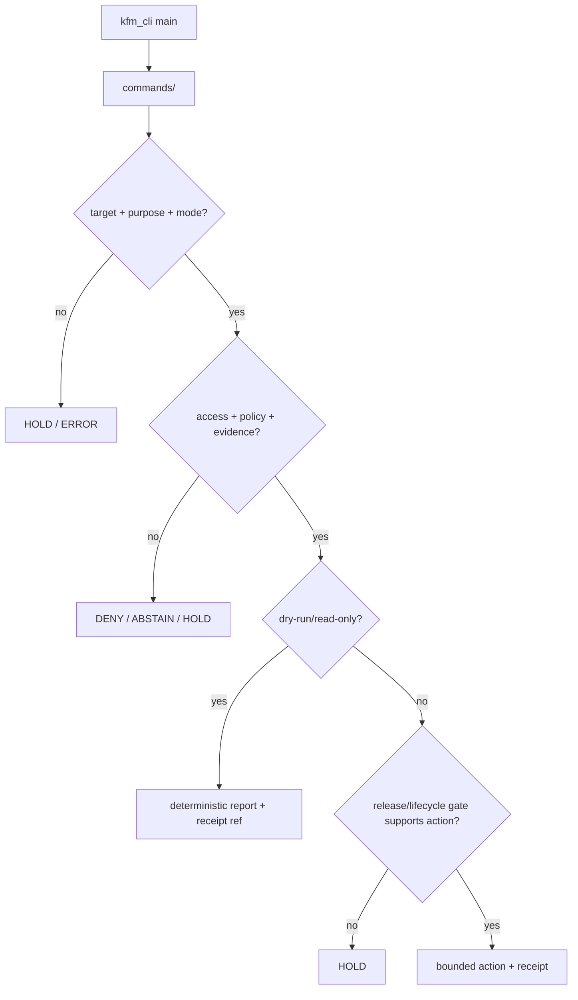

<!-- [KFM_META_BLOCK_V2]
doc_id: kfm://app/cli/src/kfm_cli/commands/readme
title: KFM CLI Commands README
type: app-readme
version: v0.2
status: draft
owners: OWNER_TBD — Apps steward · CLI steward · Release steward · Pipeline steward · Policy steward · Docs steward
created: 2026-06-16
updated: 2026-07-09
policy_label: restricted
related:
  - ../README.md
  - ../../../README.md
  - ../../../../README.md
  - ../../../../governed-api/README.md
  - ../../../../../README.md
  - ../../../../../SECURITY.md
  - ../../../../../policy/access/README.md
  - ../../../../../policy/decision/README.md
  - ../../../../../policy/data/README.md
  - ../../../../../packages/README.md
  - ../../../../../tools/README.md
  - ../../../../../tools/validators/README.md
  - ../../../../../tools/watchers/README.md
  - ../../../../../scripts/README.md
  - ../../../../../release/README.md
  - ../../../../../data/README.md
  - ../../../../../docs/security/AUDIT_INVARIANTS.md
tags: [kfm, apps, cli, commands, operator-cli, validation, dry-run, diff, report, receipts, fail-closed, no-publish-shortcut]
notes:
  - "v0.2 updates the uploaded kfm_cli commands README into a current repo-aware command-directory contract."
  - "apps/cli/src/kfm_cli/commands/README.md, apps/cli/src/kfm_cli/README.md, and apps/cli/README.md were verified through the GitHub app in this update. Command modules, command inventory, entry-point wiring, tests, fixtures, package metadata, CI jobs, receipt/report emission, and release integration remain NEEDS VERIFICATION."
  - "Command modules may orchestrate governed checks and report generation, but they must not publish, promote, mutate lifecycle state, bypass release, bypass lifecycle gates, bypass policy, bypass EvidenceBundle closure, or become shared-library homes."
  - "Commands should be dry-run-first, redacted-by-default, deterministic where practical, and finite-outcome oriented."
[/KFM_META_BLOCK_V2] -->

<a id="top"></a>

<div align="center">

# `kfm_cli.commands`

`apps/cli/src/kfm_cli/commands/`

**Command-family boundary for the KFM operator CLI: validation, dry-runs, ingest checks, diffs, reports, receipt inspection, and bounded maintenance commands.**


[Purpose](#1-purpose) · [Current evidence](#2-current-repo-evidence) · [Repo fit](#3-repo-fit) · [Boundary](#4-authority-boundary) · [Inputs](#6-inputs) · [Exclusions](#7-exclusions) · [Command families](#8-command-family-map) · [Definition of done](#15-definition-of-done)

</div>

---

> [!IMPORTANT]
> **Status:** draft / current README surface confirmed / implementation behavior `NEEDS VERIFICATION`  
> **Owners:** `OWNER_TBD` — Apps steward · CLI steward · Release steward · Pipeline steward · Policy steward · Docs steward  
> **Path:** `apps/cli/src/kfm_cli/commands/README.md`  
> **Responsibility root:** `apps/` — deployable application surfaces  
> **Truth posture:** CONFIRMED README path and parent CLI docs / PROPOSED commands-directory contract / UNKNOWN command modules, exports, tests, fixtures, entry-point wiring, CI, and release integration

> [!CAUTION]
> Command modules must not publish, promote, mutate lifecycle state, approve release, or bypass governed controls by themselves. A command may validate, inspect, diff, dry-run, request, or report; consequential transitions still require policy decisions, EvidenceBundle closure, release authority, rollback/correction support, and receipts.

---

## Quick jump

- [1. Purpose](#1-purpose)
- [2. Current repo evidence](#2-current-repo-evidence)
- [3. Repo fit](#3-repo-fit)
- [4. Authority boundary](#4-authority-boundary)
- [5. Default posture](#5-default-posture)
- [6. Inputs](#6-inputs)
- [7. Exclusions](#7-exclusions)
- [8. Command family map](#8-command-family-map)
- [9. Diagram](#9-diagram)
- [10. Result vocabulary](#10-result-vocabulary)
- [11. Command obligations](#11-command-obligations)
- [12. Per-command README contract](#12-per-command-readme-contract)
- [13. Inspection path](#13-inspection-path)
- [14. Validation expectations](#14-validation-expectations)
- [15. Definition of done](#15-definition-of-done)
- [16. Open verification items](#16-open-verification-items)

---

## 1. Purpose

`apps/cli/src/kfm_cli/commands/` is the proposed home for long-lived KFM CLI command-family modules.

It should contain command code only after command inventory, tests, fixtures, receipt/report behavior, and parent CLI wiring are verified. This directory is for operator-facing commands that make governed work repeatable, reviewable, auditable, dry-run-first, and safe to inspect.

In scope:

- validation command families;
- release dry-run command families;
- ingest prerequisite checks;
- source, schema, contract, policy, package, data, and release diffs;
- redacted report generation;
- receipt/proof inspection;
- bounded maintenance command families.

Out of scope:

- shared reusable libraries;
- repo-wide validator implementations;
- release manifests and rollback cards;
- lifecycle artifacts and receipts as stored records;
- public API routes;
- temporary one-off scripts;
- secrets, private environment values, tokens, or signing material.

[Back to top](#top)

---

## 2. Current repo evidence

| Surface | Status | What it proves | What it does **not** prove |
|---|---|---|---|
| `apps/cli/src/kfm_cli/commands/README.md` | **CONFIRMED README** | This README exists and has been updated to v0.2. | Command modules, command inventory, tests, fixtures, CLI entry-point wiring, CI, or release integration. |
| `apps/cli/src/kfm_cli/README.md` | **CONFIRMED parent module README** | Parent Python module boundary exists and describes `kfm_cli` as operator-CLI code with empty/init-level implementation evidence. | That command exports or runnable CLI commands exist. |
| `apps/cli/README.md` | **CONFIRMED CLI app README** | Parent CLI app boundary exists and describes CLI as operator/maintainer surface for validation, dry-runs, ingest support, reports, and diffs. | That implementation commands, framework, tests, package metadata, or deployment state are verified. |
| Uploaded commands Markdown | **CONFIRMED source text for this update** | Provided the base command-directory contract updated here. | Does not prove live implementation. |
| Implementation files beyond README | **NEEDS VERIFICATION** | Checkable by repo scan, package metadata, tests, command help, and CI evidence. | Not claimed by this README. |

[Back to top](#top)

---

## 3. Repo fit

| Concern | Owning root | Expected relationship |
|---|---|---|
| CLI command modules | `apps/cli/src/kfm_cli/commands/` | This README and future command-family modules, if accepted. |
| CLI Python module | `apps/cli/src/kfm_cli/` | Parent Python module boundary and shared command utilities. |
| CLI app contract | `apps/cli/README.md` | App-wide operator command surface and command-family posture. |
| Public trust membrane | `apps/governed-api/` | Public clients use governed API, not CLI commands. |
| Shared helpers | `packages/` | Extract reusable behavior here instead of command-private duplication. |
| Validators / generators / builders | `tools/` | CLI may invoke, but should not fork validator authority. |
| One-off scripts | `scripts/` | Temporary scripts; long-lived trust-bearing flows may graduate to CLI/tools/packages. |
| Policy gates | `policy/` | Access, sensitivity, rights, data, and decision policy. |
| Release authority | `release/` | Publication, correction, rollback control. |
| Lifecycle artifacts | `data/` | Receipts, proofs, catalog, triplets, published artifacts. |
| Security posture | `SECURITY.md`, `docs/security/` | Secrets, audit, incident, exposure, and safe-output posture. |

[Back to top](#top)

---

## 4. Authority boundary

Command modules orchestrate governed work. They do not own the governance authorities they call.

```text
apps/cli/src/kfm_cli/commands/ = command-family modules
apps/cli/src/kfm_cli/          = CLI Python module boundary
apps/cli/                      = operator CLI deployable
apps/governed-api/             = public trust membrane
packages/                      = shared reusable implementation libraries
tools/                         = validators, generators, builders
policy/                        = finite policy decisions
schemas/                       = machine-readable shape
contracts/                     = object meaning
data/                          = lifecycle artifacts, receipts, proofs, registries
release/                       = publication, correction, rollback authority
```

Safe interpretation:

- **CONFIRMED:** the README surface exists.
- **PROPOSED:** command modules may live here when they remain dry-run-first, fail-closed, redacted-by-default, and subordinate to governed roots.
- **NEEDS VERIFICATION:** command modules, entry-point registration, command help, tests, fixtures, package metadata, report/receipt homes, CI wiring, and release integration.
- **DENY:** using this directory as a public path, release authority, lifecycle store, policy root, schema/contract home, shared library home, secret store, or publication shortcut.

[Back to top](#top)

---

## 5. Default posture

Commands should be dry-run-first and fail-closed.

A command should return `DENY`, `RESTRICT`, `HOLD`, `ABSTAIN`, or `ERROR` instead of acting when any of these are unresolved:

- target object or path;
- purpose or ticket/reference for consequential actions;
- actor/capability where required;
- source, schema, contract, policy, package, lifecycle, or release context;
- EvidenceRef / EvidenceBundle closure;
- validation report;
- output path and overwrite plan;
- receipt or audit destination;
- rollback or correction target for state-changing actions;
- redaction and safe-display posture for terminal/report output.

[Back to top](#top)

---

## 6. Inputs

| Input family | Examples | Required posture |
|---|---|---|
| Parsed command | command family, subcommand, flags, config profile, dry-run switch | Explicit and normalized. |
| Actor context | operator, CI service identity, maintenance account | Required where consequential. |
| Target context | source descriptor, schema, contract, policy bundle, package, data artifact, release candidate | Governed reference. |
| Lifecycle context | RAW, WORK, QUARANTINE, PROCESSED, CATALOG, TRIPLET, PUBLISHED, candidate release | Explicit before read/write. |
| Policy context | access, rights, sensitivity, decision result, reason code | Required before action. |
| Evidence context | EvidenceRef, EvidenceBundle, citation validation, proof pack | Required for claim-bearing checks. |
| Output context | stdout mode, report path, receipt path, diff artifact path | Deterministic and safe. |
| Rollback/correction context | rollback card, correction notice, release ref, receipt ref, steward approval | Required for consequential mutation. |

[Back to top](#top)

---

## 7. Exclusions

| Does not belong here | Correct home |
|---|---|
| Shared libraries | `packages/` |
| Validator/generator/builder implementation authority | `tools/` |
| Temporary scripts | `scripts/` |
| Public API routes | `apps/governed-api/` |
| Admin or review UI panels | `apps/admin/`, `apps/review-console/` |
| Policy bundles | `policy/` |
| Schemas and contracts | `schemas/contracts/v1/`, `contracts/` |
| Stored lifecycle artifacts, receipts, proofs, catalog, triplets | `data/` |
| Release manifests, rollback cards, correction notices | `release/` |
| Credentials, tokens, private keys, signing material | secure secret store / deployment environment |
| Public-sensitive exports, exact sensitive locations, living-person/DNA details, or source-restricted records | denied unless separately governed and public-safe |

[Back to top](#top)

---

## 8. Command family map

Exact modules remain `NEEDS VERIFICATION`. Candidate command families should be introduced only with tests and command inventory updates.

| Candidate family | Responsibility | Default posture | Status |
|---|---|---|---|
| `validate` | Run schema, contract, evidence, policy, package, or docs checks. | Report/receipt; no publish. | PROPOSED |
| `release_dry_run` | Assemble release readiness diagnostics. | Dry-run only; requires rollback context. | PROPOSED |
| `ingest_check` | Check source/admission prerequisites. | Hold/quarantine unresolved sources. | PROPOSED |
| `diff` | Compare governed artifacts, contracts, schemas, policies, or outputs. | Read-only by default. | PROPOSED |
| `report` | Produce maintainer/steward reports. | Redacted output by default. | PROPOSED |
| `receipts` | Inspect receipt/proof presence and linkage. | Read-only, scoped display. | PROPOSED |
| `maintenance` | Bounded upkeep tasks. | Purpose, audit, and dry-run-first. | PROPOSED |
| `catalog_check` | Inspect catalog-closure readiness without publishing. | Read-only / report-only. | PROPOSED |

> [!WARNING]
> Candidate command-family names are not implementation proof. Do not document a command as runnable until an entry point, tests, fixtures, and command help confirm it.

[Back to top](#top)

---

## 9. Diagram



[Back to top](#top)

---

## 10. Result vocabulary

| Result | Meaning | Required behavior |
|---|---|---|
| `ALLOW` | Command may proceed under scoped context. | Emit report/receipt metadata where consequential. |
| `DENY` | Access, sensitivity, rights, release, or lifecycle policy blocks command. | Return safe reason code. |
| `RESTRICT` | Command may proceed only as read-only, redacted, dry-run, or narrowed output. | Preserve obligations. |
| `HOLD` | Required target, evidence, validation, release, rollback, correction, or receipt support is missing. | Do not act. |
| `ABSTAIN` | Command cannot decide because support is unresolved. | Preserve unresolved handles safely. |
| `ERROR` | Parse, dependency, filesystem, validation, or runtime failure. | Fail closed with safe diagnostics. |

[Back to top](#top)

---

## 11. Command obligations

| Obligation | Example effect |
|---|---|
| `dry_run_first` | Release/lifecycle-affecting commands start with dry-run behavior. |
| `purpose_required` | Consequential commands require ticket, CI run, or review note. |
| `receipt_required` | Consequential commands emit RunReceipt, ValidationReport, or equivalent references. |
| `redaction_required` | Terminal and report output hide sensitive fields by default. |
| `deterministic_output` | Reports and diffs use stable ordering and stable IDs where practical. |
| `safe_failure_required` | Commands return finite safe outcomes and reason codes. |
| `no_publish_shortcut` | Command module cannot publish without release authority. |
| `no_authority_fork` | Commands invoke owning packages/tools/policies instead of redefining them. |
| `rollback_required` | Consequential mutation requires rollback or correction support. |
| `local_parity_preferred` | Commands should be usable locally and in CI with the same inputs where practical. |

[Back to top](#top)

---

## 12. Per-command README contract

Each command-family subdirectory or module should document:

- purpose;
- accepted inputs and required flags;
- read-only, dry-run, or state-changing class;
- owning package/tool/policy dependencies;
- output report and receipt behavior;
- safe failure modes;
- redaction behavior;
- rollback/correction relationship, when relevant;
- fixtures and tests;
- CLI help text or entry-point registration.

[Back to top](#top)

---

## 13. Inspection path

Command modules, command inventory, tests, fixtures, package metadata, and CLI entry-point wiring remain `NEEDS VERIFICATION`.

```bash
find apps/cli/src/kfm_cli/commands -maxdepth 5 -type f | sort
find apps/cli apps packages tools scripts policy release data tests fixtures -maxdepth 5 -type f 2>/dev/null | grep -Ei 'command|validate|dry[-_ ]?run|ingest|diff|report|receipt|rollback|kfm_cli' | sort
find docs docs/runbooks docs/security -maxdepth 5 -type f 2>/dev/null | grep -Ei 'cli|operator|validation|release|rollback|audit' | sort
```

[Back to top](#top)

---

## 14. Validation expectations

Useful validation for this command lane should cover:

- unknown command family returns `ERROR` with safe help text;
- missing required target returns `HOLD` or `ERROR`;
- missing purpose for consequential command returns `HOLD`;
- missing role/access context returns `DENY` where required;
- release dry-run cannot write PUBLISHED state;
- report and diff output is deterministic and redacted by default;
- state-changing commands require rollback/correction support;
- command modules do not bypass policy, release, lifecycle, or EvidenceBundle gates;
- command output does not expose secrets, exact sensitive locations, source-restricted records, or private data.

[Back to top](#top)

---

## 15. Definition of done

- [ ] Owners are confirmed and `OWNER_TBD` is replaced.
- [ ] Command inventory is documented.
- [ ] Command modules and entry-point wiring are confirmed.
- [ ] Per-command help text and README contracts are present.
- [ ] Access/policy checks are implemented for consequential commands.
- [ ] Dry-run behavior is available for release/lifecycle-affecting flows.
- [ ] Receipts and reports are emitted for consequential commands.
- [ ] Tests and fixtures cover allow, deny, restrict, hold, abstain, and error paths.
- [ ] Sensitive output redaction is tested.
- [ ] Parent CLI README and module README are updated when command behavior changes.

[Back to top](#top)

---

## 16. Open verification items

| Item | Why it matters |
|---|---|
| Confirm command modules beyond README | Prevents overclaiming command maturity. |
| Confirm command entry-point registration | Required for runnable CLI behavior. |
| Confirm command inventory and help text | Required for operator usability. |
| Confirm package/tool dependencies | Prevents authority forks. |
| Confirm receipt/report output homes | Required for auditability. |
| Confirm tests and fixtures | Required before enforcement claims. |
| Confirm dry-run release behavior | Required before release-support claims. |
| Confirm CI/workflow invocation | Required before automated enforcement claims. |
| Confirm secrets handling and redaction | Prevents credentials or sensitive data in flags, logs, examples, or reports. |
| Confirm no direct publish/lifecycle mutation path | Preserves promotion and release governance. |

<details>
<summary>Appendix A — no-loss preservation note</summary>

The uploaded README added a bounded command-directory contract without claiming command modules, command registration, tests, fixtures, help text, package metadata, CI jobs, or release integration are present. This v0.2 update preserves that structure while adding current repo evidence, updated related docs, stronger dry-run/no-publish language, rollback/correction posture, local-parity expectations, and expanded verification items.

</details>

## Status summary

`apps/cli/src/kfm_cli/commands/` should contain CLI command-family modules only after command inventory, tests, fixtures, help text, receipt behavior, and entry-point wiring are verified.

It should support validation, dry-runs, ingest checks, diffs, reports, receipt inspection, and maintenance without becoming a public path, release authority, lifecycle store, policy root, schema/contract home, shared library home, secret store, or shortcut around governed publication controls.

<p align="right"><a href="#top">Back to top</a></p>
