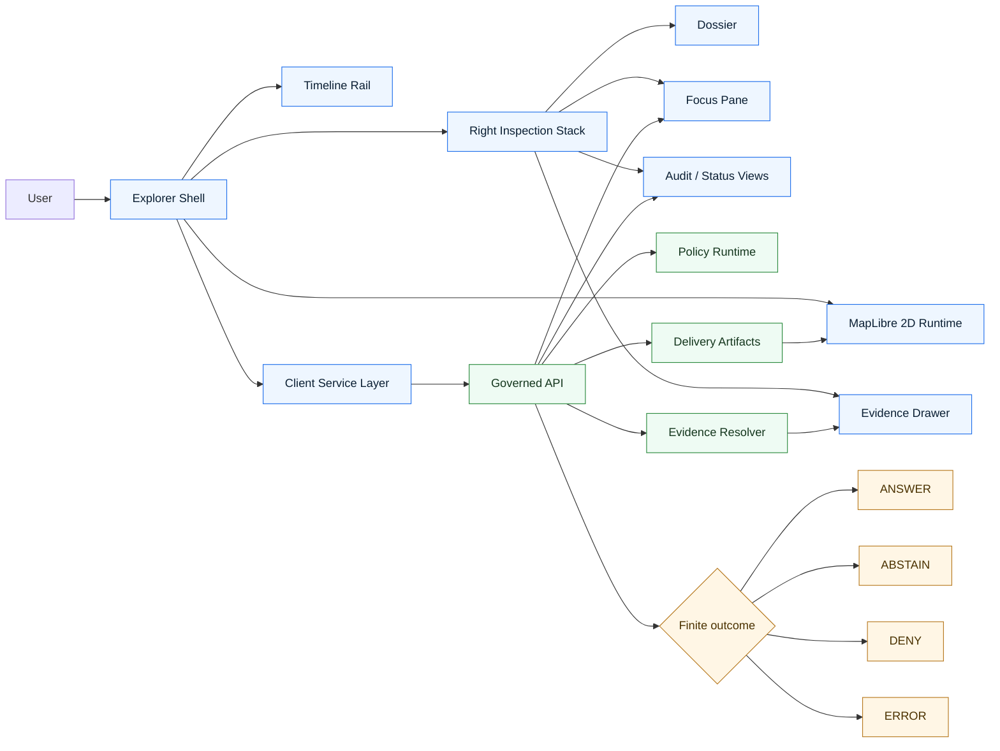

<!-- [KFM_META_BLOCK_V2]
doc_id: kfm://doc/<NEEDS_UUID>
title: KFM Explorer Web
type: standard
version: v1
status: draft
owners: @bartytime4life
created: 2026-03-22
updated: 2026-04-02
policy_label: public
related: [../../README.md, ../README.md, ../../web/README.md, ../governed-api/README.md, ../api/src/api/README.md, ../review-console/README.md, ../workers/README.md, ../cli/README.md, ../../contracts/README.md, ../../policy/README.md, ../../tests/README.md, ../../data/README.md, ../../pipelines/README.md, ../../.github/workflows/README.md]
tags: [kfm, explorer-web, maplibre, evidence, shell]
notes: [UUID still needs authoritative allocation; created/updated dates follow current public directory history visible on main; current public main confirms the directory and README, while deeper runtime contents remain verification-bounded.]
[/KFM_META_BLOCK_V2] -->

# KFM Explorer Web

Persistent, map-first, time-aware, trust-visible shell for Kansas Frontier Matrix exploration, dossier inspection, evidence drill-through, and bounded Focus flows.

> **Status:** `experimental`  
> **Owners:** `@bartytime4life`  
>         
> **Quick jumps:** [Scope](#scope) · [Repo fit](#repo-fit) · [Accepted inputs](#accepted-inputs) · [Exclusions](#exclusions) · [Directory tree](#directory-tree) · [Quickstart](#quickstart) · [Usage](#usage) · [Diagram](#diagram) · [Surface matrix](#surface-matrix) · [Task list](#task-list) · [FAQ](#faq) · [Appendix](#appendix)  
> **Repo fit:** `apps/explorer-web/README.md` — shell-boundary README inside `apps/`, kept aligned with `../../web/README.md`, the governed API boundary docs, and adjacent verification/policy surfaces.

> [!IMPORTANT]
> Current public `main` proves that `apps/explorer-web/` exists as a real repo path and currently exposes `README.md`. What remains unverified is the deeper runtime subtree: manifests, app code, routes, tests, fixtures, and dev wiring. This README therefore documents a **confirmed boundary** plus a **proposed realization**, without smoothing the difference away.

| Field | Value |
|---|---|
| Path | `apps/explorer-web/README.md` |
| Primary role | Persistent shell boundary for KFM’s trust-visible web experience |
| Truth posture | `CONFIRMED doctrine` / `CONFIRMED public path` / `PROPOSED realization` / `UNKNOWN mounted implementation depth` |
| Upstream | [`../README.md`](../README.md) · [`../../README.md`](../../README.md) |
| Parallel | [`../../web/README.md`](../../web/README.md) |
| Sibling app docs | [`../governed-api/README.md`](../governed-api/README.md) · [`../review-console/README.md`](../review-console/README.md) · [`../workers/README.md`](../workers/README.md) · [`../cli/README.md`](../cli/README.md) |
| Deeper API doc | [`../api/src/api/README.md`](../api/src/api/README.md) |
| Adjacent governed roots | [`../../contracts/README.md`](../../contracts/README.md) · [`../../policy/README.md`](../../policy/README.md) · [`../../tests/README.md`](../../tests/README.md) · [`../../data/README.md`](../../data/README.md) · [`../../pipelines/README.md`](../../pipelines/README.md) · [`../../.github/workflows/README.md`](../../.github/workflows/README.md) |

---

## Scope

`apps/explorer-web/` is the shell-side boundary where KFM doctrine becomes user-facing product behavior.

In KFM terms, this is not “just a frontend.” It is the place where geography, time scope, trust cues, evidence access, release context, and bounded synthesis stay coordinated instead of fragmenting into disconnected views.

At minimum, this boundary is expected to hold together:

- **Explore** as the default map-first discovery surface
- **Timeline** as a coequal operating control, not a hidden filter
- **Dossier** as a durable inspected object, not a throwaway modal
- **Story** as citation-bearing shell choreography
- **Evidence Drawer** as the required drill-through trust object
- **Focus** as governed bounded synthesis inside the same shell
- **Compare**, **Export**, and role-gated **Review** as shell variations rather than separate truth systems

This README documents the **shell boundary** and its adjacent contracts. It does **not** claim that the full runtime subtree beneath this directory is already populated on the checked-out working branch.

[Back to top](#kfm-explorer-web)

---

## Repo fit

### Current public snapshot

| Signal | Current public `main` | Posture |
|---|---|---|
| Directory path | `apps/explorer-web/` exists | **CONFIRMED** |
| Current file inventory in this directory | `README.md` only | **CONFIRMED** |
| Parent `apps/` listing | `cli/`, `explorer-web/`, `governed-api/`, `review-console/`, `workers/`, `README.md` | **CONFIRMED** |
| Parallel UI doc surface | `web/README.md` exists and currently carries concrete UI contract guidance | **CONFIRMED** |
| Deeper API-shaped doc surface | `apps/api/src/api/README.md` is also present | **CONFIRMED** |
| Visible directory history | public commit history is visible on `2026-03-22` and `2026-04-02` | **CONFIRMED** |
| Child manifests, runtime entrypoints, tests, fixtures | not proven from current public snapshot | **NEEDS VERIFICATION** |

> [!NOTE]
> The parent `apps/README.md` still describes `apps/explorer-web/README.md` as part of a proposed local README coverage set. The public tree now proves the path exists. The deeper implementation is what remains open.

### Boundary links

| Relation | Path | Why it matters |
|---|---|---|
| Parent boundary | [`../README.md`](../README.md) | Defines `apps/` as the runtime-facing surface family |
| Root posture | [`../../README.md`](../../README.md) | Establishes the repo-wide trust path, verification posture, and monorepo frame |
| Parallel UI doctrine | [`../../web/README.md`](../../web/README.md) | Current UI-root README with concrete shell, contract, and local-dev guidance |
| Sibling API boundary | [`../governed-api/README.md`](../governed-api/README.md) | App-level governed API boundary on current public `main` |
| Deeper API contract surface | [`../api/src/api/README.md`](../api/src/api/README.md) | Contract-first `src/api` enforcement README on current public `main` |
| Review-bearing sibling | [`../review-console/README.md`](../review-console/README.md) | Keeps review as a shell variation, not a detached product |
| Worker boundary | [`../workers/README.md`](../workers/README.md) | Export, projection, validation, and correction-adjacent jobs |
| Operator CLI boundary | [`../cli/README.md`](../cli/README.md) | Human-invoked governed operational flows |
| Shared contracts | [`../../contracts/README.md`](../../contracts/README.md) | Trust-bearing payload families belong there, not as app-local copies |
| Shared policy | [`../../policy/README.md`](../../policy/README.md) | Deny-by-default and obligation logic stay outside React components |
| Shared verification | [`../../tests/README.md`](../../tests/README.md) | E2E, accessibility, negative-path, and release/correction proof burdens |
| Shared data / catalog lane | [`../../data/README.md`](../../data/README.md) | Truth-path zones and catalog closure stay upstream of app rendering |
| Pipeline lane root | [`../../pipelines/README.md`](../../pipelines/README.md) | Source intake and packaging lanes should hand off review-bearing artifacts rather than browser-owned source logic |
| Workflow surface | [`../../.github/workflows/README.md`](../../.github/workflows/README.md) | Current public workflow lane is still README-only, so shell claims must stay verification-bounded |

### Verified carry-forward from `../../web/README.md`

Current public `main` still exposes a parallel UI-root README at `web/README.md`. Until the active branch explicitly consolidates or supersedes it, explorer-web should preserve the following already-documented UI rules.

| Carry-forward rule | Public evidence | Explorer-web reading |
|---|---|---|
| React + TypeScript UI root is currently documented under `web/` | **CONFIRMED there** | Treat framework-specific subtree names here as **PROPOSED** until branch-local files confirm them |
| Network I/O lives only in an explicit service layer | **CONFIRMED there** | Keep fetch logic out of components, hooks, and render helpers |
| Focus is cite-or-abstain and returns `audit_ref` | **CONFIRMED there** | Keep explicit negative states and review hooks first-class |
| `ViewStateV1`, `Citation`, and `Focus*V1` DTOs are named contracts | **CONFIRMED there** | Reuse or converge on existing vocabulary rather than inventing shell-local synonyms |
| `citation.ref` should resolve to a human-readable evidence view in `≤ 2` API calls | **CONFIRMED there** | Treat evidence-resolution fan-out as an acceptance criterion, not a polish task |

### Boundary rule

This directory should own **shell composition**, **interaction continuity**, and **UI-local rendering behavior**.

It should **not** become the owner of canonical truth, evidence resolution law, policy adjudication, release authority, or unrestricted data access.

[Back to top](#kfm-explorer-web)

---

## Accepted inputs

Only the following kinds of work belong here.

| Input class | Belongs here? | Notes |
|---|---:|---|
| Shell layout and continuity behavior | Yes | Persistent map + timeline + right-stack coordination |
| Map runtime integration | Yes | MapLibre-centered 2D portrayal and interaction layer |
| Evidence Drawer consumers | Yes | App-side rendering of already-governed evidence payloads |
| Dossier / Story / Focus presentation | Yes | UI composition and state transitions |
| View-state and replay helpers | Yes | Public-safe, serializable shell-state objects used for replay and scope grounding |
| Client-side contract adapters | Yes | View-state, citation, evidence, and Focus DTOs that stay aligned with governed API contracts |
| Client service adapters | Yes | Explicit network boundary for governed API access only |
| Export preview UI | Yes | Outward artifact preview with trust cues intact |
| Accessibility and reduced-motion handling | Yes | First-class acceptance burden |
| Saved-view hydration | Yes | Policy-safe rehydration only |
| Route-family rehydration | Yes | Public-read, bounded-synthesis, compare, and review views |
| On-map provenance/status overlays | Maybe | **PROPOSED** extension; only if governed APIs already provide safe payloads |
| Canonical evidence resolution logic | No | Must stay behind governed API / resolver layers |
| Policy bundle authoring | No | Lives in shared policy boundary |
| Source onboarding / ingest / promotion | No | Worker / pipeline / data boundaries |
| Raw or unpublished data inspection from browser | No | Explicitly excluded |
| Direct model-runtime invocation from browser | No | Focus remains a governed API flow |
| Hidden network calls inside components | No | Network I/O should stay in an explicit client-service layer |

[Back to top](#kfm-explorer-web)

---

## Exclusions

This directory is **not** the place for convenience shortcuts that punch through the trust membrane.

| Exclusion | Why it does not belong here | Put it here instead |
|---|---|---|
| Direct database access | Breaks governed API boundary | Governed API or shared backend packages |
| Direct object-store reads for restricted assets | Bypasses policy and evidence mediation | Governed API / signed delivery path |
| Direct access to RAW / WORK / QUARANTINE / unpublished data | Violates KFM truth path | [`../../data/`](../../data/) review path, workers, or governed delivery surfaces |
| Policy decision logic in React components | Causes drift between UI and enforcement | [`../../policy/`](../../policy/) + backend enforcement |
| Hidden alternate admin truth surface | Violates shell continuity and trust visibility | Role-gated shell variation |
| Renderer-owned domain truth | Reverses KFM ordering | Keep meaning in contracts + metadata |
| Default 3D showcase mode | KFM remains 2D-first by default | Controlled, burden-bearing route only |
| Restricted payload caching in browser storage | Can leak sensitive or stale state | Server-mediated, scoped hydration only |
| Free-form AI assistant UX detached from evidence | Violates cite-or-abstain and bounded runtime outcomes | Governed Focus flow |
| Ad hoc schema copies in the app | Creates parallel contract universes | Shared contracts directory |
| “Helpful” direct fetches from components | Hides trust-boundary violations in presentation code | Explicit service layer only |
| Browser-owned ingest or diff logic | Reverses the trust path and proof burden | [`../../pipelines/`](../../pipelines/) or workers |

> [!WARNING]
> This app must not quietly become the easiest place to bypass policy, evidence, or release context. In KFM, the last mile is part of publication, not cosmetic packaging.

[Back to top](#kfm-explorer-web)

---

## Directory tree

### Current public-main snapshot (**CONFIRMED**)

```text
apps/
├─ README.md
├─ cli/
│  └─ README.md
├─ explorer-web/
│  └─ README.md
├─ governed-api/
│  └─ README.md
├─ review-console/
│  └─ README.md
└─ workers/
   └─ README.md
```

> [!NOTE]
> A deeper API-shaped documentation surface is also reachable at `apps/api/src/api/README.md` on current public `main`. Keep that link visible until the checked-out branch settles which API boundary is authoritative.

### Proposed local runtime subtree (**PROPOSED / NEEDS VERIFICATION**)

This starter shape aligns the explorer boundary with the currently published `web/README.md` guidance, without claiming that the subtree is already mounted as shown below.

```text
apps/explorer-web/
├─ README.md
├─ package.json                      # NEEDS VERIFICATION
├─ tsconfig.json                     # NEEDS VERIFICATION
├─ .env.example                      # PROPOSED
├─ public/                           # PROPOSED
│  └─ ...
└─ src/
   ├─ main.tsx                       # PROPOSED bootstrap
   ├─ app/
   │  ├─ App.tsx
   │  ├─ router.tsx
   │  └─ layout/
   ├─ contracts/
   │  ├─ viewstate.ts
   │  ├─ citations.ts
   │  ├─ evidence.ts
   │  └─ api.ts
   ├─ services/
   │  ├─ apiClient.ts
   │  ├─ focusClient.ts
   │  ├─ evidenceResolver.ts
   │  └─ auditClient.ts
   ├─ components/
   │  ├─ map/
   │  ├─ story/
   │  ├─ focus/
   │  ├─ evidence/
   │  └─ audit/
   ├─ features/
   ├─ hooks/
   ├─ styles/
   ├─ assets/
   ├─ test/
   └─ __tests__/
```

### Interpretation rule

- The **current public-main snapshot** above is grounded in the currently visible public tree.
- The **proposed subtree** is a buildable target shape, not a claim of present implementation.
- If the checked-out branch uses a different runtime root such as `apps/web/` or `web/`, that reality wins and this README should be reconciled rather than duplicated.

[Back to top](#kfm-explorer-web)

---

## Quickstart

This repo’s current posture favors **verification-first inspection** over speculative startup commands.

### 1) Confirm the live runtime shape

```bash
git rev-parse HEAD 2>/dev/null || true
find apps -maxdepth 2 -type d | sort
find apps/explorer-web -maxdepth 3 -print 2>/dev/null || true
```

### 2) Inspect neighboring boundaries before editing code

```bash
sed -n '1,240p' apps/README.md
sed -n '1,260p' web/README.md 2>/dev/null || true
sed -n '1,260p' apps/governed-api/README.md 2>/dev/null || true
sed -n '1,260p' apps/api/src/api/README.md 2>/dev/null || true
sed -n '1,260p' apps/review-console/README.md 2>/dev/null || true
sed -n '1,260p' apps/workers/README.md 2>/dev/null || true
sed -n '1,260p' apps/cli/README.md 2>/dev/null || true
sed -n '1,260p' data/README.md 2>/dev/null || true
sed -n '1,260p' pipelines/README.md 2>/dev/null || true
```

> [!NOTE]
> The current parallel `web/README.md` documents a React + TypeScript UI root, a service-only network boundary, named view/citation/focus contracts, and an npm-based local startup path. Carry those forward deliberately; do not assume they have already migrated into `apps/explorer-web/` without branch-local proof.

### 3) Inventory contracts, policy surfaces, and tests that this shell depends on

```bash
find contracts -maxdepth 3 -type f | sort | head -200
find policy -maxdepth 3 -type f | sort | head -200
find tests -maxdepth 4 -type f | sort | head -200
find .github/workflows -maxdepth 2 -type f | sort
```

### 4) Search for trust-critical vocabulary already in use

```bash
grep -RInE 'ViewState|Citation|EvidenceBundle|EvidenceRef|Evidence Drawer|RuntimeResponseEnvelope|CorrectionNotice|Focus|ABSTAIN|DENY|audit_ref|MapLibre|Timeline' \
  apps web contracts policy tests .github 2>/dev/null | head -200
```

### 5) Only then decide which runtime root is authoritative

Possible current outcomes:

- `apps/explorer-web/` is the active app root
- `apps/web/` is the active app root
- `web/` is still the active UI root
- multiple UI or API boundary docs coexist and need explicit convergence

> [!NOTE]
> The correct first action is usually **inventory**, not `npm install`.

### Optional local startup block (**NEEDS VERIFICATION**)

Use this only after confirming the real workspace manager and app path.

```bash
# Parallel /web root (CONFIRMED there, not here)
cd web
cp .env.example .env
npm install
npm run dev

# If apps/explorer-web becomes the active root, verify the actual package manager first.
npm run dev --workspace apps/explorer-web

# or
pnpm --filter explorer-web dev
```

[Back to top](#kfm-explorer-web)

---

## Usage

### Operating law

The explorer shell should preserve one coordinated chain:

1. **Place selection** narrows time and context.
2. **Time refinement** narrows evidence and freshness interpretation.
3. **Evidence access** remains one hop away through the Evidence Drawer.
4. **Dossier** turns a selection into a durable inspected object.
5. **Story** keeps map, time, and citations alive instead of breaking into detached narrative.
6. **Focus** inherits scope unless the user changes it through a governed control.
7. **Compare** preserves asymmetry and context on both sides.
8. **Export** previews what leaves the system and which trust cues remain attached.
9. **Review** is role-gated shell variation, not a second hidden product.

### Runtime separation

The shell owns **interaction continuity**.

The renderer owns **portrayal and interaction mechanics**.

The governed API owns **truth mediation, policy safety, evidence resolution, and bounded synthesis outcomes**.

### Client-side placement rules

| Concern | Expected home | Why |
|---|---|---|
| Network I/O | explicit service layer only | keeps trust-boundary behavior reviewable |
| View-state and citation DTOs | client contract types | preserves deterministic replay and evidence resolution expectations |
| Presentation components | component layer only | prevents hidden fetches and local policy drift |
| Policy decisions | never the browser | backend and shared policy remain authoritative |
| Restricted payload persistence | nowhere in browser storage | deny-by-default and no-reconstruction rules stay intact |

### State ownership rule

| State kind | Owner |
|---|---|
| Camera / selection / active mode / visible rail state | Shell |
| Selected time scope and compare anchors | Shell |
| Layer portrayal metadata | Governed metadata + renderer consumers |
| Rights / sensitivity / review / freshness posture | Governed payloads |
| Evidence resolution outcome | Governed API |
| Focus answer outcome (`ANSWER` / `ABSTAIN` / `DENY` / `ERROR`) | Governed API, rendered by shell |
| Long-lived canonical truth | Never the browser |

### Recommended minimum visible cues

At minimum, the explorer should keep these visible during consequential flows:

- selected geography
- active time scope
- release or freshness context
- policy posture where relevant
- route back to evidence
- `audit_ref` where applicable
- correction / supersession signal when applicable

> [!NOTE]
> Current public `main` proves a directory contract here, not a mounted runnable shell. That makes boundary discipline more important, not less: future code should land in a way that keeps this README true.

[Back to top](#kfm-explorer-web)

---

## Diagram



### Reading the diagram

- The **shell** is the persistent user-facing operating field.
- **MapLibre** is the 2D runtime inside the shell, not the shell itself.
- The **client service layer** is the only acceptable browser-side network boundary.
- The **governed API** remains the trust-bearing way to retrieve evidence, policy-safe portrayal inputs, and Focus outcomes.
- The explorer should never talk directly to canonical/internal stores.

[Back to top](#kfm-explorer-web)

---

## Surface matrix

| Surface | Primary job | Must preserve | Must never do |
|---|---|---|---|
| Explore | Map-first discovery | geography, time, trust cues | become a free-floating canvas detached from evidence |
| Timeline | Temporal control | valid-time / as-of reasoning | hide freshness as an “advanced” feature |
| Dossier | Durable inspected object | evidence, release, correction, policy | behave like a throwaway modal |
| Story | Guided narrative | citations, map continuity, time continuity | sever itself from current scope |
| Evidence Drawer | Inspectable support route | provenance, freshness, rights, audit linkage | collapse into decorative “source notes” |
| Focus | Bounded synthesis | scope echo, citations, finite outcomes, `audit_ref` | act as unconstrained chat |
| Compare | Side-by-side contextual comparison | lhs/rhs time basis and release context | flatten asymmetry or hide basis |
| Export | Outward artifact preview | trust cues, manifest, obligations | silently strip provenance context |
| Review | Role-gated action overlay | decision context, correction route | become a separate hidden truth system |

[Back to top](#kfm-explorer-web)

---

## Contract touchpoints

The explorer should consume a compact set of shared contracts before broad UI expansion.

| Contract / artifact | Role in explorer-web | Status here |
|---|---|---|
| `ViewStateV1` | Rehydrate time range, bbox, active layers, story anchor, and replay-safe shell scope | **CONFIRMED in parallel UI doc / NEEDS VERIFICATION here** |
| `Citation` | Keep Focus and Story claims resolvable to human-readable evidence | **CONFIRMED in parallel UI doc / NEEDS VERIFICATION here** |
| `FocusQueryV1` / `FocusAnswerV1` | Render bounded Q&A with citations and `audit_ref` | **CONFIRMED in parallel UI doc / NEEDS VERIFICATION here** |
| `citation.ref` resolution budget | Keep evidence drill-through fast and inspectable | **CONFIRMED in parallel UI doc / NEEDS VERIFICATION here** |
| `shell_state` | Local non-sensitive continuity state for mode, selection, compare anchors, and panel openness | **PROPOSED explorer-web-local naming** |
| `evidence_drawer_payload` | Render inspectable support and provenance depth | **PROPOSED** |
| `dossier_payload` | Durable object view for place/feature inspection | **PROPOSED** |
| `layer_metadata` | Explain portrayal meaning outside style JSON | **PROPOSED** |
| `EvidenceBundle` | Deliver policy-shaped evidence drill-through to the UI | **CONFIRMED doctrine / mounted emitter NEEDS VERIFICATION** |
| `RuntimeResponseEnvelope` | Preserve finite accountable outcomes across runtime surfaces | **CONFIRMED doctrine / mounted usage NEEDS VERIFICATION** |
| `CorrectionNotice` | Preserve correction lineage in visible surfaces | **CONFIRMED doctrine / mounted usage NEEDS VERIFICATION** |

### Contract rule of thumb

A lean, fixture-backed first wave is better than ambitious UI breadth with no trustworthy payload boundaries.

[Back to top](#kfm-explorer-web)

---

## Quick reference tables

### Trust-visible cue set

| Cue | Meaning |
|---|---|
| Scope chip | Current place / geometry / layer / role boundary |
| Freshness cue | Recency or stale-visible warning |
| Policy chip | Public-safe / restricted / generalized / redacted / review-required posture |
| Review chip | Draft / quarantined / reviewed / promoted / withdrawn / superseded |
| Knowledge marker | Observed / documentary / derived / modeled / generalized |
| AI badge | Model-assisted synthesis is present |
| `audit_ref` hook | Stable route back to the governed runtime event |
| Correction marker | Claim lineage changed after release |

### 2D / 3D rule

| Mode | Default? | Why |
|---|---:|---|
| MapLibre 2D shell | Yes | Best fit for inspectability, accessibility, and disciplined map-first operation |
| Controlled 3D story mode | No | Allowed only when it bears real explanatory burden and keeps trust objects intact |

[Back to top](#kfm-explorer-web)

---

## Task list

### Definition of done for the README boundary

- [ ] Replace `<NEEDS_UUID>` with an authoritative document ID.
- [ ] Confirm whether `apps/explorer-web/` now contains manifests, source files, tests, or fixtures beyond `README.md`.
- [ ] Confirm whether `../../web/README.md` remains the primary parallel UI doc or should be folded into this boundary.
- [ ] Reconcile current dual API doc surfaces: `apps/governed-api/README.md` and `apps/api/src/api/README.md`.
- [ ] Verify active package manager, workspace tool, and dev entrypoint.
- [ ] Verify whether shared contracts already exist under `contracts/` and update links accordingly.
- [ ] Verify whether accessibility and reduced-motion checks are already wired in `tests/` or CI.
- [ ] Verify whether any 3D route or experiment currently exists and, if so, gate it behind a burden rubric.
- [ ] Confirm which upstream data and pipeline README links should stay visible here once the active branch settles.
- [ ] Add relative links to actual ADRs/runbooks once present.

### Definition of done for the runtime

- [ ] Explorer, Timeline, Dossier, Story, Focus, Compare, Export, and Review behave as one shell family.
- [ ] Every consequential claim remains one interaction away from inspectable evidence.
- [ ] Focus renders explicit `ANSWER / ABSTAIN / DENY / ERROR` outcomes with citations or explicit negative state.
- [ ] Citation clicks resolve to human-readable evidence without a hidden request waterfall.
- [ ] Exports preserve trust cues and do not silently drop provenance context.
- [ ] Renderer and shell remain separate concerns.
- [ ] No direct client access exists to canonical/internal stores.
- [ ] Network calls are confined to an explicit client-service layer.
- [ ] Keyboard use, reduced motion, and screen-reader labeling are verified across major shell states.
- [ ] Visual regression coverage exists for trust cues under pan / zoom / filter / compare transitions.

[Back to top](#kfm-explorer-web)

---

## FAQ

### Does this README prove that `apps/explorer-web/` exists right now?

Yes. Current public `main` proves that the directory exists and currently exposes `README.md`.

What it does **not** prove is a deeper runtime subtree, manifests, scripts, tests, or live route inventory under that directory.

### Why does this README still link to `../../web/README.md`?

Because the repo still exposes a parallel UI-oriented README under `web/`, and it now documents concrete UI contract guidance: React + TypeScript, a service-only network boundary, cite-or-abstain Focus behavior, and named shell DTOs. This boundary should not silently drift away from that surface until convergence is explicit on the active branch.

### Why are there two API-shaped links?

Current public `main` exposes both an app-level API boundary README at `apps/governed-api/README.md` and a deeper contract-first README at `apps/api/src/api/README.md`. This file keeps both visible until the checked-out branch settles which boundary is authoritative.

### Can explorer-web call PostGIS, object storage, or unpublished artifacts directly?

No. Explorer-web should consume **governed API** responses only.

### Is Focus a general chatbot surface?

No. Focus is a bounded synthesis surface that remains subordinate to released evidence, policy checks, and explicit finite runtime outcomes.

### Is 3D in scope here?

Only conditionally. KFM remains **2D-first**. Any 3D mode must carry explicit explanatory burden and keep the same trust objects available.

### Should the Evidence Drawer be optional on small screens?

No. It may compress or move into a sheet/full-page view, but consequential claims must remain inspectable.

[Back to top](#kfm-explorer-web)

---

## Appendix

<details>
<summary><strong>Appendix A — Proposed route patterns</strong></summary>

These route examples are **PROPOSED** starter patterns for shell rehydration.

```text
/explore?bbox=...&t=...&layers=...
/explore?mode=dossier&sel=feature:123&t=...
/explore?mode=story&story=flood-1876&chapter=2
/explore?mode=focus&sel=watershed:arkansas&t=1935-01-01/1935-12-31
/explore?mode=compare&lhs=...&rhs=...
/explore?mode=review&item=decision:456
/explore?mode=export&template=dossier
```

Interpretation rules:

- shell state rehydrates through current policy and release mediation
- previously valid deep links may reopen as generalized, restricted, stale-visible, or unavailable
- no deep link should bypass role, policy, or release checks

</details>

<details>
<summary><strong>Appendix B — Persistent shell checklist</strong></summary>

Keep these elements coordinated:

- selected geography
- active time scope
- active layers
- mode (`explore`, `dossier`, `story`, `focus`, `compare`, `export`, `review`)
- release context
- policy / review / freshness chips
- right-stack open state
- compare anchors
- saved-view hydration behavior

Avoid mixing:

- shell-owned navigation state
- truth-bearing evidence state
- privileged review state
- speculative local caches of restricted payloads

</details>

<details>
<summary><strong>Appendix C — Merge-time verification checklist</strong></summary>

Before treating this README as implementation-descriptive rather than boundary-descriptive:

1. Inspect the live repo tree.
2. Confirm the active runtime root.
3. Confirm manifests and scripts.
4. Confirm contract filenames and fixture paths.
5. Confirm current tests and workflows.
6. Confirm whether any parallel `web/` and `apps/*web*` docs need consolidation.
7. Replace all remaining placeholders in the meta block if stronger authority becomes available.
8. Narrow every `PROPOSED` path or component name that the checked-out branch disproves.

</details>

---

[Back to top](#kfm-explorer-web)
