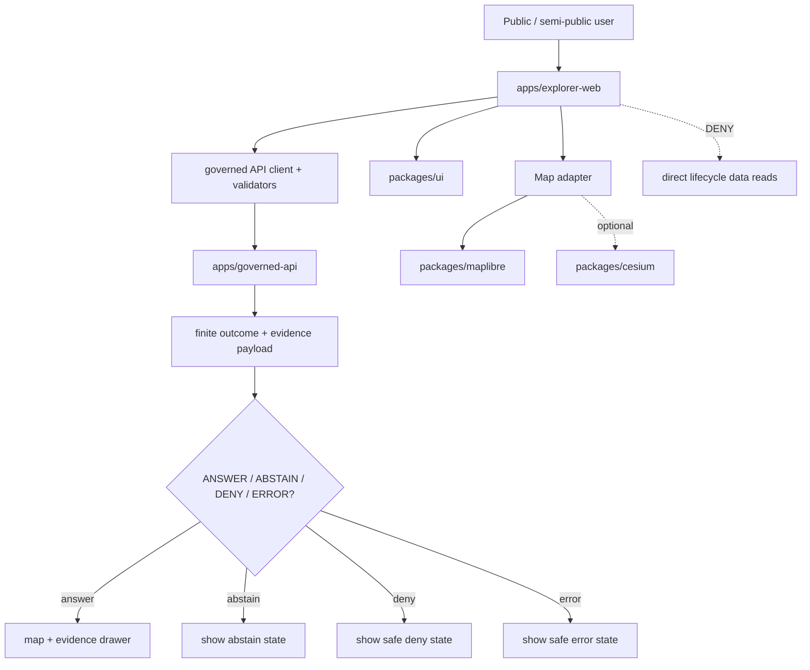

<!-- [KFM_META_BLOCK_V2]
doc_id: kfm://app/explorer-web/readme
title: Explorer Web App README
type: app-readme
version: v0.1
status: draft
owners: OWNER_TBD — Apps steward · UI steward · Map steward · Governed API steward · Policy steward · Docs steward
created: 2026-06-16
updated: 2026-06-16
policy_label: public
related:
  - ../README.md
  - ../governed-api/README.md
  - ../review-console/README.md
  - ../../docs/adr/ADR-0005-apps-explorer-web-is-the-canonical-map-first-shell.md
  - ../../docs/adr/ADR-0004-apps-governed-api-is-the-trust-membrane.md
  - ../../docs/adr/ADR-0025-public-client-never-reads-canonical-internal-stores.md
  - ../../docs/doctrine/directory-rules.md
  - ../../packages/ui/README.md
  - ../../packages/maplibre/README.md
  - ../../packages/cesium/README.md
  - ../../policy/access/README.md
  - ../../policy/decision/README.md
  - ../../release/README.md
  - ../../data/README.md
tags: [kfm, apps, explorer-web, map-first, public-ui, semi-public-ui, governed-api, trust-membrane, evidence-drawer, focus-mode]
notes:
  - "Replaces the short apps/explorer-web stub with a governed app README."
  - "ADR-0005 marks apps/explorer-web as the proposed canonical map-first shell; implementation maturity remains NEEDS VERIFICATION unless verified by current repo evidence."
  - "Explorer Web must read through governed-api only and must not directly read lifecycle data or canonical/internal stores."
[/KFM_META_BLOCK_V2] -->

<a id="top"></a>

<div align="center">

# Explorer Web App

`apps/explorer-web/`

**Map-first public/semi-public KFM shell for governed exploration, Evidence Drawer workflows, Focus Mode, stories, compare/export surfaces, settings, and diagnostics.**


[Purpose](#1-purpose) · [Repo fit](#2-repo-fit) · [Boundary](#3-authority-boundary) · [Inputs](#5-inputs) · [Exclusions](#6-exclusions) · [Shell surfaces](#7-shell-surfaces) · [Definition of done](#14-definition-of-done)

</div>

---

> [!IMPORTANT]
> **Status:** draft / `NEEDS VERIFICATION`  
> **Owners:** `OWNER_TBD` — Apps steward · UI steward · Map steward · Governed API steward · Policy steward · Docs steward  
> **Path:** `apps/explorer-web/README.md`  
> **Responsibility root:** `apps/` — deployable application surfaces  
> **Truth posture:** CONFIRMED file path / CONFIRMED app role from `apps/README.md` / PROPOSED canonical map-first shell per ADR-0005 / UNKNOWN implementation files, routes, tests, and deployment state

> [!CAUTION]
> `apps/explorer-web/` must not directly read `data/raw/`, `data/work/`, `data/quarantine/`, `data/processed/`, `data/catalog/`, `data/triplets/`, `data/published/`, canonical stores, model runtime outputs, or local source files. Normal public and semi-public UI behavior must use governed API envelopes, released artifacts, layer manifests, tiles, evidence payloads, and safe finite outcomes.

---

## Quick jump

- [1. Purpose](#1-purpose)
- [2. Repo fit](#2-repo-fit)
- [3. Authority boundary](#3-authority-boundary)
- [4. Default posture](#4-default-posture)
- [5. Inputs](#5-inputs)
- [6. Exclusions](#6-exclusions)
- [7. Shell surfaces](#7-shell-surfaces)
- [8. Diagram](#8-diagram)
- [9. Decision vocabulary](#9-decision-vocabulary)
- [10. UI obligations](#10-ui-obligations)
- [11. Route contract](#11-route-contract)
- [12. Inspection path](#12-inspection-path)
- [13. Validation expectations](#13-validation-expectations)
- [14. Definition of done](#14-definition-of-done)
- [15. Open verification items](#15-open-verification-items)

---

## 1. Purpose

`apps/explorer-web/` is the KFM map-first public/semi-public UI lane.

It should host the deployable browser shell that composes governed API responses, map renderer adapters, shared UI components, layer manifests, Evidence Drawer payloads, Focus Mode responses, Story Node playback, compare/export flows, settings, and diagnostics into a user-facing experience.

It should make governed spatial knowledge inspectable without becoming the source of truth.

In scope:

- persistent map shell, route outlet, trust header, and time banner;
- governed layer catalog display and map interactions;
- Evidence Drawer over evidence-derived payloads;
- Focus Mode governed query and finite-result display;
- story, compare, export, settings, and diagnostics surfaces;
- typed governed API client and response validation;
- renderer adapters that keep MapLibre and optional Cesium behind boundaries.

Out of scope:

- direct lifecycle-data reads;
- canonical/internal store reads;
- policy decisions;
- release decisions;
- source acquisition;
- schema or contract authority;
- shared reusable component ownership;
- admin or steward review authority;
- direct model runtime calls.

[Back to top](#top)

---

## 2. Repo fit

| Concern | Owning root | Expected relationship |
|---|---|---|
| Explorer web shell | `apps/explorer-web/` | This README and future deployable map-first UI code, if accepted |
| Apps root | `apps/README.md` | Defines explorer-web as map-first public/semi-public UI |
| Public trust membrane | `apps/governed-api/` | Normal network path for public/semi-public UI data |
| Shared UI components | `packages/ui/` | Reusable primitives, badges, drawers, and layout components |
| 2D renderer wrapper | `packages/maplibre/` | MapLibre boundary package; shell should use adapters, not direct authority |
| Optional 3D renderer wrapper | `packages/cesium/` | Conditional and gated 3D wrapper |
| Policy gates | `policy/` | Access, sensitivity, rights, and decision policy |
| Release authority | `release/` | Publication, correction, rollback control |
| Lifecycle artifacts | `data/` | Source lifecycle, receipts, proofs, catalog, triplets, and published artifacts |
| Legacy/compat roots | `ui/`, `web/`, `styles/`, `viewer_templates/` | Compatibility or migration roots; not parallel shell authorities |

## 3. Authority boundary

Explorer Web is a deployable UI, not a truth source. It should render governed results and finite outcomes; it should not make independent source, evidence, sensitivity, release, or publication decisions.

```text
apps/explorer-web/ = map-first public/semi-public shell
apps/governed-api/ = trust membrane and normal data path
packages/ui/       = shared UI primitives
packages/maplibre/ = 2D renderer wrapper
packages/cesium/   = optional gated 3D renderer wrapper
policy/            = allow / deny / restrict / abstain gates
release/           = publication, correction, rollback authority
data/              = lifecycle artifacts, receipts, proofs, registries
```

## 4. Default posture

Explorer Web should fail safe and display finite negative states instead of guessing.

A route, drawer, map click, export, or focus response should not render claim-bearing output when any of these are unresolved:

- governed API response shape;
- finite outcome envelope;
- EvidenceRef / EvidenceBundle support;
- citation validation;
- layer manifest release state;
- sensitivity and rights posture;
- redaction/generalization obligations;
- valid-time or time-state semantics;
- source-role badge or provenance summary;
- rollback/correction status where relevant.

## 5. Inputs

| Input family | Examples | Required posture |
|---|---|---|
| Governed API response | answer, abstain, deny, error, decision envelope, evidence drawer payload | Runtime-validated before render |
| Layer context | layer descriptor, manifest ref, tile URL, legend, valid time, release state | Released or bounded safe source only |
| Evidence context | EvidenceRef, EvidenceBundle summary, citation validation, proof visibility | Required for claim-bearing UI |
| Policy context | sensitivity, rights, audience, redaction obligations, reason code | Preserved in UI state |
| Map context | viewport, selected feature id, tile state, adapter state | Never treated as truth by itself |
| User context | public/semi-public role, settings, language, accessibility preferences | Used only within allowed UI scope |
| Export context | selected layer, bounding area, citation bundle, redaction state | Governed export only |

## 6. Exclusions

| Does not belong here | Correct home |
|---|---|
| Public API implementation | `apps/governed-api/` |
| Shared UI primitives | `packages/ui/` |
| MapLibre renderer wrapper | `packages/maplibre/` |
| Cesium renderer wrapper | `packages/cesium/` |
| Policy bundles | `policy/` |
| Schemas and contracts | `schemas/contracts/v1/`, `contracts/` |
| Lifecycle artifacts, receipts, proofs, catalog, triplets | `data/` |
| Release manifests, rollback cards, correction notices | `release/` |
| Steward review authority | `apps/review-console/` and review governance lanes |
| Admin-only operations | `apps/admin/` |
| Source acquisition or connectors | `connectors/` |
| Direct model runtime behavior | `runtime/` behind governed API only |
| Legacy shell homes | `ui/`, `web/`, `styles/`, `viewer_templates/` as independent authorities |

## 7. Shell surfaces

Surface names below are expected shell responsibilities, not proof of implemented routes.

| Surface | Purpose | Default posture |
|---|---|---|
| `Explore` | Map and layer browsing | Read governed layer manifests and tiles only |
| `Evidence Drawer` | Show evidence-backed detail for selected features or claims | Requires EvidenceBundle-derived payload |
| `Focus Mode` | Guided governed query surface | Finite outcomes; no direct model output |
| `Story Player` | Narrative playback over governed spatial states | Evidence continuity required |
| `Compare` | Compare layers, times, versions, or candidate/released states | Requires clear provenance and release state |
| `Export` | Export bounded public-safe data or reports | Requires redaction, citation, and release checks |
| `Settings` | User display preferences | No policy or release side effects |
| `Diagnostics` | Trust, version, envelope, route, and layer diagnostics | Safe, non-secret, non-sensitive display |

## 8. Diagram



## 9. Decision vocabulary

| Outcome | Meaning | UI behavior |
|---|---|---|
| `ANSWER` | Governed response has evidence and policy support | Render bounded answer with citations/evidence affordances |
| `ABSTAIN` | Support is unresolved or insufficient | Explain limited scope without inventing answer |
| `DENY` | Policy blocks exposure | Show safe reason without protected detail |
| `ERROR` | Runtime, validation, network, or schema failure | Show safe diagnostic and retry/report path |
| `RESTRICT` | Bounded answer with audience/redaction/export limits | Preserve obligations in UI and export flow |
| `HOLD` | Review/release/evidence state incomplete | Do not render public claim-bearing output |

## 10. UI obligations

| Obligation | Example effect |
|---|---|
| `governed_api_only` | All claim-bearing data arrives through governed API envelopes |
| `evidence_drawer_required` | Claim-bearing feature detail links to evidence payloads |
| `policy_badges_required` | Sensitivity, rights, release, source-role, and time-state are visible where relevant |
| `redaction_preserved` | Redacted/generalized data is not re-expanded by UI code |
| `renderer_boundary_preserved` | MapLibre/Cesium details remain behind adapters/wrappers |
| `no_model_direct` | UI never renders direct model runtime output as truth |
| `safe_export_required` | Export flows preserve citations, redaction, and release checks |
| `accessibility_required` | Keyboard, focus, contrast, and skip-link posture remains testable |

## 11. Route contract

Every long-lived route or panel should document or encode:

- route purpose;
- governed API endpoint or envelope family used;
- expected finite outcomes;
- evidence/citation display behavior;
- sensitivity and rights display behavior;
- redaction/generalization behavior;
- empty/loading/error/deny/abstain states;
- export behavior, if any;
- tests or fixtures that prove boundary behavior.

## 12. Inspection path

Implementation files, route inventory, renderer imports, tests, fixtures, package metadata, and deployment state remain `NEEDS VERIFICATION`.

```bash
find apps/explorer-web -maxdepth 6 -type f | sort
find apps/explorer-web packages/ui packages/maplibre packages/cesium apps/governed-api tests fixtures -maxdepth 6 -type f 2>/dev/null | grep -Ei 'explorer|map|layer|evidence|focus|story|compare|export|diagnostic|governed|maplibre|cesium' | sort
find ui web styles viewer_templates -maxdepth 5 -type f 2>/dev/null | sort
```

## 13. Validation expectations

Useful validation for this app should cover:

- no direct reads from lifecycle data roots;
- all claim-bearing requests use governed API client;
- finite outcomes render as `ANSWER`, `ABSTAIN`, `DENY`, or `ERROR` states;
- map feature clicks resolve through governed claim/evidence requests;
- Evidence Drawer does not invent unsupported claims;
- redaction/generalization cannot be reversed client-side;
- exports require citation, redaction, and release support;
- renderer imports stay inside accepted adapter/wrapper boundaries.

## 14. Definition of done

- [ ] Owners are confirmed and `OWNER_TBD` is replaced.
- [ ] Route inventory is documented.
- [ ] Governed API client and response validators are confirmed.
- [ ] Renderer import boundaries are verified.
- [ ] Evidence Drawer, Focus Mode, layer catalog, export, and diagnostics behavior are tested.
- [ ] Direct lifecycle-data import/read checks are covered.
- [ ] Public/semi-public finite-outcome states are tested.
- [ ] Accessibility checks are documented or automated.
- [ ] Compatibility-root migration posture is documented where legacy shell files exist.

## 15. Open verification items

| Item | Why it matters |
|---|---|
| Confirm implementation files beyond README | Prevents overclaiming shell maturity |
| Confirm route inventory | Required for public/semi-public UI boundary review |
| Confirm governed API client and validators | Required for trust membrane enforcement |
| Confirm renderer import boundaries | Required to keep renderer as adapter, not authority |
| Confirm tests and fixtures | Required before implementation claims |
| Confirm export behavior | Required before any public download claims |
| Confirm legacy shell roots | Required to prevent parallel shell authority drift |
| Confirm deployment posture | Required before public/semi-public exposure |

<details>
<summary>Appendix A — no-loss preservation note</summary>

The previous README was a short stub: `Map-first public/semi-public interface. Persistent governed shell, evidence drawer, focus mode, story player, compare, export, settings, diagnostics.` This replacement preserves that intent while adding governance boundaries, route expectations, finite-outcome posture, renderer discipline, validation expectations, and open verification items.

It does not claim that routes, components, API clients, tests, fixtures, renderer adapters, deployment, or export behavior are implemented.

</details>

## Status summary

`apps/explorer-web/` should be the map-first public/semi-public shell only when implementation, route inventory, tests, governed API client behavior, renderer boundaries, and deployment posture are verified.

It must remain downstream of governed APIs, policy decisions, EvidenceBundle closure, release state, correction/rollback controls, and renderer adapter boundaries without becoming source truth, release authority, policy authority, lifecycle store, model-output surface, or parallel shell authority.

<p align="right"><a href="#top">Back to top</a></p>
