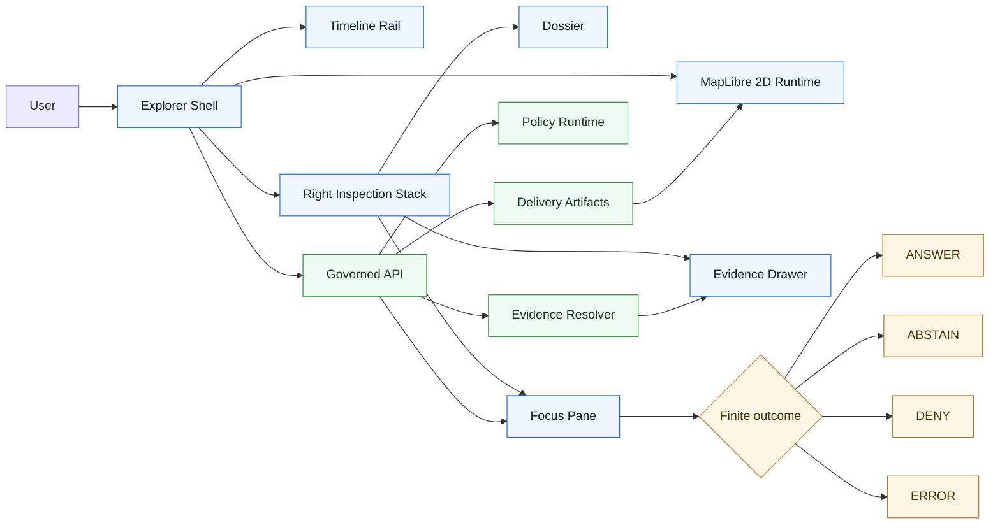

<!-- [KFM_META_BLOCK_V2]
doc_id: kfm://doc/<NEEDS_UUID>
title: KFM Explorer Web
type: standard
version: v1
status: draft
owners: <NEEDS_VERIFICATION>
created: <YYYY-MM-DD NEEDS VERIFICATION>
updated: <YYYY-MM-DD NEEDS VERIFICATION>
policy_label: <NEEDS_VERIFICATION>
related: [../../README.md, ../README.md, ../../web/README.md, ../api/src/api/README.md, ../../contracts/, ../../policy/, ../../docs/, ../../tests/]
tags: [kfm, explorer-web, maplibre, evidence, shell]
notes: [New README for the expected apps/explorer-web boundary; current repo still contains a parallel ../../web/README.md UI surface doc; keep both aligned until runtime topology is reverified.]
[/KFM_META_BLOCK_V2] -->

# KFM Explorer Web

Persistent, map-first, time-aware, trust-visible shell for Kansas Frontier Matrix exploration, dossier inspection, evidence drill-through, and bounded Focus flows.

> [!IMPORTANT]
> This README is intentionally verification-bounded. It documents the **expected** `apps/explorer-web/` runtime boundary in repo-native KFM terms, while keeping live implementation claims explicitly limited. Where the current repository does **not** prove a subtree, manifest, route, or test harness, this file marks it as **PROPOSED**, **UNKNOWN**, or **NEEDS VERIFICATION** rather than smoothing it into false certainty.

| Field | Value |
|---|---|
| Status | `experimental` |
| Owners | `<NEEDS_VERIFICATION>` |
| Truth posture | `CONFIRMED doctrine` / `PROPOSED realization` / `UNKNOWN mounted implementation depth` |
| Repo fit | `apps/explorer-web/` within `apps/`, aligned with `../../web/README.md` until topology is reverified |
| Upstream | [`../README.md`](../README.md) · [`../../README.md`](../../README.md) |
| Downstream | [`../api/src/api/README.md`](../api/src/api/README.md) · `../../contracts/` · `../../policy/` · `../../tests/` |


**Quick jumps:** [Scope](#scope) · [Repo fit](#repo-fit) · [Inputs](#accepted-inputs) · [Exclusions](#exclusions) · [Directory tree](#directory-tree) · [Quickstart](#quickstart) · [Usage](#usage) · [Diagram](#diagram) · [Surface matrix](#surface-matrix) · [Task list](#task-list) · [FAQ](#faq) · [Appendix](#appendix)

---

## Scope

`apps/explorer-web/` is the expected home for the **persistent governed shell** that turns KFM doctrine into a runnable web surface. In KFM terms, this is not “just a frontend.” It is the place where map state, time scope, trust cues, evidence access, release context, and bounded synthesis remain coordinated instead of fragmenting into disconnected screens.

At this boundary, the web explorer is expected to hold together:

- **Explore** as the default map-first discovery surface
- **Timeline** as a coequal operating control, not a hidden filter
- **Dossier** as a durable inspected object, not a throwaway modal
- **Story** as citation-bearing shell choreography
- **Evidence Drawer** as the required drill-through trust object
- **Focus** as governed bounded synthesis inside the same shell
- **Compare**, **Export**, and role-gated **Review** as shell variations rather than separate truth systems

This README covers the **app-side shell boundary** and its adjacent contracts. It does **not** claim that every component below already exists in the mounted repo.

[Back to top](#kfm-explorer-web)

## Repo fit

### Path and role

- **Expected path:** `apps/explorer-web/`
- **Parent boundary:** [`../README.md`](../README.md)
- **Root doctrine and repo framing:** [`../../README.md`](../../README.md)
- **Parallel current UI doc to keep aligned:** [`../../web/README.md`](../../web/README.md)
- **Primary downstream governed interface:** [`../api/src/api/README.md`](../api/src/api/README.md)

### Why this doc exists

The current repo’s `apps/` boundary doc explicitly expects a local README for the persistent shell runtime and names **`apps/explorer-web/README.md` or `apps/web/README.md`** as the place where shell continuity, trust-visible UX, and map/timeline behavior should be documented. This file fills that role without pretending the subtree is already fully verified.

### Upstream and downstream links

| Direction | Path | Why it matters here |
|---|---|---|
| Upstream | [`../../README.md`](../../README.md) | Repo-wide trust posture, source discipline, and architecture framing |
| Upstream | [`../README.md`](../README.md) | `apps/` boundary, verification-first runtime documentation rule |
| Parallel | [`../../web/README.md`](../../web/README.md) | Current UI-specific README with shell/runtime guidance that should stay aligned |
| Downstream | [`../api/src/api/README.md`](../api/src/api/README.md) | Governed API boundary; explorer-web should consume policy-safe payloads only |
| Adjacent | `../../contracts/` | Shared JSON Schema / OpenAPI / fixtures boundary |
| Adjacent | `../../policy/` | Deny-by-default policy bundles and vocabularies |
| Adjacent | `../../tests/` | Cross-cutting contract, policy, e2e, and regression expectations |
| Adjacent | `../../styles/` or equivalent | **PROPOSED** style registry and governed portrayal assets |
| Adjacent | `../../docs/` | ADRs, runbooks, verification notes, and surface taxonomy docs |

### Boundary rule

This app should own **shell composition**, **interaction continuity**, and **UI-local rendering behavior**. It should **not** become the owner of canonical truth, evidence resolution law, policy adjudication, or unrestricted data access.

[Back to top](#kfm-explorer-web)

## Accepted inputs

Only the following kinds of work belong here.

| Input class | Belongs here? | Notes |
|---|---:|---|
| Shell layout and continuity behavior | Yes | Persistent map + timeline + right-stack coordination |
| Map runtime integration | Yes | MapLibre-centered 2D portrayal and interaction layer |
| Evidence Drawer consumers | Yes | App-side rendering of already-governed evidence payloads |
| Dossier / Story / Focus presentation | Yes | UI composition and state transitions |
| Layer metadata consumers | Yes | Read-only, governed portrayal metadata usage |
| Export preview UI | Yes | Outward artifact preview with trust cues intact |
| Accessibility and reduced-motion handling | Yes | First-class acceptance burden |
| Saved-view hydration | Yes | Policy-safe rehydration only |
| Route-family rehydration | Yes | Public-read, bounded-synthesis, compare, review views |
| On-map provenance/status overlays | Maybe | **PROPOSED** extension; only if governed APIs already provide safe payloads |
| Canonical evidence resolution logic | No | Must stay behind governed API / resolver layers |
| Policy bundle authoring | No | Lives in shared policy boundary |
| Source onboarding / ingest / promotion | No | Worker / pipeline / data boundaries |
| Raw or unpublished data inspection from browser | No | Explicitly excluded |
| Direct model-runtime invocation from browser | No | Focus remains a governed API flow |

[Back to top](#kfm-explorer-web)

## Exclusions

This directory is **not** the place for convenience shortcuts that punch through the trust membrane.

| Exclusion | Why it does not belong here | Put it here instead |
|---|---|---|
| Direct database access | Breaks governed API boundary | `apps/governed-api/` or shared backend packages |
| Direct object-store reads for restricted assets | Bypasses policy and evidence mediation | Governed API / signed delivery path |
| Direct access to RAW / WORK / QUARANTINE / unpublished data | Violates KFM truth path | Worker / data / review flows |
| Policy decision logic in React components | Causes drift between UI and enforcement | `../../policy/` + backend enforcement |
| Hidden alternate admin truth surface | Violates shell continuity and trust visibility | Role-gated shell variation |
| Renderer-owned domain truth | Reverses KFM ordering | Keep meaning in contracts + metadata |
| Default 3D showcase mode | KFM remains 2D-first by default | Controlled, burden-bearing route only |
| Restricted payload caching in browser storage | Can leak sensitive or stale state | Server-mediated, scoped hydration only |
| Free-form AI assistant UX detached from evidence | Violates cite-or-abstain and bounded runtime outcomes | Governed Focus flow |
| Ad hoc schema copies in the app | Creates parallel contract universes | Shared contracts directory |

> [!WARNING]
> This app must not quietly become the easiest place to bypass policy, evidence, or release context. In KFM, the last mile is part of publication, not cosmetic packaging.

[Back to top](#kfm-explorer-web)

## Directory tree

### Current surroundings that are **CONFIRMED**

```text
.
├─ README.md
├─ apps/
│  └─ README.md
├─ contracts/
├─ docs/
├─ policy/
├─ tests/
└─ web/
   └─ README.md
```

### Expected local subtree for `apps/explorer-web/` (**PROPOSED / NEEDS VERIFICATION**)

```text
apps/explorer-web/
├─ README.md
├─ package.json                       # NEEDS VERIFICATION
├─ tsconfig.json                      # NEEDS VERIFICATION
├─ public/                            # PROPOSED
├─ src/
│  ├─ app/                            # PROPOSED route + shell entry
│  ├─ components/
│  │  ├─ shell/
│  │  ├─ map/
│  │  ├─ timeline/
│  │  ├─ dossier/
│  │  ├─ story/
│  │  ├─ evidence/
│  │  ├─ focus/
│  │  ├─ compare/
│  │  └─ export/
│  ├─ contracts/                      # PROPOSED app-local type bindings only
│  ├─ hooks/
│  ├─ services/                       # PROPOSED governed API client adapters
│  ├─ state/
│  ├─ styles/
│  ├─ test/
│  └─ util/
├─ e2e/                               # PROPOSED
└─ __fixtures__/                      # PROPOSED
```

### Interpretation rule

- The **surroundings** above are grounded in the current repo.
- The **local subtree** is a **starter shape**, not a claim of current implementation.
- If a live runtime already exists under another path such as `apps/web/` or `web/`, that reality wins. This README should then be migrated or reconciled rather than duplicated indefinitely.

[Back to top](#kfm-explorer-web)

## Quickstart

This project’s current documentation posture favors **verification-first inspection** over speculative startup instructions.

### 1) Confirm the live runtime shape

```bash
pwd
git rev-parse --show-toplevel
find apps -maxdepth 3 -type f -name "README.md" | sort
find . -maxdepth 3 \( -name "package.json" -o -name "pnpm-workspace.yaml" -o -name "turbo.json" -o -name "nx.json" \) | sort
```

### 2) Check whether `apps/explorer-web/` exists yet

```bash
find apps -maxdepth 2 -type d | sort
find apps/explorer-web -maxdepth 3 -print 2>/dev/null || true
```

### 3) Inspect neighboring boundaries before editing code

```bash
sed -n '1,220p' apps/README.md
sed -n '1,260p' web/README.md 2>/dev/null || true
sed -n '1,240p' apps/api/src/api/README.md 2>/dev/null || true
find contracts -maxdepth 3 -type f | sort | head -200
find policy -maxdepth 3 -type f | sort | head -200
find tests -maxdepth 3 -type f | sort | head -200
```

### 4) Search for trust-critical vocabulary already in use

```bash
grep -RIn "Evidence Drawer\|Focus Mode\|RuntimeResponseEnvelope\|CorrectionNotice\|MapLibre\|Timeline" . | head -200
```

### 5) Only then decide which runtime root is authoritative

Possible current outcomes:

- `apps/explorer-web/` is the active app root
- `apps/web/` is the active app root
- `web/` is still the active UI root
- multiple UI roots exist and need explicit convergence

> [!NOTE]
> The correct first action is often **inventory**, not `npm install`.

### Optional local startup block (**NEEDS VERIFICATION**)

Use this only after confirming the live workspace manager and app path.

```bash
# Examples only — adapt after verifying the real workspace shape.
pnpm install
pnpm --filter explorer-web dev
# or
pnpm --dir apps/explorer-web dev
# or
npm run dev --workspace apps/explorer-web
```

[Back to top](#kfm-explorer-web)

## Usage

### Operating law

The explorer shell should preserve one coordinated chain:

1. **Place selection** narrows time and context.
2. **Time refinement** narrows evidence and freshness interpretation.
3. **Evidence access** remains one hop away through the Evidence Drawer.
4. **Dossier** turns a selection into a durable inspected object.
5. **Story** keeps map, time, and citations alive instead of breaking into detached narrative.
6. **Focus** inherits scope unless the user changes it through a governed control.
7. **Compare** preserves asymmetry and context on both sides.
8. **Export** previews what leaves the system and which trust cues remain attached.
9. **Review** is role-gated shell variation, not a second hidden product.

### Runtime separation

The shell owns **interaction continuity**.

The renderer owns **portrayal and interaction mechanics**.

The governed API owns **truth mediation, policy safety, evidence resolution, and bounded synthesis outcomes**.

### State ownership rule

| State kind | Owner |
|---|---|
| Camera / selection / active mode / visible rail state | Shell |
| Selected time scope and compare anchors | Shell |
| Layer portrayal metadata | Governed metadata + renderer consumers |
| Rights / sensitivity / review / freshness posture | Governed payloads |
| Evidence resolution outcome | Governed API |
| Focus answer outcome (`ANSWER` / `ABSTAIN` / `DENY` / `ERROR`) | Governed API, rendered by shell |
| Long-lived canonical truth | Never the browser |

### Recommended minimum visible cues

At minimum, the explorer should keep these visible during consequential flows:

- selected geography
- active time scope
- release or freshness context
- policy posture where relevant
- route back to evidence
- correction / supersession signal when applicable

[Back to top](#kfm-explorer-web)

## Diagram



### Reading the diagram

- The **shell** is the persistent user-facing operating field.
- **MapLibre** is the 2D runtime inside the shell, not the shell itself.
- The **governed API** remains the only trust-bearing way to retrieve evidence, policy-safe portrayal inputs, and Focus outcomes.
- The explorer should never talk directly to canonical/internal stores.

[Back to top](#kfm-explorer-web)

## Surface matrix

| Surface | Primary job | Must preserve | Must never do |
|---|---|---|---|
| Explore | Map-first discovery | geography, time, trust cues | become a free-floating canvas detached from evidence |
| Timeline | Temporal control | valid-time / as-of reasoning | hide freshness as an “advanced” feature |
| Dossier | Durable inspected object | evidence, release, correction, policy | behave like a throwaway modal |
| Story | Guided narrative | citations, map continuity, time continuity | sever itself from current scope |
| Evidence Drawer | Inspectable support route | provenance, freshness, rights, audit linkage | collapse into decorative “source notes” |
| Focus | Bounded synthesis | scope echo, citations, finite outcomes | act as unconstrained chat |
| Compare | Side-by-side contextual comparison | lhs/rhs time basis and release context | flatten asymmetry or hide basis |
| Export | Outward artifact preview | trust cues, manifest, obligations | silently strip provenance context |
| Review | Role-gated action overlay | decision context, correction route | become a separate hidden truth system |

[Back to top](#kfm-explorer-web)

## Contract touchpoints

The explorer should consume a small set of shared contracts before broad UI expansion.

| Contract / artifact | Role in explorer-web | Status here |
|---|---|---|
| `shell_state` | Rehydrate scope, mode, selected object, compare anchors, local non-sensitive preferences | **PROPOSED** |
| `evidence_drawer_payload` | Render inspectable support and provenance depth | **PROPOSED** |
| `dossier_payload` | Durable object view for place/feature inspection | **PROPOSED** |
| `layer_metadata` | Explain portrayal meaning outside style JSON | **PROPOSED** |
| `Focus envelope` | Render scope, evidence pool, finite outcome, citations, audit refs | **PROPOSED** |
| `RuntimeResponseEnvelope` | Common bounded runtime outcome pattern | **CONFIRMED doctrine / NEEDS VERIFICATION in app usage** |
| `CorrectionNotice` | Preserve correction lineage in visible surfaces | **CONFIRMED doctrine / NEEDS VERIFICATION in app usage** |

### Contract rule of thumb

A lean, fixture-backed first wave is better than ambitious UI breadth with no trustworthy payload boundaries.

[Back to top](#kfm-explorer-web)

## Quick reference tables

### Trust-visible cue set

| Cue | Meaning |
|---|---|
| Scope chip | Current place / geometry / layer / role boundary |
| Freshness cue | Recency or stale-visible warning |
| Policy chip | Public-safe / restricted / generalized / redacted / review-required posture |
| Review chip | Draft / quarantined / reviewed / promoted / withdrawn / superseded |
| Knowledge marker | Observed / documentary / derived / modeled / generalized |
| AI badge | Model-assisted synthesis is present |
| Correction marker | Claim lineage changed after release |

### 2D / 3D rule

| Mode | Default? | Why |
|---|---:|---|
| MapLibre 2D shell | Yes | Best fit for inspectability, accessibility, and disciplined map-first operation |
| Controlled 3D story mode | No | Allowed only when it bears real explanatory burden and keeps trust objects intact |

[Back to top](#kfm-explorer-web)

## Task list

### Definition of done for the README boundary

- [ ] Confirm whether `apps/explorer-web/` is now a real mounted subtree.
- [ ] Confirm whether `web/` remains the active UI root, a parallel root, or a legacy root.
- [ ] Reconcile this file with [`../../web/README.md`](../../web/README.md) so shell law is stated once and repeated carefully.
- [ ] Verify active package manager, workspace tool, and dev entrypoint.
- [ ] Verify whether shared contracts already exist under `contracts/` and update links accordingly.
- [ ] Verify whether accessibility and reduced-motion checks are already wired in `tests/` or CI.
- [ ] Verify whether any 3D route or experiment currently exists and, if so, gate it behind a burden rubric.
- [ ] Add relative links to actual ADRs/runbooks once present.

### Definition of done for the runtime

- [ ] Explorer, Timeline, Dossier, Story, Focus, Compare, Export, and Review behave as one shell family.
- [ ] Every consequential claim remains one interaction away from inspectable evidence.
- [ ] Focus renders explicit `ANSWER / ABSTAIN / DENY / ERROR` outcomes.
- [ ] Exports preserve trust cues and do not silently drop provenance context.
- [ ] Renderer and shell remain separate concerns.
- [ ] No direct client access exists to canonical/internal stores.
- [ ] Keyboard use, reduced motion, and screen-reader labeling are verified across major shell states.
- [ ] Visual regression coverage exists for trust cues under pan / zoom / filter / compare transitions.

[Back to top](#kfm-explorer-web)

## FAQ

### Does this README prove that `apps/explorer-web/` exists right now?

No. It documents the **expected** boundary and keeps the current mounted reality explicitly open until the live subtree is reverified.

### Why does this README link to `../../web/README.md`?

Because the current repo already contains a UI-specific README under `web/`, and it is the strongest repo-native runtime document to keep aligned with this expected app boundary.

### Can explorer-web call PostGIS, object storage, or unpublished artifacts directly?

No. Explorer-web should consume **governed API** responses only.

### Is Focus a general chatbot surface?

No. Focus is a bounded synthesis surface that remains subordinate to released evidence, policy checks, and explicit finite runtime outcomes.

### Is 3D in scope here?

Only conditionally. KFM remains **2D-first**. Any 3D mode must carry explicit explanatory burden and keep the same trust objects available.

### Should the Evidence Drawer be optional on small screens?

No. It may compress or move into a sheet/full-page view, but consequential claims must remain inspectable.

[Back to top](#kfm-explorer-web)

## Appendix

<details>
<summary><strong>Appendix A — Proposed route patterns</strong></summary>

These route examples are **PROPOSED** starter patterns for shell rehydration.

```text
/explore?bbox=...&t=...&layers=...
/explore?mode=dossier&sel=feature:123&t=...
/explore?mode=story&story=flood-1876&chapter=2
/explore?mode=focus&sel=watershed:arkansas&t=1935-01-01/1935-12-31
/explore?mode=compare&lhs=...&rhs=...
/explore?mode=review&item=decision:456
/explore?mode=export&template=dossier
```

Interpretation rules:

- shell state rehydrates through current policy and release mediation
- previously valid deep links may reopen as generalized, restricted, stale-visible, or unavailable
- no deep link should bypass role, policy, or release checks

</details>

<details>
<summary><strong>Appendix B — Persistent shell checklist</strong></summary>

Keep these elements coordinated:

- selected geography
- active time scope
- active layers
- mode (`explore`, `dossier`, `story`, `focus`, `compare`, `export`, `review`)
- release context
- policy / review / freshness chips
- right-stack open state
- compare anchors
- saved-view hydration behavior

Avoid mixing:

- shell-owned navigation state
- truth-bearing evidence state
- privileged review state
- speculative local caches of restricted payloads

</details>

<details>
<summary><strong>Appendix C — Merge-time verification checklist</strong></summary>

Before treating this README as implementation-descriptive rather than boundary-descriptive:

1. Inspect the live repo tree.
2. Confirm the active runtime root.
3. Confirm manifests and scripts.
4. Confirm contract filenames and fixture paths.
5. Confirm current tests and workflows.
6. Confirm whether any parallel `web/` and `apps/*web*` docs need consolidation.
7. Replace all placeholder metadata with confirmed values.
8. Narrow every `PROPOSED` path or component name that the repo disproves.

</details>

---

[Back to top](#kfm-explorer-web)
