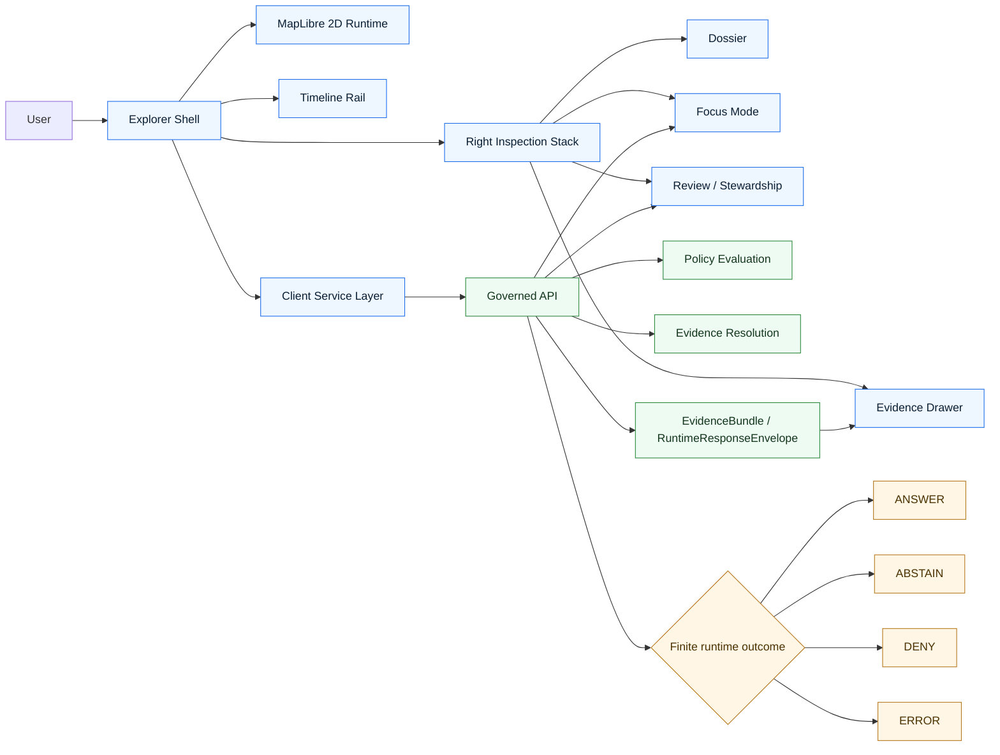

<!-- [KFM_META_BLOCK_V2]
doc_id: kfm://doc/<NEEDS_UUID>
title: KFM Explorer Web
type: standard
version: v1
status: draft
owners: [@bartytime4life]
created: 2026-03-22
updated: 2026-04-02
policy_label: public
related: [../../README.md, ../README.md, ../../web/README.md, ../governed-api/README.md, ../api/src/api/README.md, ../review-console/README.md, ../workers/README.md, ../cli/README.md, ../../contracts/README.md, ../../policy/README.md, ../../tests/README.md, ../../data/README.md, ../../pipelines/README.md, ../../.github/workflows/README.md]
tags: [kfm, explorer-web, maplibre, evidence, shell]
notes: [UUID is still unresolved; owner and dates are carried forward from the supplied draft; adjacent repo links and mounted subtree depth remain NEEDS VERIFICATION in the current PDF-only session.]
[/KFM_META_BLOCK_V2] -->

# KFM Explorer Web

Persistent, map-first, time-aware, trust-visible shell boundary for Kansas Frontier Matrix exploration, dossier inspection, evidence drill-through, and bounded Focus flows.

> **Status:** `experimental / boundary-documented`  
> **Owners:** `@bartytime4life` *(carried forward from the supplied draft; NEEDS VERIFICATION on mounted repo evidence)*  
>       
> **Quick jumps:** [Scope](#scope) · [Repo fit](#repo-fit) · [Accepted inputs](#accepted-inputs) · [Exclusions](#exclusions) · [Directory tree](#directory-tree) · [Quickstart](#quickstart) · [Usage](#usage) · [Diagram](#diagram) · [Tables](#tables) · [Task list](#task-list) · [FAQ](#faq) · [Appendix](#appendix)

> [!IMPORTANT]
> This README is intentionally **boundary-descriptive before it is implementation-descriptive**. In the current session, the project evidence is PDF-rich but does **not** include a mounted repo tree, package manifests, workflow YAML, tests, runtime traces, or deployed routes. Shell doctrine is therefore stated confidently, while file-level runtime reality remains `UNKNOWN` or `NEEDS VERIFICATION`.

| Field | Value |
|---|---|
| Target path | `apps/explorer-web/README.md` |
| Primary role | Shell-side boundary where KFM UI doctrine becomes governed product behavior |
| Truth posture | `CONFIRMED doctrine` / `PROPOSED realization` / `UNKNOWN mounted implementation depth` |
| Primary doctrinal basis | Map-first shell doctrine, trust membrane, typed proof objects, hydrology-first thin slice |
| Renderer direction | MapLibre-centered `2D` default; `3D` only when it carries real explanatory burden |
| Public-value test | Every consequential claim remains one interaction away from inspectable evidence |

---

## Scope

`apps/explorer-web/` is the place where KFM’s evidence posture becomes user-facing operating behavior.

This boundary is **not** “just a frontend.” In KFM terms, the shell is part of the evidence chain, part of the trust model, and part of governed publication. That means geography, time scope, freshness, rights/sensitivity posture, evidence access, review state, and bounded AI behavior have to stay coordinated rather than splitting into disconnected products.

At minimum, this boundary is expected to keep the following surfaces inside one governed shell family:

- **Map Explorer** for place-first discovery
- **Timeline** as a coequal operating control, not a hidden filter
- **Dossier** as a durable inspected object
- **Story** as evidence-bearing shell choreography
- **Evidence Drawer** as the mandatory provenance route for consequential claims
- **Focus Mode** as bounded synthesis inside the same shell
- **Compare**, **Export**, and role-gated **Review / Stewardship** as variations of the same trust system

> [!NOTE]
> Because mounted implementation evidence is unavailable in this session, this README defines the **shell contract** and **trust boundary** first. It deliberately avoids pretending that routes, package names, tests, or component inventories are already proven.

[Back to top](#kfm-explorer-web)

---

## Repo fit

### Boundary placement

| Item | Role | Posture |
|---|---|---|
| `apps/explorer-web/README.md` | Target directory README for the explorer shell boundary | `INFERRED from supplied draft` |
| `../README.md` | Expected parent `apps/` boundary | `NEEDS VERIFICATION` |
| `../../web/README.md` | Expected parallel UI-oriented doc surface | `NEEDS VERIFICATION` |
| `../governed-api/README.md` | Expected app-level governed API boundary | `NEEDS VERIFICATION` |
| `../api/src/api/README.md` | Expected deeper API contract surface | `NEEDS VERIFICATION` |
| `../review-console/README.md` | Expected review-bearing sibling | `NEEDS VERIFICATION` |
| `../workers/README.md` | Expected worker/export/projection sibling | `NEEDS VERIFICATION` |
| `../cli/README.md` | Expected operator CLI boundary | `NEEDS VERIFICATION` |
| `../../contracts/README.md` | Expected shared contract boundary | `NEEDS VERIFICATION` |
| `../../policy/README.md` | Expected shared policy boundary | `NEEDS VERIFICATION` |
| `../../tests/README.md` | Expected shared verification boundary | `NEEDS VERIFICATION` |
| `../../data/README.md` | Expected truth-path and catalog lane root | `NEEDS VERIFICATION` |
| `../../pipelines/README.md` | Expected ingest / packaging lane root | `NEEDS VERIFICATION` |
| `../../.github/workflows/README.md` | Expected workflow surface | `NEEDS VERIFICATION` |

### How this README fits the corpus

This file should read as the **shell-boundary companion** to the broader KFM architecture set, not as a parallel sovereign doctrine. The strongest current doctrinal alignment is:

- **Shell doctrine:** map-first shell, timeline coequality, Evidence Drawer, bounded Focus, trust-visible states, and 2D-first discipline
- **Truth and governance doctrine:** trust membrane, fixed truth path, authoritative-versus-derived separation, fail-closed posture, and correction lineage
- **Contract doctrine:** typed proof-bearing objects rather than ad hoc UI-local payloads
- **Sequencing doctrine:** hydrology-first thin slice before wider shell sprawl

### Repo-fit rule

This directory should own:

- shell composition
- interaction continuity
- UI-local rendering behavior
- surface-level continuity across Explore, Dossier, Story, Focus, Compare, Export, and Review

It should **not** become the owner of:

- canonical truth
- evidence-resolution law
- policy adjudication
- release authority
- unrestricted data access
- browser-side shortcuts around governed APIs

[Back to top](#kfm-explorer-web)

---

## Accepted inputs

Only the following work classes belong here.

| Input class | Belongs here? | Notes |
|---|---:|---|
| Persistent shell layout and continuity behavior | Yes | Map, timeline, inspection stack, scope cues, mode continuity |
| MapLibre-centered 2D runtime integration | Yes | Renderer integration, camera/state handoff, safe layer orchestration |
| Evidence Drawer rendering | Yes | UI-side inspection of already-governed evidence payloads |
| Dossier / Story / Focus presentation | Yes | Presentation, scoped transitions, visible outcomes |
| Compare / Export / Review surface behavior | Yes | Same shell, different mode/state, no separate truth system |
| Local view state and replay helpers | Yes | Public-safe, serializable shell continuity only |
| Client service adapters | Yes | Explicit governed-API boundary only |
| Accessibility, reduced motion, keyboard reachability | Yes | First-class acceptance burden |
| Public-safe 3D escalation controls | Maybe | Only when 2D is insufficient and trust objects stay intact |
| Canonical evidence resolution | No | Must stay behind governed services |
| Policy decision logic | No | Must stay in shared policy/backend enforcement |
| Source onboarding, ingest, or promotion mechanics | No | Pipeline / worker / contract lane responsibility |
| Direct browser access to RAW / WORK / QUARANTINE / unpublished data | No | Violates the truth path |
| Direct model-runtime invocation from the browser | No | Focus remains governed and bounded |
| Hidden fetches from render components | No | Network I/O belongs in an explicit service layer |

[Back to top](#kfm-explorer-web)

---

## Exclusions

This directory is **not** the convenience path around KFM governance.

| Exclusion | Why it does not belong here | Put it here instead |
|---|---|---|
| Direct database access | Breaks the trust membrane | Governed API or backend packages |
| Direct object-store reads for restricted assets | Bypasses policy and evidence mediation | Governed delivery / signed access path |
| RAW / WORK / QUARANTINE inspection from browser | Violates the canonical truth path | Data / review / worker surfaces |
| Policy checks in React components | Causes enforcement drift | Shared policy + backend enforcement |
| Hidden alternate admin truth surface | Splits the shell into competing systems | Role-gated shell variation |
| Browser-owned ingest, diff, or promotion logic | Reverses burden and audit order | Pipelines / workers / governed promotion |
| Default 3D showcase mode | Violates 2D-by-default reasoning | Controlled burden-bearing route only |
| Restricted payload persistence in local browser storage | Risks stale or sensitive leakage | Scoped server-mediated hydration only |
| Free-form assistant UX detached from evidence | Violates bounded Focus doctrine | Governed Focus Mode |
| App-local schema copies | Creates contract drift | Shared contract boundary |

> [!WARNING]
> The explorer shell must never become the easiest place to bypass policy, evidence, or review state. In KFM, the last mile is part of governed publication.

[Back to top](#kfm-explorer-web)

---

## Directory tree

### Target placement for this README (`INFERRED`)

```text
apps/
└─ explorer-web/
   └─ README.md
```

> [!NOTE]
> The target path above is carried forward from the supplied draft. It is the intended placement for this file, **not** a mounted-tree proof from the current session.

### Proposed local runtime subtree (`PROPOSED / NEEDS VERIFICATION`)

This shape keeps the shell thin, keeps network I/O explicit, and keeps contract-bearing objects out of ad hoc component state.

```text
apps/explorer-web/
├─ README.md
├─ package.json                  # NEEDS VERIFICATION
├─ tsconfig.json                 # NEEDS VERIFICATION
├─ .env.example                  # PROPOSED
├─ public/                       # PROPOSED
└─ src/
   ├─ main.tsx                   # PROPOSED bootstrap
   ├─ app/
   │  ├─ App.tsx
   │  ├─ router.tsx
   │  └─ layout/
   ├─ services/                  # explicit network boundary
   ├─ contracts/                 # consumer-side types aligned to shared contracts
   ├─ components/                # presentation only; no hidden fetches
   ├─ features/
   ├─ hooks/
   ├─ styles/
   └─ test/
```

### Interpretation rule

- The target file path is the intended boundary placement.
- The runtime subtree is a **starter shape**, not a claim of present implementation.
- If the mounted repo later proves a different active root, this README should be reconciled to that reality instead of forcing reality to fit the diagram.

[Back to top](#kfm-explorer-web)

---

## Quickstart

The correct first move here is usually **inventory**, not `npm install`.

### 1) Confirm the live tree before editing anything

```bash
git rev-parse HEAD 2>/dev/null || true
find apps -maxdepth 2 -print 2>/dev/null | sort
find apps/explorer-web -maxdepth 3 -print 2>/dev/null || true
```

### 2) Inspect adjacent boundaries before you write code

```bash
sed -n '1,220p' apps/README.md 2>/dev/null || true
sed -n '1,260p' web/README.md 2>/dev/null || true
sed -n '1,260p' apps/governed-api/README.md 2>/dev/null || true
sed -n '1,260p' apps/api/src/api/README.md 2>/dev/null || true
sed -n '1,260p' apps/review-console/README.md 2>/dev/null || true
sed -n '1,260p' apps/workers/README.md 2>/dev/null || true
sed -n '1,260p' apps/cli/README.md 2>/dev/null || true
```

### 3) Inventory trust-critical vocabulary already in the repo

```bash
grep -RInE 'EvidenceDrawer|EvidenceBundle|RuntimeResponseEnvelope|CorrectionNotice|Focus|ABSTAIN|DENY|audit_ref|spec_hash|run_receipt|MapLibre|Timeline' \
  apps web contracts policy tests .github 2>/dev/null | head -200
```

### 4) Only then decide the active runtime root

Possible outcomes:

1. `apps/explorer-web/` is the active UI root
2. `web/` is still the active UI root
3. multiple UI/API boundaries coexist and need explicit convergence

> [!IMPORTANT]
> Do **not** let package-manager commands or framework assumptions outrun the tree you actually inspect.

[Back to top](#kfm-explorer-web)

---

## Usage

### Operating law

The explorer shell should preserve one coordinated chain:

1. **Place selection** narrows scope and context.
2. **Time refinement** narrows meaning, freshness, and comparison basis.
3. **Evidence access** remains one interaction away through the Evidence Drawer.
4. **Dossier** turns a selection into a durable inspected object.
5. **Story** keeps map, time, and citations alive rather than breaking into detached narrative.
6. **Focus Mode** inherits place/time/evidence context unless the user changes it through governed controls.
7. **Compare** preserves asymmetry and visible basis on both sides.
8. **Export** previews what leaves the system and which trust cues remain attached.
9. **Review / Stewardship** stays inside the same governed shell, not in a hidden admin product.

### State ownership rule

| State kind | Expected owner |
|---|---|
| Camera, active selection, visible rail state, active shell mode | Shell |
| Selected time scope and compare anchors | Shell |
| Layer portrayal metadata | Governed payloads + renderer consumers |
| Rights, sensitivity, review, and freshness posture | Governed payloads |
| Evidence-resolution outcomes | Governed services |
| Focus outcomes (`ANSWER` / `ABSTAIN` / `DENY` / `ERROR`) | Governed services, rendered by shell |
| Long-lived canonical truth | Never the browser |

### Client-side placement rules

| Concern | Expected home | Why |
|---|---|---|
| Network I/O | explicit service layer only | keeps trust-boundary behavior reviewable |
| Presentation | component layer only | prevents hidden fetches and local policy drift |
| Trust-bearing contracts | shared contracts first; app-local consumer types second | prevents shell-local schema universes |
| Policy decisions | never the browser | backend and shared policy remain authoritative |
| Restricted persistence | nowhere in browser storage by default | denies stale or sensitive reconstruction |
| Heavy truth-bearing computation | upstream preparation, not the shell | keeps the browser thin and auditable |

### Trust-visible cue set

The shell should keep these visible during consequential flows:

- selected geography
- active time scope
- freshness or stale-state cue
- policy / sensitivity posture where relevant
- route back to evidence
- review or release-state cue where relevant
- `audit_ref` or equivalent runtime trace hook when present
- correction / supersession signal when applicable

> [!TIP]
> A polished shell that hides freshness, review state, or evidence routes is **not** a KFM shell. Smoothness never outranks inspectability.

[Back to top](#kfm-explorer-web)

---

## Diagram



### Reading the diagram

- The **shell** is the persistent operating field.
- **MapLibre** is the 2D runtime inside the shell, not the shell itself.
- The **service layer** is the only acceptable browser-side network boundary.
- The **governed API** remains the trust-bearing way to retrieve evidence, policy-safe portrayal inputs, and Focus outcomes.
- The explorer should never talk directly to canonical/internal stores.

[Back to top](#kfm-explorer-web)

---

## Tables

### Surface matrix

| Surface | Primary job | Must preserve | Must never do |
|---|---|---|---|
| Map Explorer | Spatial discovery and contextual navigation | geography, time, trust cues | become a free-floating canvas detached from evidence |
| Timeline | As-of-state inspection, chronology, compare anchors | valid-time labels, event grain, stale-state cues | hide time as an advanced filter |
| Dossier | Durable place- or feature-centered decision object | identity, dependencies, evidence links, release context | behave like a throwaway modal |
| Story surface | Human-authored narrative inside the same shell | citations, map continuity, time continuity | sever itself from current scope |
| Evidence Drawer | Immediate provenance inspection | EvidenceBundle members, transforms, release state, preview limits | collapse into decorative source notes |
| Focus Mode | Governed Q&A and bounded synthesis | citation verification, audit linkage, explicit finite outcomes | become unconstrained chat |
| Review / Stewardship | Moderation, quarantine, promotion, denial, rollback | diff, policy labels, review notes, receipts | become a disconnected admin truth system |
| Compare | Side-by-side or anchored comparison | shared geography/time anchor, explicit comparison basis | flatten asymmetry or hide basis |
| Export | Policy-safe outward artifact generation | release scope, evidence linkage, preview policy | silently strip provenance context |
| Controlled 3D | Conditional volumetric context | same Evidence Drawer, same audit refs, same correction state | become default spectacle |

### Contract and proof touchpoints

| Contract / proof object | Explorer-web responsibility | Posture here |
|---|---|---|
| `EvidenceBundle` | Render consequential claim support in drawer/dossier/story/export flows | `CONFIRMED doctrine / emitter NEEDS VERIFICATION` |
| `RuntimeResponseEnvelope` | Render accountable Focus/runtime outcomes with visible state | `CONFIRMED doctrine / emitter NEEDS VERIFICATION` |
| `DecisionEnvelope` | Consume machine-readable policy results where surfaced to UI | `CONFIRMED doctrine / emitter NEEDS VERIFICATION` |
| `ReviewRecord` | Render review / denial / escalation context inside steward views | `CONFIRMED doctrine / emitter NEEDS VERIFICATION` |
| `CorrectionNotice` | Preserve visible lineage under supersession, withdrawal, or narrowing | `CONFIRMED doctrine / emitter NEEDS VERIFICATION` |
| `DatasetVersion` / release scope | Show which released subject set a view or export is grounded in | `CONFIRMED doctrine / UI fields NEEDS VERIFICATION` |
| `spec_hash` | Display or trace stable input/spec identity when surfaced by governed services | `CONFIRMED proof-quartet doctrine / UI use NEEDS VERIFICATION` |
| `run_receipt` | Provide auditability for governed runs and derived views where relevant | `CONFIRMED proof-quartet doctrine / UI use NEEDS VERIFICATION` |
| `ai_receipt` | Surface model-mediated provenance when Focus or AI-assisted outputs are present | `CONFIRMED proof-quartet doctrine / UI use NEEDS VERIFICATION` |
| `attestation refs` | Link integrity/origin proof without turning browser into verifier-of-record | `CONFIRMED proof-quartet doctrine / UI use NEEDS VERIFICATION` |

### Corpus-aligned thin-slice targets

| Slice | Key deliverables | Acceptance cue |
|---|---|---|
| Map Explorer baseline UI | `MapCanvas`, `LayerPanel`, `TimeControl`, `EvidenceDrawer`, e2e coverage | Evidence drawer shows license + version; keyboard navigation works |
| Story publish workflow | story schema, routes, renderer, publish gate | publishing requires review state + resolvable citations; citations open the Evidence Drawer |
| Focus Mode MVP | focus orchestrator, route, evaluation harness | cite-or-abstain; golden queries; regressions block merge |

[Back to top](#kfm-explorer-web)

---

## Task list

### Definition of done for this README boundary

- [ ] Replace `<NEEDS_UUID>` with an authoritative document ID.
- [ ] Reverify owner and created/updated values against mounted repo evidence.
- [ ] Confirm whether `apps/explorer-web/` is the active UI root or only the intended boundary path.
- [ ] Confirm which adjacent README links actually exist on the mounted tree.
- [ ] Confirm the active package manager, workspace tool, and dev entrypoint.
- [ ] Confirm whether shared contract files already exist and link to them directly.
- [ ] Confirm whether accessibility and reduced-motion checks already exist in tests or CI.
- [ ] Confirm whether any 3D route already exists and, if so, gate it behind a burden rubric.

### Definition of done for runtime behavior

- [ ] Explorer, Timeline, Dossier, Story, Evidence Drawer, Focus, Compare, Export, and Review behave as one shell family.
- [ ] Every consequential claim remains one interaction away from inspectable evidence.
- [ ] Focus Mode renders explicit `ANSWER / ABSTAIN / DENY / ERROR` outcomes with bounded evidence backing.
- [ ] Browser-side fetches remain confined to an explicit service layer.
- [ ] No direct client access exists to canonical/internal stores.
- [ ] Freshness, sensitivity, review state, and correction cues remain visible at the point of use.
- [ ] Exports preserve trust cues and do not silently drop provenance context.
- [ ] Keyboard use, reduced motion, and screen-reader labeling are verified across major shell states.
- [ ] One hydrology claim path proves the thin-client route from catalog to Evidence Drawer.

[Back to top](#kfm-explorer-web)

---

## FAQ

### Does this README prove a mounted `apps/explorer-web/` runtime exists right now?

No.

It establishes the intended shell boundary and the doctrinal rules that should govern it. In the current session, the repo tree, manifests, scripts, tests, and routes were not directly surfaced.

### Is this a frontend-only document?

No.

It is a **shell-boundary** document. That means it defines how the user-facing operating field must behave in relation to evidence, policy, release state, and bounded synthesis.

### Can explorer-web call databases, object storage, or unpublished artifacts directly?

No.

The shell should consume **governed service responses only**.

### Is Focus Mode a general chatbot surface?

No.

Focus is a bounded synthesis surface that remains downstream of evidence resolution, policy checks, citation verification, and visible drawer access.

### Is 3D part of the normal operating path?

No.

KFM remains **2D-first**. Controlled 3D is allowed only when it carries real explanatory burden and preserves the same Evidence Drawer, policy cues, and correction lineage.

### Why are there so many `NEEDS VERIFICATION` markers?

Because KFM doctrine explicitly prefers honest incompleteness over persuasive overclaiming. This README is meant to stay true when the mounted tree is finally inspected, not just sound complete before that happens.

[Back to top](#kfm-explorer-web)

---

## Appendix

<details>
<summary><strong>Appendix A — Proposed route patterns</strong></summary>

These are **illustrative shell patterns**, not mounted route claims.

```text
/explore?bbox=...&t=...&layers=...
/explore?mode=dossier&sel=feature:123&t=...
/explore?mode=story&story=watershed-history&chapter=2
/explore?mode=focus&sel=watershed:arkansas&t=1935-01-01/1935-12-31
/explore?mode=compare&lhs=...&rhs=...
/explore?mode=review&item=decision:456
/explore?mode=export&template=dossier
```

Interpretation rules:

- shell state rehydrates through current policy and release mediation
- previously valid deep links may reopen as generalized, restricted, stale-visible, or unavailable
- no deep link should bypass role, policy, or release checks

</details>

<details>
<summary><strong>Appendix B — Persistent shell checklist</strong></summary>

Keep these elements coordinated:

- selected geography
- active time scope
- active layers
- active shell mode
- release context
- policy / review / freshness cues
- Evidence Drawer reachability
- compare anchors
- saved-view hydration behavior

Do not mix:

- shell-owned navigation state
- truth-bearing evidence state
- privileged review state
- speculative local caches of restricted payloads

</details>

<details>
<summary><strong>Appendix C — Merge-time verification checklist</strong></summary>

Before treating this README as implementation-descriptive rather than boundary-descriptive:

1. inspect the live repo tree
2. confirm the active runtime root
3. confirm manifests and scripts
4. confirm current contract filenames and fixture paths
5. confirm current tests and workflows
6. reconcile any overlapping `web/` and `apps/*web*` docs
7. replace placeholders in the meta block
8. downgrade or remove any file/path names the mounted tree disproves

</details>
