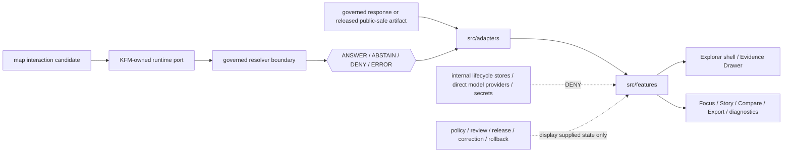

<!-- [KFM_META_BLOCK_V2]
doc_id: kfm://app/explorer-web/readme
title: Explorer Web App README
type: app-readme
version: v0.7
status: draft
owners: OWNER_TBD — Apps steward · UI steward · Map steward · Governed API steward · Policy steward · Accessibility steward · Docs steward
created: 2026-06-16
updated: 2026-09-05
policy_label: public
owning_root: apps/
responsibility: "Orient maintainers to the existing Explorer Web application, its actual composition, package boundaries, local commands, validation, and remaining graduation gates."
truth_posture: "CONFIRMED pinned source and configuration / PROPOSED canonical-shell decision and ungraduated integration / UNKNOWN deployment and public operation"
evidence_snapshot:
  repository: bartytime4life/Kansas-Frontier-Matrix
  base_ref: main
  base_commit: 3d6b8a6e81ed65a726156feae67fa73875b5b069
  target_prior_blob: 561f78ea224338b3a1748d5689a2f56bfe7a1359
  directory_rules_blob: fd49a0b83e55cef52c1124281f093e263526898d
  entrypoint_blob: 787c5182777b7f26d281e7e2851344b504a70d1c
  site_mount_blob: 7a4164e9ade0e77aeac0d0ef01d5e89df5cb9799
  explorer_manifest_blob: 25b67b10eb4d208b780eb456853257d051a2ce39
  maplibre_manifest_blob: f6d450af19c33011e159e123c8a07ca2bca6dfd3
related:
  - ../README.md
  - ./src/README.md
  - ./src/site/README.md
  - ./src/adapters/README.md
  - ./src/features/README.md
  - ./src/features/temporal/README.md
  - ./src/features/story_player/current-implementation.md
  - ./src/features/map_runtime/MOBILE_PMTILES_VERIFICATION_FIXTURE.md
  - ../../tests/policy/test_explorer_web_adapter_boundary.py
  - ../../packages/maplibre/package.json
  - ../../docs/adr/ADR-0005-apps-explorer-web-is-the-canonical-map-first-shell.md
  - ../../docs/adr/ADR-0006-maplibre-boundary--only-maplibreadapter-imports-maplibre.md
  - ../../docs/adr/ADR-0029-adopt-directory-governance-standard-v2.md
  - ../../docs/doctrine/directory-rules.md
  - ../../.github/workflows/ui-build.yml
tags: [kfm, apps, explorer-web, map-first, governed-ui, evidence-drawer, focus-mode, temporal, finite-outcomes, fail-closed]
notes:
  - "v0.7 corrects the obsolete renderer-dependency absence claim: the package pins maplibre-gl 6.6.0 and owns a concrete adapter and Vite worker wrapper; the normal Explorer composition still uses NullMapRuntime."
  - "Source inspection and test definitions are not fresh build, browser, hosted-CI, dependency-admission, deployment, release, or publication proof."
  - "The temporal conformance adapter is bounded implementation of a proposed shared profile, not a live synchronized temporal Explorer."
  - "This same-path documentation update preserves the document identity and numbered navigation anchors; application code, code-owned catalog snapshots, dependencies, and authority decisions are unchanged."
[/KFM_META_BLOCK_V2] -->

<a id="top"></a>

# Explorer Web

`apps/explorer-web/` is KFM's **bounded browser-shell workspace**: a local Map, Knowledge, Features, and Trust composition, synthetic evidence and Focus interactions, and separately exercised feature and renderer fixtures.

[Current state](#0-current-evidence-snapshot) · [Boundary](#3-authority-boundary) · [Surfaces](#7-shell-surfaces) · [Run locally](#12-inspection-path) · [Validation](#13-validation-expectations) · [Open work](#15-open-verification-items)

> [!IMPORTANT]
> **The normal page is not a live MapLibre map.** It mounts `NullMapRuntime` and an explicitly illustrative synthetic map stage. The shared package already pins MapLibre GL JS **6.6.0** and contains a concrete adapter and Vite worker wrapper, but their presence and isolated browser fixture do not activate them in the normal page. Renderer activation, governed layer delivery, and production readiness remain separate work.

> [!CAUTION]
> **This README does not establish a released or deployed product.** The baseline remains `ABSTAIN / NO_GOVERNED_RESPONSE`. Synthetic `ANSWER`, `REVIEWED`, or `RELEASED` examples demonstrate presentation states, not actual observations, approvals, or releases. Maps, tiles, screenshots, and generated language remain downstream of evidence and governance.

## Quick jump

- [0. Current evidence snapshot](#0-current-evidence-snapshot) · [1. Purpose](#1-purpose) · [2. Repo fit](#2-repo-fit) · [3. Authority boundary](#3-authority-boundary)
- [4. Default posture](#4-default-posture) · [5. Inputs](#5-inputs) · [6. Exclusions](#6-exclusions) · [7. Shell surfaces](#7-shell-surfaces)
- [8. Diagram](#8-diagram) · [9. Decision vocabulary](#9-decision-vocabulary) · [10. UI obligations](#10-ui-obligations) · [11. Route contract](#11-route-contract)
- [12. Inspection path](#12-inspection-path) · [13. Validation expectations](#13-validation-expectations) · [14. Definition of done](#14-definition-of-done) · [15. Open verification items](#15-open-verification-items)

## 0. Current evidence snapshot

**Source review:** `main@3d6b8a6e81ed65a726156feae67fa73875b5b069`, 2026-09-05. The table records source/configuration inspected at that commit. It does not report a newly executed build, test suite, browser session, or hosted workflow.

| Surface | CONFIRMED at the pinned source | Limit |
|---|---|---|
| Workspace | [App manifest](./package.json) defines Vite, TypeScript, Vitest, and Playwright commands. [Root manifest](../../package.json) pins `pnpm@11.17.0`; both declare Node `>=22.13 <23`. | Configured commands are not execution results. |
| Normal composition | [`src/main.ts`](./src/main.ts) mounts the site, public workspace navigation, synthetic Focus workspace, and shared trust surface. | No production route tree or live governed transport is established by that wiring. |
| Normal map stage | [`mount-explorer-site.ts`](./src/site/mount-explorer-site.ts) creates `NullMapRuntime` and decorative SVG geometry, with synthetic feature-selection cases and finite runtime-state controls. | `READY` in the null runtime is not GPU readiness, real terrain, or released-layer loading. |
| Shared renderer package | [`packages/maplibre/package.json`](../../packages/maplibre/package.json) pins `maplibre-gl@6.6.0`; the [concrete adapter](../../packages/maplibre/src/maplibre-adapter.ts) and [Vite worker wrapper](../../packages/maplibre/src/maplibre-vite-adapter.ts) exist. | Package presence is distinct from admission evidence, default-app activation, source/layer admission, and public release. |
| Isolated renderer fixture | [`maplibre-vite-adapter.spec.ts`](./tests/browser/maplibre-vite-adapter.spec.ts) defines local-asset boot, canvas/CSS, disposal, external-request, and unavailable-WebGL2 checks. | A test definition is not a fresh PASS. Its fixture is not the normal application or a production map. |
| Evidence and Focus | [`GovernedClient.ts`](./src/adapters/GovernedClient.ts) is a fixture-only projection adapter; the [site composition](./src/site/README.md) documents injected synthetic Focus and evidence cases. | A defensive parser is not a network client, EvidenceBundle authentication, policy execution, or a live Qwen/Ollama connection. |
| Public workspace context | The [site context/navigation boundary](./src/site/README.md) separates public URL context from in-memory evidence-bearing context. | URL state supplies bounded navigation input, not evidence or access eligibility. |
| Temporal adapter | [`src/features/temporal/`](./src/features/temporal/README.md) contains browser-side conformance, identity, normalization, frame-context hygiene, and a generation-guarded reducer for a proposed common profile. | Not a live timeline, source query, synchronized map/chart frame, or release decision. |
| CI | [`ui-build.yml`](../../.github/workflows/ui-build.yml) defines separate filtered build and test jobs after frozen installation. | Workflow definitions and older green runs do not establish the current head's result or required-check enforcement. |
| Shell decision | [ADR-0005](../../docs/adr/ADR-0005-apps-explorer-web-is-the-canonical-map-first-shell.md) remains `proposed`; [ADR-0006](../../docs/adr/ADR-0006-maplibre-boundary--only-maplibreadapter-imports-maplibre.md) accepts the package-owned renderer boundary. | Architecture acceptance, dependency admission, implementation, activation, and release are different transitions. |
| Deployment and public operation | No deployment or live-site observation was performed for this README revision. | Hosting, authentication, CSP/CORS, service health, public data, release, and rollback readiness remain UNKNOWN here. |

### Maturity summary

```text
CONFIRMED SOURCE
  configured app-local build/test commands
  local composition using NullMapRuntime and synthetic evidence/Focus cases
  package-owned MapLibre dependency, adapter, and Vite worker wrapper
  isolated renderer browser-test definitions
  bounded public navigation and temporal-conformance implementation

PROPOSED
  canonical single-shell decision (ADR-0005)
  ungraduated shared temporal profile and live integrated workflows

HOLD / SEPARATE GATES
  concrete renderer activation in the normal composition
  governed source/layer delivery, live evidence/model transport, public release

UNKNOWN IN THIS REVIEW
  fresh native build/test and hosted-CI results
  deployment, operations, public availability, and release posture
```

**Keep snapshot scopes separate.** The [site README](./src/site/README.md) records its code-owned catalog snapshot at `90e8a1b231b2c07ae6346ce75ecd42a172ef67e7`. Updating this application README does not update `catalog.ts`, refresh the website's source links, or deploy a Site. Likewise, historical implementation notes inside ADRs are not current-code inventories; their decision status and acceptance scope remain controlling.

[Back to top](#top)

## 1. Purpose

Explorer Web is the application boundary where KFM's map-first, time-aware, evidence-first posture becomes inspectable. Its intended composition includes persistent map context, layer discovery, evidence and provenance, distinct time kinds, finite Focus outcomes, stories, comparison, export, settings, diagnostics, and accessible non-map alternatives.

The current normal page implements a local, fixture-first subset. Other modules and fixtures are not automatically mounted features. Use the [source orientation](./src/README.md), [site composition](./src/site/README.md), [adapter boundary](./src/adapters/README.md), and [feature catalog](./src/features/README.md) to trace a feature before describing it as integrated.

## 2. Repo fit

This is the existing **`explorer-web` pnpm workspace**, not the separately tracked Sites-derived `apps/kansas-frontier-matrix-explorer/` application described by the [parent README](../README.md). Do not transfer the sibling's package-lock, framework, URL, screenshots, or deployment history to this app. No second Explorer, path migration, or deployment is created by this document.

The direct app structure at the evidence pin is:

```text
apps/explorer-web/
├── README.md
├── index.html
├── package.json
├── playwright.config.ts
├── src/
├── tests/
├── tsconfig.json
└── vite.config.ts
```

| Responsibility | Owning surface | Explorer relationship |
|---|---|---|
| Deployable browser composition | `apps/explorer-web/` | Entrypoint, app-local adapters, features, and tests |
| Dynamic trust-bearing interface | `apps/governed-api/` | Governed transport boundary; the normal composition is not wired to live service |
| Steward review | `apps/review-console/` and review governance | Explorer may display read-only projections, not perform approvals |
| Reusable renderer implementation | `packages/maplibre/` | KFM-owned port and package-owned acquisition seam |
| Reusable UI and temporal logic | Existing responsibility-owning packages, when actually shared | Do not create parallel authority or claim extraction without evidence |
| Meaning / shape / admissibility | `contracts/` / `schemas/` / `policy/` | Refer to their authority; do not redefine it in feature code |
| Lifecycle records / release decisions | `data/` / `release/` | No direct internal-store access or client-side promotion |
| Deployment and provider wiring | `infra/` / `runtime/` | Separate exposure and service responsibilities |

### Placement basis

[ADR-0029](../../docs/adr/ADR-0029-adopt-directory-governance-standard-v2.md) adopts the exact [Directory Rules](../../docs/doctrine/directory-rules.md) bytes and establishes the doctrine path as the single writable human authority. Deployable applications belong under `apps/`; reusable renderer code belongs under `packages/`. The legacy architecture-path rules are read-only compatibility, not an alternative authority.

This is a same-path app README update. Its paired authoring receipt belongs in the established [`data/receipts/generated/`](../../data/receipts/generated/README.md) process-memory lane. Neither change accepts ADR-0005, assigns unverified stewards, creates a new root, or alters lifecycle ownership. Human review and any independent-review requirement remain separate from authorship.

## 3. Authority boundary

The invariant remains:

```text
RAW -> WORK / QUARANTINE -> PROCESSED -> CATALOG / TRIPLET -> PUBLISHED
```

Promotion is a governed transition, not a file move, commit, successful test, layer toggle, or generated explanation. Public clients use governed interfaces and already released public-safe artifacts, never internal working stores.

### Explorer Web may

- Validate and project bounded responses, retaining finite outcomes, evidence handles, citations, source roles, time, rights, sensitivity, release, and correction context.
- Treat map interaction and public workspace state as candidate scope for governed resolution.
- Present already released public-safe artifacts through an approved delivery path; propose safe navigation without executing authority-bearing transitions.
- Emit only minimized telemetry when an applicable contract and policy permit it.

### Explorer Web must not

- Read RAW, WORK, QUARANTINE, PROCESSED, candidate, canonical, internal, graph, vector, or object stores directly as browser truth.
- Call model providers or local model runtimes directly, or treat Qwen/Ollama output as evidence.
- Infer authority from pixels, feature properties, URLs, local imports, telemetry, badges, or generated prose.
- Perform source admission, policy evaluation, review approval, promotion, release, correction, rollback, or publication.
- Reverse redaction, generalization, suppression, delayed access, or denial; expose protected detail through export, URLs, logs, or caches.
- Fork semantic contracts, schemas, policy, renderer acquisition, receipt meaning, or release authority inside the app.

A static delivery edge may serve an already released public-safe artifact. It must not become a second API, truth store, policy engine, or publication authority. `EvidenceRef -> EvidenceBundle` resolution remains outside renderer truth.

## 4. Default posture

The default shell retains `ABSTAIN / NO_GOVERNED_RESPONSE`. Positive fixture cases do not override that live-integration boundary.

Absent, malformed, stale, denied, unsupported, conflicted, unreleased, superseded, or out-of-scope trust input must produce a bounded negative state, not an invented answer or silent fallback. Required context varies with consequence, but material claims need inspectable evidence, source role, provenance, distinct time semantics, rights/sensitivity obligations, release/correction lineage, and an accessible textual status.

Unclear cultural or sovereignty obligations, living-person/DNA information, rare species, archaeology, private land, infrastructure, or exact locations remain subject to denial, quarantine, generalization, redaction, staged access, or delay. The browser preserves supplied protections; it does not decide that unclear rights or sensitivity are safe.

## 5. Inputs

| Input family | Examples | Required posture |
|---|---|---|
| Finite response | `ANSWER`, `ABSTAIN`, `DENY`, `ERROR`, reason code, bounded message | Parse before render; unknown outcomes fail closed |
| Evidence | EvidenceRef, EvidenceBundle-derived projection, citations | Required for consequential claims; fixture support stays labeled |
| Policy and rights | Audience, access, sensitivity, redaction, generalization, delay | Preserve; never weaken client-side |
| Release | Release identity, artifact digest, correction and rollback references | Integrity alone does not establish release eligibility |
| Time | Valid, observed, source, retrieval, release, correction, freshness | Do not collapse distinct meanings into a single timestamp |
| Map and layers | Camera, candidate selection, released layer identifiers, tile status | Interaction context is not truth or source admission |
| Story and comparison | Ordered nodes, support references, compatible place/time scopes | Preserve support and representation limits across transitions |
| Export | Scope, citations, rights, redaction, release and correction state | A download is not a publication decision |
| Review projection | Safe status, history, provenance | Read-only; no approval inferred from a badge |
| Diagnostics and accessibility | Minimized events, labels, focus, reduced motion, non-map paths | No secrets, prompts, raw evidence, or protected geometry |

The temporal adapter separates requested state from committed frame context. Its [documented boundary](./src/features/temporal/README.md) preserves raw labels, compares timezone-aware instants, returns unsupported outcomes for unknown timezones/geologic-age boundaries, and withholds actual timestamps and evidence references for withheld layers. These are bounded adapter semantics, not a functioning live temporal service.

## 6. Exclusions

| Does not belong in this app's authority | Owning surface or handling |
|---|---|
| Governed API implementation or mutating steward workflow | `apps/governed-api/`, `apps/review-console/`, and review governance |
| Shared renderer implementation, raw renderer types, workers, plugins or protocol acquisition | Accepted `packages/maplibre/` boundary; no app-local/CDN alternative |
| Source acquisition, admission, and lifecycle transformation | `connectors/`, registries, `pipelines/`, and their policies |
| Canonical meaning, validation shape, or policy decisions | `contracts/`, `schemas/`, `policy/` |
| Internal data, proof objects, release/correction/rollback decisions | Correct `data/` phase/family and `release/` authority |
| Direct provider/model clients | Governed runtime integration behind the public trust boundary |
| Secrets and protected endpoints | Authorized secret-management and deployment controls, never committed browser content |
| Production evidence copied into fixtures | Prohibited; use synthetic or appropriately minimized public-safe examples |

## 7. Shell surfaces

| Family | Current bounded surface | Integration limit |
|---|---|---|
| Shell and navigation | Four public anchor regions, sanitized public context, bounded deep-link handling | Anchors are not authenticated production routes |
| Map | Null-runtime status and synthetic feature-to-drawer cases | No real renderer or admitted layer in the normal composition |
| Shared renderer | Package-owned concrete adapter, Vite worker wrapper, isolated browser fixture | Normal-page activation and source/layer delivery remain separate |
| Evidence and trust | Defensive payload projections, shared six-label trust grammar, evidence/correction history | No live EvidenceBundle resolver or policy execution |
| Focus | Mounted synthetic question workspace and bounded response cases | No source retrieval or direct/live model invocation |
| Temporal | Proposed-profile conformance adapter and frame-state reducer | No claim of composed playback or map/chart/report synchronization |
| Story, domain panels, comparison and export | App-local feature families and fixture-oriented consumers | Presence is not proof of a complete public workflow |
| Review and diagnostics | Read-only projections and safe negative-state guidance | No review, source-admission, promotion, or release transition |
| Accessibility and settings | Focused interaction fixtures and feature obligations | Whole-app conformance and integrated preferences remain unverified |

The [feature catalog](./src/features/README.md) is the navigation starting point, not independent proof of maturity. Trace the source, inputs, entrypoint consumption, and tests for the specific capability. File and test counts are intentionally omitted because they drift.

Retain the narrower [Story Player implementation note](./src/features/story_player/current-implementation.md) and [mobile PMTiles fixture note](./src/features/map_runtime/MOBILE_PMTILES_VERIFICATION_FIXTURE.md): the former describes a 2D-only governed-projection consumer, not a mounted story route; the latter describes synthetic in-memory archive/range/digest checks and mobile-emulated PNG rendering, not cryptographic signature verification, real-device support, live hosting, or MapLibre activation. Their historical test reports must not be relabeled as fresh results.

## 8. Diagram

The intended trust flow below is an architectural boundary, **not a claim that its live transport is mounted**. The normal composition currently uses injected synthetic projections.


```mermaid
flowchart LR
    released["governed response or released public-safe artifact"] --> adapters["src/adapters"]
    adapters --> features["src/features"]
    features --> shell["Explorer shell / Evidence Drawer"]
    features --> outputs["Focus / Story / Compare / Export / diagnostics"]
    selection["map interaction candidate"] --> port["KFM-owned runtime port"]
    port --> resolver["governed resolver boundary"]
    resolver --> outcome{{"ANSWER / ABSTAIN / DENY / ERROR"}}
    outcome --> adapters
    internal["internal lifecycle stores / direct model providers / secrets"] -. "DENY" .-> features
    authority["policy / review / release / correction / rollback"] -. "display supplied state only" .-> features
```

## 9. Decision vocabulary

### Outward finite outcomes

| Outcome | UI behavior |
|---|---|
| `ANSWER` | Present only bounded supported content with citations and governing context |
| `ABSTAIN` | Explain insufficient, stale, conflicted, out-of-scope, or unavailable support |
| `DENY` | Withhold protected content and expose only a safe reason or next step |
| `ERROR` | Report a bounded operational failure without unvalidated fallback |

### Supporting UI states

`LOADING`, `EMPTY`, `HOLD`, `RESTRICTED`, `STALE`, `DEGRADED`, `CONFLICT`, `SUPERSEDED`, `WITHDRAWN`, and `UNAVAILABLE` may refine presentation. They are not additional answer authorities and must not silently become `ANSWER`.

Unknown outcomes fail closed. Denial or error clears prior positive presentation; negative copy does not leak protected fields. Retry is offered only when safe and meaningful. Correction, supersession, and withdrawal outrank cached positive content. `LOADING` is a transient browser condition, not a governed result.

## 10. UI obligations

| Obligation | Required effect |
|---|---|
| `governed_interface_only` / `released_static_only` | Dynamic claims use the trust boundary; static carriers retain release, integrity, and correction context |
| `runtime_validation` / `evidence_visible` | Unknown or malformed payloads cannot become display truth; consequential claims expose support or abstain |
| `policy_preserved` / `time_kinds_preserved` | Preserve rights, sensitivity, redaction, generalization, and distinct time semantics |
| `renderer_downstream` / `no_authority_fork` | Renderers scope requests; app code does not fork evidence, policy, schema, or release authority |
| `finite_negative_states` / `correction_aware` | Missing, denied, errored, stale, conflicted, corrected, and withdrawn states remain visible |
| `safe_export` / `safe_telemetry` | Preserve citation and access obligations; minimize payloads and prevent sensitive leakage |
| `accessible_by_default` | Test keyboard, focus, screen-reader, reduced-motion, contrast, non-color, and non-map paths proportionately |
| `no_browser_model` | No direct provider SDK or model-runtime connection in the public client |

## 11. Route contract

The current public navigation is anchor-based. A future production route needs explicit identity, owner, audience, accepted inputs, governed adapter or released-artifact origin, finite outcomes, place/time scope, evidence and correction display, protected-field handling, accessibility, tests, and rollback/disable behavior.

Do not promote `publicSafe: true`, a layer ID, a route parameter, or a saved URL into policy approval. The current public-context boundary rejects evidence-bearing selections in URL serialization; governed resolution must recover admissible support after navigation. In-memory transfer and public sharing are different exposure paths.

A feature folder, view-model builder, route name in prose, or fixture page does not prove normal-entrypoint wiring, production authentication, live transport, released inputs, or deployment.

## 12. Inspection path

### Run the bounded workspace

Use the repository's declared Node range (`>=22.13 <23`) and exact package-manager pin (`pnpm@11.17.0`). From the repository root:

```bash
node --version
corepack enable
pnpm --version
pnpm install --frozen-lockfile
pnpm --filter explorer-web build
pnpm --filter explorer-web dev --host 127.0.0.1 --port 5173 --strictPort
```

The last command starts the local development page on loopback port 5173; stop it with Ctrl+C. Expect the synthetic map stage, public navigation, bounded Focus questions, and shared trust cases—not live terrain, source ingestion, or a Qwen connection.

The build runs TypeScript checking before Vite and writes app-local `dist/` according to [Vite configuration](./vite.config.ts). Generated build output is not source to commit, and build success is not permission to expose the repository or publish the app.

**Keep installation policy intact.** The committed [`pnpm-workspace.yaml`](../../pnpm-workspace.yaml) contains version-specific `allowBuilds` decisions. Do not remove the frozen-lockfile requirement, broadly approve build scripts, regenerate the lockfile, or bypass an installation failure merely to make this README's commands succeed. Diagnose toolchain, lockfile, and build-script failures as separate work. The unfiltered root `build`, `test`, and `lint` scripts deliberately return `WORKFLOW_HOLD`; use the app-filtered commands above.

For tests, stop any process using port 4173, then run from the repository root:

```bash
pnpm --filter explorer-web test:unit
# Provision the browser used by the locked local Playwright package.
pnpm --filter explorer-web exec playwright install chromium
pnpm --filter explorer-web test:browser
```

After browser provisioning, `pnpm --filter explorer-web test` runs both suites. Browser installation may download binaries; missing Linux system libraries require separate environment preparation using the [official Playwright browser instructions](https://playwright.dev/docs/browsers). They are not an app-code regression by themselves.

The [Playwright configuration](./playwright.config.ts) starts its own loopback Vite server on **4173**, uses `--strictPort`, and disables server reuse. Local tests use Chromium; `CI=true` selects the installed Chrome channel. The existing `KFM_CHROMIUM_EXECUTABLE` override also adds `--no-sandbox`; it is not the normal setup recommendation or evidence of production browser security. Do not set it merely to silence a failed prerequisite.

### Inspect current implementation

```bash
find apps/explorer-web/src -maxdepth 6 -type f | sort
find apps/explorer-web/tests -maxdepth 4 -type f | sort
find apps/explorer-web/src/features -mindepth 1 -maxdepth 1 -type d | sort
```

Start at [`src/main.ts`](./src/main.ts), follow [`mount-explorer-site.ts`](./src/site/mount-explorer-site.ts), and distinguish that graph from isolated browser fixtures. [Vite aliases](./vite.config.ts) resolve `@kfm/maplibre` and `@kfm/maplibre/vite-adapter` into the existing shared package; they do not justify direct app-level renderer acquisition.

### Evidence discipline

Record the exact commit, environment, command, result, and scope. Keep source presence, app composition, unit execution, browser execution, hosted head/merge-ref execution, deployment observation, and release/publication state separate. A prior receipt or a same-day merge is not a substitute for the relevant current result.

## 13. Validation expectations

### Repository-native Explorer lane

The maintained workflow invokes `pnpm --filter explorer-web build` and `pnpm --filter explorer-web test` in separate jobs after a frozen workspace install. The app test script combines unit and browser tests. Read the actual run/job result at the tested SHA rather than treating workflow presence as a pass.

### Required checks by change type

| Change | Minimum focused evidence |
|---|---|
| README only | One H1; preserved navigation; headings, links, fences, tables and metadata; final newline and whitespace checks; source-backed maturity and commands; GeneratedReceipt for AI-authored work |
| Shell or projection | Positive and finite negative unit cases, no-leak checks, evidence/policy/time preservation |
| Browser interaction | Keyboard/focus, prior-render clearing, and declared network-boundary checks |
| Map-facing change | Package acquisition boundary, selection handoff, resolver injection, negative states; fixture/default-page distinction |
| Evidence or claim display | Missing/malformed support fails closed; citations and correction/history persist |
| Temporal, Story, Compare, Export | Identity, time/scope consistency, stale-request handling, withheld-context safety, and release/citation continuity |
| Diagnostics or telemetry | Secret/protected-field denial and minimized event payloads |
| Renderer or live transport graduation | Governing decisions, pinned dependencies, browser/integration proof, exposure review, accessibility/performance limits, and rollback |
| Deployment | Environment-specific security, observability, governed release, correction and rollback evidence |

README validation does not require pretending to have run the application. Where the native toolchain or complete checkout is unavailable, report source-subset/static checks as such and list native build, unit, browser, and repository-wide checks as unrun. A failing check is only demonstrated to be inherited after a comparable same-base execution; out-of-scope does not automatically mean inherited.

### Boundary checks

The existing [cross-root static boundary test](../../tests/policy/test_explorer_web_adapter_boundary.py) scans renderer imports and internal-store path literals; it is not a complete security or runtime audit. Keep renderer imports behind the accepted package seam; deny internal-store and direct-model paths; retain fixture-only network constraints; clear positive content on negative transitions; preserve redaction; and prevent docs or badges from turning fixtures into live-product claims.

AI-authored work must include a receipt that binds the final artifact bytes and honestly reports validation. The existing [GeneratedReceipt lane](../../data/receipts/generated/README.md) and [schema](../../schemas/contracts/v1/receipts/generated_receipt.schema.json) govern that process. A well-formed receipt with human review pending is not approval or merge authority. Use [CONTRIBUTING.md](../../CONTRIBUTING.md) and the [PR template](../../.github/PULL_REQUEST_TEMPLATE.md) for current delivery controls; do not infer incident resolution from a closed issue alone.

## 14. Definition of done

### For changes inside this app

- [ ] Scope, immutable base/head, paths, overlap, review route, and non-goals are recorded.
- [ ] Inputs, finite outcomes, evidence, time, policy, sensitivity, release and correction obligations are explicit.
- [ ] Negative, stale, malformed, denied, superseded, and unavailable cases fail closed without protected-data leakage.
- [ ] Renderer acquisition stays package-owned; direct internal-store and model access remain denied.
- [ ] User interaction, accessibility, export, and telemetry are validated in proportion to the changed surface.
- [ ] Documentation distinguishes source, fixtures, normal composition, execution, deployment, and release.
- [ ] Local and hosted results identify their actual tested revisions; unrun, pending, and failed checks are not labeled passing.
- [ ] AI-authored work has a byte-bound receipt; human review remains pending until an authorized reviewer acts.
- [ ] Rollback is specific and preserves audit history without implying data publication.

### Before describing Explorer as an integrated map product

- [ ] ADR-0005 or an accepted successor resolves the shell decision.
- [ ] Package/dependency admission evidence and consumer activation are reviewed separately; existing dependency bytes alone do not close the gate.
- [ ] The normal entrypoint uses the concrete renderer through the accepted seam and has its own browser proof.
- [ ] At least one released public-safe layer loads through governed delivery with identity, rights, sensitivity, integrity, provenance and correction support.
- [ ] Selection resolves EvidenceRef to admissible EvidenceBundle support through a governed interface.
- [ ] Temporal, Evidence Drawer, Focus, Story, Compare, and Export handoffs preserve consistent scope and accessible negative states.
- [ ] Authentication, CSP/CORS, operations, diagnostics, and exposure are verified for the actual deployed environment.
- [ ] Review, release, correction propagation, and rollback have their own evidence; public operation is not inferred from tests or prose.

For this documentation-only revision, rollback is a reviewed revert of the README and paired authoring-receipt change. Git history retains the prior document and receipt. Do not revert independent renderer, temporal, dependency, or Sites work as a side effect.

## 15. Open verification items

| Item | Remaining work or boundary |
|---|---|
| Canonical shell decision | ADR-0005 is still proposed; this README does not accept it |
| Owners and review separation | Preserve `OWNER_TBD`; review routing is not an authenticated stewardship assignment or independent approval |
| Default renderer activation | Package and worker-wrapper source exist; the normal composition still uses NullMapRuntime |
| Governed layers and artifacts | Synthetic fixtures and local boot tests do not establish source admission, released layers, Range/CORS/cache behavior, or public-safe delivery |
| Live evidence and Focus | Fixture projections do not establish live EvidenceBundle resolution, citation validation, or governed model transport |
| Temporal integration | Adapter presence does not establish live playback, resolver-backed committed frames, or cross-surface synchronization |
| Complete public workflows | Story, comparison, reports, settings, imports, and sharing require feature-specific composition and safety proof |
| Public routing and exposure | Anchors are not authenticated routes; deployment, authorization, CSP/CORS and service health are not verified here |
| Accessibility, mobile and performance | Focused fixtures are not a full accessibility audit, real-device matrix, long-session test, or production performance claim |
| Offline and correction propagation | Service workers, real hosting, cache invalidation, withdrawal and rollback need environment-specific proof |
| Snapshot and validation currentness | Re-pin code-owned catalogs, exact-head CI and relevant base comparisons independently; this README changes none of them |

## Status summary

Explorer Web is a **bounded, executable-source browser workspace**, not an inert placeholder and not a demonstrated live map product. Its normal page remains synthetic and renderer-neutral. The shared MapLibre dependency, concrete adapter, worker wrapper, browser fixture, and temporal-conformance surface are present; their presence must not be confused with normal-page activation, admitted data, model-backed answers, deployment, approval, or publication.

[Back to top](#top)
