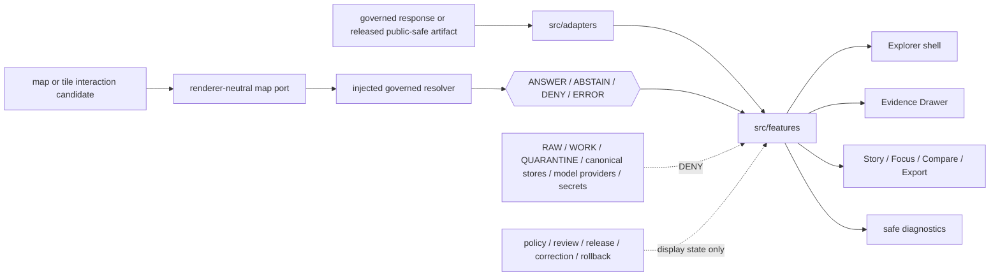

<!-- [KFM_META_BLOCK_V2]
doc_id: kfm://app/explorer-web/readme
title: Explorer Web App README
type: app-readme
version: v0.5
status: draft
owners: OWNER_TBD — Apps steward · UI steward · Map steward · Governed API steward · Policy steward · Accessibility steward · Docs steward
created: 2026-06-16
updated: 2026-08-15
policy_label: public
owning_root: apps/
responsibility: "Orient maintainers to the bounded Explorer Web deployable, its trust boundary, verified executable slices, validation path, and graduation gates without claiming release or deployment."
truth_posture: "CONFIRMED repository evidence / PROPOSED shell decision / UNKNOWN deployment and live integration"
evidence_snapshot:
  repository: bartytime4life/Kansas-Frontier-Matrix
  base_ref: main
  base_commit: 35a6237f2f29e680bafe9af16f71e28fc585a735
  target_prior_blob: 3d7944fcd31b7edeabca5b793eb7b88e12563f56
related:
  - ../README.md
  - ../governed-api/README.md
  - ../review-console/README.md
  - ./src/README.md
  - ./src/adapters/README.md
  - ./src/features/README.md
  - ./src/features/story_player/current-implementation.md
  - ./src/features/map_runtime/MOBILE_PMTILES_VERIFICATION_FIXTURE.md
  - ../../docs/adr/ADR-0004-apps-governed-api-is-the-trust-membrane.md
  - ../../docs/adr/ADR-0005-apps-explorer-web-is-the-canonical-map-first-shell.md
  - ../../docs/adr/ADR-0025-public-client-never-reads-canonical-internal-stores.md
  - ../../docs/adr/ADR-0029-adopt-directory-governance-standard-v2.md
  - ../../docs/doctrine/directory-rules.md
  - ../../.github/workflows/ui-build.yml
  - ../../tests/policy/test_explorer_web_adapter_boundary.py
tags: [kfm, apps, explorer-web, map-first, governed-ui, evidence-drawer, focus-mode, story-player, finite-outcomes, fail-closed]
notes:
  - "v0.5 reconciles the README with the current fixture-first Explorer implementation while preserving the fixed fail-closed default entrypoint as the public maturity boundary."
  - "Independent projection modules and tests are implementation evidence for their bounded slices, not proof of a live route tree, Governed API transport, admitted renderer, deployment, release, or publication."
  - "ADR-0005 remains proposed; repository presence and passing checks do not accept the shell decision."
[/KFM_META_BLOCK_V2] -->

<a id="top"></a>

<div align="center">

# Explorer Web

`apps/explorer-web/`

**KFM's bounded browser-shell workspace: a fixed fail-closed default entrypoint plus independently tested, fixture-first projections for evidence, trust, time, story, map-selection, artifact-verification, and review surfaces.**


[Current state](#0-current-evidence-snapshot) · [Purpose](#1-purpose) · [Boundary](#3-authority-boundary) · [Surfaces](#7-shell-surfaces) · [Run locally](#12-inspection-path) · [Validation](#13-validation-expectations) · [Open work](#15-open-verification-items)

</div>

---

> [!IMPORTANT]
> **This app is not a released KFM product.** The tracked workspace, locked build/test scripts, bounded projections, and synthetic browser proofs are real repository implementation. The default entrypoint still returns `ABSTAIN / NO_GOVERNED_RESPONSE`, accepts no input, mounts a no-input Evidence Drawer, and exposes no live map, route tree, Governed API transport, model runtime, deployment, or publication path.

> [!CAUTION]
> Explorer Web is downstream of trust. A rendered feature, tile, popup, story, diagnostic, score, screenshot, or generated explanation is never evidence authority. Claim-bearing UI must consume a governed finite-outcome envelope or an already released public-safe artifact and preserve evidence, policy, time, sensitivity, correction, and release context.

## Quick jump

- [0. Current evidence snapshot](#0-current-evidence-snapshot)
- [1. Purpose](#1-purpose)
- [2. Repo fit](#2-repo-fit)
- [3. Authority boundary](#3-authority-boundary)
- [4. Default posture](#4-default-posture)
- [5. Inputs](#5-inputs)
- [6. Exclusions](#6-exclusions)
- [7. Shell surfaces](#7-shell-surfaces)
- [8. Diagram](#8-diagram)
- [9. Decision vocabulary](#9-decision-vocabulary)
- [10. UI obligations](#10-ui-obligations)
- [11. Route contract](#11-route-contract)
- [12. Inspection path](#12-inspection-path)
- [13. Validation expectations](#13-validation-expectations)
- [14. Definition of done](#14-definition-of-done)
- [15. Open verification items](#15-open-verification-items)

---

## 0. Current evidence snapshot

This README distinguishes the **default composed app** from the larger set of **independently executable feature slices**. That distinction is the safest current maturity description.

| Surface | Verified repository state | Authority limit |
|---|---|---|
| Workspace and toolchain | `package.json` provides real Vite, TypeScript, Vitest, and Playwright scripts under the locked pnpm workspace. | Buildability is not deployment, release, or publication. |
| Default entrypoint | `src/main.ts` calls the fixed shell resolver, renders its finite state, and mounts the Evidence Drawer. | No route tree, transport, map, authentication, released layer, or dynamic claim flow. |
| Baseline shell | No-input resolution returns `ABSTAIN / NO_GOVERNED_RESPONSE`; supplied input returns `ERROR / UNSUPPORTED_BASELINE_INPUT`. | The baseline intentionally cannot turn arbitrary browser input into a claim. |
| Adapters and feature modules | `src/adapters/` and `src/features/` contain app-local, defensive projections for multiple trust-visible surfaces. | Most are fixture-first consumers or view-model builders, not composed live routes. |
| Evidence Drawer | A bounded parser/resolver, keyboard-operable drawer, negative copy, correction/history display, and browser tests exist. | No live `EvidenceBundle` resolver or accepted cross-root network contract is wired. |
| Story Player | A bounded 2D-only consumer of an already-governed public-safe StoryManifest projection and focused unit tests exist. | No live route, fetch, StoryNode resolution, map continuity, authoring, or publication. |
| Map and PMTiles proof | Synthetic map-selection handoff and mobile-emulated PMTiles archive/index/range/render verification exist with fail-closed cases. | No admitted MapLibre dependency, live renderer boot, cryptographic trust decision, source activation, or released layer. |
| UI validation | The `ui-build` workflow performs locked install, build, unit tests, and browser tests; a policy test constrains renderer imports and internal-store path literals. | CI is a bounded signal, not evidence, policy, review, release, deployment, or publication authority. |
| Shell decision | ADR-0005 documents the proposed single Explorer shell and current implementation evidence. | ADR-0005 remains `proposed`; repository presence does not accept it. |
| Deployment and operation | No current evidence in this README establishes hosting, authentication, CSP, observability, service health, or public use. | `UNKNOWN` until tied to current deployment and runtime evidence. |

### Maturity summary

```text
CONFIRMED
  configured workspace
  locked build and test lane
  static fail-closed entrypoint
  independently tested fixture-first projections
  synthetic browser and boundary proofs

PROPOSED
  one canonical map-first Explorer composition root
  live route families and full governed-shell composition

HOLD
  admitted renderer dependency and production map boot
  live trust-bearing transport and public artifact loading

UNKNOWN
  deployment, authentication, CSP, operations, public availability,
  production data flows, and release posture
```

[Back to top](#top)

---

## 1. Purpose

Explorer Web is the deployable browser workspace in which KFM's map-first, time-aware, evidence-first posture can become inspectable to users.

Its intended role is to compose:

- a persistent governed shell;
- bounded map interaction and layer discovery;
- trust, freshness, time-kind, sensitivity, and release indicators;
- Evidence Drawer handoffs;
- finite Focus Mode outcomes;
- Story Player, Compare, Export, Settings, Diagnostics, and read-only review views;
- accessible non-map alternatives and negative states.

The current implementation proves a defensive foundation and multiple isolated projection slices. It does **not** yet prove an integrated map application. See the [source-tree README](./src/README.md), [feature catalog](./src/features/README.md), and [ADR-0005](../../docs/adr/ADR-0005-apps-explorer-web-is-the-canonical-map-first-shell.md) for the deeper boundary and decision record.

[Back to top](#top)

---

## 2. Repo fit

Accepted Directory Rules place deployable application code under `apps/`. This existing README remains at the app boundary; no path, root, or authority migration is introduced here.

| Concern | Owning surface | Relationship to Explorer Web |
|---|---|---|
| Deployable browser composition | `apps/explorer-web/` | App workspace, default entrypoint, app-local features, adapters, and tests |
| Dynamic trust-bearing interface | [`apps/governed-api/`](../governed-api/) | Normal future transport for claim-bearing responses |
| Steward review | [`apps/review-console/`](../review-console/) | Separate review authority; Explorer may expose read-only projections only |
| App-local boundary adapters | [`src/adapters/`](./src/adapters/) | Defensive translation of governed or bounded fixture inputs |
| App-local feature modules | [`src/features/`](./src/features/) | UI composition and view-model behavior |
| Shared UI primitives | [`packages/ui/`](../../packages/ui/) | Reusable components when extracted from app-local ownership |
| Renderer wrapper | [`packages/maplibre/`](../../packages/maplibre/) | Current scaffold/adapter authority; functional runtime remains held |
| Contracts and schemas | `contracts/`, `schemas/` | Meaning and machine shape; Explorer references but does not redefine them |
| Policy | `policy/` | Rights, sensitivity, access, telemetry, and admissibility decisions |
| Lifecycle and evidence objects | `data/` | Internal records, receipts, proofs, catalogs, and published artifacts; never direct browser stores |
| Release and rollback | `release/` | Publication, correction, withdrawal, supersession, and rollback authority |
| Architecture and decisions | `docs/` | Doctrine, proposed decisions, UI architecture, and operational guidance |
| Cross-root enforcement | [`tests/policy/test_explorer_web_adapter_boundary.py`](../../tests/policy/test_explorer_web_adapter_boundary.py) | Bounded static guard against renderer-import and internal-store bypass |

### Placement basis

- **CONFIRMED:** `apps/` owns deployable applications under accepted Directory Rules and ADR-0029.
- **CONFIRMED:** this is a same-path README modernization; there are no new, moved, renamed, or deleted paths.
- **PROPOSED:** ADR-0005 would make this exact child workspace the single canonical map-first shell.
- **NEEDS VERIFICATION:** final owner roles and any branch-protection or required-review enforcement.

[Back to top](#top)

---

## 3. Authority boundary

Explorer Web may present governed results. It may not create or silently strengthen their authority.

```text
sources / lifecycle stores / evidence / policy / review / release
                              |
                              v
              governed interface or released public-safe artifact
                              |
                              v
                   apps/explorer-web/src/adapters
                              |
                              v
                   apps/explorer-web/src/features
                              |
                              v
              shell / drawer / story / compare / export / diagnostics
```

### Explorer Web may

- validate and project a bounded response before rendering;
- preserve finite outcomes, evidence handles, citations, time kinds, policy labels, release state, and correction lineage;
- treat map interactions as candidate scope for governed resolution;
- render already released public-safe immutable artifacts with integrity and release context;
- propose safe user actions or navigation without executing authority-bearing transitions;
- emit minimized, non-secret UI telemetry only when the applicable contract and policy allow it.

### Explorer Web must not

- read `RAW`, `WORK`, `QUARANTINE`, `PROCESSED`, candidate, canonical, internal, graph, vector, or object stores directly as browser truth;
- call model providers or model runtimes directly;
- infer evidence from pixels, feature properties, route parameters, telemetry, local files, or generated prose;
- execute source admission, policy, review, promotion, release, correction, rollback, or publication;
- reverse server-side redaction, generalization, suppression, delay, or denial;
- redefine contracts, schemas, policy, renderer authority, receipt semantics, or release meaning inside feature code.

> [!IMPORTANT]
> A static edge may serve an already released public-safe artifact. It must not become a second API, canonical store, policy engine, or publication authority.

[Back to top](#top)

---

## 4. Default posture

The browser fails safe.

When a required trust-bearing input is absent, malformed, stale, denied, unsupported, conflicted, unreleased, superseded, or outside scope, the UI must show a bounded negative state instead of guessing or silently falling back.

Required context depends on consequence, but claim-bearing views normally need:

- a validated finite-outcome envelope;
- evidence or citation handles where a claim is made;
- source role and provenance summary;
- valid, observed, source, retrieval, release, correction, and freshness time where material;
- rights, sensitivity, access, redaction, and generalization obligations;
- release, correction, supersession, withdrawal, and rollback context;
- an accessible textual status that does not rely on color, map position, or animation alone.

The default shell deliberately proves the absence path first. Broader feature slices may implement positive fixture cases, but they do not override the composed app's fail-closed maturity boundary.

[Back to top](#top)

---

## 5. Inputs

| Input family | Examples | Required posture |
|---|---|---|
| Finite response | `ANSWER`, `ABSTAIN`, `DENY`, `ERROR`, reason code, bounded message | Parse and validate before render |
| Evidence support | `EvidenceRef`, EvidenceBundle-derived summary, citation and support references | Required for consequential claims |
| Policy and rights | audience, access, sensitivity, rights, redaction, generalization, delay, suppression | Preserve; never weaken client-side |
| Release support | release reference, artifact digest, correction lineage, rollback target | Visible where material |
| Time support | valid, observed, source, retrieval, release, correction, freshness, stale state | Keep time kinds distinct |
| Layer and map state | released layer manifest, selected feature candidate, viewport, tile status | Candidate interaction, never truth by itself |
| Story state | public-safe StoryManifest projection, node order, support references | Playback only when all gates remain satisfied |
| Export state | selected scope, citations, policy obligations, release identity | Governed export only |
| Review projection | status, history, provenance, reviewer-facing summary | Read-only unless a separate authorized workflow owns mutation |
| Diagnostics and telemetry | bounded version/status metadata and minimized event names | No secrets, raw evidence, prompts, model output, or restricted geometry |
| Accessibility state | labels, focus return, keyboard paths, reduced motion, contrast, non-map alternative | Required for public and semi-public use |

Inputs may come from test fixtures while a feature is under development. Fixture success must remain visibly distinct from live transport or released-data support.

[Back to top](#top)

---

## 6. Exclusions

| Does not belong in Explorer Web authority | Owning surface |
|---|---|
| Governed API implementation and trust-bearing transport | `apps/governed-api/` |
| Mutating steward review workflows | `apps/review-console/` and review governance |
| Shared reusable UI primitives | `packages/ui/` |
| Renderer wrapper implementation | `packages/maplibre/` or an accepted successor |
| Model runtime and provider clients | `runtime/` behind governed interfaces |
| Source connectors and admission | `connectors/`, registries, and source policy |
| Semantic contracts | `contracts/` |
| Machine schemas | `schemas/` |
| Rights, sensitivity, access, telemetry, and release policy | `policy/` |
| RAW through PUBLISHED lifecycle records | `data/` under the correct phase/family |
| Release manifests, correction notices, withdrawal, and rollback cards | `release/` |
| Secrets, tokens, private keys, protected endpoints | deployment secret manager or environment |
| Production evidence copied into fixtures | prohibited; use deterministic synthetic or public-safe minimized fixtures |

[Back to top](#top)

---

## 7. Shell surfaces

The directory contains a growing catalog of bounded feature families. Presence means a path exists; maturity must be established from its implementation, fixtures, tests, and composition.

| Family | Current evidence | Current boundary |
|---|---|---|
| Shell and trust chrome | Fixed baseline resolver; trust-header and time-banner projections/tests | Default shell remains static and unintegrated |
| Evidence surfaces | Evidence Drawer, citation pill, tooltip, provenance, attestation, lineage, and denial projections | Fixture-first; no live evidence resolver |
| Focus and story | Focus composed-claim tests and bounded Story Player consumer | No live route, model call, or story publication |
| Map and layers | Synthetic map-selection bridge, layer catalog/lineage projections, HUC crosswalk, mobile PMTiles verification | No admitted MapLibre runtime or released layer |
| Domain panels | Fauna and environmental/soil/hydrology-oriented projections | Domain UI projections, not domain truth |
| Review and governance visibility | Read-only review, promotion-gate, watcher/source-health, STAC, OCI, and diagnostics projections | No review mutation or authority transition |
| Compare and export | App-local feature boundaries and defensive contracts | Integrated public workflows remain `NEEDS VERIFICATION` |
| Settings and accessibility | Feature-boundary obligations and focused behavior in tested slices | Full integrated preference persistence and accessibility audit remain open |

For the authoritative child inventory and per-feature obligations, use [`src/features/README.md`](./src/features/README.md). Two high-signal current implementation notes are:

- [`Story Player current implementation`](./src/features/story_player/current-implementation.md)
- [`Mobile PMTiles verification fixture`](./src/features/map_runtime/MOBILE_PMTILES_VERIFICATION_FIXTURE.md)

> [!WARNING]
> Do not convert this table into a route list. A feature directory, test, README, or view-model builder does not prove navigation wiring, live transport, released inputs, deployment, or public readiness.

[Back to top](#top)

---

## 8. Diagram


```mermaid
flowchart LR
    released["governed response or released public-safe artifact"] --> adapters["src/adapters"]
    adapters --> features["src/features"]
    features --> shell["Explorer shell"]
    features --> drawer["Evidence Drawer"]
    features --> story["Story / Focus / Compare / Export"]
    features --> diagnostics["safe diagnostics"]

    mapEvent["map or tile interaction candidate"] --> mapPort["renderer-neutral map port"]
    mapPort --> resolver["injected governed resolver"]
    resolver --> outcome{{"ANSWER / ABSTAIN / DENY / ERROR"}}
    outcome --> features

    internal["RAW / WORK / QUARANTINE / canonical stores / model providers / secrets"] -. "DENY" .-> features
    authority["policy / review / release / correction / rollback"] -. "display state only" .-> features
```

The renderer, UI, and generated language remain downstream carriers. Evidence and release authority stay outside the browser.

[Back to top](#top)

---

## 9. Decision vocabulary

### Outward finite outcomes

| Outcome | UI behavior |
|---|---|
| `ANSWER` | Render only the bounded supported content, citations, and governing context. |
| `ABSTAIN` | Explain that support is missing, stale, conflicted, out of scope, or not released. |
| `DENY` | Withhold protected content and show only a safe public reason class or next step. |
| `ERROR` | Report an operational failure without falling back to unvalidated content. |

### Supporting UI states

`LOADING`, `EMPTY`, `HOLD`, `RESTRICTED`, `STALE`, `DEGRADED`, `CONFLICT`, `SUPERSEDED`, `WITHDRAWN`, and `UNAVAILABLE` may refine the interface. They must not silently coerce into `ANSWER`.

Rules:

1. Unknown outcome values fail closed.
2. A prior positive render is cleared when the next result denies or errors.
3. Negative copy does not leak restricted fields or hidden policy reasons.
4. Retry is offered only when retry is safe and meaningful.
5. Correction, supersession, and withdrawal state outrank cached positive presentation.

[Back to top](#top)

---

## 10. UI obligations

| Obligation | Required effect |
|---|---|
| `governed_interface_only` | Claim-bearing dynamic data enters through a governed boundary. |
| `released_static_only` | Static artifacts are already released, public-safe, integrity-bound, and correction-aware. |
| `runtime_validation` | Malformed or unknown envelopes cannot become display truth. |
| `evidence_visible` | Consequential claims expose inspectable support or abstain. |
| `policy_preserved` | Rights, sensitivity, access, redaction, and generalization survive every handoff. |
| `time_kinds_preserved` | Distinct time semantics are not flattened into one timestamp. |
| `renderer_downstream` | Map state scopes a request; it does not prove the result. |
| `finite_negative_states` | Deny, abstain, error, stale, conflict, and unavailable states are first-class. |
| `correction_aware` | Corrected, superseded, withdrawn, or rolled-back content cannot remain silently current. |
| `safe_export` | Exports preserve citation, release, rights, redaction, and correction context. |
| `safe_telemetry` | Telemetry contains minimized event metadata only. |
| `accessible_by_default` | Keyboard, focus, screen reader, reduced motion, contrast, non-color status, and non-map alternatives are testable. |
| `no_browser_model` | No direct provider SDK or model-runtime call exists in public client code. |
| `no_authority_fork` | Feature code does not reimplement schema, policy, evidence, release, or review authority. |

[Back to top](#top)

---

## 11. Route contract

A production route tree is not yet established. Any future long-lived route must document or encode:

- stable route identity, owner, purpose, audience, and sensitivity posture;
- accepted inputs and the governed adapter or released-artifact source;
- finite outcomes and all negative states;
- evidence, citation, policy, release, correction, and time display;
- map-selection and Evidence Drawer handoffs;
- redaction/generalization behavior that cannot be reversed in the browser;
- loading, empty, stale, denied, abstained, errored, conflicted, superseded, and withdrawn behavior;
- accessible heading, landmark, keyboard, focus-entry, focus-return, announcement, reduced-motion, and non-map paths;
- export and telemetry behavior, if present;
- deterministic fixtures and tests;
- rollback or disable path.

A route is not considered implemented because its name appears in documentation or a feature folder. Evidence requires route wiring, accepted inputs, focused tests, browser behavior, and the relevant governed upstream support.

[Back to top](#top)

---

## 12. Inspection path

### Run the bounded workspace

From the repository root:

```bash
corepack enable
pnpm install --frozen-lockfile
pnpm --filter explorer-web build
pnpm --filter explorer-web test
```

Focused commands:

```bash
pnpm --filter explorer-web test:unit
pnpm --filter explorer-web test:browser
pnpm --filter explorer-web dev
```

The development server displays the fixed fail-closed entrypoint unless code composition changes. Tests exercise a broader set of fixture-first slices than the default page.

### Inspect current implementation

```bash
find apps/explorer-web/src -maxdepth 6 -type f | sort
find apps/explorer-web/tests -maxdepth 4 -type f | sort
find apps/explorer-web/src/features -mindepth 1 -maxdepth 1 -type d | sort
```

High-signal files:

- [`package.json`](./package.json)
- [`src/main.ts`](./src/main.ts)
- [`src/README.md`](./src/README.md)
- [`src/adapters/README.md`](./src/adapters/README.md)
- [`src/features/README.md`](./src/features/README.md)
- [`ui-build.yml`](../../.github/workflows/ui-build.yml)
- [`test_explorer_web_adapter_boundary.py`](../../tests/policy/test_explorer_web_adapter_boundary.py)

### Evidence discipline

When reporting a result, record the exact branch/commit and distinguish:

- source presence;
- focused local test result;
- hosted exact-head result;
- route composition;
- deployed runtime evidence;
- release/publication state.

These are separate claims.

[Back to top](#top)

---

## 13. Validation expectations

### Repository-native Explorer lane

The maintained workflow runs:

```bash
pnpm --filter explorer-web build
pnpm --filter explorer-web test
```

A trustworthy validation report should identify the exact tested SHA and separate unit, browser, boundary, and hosted conclusions.

### Required checks by change type

| Change type | Minimum focused evidence |
|---|---|
| README only | One H1; heading/anchor and relative-link checks; balanced fences/HTML; no stale maturity claims; final newline; `git diff --check`; generated receipt for AI-authored work |
| Shell or feature projection | Unit cases for positive and finite negative states; no-leak checks; evidence/policy/time preservation |
| Browser interaction | Playwright keyboard/focus and prior-render clearing; no external request when fixture-only |
| Map-facing feature | Renderer import boundary, synthetic selection, governed resolver injection, no direct store access |
| Evidence Drawer or claim display | Missing/malformed support fails closed; citations and correction/history remain visible |
| Story, Compare, or Export | Public-safe support gates, ordering/identity validation, citation/redaction/release continuity |
| Diagnostics or telemetry | Secret/restricted-field denial and minimized event payloads |
| Renderer admission | Accepted dependency/adapter decision, locked supply chain, browser proof, performance/accessibility budget, rollback |
| Live transport | Accepted response contract, authentication/exposure review, CSP/CORS, error isolation, policy and citation validation, integration tests |
| Deployment | Environment-specific security, observability, rollback, release, and public-operation evidence |

### Boundary checks

The app must continue to prove that:

- renderer imports stay behind the adapter boundary;
- internal lifecycle-store path literals do not enter browser source;
- direct model-provider calls are absent;
- fixture-only modules make no undeclared external requests;
- denied or errored results clear prior positive content;
- redacted or generalized content cannot be reconstructed client-side;
- documentation does not promote a fixture slice into a live-product claim.

> [!NOTE]
> A green `ui-build` run proves the workflow's declared build/test scope for its exact SHA. It does not prove deployment, evidence closure, policy approval, release, or publication.

[Back to top](#top)

---

## 14. Definition of done

### For changes inside this app

- [ ] Scope, base SHA, target paths, and owner/review route are recorded.
- [ ] The feature or route contract names its inputs, finite outcomes, evidence and policy obligations, accessibility behavior, tests, and rollback.
- [ ] Dynamic claim-bearing inputs use a governed interface; static inputs are already released public-safe artifacts.
- [ ] Evidence, citation, time, rights, sensitivity, release, correction, and rollback state survive composition.
- [ ] Negative, malformed, stale, denied, superseded, and unavailable cases fail closed.
- [ ] Direct internal-store and model-runtime access remains denied.
- [ ] Map-facing code preserves the adapter boundary.
- [ ] Export, diagnostics, and telemetry paths are minimized and non-leaking.
- [ ] Keyboard, focus, screen-reader, reduced-motion, contrast, non-color, and non-map paths are tested in proportion to the surface.
- [ ] Documentation describes only verified maturity.
- [ ] Targeted local and exact-head hosted validation are recorded separately.
- [ ] AI-authored changes include a generated receipt with pending human review.
- [ ] Rollback is a specific revert/disable path and does not imply data publication.

### Before describing Explorer as an integrated map product

- [ ] ADR-0005 or a successor resolves the shell decision.
- [ ] A renderer dependency and adapter boundary are accepted, pinned, and exercised.
- [ ] The default entrypoint composes an explicit route inventory.
- [ ] Live Governed API transport and accepted envelope validation are wired.
- [ ] At least one released public-safe layer loads through the governed delivery path.
- [ ] Map selection resolves evidence and finite outcomes through the governed interface.
- [ ] Evidence Drawer, Focus, Story, Compare, and Export handoffs are integrated and accessible.
- [ ] Authentication, CSP/CORS, telemetry, diagnostics, deployment, observability, correction, and rollback are verified.
- [ ] Public operation and release state are proven by governed runtime and release evidence rather than documentation.

[Back to top](#top)

---

## 15. Open verification items

| Item | Why it remains open |
|---|---|
| ADR-0005 acceptance or successor decision | The intended single-shell posture is documented but not binding. |
| Confirmed owner and independent review route | `OWNER_TBD` must not be replaced without evidence. |
| Functional MapLibre adapter and dependency | Current wrapper/adapter surfaces do not establish a live renderer. |
| Live Governed API response contract and transport | Fixture projections are not network integration. |
| Route inventory and default composition | Feature paths are not proof of navigable routes. |
| Released layer and artifact discovery | Synthetic PMTiles proof does not load a governed public release. |
| EvidenceBundle resolution and citation validation | Defensive payload projection is not end-to-end evidence closure. |
| Integrated Focus, Story, Compare, and Export flows | Bounded consumers exist, but cross-feature composition remains incomplete. |
| Authentication, authorization, CSP, CORS, and exposure posture | No deployed-system evidence is established here. |
| Telemetry contract, policy, retention, and runtime wiring | Feature guidance does not prove operational telemetry safety. |
| Complete accessibility audit | Focused tests do not establish whole-app conformance. |
| Offline, service-worker, mobile-device, and hosting Range behavior | Mobile-emulated synthetic proof is intentionally narrower. |
| Production observability and incident response | Workflow output is not service-health evidence. |
| Deployment, release, correction propagation, and rollback drill | No current public operation or released Explorer state is established. |
| Exact current file/test counts | Counts drift quickly and should be generated from the inspected commit, not copied into this README. |

## Status summary

Explorer Web is best described as a **bounded, executable, fixture-first UI laboratory behind a deliberately inert default shell**.

That is more mature than a placeholder and less mature than a live map product. The repository proves real build/test tooling, defensive adapters, many finite-state projections, Evidence Drawer behavior, a bounded Story Player consumer, synthetic map-selection and mobile PMTiles verification, and static anti-bypass checks. It does not yet prove a live route tree, admitted renderer, Governed API transport, released map layer, deployment, or public operation.

<p align="right"><a href="#top">Back to top</a></p>
