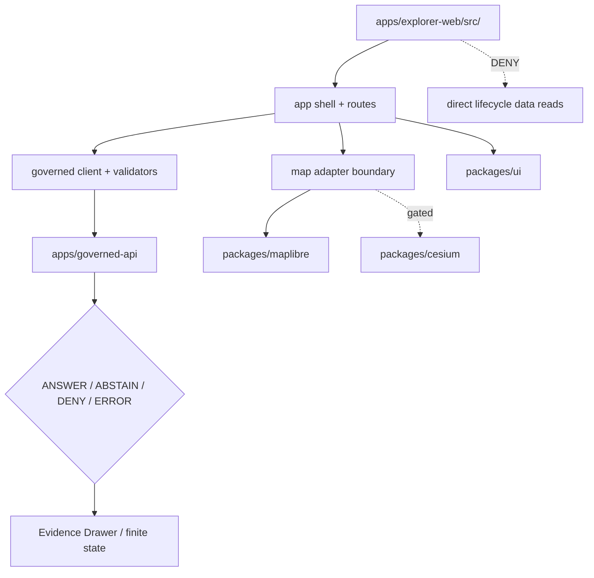

<!-- [KFM_META_BLOCK_V2]
doc_id: kfm://app/explorer-web/src/readme
title: Explorer Web Source Tree README
type: app-readme
version: v0.1
status: draft
owners: OWNER_TBD — Apps steward · UI steward · Map steward · Governed API steward · Policy steward · Docs steward
created: 2026-06-16
updated: 2026-06-16
policy_label: public
related:
  - ../README.md
  - ../../README.md
  - ../../governed-api/README.md
  - ../../review-console/README.md
  - ../../../docs/adr/ADR-0005-apps-explorer-web-is-the-canonical-map-first-shell.md
  - ../../../docs/adr/ADR-0004-apps-governed-api-is-the-trust-membrane.md
  - ../../../docs/adr/ADR-0025-public-client-never-reads-canonical-internal-stores.md
  - ../../../packages/ui/README.md
  - ../../../packages/maplibre/README.md
  - ../../../packages/cesium/README.md
  - ../../../policy/access/README.md
  - ../../../policy/decision/README.md
  - ../../../release/README.md
  - ../../../data/README.md
tags: [kfm, apps, explorer-web, src, map-first, public-ui, governed-api, evidence-drawer, focus-mode, renderer-boundary]
notes:
  - "Initial README for the Explorer Web src tree."
  - "Repository evidence confirms this README path and a minimal package.json with TODO scripts; implementation files, route inventory, tests, fixtures, API client, renderer adapters, and deployment posture remain NEEDS VERIFICATION."
  - "src/ is the app implementation source-layout boundary only; it must not become a public API, lifecycle data store, policy root, release authority, schema/contract home, model-runtime surface, or shared package root."
[/KFM_META_BLOCK_V2] -->

<a id="top"></a>

<div align="center">

# Explorer Web Source Tree

`apps/explorer-web/src/`

**Source-layout boundary for the map-first Explorer Web app: route, shell, map, Evidence Drawer, Focus Mode, story, compare/export, settings, diagnostics, and governed-client implementation may live here while truth and authority stay elsewhere.**


[Purpose](#1-purpose) · [Repo fit](#2-repo-fit) · [Boundary](#3-authority-boundary) · [Inputs](#5-inputs) · [Exclusions](#6-exclusions) · [Module map](#7-candidate-source-map) · [Definition of done](#14-definition-of-done)

</div>

---

> [!IMPORTANT]
> **Status:** draft / `NEEDS VERIFICATION`  
> **Owners:** `OWNER_TBD` — Apps steward · UI steward · Map steward · Governed API steward · Policy steward · Docs steward  
> **Path:** `apps/explorer-web/src/README.md`  
> **Responsibility root:** `apps/` — deployable application surfaces  
> **Truth posture:** CONFIRMED source-tree README path / CONFIRMED parent app README / CONFIRMED minimal `package.json` TODO scripts / UNKNOWN implementation files, routes, tests, client validators, renderer adapters, and deployment state

> [!CAUTION]
> Code under `apps/explorer-web/src/` must not directly read lifecycle data roots, canonical/internal stores, direct model runtime outputs, or local source files as user-facing truth. Claim-bearing UI should render only governed API envelopes, released or bounded-safe layer artifacts, EvidenceBundle-derived payloads, and finite states.

---

## Quick jump

- [1. Purpose](#1-purpose)
- [2. Repo fit](#2-repo-fit)
- [3. Authority boundary](#3-authority-boundary)
- [4. Default posture](#4-default-posture)
- [5. Inputs](#5-inputs)
- [6. Exclusions](#6-exclusions)
- [7. Candidate source map](#7-candidate-source-map)
- [8. Diagram](#8-diagram)
- [9. Source-tree obligations](#9-source-tree-obligations)
- [10. Route and component expectations](#10-route-and-component-expectations)
- [11. Inspection path](#11-inspection-path)
- [12. Validation expectations](#12-validation-expectations)
- [13. Safe change pattern](#13-safe-change-pattern)
- [14. Definition of done](#14-definition-of-done)
- [15. Open verification items](#15-open-verification-items)

---

## 1. Purpose

`apps/explorer-web/src/` is the proposed implementation source tree for the Explorer Web app.

It may eventually hold browser-shell code, route modules, governed API client adapters, response validators, map adapters, layer-catalog views, Evidence Drawer components, Focus Mode surfaces, Story Player surfaces, compare/export flows, settings, diagnostics, and accessibility support.

This README defines the source-tree boundary. It does not prove those modules, routes, tests, fixtures, API clients, renderer adapters, or deployment wiring are implemented.

[Back to top](#top)

---

## 2. Repo fit

| Concern | Owning root | Expected relationship |
|---|---|---|
| Explorer Web source tree | `apps/explorer-web/src/` | Implementation source for the map-first shell |
| Parent Explorer app | `apps/explorer-web/` | Deployable public/semi-public UI boundary |
| Apps root | `apps/README.md` | Deployable app root and trust-membrane doctrine |
| Public trust membrane | `apps/governed-api/` | Normal data path for claim-bearing UI |
| Shared UI primitives | `packages/ui/` | Reusable components extracted from app source when shared |
| 2D renderer wrapper | `packages/maplibre/` | Renderer wrapper; app source should use adapter boundaries |
| Optional 3D wrapper | `packages/cesium/` | Conditional and gated 3D support |
| Policy gates | `policy/` | Access, sensitivity, rights, and decision policy |
| Release authority | `release/` | Publication, correction, rollback control |
| Lifecycle artifacts | `data/` | Receipts, proofs, registry, catalog, triplets, published artifacts |

## 3. Authority boundary

This source tree may implement UI behavior. It does not own source truth, policy, evidence, release, lifecycle, renderer, schema, or contract authority.

```text
apps/explorer-web/src/ = Explorer Web implementation source
apps/explorer-web/     = map-first public/semi-public app boundary
apps/governed-api/     = trust membrane and normal data path
packages/ui/           = shared UI primitives
packages/maplibre/     = 2D renderer wrapper
packages/cesium/       = optional gated 3D renderer wrapper
policy/                = finite policy decisions
schemas/               = machine-readable shape
contracts/             = object meaning
data/                  = lifecycle artifacts, receipts, proofs, registries
release/               = publication, correction, rollback authority
```

## 4. Default posture

Explorer Web source should fail safe and render finite bounded states rather than guessing.

A route, component, adapter, export flow, or map interaction should not render claim-bearing output when any of these are unresolved:

- governed API response shape;
- finite outcome envelope;
- EvidenceRef or EvidenceBundle support;
- citation validation;
- release or layer-manifest state;
- sensitivity, rights, and redaction obligations;
- source-role or provenance summary;
- valid-time semantics;
- rollback or correction status where relevant.

## 5. Inputs

| Input family | Examples | Required posture |
|---|---|---|
| API refs | governed endpoint, response envelope, validator, decision result | Runtime-validated before render |
| Route refs | Explore, Focus, Story, Compare, Export, Settings, Diagnostics | Explicit route contract |
| Layer refs | layer manifest, tile source, legend, trust badges, valid time | Released or bounded safe source only |
| Evidence refs | EvidenceRef, EvidenceBundle-derived payload, citation state | Required for claim-bearing views |
| Policy refs | sensitivity, rights, audience, redaction/generalization obligations | Preserved in route and export state |
| Renderer refs | map adapter, viewport, selected feature, tile status | Not treated as truth by itself |
| Export refs | selected layer, bounds, citations, redaction profile, output mode | Governed export only |

## 6. Exclusions

| Does not belong here | Correct home |
|---|---|
| Public API implementation | `apps/governed-api/` |
| Shared reusable UI components | `packages/ui/` |
| Renderer wrapper authority | `packages/maplibre/`, `packages/cesium/` |
| Policy bundles | `policy/` |
| Schemas and contracts | `schemas/contracts/v1/`, `contracts/` |
| Lifecycle artifacts, receipts, proofs, catalog, triplets | `data/` |
| Release manifests, rollback cards, correction notices | `release/` |
| Admin-only operations | `apps/admin/` |
| Steward review authority | `apps/review-console/` and review governance lanes |
| Source connectors | `connectors/` |
| Direct model runtime behavior | `runtime/` behind governed API only |
| Secrets, credentials, tokens, private keys | Secret manager / deployment environment, not app source |

## 7. Candidate source map

Exact modules remain `NEEDS VERIFICATION`. Candidate areas should be introduced only with route inventory and tests.

| Candidate area | Responsibility | Status |
|---|---|---|
| `app/` | App bootstrap, providers, route outlet, error boundaries | PROPOSED |
| `routes/` | Explore, Focus, Story, Compare, Export, Settings, Diagnostics | PROPOSED |
| `client/` | Governed API client and response validators | PROPOSED |
| `map/` | Map runtime port and renderer adapters | PROPOSED |
| `layers/` | Layer catalog, legends, badges, time filters | PROPOSED |
| `evidence/` | Evidence Drawer and citation affordances | PROPOSED |
| `focus/` | Focus Mode UI and finite-outcome rendering | PROPOSED |
| `story/` | Story Player UI with evidence continuity | PROPOSED |
| `export/` | Safe export flows with citation/redaction obligations | PROPOSED |
| `diagnostics/` | Safe trust, version, route, envelope, and layer diagnostics | PROPOSED |

> [!WARNING]
> Candidate area names are not implementation proof. Do not document a route, adapter, client, or export as runnable until files, tests, fixtures, and package scripts confirm it.

## 8. Diagram



## 9. Source-tree obligations

| Obligation | Example effect |
|---|---|
| `governed_api_only` | Claim-bearing UI data comes through governed API envelopes |
| `runtime_validation_required` | API responses validate before render |
| `evidence_required` | Feature details and claims link to EvidenceBundle-derived payloads |
| `redaction_preserved` | UI never re-expands redacted/generalized details |
| `renderer_boundary_preserved` | Renderer APIs stay behind adapter/wrapper modules |
| `finite_states_required` | Routes render answer, abstain, deny, error, hold, and restricted states safely |
| `safe_export_required` | Export preserves citations, redaction, rights, and release constraints |
| `accessibility_required` | Keyboard, focus, contrast, skip-link, and status-announcement behavior stays testable |

## 10. Route and component expectations

Every long-lived route, panel, adapter, or component group should document or encode:

- route or component purpose;
- governed API endpoint or envelope family used;
- expected finite outcomes;
- evidence/citation display behavior;
- sensitivity, rights, and release-state display behavior;
- redaction/generalization behavior;
- loading, empty, deny, abstain, error, hold, and restricted states;
- export behavior, if any;
- tests or fixtures proving trust-membrane behavior.

## 11. Inspection path

Implementation files, route inventory, renderer imports, tests, fixtures, package scripts, API client wiring, and deployment state remain `NEEDS VERIFICATION`.

```bash
find apps/explorer-web/src -maxdepth 6 -type f | sort
find apps/explorer-web packages/ui packages/maplibre packages/cesium apps/governed-api tests fixtures -maxdepth 6 -type f 2>/dev/null | grep -Ei 'explorer|route|map|layer|evidence|focus|story|compare|export|diagnostic|governed|maplibre|cesium' | sort
find ui web styles viewer_templates -maxdepth 5 -type f 2>/dev/null | sort
```

## 12. Validation expectations

Useful validation for this source tree should cover:

- no imports or fetches from lifecycle data roots;
- all claim-bearing requests use the governed API client;
- response validators reject unknown or malformed envelopes;
- finite outcomes render safe UI states;
- map feature clicks call governed claim/evidence resolution;
- Evidence Drawer cannot invent unsupported claims;
- redaction/generalization cannot be reversed client-side;
- export flows require citation, redaction, rights, and release support;
- renderer imports stay inside accepted adapter/wrapper boundaries.

## 13. Safe change pattern

For source changes under `apps/explorer-web/src/`:

1. Update route inventory and expected finite outcomes.
2. Add tests for answer, abstain, deny, error, hold, restricted, loading, and empty states.
3. Check governed API and renderer import boundaries.
4. Move reusable UI primitives to `packages/ui/` when shared.
5. Update this README and parent `apps/explorer-web/README.md` when public behavior changes.

## 14. Definition of done

- [ ] Owners are confirmed and `OWNER_TBD` is replaced.
- [ ] `src/` layout and package scripts are confirmed.
- [ ] Route inventory is documented.
- [ ] Governed API client and response validators are implemented and tested.
- [ ] Renderer import boundaries are verified.
- [ ] Evidence Drawer, Focus Mode, layer catalog, export, and diagnostics behavior are tested.
- [ ] Direct lifecycle-data import/read checks are covered.
- [ ] Public/semi-public finite-outcome states are tested.
- [ ] Accessibility checks are documented or automated.

## 15. Open verification items

| Item | Why it matters |
|---|---|
| Confirm implementation files beyond README | Prevents overclaiming source-tree maturity |
| Confirm route inventory and app framework | Required for public/semi-public UI review |
| Confirm governed API client and validators | Required for trust membrane enforcement |
| Confirm renderer adapter modules | Required to keep renderers behind boundaries |
| Confirm tests and fixtures | Required before implementation claims |
| Confirm export implementation | Required before public download claims |
| Confirm package scripts beyond TODO | Required before build/test claims |
| Confirm legacy shell roots | Required to prevent parallel shell drift |

<details>
<summary>Appendix A — no-loss preservation note</summary>

The target file was an empty placeholder. This README adds a bounded `src/` source-tree contract for Explorer Web without claiming routes, components, API clients, validators, renderer adapters, tests, fixtures, build scripts, deployment, or export behavior are implemented.

The observed `apps/explorer-web/package.json` has TODO scripts, so implementation maturity remains `NEEDS VERIFICATION`.

</details>

## Status summary

`apps/explorer-web/src/` should hold implementation source for the map-first public/semi-public shell only after route inventory, governed API client behavior, renderer boundaries, tests, fixtures, package scripts, and deployment posture are verified.

It must stay downstream of governed APIs, policy decisions, EvidenceBundle closure, release state, correction/rollback controls, and renderer adapter boundaries without becoming source truth, release authority, policy authority, lifecycle store, schema/contract home, model-output surface, or parallel shell authority.

<p align="right"><a href="#top">Back to top</a></p>
