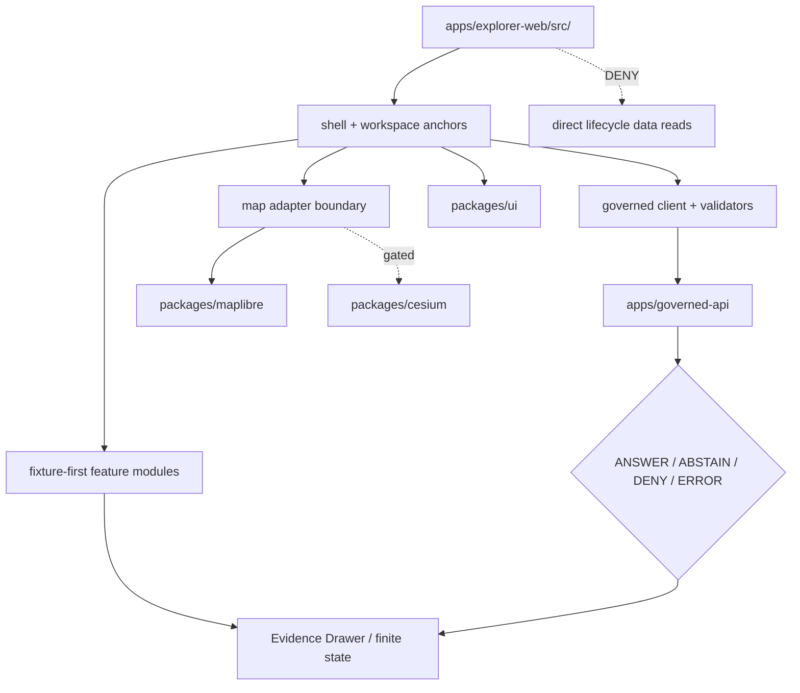

<!-- [KFM_META_BLOCK_V2]
doc_id: kfm://app/explorer-web/src/readme
title: Explorer Web Source Tree README
type: app-readme
version: v0.5
status: draft
owners: OWNER_TBD — Apps steward · UI steward · Map steward · Governed API steward · Policy steward · Docs steward
created: 2026-06-16
updated: 2026-09-12
policy_label: public
owning_root: apps/
responsibility: 'Define the Explorer Web source-layout boundary and record current repository-grounded composition, adapters, features, templates, tests, and maturity limits.'
truth_posture: 'CONFIRMED source inventory and bounded local/fixture-first slices / PROPOSED broader route and integration shape / UNKNOWN fresh execution, deployment, release, and public operation'
evidence_snapshot:
  repository: bartytime4life/Kansas-Frontier-Matrix
  main_commit: d25a4c046892aa826ca04da29215f8ae4aae8e51
  main_tree: b55ad6f05cb0406f033019faa01af3d2018bf582
  target_prior_blob: a79d96b196d8b95208e209ccd74e51c02e7d146f
  parent_app_readme_blob: bd022e91d998685820f6c3b0965bdffbfd355726
  entrypoint_blob: 787c5182777b7f26d281e7e2851344b504a70d1c
  site_directory_blob: 2c7b089f28a024040004ac65cdc6ae824c3cea0b
  adapters_directory_blob: d6ae7b54fce25eb39149b98183da4a67665c02c0
  features_directory_blob: ced6a9877636ec3e22c67f842ba625593387fcdd
  viewer_templates_directory_blob: c92aa9b9e716ab74df89e88d6023c77d1365a84c
  package_manifest_blob: 25b67b10eb4d208b780eb456853257d051a2ce39
  temporal_test_blob: fe9e790d3e74aefe47720fa30952f10515bc02a8
  workspace_context_test_blob: f2abf38368f592fbb6ddf3c14197b0f425fe9f8b
  boundary_test_blob: d689bc6d42d3f215d8a31952f91a71dd3d3be211
related:
  - ../README.md
  - ../../README.md
  - ../../governed-api/README.md
  - ../../review-console/README.md
  - ../../../docs/doctrine/directory-rules.md
  - ../../../docs/adr/ADR-0005-apps-explorer-web-is-the-canonical-map-first-shell.md
  - ../../../docs/adr/ADR-0004-apps-governed-api-is-the-trust-membrane.md
  - ../../../docs/adr/ADR-0025-public-client-never-reads-canonical-internal-stores.md
  - ../../../docs/adr/ADR-0029-adopt-directory-governance-standard-v2.md
  - ../../../packages/ui/README.md
  - ../../../packages/maplibre/README.md
  - ../../../packages/cesium/README.md
  - ../../../policy/access/README.md
  - ../../../policy/decision/README.md
  - ../../../release/README.md
  - ../../../data/README.md
  - ../../../tests/policy/test_explorer_web_adapter_boundary.py
tags: [kfm, apps, explorer-web, src, map-first, public-ui, governed-api, evidence-drawer, focus-mode, temporal, renderer-boundary]
notes:
  - 'v0.4 re-pins this source-tree README to current main and records the actual direct-child, adapter, feature, site, template, package, and test surfaces observed there.'
  - 'v0.4.1 re-pins the evidence snapshot to main@0bcfbcea8fd8e8f9af344ce6d1a1c9fceb82310e and refreshes the site/features directory anchors observed 2026-09-06; structural counts and bounded maturity claims are unchanged.'
  - 'Counts are structural evidence only; a file, feature directory, test definition, package, or viewer template does not prove route integration, a fresh pass, production data, release, deployment, or publication.'
  - 'The normal composition mounts the package-owned MapLibre adapter through the Vite seam with a network-free inline Living Atlas style; the retained trust-state laboratory still uses NullMapRuntime.'
  - 'v0.5 adds the app-owned Living Atlas registry and composition while preserving external-source, production-browser, deployment, release, and publication holds.'
  - 'The repository catalog/preflight extension adds non-loadable connection lineage, visibly held tools, workbench links, matching-panel search, and stale-evidence clearing without admitting a source or layer.'
  - 'This documentation change is scoped to apps/explorer-web/src/README.md; its generated receipt is the only provenance companion. The parent app README and its own evidence snapshot remain related surfaces, not silently rewritten here.'
  - 'src/ is the app implementation source-layout boundary only; it must not become a public API, lifecycle data store, policy root, release authority, schema/contract home, model-runtime surface, or shared package root.'
[/KFM_META_BLOCK_V2] -->

<a id="top"></a>

<div align="center">

# Explorer Web Source Tree

`apps/explorer-web/src/`

**Source-layout boundary for the map-first Explorer Web app: route, shell, map, Evidence Drawer, Focus Mode, story, compare/export, settings, diagnostics, and governed-client implementation may live here while truth and authority stay elsewhere.**


[Current evidence](#0-current-evidence-snapshot) · [Purpose](#1-purpose) · [Repo fit](#2-repo-fit) · [Boundary](#3-authority-boundary) · [Inputs](#5-inputs) · [Exclusions](#6-exclusions) · [Module map](#7-current-source-map) · [Definition of done](#14-definition-of-done)

</div>

---

> [!IMPORTANT]
> **Status:** draft / bounded implementation
> **Owners:** `OWNER_TBD` — Apps steward · UI steward · Map steward · Governed API steward · Policy steward · Docs steward  
> **Path:** `apps/explorer-web/src/README.md`  
> **Responsibility root:** `apps/` — deployable application surfaces  
> **Truth posture:** CONFIRMED repository-grounded local composition, bounded inline MapLibre path, app-local adapters and feature slices, deterministic fixtures, and positive/negative unit tests / HOLD external source delivery and live trust-bearing transport / UNKNOWN browser execution, deployment and public operation

> [!CAUTION]
> Code under `apps/explorer-web/src/` must not directly read lifecycle data roots, canonical/internal stores, direct model runtime outputs, or local source files as user-facing truth. Claim-bearing UI should render only governed API envelopes, released or bounded-safe layer artifacts, EvidenceBundle-derived payloads, and finite states.

---

## Quick jump

- [0. Current evidence snapshot](#0-current-evidence-snapshot)
- [1. Purpose](#1-purpose)
- [2. Repo fit](#2-repo-fit)
- [3. Authority boundary](#3-authority-boundary)
- [4. Default posture](#4-default-posture)
- [5. Inputs](#5-inputs)
- [6. Exclusions](#6-exclusions)
- [7. Current source map](#7-current-source-map)
- [8. Diagram](#8-diagram)
- [9. Source-tree obligations](#9-source-tree-obligations)
- [10. Route and component expectations](#10-route-and-component-expectations)
- [11. Inspection path](#11-inspection-path)
- [12. Validation expectations](#12-validation-expectations)
- [13. Safe change pattern](#13-safe-change-pattern)
- [14. Definition of done](#14-definition-of-done)
- [15. Open verification items](#15-open-verification-items)

---

## 0. Current evidence snapshot

**Implementation base:** [`main@d25a4c046892aa826ca04da29215f8ae4aae8e51`](https://github.com/bartytime4life/Kansas-Frontier-Matrix/commit/d25a4c046892aa826ca04da29215f8ae4aae8e51), observed 2026-09-12. The Living Atlas repository catalog/preflight work is present in the pinned source snapshot; the pin does not establish a green build, merge, deployment, release, or publication.

| Surface | Confirmed at the pinned source | Limit |
|---|---|---|
| `apps/explorer-web/src/` | Six direct entries: `README.md`, `main.ts`, `adapters/`, `features/`, `site/`, and `viewer_templates/`. | Directory shape is not a production route inventory. |
| `main.ts` | Mounts the repository-grounded site composition, four public workspace anchors, URL/hash navigation, the synthetic Focus workspace, and the shared Trust surface. | Local composition and anchor navigation do not establish a production router, live transport, or public operation. |
| `site/` | Contains 21 non-README source/style files, including the Living Atlas composition, terrain source ledger, workspace registry/context/deep links, code-owned catalog, retained `NullMapRuntime` laboratory, trust primitives, and responsive/map styles. | Synthetic/local inputs remain bounded fixtures and presentation state; they are not live evidence or released layers. |
| `adapters/` | Current directory contains 25 adapter/projection files plus its README, including `GovernedClient.ts`, map-runtime/evidence bridges, and domain/diagnostic projections. | App-local parsers and projections are not a live Governed API transport or policy/release authority. |
| `features/` | Contains 40 child feature directories, including the typed `living_atlas/` registry/style boundary plus existing shell, trust/time, map/layers, evidence/Focus, story/compare/export, settings/diagnostics, review, and fixture-first projections. | Directory count does not mean every feature is live, externally sourced, released, or production-ready. |
| `viewer_templates/` | Four JSON style templates plus its README are present for default, compare, review, and story views. | Templates are deterministic presentation inputs, not released layer manifests or renderer admission. |
| `apps/explorer-web/package.json` | The app declares `build`, `test`, `test:unit`, and `test:browser` scripts with Node `>=22.13 <23`; the package manifest is pinned at blob `25b67b10eb4d208b780eb456853257d051a2ce39`. | Declared commands are not execution results. |
| `apps/explorer-web/tests/` | 58 direct `*.test.ts` files plus a `browser/` fixture directory are present. | Unit definitions and fixture doubles do not prove GPU/source readiness, hosting, or deployment; browser execution requires a compatible runtime. |
| Renderer boundary | `packages/maplibre/` contains MapLibre GL JS `6.7.0`; normal composition acquires it only through `@kfm/maplibre/vite-adapter` with an inline-only style. | Bounded activation is distinct from real-source admission, full browser readiness, deployment, or release. |
| Static policy guard | `tests/policy/test_explorer_web_adapter_boundary.py` scans Explorer source for raw renderer imports and forbidden internal-store path literals. | The guard is source evidence; this README does not claim the command was run at the current head. |

[Back to top](#top)

---
## 1. Purpose

`apps/explorer-web/src/` is the implementation source tree for the Explorer Web app.

At this branch candidate it holds the local entrypoint, repository-grounded site composition, URL/workspace context and navigation, app-local boundary adapters, 40 child feature directories, and bounded viewer templates for the map-first shell.

This README defines the source-tree boundary. The current evidence supports bounded local, synthetic, fixture-first interaction and inline renderer slices; it does not prove a production route tree, live Governed API transport, external source admission, complete browser readiness, deployment wiring, release, publication, or public operation.

[Back to top](#top)

---

## 2. Repo fit

| Concern | Owning root | Expected relationship |
|---|---|---|
| Explorer Web source tree | `apps/explorer-web/src/` | Implementation source for the map-first shell |
| Parent Explorer app | `apps/explorer-web/` | Deployable public/semi-public UI boundary |
| Apps root | `apps/README.md` | Deployable app root and trust-membrane doctrine |
| Public trust membrane | `apps/governed-api/` | Normal data path for claim-bearing UI |
| Shared UI primitives | `packages/ui/` | Reusable components extracted from app source when shared |
| 2D renderer wrapper | `packages/maplibre/` | Renderer wrapper; app source should use adapter boundaries |
| Optional 3D wrapper | `packages/cesium/` | Conditional and gated 3D support |
| Policy gates | `policy/` | Access, sensitivity, rights, and decision policy |
| Release authority | `release/` | Publication, correction, rollback control |
| Lifecycle artifacts | `data/` | Receipts, proofs, registry, catalog, triplets, published artifacts |

## 3. Authority boundary

This source tree may implement UI behavior. It does not own source truth, policy, evidence, release, lifecycle, renderer, schema, or contract authority.

```text
apps/explorer-web/src/ = Explorer Web implementation source
apps/explorer-web/     = map-first public/semi-public app boundary
apps/governed-api/     = trust membrane and normal data path
packages/ui/           = shared UI primitives
packages/maplibre/     = 2D renderer wrapper
packages/cesium/       = optional gated 3D renderer wrapper
policy/                = finite policy decisions
schemas/               = machine-readable shape
contracts/             = object meaning
data/                  = lifecycle artifacts, receipts, proofs, registries
release/               = publication, correction, rollback authority
```

## 4. Default posture

Explorer Web source should fail safe and render finite bounded states rather than guessing.

A route, component, adapter, export flow, or map interaction should not render claim-bearing output when any of these are unresolved:

- governed API response shape;
- finite outcome envelope;
- EvidenceRef or EvidenceBundle support;
- citation validation;
- release or layer-manifest state;
- sensitivity, rights, and redaction obligations;
- source-role or provenance summary;
- valid-time semantics;
- rollback or correction status where relevant.

## 5. Inputs

| Input family | Examples | Required posture |
|---|---|---|
| API refs | governed endpoint, response envelope, validator, decision result | Runtime-validated before render |
| Route/workspace refs | Current `#map`, `#knowledge`, `#features`, and `#trust` anchors; future Focus, Story, Compare, Export, Settings, and Diagnostics destinations | Explicit contract required; anchors and navigation do not imply a production router |
| Layer refs | layer manifest, tile source, legend, trust badges, valid time | Released or bounded safe source only |
| Evidence refs | EvidenceRef, EvidenceBundle-derived payload, citation state | Required for claim-bearing views |
| Policy refs | sensitivity, rights, audience, redaction/generalization obligations | Preserved in route and export state |
| Renderer refs | map adapter, viewport, selected feature, tile status | Not treated as truth by itself |
| Export refs | selected layer, bounds, citations, redaction profile, output mode | Governed export only |

## 6. Exclusions

| Does not belong here | Correct home |
|---|---|
| Public API implementation | `apps/governed-api/` |
| Shared reusable UI components | `packages/ui/` |
| Renderer wrapper authority | `packages/maplibre/`, `packages/cesium/` |
| Policy bundles | `policy/` |
| Schemas and contracts | `schemas/contracts/v1/`, `contracts/` |
| Lifecycle artifacts, receipts, proofs, catalog, triplets | `data/` |
| Release manifests, rollback cards, correction notices | `release/` |
| Admin-only operations | `apps/admin/` |
| Steward review authority | `apps/review-console/` and review governance lanes |
| Source connectors | `connectors/` |
| Direct model runtime behavior | `runtime/` behind governed API only |
| Secrets, credentials, tokens, private keys | Secret manager / deployment environment, not app source |

## 7. Current source map

| Current area | Verified repository responsibility | Maturity limit |
|---|---|---|
| `main.ts` | Mounts the site composition, four public workspace anchors, URL/hash synchronization, the synthetic Focus workspace, and the shared Trust surface. | Local deterministic composition; not a production router, live transport, deployment, release, or publication path. |
| `site/` | Owns the app-local Map, Reports, Stories, Knowledge, Features, and Trust composition, terrain source ledger, code-owned catalog, workspace context/deep links, Living Atlas controller, retained trust-state laboratory, and site styles. | Synthetic/local inputs do not establish live data, authentication, evidence authority, released layers, or public operation. |
| `adapters/` | Owns 25 app-local adapter/projection files, including `GovernedClient.ts`, map-runtime/evidence bridges, citation/redaction/reveal projections, and domain/diagnostic projections. | Bounded parsers and projections are not live Governed API transport, policy execution, release authority, or renderer authority. |
| `features/` | Contains 40 child feature directories, including the Living Atlas registry/style boundary and existing shell, trust/time, map/layers, evidence/Focus, story/compare/export, settings/diagnostics, review, and other fixture-first slices. | Child directories and tests prove only their bounded slice; they do not create production routes, admitted sources, or live services by count. |
| `viewer_templates/` | Contains four deterministic JSON style templates for default, compare, review, and story views. | Templates are not released layer manifests, admitted renderer configuration, or publication authority. |
| Paired test lane | `apps/explorer-web/tests/` contains 58 direct test files plus browser fixtures for workspace, temporal, map/evidence, trust, feature, and boundary behavior. | Unit execution and file presence do not prove unavailable browser, GPU, source, hosting, or production readiness. |

There is no `routes/` directory in this source tree. Workspace anchors and navigation are bounded browser composition, not a claim of a production router. `src/adapters/MapLibreAdapter.ts` remains a renderer boundary note; the package-owned implementation stays outside `src/`, and the normal page acquires it only through the accepted Vite adapter seam.

## 8. Diagram


```mermaid
flowchart TD
    src["apps/explorer-web/src/"] --> app["shell + workspace anchors"]
    app --> client["governed client + validators"]
    app --> features["fixture-first feature modules"]
    features --> evidence["Evidence Drawer / finite state"]
    client --> api["apps/governed-api"]
    app --> map["map adapter boundary"]
    map --> ml["packages/maplibre"]
    map -. gated .-> cz["packages/cesium"]
    app --> ui["packages/ui"]
    api --> envelope{"ANSWER / ABSTAIN / DENY / ERROR"}
    envelope --> evidence["Evidence Drawer / finite state"]
    src -. DENY .-> data["direct lifecycle data reads"]
```

## 9. Source-tree obligations

| Obligation | Example effect |
|---|---|
| `governed_api_only` | Claim-bearing UI data comes through governed API envelopes |
| `runtime_validation_required` | API responses validate before render |
| `evidence_required` | Feature details and claims link to EvidenceBundle-derived payloads |
| `redaction_preserved` | UI never re-expands redacted/generalized details |
| `renderer_boundary_preserved` | Renderer APIs stay behind adapter/wrapper modules |
| `finite_states_required` | Routes render answer, abstain, deny, error, hold, and restricted states safely |
| `safe_export_required` | Export preserves citations, redaction, rights, and release constraints |
| `accessibility_required` | Keyboard, focus, contrast, skip-link, and status-announcement behavior stays testable |

## 10. Route and component expectations

Every long-lived route, panel, adapter, or component group should document or encode:

- route or component purpose;
- governed API endpoint or envelope family used;
- expected finite outcomes;
- evidence/citation display behavior;
- sensitivity, rights, and release-state display behavior;
- redaction/generalization behavior;
- loading, empty, deny, abstain, error, hold, and restricted states;
- export behavior, if any;
- tests or fixtures proving trust-membrane behavior.

## 11. Inspection path

The repository inventory is directly inspectable; live integration and deployment remain `NEEDS VERIFICATION`. Use the repository-pinned pnpm and frozen lockfile. This documentation change does not alter the package build-script policy.

```bash
find apps/explorer-web/src -maxdepth 6 -type f | sort
find apps/explorer-web/tests tests/policy fixtures -maxdepth 6 -type f 2>/dev/null | grep -Ei 'explorer|map|layer|evidence|focus|story|compare|export|diagnostic|governed|maplibre|temporal|workspace' | sort
pnpm install --frozen-lockfile
pnpm --filter explorer-web build
pnpm --filter explorer-web test:unit
pnpm --filter explorer-web test:browser
python -m pytest -q tests/policy/test_explorer_web_adapter_boundary.py
```

## 12. Validation expectations

Useful validation for this source tree should cover:

- no imports or fetches from lifecycle data roots;
- all claim-bearing requests use the governed API client or an explicitly bounded local contract;
- response validators reject unknown or malformed envelopes;
- finite outcomes render safe UI states;
- public workspace/deep-link parsing rejects private evidence references, extra fields, unsafe state, malformed data, and hash mismatches;
- temporal context preserves time meaning, rejects ambiguous/unparsed values, retains raw numeric-offset provenance, and prevents stale generations from replacing committed state;
- map feature clicks call governed claim/evidence resolution rather than treating rendered geometry as proof;
- Evidence Drawer cannot invent unsupported claims;
- redaction/generalization cannot be reversed client-side;
- export flows require citation, redaction, rights, and release support;
- renderer imports stay inside accepted adapter/wrapper boundaries;
- current-head execution records exact base/head identities and separates pass, fail, skipped, pending, and unrun checks.

## 13. Safe change pattern

For source changes under `apps/explorer-web/src/`:

1. Update route inventory and expected finite outcomes.
2. Add tests for answer, abstain, deny, error, hold, restricted, loading, and empty states.
3. Check governed API and renderer import boundaries.
4. Move reusable UI primitives to `packages/ui/` when shared.
5. Record the exact base/head and changed paths; update this README and parent `apps/explorer-web/README.md` when public behavior changes, without using either README as implementation or test proof.

## 14. Definition of done

- [ ] Owners are confirmed and `OWNER_TBD` is replaced.
- [x] The bounded `src/` entrypoint and app-local build/test scripts are present at the pinned source.
- [x] The current six-entry `src/` boundary, 25 adapter/projection files, 40 feature directories, 21 site files, four viewer templates, and 58 direct app test files are recorded as structural evidence.
- [x] Bounded workspace/deep-link, temporal, Evidence Drawer, Focus, layer, export, diagnostics, trust, story, and map-runtime test definitions are present in the app test lane.
- [x] A policy test scans renderer imports and direct internal-store path literals.
- [x] The current `site/`, `adapters/`, `features/`, and `viewer_templates/` responsibilities and maturity limits are documented without promoting file counts into route or production claims.
- [ ] The current head's frozen-install build, unit, browser, and policy commands have fresh read-back results.
- [ ] A production route inventory and router are implemented and tested.
- [ ] Live Governed API transport and runtime response validation are implemented and tested.
- [ ] A functional renderer path is admitted, activated in the default Explorer composition, and tested against real browser/source constraints.
- [ ] Deployment, authentication, CSP, operations, release, and public availability are verified from current evidence.

## 15. Open verification items

| Item | Why it matters |
|---|---|
| Commission a production route inventory and router | Current workspace anchors/navigation are bounded composition, not a verified production route tree. |
| Implement and validate live Governed API transport | Required for trust-bearing integration beyond deterministic fixtures and defensive projections. |
| Graduate the renderer path | Bounded inline MapLibre activation exists through the accepted package seam; external source admission, exact-head browser evidence, CSP/performance/long-session/offline proof, deployment, and release remain held. |
| Graduate bounded export behavior | App-local behavior is not proof of a public download or released artifact path. |
| Verify deployment, authentication, CSP, and operations | Required before any public-availability claim. |
| Reconcile parent/app-level evidence snapshots | The parent README is a related authority surface with its own snapshot; this PR intentionally does not rewrite it. |
| Confirm legacy shell roots | Required to prevent parallel shell drift. |

<details>
<summary>Appendix A — no-loss preservation note</summary>

The target file began as an empty placeholder. Earlier README versions correctly established the `src/` boundary but later became stale as `site/`, `adapters/`, `features/`, `viewer_templates/`, and their tests were added.

This revision re-pins the implementation base to main@d25a4c046892aa826ca04da29215f8ae4aae8e51 and records the bounded Living Atlas repository catalog/preflight candidate. It does not promote local code or tests into claims about a production router, live transport, admitted external sources, complete browser readiness, deployment, release, publication, or public operation. It preserves the source-tree identity and records provenance in the required generated receipt.

</details>

## Status summary

`apps/explorer-web/src/` holds a repository-grounded local composition with bounded workspace navigation, a site-local Living Atlas MapLibre candidate, app-local adapters, 40 feature directories, viewer templates, and fixture/test surfaces. Local unit and build results must remain distinct from unavailable browser, hosted, deployment, and release evidence.

It must stay downstream of governed APIs, policy decisions, EvidenceBundle closure, release state, correction/rollback controls, and renderer adapter boundaries without becoming source truth, release authority, policy authority, lifecycle store, schema/contract home, model-output surface, or parallel shell authority.

<p align="right"><a href="#top">Back to top</a></p>
