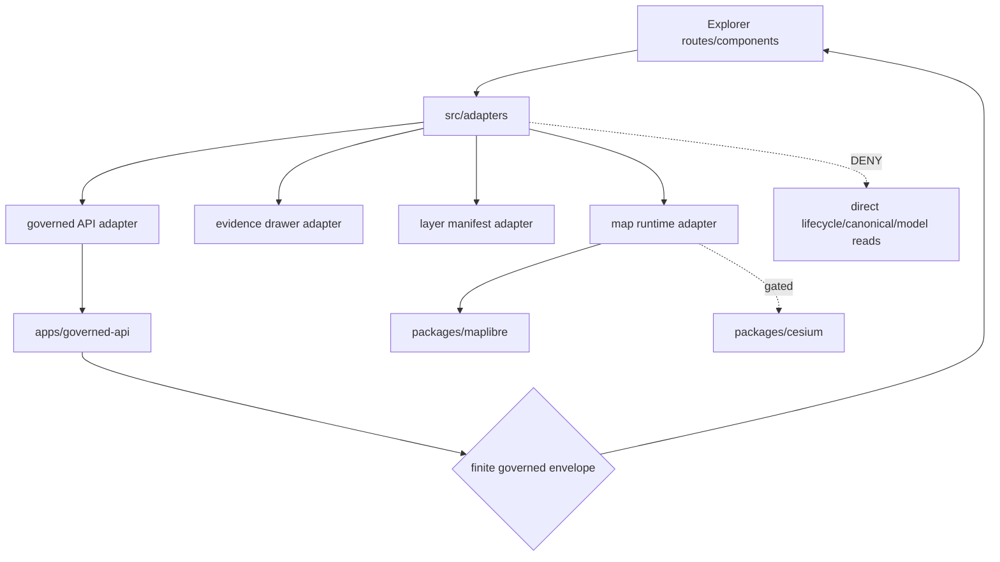

<!-- [KFM_META_BLOCK_V2]
doc_id: kfm://app/explorer-web/src/adapters/readme
title: Explorer Web Adapters README
type: app-readme
version: v0.2
status: draft
owners: OWNER_TBD — Apps steward · UI steward · Map steward · Governed API steward · Policy steward · Docs steward
created: 2026-06-16
updated: 2026-07-09
policy_label: public
related:
  - ../README.md
  - ../../README.md
  - ../../../README.md
  - ../../../governed-api/README.md
  - ../../../../README.md
  - ../../../../SECURITY.md
  - ../../../../docs/adr/ADR-0005-apps-explorer-web-is-the-canonical-map-first-shell.md
  - ../../../../docs/adr/ADR-0006-maplibre-boundary-only-maplibreadapter-imports-maplibre.md
  - ../../../../docs/adr/ADR-0007-cesium-3d-is-conditional-and-gated.md
  - ../../../../docs/adr/ADR-0025-public-client-never-reads-canonical-internal-stores.md
  - ../../../../packages/ui/README.md
  - ../../../../packages/maplibre/README.md
  - ../../../../packages/cesium/README.md
  - ../../../../policy/access/README.md
  - ../../../../policy/decision/README.md
  - ../../../../release/README.md
  - ../../../../data/README.md
  - ../../../../tools/validators/README.md
  - ../../../../tools/watchers/README.md
tags: [kfm, apps, explorer-web, adapters, map-adapter, governed-client, renderer-boundary, maplibre, cesium, trust-membrane, no-direct-data-root]
notes:
  - "v0.2 updates the uploaded Explorer Web adapters README into a current repo-aware adapter-boundary contract."
  - "apps/explorer-web/src/adapters/README.md, apps/explorer-web/src/README.md, and apps/explorer-web/README.md were verified through the GitHub app in this update. Adapter implementation files, imports, tests, fixtures, client validators, renderer wrappers, package scripts, runtime wiring, and deployment behavior remain NEEDS VERIFICATION."
  - "Adapters may translate between Explorer Web UI code and governed API envelopes, renderer ports, evidence payloads, layer manifests, export requests, and diagnostics; they must not become source truth, policy authority, release authority, lifecycle storage, schema/contract authority, direct model surface, or renderer authority."
  - "Claim-bearing UI state must come from governed API envelopes, released or bounded-safe layer artifacts, EvidenceBundle-derived payloads, and finite states; adapters must not directly read RAW/WORK/QUARANTINE/PROCESSED/CATALOG/TRIPLET/PUBLISHED data roots or canonical/internal stores."
[/KFM_META_BLOCK_V2] -->

<a id="top"></a>

<div align="center">

# Explorer Web Adapters

`apps/explorer-web/src/adapters/`

**Adapter boundary for Explorer Web integrations: governed API client adapters, map-runtime adapters, renderer bridges, evidence payload adapters, and safe export/diagnostic adapters.**


[Purpose](#1-purpose) · [Current evidence](#2-current-repo-evidence) · [Repo fit](#3-repo-fit) · [Boundary](#4-authority-boundary) · [Inputs](#6-inputs) · [Exclusions](#7-exclusions) · [Adapter families](#8-adapter-family-map) · [Definition of done](#15-definition-of-done)

</div>

---

> [!IMPORTANT]
> **Status:** draft / current README surface confirmed / implementation behavior `NEEDS VERIFICATION`  
> **Owners:** `OWNER_TBD` — Apps steward · UI steward · Map steward · Governed API steward · Policy steward · Docs steward  
> **Path:** `apps/explorer-web/src/adapters/README.md`  
> **Responsibility root:** `apps/` — deployable application surfaces  
> **Truth posture:** CONFIRMED README path and parent Explorer Web READMEs / PROPOSED adapter-boundary contract / UNKNOWN adapter files, imports, tests, fixtures, client validators, renderer wrappers, package scripts, runtime wiring, and deployment behavior

> [!CAUTION]
> Adapter code must not bypass the trust membrane. It may translate governed API envelopes, renderer ports, evidence payloads, layer manifests, and export requests into UI-friendly shapes, but it must not directly read lifecycle data roots, canonical/internal stores, raw renderer internals as truth, direct model output, or local source files as user-facing claims.

---

## Quick jump

- [1. Purpose](#1-purpose)
- [2. Current repo evidence](#2-current-repo-evidence)
- [3. Repo fit](#3-repo-fit)
- [4. Authority boundary](#4-authority-boundary)
- [5. Default posture](#5-default-posture)
- [6. Inputs](#6-inputs)
- [7. Exclusions](#7-exclusions)
- [8. Adapter family map](#8-adapter-family-map)
- [9. Diagram](#9-diagram)
- [10. Adapter obligations](#10-adapter-obligations)
- [11. Adapter contract](#11-adapter-contract)
- [12. Inspection path](#12-inspection-path)
- [13. Validation expectations](#13-validation-expectations)
- [14. Safe change pattern](#14-safe-change-pattern)
- [15. Definition of done](#15-definition-of-done)
- [16. Open verification items](#16-open-verification-items)

---

## 1. Purpose

`apps/explorer-web/src/adapters/` is the proposed source boundary for Explorer Web adapter code.

Adapters should isolate integration details so route and component code can remain governed, testable, and renderer-agnostic. This directory may eventually contain adapter modules that translate:

- governed API response envelopes into route/view models;
- EvidenceBundle-derived payloads into Evidence Drawer state;
- layer manifests into map-layer configuration;
- map runtime events into governed feature-selection requests;
- MapLibre and optional Cesium ports into app-facing interfaces;
- export requests into governed export payloads;
- diagnostics and telemetry into safe, non-secret UI diagnostics.

This README does not prove those adapters are implemented.

[Back to top](#top)

---

## 2. Current repo evidence

| Surface | Status | What it proves | What it does **not** prove |
|---|---|---|---|
| `apps/explorer-web/src/adapters/README.md` | **CONFIRMED README** | This README exists and has been updated to v0.2. | Adapter files, imports, tests, fixtures, client validators, renderer wrappers, runtime wiring, package scripts, or deployment behavior. |
| `apps/explorer-web/src/README.md` | **CONFIRMED parent source README** | Parent source tree defines Explorer Web source as map-first implementation boundary and denies direct lifecycle/canonical/model reads. | That routes, adapters, renderer wiring, or tests are implemented. |
| `apps/explorer-web/README.md` | **CONFIRMED parent app README** | Parent app lane defines Explorer Web as map-first public/semi-public shell that must read through governed API and avoid direct lifecycle/canonical/internal store reads. | That app routes, clients, adapters, tests, or deployment exist. |
| Uploaded adapter Markdown | **CONFIRMED source text for this update** | Provided the base adapter-boundary contract updated here. | Does not prove live implementation. |
| Adapter files beyond README | **NEEDS VERIFICATION** | Checkable by repo scan, import-boundary tests, fixtures, package scripts, and runtime evidence. | Not claimed by this README. |

[Back to top](#top)

---

## 3. Repo fit

| Concern | Owning root | Expected relationship |
|---|---|---|
| Explorer Web adapter source | `apps/explorer-web/src/adapters/` | App-local adapter modules, if implemented and tested. |
| Explorer Web source tree | `apps/explorer-web/src/` | Parent source-layout boundary. |
| Explorer Web app | `apps/explorer-web/` | Deployable map-first public/semi-public shell. |
| Governed API | `apps/governed-api/` | Trust membrane and normal claim-bearing data path. |
| Shared UI components | `packages/ui/` | Reusable UI primitives, not adapter authority. |
| MapLibre wrapper | `packages/maplibre/` | Renderer wrapper boundary for MapLibre-specific behavior. |
| Cesium wrapper | `packages/cesium/` | Conditional and gated 3D renderer wrapper. |
| Policy gates | `policy/` | Access, sensitivity, rights, and decision policy. |
| Release authority | `release/` | Publication, correction, rollback control. |
| Lifecycle artifacts | `data/` | Receipts, proofs, registry, catalog, triplets, published artifacts. |
| Security posture | `SECURITY.md`, `docs/security/` | Secrets, diagnostics, exposure, and safe-output posture. |

[Back to top](#top)

---

## 4. Authority boundary

Adapters translate between boundaries. They do not own the truth, policy, evidence, release, lifecycle, schema, contract, or renderer authority that they consume.

```text
apps/explorer-web/src/adapters/ = app-local integration adapters
apps/explorer-web/src/          = Explorer Web implementation source
apps/explorer-web/              = map-first public/semi-public app boundary
apps/governed-api/              = governed trust membrane
packages/maplibre/              = MapLibre renderer wrapper
packages/cesium/                = optional gated 3D renderer wrapper
packages/ui/                    = shared UI components
policy/                         = finite policy decisions
schemas/                        = machine-readable shape
contracts/                      = object meaning
data/                           = lifecycle artifacts, receipts, proofs, registries
release/                        = publication, correction, rollback authority
```

Safe interpretation:

- **CONFIRMED:** this README surface and parent Explorer Web READMEs exist.
- **PROPOSED:** adapter modules may live here when they preserve governed API, renderer, evidence, release, redaction, and public-boundary constraints.
- **NEEDS VERIFICATION:** adapter modules, import boundaries, validators, fixtures, tests, package scripts, renderer wrappers, runtime wiring, and deployment behavior.
- **DENY:** using adapters as source truth, lifecycle store, direct canonical/internal store client, policy authority, release authority, schema/contract home, direct model-output surface, renderer authority, or public-data shortcut.

[Back to top](#top)

---

## 5. Default posture

Adapters should fail safe and return finite bounded states when integration support is unresolved.

An adapter should not emit claim-bearing UI state when any of these are missing or malformed:

- governed API envelope;
- response validator result;
- finite outcome;
- EvidenceRef or EvidenceBundle-derived payload;
- citation validation;
- sensitivity, rights, release, or redaction state;
- layer manifest or tile proof metadata;
- renderer adapter readiness;
- export citation and redaction support;
- safe diagnostic target.

[Back to top](#top)

---

## 6. Inputs

| Input family | Examples | Required posture |
|---|---|---|
| API envelope | answer, abstain, deny, error, decision envelope, evidence payload | Runtime-validated before adapting. |
| Evidence payload | EvidenceRef, EvidenceBundle summary, citation state, proof visibility | Required for claim-bearing UI detail. |
| Layer manifest | layer id, source role, release state, tile URL, legend, valid time, rights/sensitivity badges | Released or bounded safe source only. |
| Renderer port | map runtime, feature id, viewport, interaction event, tile state | Never treated as truth by itself. |
| Export request | bounds, selected layers, citation bundle, redaction state | Governed export only. |
| Diagnostics payload | version, envelope status, route status, layer status, adapter health | Safe, non-secret, non-sensitive. |
| Policy/release context | access result, decision result, release ref, rollback/correction state | Required before public-impacting export or display behavior. |

[Back to top](#top)

---

## 7. Exclusions

| Does not belong here | Correct home |
|---|---|
| Public API implementation | `apps/governed-api/` |
| Shared reusable UI primitives | `packages/ui/` |
| Renderer wrapper authority | `packages/maplibre/`, `packages/cesium/` |
| Policy bundles or policy decisions | `policy/` |
| Schemas and contracts | `schemas/contracts/v1/`, `contracts/` |
| Lifecycle artifacts, receipts, proofs, catalog, triplets | `data/` |
| Release manifests, rollback cards, correction notices | `release/` |
| Direct source acquisition | `connectors/` |
| Direct model runtime behavior | `runtime/` behind governed API only |
| Secrets, credentials, tokens, private keys, signing material | secret manager / deployment environment, not adapter source or examples |
| Direct RAW / WORK / QUARANTINE / PROCESSED / CATALOG / TRIPLET / PUBLISHED reads | governed API, released artifacts, layer manifests, and bounded public-safe envelopes only |
| Public-sensitive exports, exact sensitive locations, living-person/DNA details, or source-restricted records | denied unless separately governed and public-safe |

[Back to top](#top)

---

## 8. Adapter family map

Exact adapter modules remain `NEEDS VERIFICATION`. Candidate families should be introduced only with tests and import-boundary checks.

| Candidate adapter | Responsibility | Status |
|---|---|---|
| `governedClientAdapter` | Normalize governed API calls and response validators. | PROPOSED |
| `evidenceDrawerAdapter` | Convert evidence payloads into drawer view state. | PROPOSED |
| `layerManifestAdapter` | Convert layer manifests into layer catalog/map state. | PROPOSED |
| `mapRuntimeAdapter` | Convert UI map interactions into governed map/runtime events. | PROPOSED |
| `maplibreAdapter` | Keep MapLibre-specific calls behind app-facing port. | PROPOSED |
| `cesiumAdapter` | Conditional gated 3D bridge. | PROPOSED |
| `exportAdapter` | Build governed export requests and safe export state. | PROPOSED |
| `diagnosticsAdapter` | Convert safe diagnostics into UI diagnostic panels. | PROPOSED |
| `boundaryGuardAdapter` | Centralize checks that deny direct lifecycle/canonical/model-output reads. | PROPOSED |

> [!WARNING]
> Candidate names are not implementation proof. Do not document an adapter as runnable until files, imports, fixtures, and tests confirm it.

[Back to top](#top)

---

## 9. Diagram



[Back to top](#top)

---

## 10. Adapter obligations

| Obligation | Example effect |
|---|---|
| `governed_api_only` | Claim-bearing data is adapted only from governed API envelopes. |
| `runtime_validation_required` | Unknown or malformed envelopes fail closed. |
| `evidence_preserved` | Evidence and citation handles survive adaptation. |
| `redaction_preserved` | Redacted/generalized details are never re-expanded. |
| `renderer_boundary_preserved` | Renderer imports remain in approved adapter/wrapper locations. |
| `finite_state_required` | Adapter output distinguishes answer, abstain, deny, error, hold, and restricted states. |
| `safe_export_required` | Export adapters preserve citations, redaction, rights, and release constraints. |
| `safe_diagnostics_required` | Diagnostics adapters never expose secrets or restricted internals. |
| `no_data_root_shortcut` | Adapters do not read lifecycle data roots, canonical/internal stores, or local source files as claim sources. |
| `local_parity_preferred` | Adapter boundary tests should be runnable locally and in CI with the same fixtures where practical. |

[Back to top](#top)

---

## 11. Adapter contract

Every long-lived adapter should document or encode:

- source boundary it consumes;
- app-facing shape it returns;
- validator or schema/contract dependency;
- finite outcome handling;
- evidence/citation preservation;
- sensitivity, rights, and release-state behavior;
- redaction/generalization behavior;
- safe error behavior;
- renderer import posture;
- direct data-root denial posture;
- tests or fixtures proving boundary behavior.

[Back to top](#top)

---

## 12. Inspection path

Adapter implementation files, import boundaries, tests, fixtures, client validators, renderer wrappers, and package scripts remain `NEEDS VERIFICATION`.

```bash
find apps/explorer-web/src/adapters -maxdepth 5 -type f | sort
find apps/explorer-web/src packages/maplibre packages/cesium packages/ui apps/governed-api tests fixtures -maxdepth 6 -type f 2>/dev/null | grep -Ei 'adapter|governed|maplibre|cesium|evidence|layer|export|diagnostic|validator' | sort
find data/raw data/work data/quarantine data/processed data/catalog data/triplets data/published -maxdepth 2 -type f 2>/dev/null | sort
```

[Back to top](#top)

---

## 13. Validation expectations

Useful validation for this adapter boundary should cover:

- no adapter imports or reads lifecycle data roots directly;
- claim-bearing adapters consume governed API envelopes only;
- malformed envelopes return safe error or abstain states;
- evidence drawer adapter preserves EvidenceRef/EvidenceBundle handles;
- layer adapter preserves release, source-role, sensitivity, rights, and valid-time state;
- map feature selection triggers governed claim/evidence resolution;
- renderer imports stay in approved adapter/wrapper modules;
- export adapter preserves citation, redaction, rights, and release constraints;
- diagnostics adapter redacts secrets and restricted internals;
- adapters do not expose secrets, exact sensitive locations, source-restricted records, private data, or direct model output.

[Back to top](#top)

---

## 14. Safe change pattern

For adapter changes:

1. Add or update fixtures for the boundary shape being adapted.
2. Add tests for answer, abstain, deny, error, hold, restricted, malformed, and empty states.
3. Check renderer and data-root import boundaries.
4. Preserve evidence, citation, policy, and release fields in adapted output.
5. Verify diagnostics and export output are redacted and public-safe.
6. Update this README and parent `src/`/app READMEs when adapter behavior changes.

[Back to top](#top)

---

## 15. Definition of done

- [ ] Owners are confirmed and `OWNER_TBD` is replaced.
- [ ] Adapter file inventory is documented.
- [ ] Governed API adapter and validators are implemented and tested.
- [ ] Renderer imports are confined to accepted adapter/wrapper modules.
- [ ] Evidence, citation, release, rights, sensitivity, and redaction fields survive adaptation.
- [ ] Direct lifecycle-data import/read checks are covered.
- [ ] Export and diagnostics adapters are tested for safe output.
- [ ] Malformed and unresolved inputs produce finite safe states.
- [ ] Parent Explorer Web source/app READMEs are updated when adapter behavior changes.

[Back to top](#top)

---

## 16. Open verification items

| Item | Why it matters |
|---|---|
| Confirm adapter implementation files beyond README | Prevents overclaiming adapter maturity. |
| Confirm governed API client adapter shape | Required for trust membrane enforcement. |
| Confirm renderer adapter modules and imports | Required for MapLibre/Cesium boundary discipline. |
| Confirm fixtures and tests | Required before implementation claims. |
| Confirm export adapter behavior | Required before public download claims. |
| Confirm diagnostics redaction | Prevents secret or restricted-internal leakage. |
| Confirm package scripts beyond TODO | Required before build/test claims. |
| Confirm no direct data-root or canonical/internal-store reads | Required for public client trust membrane. |
| Confirm no direct model runtime output path | Required for governed-AI boundary. |
| Confirm release/correction/rollback context preservation for exports | Required before public export claims. |

<details>
<summary>Appendix A — no-loss preservation note</summary>

The uploaded README added a bounded adapter-directory contract without claiming governed API adapters, renderer adapters, evidence adapters, layer adapters, export adapters, diagnostics adapters, tests, fixtures, imports, package scripts, or runtime wiring are implemented. This v0.2 update preserves that structure while adding current repo evidence, parent Explorer Web source/app linkage, stronger direct-data-root denial language, safe-output posture, local-parity expectations, and expanded verification items.

</details>

## Status summary

`apps/explorer-web/src/adapters/` should contain app-local adapters only after adapter files, import boundaries, fixtures, and tests are verified.

It must preserve the trust membrane and renderer boundary: adapters translate governed API envelopes, evidence payloads, layer manifests, renderer ports, and export/diagnostic requests without becoming source truth, release authority, policy authority, lifecycle store, schema/contract home, model-output surface, direct data-root client, or renderer authority.

<p align="right"><a href="#top">Back to top</a></p>
