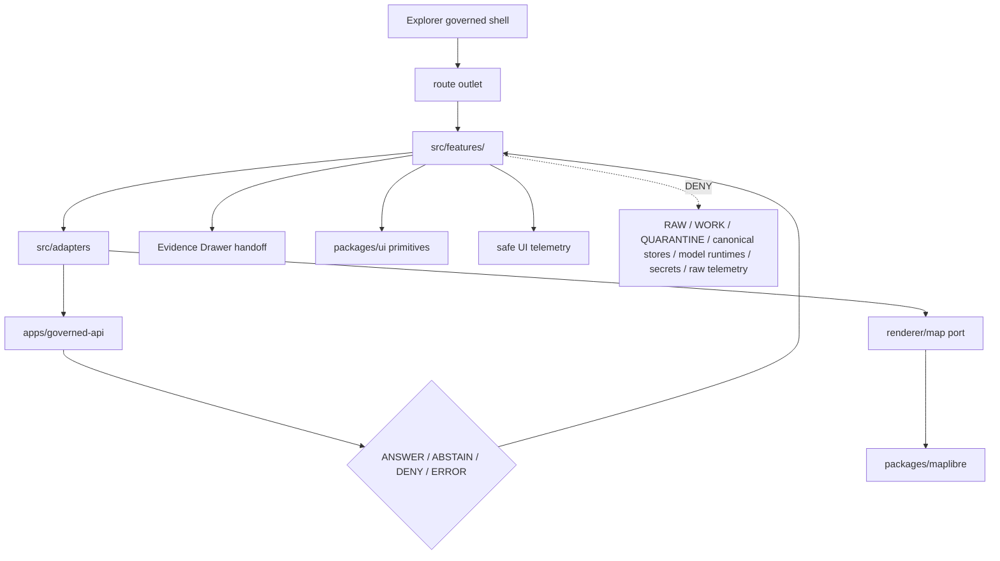

<!-- [KFM_META_BLOCK_V2]
doc_id: kfm://app/explorer-web/src/features/readme
title: Explorer Web Features README
type: app-readme
version: v0.2
status: draft
owners: OWNER_TBD — Apps steward · UI steward · Map steward · Governed API steward · Policy steward · Release steward · Evidence steward · Accessibility steward · Telemetry steward · Docs steward
created: 2026-06-16
updated: 2026-07-09
policy_label: public
related:
  - ../README.md
  - ../adapters/README.md
  - ../../README.md
  - ../../../README.md
  - ../../../governed-api/README.md
  - ../../../../docs/doctrine/directory-rules.md
  - ../../../../docs/adr/ADR-0005-apps-explorer-web-is-the-canonical-map-first-shell.md
  - ../../../../docs/adr/ADR-0025-public-client-never-reads-canonical-internal-stores.md
  - ../../../../docs/architecture/ui/README.md
  - ../../../../docs/architecture/ui/GOVERNED_SHELL.md
  - ../../../../docs/architecture/ui/EVIDENCE_DRAWER.md
  - ../../../../docs/architecture/ui/MAP_RUNTIME_BOUNDARY.md
  - ../../../../docs/architecture/ui/LAYERING.md
  - ../../../../docs/architecture/ui/STORY_PLAYER.md
  - ../../../../docs/architecture/ui/COMPARE_AND_EXPORT.md
  - ../../../../docs/architecture/ui/ACCESSIBILITY.md
  - ../../../../docs/architecture/ui/TELEMETRY.md
  - ../../../../docs/architecture/ui/STATE_OWNERSHIP.md
  - ../../../../docs/architecture/map-shell.md
  - ../../../../docs/architecture/evidence-drawer.md
  - ../../../../docs/architecture/governed-ai/FOCUS_FLOW.md
  - ../../../../docs/focus-mode/README.md
  - ../../../../packages/ui/README.md
  - ../../../../packages/maplibre/README.md
  - ../../../../policy/access/README.md
  - ../../../../policy/decision/README.md
  - ../../../../policy/telemetry/README.md
  - ../../../../release/README.md
  - ../../../../data/README.md
tags: [kfm, apps, explorer-web, features, routes, map-first, governed-shell, evidence-drawer, focus-mode, story-player, compare, export, diagnostics, trust-membrane, finite-outcomes]
notes:
  - "Refreshes the Explorer Web feature source boundary README."
  - "Feature modules may compose governed API results and adapters into user-facing surfaces, but they must not become source truth, policy authority, release authority, lifecycle storage, renderer authority, direct model-output surfaces, telemetry payload authority, schema homes, or contract homes."
  - "Feature implementation files, route inventory, tests, fixtures, adapter wiring, package scripts, child-feature maturity, telemetry policy wiring, accessibility behavior, and runtime behavior remain NEEDS VERIFICATION."
  - "policy/telemetry/README.md may still be stub-level; executable telemetry policy wiring remains NEEDS VERIFICATION unless separately verified."
  - "v0.2 adds a current evidence basis, child-feature umbrella contract, minimum safe implementation slice, runtime anti-bypass matrix, stronger feature-family map, and validation/definition-of-done gates without claiming runtime maturity."
[/KFM_META_BLOCK_V2] -->

<a id="top"></a>

<div align="center">

# Explorer Web Features

`apps/explorer-web/src/features/`

**App-local feature and route boundary for the Explorer Web shell: governed shell composition, map runtime, layer catalog, domain panels, Evidence Drawer, Focus Mode, Story Player, Compare, Export, Settings, Diagnostics, Review Console read-only views, trust header, time banner, and other map-first governed UI surfaces.**


[Evidence](#0-evidence-basis-for-this-revision) · [Purpose](#1-purpose) · [Repo fit](#2-repo-fit) · [Boundary](#3-authority-boundary) · [Inputs](#5-inputs) · [Exclusions](#6-exclusions) · [Feature families](#7-feature-family-map) · [Minimum slice](#8-minimum-safe-implementation-slice) · [Definition of done](#16-definition-of-done)

</div>

---

> [!IMPORTANT]
> **Status:** draft / `NEEDS VERIFICATION`  
> **Owners:** `OWNER_TBD` — Apps steward · UI steward · Map steward · Governed API steward · Policy steward · Release steward · Evidence steward · Accessibility steward · Telemetry steward · Docs steward  
> **Path:** `apps/explorer-web/src/features/README.md`  
> **Responsibility root:** `apps/` — deployable application surfaces  
> **Directory Rules basis:** deployable application feature code belongs under `apps/`; `features/` is an app-local UI composition boundary, not a governed API implementation, source registry, evidence store, policy home, schema home, contract home, release home, shared package root, renderer package, telemetry policy home, model runtime, or lifecycle-data lane.  
> **Truth posture:** CONFIRMED current GitHub README path / CONFIRMED parent feature-boundary README exists / CONFIRMED Directory Rules document exists / CONFIRMED selected UI architecture docs exist / PROPOSED feature-boundary contract / UNKNOWN implementation files, route inventory, child-feature maturity, tests, fixtures, adapter wiring, schemas, package scripts, telemetry policy wiring, accessibility behavior, deployment state, and runtime behavior

> [!CAUTION]
> Feature code must not treat map features, tile properties, local files, model text, telemetry events, route parameters, screenshots, story text, diagnostics output, or lifecycle data as claim truth. Claim-bearing surfaces should render only governed API envelopes, finite outcomes, EvidenceBundle-derived payloads, released or bounded-safe layer artifacts, and policy-preserved redaction/generalization states.

---

## Quick jump

- [0. Evidence basis for this revision](#0-evidence-basis-for-this-revision)
- [1. Purpose](#1-purpose)
- [2. Repo fit](#2-repo-fit)
- [3. Authority boundary](#3-authority-boundary)
- [4. Default posture](#4-default-posture)
- [5. Inputs](#5-inputs)
- [6. Exclusions](#6-exclusions)
- [7. Feature family map](#7-feature-family-map)
- [8. Minimum safe implementation slice](#8-minimum-safe-implementation-slice)
- [9. Diagram](#9-diagram)
- [10. Feature obligations](#10-feature-obligations)
- [11. Per-feature contract](#11-per-feature-contract)
- [12. Runtime anti-bypass matrix](#12-runtime-anti-bypass-matrix)
- [13. Inspection path](#13-inspection-path)
- [14. Validation expectations](#14-validation-expectations)
- [15. Safe change pattern](#15-safe-change-pattern)
- [16. Definition of done](#16-definition-of-done)
- [17. Open verification items](#17-open-verification-items)

---

## 0. Evidence basis for this revision

This README is a documentation boundary, not runtime proof. The 2026-07-09 revision updates an existing README and keeps implementation maturity bounded while aligning the feature-directory contract with current repository evidence and the child-feature README refresh pattern.

| Evidence item | Status | What it supports | What it does not prove |
|---|---|---|---|
| `apps/explorer-web/src/features/README.md` exists on `main`. | CONFIRMED | This is an existing README update, not a new path proposal. | It does not prove feature implementations, route inventory, tests, fixtures, package scripts, child-feature runtime behavior, or deployment state. |
| `apps/explorer-web/src/features/README.md` already defines feature modules as UI composition surfaces. | CONFIRMED | The parent feature boundary is already present and should remain app-local. | It does not prove any candidate feature route is runnable. |
| `docs/doctrine/directory-rules.md` exists and identifies `apps/` as the deployable-app responsibility root. | CONFIRMED document presence and doctrine posture | Feature code belongs under `apps/` when it is deployable application UI. | It does not decide implementation maturity or route readiness. |
| `docs/architecture/ui/GOVERNED_SHELL.md` exists and defines the shell as the persistent trust-visible UI host. | CONFIRMED document presence and doctrine posture | Feature modules should compose into a governed shell and keep finite outcomes visible. | It does not prove shell wiring or feature integration. |
| `docs/architecture/map-shell.md` exists and defines the map-first, time-aware trust membrane. | CONFIRMED document presence and doctrine posture | Feature modules must stay downstream of governed interfaces and released/evidence-backed state. | It does not prove route tree, schemas, or tests. |
| UI docs for Evidence Drawer, Map Runtime Boundary, Layering, Story Player, Compare/Export, Accessibility, Telemetry, and State Ownership exist or are referenced in repo evidence. | CONFIRMED document-path evidence where fetched or referenced | Feature families should preserve those boundaries. | It does not prove runtime integration, validators, or test coverage. |
| `policy/telemetry/README.md` may still be stub-level in related feature work. | NEEDS VERIFICATION for executable policy | Feature telemetry must remain bounded and non-secret until policy wiring is verified. | It does not prove telemetry schemas, policy bundles, validators, or runtime wiring. |
| Child feature README refreshes may exist on separate branches or PRs. | NEEDS VERIFICATION on `main` unless fetched at the target ref | This parent README can require a common pattern for child feature docs. | It must not claim those child updates are merged or implemented. |

[Back to top](#top)

---

## 1. Purpose

`apps/explorer-web/src/features/` is the app-local source boundary for Explorer Web feature and route modules.

Feature modules should compose governed inputs into user-facing workflows without becoming root authority. This directory may eventually contain modules for:

- persistent governed shell composition;
- map runtime coordination and renderer-port handoffs;
- layer catalog and domain feature panels;
- trust header and time banner chrome;
- Evidence Drawer detail surfaces;
- Focus Mode finite-outcome experiences;
- Story Player playback;
- Compare and Export workflows;
- read-only Review Console views;
- Settings and accessibility preferences;
- safe diagnostics and trust-status displays;
- bounded public/semi-public route state.

This README does not prove those features are implemented. It defines how feature code must behave if and when implementation files, routes, fixtures, and tests are added.

[Back to top](#top)

---

## 2. Repo fit

| Concern | Owning root | Expected relationship |
|---|---|---|
| Explorer feature source | `apps/explorer-web/src/features/` | App-local route and feature modules, if implemented and tested |
| Explorer source tree | `apps/explorer-web/src/` | Parent source-layout boundary |
| Adapter boundary | `apps/explorer-web/src/adapters/` | Governed API, renderer, evidence, layer, export, diagnostics, settings, and review adapters |
| Explorer Web app | `apps/explorer-web/` | Deployable map-first public/semi-public shell |
| Governed API | `apps/governed-api/` | Trust membrane and normal governed payload path |
| UI architecture | `docs/architecture/ui/` | Shell, Evidence Drawer, Map Runtime, Layering, Story, Compare/Export, Accessibility, Telemetry, and state-ownership doctrine |
| Map Shell doctrine | `docs/architecture/map-shell.md` | Map-first, time-aware, trust-visible shell posture |
| Governed AI / Focus flow | `docs/architecture/governed-ai/`, `docs/focus-mode/` | Evidence-bounded Focus behavior and finite outcomes |
| Shared UI components | `packages/ui/` | Reusable primitives extracted from feature code when shared |
| Renderer wrapper | `packages/maplibre/` | Browser renderer behavior stays behind adapter/wrapper boundaries |
| Optional or legacy renderer wrappers | `packages/cesium/`, `packages/maplibre-runtime/` | Exact placement/status remains `NEEDS VERIFICATION` unless separately verified against current repo/ADRs |
| Policy gates | `policy/` | Access, sensitivity, rights, telemetry, release, and decision policy |
| Release authority | `release/` | Publication, correction, supersession, rollback control |
| Lifecycle artifacts | `data/` | Receipts, proofs, registry, catalog, triplets, published artifacts; not browser-readable directly |
| Contracts and schemas | `contracts/`, `schemas/contracts/v1/` | Object meaning and machine shape; feature code references, not owns |
| Tests and fixtures | `tests/`, `fixtures/` | Required before implementation or route maturity claims |

## 3. Authority boundary

Features are UI composition surfaces. They render governed results; they do not own source truth, evidence truth, policy decisions, release decisions, lifecycle artifacts, schemas, contracts, renderer authority, telemetry payload authority, review authority, citation validation, source admission, or model output.

```text
apps/explorer-web/src/features/ = app-local feature and route modules
apps/explorer-web/src/adapters/ = app-local boundary adapters
apps/explorer-web/              = map-first public/semi-public shell
apps/governed-api/              = trust membrane and normal governed payload path
packages/ui/                    = shared UI primitives
packages/maplibre/              = renderer wrapper/helper boundary
policy/                         = finite policy decisions
schemas/                        = machine-readable shape
contracts/                      = object meaning
data/                           = lifecycle artifacts, receipts, proofs, registries
release/                        = publication, correction, rollback authority
tests/ and fixtures/            = validation evidence
```

## 4. Default posture

Feature modules should fail safe and show finite bounded UI states rather than guessing.

A feature should not render claim-bearing, release-bearing, export-bearing, review-bearing, story-bearing, Focus-bearing, diagnostic-bearing, or map-layer-bearing content when any of these are missing or malformed:

- governed API envelope or bounded local contract;
- route contract and feature ownership;
- finite outcome state;
- EvidenceRef or EvidenceBundle-derived payload where a claim is involved;
- citation validation or cite-or-abstain posture;
- sensitivity, rights, access, release, redaction, generalization, suppression, delay, or denial state;
- layer manifest, release manifest, artifact digest, or tile proof metadata;
- valid time, observed time, source time, retrieval time, release time, correction time, freshness, or stale state where material;
- export citation/redaction/rights/release support;
- story evidence gate or StoryNode finite outcome;
- Focus output citations, policy checks, and no-chain-of-thought posture;
- safe diagnostics context;
- safe telemetry posture;
- accessibility state for keyboard, focus, screen readers, reduced motion, contrast, and non-color status.

## 5. Inputs

| Input family | Examples | Required posture |
|---|---|---|
| Route state | Explore, domains, Focus, Story, Compare, Export, Settings, Diagnostics, Review | Explicit finite states |
| Shell state | trust header, time banner, route outlet, panel region, selected layer, selected feature | Governed shell state only |
| API envelope | answer, abstain, deny, error, decision envelope, runtime envelope, evidence payload | Runtime-validated before render |
| Evidence payload | EvidenceRef, EvidenceBundle summary, citations, proof visibility, drawer refs | Required for claim-bearing feature detail |
| Layer state | layer manifest, trust badges, legend, valid time, selected feature id | Released or bounded-safe source only |
| Policy state | sensitivity, rights, audience, access, redaction/generalization obligations | Preserved in feature state |
| Release state | release refs, artifact digests, rollback targets, correction lineage, supersession/withdrawal state | Visible where material |
| Renderer state | viewport, tile status, selected geometry, interaction event, click candidate | Never treated as truth by itself |
| Time state | selected time, valid time, observed time, source/retrieval/release/correction time, freshness | Time-kind anti-collapse |
| Export state | selected layers, bounds, citations, redaction profile, output mode | Governed export only |
| Review state | queue/detail/history projection, read-only review status, audit/provenance refs | Projection only unless in separate mutating review workflow |
| Settings state | display/accessibility preferences, feature-flag summaries, reset actions | Preference-not-policy |
| Telemetry state | route opened, panel opened, denied shown, export requested, drawer opened | Non-secret event metadata only |
| Accessibility state | labels, focus return, keyboard paths, reduced motion, non-color trust labels | Required for public/semi-public UI |

## 6. Exclusions

| Does not belong here | Correct home |
|---|---|
| Governed API implementation | `apps/governed-api/` |
| Adapter logic shared across feature families | `apps/explorer-web/src/adapters/` |
| Shared reusable UI primitives | `packages/ui/` |
| Renderer wrapper authority or direct renderer imports | `packages/maplibre/` or accepted renderer package/adapters |
| Policy bundles or policy decisions | `policy/` |
| Telemetry policy, event schemas, or observability authority | `policy/telemetry/`, `docs/architecture/ui/TELEMETRY.md`, schemas/contracts as accepted |
| Schemas and contracts | `schemas/contracts/v1/`, `contracts/` |
| Lifecycle artifacts, receipts, proofs, catalog, triplets, published artifacts | `data/` |
| Release manifests, rollback cards, correction notices | `release/`, `data/receipts/`, `data/proofs/` as accepted |
| Admin-only operations | `apps/admin/` or accepted admin/steward lanes |
| Steward review mutation authority | governed review/correction workflows, not normal feature UI |
| Direct source acquisition | `connectors/` |
| Direct model runtime behavior | `runtime/` behind governed API only |
| Raw telemetry payload collection | Forbidden from feature code |
| RAW, WORK, QUARANTINE, canonical stores, graph/vector stores, object stores, unpublished candidates | Forbidden from browser feature path |
| Secrets, credentials, tokens, private keys | Secret manager / deployment environment |

## 7. Feature family map

Exact feature modules and route maturity remain `NEEDS VERIFICATION`. Candidate families should be introduced only with route inventory, fixtures, tests, and feature-specific README contracts.

| Candidate feature family | Responsibility | Default posture | Status |
|---|---|---|---|
| `shell` | Persistent map-first shell, route outlet, panel region | Bootstrap-gated, finite outcomes | PROPOSED |
| `trust_header` | Trust/status header and required labels | Trust-visible, not authority | PROPOSED |
| `time_banner` | Temporal context and freshness/stale state | Time context, not time authority | PROPOSED |
| `map_runtime` | Map runtime seam and click candidates | Renderer downstream of trust | PROPOSED |
| `layer_catalog` | Governed layer discovery and trust badges | Released/bounded-safe layers only | PROPOSED |
| `domains` | Domain feature panels and route grouping | Domain UI, not domain truth | PROPOSED |
| `evidence_drawer` | Evidence detail for selected claims/features | EvidenceBundle-derived payload required | PROPOSED |
| `focus_panel` | Guided governed query surface | Finite outcomes; no direct model truth | PROPOSED |
| `story_player` | Story playback over governed spatial states | Evidence continuity required | PROPOSED |
| `compare` | Compare layers, times, versions, or candidates | Provenance and release state required | PROPOSED |
| `export` | Public-safe exports and reports | Citation, redaction, rights, release checks | PROPOSED |
| `review_console_readonly` | Read-only review visibility | No review mutation or lifecycle move | PROPOSED |
| `settings` | Display/accessibility preferences | Preference-not-policy | PROPOSED |
| `diagnostics` | Trust, envelope, route, layer, and version diagnostics | Safe, non-secret display | PROPOSED |

> [!WARNING]
> Candidate feature names and README paths are not implementation proof. Do not document a feature route as runnable until files, tests, fixtures, route wiring, package scripts, governed API envelopes, access policy, accessibility behavior, telemetry constraints, and downstream handoffs confirm it.

## 8. Minimum safe implementation slice

A smallest useful feature slice should prove the trust membrane before adding full route breadth.

| Slice item | Minimum requirement | Why it is required |
|---|---|---|
| Route inventory | Every feature route has owner, purpose, inputs, finite outcomes, and handoffs | Prevents hidden authority and route drift |
| Governed envelope parser | Feature state validates governed API envelopes or bounded local contracts before render | Prevents malformed data becoming UI truth |
| Finite outcome renderer | `ANSWER`, `ABSTAIN`, `DENY`, `ERROR`, and review/validator-only states remain explicit | Prevents silent success fallback |
| Evidence Drawer handoff | Claim-bearing surfaces pass governed refs to Evidence Drawer | Keeps evidence inspectable |
| Renderer boundary | Feature code uses ports/adapters, not raw renderer APIs | Keeps renderer downstream of trust |
| Lifecycle denial | Browser feature code cannot import/read lifecycle roots or canonical/internal stores | Preserves public-client boundary |
| Policy/release guard | Required policy, release, rights, sensitivity, correction, rollback, citation, and stale labels remain visible | Keeps governance visible at point of use |
| Time-kind guard | Valid/source/observed/retrieval/release/correction/freshness time remain distinct where material | Prevents temporal evidence collapse |
| Redaction/sensitivity guard | Redacted/generalized/delayed/suppressed/denied details cannot be re-expanded client-side | Prevents protected disclosure |
| No-browser-model guard | Feature code does not call model providers or model runtimes directly | Preserves governed AI boundary |
| Safe telemetry guard | Telemetry emits non-secret event metadata only | Prevents observability side channels |
| Accessibility scaffold | Keyboard, focus, screen-reader labels, reduced motion, contrast, and non-color trust labels are tested | Makes governed UI usable |

This slice is still `PROPOSED` until files, fixtures, tests, route wiring, and accepted contracts are verified.

## 9. Diagram



## 10. Feature obligations

| Obligation | Example effect |
|---|---|
| `governed_api_only` | Claim-bearing feature state comes through governed API envelopes |
| `evidence_required` | Feature detail and claims link to EvidenceBundle-derived payloads |
| `finite_states_required` | Feature modules render answer, abstain, deny, error, hold, restricted, loading, and empty states safely |
| `redaction_preserved` | Redacted/generalized/delayed/suppressed details are never re-expanded client-side |
| `renderer_boundary_preserved` | Feature modules use map ports/adapters instead of renderer authority |
| `safe_export_required` | Export features preserve citation, redaction, rights, and release obligations |
| `review_readonly_when_readonly` | Read-only review features cannot approve, reject, route, write evidence, or move lifecycle state |
| `settings_not_policy` | Settings can adjust display/accessibility preferences, not policy/release/trust obligations |
| `telemetry_safe` | Feature telemetry never carries raw evidence, prompts, model outputs, restricted geometry, secrets, or full bundle copies |
| `accessibility_required` | Keyboard, focus, announcements, reduced motion, contrast, and non-color indicators remain testable |
| `no_authority_fork` | Feature code does not redefine policy, schema, contract, evidence, release, source, telemetry, model, or renderer logic |

## 11. Per-feature contract

Every long-lived feature family should document or encode:

- feature purpose and route ownership;
- governed API envelope, adapter, or bounded local-contract dependency;
- accepted finite outcomes and negative states;
- Evidence Drawer, citation, or proof-inspection behavior;
- sensitivity, rights, redaction, release, correction, rollback, and valid-time behavior;
- source-role and layer-manifest behavior, if map/layer-facing;
- route, panel, shell, trust-header, time-banner, and settings handoff behavior;
- loading, empty, deny, abstain, error, hold, restricted, stale, degraded, invalid, conflict, and unavailable states;
- export behavior, if any;
- review mutation/read-only boundary, if any;
- telemetry emitted, if any;
- accessibility behavior;
- tests and fixtures proving trust-membrane behavior.

## 12. Runtime anti-bypass matrix

| Bypass risk | Required behavior | Review signal |
|---|---|---|
| Feature imports lifecycle/canonical data directly | Deny at import/build/test review; route through governed API | No direct `data/`, canonical, graph, vector, object-store, or candidate imports/fetches |
| Feature treats rendered map feature as proof | Use rendered feature only as candidate scope; resolve through governed API | Click fixture cannot produce claim without EvidenceBundle support |
| Feature shows claim without evidence/citation closure | Render `ABSTAIN`, `DENY`, or `ERROR` | Missing-evidence fixture blocks claim text |
| Feature hides policy/release/trust label | Required labels remain visible or accessible | Label fixture survives route, settings, compact layout, and CSS changes |
| Feature re-expands redacted/generalized data | Deny and preserve server-side transform state | Sensitivity fixture proves no protected detail appears |
| Feature calls model provider directly | Deny browser model calls; use governed API/Focus envelopes | Import/network scan blocks provider SDK/runtime calls |
| Feature emits raw telemetry payload | Emit non-secret event metadata only | Telemetry fixture excludes raw evidence, prompts, model outputs, restricted geometry, secrets |
| Feature-specific README claims runtime maturity without tests | Mark `NEEDS VERIFICATION` until files/tests/fixtures are confirmed | README review cites actual evidence or abstains |
| Shared component grows inside feature folder | Extract to `packages/ui/` when shared across app/feature families | Reuse review avoids parallel UI roots |
| Feature changes schema/policy/release by convenience logic | Deny; use owning roots | No schema/policy/release mutation in feature code |

## 13. Inspection path

Feature implementation files, route inventory, tests, fixtures, adapter wiring, package scripts, accessibility behavior, telemetry wiring, child-feature maturity, and deployment state remain `NEEDS VERIFICATION`.

```bash
find apps/explorer-web/src/features -maxdepth 5 -type f | sort
find apps/explorer-web/src apps/governed-api packages/ui packages/maplibre packages/maplibre-runtime packages/cesium docs/architecture/ui docs/architecture/governed-ai policy release data tests fixtures -maxdepth 6 -type f 2>/dev/null | grep -Ei 'feature|route|explore|domain|layer|evidence|focus|story|compare|export|setting|diagnostic|review|shell|trust.?header|time.?banner|governed|MapRuntimePort|DecisionEnvelope|EvidenceBundle|EvidenceRef|ReleaseManifest|RollbackCard|telemetry|a11y|accessibility' | sort
find data/raw data/work data/quarantine data/processed data/catalog data/triplets data/published data/receipts data/proofs -maxdepth 2 -type f 2>/dev/null | sort
```

## 14. Validation expectations

Useful validation for this feature boundary should cover:

- no feature imports or fetches lifecycle/canonical data roots directly;
- no browser-side model runtime calls or provider SDK use;
- claim-bearing features consume governed API envelopes only;
- malformed envelopes render safe error, deny, or abstain states;
- Evidence Drawer features preserve EvidenceRef/EvidenceBundle handles;
- layer features preserve release, source-role, sensitivity, rights, valid time, correction, and rollback state;
- Map Runtime features preserve renderer adapter boundaries;
- Trust Header and Time Banner features preserve required labels, finite states, time-kind separation, and compact-layout accessibility;
- Focus Mode renders finite outcomes and never direct model output as truth;
- Story Player preserves evidence continuity and 2D-first/conditional-3D safeguards;
- Compare and Export features require citation, redaction, rights, release, correction, and rollback support;
- Review Console read-only features cannot mutate review decisions, lifecycle state, EvidenceRefs, audit/provenance, or quarantine payloads;
- Settings features cannot weaken policy, release, evidence, citation, trust labels, telemetry safety, or accessibility baselines;
- diagnostics features redact secrets and restricted internals;
- telemetry never includes raw prompts, raw evidence, model outputs, restricted geometry, secret URLs, full manifests, or full EvidenceBundle copies;
- accessibility tests cover keyboard, focus, screen-reader labels, reduced motion, contrast, non-color trust labels, compact layouts, and non-map alternatives.

## 15. Safe change pattern

For feature changes:

1. Add or update route inventory and per-feature contract.
2. Add fixtures for answer, abstain, deny, error, hold, restricted, stale, degraded, conflict, invalid, loading, empty, telemetry-denied, accessibility-baseline, and redaction/generalization states.
3. Add boundary tests for governed API, adapters, renderer imports, lifecycle-data denial, no-browser-model behavior, required trust labels, time-kind separation, safe telemetry, and accessibility behavior.
4. Preserve EvidenceRefs, citation reports, policy state, rights, sensitivity, release refs, correction lineage, rollback refs, valid/source/observed/retrieval/release/correction/freshness time, redaction/generalization state, route state, panel state, and accessibility state through composition.
5. Move reusable UI primitives to `packages/ui/` when shared beyond this app/feature family.
6. Update this README, child feature READMEs, parent `src/`/app READMEs, and relevant architecture/policy docs when public behavior changes.

## 16. Definition of done

- [ ] Owners are confirmed and `OWNER_TBD` is replaced.
- [ ] Evidence basis is refreshed when parent README, child feature READMEs, UI architecture docs, governed API, schema, policy, release, telemetry, accessibility, or fixture evidence changes.
- [ ] Feature file inventory and route ownership are documented.
- [ ] Governed API and adapter dependencies are explicit.
- [ ] Evidence, citation, release, rights, sensitivity, valid-time, correction, rollback, and redaction fields survive feature composition.
- [ ] Direct lifecycle-data import/read checks are covered.
- [ ] Browser model-runtime denial is tested.
- [ ] Feature states cover answer, abstain, deny, error, hold, restricted, stale, degraded, invalid, conflict, loading, and empty cases.
- [ ] Renderer-boundary checks are covered for map-facing features.
- [ ] Required trust labels and time-kind labels cannot be hidden by routes, settings, CSS, viewport, or compact layout.
- [ ] Export and diagnostics features are tested for safe output.
- [ ] Read-only review boundaries are tested where applicable.
- [ ] Settings preference-not-policy behavior is tested where applicable.
- [ ] Safe telemetry constraints are tested.
- [ ] Accessibility posture is documented and tested.

## 17. Open verification items

| Item | Why it matters |
|---|---|
| Confirm feature implementation files beyond README | Prevents overclaiming feature maturity |
| Confirm route inventory | Required for public/semi-public UI boundary review |
| Confirm child-feature README status on `main` | Required before parent doc claims sibling maturity |
| Confirm governed API and adapter integration | Required for trust membrane enforcement |
| Confirm fixtures and tests | Required before implementation claims |
| Confirm Focus Mode and Evidence Drawer behavior | Required before claim-bearing UI claims |
| Confirm Map Runtime and Layer Catalog behavior | Required before map/layer UI claims |
| Confirm Story Player behavior | Required before narrative UI claims |
| Confirm Compare/Export behavior | Required before public download claims |
| Confirm read-only Review Console behavior | Required before review visibility claims |
| Confirm Settings behavior | Required before preference/persistence claims |
| Confirm diagnostics redaction | Prevents secret or restricted-internal leakage |
| Confirm safe telemetry behavior and `policy/telemetry/` wiring beyond stub | Required before diagnostics/observability claims |
| Confirm accessibility tests | Required because governed UI must be accessible |
| Confirm package scripts beyond TODO | Required before build/test claims |
| Confirm architecture-doc links and relative paths after recursive inventory | Required before treating all related paths as current implementation evidence |

<details>
<summary>Appendix A — no-loss preservation note</summary>

The previous README already contained a bounded feature-directory contract. This revision preserves that contract, refreshes metadata, adds a current evidence-basis section, broadens the feature-family map to match the current Explorer Web feature refresh pattern, strengthens trust-membrane, renderer-boundary, finite-outcome, lifecycle-denial, telemetry, accessibility, review-read-only, settings-not-policy, and child-feature README expectations, and keeps implementation claims bounded. It does not claim Explore, domains, Evidence Drawer, Focus Mode, Story Player, Compare, Export, Settings, Diagnostics, Review Console, Shell, Map Runtime, Trust Header, Time Banner, route inventory, tests, fixtures, package scripts, or runtime wiring are implemented.

</details>

## Status summary

`apps/explorer-web/src/features/` should contain Explorer Web feature modules only after route inventory, feature contracts, adapter integration, governed API envelope handling, fixtures, tests, telemetry constraints, accessibility checks, and child-feature READMEs are verified.

It must preserve the trust membrane and public UI boundary: features compose governed API envelopes, evidence payloads, layer state, renderer adapter state, route state, shell state, export/diagnostic requests, settings preferences, and review projections without becoming source truth, release authority, policy authority, lifecycle store, schema/contract home, direct model-output surface, telemetry side channel, shared component root, review mutation authority, or renderer authority.

<p align="right"><a href="#top">Back to top</a></p>
