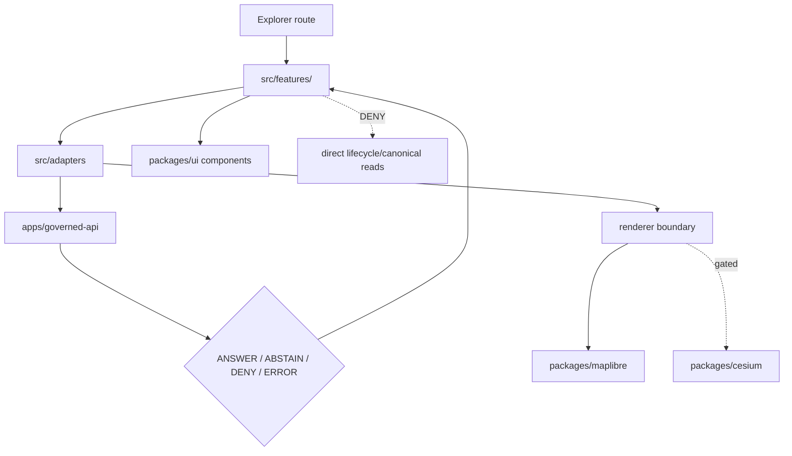

<!-- [KFM_META_BLOCK_V2]
doc_id: kfm://app/explorer-web/src/features/readme
title: Explorer Web Features README
type: app-readme
version: v0.1
status: draft
owners: OWNER_TBD — Apps steward · UI steward · Map steward · Governed API steward · Policy steward · Docs steward
created: 2026-06-16
updated: 2026-06-16
policy_label: public
related:
  - ../README.md
  - ../adapters/README.md
  - ../../README.md
  - ../../../README.md
  - ../../../governed-api/README.md
  - ../../../../docs/adr/ADR-0005-apps-explorer-web-is-the-canonical-map-first-shell.md
  - ../../../../docs/adr/ADR-0025-public-client-never-reads-canonical-internal-stores.md
  - ../../../../docs/architecture/evidence-drawer.md
  - ../../../../docs/focus-mode/README.md
  - ../../../../docs/architecture/ui/STORY_PLAYER.md
  - ../../../../docs/architecture/ui/COMPARE_AND_EXPORT.md
  - ../../../../packages/ui/README.md
  - ../../../../packages/maplibre/README.md
  - ../../../../policy/access/README.md
  - ../../../../policy/decision/README.md
  - ../../../../release/README.md
  - ../../../../data/README.md
tags: [kfm, apps, explorer-web, features, routes, map-first, evidence-drawer, focus-mode, story-player, compare, export, diagnostics]
notes:
  - "Initial README for Explorer Web feature source boundary."
  - "Repository evidence confirms this README path; feature implementation files, route inventory, tests, fixtures, and runtime wiring remain NEEDS VERIFICATION."
  - "Feature modules may compose governed API results and adapters into user-facing surfaces, but they must not become source truth, policy authority, release authority, lifecycle storage, renderer authority, or direct model-output surfaces."
[/KFM_META_BLOCK_V2] -->

<a id="top"></a>

<div align="center">

# Explorer Web Features

`apps/explorer-web/src/features/`

**Feature and route boundary for the Explorer Web shell: Explore, Evidence Drawer, Focus Mode, Story Player, Compare, Export, Settings, Diagnostics, and other map-first governed UI surfaces.**


[Purpose](#1-purpose) · [Repo fit](#2-repo-fit) · [Boundary](#3-authority-boundary) · [Inputs](#5-inputs) · [Exclusions](#6-exclusions) · [Feature families](#7-feature-family-map) · [Definition of done](#14-definition-of-done)

</div>

---

> [!IMPORTANT]
> **Status:** draft / `NEEDS VERIFICATION`  
> **Owners:** `OWNER_TBD` — Apps steward · UI steward · Map steward · Governed API steward · Policy steward · Docs steward  
> **Path:** `apps/explorer-web/src/features/README.md`  
> **Responsibility root:** `apps/` — deployable application surfaces  
> **Truth posture:** CONFIRMED README path / PROPOSED feature-boundary contract / UNKNOWN feature modules, route inventory, tests, fixtures, and runtime wiring

> [!CAUTION]
> Feature code must not treat map features, tile properties, local files, model text, or lifecycle data as claim truth. Claim-bearing surfaces should render only governed API envelopes, finite outcomes, EvidenceBundle-derived payloads, released or bounded-safe layer artifacts, and policy-preserved redaction/generalization states.

---

## Quick jump

- [1. Purpose](#1-purpose)
- [2. Repo fit](#2-repo-fit)
- [3. Authority boundary](#3-authority-boundary)
- [4. Default posture](#4-default-posture)
- [5. Inputs](#5-inputs)
- [6. Exclusions](#6-exclusions)
- [7. Feature family map](#7-feature-family-map)
- [8. Diagram](#8-diagram)
- [9. Feature obligations](#9-feature-obligations)
- [10. Per-feature contract](#10-per-feature-contract)
- [11. Inspection path](#11-inspection-path)
- [12. Validation expectations](#12-validation-expectations)
- [13. Safe change pattern](#13-safe-change-pattern)
- [14. Definition of done](#14-definition-of-done)
- [15. Open verification items](#15-open-verification-items)

---

## 1. Purpose

`apps/explorer-web/src/features/` is the proposed source boundary for Explorer Web route and feature modules.

Feature modules should compose governed inputs into user-facing workflows without becoming root authority. This directory may eventually contain modules for:

- map exploration and layer catalog views;
- Evidence Drawer detail surfaces;
- Focus Mode finite-outcome experiences;
- Story Player playback;
- Compare and Export workflows;
- Settings and accessibility preferences;
- safe diagnostics and trust-status displays;
- bounded public/semi-public route state.

This README does not prove those features are implemented.

[Back to top](#top)

---

## 2. Repo fit

| Concern | Owning root | Expected relationship |
|---|---|---|
| Explorer feature source | `apps/explorer-web/src/features/` | App-local route and feature modules, if implemented and tested |
| Explorer source tree | `apps/explorer-web/src/` | Parent source-layout boundary |
| Adapter boundary | `apps/explorer-web/src/adapters/` | Governed API, renderer, evidence, layer, export, and diagnostics adapters |
| Explorer Web app | `apps/explorer-web/` | Deployable map-first public/semi-public shell |
| Governed API | `apps/governed-api/` | Trust membrane and normal data path |
| Shared UI components | `packages/ui/` | Reusable primitives extracted from feature code when shared |
| Renderer wrappers | `packages/maplibre/`, `packages/cesium/` | Renderer behavior stays behind adapter/wrapper boundaries |
| Policy gates | `policy/` | Access, sensitivity, rights, and decision policy |
| Release authority | `release/` | Publication, correction, rollback control |
| Lifecycle artifacts | `data/` | Receipts, proofs, registry, catalog, triplets, published artifacts |

## 3. Authority boundary

Features are UI composition surfaces. They render governed results; they do not own source truth, evidence truth, policy decisions, release decisions, lifecycle artifacts, schemas, contracts, renderer authority, or model output.

```text
apps/explorer-web/src/features/ = app-local feature and route modules
apps/explorer-web/src/adapters/ = app-local boundary adapters
apps/explorer-web/              = map-first public/semi-public shell
apps/governed-api/              = trust membrane and normal data path
packages/ui/                    = shared UI primitives
packages/maplibre/              = 2D renderer wrapper
packages/cesium/                = optional gated 3D renderer wrapper
policy/                         = finite policy decisions
schemas/                        = machine-readable shape
contracts/                      = object meaning
data/                           = lifecycle artifacts, receipts, proofs, registries
release/                        = publication, correction, rollback authority
```

## 4. Default posture

Feature modules should fail safe and show finite bounded UI states rather than guessing.

A feature should not render claim-bearing content when any of these are missing or malformed:

- governed API envelope;
- route contract;
- finite outcome;
- EvidenceRef or EvidenceBundle-derived payload;
- citation validation;
- sensitivity, rights, release, or redaction state;
- layer manifest or tile proof metadata;
- valid-time state;
- export citation/redaction support;
- safe diagnostics context.

## 5. Inputs

| Input family | Examples | Required posture |
|---|---|---|
| Route state | Explore, Focus, Story, Compare, Export, Settings, Diagnostics | Explicit finite states |
| API envelope | answer, abstain, deny, error, decision envelope, evidence payload | Runtime-validated before render |
| Evidence payload | EvidenceRef, EvidenceBundle summary, citations, proof visibility | Required for claim-bearing feature detail |
| Layer state | layer manifest, trust badges, legend, valid time, selected feature id | Released or bounded safe source only |
| Policy state | sensitivity, rights, audience, redaction/generalization obligations | Preserved in feature state |
| Renderer state | viewport, tile status, selected geometry, interaction event | Never treated as truth by itself |
| Export state | selected layers, bounds, citations, redaction profile, output mode | Governed export only |

## 6. Exclusions

| Does not belong here | Correct home |
|---|---|
| Governed API implementation | `apps/governed-api/` |
| Adapter logic shared across feature families | `apps/explorer-web/src/adapters/` |
| Shared reusable UI primitives | `packages/ui/` |
| Renderer wrapper authority | `packages/maplibre/`, `packages/cesium/` |
| Policy bundles or policy decisions | `policy/` |
| Schemas and contracts | `schemas/contracts/v1/`, `contracts/` |
| Lifecycle artifacts, receipts, proofs, catalog, triplets | `data/` |
| Release manifests, rollback cards, correction notices | `release/` |
| Admin-only operations | `apps/admin/` |
| Steward review authority | `apps/review-console/` and review governance lanes |
| Direct source acquisition | `connectors/` |
| Direct model runtime behavior | `runtime/` behind governed API only |
| Secrets, credentials, tokens, private keys | Secret manager / deployment environment |

## 7. Feature family map

Exact feature modules remain `NEEDS VERIFICATION`. Candidate families should be introduced only with route inventory, fixtures, and tests.

| Candidate feature | Responsibility | Default posture | Status |
|---|---|---|---|
| `explore` | Map-first browsing, layer toggles, legends, trust badges | Governed layers only | PROPOSED |
| `evidence-drawer` | Evidence detail for selected claims/features | EvidenceBundle-derived payload required | PROPOSED |
| `focus-mode` | Guided governed query surface | Finite outcomes; no direct model truth | PROPOSED |
| `story-player` | Story playback over governed spatial states | Evidence continuity required | PROPOSED |
| `compare` | Compare layers, times, versions, or candidates | Provenance and release state required | PROPOSED |
| `export` | Public-safe exports and reports | Citation, redaction, rights, release checks | PROPOSED |
| `settings` | User display/accessibility preferences | No policy or release side effects | PROPOSED |
| `diagnostics` | Trust, envelope, route, layer, and version diagnostics | Safe, non-secret display | PROPOSED |

> [!WARNING]
> Candidate feature names are not implementation proof. Do not document a feature route as runnable until files, tests, fixtures, and package scripts confirm it.

## 8. Diagram



## 9. Feature obligations

| Obligation | Example effect |
|---|---|
| `governed_api_only` | Claim-bearing feature state comes through governed API envelopes |
| `evidence_required` | Feature detail and claims link to EvidenceBundle-derived payloads |
| `finite_states_required` | Feature modules render answer, abstain, deny, error, hold, restricted, loading, and empty states safely |
| `redaction_preserved` | Redacted/generalized details are never re-expanded client-side |
| `renderer_boundary_preserved` | Feature modules use map ports/adapters instead of renderer authority |
| `safe_export_required` | Export features preserve citation, redaction, rights, and release obligations |
| `accessibility_required` | Keyboard, focus, announcements, and contrast remain testable |
| `no_authority_fork` | Feature code does not redefine policy, schema, contract, evidence, release, or source logic |

## 10. Per-feature contract

Every long-lived feature family should document or encode:

- feature purpose and route ownership;
- governed API envelope or adapter dependency;
- accepted finite outcomes;
- Evidence Drawer or citation behavior;
- sensitivity, rights, redaction, release, and valid-time behavior;
- loading, empty, deny, abstain, error, hold, restricted states;
- export behavior, if any;
- accessibility behavior;
- tests and fixtures proving trust-membrane behavior.

## 11. Inspection path

Feature implementation files, route inventory, tests, fixtures, adapter wiring, package scripts, and deployment state remain `NEEDS VERIFICATION`.

```bash
find apps/explorer-web/src/features -maxdepth 5 -type f | sort
find apps/explorer-web/src apps/governed-api packages/ui packages/maplibre packages/cesium tests fixtures -maxdepth 6 -type f 2>/dev/null | grep -Ei 'feature|route|explore|layer|evidence|focus|story|compare|export|setting|diagnostic|governed|maplibre|cesium' | sort
find data/raw data/work data/quarantine data/processed data/catalog data/triplets data/published -maxdepth 2 -type f 2>/dev/null | sort
```

## 12. Validation expectations

Useful validation for this feature boundary should cover:

- no feature imports or fetches lifecycle data roots directly;
- claim-bearing features consume governed API envelopes only;
- malformed envelopes render safe error or abstain states;
- Evidence Drawer features preserve EvidenceRef/EvidenceBundle handles;
- layer features preserve release, source-role, sensitivity, rights, and valid-time state;
- Focus Mode renders finite outcomes and never direct model output as truth;
- Story Player preserves evidence continuity;
- export features require citation, redaction, rights, and release support;
- diagnostics features redact secrets and restricted internals.

## 13. Safe change pattern

For feature changes:

1. Add or update route inventory and per-feature contract.
2. Add fixtures for answer, abstain, deny, error, hold, restricted, loading, and empty states.
3. Add boundary tests for governed API, adapters, renderer imports, and lifecycle-data denial.
4. Move reusable UI primitives to `packages/ui/` when shared beyond this app.
5. Update this README and parent `src/`/app READMEs when public behavior changes.

## 14. Definition of done

- [ ] Owners are confirmed and `OWNER_TBD` is replaced.
- [ ] Feature file inventory and route ownership are documented.
- [ ] Governed API and adapter dependencies are explicit.
- [ ] Evidence, citation, release, rights, sensitivity, valid-time, and redaction fields survive feature composition.
- [ ] Direct lifecycle-data import/read checks are covered.
- [ ] Feature states cover answer, abstain, deny, error, hold, restricted, loading, and empty cases.
- [ ] Export and diagnostics features are tested for safe output.
- [ ] Accessibility posture is documented or tested.

## 15. Open verification items

| Item | Why it matters |
|---|---|
| Confirm feature implementation files beyond README | Prevents overclaiming feature maturity |
| Confirm route inventory | Required for public/semi-public UI boundary review |
| Confirm governed API and adapter integration | Required for trust membrane enforcement |
| Confirm fixtures and tests | Required before implementation claims |
| Confirm Focus Mode and Evidence Drawer behavior | Required before claim-bearing UI claims |
| Confirm export behavior | Required before public download claims |
| Confirm diagnostics redaction | Prevents secret or restricted-internal leakage |
| Confirm package scripts beyond TODO | Required before build/test claims |

<details>
<summary>Appendix A — no-loss preservation note</summary>

The target file was an empty placeholder. This README adds a bounded feature-directory contract without claiming Explore, Evidence Drawer, Focus Mode, Story Player, Compare, Export, Settings, Diagnostics, route inventory, tests, fixtures, package scripts, or runtime wiring are implemented.

</details>

## Status summary

`apps/explorer-web/src/features/` should contain Explorer Web feature modules only after route inventory, feature contracts, adapter integration, fixtures, and tests are verified.

It must preserve the trust membrane and public UI boundary: features compose governed API envelopes, evidence payloads, layer state, renderer adapter state, and export/diagnostic requests without becoming source truth, release authority, policy authority, lifecycle store, schema/contract home, model-output surface, shared component root, or renderer authority.

<p align="right"><a href="#top">Back to top</a></p>
