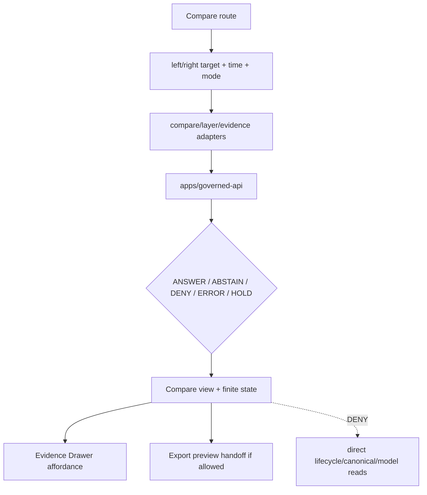

<!-- [KFM_META_BLOCK_V2]
doc_id: kfm://app/explorer-web/src/features/compare/readme
title: Explorer Web Compare Feature README
type: app-readme
version: v0.2
status: draft
owners: OWNER_TBD — Apps steward · UI steward · Map steward · Governed API steward · Policy steward · Docs steward
created: 2026-06-16
updated: 2026-07-09
policy_label: public
related:
  - ../README.md
  - ../../README.md
  - ../../adapters/README.md
  - ../../../README.md
  - ../../../../README.md
  - ../../../../governed-api/README.md
  - ../../../../../README.md
  - ../../../../../SECURITY.md
  - ../../../../../docs/architecture/ui/COMPARE_AND_EXPORT.md
  - ../../../../../docs/adr/ADR-0005-apps-explorer-web-is-the-canonical-map-first-shell.md
  - ../../../../../docs/adr/ADR-0025-public-client-never-reads-canonical-internal-stores.md
  - ../../../../../packages/ui/README.md
  - ../../../../../packages/maplibre/README.md
  - ../../../../../packages/cesium/README.md
  - ../../../../../policy/access/README.md
  - ../../../../../policy/decision/README.md
  - ../../../../../release/README.md
  - ../../../../../data/README.md
  - ../../../../../tools/validators/README.md
  - ../../../../../tools/watchers/README.md
tags: [kfm, apps, explorer-web, compare, feature, map-first, release-state, provenance, finite-outcomes, trust-membrane, no-direct-data-root, derivative-carrier]
notes:
  - "v0.2 updates the uploaded Compare feature README into a current repo-aware feature contract."
  - "apps/explorer-web/src/features/compare/README.md, apps/explorer-web/src/features/README.md, apps/explorer-web/src/adapters/README.md, apps/explorer-web/src/README.md, and apps/explorer-web/README.md were verified through the GitHub app in this update. Feature implementation files, route wiring, mode inventory, tests, fixtures, API envelopes, package scripts, export handoff, runtime behavior, and deployment behavior remain NEEDS VERIFICATION."
  - "Compare is a derivative public-safe carrier for seeing differences; it must not originate evidence, bypass policy, publish, approve export, collapse time semantics, remove redaction, or read lifecycle/canonical stores directly."
  - "Claim-bearing compare state must come through governed API envelopes, released or bounded-safe layer artifacts, EvidenceBundle-derived payloads, explicit time semantics, and finite outcomes."
[/KFM_META_BLOCK_V2] -->

<a id="top"></a>

<div align="center">

# Explorer Web Compare Feature

`apps/explorer-web/src/features/compare/`

**Compare feature boundary for showing governed differences across layers, time, versions, candidates, and released states without becoming source truth, policy authority, export authority, or publication authority.**


[Purpose](#1-purpose) · [Current evidence](#2-current-repo-evidence) · [Repo fit](#3-repo-fit) · [Boundary](#4-authority-boundary) · [Inputs](#6-inputs) · [Exclusions](#7-exclusions) · [Compare modes](#8-compare-mode-map) · [Definition of done](#15-definition-of-done)

</div>

---

> [!IMPORTANT]
> **Status:** draft / current README surface confirmed / implementation behavior `NEEDS VERIFICATION`  
> **Owners:** `OWNER_TBD` — Apps steward · UI steward · Map steward · Governed API steward · Policy steward · Docs steward  
> **Path:** `apps/explorer-web/src/features/compare/README.md`  
> **Responsibility root:** `apps/` — deployable application surfaces  
> **Truth posture:** CONFIRMED README path and parent Explorer Web feature/adapter/source/app READMEs / PROPOSED Compare feature contract / UNKNOWN implementation files, route wiring, mode inventory, tests, fixtures, API envelopes, package scripts, export handoff, runtime behavior, and deployment behavior

> [!CAUTION]
> Compare must not turn visual differences into unsupported claims. It may display governed differences, but each comparison should preserve provenance, release state, source role, time semantics, sensitivity/rights posture, citations, finite outcomes, and EvidenceBundle affordances where claim-bearing detail is shown.

---

## Quick jump

- [1. Purpose](#1-purpose)
- [2. Current repo evidence](#2-current-repo-evidence)
- [3. Repo fit](#3-repo-fit)
- [4. Authority boundary](#4-authority-boundary)
- [5. Default posture](#5-default-posture)
- [6. Inputs](#6-inputs)
- [7. Exclusions](#7-exclusions)
- [8. Compare mode map](#8-compare-mode-map)
- [9. Diagram](#9-diagram)
- [10. Compare obligations](#10-compare-obligations)
- [11. Compare route contract](#11-compare-route-contract)
- [12. Inspection path](#12-inspection-path)
- [13. Validation expectations](#13-validation-expectations)
- [14. Safe change pattern](#14-safe-change-pattern)
- [15. Definition of done](#15-definition-of-done)
- [16. Open verification items](#16-open-verification-items)

---

## 1. Purpose

`apps/explorer-web/src/features/compare/` is the proposed source boundary for the Explorer Web Compare feature.

Compare helps public/semi-public users see governed differences between released or otherwise bounded-safe spatial states. It may eventually support comparing:

- two released layers;
- a layer across valid-time or transaction-time windows;
- released versus candidate state where policy permits;
- generalized versus more detailed public-safe forms;
- two versions of a manifest, style, route story, or evidence-backed map state;
- export-ready selections before an export workflow.

Compare is a derivative carrier. It displays differences already admitted, validated, reviewed, released, generalized, or policy-bounded elsewhere. It does not create evidence, admit sources, make policy decisions, publish, approve export, or convert visual difference into claim truth.

[Back to top](#top)

---

## 2. Current repo evidence

| Surface | Status | What it proves | What it does **not** prove |
|---|---|---|---|
| `apps/explorer-web/src/features/compare/README.md` | **CONFIRMED README** | This README exists and has been updated to v0.2. | Compare implementation files, route wiring, mode inventory, tests, fixtures, API envelopes, package scripts, export handoff, runtime behavior, or deployment behavior. |
| `apps/explorer-web/src/features/README.md` | **CONFIRMED parent features README** | The parent feature boundary exists and defines feature modules as UI composition surfaces that must not treat map features, tiles, local files, model text, or lifecycle data as claim truth. | That feature modules, route inventory, tests, fixtures, or runtime wiring exist. |
| `apps/explorer-web/src/adapters/README.md` | **CONFIRMED adapter README** | The adapter boundary exists and denies direct lifecycle/canonical/model-output reads. | That governed API adapters, renderer adapters, or compare adapters are implemented. |
| `apps/explorer-web/src/README.md` | **CONFIRMED parent source README** | The Explorer Web source tree denies direct lifecycle/canonical/model reads and requires governed API envelopes for claim-bearing UI. | That routes, adapters, renderer wiring, or tests are implemented. |
| `apps/explorer-web/README.md` | **CONFIRMED parent app README** | The Explorer Web app lane is a map-first public/semi-public shell that must use governed API envelopes and avoid direct lifecycle/canonical/internal-store reads. | That app routes, clients, adapters, tests, or deployment exist. |
| Uploaded Compare Markdown | **CONFIRMED source text for this update** | Provided the base Compare feature contract updated here. | Does not prove live implementation. |
| Implementation beyond README | **NEEDS VERIFICATION** | Checkable by repo scan, route inventory, fixtures, tests, package scripts, API envelopes, and runtime evidence. | Not claimed by this README. |

[Back to top](#top)

---

## 3. Repo fit

| Concern | Owning root | Expected relationship |
|---|---|---|
| Compare feature source | `apps/explorer-web/src/features/compare/` | App-local Compare feature modules, if implemented and tested. |
| Feature boundary | `apps/explorer-web/src/features/` | Parent feature/root contract. |
| Adapter boundary | `apps/explorer-web/src/adapters/` | Governed API, layer, evidence, map, export, and diagnostics adapters. |
| Explorer Web source tree | `apps/explorer-web/src/` | Parent source-layout boundary. |
| Explorer Web app | `apps/explorer-web/` | Map-first public/semi-public shell. |
| Governed API | `apps/governed-api/` | Trust membrane and normal claim-bearing data path. |
| Shared UI components | `packages/ui/` | Reusable compare widgets, badges, layouts, and controls when shared. |
| Renderer wrappers | `packages/maplibre/`, `packages/cesium/` | Renderer behavior stays behind adapter/wrapper boundaries. |
| Policy gates | `policy/` | Access, sensitivity, rights, export, telemetry, and decision policy. |
| Release authority | `release/` | Release manifests, correction, supersession, rollback control. |
| Lifecycle artifacts | `data/` | Receipts, proofs, catalog, triplets, and published artifacts. |
| Security posture | `SECURITY.md`, `docs/security/` | Secrets, diagnostics, exposure, and safe-output posture. |

[Back to top](#top)

---

## 4. Authority boundary

Compare is a UI feature. It renders governed differences and finite states; it does not own the records, policy, release, evidence, lifecycle, schema, contract, source, renderer, or export authority behind those differences.

```text
apps/explorer-web/src/features/compare/ = app-local Compare feature
apps/explorer-web/src/features/         = feature boundary
apps/explorer-web/src/adapters/         = adapter boundary
apps/explorer-web/src/                  = Explorer Web implementation source
apps/explorer-web/                      = map-first public/semi-public shell
apps/governed-api/                      = trust membrane and normal data path
packages/ui/                            = shared UI primitives
packages/maplibre/                      = renderer wrapper
packages/cesium/                        = optional gated renderer wrapper
policy/                                 = finite policy decisions
schemas/                                = machine-readable shape
contracts/                              = object meaning
data/                                   = lifecycle artifacts, receipts, proofs, registries
release/                                = publication, correction, rollback authority
```

Safe interpretation:

- **CONFIRMED:** this README surface and parent Explorer Web feature/adapter/source/app READMEs exist.
- **PROPOSED:** Compare modules may live here when they preserve governed API, evidence, provenance, time, release, policy, redaction, export, and public-boundary constraints.
- **NEEDS VERIFICATION:** Compare modules, route wiring, mode inventory, adapter dependencies, fixtures, tests, package scripts, governed API compare envelopes, export handoff, runtime behavior, and deployment behavior.
- **DENY:** using Compare as source truth, evidence originator, policy authority, release authority, export authority, lifecycle store, direct canonical/internal store client, schema/contract home, direct model-output surface, renderer authority, or public-data shortcut.

[Back to top](#top)

---

## 5. Default posture

Compare should fail safe and display bounded finite states rather than guessing.

A compare view should not render claim-bearing difference content when any of these are unresolved:

- left/right target identity;
- target release or candidate state;
- valid-time, observed-time, retrieval-time, release-time, or correction-time semantics;
- governed API envelope and response validation;
- source-role and provenance context;
- EvidenceRef or EvidenceBundle support for claim-bearing detail;
- sensitivity, rights, redaction, or generalization obligations;
- citation validation;
- rollback/correction or supersession status where relevant;
- export policy, export citation, and export redaction support when handoff is present.

[Back to top](#top)

---

## 6. Inputs

| Input family | Examples | Required posture |
|---|---|---|
| Left/right targets | layer id, version id, manifest ref, time slice, candidate ref | Governed references only. |
| Time context | valid time, observed time, retrieval time, release time, correction time | Explicit and labeled. |
| API envelope | compare response, finite outcome, validation result, reason code | Runtime-validated before render. |
| Provenance context | source role, lineage summary, release manifest, proof refs | Preserved in UI. |
| Evidence context | EvidenceRef, EvidenceBundle-derived detail, citation state | Required for claim-bearing differences. |
| Policy context | sensitivity, rights, redaction, generalization, audience | Preserved in compare state. |
| Release/correction context | release ref, supersession ref, rollback state, correction notice | Preserved when relevant to differences. |
| Display context | map viewport, selected feature, diff mode, legend, metric | Never treated as truth by itself. |
| Export handoff context | selected layers, bounds, citation bundle, redaction state, rights posture | Required before export-preview behavior. |

[Back to top](#top)

---

## 7. Exclusions

| Does not belong here | Correct home |
|---|---|
| Governed API implementation | `apps/governed-api/` |
| Shared reusable UI primitives | `packages/ui/` |
| Renderer wrapper authority | `packages/maplibre/`, `packages/cesium/` |
| Compare/export architecture doctrine | `docs/architecture/ui/COMPARE_AND_EXPORT.md` |
| Policy bundles or policy decisions | `policy/` |
| Schemas and contracts | `schemas/contracts/v1/`, `contracts/` |
| Lifecycle artifacts, receipts, proofs, catalog, triplets | `data/` |
| Release manifests, rollback cards, correction notices | `release/` |
| Export execution | `apps/explorer-web/src/features/export/` or governed export path, if accepted |
| Source acquisition | `connectors/` |
| Direct model runtime behavior | `runtime/` behind governed API only |
| Secrets, credentials, tokens, private keys, signing material | secret manager / deployment environment, not Compare source or examples |
| Direct RAW / WORK / QUARANTINE / PROCESSED / CATALOG / TRIPLET / PUBLISHED reads | governed API, released artifacts, layer manifests, and bounded public-safe envelopes only |
| Public-sensitive exports, exact sensitive locations, living-person/DNA details, or source-restricted records | denied unless separately governed and public-safe |

[Back to top](#top)

---

## 8. Compare mode map

Exact modules remain `NEEDS VERIFICATION`. Candidate compare modes should be introduced only with fixtures, route inventory, governed API envelopes, and tests.

| Candidate mode | Purpose | Required support | Status |
|---|---|---|---|
| `layer-to-layer` | Compare two released or bounded-safe layers. | Manifest refs, release state, legends, citations. | PROPOSED |
| `time-slice` | Compare one layer across time. | Explicit time semantics and stable target identity. | PROPOSED |
| `version-to-version` | Compare versions of a layer or manifest. | Version ids, supersession/correction status. | PROPOSED |
| `candidate-to-release` | Compare candidate and released state. | Review/release state and policy gate. | PROPOSED |
| `generalized-to-public` | Compare generalized/public-safe forms. | Redaction/generalization receipts. | PROPOSED |
| `export-preview` | Compare selected output before export. | Citation, redaction, rights, release, and export checks. | PROPOSED |
| `rollback-preview` | Compare current released state against rollback target. | Release manifest, rollback card, correction state, review posture. | PROPOSED |

> [!WARNING]
> Candidate modes are not implementation proof. Do not document a mode as runnable until files, tests, fixtures, route inventory, and governed API envelopes confirm it.

[Back to top](#top)

---

## 9. Diagram



[Back to top](#top)

---

## 10. Compare obligations

| Obligation | Example effect |
|---|---|
| `governed_api_only` | Compare data comes through governed API envelopes. |
| `provenance_required` | Left/right targets show source role, lineage, release state, and proof refs. |
| `time_semantics_required` | Time labels distinguish valid, observed, retrieval, release, and correction time. |
| `finite_states_required` | Compare renders answer, abstain, deny, error, hold, restricted, loading, and empty states. |
| `evidence_required` | Claim-bearing differences link to EvidenceBundle-derived detail. |
| `redaction_preserved` | Redacted/generalized detail is not re-expanded by compare views. |
| `safe_export_handoff` | Export preview preserves citation, redaction, rights, and release constraints. |
| `no_authority_fork` | Compare does not redefine policy, schema, contract, evidence, release, export, or source logic. |
| `no_data_root_shortcut` | Compare does not read lifecycle data roots, canonical/internal stores, local source files, or model output as claim sources. |
| `local_parity_preferred` | Compare fixtures/tests should be runnable locally and in CI with the same inputs where practical. |

[Back to top](#top)

---

## 11. Compare route contract

Every Compare route, panel, hook, or state machine should document or encode:

- compare mode;
- left/right target reference type;
- required time semantics;
- governed API envelope or adapter dependency;
- expected finite outcomes;
- evidence/citation display behavior;
- sensitivity, rights, redaction, release, correction, and supersession behavior;
- loading, empty, deny, abstain, error, hold, and restricted states;
- direct data-root denial posture;
- export handoff behavior, if any;
- tests and fixtures proving trust-membrane behavior.

[Back to top](#top)

---

## 12. Inspection path

Compare implementation files, route wiring, tests, fixtures, API envelopes, package scripts, and export handoff remain `NEEDS VERIFICATION`.

```bash
find apps/explorer-web/src/features/compare -maxdepth 5 -type f | sort
find apps/explorer-web/src apps/governed-api packages/ui packages/maplibre tests fixtures -maxdepth 6 -type f 2>/dev/null | grep -Ei 'compare|diff|version|time|release|manifest|evidence|export|governed' | sort
find data/raw data/work data/quarantine data/processed data/catalog data/triplets data/published -maxdepth 2 -type f 2>/dev/null | sort
```

[Back to top](#top)

---

## 13. Validation expectations

Useful validation for Compare should cover:

- no Compare module imports or reads lifecycle data roots directly;
- missing left/right target returns `HOLD` or safe error;
- malformed compare envelope returns safe error or abstain state;
- `ABSTAIN`, `DENY`, `ERROR`, `HOLD`, and `RESTRICT` states render without unsupported claims;
- time labels are explicit and not collapsed;
- release, source-role, sensitivity, rights, citation, and proof state are preserved;
- Evidence Drawer handoff preserves EvidenceRef/EvidenceBundle handles;
- export preview cannot bypass export policy or release checks;
- compare output does not expose secrets, exact sensitive locations, source-restricted records, private data, or direct model output;
- candidate-to-release and rollback-preview modes are denied or held unless policy/review/release support is explicit.

[Back to top](#top)

---

## 14. Safe change pattern

For Compare feature changes:

1. Add or update route inventory and compare-mode contract.
2. Add fixtures for each finite state and each supported compare mode.
3. Test lifecycle-data denial and governed API-only behavior.
4. Preserve provenance, time, release, rights, sensitivity, redaction, and citation fields through UI state.
5. Verify candidate, rollback, correction, and export modes cannot bypass policy or release checks.
6. Update this README, parent `features/README.md`, adapter README, source README, and parent app README when public behavior changes.

[Back to top](#top)

---

## 15. Definition of done

- [ ] Owners are confirmed and `OWNER_TBD` is replaced.
- [ ] Compare file inventory and route ownership are documented.
- [ ] Supported compare modes and target reference types are defined.
- [ ] Governed API and adapter dependencies are explicit.
- [ ] Provenance, time, release, rights, sensitivity, redaction, citation, and evidence fields survive comparison.
- [ ] Direct lifecycle-data import/read checks are covered.
- [ ] Finite states cover answer, abstain, deny, error, hold, restricted, loading, and empty cases.
- [ ] Export preview/handoff is tested for safe output if present.
- [ ] Candidate/release and rollback-preview behavior is policy-gated and tested if present.
- [ ] Parent feature/adapter/source/app READMEs are updated when behavior changes.

[Back to top](#top)

---

## 16. Open verification items

| Item | Why it matters |
|---|---|
| Confirm Compare implementation files beyond README | Prevents overclaiming feature maturity. |
| Confirm route and mode inventory | Required for UI boundary review. |
| Confirm governed API compare envelope | Required for trust membrane enforcement. |
| Confirm adapter dependency shape | Required so Compare does not bypass governed adapters. |
| Confirm fixtures and tests | Required before implementation claims. |
| Confirm provenance/time-state rendering | Prevents misleading visual comparisons. |
| Confirm Evidence Drawer handoff | Required for claim-bearing diff details. |
| Confirm export-preview handoff | Required before public download workflows. |
| Confirm direct data-root denial | Required for public client trust membrane. |
| Confirm rollback/correction/supersession behavior | Required before rollback-preview or version comparison claims. |
| Confirm package scripts beyond TODO | Required before build/test claims. |

<details>
<summary>Appendix A — no-loss preservation note</summary>

The uploaded README replaced a greenfield Compare stub with a bounded Compare feature contract without claiming Compare routes, panels, hooks, adapters, fixtures, tests, package scripts, governed API envelopes, or export handoff are implemented. This v0.2 update preserves that structure while adding current repo evidence, parent feature/adapter/source/app linkage, stronger direct-data-root denial language, rollback/correction/supersession posture, safe-output posture, local-parity expectations, and expanded verification items.

</details>

## Status summary

`apps/explorer-web/src/features/compare/` should contain Compare feature modules only after mode inventory, route contracts, governed API envelopes, fixtures, tests, and export handoff behavior are verified.

It must preserve the trust membrane and derivative-carrier posture: Compare can show governed differences, but it must not originate evidence, bypass policy, publish, approve export, read lifecycle/canonical stores directly, collapse time semantics, remove redaction, or convert visual differences into unsupported claims.

<p align="right"><a href="#top">Back to top</a></p>
