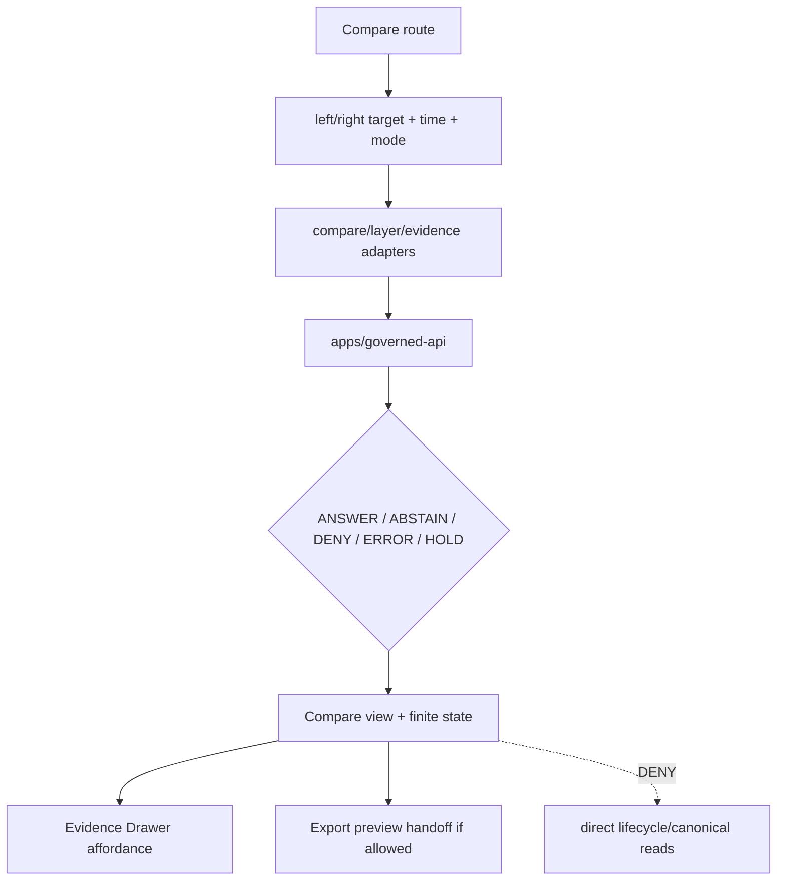

<!-- [KFM_META_BLOCK_V2]
doc_id: kfm://app/explorer-web/src/features/compare/readme
title: Explorer Web Compare Feature README
type: app-readme
version: v0.1
status: draft
owners: OWNER_TBD — Apps steward · UI steward · Map steward · Governed API steward · Policy steward · Docs steward
created: 2026-06-16
updated: 2026-06-16
policy_label: public
related:
  - ../README.md
  - ../../README.md
  - ../../adapters/README.md
  - ../../../README.md
  - ../../../../README.md
  - ../../../../governed-api/README.md
  - ../../../../../docs/architecture/ui/COMPARE_AND_EXPORT.md
  - ../../../../../docs/adr/ADR-0005-apps-explorer-web-is-the-canonical-map-first-shell.md
  - ../../../../../docs/adr/ADR-0025-public-client-never-reads-canonical-internal-stores.md
  - ../../../../../packages/ui/README.md
  - ../../../../../packages/maplibre/README.md
  - ../../../../../policy/access/README.md
  - ../../../../../policy/decision/README.md
  - ../../../../../release/README.md
  - ../../../../../data/README.md
tags: [kfm, apps, explorer-web, compare, feature, map-first, release-state, provenance, finite-outcomes, trust-membrane]
notes:
  - "Replaces the greenfield compare feature stub with a governed feature README."
  - "Compare is a derivative public-safe carrier for seeing differences; it must not originate evidence, bypass policy, publish, or read lifecycle/canonical stores directly."
  - "Feature implementation files, route wiring, tests, fixtures, API envelopes, and package scripts remain NEEDS VERIFICATION."
[/KFM_META_BLOCK_V2] -->

<a id="top"></a>

<div align="center">

# Explorer Web Compare Feature

`apps/explorer-web/src/features/compare/`

**Compare feature boundary for showing governed differences across layers, time, versions, candidates, and released states without becoming source truth, policy authority, or publication authority.**


[Purpose](#1-purpose) · [Repo fit](#2-repo-fit) · [Boundary](#3-authority-boundary) · [Inputs](#5-inputs) · [Exclusions](#6-exclusions) · [Compare modes](#7-compare-mode-map) · [Definition of done](#14-definition-of-done)

</div>

---

> [!IMPORTANT]
> **Status:** draft / `NEEDS VERIFICATION`  
> **Owners:** `OWNER_TBD` — Apps steward · UI steward · Map steward · Governed API steward · Policy steward · Docs steward  
> **Path:** `apps/explorer-web/src/features/compare/README.md`  
> **Responsibility root:** `apps/` — deployable application surfaces  
> **Truth posture:** CONFIRMED README path / PROPOSED Compare feature contract / UNKNOWN implementation files, route wiring, tests, fixtures, and runtime behavior

> [!CAUTION]
> Compare must not turn visual differences into unsupported claims. It may display governed differences, but each comparison should preserve provenance, release state, source role, time semantics, sensitivity/rights posture, citations, finite outcomes, and EvidenceBundle affordances where claim-bearing detail is shown.

---

## Quick jump

- [1. Purpose](#1-purpose)
- [2. Repo fit](#2-repo-fit)
- [3. Authority boundary](#3-authority-boundary)
- [4. Default posture](#4-default-posture)
- [5. Inputs](#5-inputs)
- [6. Exclusions](#6-exclusions)
- [7. Compare mode map](#7-compare-mode-map)
- [8. Diagram](#8-diagram)
- [9. Compare obligations](#9-compare-obligations)
- [10. Compare route contract](#10-compare-route-contract)
- [11. Inspection path](#11-inspection-path)
- [12. Validation expectations](#12-validation-expectations)
- [13. Safe change pattern](#13-safe-change-pattern)
- [14. Definition of done](#14-definition-of-done)
- [15. Open verification items](#15-open-verification-items)

---

## 1. Purpose

`apps/explorer-web/src/features/compare/` is the proposed source boundary for the Explorer Web Compare feature.

Compare helps public/semi-public users see governed differences between released or otherwise bounded-safe spatial states. It may eventually support comparing:

- two released layers;
- a layer across valid-time or transaction-time windows;
- released versus candidate state where policy permits;
- generalized versus more detailed public-safe forms;
- two versions of a manifest, style, route story, or evidence-backed map state;
- export-ready selections before an export workflow.

Compare is a derivative carrier. It displays differences already admitted, validated, reviewed, released, generalized, or policy-bounded elsewhere. It does not create evidence, admit sources, make policy decisions, publish, or approve export.

[Back to top](#top)

---

## 2. Repo fit

| Concern | Owning root | Expected relationship |
|---|---|---|
| Compare feature source | `apps/explorer-web/src/features/compare/` | App-local Compare feature modules, if implemented and tested |
| Feature boundary | `apps/explorer-web/src/features/` | Parent feature/root contract |
| Adapter boundary | `apps/explorer-web/src/adapters/` | Governed API, layer, evidence, map, export, and diagnostics adapters |
| Explorer Web app | `apps/explorer-web/` | Map-first public/semi-public shell |
| Governed API | `apps/governed-api/` | Trust membrane and normal data path |
| Shared UI components | `packages/ui/` | Reusable compare widgets, badges, layouts, and controls when shared |
| Renderer wrappers | `packages/maplibre/`, `packages/cesium/` | Renderer behavior stays behind adapter/wrapper boundaries |
| Policy gates | `policy/` | Access, sensitivity, rights, export, telemetry, and decision policy |
| Release authority | `release/` | Release manifests, correction, supersession, rollback control |
| Lifecycle artifacts | `data/` | Receipts, proofs, catalog, triplets, and published artifacts |

## 3. Authority boundary

Compare is a UI feature. It renders governed differences and finite states; it does not own the records, policy, release, evidence, lifecycle, schema, contract, source, renderer, or export authority behind those differences.

```text
apps/explorer-web/src/features/compare/ = app-local Compare feature
apps/explorer-web/src/features/         = feature boundary
apps/explorer-web/src/adapters/         = adapter boundary
apps/governed-api/                      = trust membrane and normal data path
packages/ui/                            = shared UI primitives
packages/maplibre/                      = renderer wrapper
policy/                                 = finite policy decisions
schemas/                                = machine-readable shape
contracts/                              = object meaning
data/                                   = lifecycle artifacts, receipts, proofs, registries
release/                                = publication, correction, rollback authority
```

## 4. Default posture

Compare should fail safe and display bounded finite states rather than guessing.

A compare view should not render claim-bearing difference content when any of these are unresolved:

- left/right target identity;
- target release or candidate state;
- valid-time or transaction-time semantics;
- governed API envelope and response validation;
- source-role and provenance context;
- EvidenceRef or EvidenceBundle support for claim-bearing detail;
- sensitivity, rights, redaction, or generalization obligations;
- citation validation;
- rollback/correction or supersession status where relevant.

## 5. Inputs

| Input family | Examples | Required posture |
|---|---|---|
| Left/right targets | layer id, version id, manifest ref, time slice, candidate ref | Governed references only |
| Time context | valid time, observed time, retrieval time, release time, correction time | Explicit and labeled |
| API envelope | compare response, finite outcome, validation result, reason code | Runtime-validated before render |
| Provenance context | source role, lineage summary, release manifest, proof refs | Preserved in UI |
| Evidence context | EvidenceRef, EvidenceBundle-derived detail, citation state | Required for claim-bearing differences |
| Policy context | sensitivity, rights, redaction, generalization, audience | Preserved in compare state |
| Display context | map viewport, selected feature, diff mode, legend, metric | Never treated as truth by itself |

## 6. Exclusions

| Does not belong here | Correct home |
|---|---|
| Governed API implementation | `apps/governed-api/` |
| Shared reusable UI primitives | `packages/ui/` |
| Renderer wrapper authority | `packages/maplibre/`, `packages/cesium/` |
| Compare/export architecture doctrine | `docs/architecture/ui/COMPARE_AND_EXPORT.md` |
| Policy bundles or policy decisions | `policy/` |
| Schemas and contracts | `schemas/contracts/v1/`, `contracts/` |
| Lifecycle artifacts, receipts, proofs, catalog, triplets | `data/` |
| Release manifests, rollback cards, correction notices | `release/` |
| Export execution | `apps/explorer-web/src/features/export/` or governed export path, if accepted |
| Source acquisition | `connectors/` |
| Direct model runtime behavior | `runtime/` behind governed API only |
| Secrets, credentials, tokens, private keys | Secret manager / deployment environment |

## 7. Compare mode map

Exact modules remain `NEEDS VERIFICATION`. Candidate compare modes should be introduced only with fixtures, route inventory, and tests.

| Candidate mode | Purpose | Required support | Status |
|---|---|---|---|
| `layer-to-layer` | Compare two released or bounded-safe layers | Manifest refs, release state, legends, citations | PROPOSED |
| `time-slice` | Compare one layer across time | Explicit valid-time semantics | PROPOSED |
| `version-to-version` | Compare versions of a layer or manifest | Version ids, supersession/correction status | PROPOSED |
| `candidate-to-release` | Compare candidate and released state | Review/release state and policy gate | PROPOSED |
| `generalized-to-public` | Compare generalized/public-safe forms | Redaction/generalization receipts | PROPOSED |
| `export-preview` | Compare selected output before export | Citation, redaction, rights, release checks | PROPOSED |

> [!WARNING]
> Candidate modes are not implementation proof. Do not document a mode as runnable until files, tests, fixtures, and governed API envelopes confirm it.

## 8. Diagram



## 9. Compare obligations

| Obligation | Example effect |
|---|---|
| `governed_api_only` | Compare data comes through governed API envelopes |
| `provenance_required` | Left/right targets show source role, lineage, release state, and proof refs |
| `time_semantics_required` | Time labels distinguish valid, observed, retrieval, release, and correction time |
| `finite_states_required` | Compare renders answer, abstain, deny, error, hold, restricted, loading, and empty states |
| `evidence_required` | Claim-bearing differences link to EvidenceBundle-derived detail |
| `redaction_preserved` | Redacted/generalized detail is not re-expanded by compare views |
| `safe_export_handoff` | Export preview preserves citation, redaction, rights, and release constraints |
| `no_authority_fork` | Compare does not redefine policy, schema, contract, evidence, release, or source logic |

## 10. Compare route contract

Every Compare route, panel, hook, or state machine should document or encode:

- compare mode;
- left/right target reference type;
- required time semantics;
- governed API envelope or adapter dependency;
- expected finite outcomes;
- evidence/citation display behavior;
- sensitivity, rights, redaction, release, and correction behavior;
- loading, empty, deny, abstain, error, hold, and restricted states;
- export handoff behavior, if any;
- tests and fixtures proving trust-membrane behavior.

## 11. Inspection path

Compare implementation files, route wiring, tests, fixtures, API envelopes, package scripts, and export handoff remain `NEEDS VERIFICATION`.

```bash
find apps/explorer-web/src/features/compare -maxdepth 5 -type f | sort
find apps/explorer-web/src apps/governed-api packages/ui packages/maplibre tests fixtures -maxdepth 6 -type f 2>/dev/null | grep -Ei 'compare|diff|version|time|release|manifest|evidence|export|governed' | sort
find data/raw data/work data/quarantine data/processed data/catalog data/triplets data/published -maxdepth 2 -type f 2>/dev/null | sort
```

## 12. Validation expectations

Useful validation for Compare should cover:

- no Compare module imports or reads lifecycle data roots directly;
- missing left/right target returns `HOLD` or safe error;
- malformed compare envelope returns safe error or abstain state;
- `ABSTAIN`, `DENY`, `ERROR`, `HOLD`, and `RESTRICT` states render without unsupported claims;
- time labels are explicit and not collapsed;
- release, source-role, sensitivity, rights, citation, and proof state are preserved;
- Evidence Drawer handoff preserves EvidenceRef/EvidenceBundle handles;
- export preview cannot bypass export policy or release checks.

## 13. Safe change pattern

For Compare feature changes:

1. Add or update route inventory and compare-mode contract.
2. Add fixtures for each finite state and each supported compare mode.
3. Test lifecycle-data denial and governed API-only behavior.
4. Preserve provenance, time, release, rights, sensitivity, redaction, and citation fields through UI state.
5. Update this README, parent `features/README.md`, and parent app README when public behavior changes.

## 14. Definition of done

- [ ] Owners are confirmed and `OWNER_TBD` is replaced.
- [ ] Compare file inventory and route ownership are documented.
- [ ] Supported compare modes and target reference types are defined.
- [ ] Governed API and adapter dependencies are explicit.
- [ ] Provenance, time, release, rights, sensitivity, redaction, citation, and evidence fields survive comparison.
- [ ] Direct lifecycle-data import/read checks are covered.
- [ ] Finite states cover answer, abstain, deny, error, hold, restricted, loading, and empty cases.
- [ ] Export preview/handoff is tested for safe output if present.

## 15. Open verification items

| Item | Why it matters |
|---|---|
| Confirm Compare implementation files beyond README | Prevents overclaiming feature maturity |
| Confirm route and mode inventory | Required for UI boundary review |
| Confirm governed API compare envelope | Required for trust membrane enforcement |
| Confirm fixtures and tests | Required before implementation claims |
| Confirm provenance/time-state rendering | Prevents misleading visual comparisons |
| Confirm Evidence Drawer handoff | Required for claim-bearing diff details |
| Confirm export-preview handoff | Required before public download workflows |
| Confirm package scripts beyond TODO | Required before build/test claims |

<details>
<summary>Appendix A — no-loss preservation note</summary>

The previous README was a greenfield stub. This replacement adds a bounded Compare feature contract without claiming Compare routes, panels, hooks, adapters, fixtures, tests, package scripts, governed API envelopes, or export handoff are implemented.

</details>

## Status summary

`apps/explorer-web/src/features/compare/` should contain Compare feature modules only after mode inventory, route contracts, governed API envelopes, fixtures, tests, and export handoff behavior are verified.

It must preserve the trust membrane and derivative-carrier posture: Compare can show governed differences, but it must not originate evidence, bypass policy, publish, read lifecycle/canonical stores directly, collapse time semantics, remove redaction, or convert visual differences into unsupported claims.

<p align="right"><a href="#top">Back to top</a></p>
