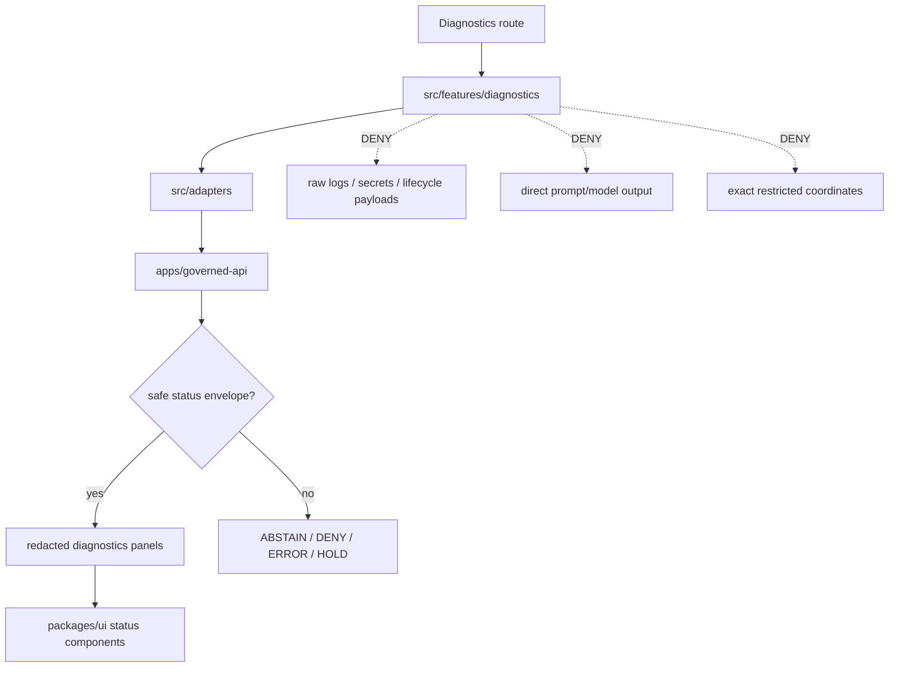

<!-- [KFM_META_BLOCK_V2]
doc_id: kfm://app/explorer-web/src/features/diagnostics/readme
title: Explorer Web Diagnostics Feature README
type: app-readme
version: v0.2
status: draft
owners: OWNER_TBD — Apps steward · UI steward · Map steward · Governed API steward · Policy steward · Docs steward
created: 2026-06-16
updated: 2026-07-09
policy_label: public
related:
  - ../README.md
  - ../../README.md
  - ../../adapters/README.md
  - ../../../README.md
  - ../../../../README.md
  - ../../../../governed-api/README.md
  - ../../../../../README.md
  - ../../../../../SECURITY.md
  - ../../../../../docs/architecture/ui/TELEMETRY.md
  - ../../../../../docs/adr/ADR-0005-apps-explorer-web-is-the-canonical-map-first-shell.md
  - ../../../../../docs/adr/ADR-0025-public-client-never-reads-canonical-internal-stores.md
  - ../../../../../packages/ui/README.md
  - ../../../../../packages/maplibre/README.md
  - ../../../../../packages/cesium/README.md
  - ../../../../../policy/access/README.md
  - ../../../../../policy/decision/README.md
  - ../../../../../release/README.md
  - ../../../../../data/README.md
  - ../../../../../tools/validators/README.md
  - ../../../../../tools/watchers/README.md
tags: [kfm, apps, explorer-web, diagnostics, feature, telemetry, trust-status, finite-outcomes, safe-observability, trust-membrane, no-raw-dump, no-direct-data-root]
notes:
  - "v0.2 updates the uploaded Diagnostics feature README into a current repo-aware feature contract."
  - "apps/explorer-web/src/features/diagnostics/README.md, apps/explorer-web/src/features/README.md, apps/explorer-web/src/adapters/README.md, apps/explorer-web/src/README.md, and apps/explorer-web/README.md were verified through the GitHub app in this update. Feature implementation files, route wiring, diagnostics panels, tests, fixtures, telemetry envelopes, diagnostics payloads, package scripts, runtime integration, accessibility behavior, and deployment behavior remain NEEDS VERIFICATION."
  - "Diagnostics is a safe observability surface; it must not expose secrets, raw evidence, prompts, exact restricted coordinates, model outputs, export contents, lifecycle payloads, canonical/internal stores, full logs, stack dumps, token values, or protected source details."
  - "Telemetry and diagnostics are not EvidenceBundle substitutes. They may inform safe status, health, and finite-state display only when classified, redacted, audience-scoped, and policy-bounded."
[/KFM_META_BLOCK_V2] -->

<a id="top"></a>

<div align="center">

# Explorer Web Diagnostics Feature

`apps/explorer-web/src/features/diagnostics/`

**Diagnostics feature boundary for safe trust/status, route, envelope, layer, renderer, version, and telemetry visibility without exposing protected content or becoming evidence.**


[Purpose](#1-purpose) · [Current evidence](#2-current-repo-evidence) · [Repo fit](#3-repo-fit) · [Boundary](#4-authority-boundary) · [Inputs](#6-inputs) · [Exclusions](#7-exclusions) · [Diagnostics panels](#8-diagnostics-panel-map) · [Definition of done](#15-definition-of-done)

</div>

---

> [!IMPORTANT]
> **Status:** draft / current README surface confirmed / implementation behavior `NEEDS VERIFICATION`  
> **Owners:** `OWNER_TBD` — Apps steward · UI steward · Map steward · Governed API steward · Policy steward · Docs steward  
> **Path:** `apps/explorer-web/src/features/diagnostics/README.md`  
> **Responsibility root:** `apps/` — deployable application surfaces  
> **Truth posture:** CONFIRMED README path and parent Explorer Web feature/adapter/source/app READMEs / PROPOSED Diagnostics feature contract / UNKNOWN implementation files, route wiring, diagnostics panels, tests, fixtures, telemetry envelopes, diagnostics payloads, package scripts, runtime integration, accessibility behavior, and deployment behavior

> [!CAUTION]
> Diagnostics is observability, not evidence, truth, policy, release, or source authority. It may show safe status signals, finite outcomes, envelope health, version metadata, and redacted diagnostics, but it must not leak raw evidence, prompts, secrets, exact restricted coordinates, model outputs, export contents, lifecycle payloads, canonical/internal store details, full logs, stack dumps, token values, or protected source details.

---

## Quick jump

- [1. Purpose](#1-purpose)
- [2. Current repo evidence](#2-current-repo-evidence)
- [3. Repo fit](#3-repo-fit)
- [4. Authority boundary](#4-authority-boundary)
- [5. Default posture](#5-default-posture)
- [6. Inputs](#6-inputs)
- [7. Exclusions](#7-exclusions)
- [8. Diagnostics panel map](#8-diagnostics-panel-map)
- [9. Diagram](#9-diagram)
- [10. Diagnostics obligations](#10-diagnostics-obligations)
- [11. Diagnostics route contract](#11-diagnostics-route-contract)
- [12. Inspection path](#12-inspection-path)
- [13. Validation expectations](#13-validation-expectations)
- [14. Safe change pattern](#14-safe-change-pattern)
- [15. Definition of done](#15-definition-of-done)
- [16. Open verification items](#16-open-verification-items)

---

## 1. Purpose

`apps/explorer-web/src/features/diagnostics/` is the proposed source boundary for the Explorer Web Diagnostics feature.

Diagnostics helps users and stewards understand whether the public/semi-public shell is healthy, bounded, and trustworthy without exposing protected material. It may eventually show:

- application version and build metadata;
- route and panel status;
- governed API envelope status;
- finite outcome counters or summaries;
- layer and tile load health;
- renderer adapter readiness;
- Evidence Drawer availability state without evidence contents;
- Focus Mode finite-outcome health without prompt or model text;
- export readiness state without export contents;
- safe UI telemetry summaries.

Diagnostics should explain what the UI can safely know and why a state is unavailable, denied, held, abstained, or errored. It should never become a side channel around the trust membrane or an EvidenceBundle substitute.

[Back to top](#top)

---

## 2. Current repo evidence

| Surface | Status | What it proves | What it does **not** prove |
|---|---|---|---|
| `apps/explorer-web/src/features/diagnostics/README.md` | **CONFIRMED README** | This README exists and has been updated to v0.2. | Diagnostics implementation files, route wiring, diagnostics panels, tests, fixtures, telemetry envelopes, diagnostics payloads, package scripts, runtime integration, accessibility behavior, or deployment behavior. |
| `apps/explorer-web/src/features/README.md` | **CONFIRMED parent features README** | The parent feature boundary exists and says feature modules must not treat map features, tiles, local files, model text, or lifecycle data as claim truth. | That feature modules, route inventory, tests, fixtures, or runtime wiring exist. |
| `apps/explorer-web/src/adapters/README.md` | **CONFIRMED adapter README** | The adapter boundary exists and denies direct lifecycle/canonical/model-output reads. | That diagnostics adapters or safe telemetry adapters are implemented. |
| `apps/explorer-web/src/README.md` | **CONFIRMED parent source README** | The Explorer Web source tree denies direct lifecycle/canonical/model reads and requires governed API envelopes for claim-bearing UI. | That diagnostics routes, adapters, renderer wiring, or tests are implemented. |
| `apps/explorer-web/README.md` | **CONFIRMED parent app README** | The Explorer Web app lane is a map-first public/semi-public shell that must use governed API envelopes and avoid direct lifecycle/canonical/internal-store reads. | That app routes, clients, diagnostics panels, tests, or deployment exist. |
| Uploaded Diagnostics Markdown | **CONFIRMED source text for this update** | Provided the base Diagnostics feature contract updated here. | Does not prove live implementation. |
| Implementation beyond README | **NEEDS VERIFICATION** | Checkable by repo scan, route inventory, fixtures, tests, package scripts, telemetry/diagnostics envelopes, accessibility checks, and runtime evidence. | Not claimed by this README. |

[Back to top](#top)

---

## 3. Repo fit

| Concern | Owning root | Expected relationship |
|---|---|---|
| Diagnostics feature source | `apps/explorer-web/src/features/diagnostics/` | App-local Diagnostics feature modules, if implemented and tested. |
| Feature boundary | `apps/explorer-web/src/features/` | Parent feature/root contract. |
| Adapter boundary | `apps/explorer-web/src/adapters/` | Governed API, layer, evidence, renderer, export, and diagnostics adapters. |
| Explorer Web source tree | `apps/explorer-web/src/` | Parent source-layout boundary. |
| Explorer Web app | `apps/explorer-web/` | Map-first public/semi-public shell. |
| Governed API | `apps/governed-api/` | Trust membrane and normal claim-bearing data path. |
| Shared UI components | `packages/ui/` | Reusable status cards, badges, panels, and alert primitives when shared. |
| Renderer wrappers | `packages/maplibre/`, `packages/cesium/` | Renderer behavior stays behind adapter/wrapper boundaries. |
| Policy gates | `policy/` | Access, telemetry, sensitivity, rights, and decision policy. |
| Release authority | `release/` | Release manifests, correction, supersession, rollback control. |
| Lifecycle artifacts | `data/` | Receipts, proofs, catalog, triplets, and published artifacts. |
| Security posture | `SECURITY.md`, `docs/security/` | Secrets, diagnostics, incident handling, exposure, and safe-output posture. |

[Back to top](#top)

---

## 4. Authority boundary

Diagnostics is a UI feature. It renders safe status and health signals; it does not own evidence, policy, release, lifecycle, schema, contract, source, renderer, telemetry, or export authority.

```text
apps/explorer-web/src/features/diagnostics/ = app-local Diagnostics feature
apps/explorer-web/src/features/             = feature boundary
apps/explorer-web/src/adapters/             = adapter boundary
apps/explorer-web/src/                      = Explorer Web implementation source
apps/explorer-web/                          = map-first public/semi-public shell
apps/governed-api/                          = trust membrane and normal data path
packages/ui/                                = shared UI primitives
packages/maplibre/                          = renderer wrapper
packages/cesium/                            = optional gated renderer wrapper
policy/                                     = finite policy decisions
schemas/                                    = machine-readable shape
contracts/                                  = object meaning
data/                                       = lifecycle artifacts, receipts, proofs, registries
release/                                    = publication, correction, rollback authority
```

Safe interpretation:

- **CONFIRMED:** this README surface and parent Explorer Web feature/adapter/source/app READMEs exist.
- **PROPOSED:** Diagnostics modules may live here when they preserve safe observability, governed API, telemetry, redaction, finite-state, accessibility, release, and public-boundary constraints.
- **NEEDS VERIFICATION:** Diagnostics modules, route wiring, panel inventory, telemetry/diagnostics envelopes, adapter dependencies, fixtures, tests, package scripts, accessibility behavior, runtime integration, and deployment behavior.
- **DENY:** using Diagnostics as evidence, source truth, policy authority, release authority, telemetry authority, lifecycle store, direct canonical/internal store client, schema/contract home, raw log viewer, direct model-output surface, renderer authority, or public-data shortcut.

[Back to top](#top)

---

## 5. Default posture

Diagnostics should fail safe and redact by default.

A diagnostics panel should not render a status field when any of these are unresolved:

- payload classification;
- telemetry or diagnostics envelope validation;
- safe field allowlist;
- forbidden field denylist;
- policy decision or audience scope;
- sensitivity, rights, or redaction state;
- release or version state;
- route or adapter identity;
- EvidenceRef/EvidenceBundle handle safety;
- export or Focus Mode context safety;
- secret, prompt, model-output, stack-dump, token, coordinate, or restricted-internal leakage review.

[Back to top](#top)

---

## 6. Inputs

| Input family | Examples | Required posture |
|---|---|---|
| App status | build id, app version, route id, feature flag, environment label | Safe, non-secret, non-sensitive. |
| API status | governed API health, envelope family, schema validation outcome, finite outcome | Runtime-validated and redacted. |
| Layer status | layer id, manifest release state, tile load status, freshness badge | Released or bounded-safe metadata only. |
| Renderer status | adapter readiness, tile timing bucket, decode/render error class | No restricted geometry or feature attributes. |
| Evidence status | drawer availability, payload outcome, citation pass/fail count | No evidence contents, citation snippets, or raw EvidenceBundle payloads. |
| Focus status | finite outcome, cancellation, validation status | No prompt text, model output, reasoning, or internal model traces. |
| Export status | request created, blocked, denied, ready, receipt ref | No export contents or reconstructed sensitive detail. |
| Telemetry summary | safe event count, failure category, policy state surfaced | No raw telemetry dumps containing payloads. |
| Security/status context | incident banner, restricted-mode flag, degraded-mode reason | Public-safe reason codes only. |

[Back to top](#top)

---

## 7. Exclusions

| Does not belong here | Correct home |
|---|---|
| Telemetry policy or storage authority | `policy/telemetry/`, governed API, and lifecycle/audit homes if accepted. |
| Governed API implementation | `apps/governed-api/` |
| Shared reusable UI primitives | `packages/ui/` |
| Renderer wrapper authority | `packages/maplibre/`, `packages/cesium/` |
| Policy bundles or policy decisions | `policy/` |
| Schemas and contracts | `schemas/contracts/v1/`, `contracts/` |
| Lifecycle artifacts, receipts, proofs, catalog, triplets | `data/` |
| Release manifests, rollback cards, correction notices | `release/` |
| Raw logs, secrets, tokens, credentials, stack dumps | Secret/log management and incident response paths, not public diagnostics. |
| Direct source acquisition | `connectors/` |
| Direct model runtime behavior | `runtime/` behind governed API only |
| Direct RAW / WORK / QUARANTINE / PROCESSED / CATALOG / TRIPLET / PUBLISHED reads | governed API, released artifacts, layer manifests, and bounded public-safe envelopes only |
| Public-sensitive exports, exact restricted locations, living-person/DNA details, source-restricted records, prompt/model traces | denied unless separately governed and public-safe |

[Back to top](#top)

---

## 8. Diagnostics panel map

Exact modules remain `NEEDS VERIFICATION`. Candidate panels should be introduced only with fixtures, route inventory, allowlists/denylists, and tests.

| Candidate panel | Purpose | Required safeguards | Status |
|---|---|---|---|
| `trust-status` | Show trust membrane and finite outcome health. | No protected payloads. | PROPOSED |
| `route-status` | Show route/panel readiness and safe error states. | Route ids only, no query payloads. | PROPOSED |
| `api-envelope` | Show governed envelope validation summaries. | Redacted status only. | PROPOSED |
| `layer-health` | Show layer/tile load and freshness state. | Released metadata only. | PROPOSED |
| `renderer-health` | Show MapLibre/Cesium adapter readiness. | No restricted coordinates or attributes. | PROPOSED |
| `evidence-health` | Show Evidence Drawer and citation state. | No EvidenceBundle contents. | PROPOSED |
| `focus-health` | Show Focus Mode finite outcomes. | No prompts, model output, reasoning, or traces. | PROPOSED |
| `export-health` | Show export readiness and denial state. | No export contents. | PROPOSED |
| `redaction-health` | Show whether redaction/generalization is active. | No re-expansion or withheld details. | PROPOSED |
| `degraded-mode` | Show safe degraded/maintenance/incident state. | Public-safe reason codes only. | PROPOSED |

> [!WARNING]
> Candidate panel names are not implementation proof. Do not document a panel as runnable until files, tests, fixtures, package scripts, and safe-envelope shapes confirm it.

[Back to top](#top)

---

## 9. Diagram



[Back to top](#top)

---

## 10. Diagnostics obligations

| Obligation | Example effect |
|---|---|
| `safe_observability_only` | Diagnostics shows status, not protected content. |
| `governed_api_only` | Runtime status arrives through governed API or safe local app metadata. |
| `redaction_required` | Raw payloads, prompts, evidence contents, secrets, coordinates, token values, and stack dumps are stripped. |
| `finite_states_required` | Diagnostics distinguishes answer, abstain, deny, error, hold, restricted, loading, and empty states. |
| `telemetry_not_truth` | Telemetry may inform status but never supports claims by itself. |
| `no_raw_dump` | Full logs, stack traces, payload dumps, and token values are never rendered publicly. |
| `release_state_visible` | Version/layer status shows release/freshness state where safe. |
| `accessibility_required` | Diagnostics status is keyboard-readable and screen-reader friendly. |
| `no_data_root_shortcut` | Diagnostics does not read lifecycle data roots, canonical/internal stores, local source files, or model output as status truth. |
| `local_parity_preferred` | Diagnostics fixtures/tests should be runnable locally and in CI with the same inputs where practical. |

[Back to top](#top)

---

## 11. Diagnostics route contract

Every Diagnostics route, panel, hook, or adapter should document or encode:

- panel purpose;
- input envelope or metadata family;
- safe field allowlist;
- forbidden field denylist;
- finite outcomes;
- redaction behavior;
- sensitivity, rights, release, and audience behavior;
- loading, empty, deny, abstain, error, hold, and restricted states;
- direct data-root denial posture;
- accessibility behavior;
- tests and fixtures proving no protected content is rendered.

[Back to top](#top)

---

## 12. Inspection path

Diagnostics implementation files, route wiring, tests, fixtures, telemetry envelopes, diagnostics payloads, package scripts, accessibility behavior, and runtime integration remain `NEEDS VERIFICATION`.

```bash
find apps/explorer-web/src/features/diagnostics -maxdepth 5 -type f | sort
find apps/explorer-web/src apps/governed-api packages/ui packages/maplibre tests fixtures policy docs/architecture/ui -maxdepth 6 -type f 2>/dev/null | grep -Ei 'diagnostic|telemetry|status|health|envelope|finite|redact|secret|prompt|evidence|layer|renderer' | sort
find data/raw data/work data/quarantine data/processed data/catalog data/triplets data/published -maxdepth 2 -type f 2>/dev/null | sort
```

[Back to top](#top)

---

## 13. Validation expectations

Useful validation for Diagnostics should cover:

- no Diagnostics module imports or reads lifecycle data roots directly;
- diagnostics panels render safe field allowlists only;
- raw evidence, prompts, secrets, exact restricted coordinates, model outputs, export contents, raw logs, stack dumps, token values, source-restricted records, and private data are denied or redacted;
- malformed diagnostics or telemetry envelopes render safe error or abstain states;
- finite outcomes render without unsupported claims;
- telemetry is never used as EvidenceBundle substitute;
- layer/renderer health does not expose protected geometry or feature attributes;
- diagnostics output remains accessible and non-blocking;
- degraded-mode and incident-status displays use public-safe reason codes only.

[Back to top](#top)

---

## 14. Safe change pattern

For Diagnostics feature changes:

1. Define a safe field allowlist before adding any panel.
2. Define a forbidden field denylist for payloads, logs, prompts, model output, coordinates, stack traces, secrets, and internal store detail.
3. Add fixtures for safe, malformed, forbidden, empty, loading, deny, abstain, hold, restricted, and error states.
4. Test that forbidden fields are not rendered.
5. Keep telemetry as observability, not evidence.
6. Verify accessibility before treating diagnostics as user-facing support.
7. Update this README, parent `features/README.md`, adapter README, source README, and parent app README when public diagnostics behavior changes.

[Back to top](#top)

---

## 15. Definition of done

- [ ] Owners are confirmed and `OWNER_TBD` is replaced.
- [ ] Diagnostics file inventory and route ownership are documented.
- [ ] Safe field allowlists and forbidden field denylists are defined.
- [ ] Governed API, telemetry, and adapter dependencies are explicit.
- [ ] Direct lifecycle-data import/read checks are covered.
- [ ] Forbidden content redaction tests are present.
- [ ] Finite states cover answer, abstain, deny, error, hold, restricted, loading, and empty cases.
- [ ] Accessibility posture is documented or tested.
- [ ] Parent feature/adapter/source/app READMEs are updated when diagnostics behavior changes.

[Back to top](#top)

---

## 16. Open verification items

| Item | Why it matters |
|---|---|
| Confirm Diagnostics implementation files beyond README | Prevents overclaiming feature maturity. |
| Confirm diagnostics route inventory | Required for public/semi-public UI review. |
| Confirm safe diagnostics envelope | Required for trust membrane enforcement. |
| Confirm fixtures and tests | Required before implementation claims. |
| Confirm telemetry integration | Required before observability claims. |
| Confirm redaction/denylist behavior | Prevents leakage of secrets or protected data. |
| Confirm package scripts beyond TODO | Required before build/test claims. |
| Confirm accessibility behavior | Required for useful status reporting. |
| Confirm direct data-root denial | Required for public client trust membrane. |
| Confirm no prompt/model-output leakage | Required for governed-AI boundary. |
| Confirm degraded-mode and incident-status public-safe reason codes | Required before status/incident UI claims. |

<details>
<summary>Appendix A — no-loss preservation note</summary>

The uploaded README replaced a greenfield Diagnostics feature stub with a bounded Diagnostics feature contract without claiming diagnostics routes, panels, hooks, adapters, fixtures, tests, package scripts, telemetry envelopes, or runtime behavior are implemented. This v0.2 update preserves that structure while adding current repo evidence, parent feature/adapter/source/app linkage, stronger no-raw-dump and no-direct-data-root language, safe-output posture, accessibility posture, local-parity expectations, degraded-mode/incident-status constraints, and expanded verification items.

</details>

## Status summary

`apps/explorer-web/src/features/diagnostics/` should contain Diagnostics feature modules only after safe field allowlists, forbidden field denylists, route contracts, telemetry/diagnostics envelopes, fixtures, tests, and accessibility behavior are verified.

It must preserve the trust membrane and safe-observability posture: Diagnostics can show status, health, finite outcomes, and redacted operational signals, but it must not expose protected content, become evidence, bypass policy, publish, read lifecycle/canonical stores directly, or leak secrets/model output/raw evidence through a public UI.

<p align="right"><a href="#top">Back to top</a></p>
