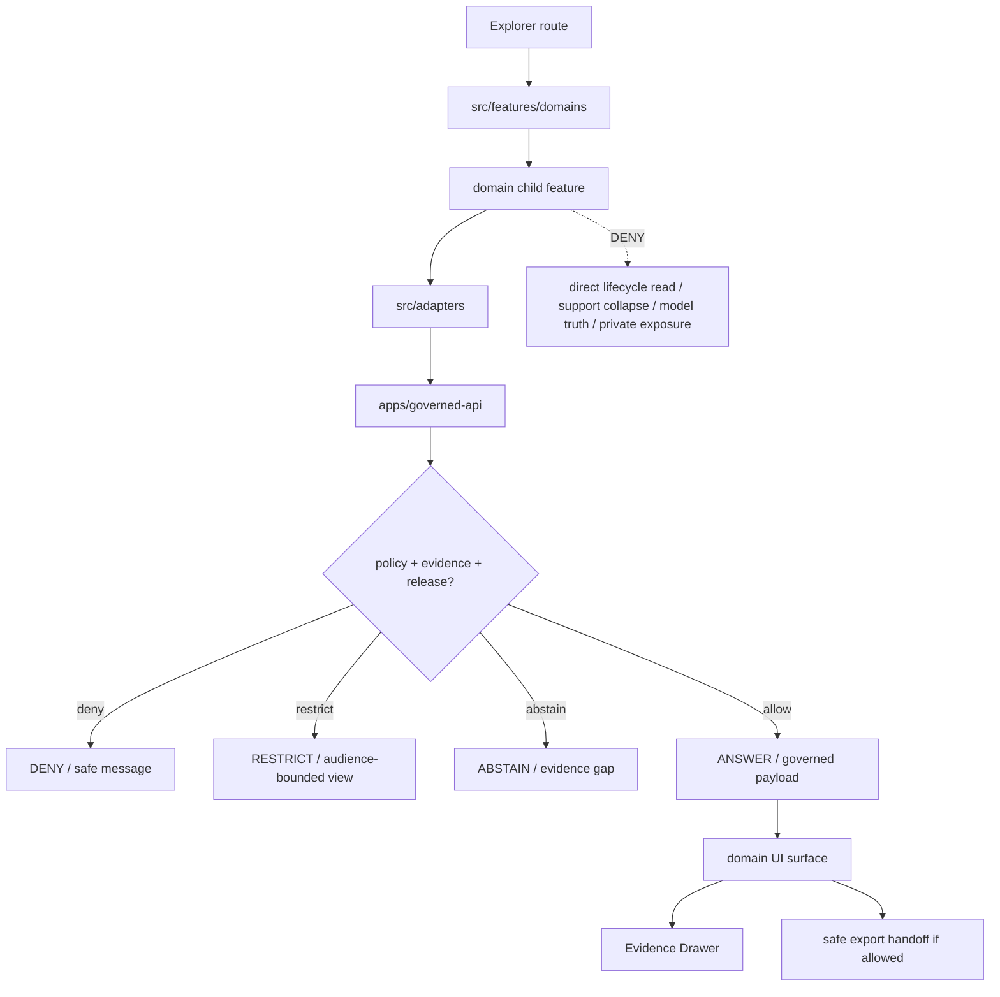

<!-- [KFM_META_BLOCK_V2]
doc_id: kfm://app/explorer-web/src/features/domains/readme
title: Explorer Web Domain Features README
type: app-readme
version: v0.1
status: draft
owners: OWNER_TBD — Apps steward · UI steward · Domain stewards · Governed API steward · Policy steward · Evidence steward · Docs steward
created: 2026-07-09
updated: 2026-07-09
policy_label: public
related:
  - ../README.md
  - ../../adapters/README.md
  - ../../../README.md
  - ../../../../README.md
  - ../../../../governed-api/README.md
  - ../../../../../docs/doctrine/directory-rules.md
  - ../../../../../docs/adr/ADR-0005-apps-explorer-web-is-the-canonical-map-first-shell.md
  - ../../../../../docs/adr/ADR-0025-public-client-never-reads-canonical-internal-stores.md
  - ../../../../../docs/domains/
  - ../../../../../contracts/domains/
  - ../../../../../schemas/contracts/v1/domains/
  - ../../../../../policy/domains/
  - ../../../../../packages/domains/
  - ../../../../../packages/ui/README.md
  - ../../../../../packages/maplibre/README.md
  - ../../../../../policy/access/README.md
  - ../../../../../policy/decision/README.md
  - ../../../../../release/README.md
  - ../../../../../data/README.md
tags: [kfm, apps, explorer-web, features, domains, domain-features, governed-api, trust-membrane, evidence-drawer, focus-mode, support-type]
notes:
  - "Domain feature modules may compose governed domain envelopes into Explorer Web surfaces, but they must not become domain doctrine, source truth, schema authority, contract authority, policy authority, lifecycle storage, release authority, or direct model-output truth."
  - "This README is a boundary contract for app-local domain feature folders below apps/explorer-web/src/features/domains/."
  - "Individual domain feature implementation files, route inventory, tests, fixtures, governed API envelopes, ReleaseManifests, RollbackCards, and package scripts remain NEEDS VERIFICATION unless separately verified."
[/KFM_META_BLOCK_V2] -->

<a id="top"></a>

<div align="center">

# Explorer Web Domain Features

`apps/explorer-web/src/features/domains/`

**App-local domain feature boundary for Explorer Web: public/semi-public domain views that render governed API envelopes, Evidence Drawer handoffs, Focus Mode outcomes, map-layer context, compare/export surfaces, and safe denial/restriction states without becoming truth, policy, release, schema, contract, source, or lifecycle authority.**


[Purpose](#1-purpose) · [Repo fit](#2-repo-fit) · [Boundary](#3-authority-boundary) · [Inputs](#5-inputs) · [Exclusions](#6-exclusions) · [Domain map](#7-domain-feature-map) · [Definition of done](#14-definition-of-done)

</div>

---

> [!IMPORTANT]
> **Status:** draft / `NEEDS VERIFICATION`  
> **Owners:** `OWNER_TBD` — Apps steward · UI steward · Domain stewards · Governed API steward · Policy steward · Evidence steward · Docs steward  
> **Path:** `apps/explorer-web/src/features/domains/README.md`  
> **Responsibility root:** `apps/` — deployable application surfaces  
> **Directory Rules basis:** app-local domain feature composition belongs under the deployable app root, with domain names appearing as segments inside the responsibility root rather than as repo-root folders.  
> **Truth posture:** CONFIRMED target parent feature README exists / CONFIRMED Soil child README exists / PROPOSED domain-feature boundary contract / UNKNOWN specific domain route files, tests, fixtures, runtime behavior, and public release maturity

> [!CAUTION]
> Domain feature code must not treat map features, tile attributes, local files, model text, lifecycle data, package helpers, or visual summaries as domain truth. Claim-bearing surfaces should render only governed API envelopes, finite outcomes, EvidenceBundle-derived payloads, released or bounded-safe layer artifacts, and policy-preserved redaction/generalization states.

---

## Quick jump

- [1. Purpose](#1-purpose)
- [2. Repo fit](#2-repo-fit)
- [3. Authority boundary](#3-authority-boundary)
- [4. Default posture](#4-default-posture)
- [5. Inputs](#5-inputs)
- [6. Exclusions](#6-exclusions)
- [7. Domain feature map](#7-domain-feature-map)
- [8. Diagram](#8-diagram)
- [9. Domain UI obligations](#9-domain-ui-obligations)
- [10. Per-domain feature contract](#10-per-domain-feature-contract)
- [11. Inspection path](#11-inspection-path)
- [12. Validation expectations](#12-validation-expectations)
- [13. Safe change pattern](#13-safe-change-pattern)
- [14. Definition of done](#14-definition-of-done)
- [15. Open verification items](#15-open-verification-items)

---

## 1. Purpose

`apps/explorer-web/src/features/domains/` is the proposed app-local boundary for Explorer Web domain-specific feature folders.

It may eventually contain one child folder per domain feature family, such as Soil, Hydrology, Habitat, Fauna, Flora, Agriculture, Geology, Atmosphere/Air, Hazards, Roads/Rail/Trade, Settlements/Infrastructure, Archaeology, People/DNA/Land, Frontier Matrix, Planetary/3D, or other accepted domain lanes.

Domain feature folders may compose governed inputs into user-facing workflows such as:

- domain-scoped map panels, popups, cards, legends, and route sections;
- Evidence Drawer handoffs using evidence-derived payloads;
- Focus Mode finite-outcome responses;
- domain compare/export handoffs;
- stale, corrected, superseded, rollback, restricted, denied, held, abstained, loading, empty, and error states;
- domain-specific trust badges, support-type labels, source-role labels, and policy-state messaging.

This README does not prove that any domain route, child feature folder, panel, hook, adapter, fixture, test, package script, governed API envelope, release artifact, or runtime behavior is implemented.

[Back to top](#top)

---

## 2. Repo fit

| Concern | Owning root | Expected relationship |
|---|---|---|
| Domain feature boundary | `apps/explorer-web/src/features/domains/` | App-local domain feature folders, if implemented and tested |
| Parent feature boundary | `apps/explorer-web/src/features/` | Defines feature modules as UI composition surfaces |
| Adapter boundary | `apps/explorer-web/src/adapters/` | Governed API, renderer, evidence, layer, export, and diagnostics adapters |
| Explorer Web app | `apps/explorer-web/` | Map-first public/semi-public shell |
| Governed API | `apps/governed-api/` | Trust membrane and normal public/semi-public data path |
| Human domain doctrine | `docs/domains/<domain>/` | Scope and doctrine for each domain; feature folders do not replace it |
| Domain package helpers | `packages/domains/<domain>/` | Reusable deterministic helper code; not a public truth path |
| Domain policy | `policy/domains/<domain>/` | Domain admissibility and exposure decisions |
| Domain contracts | `contracts/domains/<domain>/` | Object meaning authority, if present and accepted |
| Domain schemas | `schemas/contracts/v1/domains/<domain>/` | Machine shape authority, if present and accepted |
| Shared UI components | `packages/ui/` | Reusable cards, badges, drawers, panels, legends, and controls |
| Renderer wrappers | `packages/maplibre/` | Renderer behavior stays behind adapter/wrapper boundaries |
| Lifecycle artifacts | `data/` | Receipts, proofs, registry, catalog, triplets, and published artifacts |
| Release authority | `release/` | Publication, correction, supersession, rollback control |

## 3. Authority boundary

Domain feature folders are UI composition surfaces. They render governed results; they do not own source truth, evidence truth, policy decisions, release decisions, lifecycle artifacts, schemas, contracts, renderer authority, source acquisition, source registry decisions, or model output.

```text
apps/explorer-web/src/features/domains/ = app-local domain feature boundary
apps/explorer-web/src/features/         = parent feature and route boundary
apps/explorer-web/src/adapters/         = app-local boundary adapters
apps/explorer-web/                      = map-first public/semi-public shell
apps/governed-api/                      = trust membrane and normal data path
docs/domains/<domain>/                  = human-facing domain doctrine
packages/domains/<domain>/              = shared helpers only, not truth or policy
policy/domains/<domain>/                = domain policy lane
contracts/domains/<domain>/             = domain object meaning, if present and accepted
schemas/contracts/v1/domains/<domain>/  = domain machine shape, if present and accepted
packages/ui/                            = shared UI primitives
packages/maplibre/                      = renderer wrapper
policy/                                 = finite policy decisions
data/                                   = lifecycle artifacts, receipts, proofs, registries
release/                                = publication, correction, rollback authority
```

## 4. Default posture

Domain feature modules should fail safe and show finite bounded UI states rather than guessing.

A domain feature should not render claim-bearing content when any of these are missing or malformed:

- governed API envelope;
- route contract;
- domain slug and object-family identity;
- finite outcome;
- EvidenceRef or EvidenceBundle-derived payload;
- citation validation;
- source role, support type, provenance, source version, and known limitations;
- sensitivity, rights, consent, release, review, redaction, or generalization state;
- layer manifest, tile proof, raster/vector artifact metadata, or publication state;
- valid time, observed time, source time, retrieval time, release time, correction time, freshness, or stale-state posture;
- export citation/redaction support;
- safe diagnostics context.

## 5. Inputs

| Input family | Examples | Required posture |
|---|---|---|
| Route state | Domain tab, selected layer, selected feature id, drawer panel, focus query | Explicit finite states |
| API envelope | answer, restrict, abstain, deny, error, hold, decision envelope, evidence payload | Runtime-validated before render |
| Evidence payload | EvidenceRef, EvidenceBundle summary, citations, proof visibility | Required for claim-bearing feature detail |
| Layer state | layer manifest, trust badges, legend, valid time, selected feature id | Released or bounded-safe source only |
| Domain state | domain slug, object family, support type, source role, source refs | Preserved through feature composition |
| Policy state | sensitivity, rights, consent, audience, redaction/generalization obligations | Preserved in feature state |
| Release state | release manifest, correction notice, rollback card, stale/superseded state | Visible where material |
| Export state | selected public-safe layer, bounds, citations, disclaimer, output mode | Governed export only |

## 6. Exclusions

| Does not belong here | Correct home |
|---|---|
| Domain doctrine and scope | `docs/domains/<domain>/` |
| Domain contracts and schemas | `contracts/domains/<domain>/`, `schemas/contracts/v1/domains/<domain>/` |
| Domain policy bundles or exposure decisions | `policy/domains/<domain>/`, `policy/sensitivity/`, `policy/rights/`, `policy/` |
| Domain helper code | `packages/domains/<domain>/` |
| Domain source descriptors | `data/registry/sources/<domain>/` |
| Source acquisition and external connectors | `connectors/`, `data/registry/`, source catalog lanes |
| Executable ingest/normalize/emit pipelines | `pipelines/domains/<domain>/` |
| Declarative source/AOI/query specs | `pipeline_specs/<domain>/` |
| Governed API implementation | `apps/governed-api/` |
| Adapter logic shared across feature families | `apps/explorer-web/src/adapters/` |
| Shared reusable UI primitives | `packages/ui/` |
| Renderer wrapper authority | `packages/maplibre/` |
| Lifecycle artifacts, receipts, proofs, catalog, triplets | `data/` |
| Release manifests, rollback cards, correction notices | `release/` |
| Direct model runtime behavior | `runtime/` behind governed API only |
| Secrets, credentials, tokens, private keys | Secret manager / deployment environment |

## 7. Domain feature map

Child folders remain `NEEDS VERIFICATION` unless confirmed by current repo evidence. Candidate domain feature folders should be introduced only with route inventory, fixtures, tests, and domain-specific README boundaries.

| Candidate folder | Domain surface | Required safeguard | Status |
|---|---|---|---|
| `soil/` | Soil survey, components, horizons, moisture, gridded derivatives | Support-type preservation and private-field safeguards | CONFIRMED README child in current branch |
| `hydrology/` | Streams, gauges, watersheds, floodplain context | Time/source role/flood-risk disclaimers | PROPOSED |
| `habitat/` | Habitat patches, suitability, restoration context | Species/location sensitivity inheritance | PROPOSED |
| `fauna/` | Species occurrence and habitat context | Rare-species geoprivacy and public-safe generalization | PROPOSED |
| `flora/` | Plant occurrence and vegetation context | Rare plant controls and occurrence redaction | PROPOSED |
| `agriculture/` | Crop, field, conservation, production context | Farm/operator privacy and aggregation checks | PROPOSED |
| `geology/` | Geologic units, resources, borehole/resource context | Public-safe geometry and source-role labels | PROPOSED |
| `hazards/` | Hazard context and historical impacts | Not emergency alerting; source and freshness labels | PROPOSED |
| `settlements-infrastructure/` | Built environment and infrastructure context | Critical infrastructure and access controls | PROPOSED |
| `people-dna-land/` | People, genealogy, DNA, land ownership context | Living-person, consent, DNA, and sovereignty restrictions | PROPOSED |

> [!WARNING]
> Candidate folder names are not implementation proof. Do not document a domain feature as runnable until files, route wiring, tests, fixtures, package scripts, governed API envelopes, support-type labels, policy decisions, and release artifacts confirm it.

## 8. Diagram



## 9. Domain UI obligations

| Obligation | Example effect |
|---|---|
| `governed_api_only` | Domain feature state comes through governed API envelopes |
| `domain_slug_required` | Feature state preserves the owning domain and object family |
| `support_type_required` | Survey, station, occurrence, raster, model, interpretation, and change evidence remain distinct |
| `source_role_preserved` | Authority, observation, model, interpretation, aggregate, candidate, and synthetic roles remain distinct |
| `time_basis_visible` | Valid/retrieval/release/correction times and stale states remain visible where material |
| `privacy_rights_preserved` | Consent, rights, policy labels, source limitations, and redaction/generalization obligations are never dropped |
| `cross_lane_truth_preserved` | A feature may cite other domains; it does not become their truth owner |
| `evidence_required` | Claim-bearing details link to EvidenceBundle-derived payloads |
| `finite_states_required` | Views render answer, restrict, abstain, deny, error, hold, loading, stale, and empty states safely |
| `safe_export_required` | Export handoff preserves citations, support type, disclaimers, rights, release, correction, and rollback constraints |
| `no_authority_fork` | Feature code does not redefine domain policy, schema, contract, source, release, EvidenceBundle, or support-type authority |

## 10. Per-domain feature contract

Every long-lived child domain feature should document or encode:

- feature purpose and route ownership;
- domain slug, object families, and source families consumed;
- governed API envelope or adapter dependency;
- support type, source role, units, QC, freshness, and valid-time behavior;
- cross-lane ownership and sensitivity inheritance behavior;
- privacy, consent, rights, source limitation, redaction, and aggregation behavior;
- release, correction, supersession, stale-state, and rollback behavior;
- expected finite outcomes;
- evidence/citation display behavior;
- loading, empty, deny, abstain, error, hold, restricted, stale, corrected, and rollback states;
- export behavior, if any;
- tests and fixtures proving trust-membrane, support-type, privacy, and cross-lane ownership boundaries.

## 11. Inspection path

Domain feature implementation files, route wiring, tests, fixtures, governed API envelopes, support-type labels, redaction/aggregation receipts, release manifests, rollback cards, stale-state rules, package scripts, and export handoff remain `NEEDS VERIFICATION`.

```bash
find apps/explorer-web/src/features/domains -maxdepth 4 -type f | sort
find apps/explorer-web/src apps/governed-api docs/domains packages/domains policy/domains contracts/domains schemas/contracts/v1/domains packages/ui packages/maplibre tests fixtures -maxdepth 6 -type f 2>/dev/null | grep -Ei 'domains|domain|evidence|release|rollback|governed|policy|support|redaction|aggregation|focus|drawer|export' | sort
find data/raw data/work data/quarantine data/processed data/catalog data/triplets data/published data/receipts data/proofs data/registry -maxdepth 3 -type f 2>/dev/null | sort
```

## 12. Validation expectations

Useful validation for this boundary should cover:

- no domain feature imports or reads lifecycle data roots directly;
- claim-bearing domain views consume governed API envelopes only;
- malformed domain envelopes render safe error or abstain states;
- domain slug, object family, support type, source role, source refs, policy labels, and evidence refs are preserved;
- cross-lane relation context does not transfer truth ownership to the feature;
- sensitive domain states deny, restrict, generalize, aggregate, or hold by default where required;
- denial messages do not leak protected locations, private details, transform hints, or source-access clues;
- Evidence Drawer handoff preserves EvidenceRef/EvidenceBundle handles without exposing protected content;
- Focus Mode renders finite outcomes and never direct model output as domain truth;
- export handoff requires citation, support type, disclaimer, rights, release, correction, and rollback support.

## 13. Safe change pattern

For domain feature changes:

1. Confirm the owning domain and responsibility root before adding files.
2. Add or update route inventory and per-domain feature contract.
3. Add fixtures for allowed, restricted, denied, held, abstained, malformed, loading, stale, corrected, rolled-back, and empty states.
4. Test lifecycle-data denial and governed API-only behavior.
5. Preserve support type, source role, time/QC, privacy, review, release, rollback, rights, and citation fields through UI state.
6. Update this README, the child domain README, parent `features/README.md`, domain docs/package docs, and parent app README when public behavior changes.

## 14. Definition of done

- [ ] Owners are confirmed and `OWNER_TBD` is replaced.
- [ ] Child domain feature inventory and route ownership are documented.
- [ ] Governed API and adapter dependencies are explicit.
- [ ] Domain slug, object family, support type, source-role, time/QC, privacy, release, stale-state, and rollback states are represented in fixtures.
- [ ] Support-type and cross-lane anti-collapse states are tested.
- [ ] Direct lifecycle-data import/read checks are covered.
- [ ] Sensitive-domain denial/restriction/generalization states are tested where applicable.
- [ ] Source ids, native ids, evidence refs, and policy labels survive feature composition.
- [ ] Finite states cover answer, restrict, abstain, deny, error, hold, loading, stale, corrected, rollback, and empty cases.
- [ ] Export, Focus Mode, and Evidence Drawer handoffs are tested for safe output if present.

## 15. Open verification items

| Item | Why it matters |
|---|---|
| Confirm domain child folder inventory beyond Soil | Prevents overclaiming feature maturity |
| Confirm route inventory | Required for public/semi-public UI boundary review |
| Confirm governed API domain envelopes | Required for trust membrane enforcement |
| Confirm domain docs expansion beyond placeholders | Required before doctrine maturity claims |
| Confirm support-type fixtures | Required before claim-bearing domain UI claims |
| Confirm privacy/rights/source-limitation fixtures | Required before public release claims |
| Confirm release, correction, stale-state, and rollback states | Required before public map-layer claims |
| Confirm Focus Mode and Evidence Drawer behavior | Required before claim-bearing UI claims |
| Confirm export handoff | Required before public download workflows |
| Confirm package scripts beyond TODO | Required before build/test claims |

<details>
<summary>Appendix A — no-loss preservation note</summary>

This README creates a parent boundary for domain feature folders and does not replace any child domain README. It preserves the current Soil child README as a narrower domain-specific contract and keeps all implementation maturity claims bounded to `NEEDS VERIFICATION` unless confirmed by current repo evidence.

</details>

## Status summary

`apps/explorer-web/src/features/domains/` should contain app-local domain feature modules only after route contracts, governed API envelopes, support-type posture, fixtures, tests, Evidence Drawer behavior, Focus Mode behavior, release/stale/rollback handling, and export handoff are verified.

It must preserve the KFM trust membrane: domain feature code may render governed public-safe domain context, but it must not collapse support types, become source truth, policy authority, schema authority, contract authority, release authority, lifecycle storage, or a direct model-output surface.

<p align="right"><a href="#top">Back to top</a></p>
