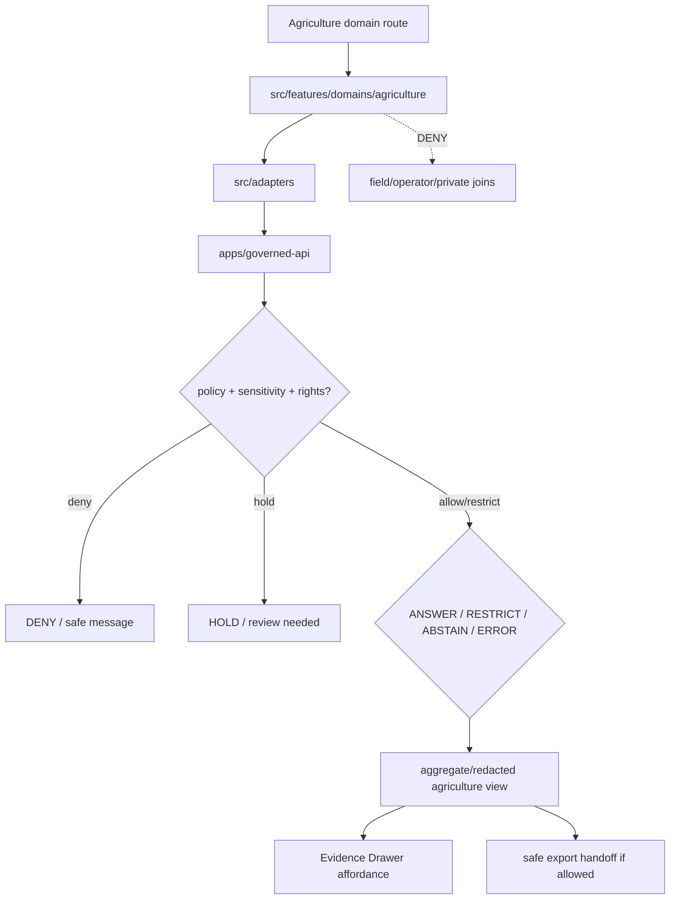

<!-- [KFM_META_BLOCK_V2]
doc_id: kfm://app/explorer-web/src/features/domains/agriculture/readme
title: Explorer Web Agriculture Domain Feature README
type: app-readme
version: v0.1
status: draft
owners: OWNER_TBD — Apps steward · UI steward · Agriculture steward · Governed API steward · Policy steward · Docs steward
created: 2026-06-16
updated: 2026-06-16
policy_label: public
related:
  - ../../README.md
  - ../../../README.md
  - ../../../adapters/README.md
  - ../../../../README.md
  - ../../../../../README.md
  - ../../../../../governed-api/README.md
  - ../../../../../../docs/domains/agriculture/README.md
  - ../../../../../../docs/domains/agriculture/SENSITIVITY.md
  - ../../../../../../policy/domains/agriculture/README.md
  - ../../../../../../packages/ui/README.md
  - ../../../../../../packages/maplibre/README.md
  - ../../../../../../policy/access/README.md
  - ../../../../../../policy/decision/README.md
  - ../../../../../../release/README.md
  - ../../../../../../data/README.md
tags: [kfm, apps, explorer-web, domains, agriculture, feature, aggregate-only, redaction, evidence-drawer, focus-mode, map-first]
notes:
  - "Replaces the greenfield agriculture domain feature stub with a governed feature README."
  - "Agriculture UI features may compose governed agriculture envelopes into public/semi-public views, but they must not become domain doctrine, policy authority, source truth, lifecycle storage, release authority, or field/operator exposure path."
  - "Feature implementation files, route wiring, tests, fixtures, governed API envelopes, aggregation receipts, redaction receipts, and package scripts remain NEEDS VERIFICATION."
[/KFM_META_BLOCK_V2] -->

<a id="top"></a>

<div align="center">

# Explorer Web Agriculture Domain Feature

`apps/explorer-web/src/features/domains/agriculture/`

**Domain-specific Explorer Web feature boundary for public-safe agriculture views: crop, field-candidate, rotation, yield, irrigation, suitability, conservation, stress, and agriculture-economy surfaces rendered only through governed envelopes.**


[Purpose](#1-purpose) · [Repo fit](#2-repo-fit) · [Boundary](#3-authority-boundary) · [Inputs](#5-inputs) · [Exclusions](#6-exclusions) · [Feature map](#7-agriculture-feature-map) · [Definition of done](#14-definition-of-done)

</div>

---

> [!IMPORTANT]
> **Status:** draft / `NEEDS VERIFICATION`  
> **Owners:** `OWNER_TBD` — Apps steward · UI steward · Agriculture steward · Governed API steward · Policy steward · Docs steward  
> **Path:** `apps/explorer-web/src/features/domains/agriculture/README.md`  
> **Responsibility root:** `apps/` — deployable application surfaces  
> **Truth posture:** CONFIRMED README path / CONFIRMED agriculture doctrine and sensitivity docs / PROPOSED domain-feature contract / UNKNOWN implementation files, route wiring, tests, fixtures, and runtime behavior

> [!CAUTION]
> Agriculture is rights- and privacy-sensitive. Public UI must fail closed for field-level, operator-resolved, parcel-adjacent, private-join, NASS-confidential, or quarantine-adjacent material unless a reviewed policy path explicitly allows a transformed, aggregated, generalized, redacted, restricted, or delayed output.

---

## Quick jump

- [1. Purpose](#1-purpose)
- [2. Repo fit](#2-repo-fit)
- [3. Authority boundary](#3-authority-boundary)
- [4. Default posture](#4-default-posture)
- [5. Inputs](#5-inputs)
- [6. Exclusions](#6-exclusions)
- [7. Agriculture feature map](#7-agriculture-feature-map)
- [8. Diagram](#8-diagram)
- [9. Agriculture UI obligations](#9-agriculture-ui-obligations)
- [10. Per-view contract](#10-per-view-contract)
- [11. Inspection path](#11-inspection-path)
- [12. Validation expectations](#12-validation-expectations)
- [13. Safe change pattern](#13-safe-change-pattern)
- [14. Definition of done](#14-definition-of-done)
- [15. Open verification items](#15-open-verification-items)

---

## 1. Purpose

`apps/explorer-web/src/features/domains/agriculture/` is the proposed app-local feature boundary for Agriculture-specific Explorer Web surfaces.

It may eventually hold route modules, panels, view models, hooks, and feature orchestration for public-safe agriculture experiences such as:

- aggregate crop and rotation maps;
- suitability and conservation overlays;
- irrigation and water-use context views that defer hydrology truth to the hydrology lane;
- stress and remote-sensing summaries;
- agricultural-economy indicators at approved aggregation levels;
- Evidence Drawer handoffs for agriculture claims;
- Focus Mode bounded agriculture prompts and finite outcomes;
- compare/export handoffs that preserve aggregation, redaction, rights, and release state.

This directory is not proof that any route, panel, hook, map layer, adapter, test, fixture, package script, or governed API envelope is implemented.

[Back to top](#top)

---

## 2. Repo fit

| Concern | Owning root | Expected relationship |
|---|---|---|
| Agriculture domain feature source | `apps/explorer-web/src/features/domains/agriculture/` | App-local Agriculture UI feature modules, if implemented and tested |
| Feature boundary | `apps/explorer-web/src/features/` | Parent feature/root contract |
| Adapter boundary | `apps/explorer-web/src/adapters/` | Governed API, evidence, layer, map, export, and diagnostics adapters |
| Explorer Web app | `apps/explorer-web/` | Map-first public/semi-public shell |
| Governed API | `apps/governed-api/` | Trust membrane and normal data path |
| Agriculture doctrine | `docs/domains/agriculture/` | Domain scope, language, sensitivity, policy intent, and backlog |
| Agriculture policy | `policy/domains/agriculture/` | Agriculture admissibility and exposure policy, if executable wiring is accepted |
| Shared UI components | `packages/ui/` | Reusable cards, badges, drawers, panels, and legends when shared |
| Renderer wrappers | `packages/maplibre/`, `packages/cesium/` | Renderer behavior stays behind adapter/wrapper boundaries |
| Release authority | `release/` | Publication, correction, rollback control |
| Lifecycle artifacts | `data/` | Receipts, proofs, registry, catalog, triplets, and published artifacts |

## 3. Authority boundary

This feature renders governed Agriculture UI. It does not own Agriculture doctrine, source admission, source rights, policy decisions, schemas, contracts, lifecycle artifacts, release decisions, evidence truth, renderer authority, or AI output.

```text
apps/explorer-web/src/features/domains/agriculture/ = app-local Agriculture UI feature
apps/explorer-web/src/features/                     = feature boundary
apps/explorer-web/src/adapters/                     = adapter boundary
apps/governed-api/                                  = trust membrane and normal data path
docs/domains/agriculture/                           = Agriculture doctrine and policy intent
policy/domains/agriculture/                         = Agriculture policy lane
packages/ui/                                        = shared UI primitives
policy/                                             = finite policy decisions
data/                                               = lifecycle artifacts, receipts, proofs, registries
release/                                            = publication, correction, rollback authority
```

## 4. Default posture

Agriculture feature modules should fail safe, aggregate by default, and preserve the most restrictive applicable posture.

A view should not render claim-bearing agriculture content when any of these are unresolved:

- governed API envelope and response validation;
- object family or agriculture domain slug;
- source role and provenance;
- rights or license posture;
- sensitivity tier;
- field/operator exposure risk;
- parcel-adjacent or private join risk;
- cross-lane People, Land, Soil, Hydrology, Habitat, Infrastructure, or Economy join posture;
- EvidenceRef or EvidenceBundle support;
- aggregation, generalization, redaction, or delay receipt;
- release state and rollback target;
- required steward review.

## 5. Inputs

| Input family | Examples | Required posture |
|---|---|---|
| Agriculture view state | aggregate crop, rotation, yield, suitability, irrigation, conservation, stress, economy | Explicit finite states |
| API envelope | answer, abstain, deny, error, hold, restricted, decision envelope, evidence payload | Runtime-validated before render |
| Layer state | layer manifest, source role, legend, trust badges, valid time, selected feature id | Released or bounded-safe source only |
| Evidence state | EvidenceRef, EvidenceBundle summary, citation validation, proof visibility | Required for claim-bearing detail |
| Sensitivity state | T0 aggregate, T1 field-candidate, T4 operator/private join, quarantine-adjacent | Most restrictive posture wins |
| Transform state | AggregationReceipt, RedactionReceipt, generalization, suppression, delayed release | Required when reducing exposure risk |
| Cross-lane state | soil, hydrology, habitat, people/land, infrastructure joins | Inherits strictest lane posture |
| Export state | selected layers, bounds, citations, aggregation/redaction profile, output mode | Governed export only |

## 6. Exclusions

| Does not belong here | Correct home |
|---|---|
| Agriculture doctrine and scope | `docs/domains/agriculture/` |
| Agriculture policy bundles or policy decisions | `policy/domains/agriculture/`, `policy/` |
| Governed API implementation | `apps/governed-api/` |
| Adapter logic shared across feature families | `apps/explorer-web/src/adapters/` |
| Shared reusable UI primitives | `packages/ui/` |
| Renderer wrapper authority | `packages/maplibre/`, `packages/cesium/` |
| Agriculture schemas and contracts | `schemas/contracts/v1/domains/agriculture/`, `contracts/domains/agriculture/` |
| Lifecycle artifacts, receipts, proofs, catalog, triplets | `data/` |
| Release manifests, rollback cards, correction notices | `release/` |
| Source acquisition or source registry records | `connectors/`, `data/registry/`, source catalog lanes |
| Field/operator exact public exposure | Denied unless reviewed transformed output is explicitly allowed |
| Direct model runtime behavior | `runtime/` behind governed API only |
| Secrets, credentials, tokens, private keys | Secret manager / deployment environment |

## 7. Agriculture feature map

Exact modules remain `NEEDS VERIFICATION`. Candidate views should be introduced only with route inventory, fixtures, and tests.

| Candidate view | Purpose | Required safeguard | Status |
|---|---|---|---|
| `aggregate-crops` | Show crop observations at approved aggregation level | County/HUC/grid threshold and release state | PROPOSED |
| `rotation-summary` | Show rotation or temporal crop-pattern summaries | Explicit valid-time and source-role badges | PROPOSED |
| `yield-summary` | Show aggregate yield or production indicators | No field/operator inference | PROPOSED |
| `irrigation-context` | Show public-safe irrigation context | Hydrology lane relation and rights check | PROPOSED |
| `suitability` | Show suitability or conservation outputs | Derived-layer evidence and assumptions visible | PROPOSED |
| `stress-summary` | Show remote-sensing or stress indicators | Interpretive-derivative label and evidence support | PROPOSED |
| `ag-economy` | Show agriculture-economy indicators | Aggregate only; no private operator joins | PROPOSED |
| `domain-focus` | Agriculture Focus Mode UI | Finite outcomes; no direct model truth | PROPOSED |
| `domain-export` | Agriculture export handoff | Citation, aggregation, redaction, rights, release checks | PROPOSED |

> [!WARNING]
> Candidate view names are not implementation proof. Do not document a view as runnable until files, route wiring, tests, fixtures, package scripts, and governed API envelopes confirm it.

## 8. Diagram



## 9. Agriculture UI obligations

| Obligation | Example effect |
|---|---|
| `governed_api_only` | Agriculture feature state comes through governed API envelopes |
| `aggregate_first` | Public views default to aggregate or generalized outputs |
| `most_restrictive_wins` | Any sensitive join or operator risk narrows or blocks the view |
| `evidence_required` | Claim-bearing details link to EvidenceBundle-derived payloads |
| `redaction_preserved` | Redacted/generalized detail is never re-expanded client-side |
| `source_role_visible` | NASS/NRCS/USDA/remote-sensing/local-upload/manual source roles stay visible where relevant |
| `finite_states_required` | Views render answer, restrict, abstain, deny, error, hold, loading, and empty states safely |
| `safe_export_required` | Export handoff preserves citations, aggregation/redaction, rights, and release constraints |
| `no_authority_fork` | Feature code does not redefine Agriculture policy, schema, contract, source, release, or evidence logic |

## 10. Per-view contract

Every long-lived Agriculture domain view should document or encode:

- view purpose and route ownership;
- agriculture object families and source families consumed;
- governed API envelope or adapter dependency;
- aggregation/redaction/generalization obligations;
- expected finite outcomes;
- evidence/citation display behavior;
- sensitivity, rights, release, valid-time, and cross-lane inheritance behavior;
- loading, empty, deny, abstain, error, hold, restricted states;
- export behavior, if any;
- tests and fixtures proving trust-membrane and exposure-boundary behavior.

## 11. Inspection path

Agriculture feature implementation files, route wiring, tests, fixtures, governed API envelopes, aggregation/redaction receipts, package scripts, and export handoff remain `NEEDS VERIFICATION`.

```bash
find apps/explorer-web/src/features/domains/agriculture -maxdepth 5 -type f | sort
find apps/explorer-web/src apps/governed-api docs/domains/agriculture policy/domains/agriculture packages/ui packages/maplibre tests fixtures -maxdepth 6 -type f 2>/dev/null | grep -Ei 'agriculture|crop|field|rotation|yield|irrigation|suitability|conservation|stress|nass|nrcs|aggregation|redaction|evidence|export|governed' | sort
find data/raw data/work data/quarantine data/processed data/catalog data/triplets data/published data/receipts data/proofs -maxdepth 2 -type f 2>/dev/null | sort
```

## 12. Validation expectations

Useful validation for this feature boundary should cover:

- no Agriculture feature imports or reads lifecycle data roots directly;
- claim-bearing Agriculture views consume governed API envelopes only;
- malformed Agriculture envelopes render safe error or abstain states;
- field-level, operator-resolved, parcel-adjacent, or private-join content is denied or restricted by default;
- aggregate views preserve aggregation threshold, valid-time, source-role, rights, release, and citation metadata;
- Evidence Drawer handoff preserves EvidenceRef/EvidenceBundle handles;
- Focus Mode renders finite outcomes and never direct model output as truth;
- export handoff requires citation, aggregation/redaction, rights, and release support.

## 13. Safe change pattern

For Agriculture feature changes:

1. Add or update route inventory and per-view contract.
2. Add fixtures for aggregate, restricted, denied, held, abstained, malformed, loading, and empty states.
3. Test lifecycle-data denial and governed API-only behavior.
4. Preserve aggregation, redaction, valid-time, source-role, release, rights, sensitivity, and citation fields through UI state.
5. Update this README, parent `features/README.md`, domain docs, and parent app README when public behavior changes.

## 14. Definition of done

- [ ] Owners are confirmed and `OWNER_TBD` is replaced.
- [ ] Agriculture feature file inventory and route ownership are documented.
- [ ] Governed API and adapter dependencies are explicit.
- [ ] Agriculture sensitivity and rights states are represented in UI fixtures.
- [ ] Aggregation/redaction/generalization obligations survive feature composition.
- [ ] Direct lifecycle-data import/read checks are covered.
- [ ] Field/operator/private-join denial states are tested.
- [ ] Finite states cover answer, restrict, abstain, deny, error, hold, loading, and empty cases.
- [ ] Export and Focus Mode handoffs are tested for safe output if present.

## 15. Open verification items

| Item | Why it matters |
|---|---|
| Confirm Agriculture feature implementation files beyond README | Prevents overclaiming feature maturity |
| Confirm route inventory | Required for public/semi-public UI boundary review |
| Confirm governed API Agriculture envelopes | Required for trust membrane enforcement |
| Confirm aggregation/redaction receipt linkage | Required before field-risk reduction claims |
| Confirm fixtures and tests | Required before implementation claims |
| Confirm Focus Mode and Evidence Drawer behavior | Required before claim-bearing Agriculture UI claims |
| Confirm export handoff | Required before public download workflows |
| Confirm package scripts beyond TODO | Required before build/test claims |

<details>
<summary>Appendix A — no-loss preservation note</summary>

The previous README was a greenfield stub. This replacement adds a bounded Agriculture domain-feature contract without claiming Agriculture routes, panels, hooks, adapters, fixtures, tests, package scripts, governed API envelopes, aggregation receipts, redaction receipts, Focus Mode, Evidence Drawer, or export handoff are implemented.

</details>

## Status summary

`apps/explorer-web/src/features/domains/agriculture/` should contain Agriculture-specific Explorer Web feature modules only after route contracts, governed API envelopes, aggregation/redaction posture, fixtures, tests, Evidence Drawer behavior, Focus Mode behavior, and export handoff are verified.

It must preserve the trust membrane and Agriculture sensitivity posture: the feature may show aggregate, generalized, redacted, or restricted Agriculture knowledge, but it must not expose field/operator/private joins, become Agriculture truth, bypass policy, publish, read lifecycle/canonical stores directly, or turn map features into unsupported claims.

<p align="right"><a href="#top">Back to top</a></p>
