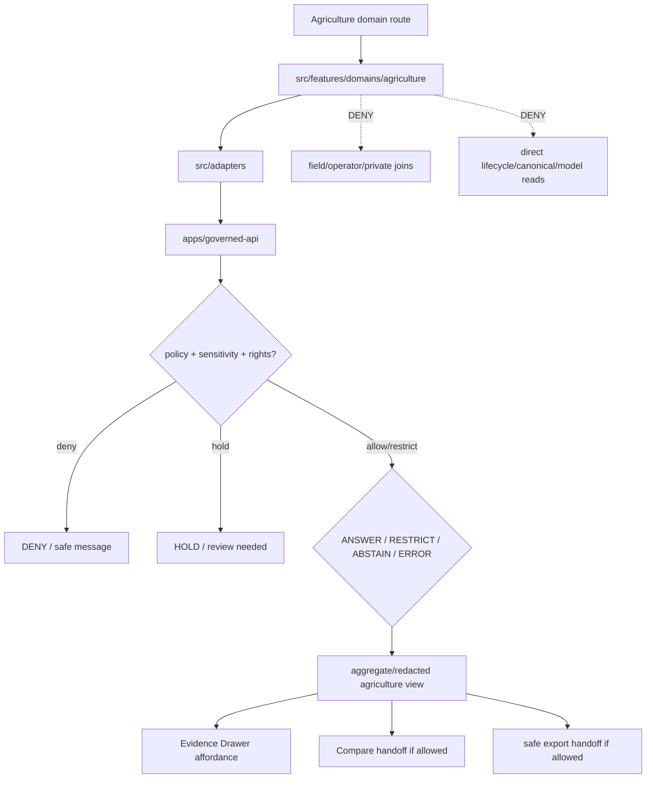

<!-- [KFM_META_BLOCK_V2]
doc_id: kfm://app/explorer-web/src/features/domains/agriculture/readme
title: Explorer Web Agriculture Domain Feature README
type: app-readme
version: v0.2
status: draft
owners: OWNER_TBD — Apps steward · UI steward · Agriculture steward · Governed API steward · Policy steward · Docs steward
created: 2026-06-16
updated: 2026-07-09
policy_label: public
related:
  - ../../README.md
  - ../../../README.md
  - ../../../adapters/README.md
  - ../../../../README.md
  - ../../../../../README.md
  - ../../../../../governed-api/README.md
  - ../../../../../../README.md
  - ../../../../../../SECURITY.md
  - ../../../../../../docs/domains/agriculture/README.md
  - ../../../../../../docs/domains/agriculture/SENSITIVITY.md
  - ../../../../../../policy/domains/agriculture/README.md
  - ../../../../../../packages/ui/README.md
  - ../../../../../../packages/maplibre/README.md
  - ../../../../../../packages/cesium/README.md
  - ../../../../../../policy/access/README.md
  - ../../../../../../policy/decision/README.md
  - ../../../../../../release/README.md
  - ../../../../../../data/README.md
  - ../../../../../../tools/validators/README.md
  - ../../../../../../tools/watchers/README.md
tags: [kfm, apps, explorer-web, domains, agriculture, feature, aggregate-only, redaction, evidence-drawer, focus-mode, map-first, no-direct-data-root, most-restrictive-wins]
notes:
  - "v0.2 updates the uploaded Agriculture domain-feature README into a current repo-aware feature contract."
  - "apps/explorer-web/src/features/domains/agriculture/README.md, apps/explorer-web/src/features/README.md, apps/explorer-web/src/adapters/README.md, apps/explorer-web/src/README.md, apps/explorer-web/README.md, docs/domains/agriculture/README.md, docs/domains/agriculture/SENSITIVITY.md, and policy/domains/agriculture/README.md were verified through the GitHub app in this update."
  - "Feature implementation files, route wiring, domain-view inventory, tests, fixtures, governed API envelopes, aggregation receipts, redaction receipts, export handoff, Focus Mode behavior, Evidence Drawer behavior, package scripts, runtime behavior, and deployment behavior remain NEEDS VERIFICATION."
  - "Agriculture UI features may compose governed agriculture envelopes into public/semi-public views, but they must not become domain doctrine, policy authority, source truth, lifecycle storage, release authority, field/operator exposure path, or public-data shortcut."
  - "Public Agriculture UI must fail closed for field-level, operator-resolved, parcel-adjacent, private-join, NASS-confidential, quarantine-adjacent, or cross-lane-sensitive material unless a reviewed policy path explicitly allows transformed, aggregated, generalized, redacted, restricted, delayed, or otherwise bounded output."
[/KFM_META_BLOCK_V2] -->

<a id="top"></a>

<div align="center">

# Explorer Web Agriculture Domain Feature

`apps/explorer-web/src/features/domains/agriculture/`

**Domain-specific Explorer Web feature boundary for public-safe agriculture views: crop, field-candidate, rotation, yield, irrigation, suitability, conservation, stress, and agriculture-economy surfaces rendered only through governed envelopes.**


[Purpose](#1-purpose) · [Current evidence](#2-current-repo-evidence) · [Repo fit](#3-repo-fit) · [Boundary](#4-authority-boundary) · [Inputs](#6-inputs) · [Exclusions](#7-exclusions) · [Feature map](#8-agriculture-feature-map) · [Definition of done](#15-definition-of-done)

</div>

---

> [!IMPORTANT]
> **Status:** draft / current README surface confirmed / implementation behavior `NEEDS VERIFICATION`  
> **Owners:** `OWNER_TBD` — Apps steward · UI steward · Agriculture steward · Governed API steward · Policy steward · Docs steward  
> **Path:** `apps/explorer-web/src/features/domains/agriculture/README.md`  
> **Responsibility root:** `apps/` — deployable application surfaces  
> **Truth posture:** CONFIRMED README path and supporting Agriculture docs/policy README surfaces / PROPOSED domain-feature contract / UNKNOWN implementation files, route wiring, domain-view inventory, tests, fixtures, governed API envelopes, aggregation receipts, redaction receipts, export handoff, Focus Mode behavior, Evidence Drawer behavior, package scripts, runtime behavior, and deployment behavior

> [!CAUTION]
> Agriculture is rights- and privacy-sensitive. Public UI must fail closed for field-level, operator-resolved, parcel-adjacent, private-join, NASS-confidential, quarantine-adjacent, or cross-lane-sensitive material unless a reviewed policy path explicitly allows a transformed, aggregated, generalized, redacted, restricted, delayed, or otherwise bounded output.

---

## Quick jump

- [1. Purpose](#1-purpose)
- [2. Current repo evidence](#2-current-repo-evidence)
- [3. Repo fit](#3-repo-fit)
- [4. Authority boundary](#4-authority-boundary)
- [5. Default posture](#5-default-posture)
- [6. Inputs](#6-inputs)
- [7. Exclusions](#7-exclusions)
- [8. Agriculture feature map](#8-agriculture-feature-map)
- [9. Diagram](#9-diagram)
- [10. Agriculture UI obligations](#10-agriculture-ui-obligations)
- [11. Per-view contract](#11-per-view-contract)
- [12. Inspection path](#12-inspection-path)
- [13. Validation expectations](#13-validation-expectations)
- [14. Safe change pattern](#14-safe-change-pattern)
- [15. Definition of done](#15-definition-of-done)
- [16. Open verification items](#16-open-verification-items)

---

## 1. Purpose

`apps/explorer-web/src/features/domains/agriculture/` is the proposed app-local feature boundary for Agriculture-specific Explorer Web surfaces.

It may eventually hold route modules, panels, view models, hooks, and feature orchestration for public-safe agriculture experiences such as:

- aggregate crop and rotation maps;
- suitability and conservation overlays;
- irrigation and water-use context views that defer hydrology truth to the hydrology lane;
- stress and remote-sensing summaries;
- agricultural-economy indicators at approved aggregation levels;
- Evidence Drawer handoffs for agriculture claims;
- Focus Mode bounded agriculture prompts and finite outcomes;
- compare/export handoffs that preserve aggregation, redaction, rights, and release state.

This directory is not proof that any route, panel, hook, map layer, adapter, test, fixture, package script, governed API envelope, aggregation receipt, redaction receipt, Evidence Drawer behavior, Focus Mode behavior, export handoff, or runtime wiring is implemented.

[Back to top](#top)

---

## 2. Current repo evidence

| Surface | Status | What it proves | What it does **not** prove |
|---|---|---|---|
| `apps/explorer-web/src/features/domains/agriculture/README.md` | **CONFIRMED README** | This README exists and has been updated to v0.2. | Agriculture UI implementation files, route wiring, domain-view inventory, tests, fixtures, governed API envelopes, receipts, export handoff, or runtime behavior. |
| `apps/explorer-web/src/features/README.md` | **CONFIRMED parent features README** | Parent feature boundary exists and says feature modules must not treat map features, tiles, local files, model text, or lifecycle data as claim truth. | That domain feature modules, route inventory, tests, fixtures, or runtime wiring exist. |
| `apps/explorer-web/src/adapters/README.md` | **CONFIRMED adapter README** | Adapter boundary exists and denies direct lifecycle/canonical/model-output reads. | That agriculture adapters, governed API client adapters, or renderer adapters are implemented. |
| `apps/explorer-web/src/README.md` | **CONFIRMED parent source README** | Explorer Web source tree denies direct lifecycle/canonical/model reads and requires governed API envelopes for claim-bearing UI. | That agriculture routes, adapters, map layers, renderer wiring, or tests are implemented. |
| `apps/explorer-web/README.md` | **CONFIRMED parent app README** | Explorer Web is the map-first public/semi-public shell and must use governed API envelopes instead of direct lifecycle/canonical/internal-store reads. | That app routes, clients, adapters, tests, package scripts, or deployment exist. |
| `docs/domains/agriculture/README.md` | **CONFIRMED domain-doc surface** | Agriculture domain lane describes aggregate/permissioned publication posture and field/operator detail denial by default. | That app UI behavior, schemas, validators, policy bundles, source descriptors, or releases are implemented. |
| `docs/domains/agriculture/SENSITIVITY.md` | **CONFIRMED sensitivity-doc surface** | Agriculture sensitivity posture requires safest representation and fails closed for private farm/operator × parcel joins. | That executable policy or UI enforcement is wired. |
| `policy/domains/agriculture/README.md` | **CONFIRMED policy-lane README** | Agriculture policy lane exists as restricted policy surface for field/operator exposure, aggregate release posture, rights, sensitivity, redaction, aggregation, review, and release-adjacent gates. | That concrete policy files, bundle syntax, tests, fixtures, CI binding, or runtime enforcement are wired. |
| `apps/explorer-web/src/features/domains/README.md` | **NOT VERIFIED** | Direct fetch did not confirm a parent domain-feature README at that path in this update. | Does not prove absence across all refs; a future index remains useful if accepted. |
| Uploaded Agriculture Markdown | **CONFIRMED source text for this update** | Provided the base Agriculture domain-feature contract updated here. | Does not prove live implementation. |
| Implementation beyond README | **NEEDS VERIFICATION** | Checkable by repo scan, route inventory, fixtures, tests, package scripts, governed API envelopes, receipts, and runtime evidence. | Not claimed by this README. |

[Back to top](#top)

---

## 3. Repo fit

| Concern | Owning root | Expected relationship |
|---|---|---|
| Agriculture domain feature source | `apps/explorer-web/src/features/domains/agriculture/` | App-local Agriculture UI feature modules, if implemented and tested. |
| Feature boundary | `apps/explorer-web/src/features/` | Parent feature/root contract. |
| Domain-feature parent index | `apps/explorer-web/src/features/domains/` | **NEEDS VERIFICATION**; parent README was not confirmed in this update. |
| Adapter boundary | `apps/explorer-web/src/adapters/` | Governed API, evidence, layer, map, export, and diagnostics adapters. |
| Explorer Web source tree | `apps/explorer-web/src/` | Parent source-layout boundary. |
| Explorer Web app | `apps/explorer-web/` | Map-first public/semi-public shell. |
| Governed API | `apps/governed-api/` | Trust membrane and normal claim-bearing data path. |
| Agriculture doctrine | `docs/domains/agriculture/` | Domain scope, language, sensitivity, policy intent, and backlog. |
| Agriculture policy | `policy/domains/agriculture/` | Agriculture admissibility and exposure policy lane, if executable wiring is accepted. |
| Shared UI components | `packages/ui/` | Reusable cards, badges, drawers, panels, and legends when shared. |
| Renderer wrappers | `packages/maplibre/`, `packages/cesium/` | Renderer behavior stays behind adapter/wrapper boundaries. |
| Release authority | `release/` | Publication, correction, rollback control. |
| Lifecycle artifacts | `data/` | Receipts, proofs, registry, catalog, triplets, and published artifacts. |
| Security posture | `SECURITY.md`, `docs/security/` | Secrets, sensitive-output, incident, exposure, and audit posture. |

[Back to top](#top)

---

## 4. Authority boundary

This feature renders governed Agriculture UI. It does not own Agriculture doctrine, source admission, source rights, policy decisions, schemas, contracts, lifecycle artifacts, release decisions, evidence truth, renderer authority, export authority, or AI output.

```text
apps/explorer-web/src/features/domains/agriculture/ = app-local Agriculture UI feature
apps/explorer-web/src/features/                     = feature boundary
apps/explorer-web/src/adapters/                     = adapter boundary
apps/explorer-web/src/                              = Explorer Web implementation source
apps/explorer-web/                                  = map-first public/semi-public app boundary
apps/governed-api/                                  = trust membrane and normal data path
docs/domains/agriculture/                           = Agriculture doctrine and policy intent
policy/domains/agriculture/                         = Agriculture policy lane
packages/ui/                                        = shared UI primitives
packages/maplibre/                                  = renderer wrapper
packages/cesium/                                    = optional gated renderer wrapper
policy/                                             = finite policy decisions
schemas/                                            = machine-readable shape
contracts/                                          = object meaning
data/                                               = lifecycle artifacts, receipts, proofs, registries
release/                                            = publication, correction, rollback authority
```

Safe interpretation:

- **CONFIRMED:** this README surface, parent Explorer Web feature/adapter/source/app READMEs, Agriculture domain docs, Agriculture sensitivity doc, and Agriculture policy-lane README exist.
- **PROPOSED:** Agriculture feature modules may live here when they preserve governed API, aggregation, redaction, source-role, evidence, sensitivity, rights, release, cross-lane, export, and public-boundary constraints.
- **NEEDS VERIFICATION:** Agriculture modules, route wiring, domain-view inventory, adapter dependencies, fixtures, tests, package scripts, governed API envelopes, aggregation/redaction receipts, export handoff, Evidence Drawer behavior, Focus Mode behavior, runtime behavior, and deployment behavior.
- **DENY:** using this feature as Agriculture truth, policy authority, source authority, release authority, lifecycle store, schema/contract home, direct canonical/internal store client, direct model-output surface, field/operator exposure path, renderer authority, export authority, or public-data shortcut.

[Back to top](#top)

---

## 5. Default posture

Agriculture feature modules should fail safe, aggregate by default, and preserve the most restrictive applicable posture.

A view should not render claim-bearing agriculture content when any of these are unresolved:

- governed API envelope and response validation;
- object family or agriculture domain slug;
- source role and provenance;
- rights or license posture;
- sensitivity tier;
- field/operator exposure risk;
- parcel-adjacent or private join risk;
- cross-lane People, Land, Soil, Hydrology, Habitat, Infrastructure, or Economy join posture;
- EvidenceRef or EvidenceBundle support;
- aggregation, generalization, redaction, suppression, or delay receipt;
- release state and rollback target;
- correction or supersession state;
- required steward review.

[Back to top](#top)

---

## 6. Inputs

| Input family | Examples | Required posture |
|---|---|---|
| Agriculture view state | aggregate crop, rotation, yield, suitability, irrigation, conservation, stress, economy | Explicit finite states. |
| API envelope | answer, abstain, deny, error, hold, restricted, decision envelope, evidence payload | Runtime-validated before render. |
| Layer state | layer manifest, source role, legend, trust badges, valid time, selected feature id | Released or bounded-safe source only. |
| Evidence state | EvidenceRef, EvidenceBundle summary, citation validation, proof visibility | Required for claim-bearing detail. |
| Sensitivity state | aggregate, field-candidate, operator/private join, quarantine-adjacent, cross-lane-sensitive | Most restrictive posture wins. |
| Transform state | AggregationReceipt, RedactionReceipt, generalization, suppression, delayed release | Required when reducing exposure risk. |
| Cross-lane state | soil, hydrology, habitat, people/land, infrastructure, economy joins | Inherits strictest lane posture. |
| Release/correction state | release ref, rollback target, correction notice, supersession state | Required for public-facing claim and export support. |
| Export state | selected layers, bounds, citations, aggregation/redaction profile, output mode | Governed export only. |
| Focus Mode state | prompt class, finite outcome, evidence handles, policy result | No direct model output as truth. |

[Back to top](#top)

---

## 7. Exclusions

| Does not belong here | Correct home |
|---|---|
| Agriculture doctrine and scope | `docs/domains/agriculture/` |
| Agriculture policy bundles or policy decisions | `policy/domains/agriculture/`, `policy/` |
| Governed API implementation | `apps/governed-api/` |
| Adapter logic shared across feature families | `apps/explorer-web/src/adapters/` |
| Shared reusable UI primitives | `packages/ui/` |
| Renderer wrapper authority | `packages/maplibre/`, `packages/cesium/` |
| Agriculture schemas and contracts | `schemas/contracts/v1/domains/agriculture/`, `contracts/domains/agriculture/` |
| Lifecycle artifacts, receipts, proofs, catalog, triplets | `data/` |
| Release manifests, rollback cards, correction notices | `release/` |
| Source acquisition or source registry records | `connectors/`, `data/registry/`, source catalog lanes |
| Field/operator exact public exposure | denied unless reviewed transformed output is explicitly allowed |
| Direct RAW / WORK / QUARANTINE / PROCESSED / CATALOG / TRIPLET / PUBLISHED reads | governed API, released artifacts, layer manifests, and bounded public-safe envelopes only |
| Direct model runtime behavior | `runtime/` behind governed API only |
| Secrets, credentials, tokens, private keys, exact private-farm/operator joins | secret manager / deployment environment, not UI feature source or examples |
| Public-sensitive exports, exact restricted locations, living-person/DNA details, source-restricted records, prompt/model traces | denied unless separately governed and public-safe |

[Back to top](#top)

---

## 8. Agriculture feature map

Exact modules remain `NEEDS VERIFICATION`. Candidate views should be introduced only with route inventory, fixtures, governed API envelopes, aggregation/redaction support, and tests.

| Candidate view | Purpose | Required safeguard | Status |
|---|---|---|---|
| `aggregate-crops` | Show crop observations at approved aggregation level. | Approved aggregation, release state, source-role metadata. | PROPOSED |
| `rotation-summary` | Show rotation or temporal crop-pattern summaries. | Explicit valid-time and source-role badges. | PROPOSED |
| `yield-summary` | Show aggregate yield or production indicators. | No field/operator inference. | PROPOSED |
| `irrigation-context` | Show public-safe irrigation context. | Hydrology lane relation, rights check, no water-rights overclaim. | PROPOSED |
| `suitability` | Show suitability or conservation outputs. | Derived-layer evidence and assumptions visible. | PROPOSED |
| `stress-summary` | Show remote-sensing or stress indicators. | Interpretive-derivative label and evidence support. | PROPOSED |
| `ag-economy` | Show agriculture-economy indicators. | Aggregate only; no private operator joins. | PROPOSED |
| `domain-focus` | Agriculture Focus Mode UI. | Finite outcomes; no direct model truth. | PROPOSED |
| `domain-export` | Agriculture export handoff. | Citation, aggregation, redaction, rights, release checks. | PROPOSED |
| `domain-compare` | Agriculture compare handoff. | Time, release, aggregation/redaction, and provenance preserved. | PROPOSED |
| `correction-status` | Show public-safe correction/supersession status for agriculture layers. | Release/correction refs only; no restricted payloads. | PROPOSED |

> [!WARNING]
> Candidate view names are not implementation proof. Do not document a view as runnable until files, route wiring, tests, fixtures, package scripts, receipts, and governed API envelopes confirm it.

[Back to top](#top)

---

## 9. Diagram



[Back to top](#top)

---

## 10. Agriculture UI obligations

| Obligation | Example effect |
|---|---|
| `governed_api_only` | Agriculture feature state comes through governed API envelopes. |
| `aggregate_first` | Public views default to aggregate or generalized outputs. |
| `most_restrictive_wins` | Any sensitive join or operator risk narrows or blocks the view. |
| `evidence_required` | Claim-bearing details link to EvidenceBundle-derived payloads. |
| `redaction_preserved` | Redacted/generalized detail is never re-expanded client-side. |
| `source_role_visible` | NASS/NRCS/USDA/remote-sensing/local-upload/manual source roles stay visible where relevant. |
| `finite_states_required` | Views render answer, restrict, abstain, deny, error, hold, loading, and empty states safely. |
| `safe_export_required` | Export handoff preserves citations, aggregation/redaction, rights, and release constraints. |
| `safe_compare_required` | Compare handoff preserves time semantics, aggregation/redaction, provenance, and release state. |
| `no_authority_fork` | Feature code does not redefine Agriculture policy, schema, contract, source, release, or evidence logic. |
| `no_data_root_shortcut` | Feature code does not read lifecycle data roots, canonical/internal stores, local source files, or model output as claim sources. |
| `local_parity_preferred` | Agriculture fixtures/tests should be runnable locally and in CI with the same inputs where practical. |

[Back to top](#top)

---

## 11. Per-view contract

Every long-lived Agriculture domain view should document or encode:

- view purpose and route ownership;
- agriculture object families and source families consumed;
- governed API envelope or adapter dependency;
- aggregation/redaction/generalization obligations;
- expected finite outcomes;
- evidence/citation display behavior;
- sensitivity, rights, release, valid-time, correction, and cross-lane inheritance behavior;
- loading, empty, deny, abstain, error, hold, restricted states;
- direct lifecycle/canonical/model-output denial posture;
- compare, Focus Mode, Evidence Drawer, or export behavior, if any;
- tests and fixtures proving trust-membrane and exposure-boundary behavior.

[Back to top](#top)

---

## 12. Inspection path

Agriculture feature implementation files, route wiring, tests, fixtures, governed API envelopes, aggregation/redaction receipts, package scripts, and export handoff remain `NEEDS VERIFICATION`.

```bash
find apps/explorer-web/src/features/domains/agriculture -maxdepth 5 -type f | sort
find apps/explorer-web/src apps/governed-api docs/domains/agriculture policy/domains/agriculture packages/ui packages/maplibre tests fixtures -maxdepth 6 -type f 2>/dev/null | grep -Ei 'agriculture|crop|field|rotation|yield|irrigation|suitability|conservation|stress|nass|nrcs|aggregation|redaction|evidence|export|governed' | sort
find data/raw data/work data/quarantine data/processed data/catalog data/triplets data/published data/receipts data/proofs -maxdepth 2 -type f 2>/dev/null | sort
```

[Back to top](#top)

---

## 13. Validation expectations

Useful validation for this feature boundary should cover:

- no Agriculture feature imports or reads lifecycle data roots directly;
- claim-bearing Agriculture views consume governed API envelopes only;
- malformed Agriculture envelopes render safe error or abstain states;
- field-level, operator-resolved, parcel-adjacent, private-join, NASS-confidential, or quarantine-adjacent content is denied or restricted by default;
- cross-lane sensitive joins inherit the most restrictive posture;
- aggregate views preserve aggregation support, valid-time, source-role, rights, release, and citation metadata;
- Evidence Drawer handoff preserves EvidenceRef/EvidenceBundle handles;
- Focus Mode renders finite outcomes and never direct model output as truth;
- compare and export handoffs require citation, aggregation/redaction, rights, and release support;
- UI output does not expose secrets, exact restricted locations, source-restricted records, private data, or prompt/model traces.

[Back to top](#top)

---

## 14. Safe change pattern

For Agriculture feature changes:

1. Add or update route inventory and per-view contract.
2. Add fixtures for aggregate, restricted, denied, held, abstained, malformed, loading, and empty states.
3. Test lifecycle-data denial and governed API-only behavior.
4. Preserve aggregation, redaction, valid-time, source-role, release, rights, sensitivity, and citation fields through UI state.
5. Verify cross-lane joins inherit the strictest applicable policy posture.
6. Verify compare, export, Focus Mode, and Evidence Drawer handoffs cannot bypass policy or release checks.
7. Update this README, parent `features/README.md`, adapter README, domain docs, policy README, and parent app README when public behavior changes.

[Back to top](#top)

---

## 15. Definition of done

- [ ] Owners are confirmed and `OWNER_TBD` is replaced.
- [ ] Agriculture feature file inventory and route ownership are documented.
- [ ] Governed API and adapter dependencies are explicit.
- [ ] Agriculture sensitivity and rights states are represented in UI fixtures.
- [ ] Aggregation/redaction/generalization obligations survive feature composition.
- [ ] Direct lifecycle-data import/read checks are covered.
- [ ] Field/operator/private-join denial states are tested.
- [ ] Cross-lane sensitivity inheritance is tested.
- [ ] Finite states cover answer, restrict, abstain, deny, error, hold, loading, and empty cases.
- [ ] Evidence Drawer, Focus Mode, Compare, and Export handoffs are tested for safe output if present.
- [ ] Parent feature/adapter/source/app READMEs and Agriculture docs/policy surfaces are updated when public behavior changes.

[Back to top](#top)

---

## 16. Open verification items

| Item | Why it matters |
|---|---|
| Confirm Agriculture feature implementation files beyond README | Prevents overclaiming feature maturity. |
| Confirm route inventory | Required for public/semi-public UI boundary review. |
| Confirm governed API Agriculture envelopes | Required for trust membrane enforcement. |
| Confirm adapter dependency shape | Required so Agriculture UI does not bypass governed adapters. |
| Confirm aggregation/redaction receipt linkage | Required before field-risk reduction claims. |
| Confirm fixtures and tests | Required before implementation claims. |
| Confirm Focus Mode and Evidence Drawer behavior | Required before claim-bearing Agriculture UI claims. |
| Confirm Compare handoff | Required before visual-difference claims. |
| Confirm export handoff | Required before public download workflows. |
| Confirm direct data-root denial | Required for public client trust membrane. |
| Confirm cross-lane sensitivity inheritance | Required when People/Land, Soil, Hydrology, Habitat, Infrastructure, or Economy joins are in scope. |
| Confirm package scripts beyond TODO | Required before build/test claims. |
| Confirm executable Agriculture policy binding | Required before enforcement claims. |

<details>
<summary>Appendix A — no-loss preservation note</summary>

The uploaded README replaced a greenfield Agriculture domain-feature stub with a bounded Agriculture feature contract without claiming Agriculture routes, panels, hooks, adapters, fixtures, tests, package scripts, governed API envelopes, aggregation receipts, redaction receipts, Focus Mode, Evidence Drawer, Compare, or export handoff are implemented. This v0.2 update preserves that structure while adding current repo evidence, parent feature/adapter/source/app linkage, supporting Agriculture docs/policy evidence, stronger no-direct-data-root language, cross-lane inheritance posture, compare/correction/export handoff posture, local-parity expectations, and expanded verification items.

</details>

## Status summary

`apps/explorer-web/src/features/domains/agriculture/` should contain Agriculture-specific Explorer Web feature modules only after route contracts, governed API envelopes, aggregation/redaction posture, fixtures, tests, Evidence Drawer behavior, Focus Mode behavior, Compare behavior, and export handoff are verified.

It must preserve the trust membrane and Agriculture sensitivity posture: the feature may show aggregate, generalized, redacted, delayed, or restricted Agriculture knowledge, but it must not expose field/operator/private joins, become Agriculture truth, bypass policy, publish, read lifecycle/canonical stores directly, or turn map features into unsupported claims.

<p align="right"><a href="#top">Back to top</a></p>
