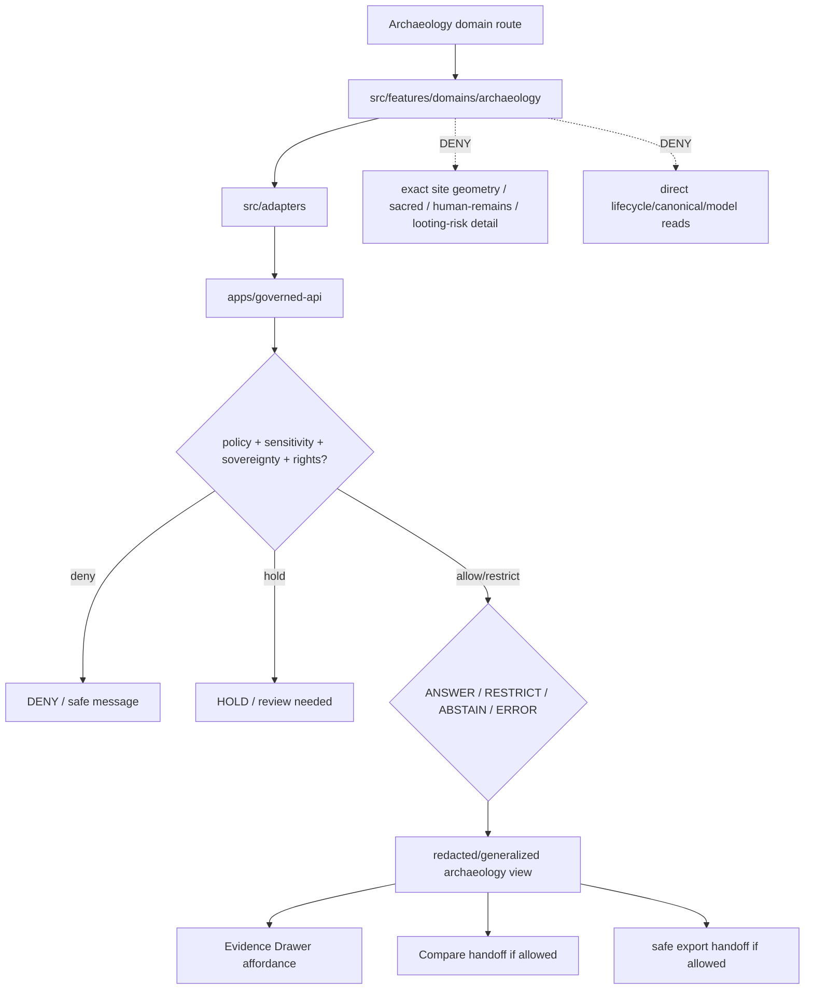

<!-- [KFM_META_BLOCK_V2]
doc_id: kfm://app/explorer-web/src/features/domains/archaeology/readme
title: Explorer Web Archaeology Domain Feature README
type: app-readme
version: v0.2
status: draft
owners: OWNER_TBD — Apps steward · UI steward · Archaeology steward · Sensitivity reviewer · Rights-holder representative · Governed API steward · Policy steward · Docs steward
created: 2026-06-16
updated: 2026-07-09
policy_label: public
related:
  - ../../README.md
  - ../../../README.md
  - ../../../adapters/README.md
  - ../../../../README.md
  - ../../../../../README.md
  - ../../../../../governed-api/README.md
  - ../../../../../../README.md
  - ../../../../../../SECURITY.md
  - ../../../../../../docs/domains/archaeology/README.md
  - ../../../../../../docs/domains/archaeology/SENSITIVITY.md
  - ../../../../../../docs/domains/archaeology/PUBLICATION_AND_POLICY.md
  - ../../../../../../policy/domains/archaeology/README.md
  - ../../../../../../packages/ui/README.md
  - ../../../../../../packages/maplibre/README.md
  - ../../../../../../packages/cesium/README.md
  - ../../../../../../policy/access/README.md
  - ../../../../../../policy/decision/README.md
  - ../../../../../../release/README.md
  - ../../../../../../data/README.md
  - ../../../../../../tools/validators/README.md
  - ../../../../../../tools/watchers/README.md
tags: [kfm, apps, explorer-web, domains, archaeology, feature, sensitive-domain, deny-by-default, redaction, sovereignty, evidence-drawer, no-direct-data-root, receipt-backed]
notes:
  - "v0.2 updates the uploaded Archaeology domain-feature README into a current repo-aware feature contract."
  - "apps/explorer-web/src/features/domains/archaeology/README.md, apps/explorer-web/src/features/README.md, apps/explorer-web/src/adapters/README.md, apps/explorer-web/src/README.md, apps/explorer-web/README.md, docs/domains/archaeology/README.md, docs/domains/archaeology/SENSITIVITY.md, docs/domains/archaeology/PUBLICATION_AND_POLICY.md, and policy/domains/archaeology/README.md were verified through the GitHub app in this update."
  - "Feature implementation files, route wiring, domain-view inventory, tests, fixtures, governed API envelopes, redaction receipts, review records, release manifests, export handoff, Focus Mode behavior, Evidence Drawer behavior, package scripts, runtime behavior, and deployment behavior remain NEEDS VERIFICATION."
  - "Archaeology UI features may compose governed archaeology envelopes into public/semi-public views, but they must not expose exact site geometry, human remains, sacred sites, collection-security detail, looting-risk exposure, oral-history restrictions, sovereignty-bearing cultural knowledge, embargoed records, or unresolved rights/consent state without reviewed, receipt-backed policy support."
  - "Public Archaeology UI must default to deny/hold/restrict when sensitivity, rights, consent, sovereignty, redaction, release, rollback, correction, evidence, or review support is unresolved."
[/KFM_META_BLOCK_V2] -->

<a id="top"></a>

<div align="center">

# Explorer Web Archaeology Domain Feature

`apps/explorer-web/src/features/domains/archaeology/`

**Domain-specific Explorer Web feature boundary for public-safe archaeology views: generalized archaeology context, preservation-state summaries, public interpretation, Evidence Drawer handoffs, Focus Mode answers, and release-aware map surfaces rendered only through governed envelopes.**


[Purpose](#1-purpose) · [Current evidence](#2-current-repo-evidence) · [Repo fit](#3-repo-fit) · [Boundary](#4-authority-boundary) · [Inputs](#6-inputs) · [Exclusions](#7-exclusions) · [Feature map](#8-archaeology-feature-map) · [Definition of done](#15-definition-of-done)

</div>

---

> [!IMPORTANT]
> **Status:** draft / current README surface confirmed / implementation behavior `NEEDS VERIFICATION`  
> **Owners:** `OWNER_TBD` — Apps steward · UI steward · Archaeology steward · Sensitivity reviewer · Rights-holder representative · Governed API steward · Policy steward · Docs steward  
> **Path:** `apps/explorer-web/src/features/domains/archaeology/README.md`  
> **Responsibility root:** `apps/` — deployable application surfaces  
> **Truth posture:** CONFIRMED README path and supporting Archaeology docs/policy README surfaces / PROPOSED domain-feature contract / UNKNOWN implementation files, route wiring, domain-view inventory, tests, fixtures, governed API envelopes, redaction receipts, review records, release manifests, export handoff, Focus Mode behavior, Evidence Drawer behavior, package scripts, runtime behavior, and deployment behavior

> [!CAUTION]
> Archaeology is a sensitive-domain lane. Public UI must fail closed for exact site geometry, human remains, sacred sites, collection-security detail, looting-risk exposure, oral-history restrictions, sovereignty-bearing cultural knowledge, embargoed records, and any unresolved rights, consent, or review state.

---

## Quick jump

- [1. Purpose](#1-purpose)
- [2. Current repo evidence](#2-current-repo-evidence)
- [3. Repo fit](#3-repo-fit)
- [4. Authority boundary](#4-authority-boundary)
- [5. Default posture](#5-default-posture)
- [6. Inputs](#6-inputs)
- [7. Exclusions](#7-exclusions)
- [8. Archaeology feature map](#8-archaeology-feature-map)
- [9. Diagram](#9-diagram)
- [10. Archaeology UI obligations](#10-archaeology-ui-obligations)
- [11. Per-view contract](#11-per-view-contract)
- [12. Inspection path](#12-inspection-path)
- [13. Validation expectations](#13-validation-expectations)
- [14. Safe change pattern](#14-safe-change-pattern)
- [15. Definition of done](#15-definition-of-done)
- [16. Open verification items](#16-open-verification-items)

---

## 1. Purpose

`apps/explorer-web/src/features/domains/archaeology/` is the proposed app-local feature boundary for Archaeology-specific Explorer Web surfaces.

It may eventually hold route modules, panels, view models, hooks, and feature orchestration for public-safe archaeology experiences such as:

- generalized archaeology context maps;
- public-safe preservation-state summaries;
- interpreted cultural-resource context that carries source role and sensitivity state;
- Evidence Drawer handoffs that show only governed, redacted, audience-appropriate payloads;
- Focus Mode bounded archaeology answers with citation discipline and AIReceipt support;
- compare/export handoffs that preserve redaction, generalization, rights, release, review, correction, and rollback state;
- sovereignty and CARE notice chips where policy allows display.

This directory is not proof that any route, panel, hook, map layer, adapter, test, fixture, package script, governed API envelope, redaction receipt, review record, release manifest, Evidence Drawer behavior, Focus Mode behavior, export handoff, or runtime wiring is implemented.

[Back to top](#top)

---

## 2. Current repo evidence

| Surface | Status | What it proves | What it does **not** prove |
|---|---|---|---|
| `apps/explorer-web/src/features/domains/archaeology/README.md` | **CONFIRMED README** | This README exists and has been updated to v0.2. | Archaeology UI implementation files, route wiring, domain-view inventory, tests, fixtures, governed API envelopes, receipts, review records, release manifests, export handoff, or runtime behavior. |
| `apps/explorer-web/src/features/README.md` | **CONFIRMED parent features README** | Parent feature boundary exists and says feature modules must not treat map features, tiles, local files, model text, or lifecycle data as claim truth. | That domain feature modules, route inventory, tests, fixtures, or runtime wiring exist. |
| `apps/explorer-web/src/adapters/README.md` | **CONFIRMED adapter README** | Adapter boundary exists and denies direct lifecycle/canonical/model-output reads. | That archaeology adapters, governed API client adapters, or renderer adapters are implemented. |
| `apps/explorer-web/src/README.md` | **CONFIRMED parent source README** | Explorer Web source tree denies direct lifecycle/canonical/model reads and requires governed API envelopes for claim-bearing UI. | That archaeology routes, adapters, map layers, renderer wiring, or tests are implemented. |
| `apps/explorer-web/README.md` | **CONFIRMED parent app README** | Explorer Web is the map-first public/semi-public shell and must use governed API envelopes instead of direct lifecycle/canonical/internal-store reads. | That app routes, clients, adapters, tests, package scripts, or deployment exist. |
| `docs/domains/archaeology/README.md` | **CONFIRMED domain-doc surface** | Archaeology domain docs define a human-facing documentation home, exact-location denial default, and implementation maturity as PROPOSED. | That app UI behavior, schemas, validators, policy bundles, source descriptors, or releases are implemented. |
| `docs/domains/archaeology/SENSITIVITY.md` | **CONFIRMED sensitivity-doc surface** | Archaeology sensitivity docs default exact site geometry, human remains, sacred sites, collection security, and looting-risk exposure to deny/fail-closed posture. | That executable policy or UI enforcement is wired. |
| `docs/domains/archaeology/PUBLICATION_AND_POLICY.md` | **CONFIRMED publication/policy doc surface** | Publication doctrine requires redaction, review, policy decision, release authority, receipts, and rollback/correction support for public-safe output. | That release integration, policy-as-code, or UI enforcement exists. |
| `policy/domains/archaeology/README.md` | **CONFIRMED policy-lane README** | Archaeology policy lane exists as restricted policy surface for deny-by-default release controls, redaction, generalization, sovereignty review, consent, evidence, separation-of-duties, correction, and rollback gates. | That concrete policy files, bundle syntax, fixtures, tests, CI binding, release integration, or runtime enforcement are wired. |
| `apps/explorer-web/src/features/domains/README.md` | **NOT VERIFIED** | A parent domain-feature README was not confirmed in this update. | Does not prove absence across all refs; a future index remains useful if accepted. |
| Uploaded Archaeology Markdown | **CONFIRMED source text for this update** | Provided the base Archaeology domain-feature contract updated here. | Does not prove live implementation. |
| Implementation beyond README | **NEEDS VERIFICATION** | Checkable by repo scan, route inventory, fixtures, tests, package scripts, governed API envelopes, receipts, release records, and runtime evidence. | Not claimed by this README. |

[Back to top](#top)

---

## 3. Repo fit

| Concern | Owning root | Expected relationship |
|---|---|---|
| Archaeology domain feature source | `apps/explorer-web/src/features/domains/archaeology/` | App-local Archaeology UI feature modules, if implemented and tested. |
| Feature boundary | `apps/explorer-web/src/features/` | Parent feature/root contract. |
| Domain-feature parent index | `apps/explorer-web/src/features/domains/` | **NEEDS VERIFICATION**; parent README was not confirmed in this update. |
| Adapter boundary | `apps/explorer-web/src/adapters/` | Governed API, evidence, layer, map, export, and diagnostics adapters. |
| Explorer Web source tree | `apps/explorer-web/src/` | Parent source-layout boundary. |
| Explorer Web app | `apps/explorer-web/` | Map-first public/semi-public shell. |
| Governed API | `apps/governed-api/` | Trust membrane and normal claim-bearing data path. |
| Archaeology doctrine | `docs/domains/archaeology/` | Domain scope, object families, pipeline, sensitivity, publication, release index. |
| Archaeology policy | `policy/domains/archaeology/` | Archaeology admissibility and exposure policy lane, if executable wiring is accepted. |
| Shared UI components | `packages/ui/` | Reusable cards, badges, drawers, panels, and legends when shared. |
| Renderer wrappers | `packages/maplibre/`, `packages/cesium/` | Renderer behavior stays behind adapter/wrapper boundaries. |
| Release authority | `release/` | Publication, correction, supersession, rollback control. |
| Lifecycle artifacts | `data/` | Receipts, proofs, registry, catalog, triplets, and published artifacts. |
| Security posture | `SECURITY.md`, `docs/security/` | Secrets, sensitive-output, incident, exposure, and audit posture. |

[Back to top](#top)

---

## 4. Authority boundary

This feature renders governed Archaeology UI. It does not own Archaeology doctrine, source admission, source rights, sensitivity decisions, policy decisions, consent decisions, schemas, contracts, lifecycle artifacts, release decisions, evidence truth, renderer authority, export authority, or AI output.

```text
apps/explorer-web/src/features/domains/archaeology/ = app-local Archaeology UI feature
apps/explorer-web/src/features/                     = feature boundary
apps/explorer-web/src/adapters/                     = adapter boundary
apps/explorer-web/src/                              = Explorer Web implementation source
apps/explorer-web/                                  = map-first public/semi-public app boundary
apps/governed-api/                                  = trust membrane and normal data path
docs/domains/archaeology/                           = Archaeology doctrine and policy intent
policy/domains/archaeology/                         = Archaeology policy lane
packages/ui/                                        = shared UI primitives
packages/maplibre/                                  = renderer wrapper
packages/cesium/                                    = optional gated renderer wrapper
policy/                                             = finite policy decisions
schemas/                                            = machine-readable shape
contracts/                                          = object meaning
data/                                               = lifecycle artifacts, receipts, proofs, registries
release/                                            = publication, correction, rollback authority
```

Safe interpretation:

- **CONFIRMED:** this README surface, parent Explorer Web feature/adapter/source/app READMEs, Archaeology domain docs, Archaeology sensitivity doc, Archaeology publication/policy doc, and Archaeology policy-lane README exist.
- **PROPOSED:** Archaeology feature modules may live here when they preserve governed API, redaction, generalization, source-role, evidence, sensitivity, rights, sovereignty, consent, review, release, rollback, correction, export, and public-boundary constraints.
- **NEEDS VERIFICATION:** Archaeology modules, route wiring, domain-view inventory, adapter dependencies, fixtures, tests, package scripts, governed API envelopes, redaction receipts, review records, release manifests, export handoff, Evidence Drawer behavior, Focus Mode behavior, runtime behavior, and deployment behavior.
- **DENY:** using this feature as Archaeology truth, policy authority, source authority, release authority, lifecycle store, schema/contract home, direct canonical/internal store client, direct model-output surface, exact-location exposure path, renderer authority, export authority, or public-data shortcut.

[Back to top](#top)

---

## 5. Default posture

Archaeology feature modules should fail closed, redact by default, and preserve the strictest applicable audience tier and per-record sensitivity rank.

A view should not render claim-bearing archaeology content when any of these are unresolved:

- governed API envelope and response validation;
- object family or archaeology domain slug;
- exact geometry or location exposure risk;
- site, collection, human-remains, sacred-site, or looting-risk sensitivity;
- sovereignty, CARE, consent, revocation, embargo, or rights-holder state;
- source role and provenance;
- EvidenceRef or EvidenceBundle support;
- named redaction profile and `RedactionReceipt`;
- reviewer roles and separation-of-duties support;
- release state, rollback target, correction path, stale-state, or supersession state;
- public audience or export destination.

[Back to top](#top)

---

## 6. Inputs

| Input family | Examples | Required posture |
|---|---|---|
| Archaeology view state | generalized context, preservation-state, interpretation, public-safe density, story node, domain Focus Mode | Explicit finite states. |
| API envelope | answer, abstain, deny, error, hold, restricted, decision envelope, evidence payload | Runtime-validated before render. |
| Sensitivity state | audience tier, per-record rank, exact geometry risk, sacred/human-remains/looting-risk flags | Default deny/fail-closed when unresolved. |
| Sovereignty / consent state | CARE label, rights-holder sign-off, consent token, revocation, embargo, sovereignty review | Required for cultural or oral-history material. |
| Evidence state | EvidenceRef, EvidenceBundle summary, citation validation, proof visibility | Required for claim-bearing detail. |
| Transform state | named redaction profile, generalization level, k-anonymity or differential-privacy profile where approved | Versioned and receipt-backed. |
| Release/correction state | candidate, released, superseded, withdrawn, rollback requested, correction pending | Explicit; never inferred from path alone. |
| Export state | selected generalized layer, bounds, citation bundle, redaction profile, output mode | Governed export only. |
| Focus Mode state | prompt class, finite outcome, evidence handles, policy result | No direct model output as archaeology truth. |

[Back to top](#top)

---

## 7. Exclusions

| Does not belong here | Correct home |
|---|---|
| Archaeology doctrine and scope | `docs/domains/archaeology/` |
| Archaeology policy bundles or policy decisions | `policy/domains/archaeology/`, `policy/sensitivity/archaeology/`, `policy/consent/archaeology/`, `policy/` |
| Governed API implementation | `apps/governed-api/` |
| Adapter logic shared across feature families | `apps/explorer-web/src/adapters/` |
| Shared reusable UI primitives | `packages/ui/` |
| Renderer wrapper authority | `packages/maplibre/`, `packages/cesium/` |
| Archaeology schemas and contracts | `schemas/contracts/v1/archaeology/`, `contracts/domains/archaeology/` |
| Lifecycle artifacts, receipts, proofs, catalog, triplets | `data/` |
| Release manifests, rollback cards, correction notices | `release/` |
| Raw site/source data or precise protected locations | denied from public UI; governed internal lifecycle only |
| Direct source acquisition or source registry records | `connectors/`, `data/registry/`, source catalog lanes |
| Direct RAW / WORK / QUARANTINE / PROCESSED / CATALOG / TRIPLET / PUBLISHED reads | governed API, released artifacts, layer manifests, and bounded public-safe envelopes only |
| Direct model runtime behavior | `runtime/` behind governed API only |
| Secrets, credentials, tokens, private keys, exact protected locations, raw oral-history restrictions, protected cultural knowledge | secret manager / deployment environment, not UI feature source or examples |
| Public-sensitive exports, exact restricted locations, living-person/DNA details, source-restricted records, prompt/model traces | denied unless separately governed and public-safe |

[Back to top](#top)

---

## 8. Archaeology feature map

Exact modules remain `NEEDS VERIFICATION`. Candidate views should be introduced only with route inventory, fixtures, governed API envelopes, receipts, review records, and tests.

| Candidate view | Purpose | Required safeguard | Status |
|---|---|---|---|
| `generalized-context` | Show public-safe archaeology context without exact geometry. | RedactionReceipt and audience-tier check. | PROPOSED |
| `preservation-summary` | Show public-safe preservation-state summaries. | No exact site or collection-security detail. | PROPOSED |
| `interpretation` | Show evidence-backed cultural-resource interpretation. | EvidenceBundle-derived payload and citations. | PROPOSED |
| `density-surface` | Show generalized or k-anonymous site-density products. | Approved privacy profile and release state. | PROPOSED |
| `sovereignty-notice` | Show CARE/sovereignty notices where allowed. | Rights-holder and policy review. | PROPOSED |
| `domain-focus` | Archaeology Focus Mode UI. | Finite outcomes; no direct model truth or protected detail. | PROPOSED |
| `domain-evidence` | Evidence Drawer handoff. | Redacted/audience-appropriate payload only. | PROPOSED |
| `domain-export` | Archaeology export handoff. | Citation, redaction, rights, review, release checks. | PROPOSED |
| `domain-compare` | Archaeology compare handoff. | Redaction, release, review, provenance, and audience tier preserved. | PROPOSED |
| `correction-status` | Public-safe stale/supersession/correction status. | Release/correction refs only; no protected payloads. | PROPOSED |

> [!WARNING]
> Candidate view names are not implementation proof. Do not document a view as runnable until files, route wiring, tests, fixtures, package scripts, receipts, review records, and governed API envelopes confirm it.

[Back to top](#top)

---

## 9. Diagram



[Back to top](#top)

---

## 10. Archaeology UI obligations

| Obligation | Example effect |
|---|---|
| `governed_api_only` | Archaeology feature state comes through governed API envelopes. |
| `deny_exact_by_default` | Exact site geometry, sacred sites, human remains, collection-security, and looting-risk details do not render publicly. |
| `redaction_required` | Public-safe surfaces require named redaction/generalization profile and receipt support. |
| `sovereignty_required` | CARE, sovereignty, consent, revocation, and embargo states are preserved when relevant. |
| `review_required` | Sensitive public-safe display requires recorded review posture where doctrine/policy demands it. |
| `evidence_required` | Claim-bearing details link to EvidenceBundle-derived payloads. |
| `finite_states_required` | Views render answer, restrict, abstain, deny, error, hold, loading, and empty states safely. |
| `no_model_direct` | Focus Mode never renders direct model output as archaeology truth. |
| `safe_compare_required` | Compare handoff preserves redaction, release, review, provenance, audience tier, and finite states. |
| `safe_export_required` | Export handoff preserves citations, redaction, rights, review, release, correction, and rollback constraints. |
| `no_authority_fork` | Feature code does not redefine Archaeology policy, schema, contract, source, release, consent, or evidence logic. |
| `no_data_root_shortcut` | Feature code does not read lifecycle data roots, canonical/internal stores, local source files, or model output as claim sources. |
| `local_parity_preferred` | Archaeology fixtures/tests should be runnable locally and in CI with the same inputs where practical. |

[Back to top](#top)

---

## 11. Per-view contract

Every long-lived Archaeology domain view should document or encode:

- view purpose and route ownership;
- archaeology object families and source families consumed;
- governed API envelope or adapter dependency;
- redaction/generalization obligations;
- audience tier and per-record sensitivity-rank behavior;
- CARE, sovereignty, consent, revocation, embargo, and rights-holder behavior;
- review, separation-of-duties, release, correction, and rollback behavior;
- expected finite outcomes;
- evidence/citation display behavior;
- loading, empty, deny, abstain, error, hold, restricted states;
- direct lifecycle/canonical/model-output denial posture;
- compare, Focus Mode, Evidence Drawer, or export behavior, if any;
- tests and fixtures proving trust-membrane and sensitive-exposure boundaries.

[Back to top](#top)

---

## 12. Inspection path

Archaeology feature implementation files, route wiring, tests, fixtures, governed API envelopes, redaction receipts, review records, release manifests, package scripts, and export handoff remain `NEEDS VERIFICATION`.

```bash
find apps/explorer-web/src/features/domains/archaeology -maxdepth 5 -type f | sort
find apps/explorer-web/src apps/governed-api docs/domains/archaeology policy/domains/archaeology packages/ui packages/maplibre tests fixtures -maxdepth 6 -type f 2>/dev/null | grep -Ei 'archaeology|site|artifact|collection|survey|preservation|redaction|sovereignty|CARE|consent|embargo|evidence|release|rollback|governed' | sort
find data/raw data/work data/quarantine data/processed data/catalog data/triplets data/published data/receipts data/proofs -maxdepth 2 -type f 2>/dev/null | sort
```

[Back to top](#top)

---

## 13. Validation expectations

Useful validation for this feature boundary should cover:

- no Archaeology feature imports or reads lifecycle data roots directly;
- claim-bearing Archaeology views consume governed API envelopes only;
- malformed Archaeology envelopes render safe error or abstain states;
- exact site geometry, human remains, sacred sites, collection-security detail, looting-risk exposure, oral-history restrictions, sovereignty-bearing cultural knowledge, and embargoed records are denied or restricted by default;
- generalized views preserve redaction profile, generalization support, sensitivity, rights, release, citation, and review metadata;
- Evidence Drawer handoff preserves EvidenceRef/EvidenceBundle handles without exposing protected content;
- Focus Mode renders finite outcomes and never direct model output as truth;
- compare and export handoffs require citation, redaction, rights-holder, review, release, correction, and rollback support;
- UI output does not expose secrets, exact restricted locations, source-restricted records, private data, or prompt/model traces.

[Back to top](#top)

---

## 14. Safe change pattern

For Archaeology feature changes:

1. Add or update route inventory and per-view contract.
2. Add fixtures for generalized, restricted, denied, held, abstained, malformed, loading, and empty states.
3. Test lifecycle-data denial and governed API-only behavior.
4. Preserve redaction, sensitivity rank, audience tier, sovereignty, consent, review, release, rollback, rights, and citation fields through UI state.
5. Verify compare, export, Focus Mode, and Evidence Drawer handoffs cannot bypass policy, review, redaction, release, correction, or rollback checks.
6. Update this README, parent `features/README.md`, adapter README, archaeology docs, policy README, and parent app README when public behavior changes.

[Back to top](#top)

---

## 15. Definition of done

- [ ] Owners are confirmed and `OWNER_TBD` is replaced.
- [ ] Archaeology feature file inventory and route ownership are documented.
- [ ] Governed API and adapter dependencies are explicit.
- [ ] Archaeology sensitivity, sovereignty, consent, review, and rights states are represented in UI fixtures.
- [ ] Redaction/generalization obligations survive feature composition.
- [ ] Direct lifecycle-data import/read checks are covered.
- [ ] Exact-location and protected-content denial states are tested.
- [ ] Finite states cover answer, restrict, abstain, deny, error, hold, loading, and empty cases.
- [ ] Evidence Drawer, Focus Mode, Compare, and Export handoffs are tested for safe output if present.
- [ ] Parent feature/adapter/source/app READMEs and Archaeology docs/policy surfaces are updated when public behavior changes.

[Back to top](#top)

---

## 16. Open verification items

| Item | Why it matters |
|---|---|
| Confirm Archaeology feature implementation files beyond README | Prevents overclaiming feature maturity. |
| Confirm route inventory | Required for public/semi-public UI boundary review. |
| Confirm governed API Archaeology envelopes | Required for trust membrane enforcement. |
| Confirm adapter dependency shape | Required so Archaeology UI does not bypass governed adapters. |
| Confirm redaction receipt and review-record linkage | Required before public-safe transformation claims. |
| Confirm release manifest / rollback / correction linkage | Required before publication-support claims. |
| Confirm fixtures and tests | Required before implementation claims. |
| Confirm Focus Mode and Evidence Drawer behavior | Required before claim-bearing Archaeology UI claims. |
| Confirm Compare handoff | Required before visual-difference claims. |
| Confirm export handoff | Required before public download workflows. |
| Confirm direct data-root denial | Required for public client trust membrane. |
| Confirm executable Archaeology policy binding | Required before enforcement claims. |
| Confirm sovereignty/consent/revocation/embargo behavior | Required before cultural or oral-history material is displayed. |
| Confirm package scripts beyond TODO | Required before build/test claims. |

<details>
<summary>Appendix A — no-loss preservation note</summary>

The uploaded README replaced a greenfield Archaeology domain-feature stub with a bounded Archaeology feature contract without claiming Archaeology routes, panels, hooks, adapters, fixtures, tests, package scripts, governed API envelopes, redaction receipts, review records, release manifests, Focus Mode, Evidence Drawer, Compare, or export handoff are implemented. This v0.2 update preserves that structure while adding current repo evidence, parent feature/adapter/source/app linkage, supporting Archaeology docs/policy evidence, stronger no-direct-data-root language, release/correction/rollback posture, sovereignty/consent/revocation/embargo posture, compare/export handoff posture, local-parity expectations, and expanded verification items.

</details>

## Status summary

`apps/explorer-web/src/features/domains/archaeology/` should contain Archaeology-specific Explorer Web feature modules only after route contracts, governed API envelopes, redaction/generalization posture, review records, release manifests, fixtures, tests, Evidence Drawer behavior, Focus Mode behavior, Compare behavior, and export handoff are verified.

It must preserve the trust membrane and sensitive-domain posture: the feature may show generalized, redacted, audience-appropriate, or restricted Archaeology knowledge, but it must not expose exact site geometry, human remains, sacred sites, collection-security details, looting-risk exposures, sovereignty-bearing protected knowledge, or embargoed records; it must not become Archaeology truth, bypass policy, publish, read lifecycle/canonical stores directly, or turn map features into unsupported claims.

<p align="right"><a href="#top">Back to top</a></p>
