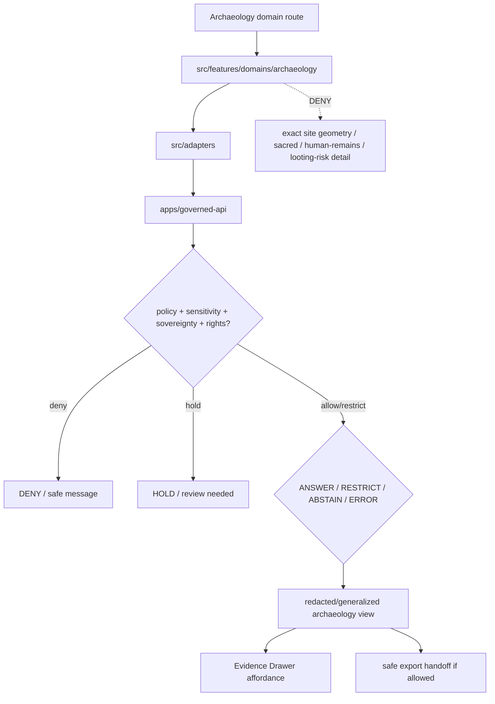

<!-- [KFM_META_BLOCK_V2]
doc_id: kfm://app/explorer-web/src/features/domains/archaeology/readme
title: Explorer Web Archaeology Domain Feature README
type: app-readme
version: v0.1
status: draft
owners: OWNER_TBD — Apps steward · UI steward · Archaeology steward · Sensitivity reviewer · Rights-holder representative · Governed API steward · Policy steward · Docs steward
created: 2026-06-16
updated: 2026-06-16
policy_label: public
related:
  - ../../README.md
  - ../../../README.md
  - ../../../adapters/README.md
  - ../../../../README.md
  - ../../../../../README.md
  - ../../../../../governed-api/README.md
  - ../../../../../../docs/domains/archaeology/README.md
  - ../../../../../../docs/domains/archaeology/SENSITIVITY.md
  - ../../../../../../docs/domains/archaeology/PUBLICATION_AND_POLICY.md
  - ../../../../../../policy/domains/archaeology/README.md
  - ../../../../../../packages/ui/README.md
  - ../../../../../../packages/maplibre/README.md
  - ../../../../../../policy/access/README.md
  - ../../../../../../policy/decision/README.md
  - ../../../../../../release/README.md
  - ../../../../../../data/README.md
tags: [kfm, apps, explorer-web, domains, archaeology, feature, sensitive-domain, deny-by-default, redaction, sovereignty, evidence-drawer]
notes:
  - "Replaces the greenfield archaeology domain feature stub with a governed feature README."
  - "Archaeology UI features may compose governed archaeology envelopes into public/semi-public views, but they must not expose exact site geometry, human remains, sacred sites, looting-risk details, oral-history restrictions, or sovereignty-bearing cultural knowledge without reviewed, receipt-backed policy support."
  - "Feature implementation files, route wiring, tests, fixtures, governed API envelopes, redaction receipts, review records, release manifests, and package scripts remain NEEDS VERIFICATION."
[/KFM_META_BLOCK_V2] -->

<a id="top"></a>

<div align="center">

# Explorer Web Archaeology Domain Feature

`apps/explorer-web/src/features/domains/archaeology/`

**Domain-specific Explorer Web feature boundary for public-safe archaeology views: generalized archaeology context, preservation-state summaries, public interpretation, Evidence Drawer handoffs, Focus Mode answers, and release-aware map surfaces rendered only through governed envelopes.**


[Purpose](#1-purpose) · [Repo fit](#2-repo-fit) · [Boundary](#3-authority-boundary) · [Inputs](#5-inputs) · [Exclusions](#6-exclusions) · [Feature map](#7-archaeology-feature-map) · [Definition of done](#14-definition-of-done)

</div>

---

> [!IMPORTANT]
> **Status:** draft / `NEEDS VERIFICATION`  
> **Owners:** `OWNER_TBD` — Apps steward · UI steward · Archaeology steward · Sensitivity reviewer · Rights-holder representative · Governed API steward · Policy steward · Docs steward  
> **Path:** `apps/explorer-web/src/features/domains/archaeology/README.md`  
> **Responsibility root:** `apps/` — deployable application surfaces  
> **Truth posture:** CONFIRMED README path / CONFIRMED archaeology sensitivity and publication doctrine / PROPOSED domain-feature contract / UNKNOWN implementation files, route wiring, tests, fixtures, and runtime behavior

> [!CAUTION]
> Archaeology is a sensitive-domain lane. Public UI must fail closed for exact site geometry, human remains, sacred sites, collection-security detail, looting-risk exposure, oral-history restrictions, sovereignty-bearing cultural knowledge, embargoed records, and any unresolved rights or consent state.

---

## Quick jump

- [1. Purpose](#1-purpose)
- [2. Repo fit](#2-repo-fit)
- [3. Authority boundary](#3-authority-boundary)
- [4. Default posture](#4-default-posture)
- [5. Inputs](#5-inputs)
- [6. Exclusions](#6-exclusions)
- [7. Archaeology feature map](#7-archaeology-feature-map)
- [8. Diagram](#8-diagram)
- [9. Archaeology UI obligations](#9-archaeology-ui-obligations)
- [10. Per-view contract](#10-per-view-contract)
- [11. Inspection path](#11-inspection-path)
- [12. Validation expectations](#12-validation-expectations)
- [13. Safe change pattern](#13-safe-change-pattern)
- [14. Definition of done](#14-definition-of-done)
- [15. Open verification items](#15-open-verification-items)

---

## 1. Purpose

`apps/explorer-web/src/features/domains/archaeology/` is the proposed app-local feature boundary for Archaeology-specific Explorer Web surfaces.

It may eventually hold route modules, panels, view models, hooks, and feature orchestration for public-safe archaeology experiences such as:

- generalized archaeology context maps;
- public-safe preservation-state summaries;
- interpreted cultural-resource context that carries source role and sensitivity state;
- Evidence Drawer handoffs that show only governed, redacted, audience-appropriate payloads;
- Focus Mode bounded archaeology answers with citation discipline and AIReceipt support;
- compare/export handoffs that preserve redaction, generalization, rights, release, review, and rollback state;
- sovereignty and CARE notice chips where policy allows display.

This directory is not proof that any route, panel, hook, map layer, adapter, test, fixture, package script, or governed API envelope is implemented.

[Back to top](#top)

---

## 2. Repo fit

| Concern | Owning root | Expected relationship |
|---|---|---|
| Archaeology domain feature source | `apps/explorer-web/src/features/domains/archaeology/` | App-local Archaeology UI feature modules, if implemented and tested |
| Feature boundary | `apps/explorer-web/src/features/` | Parent feature/root contract |
| Adapter boundary | `apps/explorer-web/src/adapters/` | Governed API, evidence, layer, map, export, and diagnostics adapters |
| Explorer Web app | `apps/explorer-web/` | Map-first public/semi-public shell |
| Governed API | `apps/governed-api/` | Trust membrane and normal data path |
| Archaeology doctrine | `docs/domains/archaeology/` | Domain scope, object families, pipeline, sensitivity, publication, release index |
| Archaeology policy | `policy/domains/archaeology/` | Archaeology admissibility and exposure policy, if executable wiring is accepted |
| Shared UI components | `packages/ui/` | Reusable cards, badges, drawers, panels, and legends when shared |
| Renderer wrappers | `packages/maplibre/`, `packages/cesium/` | Renderer behavior stays behind adapter/wrapper boundaries |
| Release authority | `release/` | Publication, correction, supersession, rollback control |
| Lifecycle artifacts | `data/` | Receipts, proofs, registry, catalog, triplets, and published artifacts |

## 3. Authority boundary

This feature renders governed Archaeology UI. It does not own Archaeology doctrine, source admission, source rights, sensitivity decisions, policy decisions, consent decisions, schemas, contracts, lifecycle artifacts, release decisions, evidence truth, renderer authority, or AI output.

```text
apps/explorer-web/src/features/domains/archaeology/ = app-local Archaeology UI feature
apps/explorer-web/src/features/                     = feature boundary
apps/explorer-web/src/adapters/                     = adapter boundary
apps/governed-api/                                  = trust membrane and normal data path
docs/domains/archaeology/                           = Archaeology doctrine and policy intent
policy/domains/archaeology/                         = Archaeology policy lane
policy/sensitivity/archaeology/                     = proposed sensitivity-specific deny lane
policy/consent/archaeology/                         = proposed sovereignty / oral-history consent lane
packages/ui/                                        = shared UI primitives
policy/                                             = finite policy decisions
data/                                               = lifecycle artifacts, receipts, proofs, registries
release/                                            = publication, correction, rollback authority
```

## 4. Default posture

Archaeology feature modules should fail closed, redact by default, and preserve the strictest applicable audience tier and per-record sensitivity rank.

A view should not render claim-bearing archaeology content when any of these are unresolved:

- governed API envelope and response validation;
- object family or archaeology domain slug;
- exact geometry or location exposure risk;
- site, collection, human-remains, sacred-site, or looting-risk sensitivity;
- sovereignty, CARE, consent, revocation, embargo, or rights-holder state;
- source role and provenance;
- EvidenceRef or EvidenceBundle support;
- named redaction profile and `RedactionReceipt`;
- reviewer roles and separation-of-duties support;
- release state, rollback target, correction path, stale-state, or supersession state;
- public audience or export destination.

## 5. Inputs

| Input family | Examples | Required posture |
|---|---|---|
| Archaeology view state | generalized context, preservation-state, interpretation, public-safe density, story node, domain Focus Mode | Explicit finite states |
| API envelope | answer, abstain, deny, error, hold, restricted, decision envelope, evidence payload | Runtime-validated before render |
| Sensitivity state | audience tier T0–T4, per-record rank 0–5, exact geometry risk, sacred/human-remains/looting-risk flags | Default T4 / rank 5 when unresolved |
| Sovereignty / consent state | CARE label, rights-holder sign-off, consent token, revocation, embargo, sovereignty review | Required for cultural or oral-history material |
| Evidence state | EvidenceRef, EvidenceBundle summary, citation validation, proof visibility | Required for claim-bearing detail |
| Transform state | named redaction profile, generalization level, H3 floor, jitter, DP/k-anonymity profile | Versioned and receipt-backed |
| Release state | candidate, released, superseded, withdrawn, rollback requested, correction pending | Explicit; never inferred from path alone |
| Export state | selected generalized layer, bounds, citation bundle, redaction profile, output mode | Governed export only |

## 6. Exclusions

| Does not belong here | Correct home |
|---|---|
| Archaeology doctrine and scope | `docs/domains/archaeology/` |
| Archaeology policy bundles or policy decisions | `policy/domains/archaeology/`, `policy/sensitivity/archaeology/`, `policy/consent/archaeology/`, `policy/` |
| Governed API implementation | `apps/governed-api/` |
| Adapter logic shared across feature families | `apps/explorer-web/src/adapters/` |
| Shared reusable UI primitives | `packages/ui/` |
| Renderer wrapper authority | `packages/maplibre/`, `packages/cesium/` |
| Archaeology schemas and contracts | `schemas/contracts/v1/archaeology/`, `contracts/domains/archaeology/` |
| Lifecycle artifacts, receipts, proofs, catalog, triplets | `data/` |
| Release manifests, rollback cards, correction notices | `release/` |
| Raw site/source data or precise protected locations | Denied from public UI; governed internal lifecycle only |
| Direct source acquisition or source registry records | `connectors/`, `data/registry/`, source catalog lanes |
| Direct model runtime behavior | `runtime/` behind governed API only |
| Secrets, credentials, tokens, private keys | Secret manager / deployment environment |

## 7. Archaeology feature map

Exact modules remain `NEEDS VERIFICATION`. Candidate views should be introduced only with route inventory, fixtures, and tests.

| Candidate view | Purpose | Required safeguard | Status |
|---|---|---|---|
| `generalized-context` | Show public-safe archaeology context without exact geometry | RedactionReceipt and audience-tier check | PROPOSED |
| `preservation-summary` | Show public-safe preservation-state summaries | No exact site or collection-security detail | PROPOSED |
| `interpretation` | Show evidence-backed cultural-resource interpretation | EvidenceBundle-derived payload and citations | PROPOSED |
| `density-surface` | Show generalized or k-anonymous site-density products | DP/k-anonymity profile and release state | PROPOSED |
| `sovereignty-notice` | Show CARE/sovereignty notices where allowed | Rights-holder and policy review | PROPOSED |
| `domain-focus` | Archaeology Focus Mode UI | Finite outcomes; no direct model truth or protected detail | PROPOSED |
| `domain-evidence` | Evidence Drawer handoff | Redacted/audience-appropriate payload only | PROPOSED |
| `domain-export` | Archaeology export handoff | Citation, redaction, rights, review, release checks | PROPOSED |

> [!WARNING]
> Candidate view names are not implementation proof. Do not document a view as runnable until files, route wiring, tests, fixtures, package scripts, and governed API envelopes confirm it.

## 8. Diagram



## 9. Archaeology UI obligations

| Obligation | Example effect |
|---|---|
| `governed_api_only` | Archaeology feature state comes through governed API envelopes |
| `deny_exact_by_default` | Exact site geometry, sacred sites, human remains, collection-security, and looting-risk details do not render publicly |
| `redaction_required` | Public-safe surfaces require named redaction/generalization profile and receipt support |
| `sovereignty_required` | CARE, sovereignty, consent, revocation, and embargo states are preserved when relevant |
| `evidence_required` | Claim-bearing details link to EvidenceBundle-derived payloads |
| `finite_states_required` | Views render answer, restrict, abstain, deny, error, hold, loading, and empty states safely |
| `no_model_direct` | Focus Mode never renders direct model output as archaeology truth |
| `safe_export_required` | Export handoff preserves citations, redaction, rights, review, release, and rollback constraints |
| `no_authority_fork` | Feature code does not redefine Archaeology policy, schema, contract, source, release, consent, or evidence logic |

## 10. Per-view contract

Every long-lived Archaeology domain view should document or encode:

- view purpose and route ownership;
- archaeology object families and source families consumed;
- governed API envelope or adapter dependency;
- redaction/generalization obligations;
- audience tier and per-record sensitivity rank behavior;
- CARE, sovereignty, consent, revocation, embargo, and rights-holder behavior;
- expected finite outcomes;
- evidence/citation display behavior;
- loading, empty, deny, abstain, error, hold, restricted states;
- export behavior, if any;
- tests and fixtures proving trust-membrane and sensitive-exposure boundaries.

## 11. Inspection path

Archaeology feature implementation files, route wiring, tests, fixtures, governed API envelopes, redaction receipts, review records, release manifests, package scripts, and export handoff remain `NEEDS VERIFICATION`.

```bash
find apps/explorer-web/src/features/domains/archaeology -maxdepth 5 -type f | sort
find apps/explorer-web/src apps/governed-api docs/domains/archaeology policy/domains/archaeology packages/ui packages/maplibre tests fixtures -maxdepth 6 -type f 2>/dev/null | grep -Ei 'archaeology|site|artifact|collection|survey|preservation|redaction|sovereignty|CARE|consent|embargo|evidence|release|rollback|governed' | sort
find data/raw data/work data/quarantine data/processed data/catalog data/triplets data/published data/receipts data/proofs -maxdepth 2 -type f 2>/dev/null | sort
```

## 12. Validation expectations

Useful validation for this feature boundary should cover:

- no Archaeology feature imports or reads lifecycle data roots directly;
- claim-bearing Archaeology views consume governed API envelopes only;
- malformed Archaeology envelopes render safe error or abstain states;
- exact site geometry, human remains, sacred sites, collection-security detail, looting-risk exposure, oral-history restrictions, sovereignty-bearing cultural knowledge, and embargoed records are denied or restricted by default;
- generalized views preserve redaction profile, H3/generalization, sensitivity, rights, release, citation, and review metadata;
- Evidence Drawer handoff preserves EvidenceRef/EvidenceBundle handles without exposing protected content;
- Focus Mode renders finite outcomes and never direct model output as truth;
- export handoff requires citation, redaction, rights-holder, review, release, and rollback support.

## 13. Safe change pattern

For Archaeology feature changes:

1. Add or update route inventory and per-view contract.
2. Add fixtures for generalized, restricted, denied, held, abstained, malformed, loading, and empty states.
3. Test lifecycle-data denial and governed API-only behavior.
4. Preserve redaction, sensitivity rank, audience tier, sovereignty, consent, review, release, rollback, rights, and citation fields through UI state.
5. Update this README, parent `features/README.md`, archaeology docs, and parent app README when public behavior changes.

## 14. Definition of done

- [ ] Owners are confirmed and `OWNER_TBD` is replaced.
- [ ] Archaeology feature file inventory and route ownership are documented.
- [ ] Governed API and adapter dependencies are explicit.
- [ ] Archaeology sensitivity, sovereignty, consent, review, and rights states are represented in UI fixtures.
- [ ] Redaction/generalization obligations survive feature composition.
- [ ] Direct lifecycle-data import/read checks are covered.
- [ ] Exact-location and protected-content denial states are tested.
- [ ] Finite states cover answer, restrict, abstain, deny, error, hold, loading, and empty cases.
- [ ] Export, Focus Mode, and Evidence Drawer handoffs are tested for safe output if present.

## 15. Open verification items

| Item | Why it matters |
|---|---|
| Confirm Archaeology feature implementation files beyond README | Prevents overclaiming feature maturity |
| Confirm route inventory | Required for public/semi-public UI boundary review |
| Confirm governed API Archaeology envelopes | Required for trust membrane enforcement |
| Confirm redaction receipt and review-record linkage | Required before public-safe transformation claims |
| Confirm fixtures and tests | Required before implementation claims |
| Confirm Focus Mode and Evidence Drawer behavior | Required before claim-bearing Archaeology UI claims |
| Confirm export handoff | Required before public download workflows |
| Confirm package scripts beyond TODO | Required before build/test claims |

<details>
<summary>Appendix A — no-loss preservation note</summary>

The previous README was a greenfield stub. This replacement adds a bounded Archaeology domain-feature contract without claiming Archaeology routes, panels, hooks, adapters, fixtures, tests, package scripts, governed API envelopes, redaction receipts, review records, release manifests, Focus Mode, Evidence Drawer, or export handoff are implemented.

</details>

## Status summary

`apps/explorer-web/src/features/domains/archaeology/` should contain Archaeology-specific Explorer Web feature modules only after route contracts, governed API envelopes, redaction/generalization posture, fixtures, tests, Evidence Drawer behavior, Focus Mode behavior, and export handoff are verified.

It must preserve the trust membrane and sensitive-domain posture: the feature may show generalized, redacted, audience-appropriate, or restricted Archaeology knowledge, but it must not expose exact site geometry, human remains, sacred sites, collection-security details, looting-risk exposures, sovereignty-bearing protected knowledge, or embargoed records; it must not become Archaeology truth, bypass policy, publish, read lifecycle/canonical stores directly, or turn map features into unsupported claims.

<p align="right"><a href="#top">Back to top</a></p>
