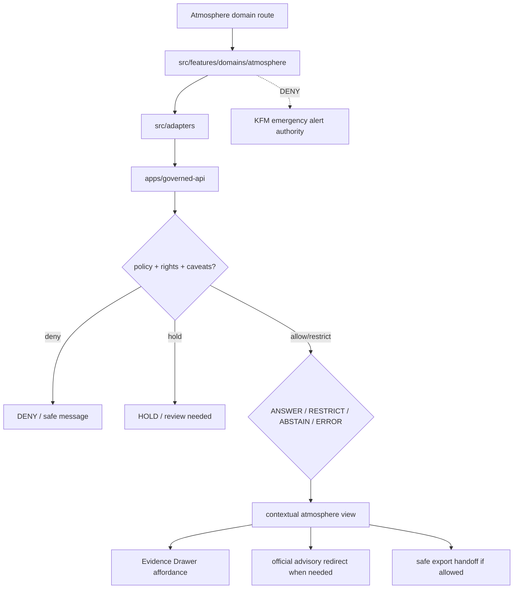

<!-- [KFM_META_BLOCK_V2]
doc_id: kfm://app/explorer-web/src/features/domains/atmosphere/readme
title: Explorer Web Atmosphere Domain Feature README
type: app-readme
version: v0.1
status: draft
owners: OWNER_TBD — Apps steward · UI steward · Atmosphere steward · Governed API steward · Policy steward · Docs steward
created: 2026-06-16
updated: 2026-06-16
policy_label: public
related:
  - ../../README.md
  - ../../../README.md
  - ../../../adapters/README.md
  - ../../../../README.md
  - ../../../../../README.md
  - ../../../../../governed-api/README.md
  - ../../../../../../docs/domains/atmosphere/README.md
  - ../../../../../../docs/domains/atmosphere/SENSITIVITY.md
  - ../../../../../../policy/domains/atmosphere/README.md
  - ../../../../../../packages/ui/README.md
  - ../../../../../../packages/maplibre/README.md
  - ../../../../../../policy/access/README.md
  - ../../../../../../policy/decision/README.md
  - ../../../../../../release/README.md
  - ../../../../../../data/README.md
tags: [kfm, apps, explorer-web, domains, atmosphere, air, weather, climate, smoke, aod, advisory-context, feature]
notes:
  - "Replaces the greenfield atmosphere domain feature stub with a governed feature README."
  - "Atmosphere UI features may compose governed atmosphere envelopes into public/semi-public views, but they must not become emergency alerting, domain doctrine, policy authority, source truth, lifecycle storage, release authority, or model-output truth."
  - "Feature implementation files, route wiring, tests, fixtures, governed API envelopes, disclaimers, receipts, and package scripts remain NEEDS VERIFICATION."
  - "Slug drift air vs atmosphere remains a known conflict; this app path follows the requested atmosphere feature lane and does not resolve schema/contract naming."
[/KFM_META_BLOCK_V2] -->

<a id="top"></a>

<div align="center">

# Explorer Web Atmosphere Domain Feature

`apps/explorer-web/src/features/domains/atmosphere/`

**Domain-specific Explorer Web feature boundary for public-safe atmosphere views: air-quality, weather, smoke, AOD, climate, model-context, and advisory-context surfaces rendered only through governed envelopes.**


[Purpose](#1-purpose) · [Repo fit](#2-repo-fit) · [Boundary](#3-authority-boundary) · [Inputs](#5-inputs) · [Exclusions](#6-exclusions) · [Feature map](#7-atmosphere-feature-map) · [Definition of done](#14-definition-of-done)

</div>

---

> [!IMPORTANT]
> **Status:** draft / `NEEDS VERIFICATION`  
> **Owners:** `OWNER_TBD` — Apps steward · UI steward · Atmosphere steward · Governed API steward · Policy steward · Docs steward  
> **Path:** `apps/explorer-web/src/features/domains/atmosphere/README.md`  
> **Responsibility root:** `apps/` — deployable application surfaces  
> **Truth posture:** CONFIRMED README path / CONFIRMED atmosphere doctrine and sensitivity docs / PROPOSED domain-feature contract / UNKNOWN implementation files, route wiring, tests, fixtures, and runtime behavior

> [!CAUTION]
> Atmosphere UI is **context**, not emergency alerting or life-safety direction. It must redirect to official issuing authorities for advisories and must not collapse AQI into concentration, AOD into PM2.5, model fields into observations, or low-cost sensor values into uncaveated public truth.

---

## Quick jump

- [1. Purpose](#1-purpose)
- [2. Repo fit](#2-repo-fit)
- [3. Authority boundary](#3-authority-boundary)
- [4. Default posture](#4-default-posture)
- [5. Inputs](#5-inputs)
- [6. Exclusions](#6-exclusions)
- [7. Atmosphere feature map](#7-atmosphere-feature-map)
- [8. Diagram](#8-diagram)
- [9. Atmosphere UI obligations](#9-atmosphere-ui-obligations)
- [10. Per-view contract](#10-per-view-contract)
- [11. Inspection path](#11-inspection-path)
- [12. Validation expectations](#12-validation-expectations)
- [13. Safe change pattern](#13-safe-change-pattern)
- [14. Definition of done](#14-definition-of-done)
- [15. Open verification items](#15-open-verification-items)

---

## 1. Purpose

`apps/explorer-web/src/features/domains/atmosphere/` is the proposed app-local feature boundary for Atmosphere/Air-specific Explorer Web surfaces.

It may eventually hold route modules, panels, view models, hooks, and feature orchestration for public-safe atmosphere experiences such as:

- air-quality observations and AQI context;
- PM2.5, ozone, NO2, and other parameter views;
- weather and mesonet observation views;
- smoke plume and AOD context views;
- climate normals, anomalies, and departures;
- forecast/model context views with explicit model labels and uncertainty;
- official advisory context that redirects users to official sources;
- Evidence Drawer and Focus Mode handoffs for atmosphere claims;
- compare/export handoffs that preserve caveats, rights, release state, and stale-state posture.

This directory is not proof that any route, panel, hook, map layer, adapter, test, fixture, package script, or governed API envelope is implemented.

[Back to top](#top)

---

## 2. Repo fit

| Concern | Owning root | Expected relationship |
|---|---|---|
| Atmosphere domain feature source | `apps/explorer-web/src/features/domains/atmosphere/` | App-local Atmosphere/Air UI feature modules, if implemented and tested |
| Feature boundary | `apps/explorer-web/src/features/` | Parent feature/root contract |
| Adapter boundary | `apps/explorer-web/src/adapters/` | Governed API, evidence, layer, map, export, and diagnostics adapters |
| Explorer Web app | `apps/explorer-web/` | Map-first public/semi-public shell |
| Governed API | `apps/governed-api/` | Trust membrane and normal data path |
| Atmosphere doctrine | `docs/domains/atmosphere/` | Domain scope, source roles, sensitivity, publication posture, and verification backlog |
| Atmosphere policy | `policy/domains/atmosphere/` | Atmosphere admissibility and exposure policy, if executable wiring is accepted |
| Shared UI components | `packages/ui/` | Reusable cards, badges, drawers, panels, and legends when shared |
| Renderer wrappers | `packages/maplibre/`, `packages/cesium/` | Renderer behavior stays behind adapter/wrapper boundaries |
| Release authority | `release/` | Publication, correction, supersession, rollback control |
| Lifecycle artifacts | `data/` | Receipts, proofs, registry, catalog, triplets, and published artifacts |

## 3. Authority boundary

This feature renders governed Atmosphere/Air UI. It does not own Atmosphere doctrine, source admission, source rights, sensitivity decisions, policy decisions, schemas, contracts, lifecycle artifacts, release decisions, evidence truth, renderer authority, hazard emergency truth, or AI output.

```text
apps/explorer-web/src/features/domains/atmosphere/ = app-local Atmosphere/Air UI feature
apps/explorer-web/src/features/                    = feature boundary
apps/explorer-web/src/adapters/                    = adapter boundary
apps/governed-api/                                 = trust membrane and normal data path
docs/domains/atmosphere/                           = Atmosphere doctrine and policy intent
policy/domains/atmosphere/                         = Atmosphere policy lane
packages/ui/                                       = shared UI primitives
policy/                                            = finite policy decisions
data/                                              = lifecycle artifacts, receipts, proofs, registries
release/                                           = publication, correction, rollback authority
```

## 4. Default posture

Atmosphere feature modules should fail safe, label uncertainty, and preserve the strictest applicable rights, sensitivity, stale-state, and advisory-boundary posture.

A view should not render claim-bearing atmosphere content when any of these are unresolved:

- governed API envelope and response validation;
- object family or atmosphere domain slug;
- source role and provenance;
- rights or license posture;
- sensitivity tier or exact station siting exposure risk;
- low-cost sensor correction/caveat/confidence posture;
- model-run label and uncertainty posture;
- AQI/concentration or AOD/PM2.5 anti-collapse checks;
- advisory/life-safety redirect requirements;
- EvidenceRef or EvidenceBundle support;
- release, stale-state, correction, or rollback state.

## 5. Inputs

| Input family | Examples | Required posture |
|---|---|---|
| Atmosphere view state | air quality, AQI context, weather, smoke, AOD, climate, forecast/model context | Explicit finite states |
| API envelope | answer, abstain, deny, error, hold, restricted, decision envelope, evidence payload | Runtime-validated before render |
| Layer state | layer manifest, source role, legend, trust badges, valid time, selected feature id | Released or bounded-safe source only |
| Evidence state | EvidenceRef, EvidenceBundle summary, citation validation, proof visibility | Required for claim-bearing detail |
| Sensitivity state | T0 open, T1 generalized station siting, T2 reviewer, T4 rights-unresolved or alert-authority denial | Most restrictive posture wins |
| Caveat state | low-cost sensor correction, model label, uncertainty, stale-state badge, operational disclaimer | Required when applicable |
| Cross-lane state | hazards, agriculture, hydrology, habitat, fauna/flora, settlements, roads joins | Inherits strictest lane posture |
| Export state | selected layer, bounds, citations, caveats, rights, release state, output mode | Governed export only |

## 6. Exclusions

| Does not belong here | Correct home |
|---|---|
| Atmosphere doctrine and scope | `docs/domains/atmosphere/` |
| Atmosphere policy bundles or policy decisions | `policy/domains/atmosphere/`, `policy/` |
| Emergency alerting or life-safety authority | Official issuing authorities and Hazards lane context, not Explorer Web Atmosphere UI |
| Governed API implementation | `apps/governed-api/` |
| Adapter logic shared across feature families | `apps/explorer-web/src/adapters/` |
| Shared reusable UI primitives | `packages/ui/` |
| Renderer wrapper authority | `packages/maplibre/`, `packages/cesium/` |
| Atmosphere schemas and contracts | `schemas/contracts/v1/domains/atmosphere/`, `contracts/domains/atmosphere/` — slug remains `NEEDS VERIFICATION` |
| Lifecycle artifacts, receipts, proofs, catalog, triplets | `data/` |
| Release manifests, rollback cards, correction notices | `release/` |
| Source acquisition or source registry records | `connectors/`, `data/registry/`, source catalog lanes |
| Direct model runtime behavior | `runtime/` behind governed API only |
| Secrets, credentials, tokens, private keys | Secret manager / deployment environment |

## 7. Atmosphere feature map

Exact modules remain `NEEDS VERIFICATION`. Candidate views should be introduced only with route inventory, fixtures, and tests.

| Candidate view | Purpose | Required safeguard | Status |
|---|---|---|---|
| `air-quality` | Show regulatory air observations and parameters | Source role, release state, citation, time labels | PROPOSED |
| `aqi-context` | Show AQI reports as context | AQI ≠ concentration disclaimer | PROPOSED |
| `weather-observations` | Show temperature, wind, precipitation, weather station context | Observation/source/time labels | PROPOSED |
| `smoke-context` | Show smoke plume or hotspot context | Context only; official-source redirect where advisory-like | PROPOSED |
| `aod-context` | Show aerosol optical depth or raster context | AOD ≠ PM2.5 disclaimer and uncertainty | PROPOSED |
| `climate-context` | Show normals, anomalies, departures | Time window and methodology labels | PROPOSED |
| `model-context` | Show forecast/model fields | Model label, uncertainty, stale-state posture | PROPOSED |
| `domain-focus` | Atmosphere Focus Mode UI | Finite outcomes; no direct model truth | PROPOSED |
| `domain-export` | Atmosphere export handoff | Citation, caveat, rights, release checks | PROPOSED |

> [!WARNING]
> Candidate view names are not implementation proof. Do not document a view as runnable until files, route wiring, tests, fixtures, package scripts, and governed API envelopes confirm it.

## 8. Diagram



## 9. Atmosphere UI obligations

| Obligation | Example effect |
|---|---|
| `governed_api_only` | Atmosphere feature state comes through governed API envelopes |
| `not_alerting` | Emergency/life-safety behavior redirects to official issuing authorities |
| `anti_collapse_required` | AQI, AOD, model fields, observations, and low-cost sensors remain clearly distinct |
| `caveat_required` | Low-cost sensors, model fields, stale layers, and advisories carry visible caveats |
| `evidence_required` | Claim-bearing details link to EvidenceBundle-derived payloads |
| `stale_state_visible` | Time and freshness state are visible where material |
| `finite_states_required` | Views render answer, restrict, abstain, deny, error, hold, loading, and empty states safely |
| `safe_export_required` | Export handoff preserves citations, caveats, rights, release, and stale-state constraints |
| `no_authority_fork` | Feature code does not redefine Atmosphere policy, schema, contract, source, release, or evidence logic |

## 10. Per-view contract

Every long-lived Atmosphere domain view should document or encode:

- view purpose and route ownership;
- atmosphere object families and source families consumed;
- governed API envelope or adapter dependency;
- anti-collapse disclaimers and caveats;
- expected finite outcomes;
- evidence/citation display behavior;
- sensitivity, rights, release, stale-state, valid-time, and cross-lane inheritance behavior;
- loading, empty, deny, abstain, error, hold, restricted states;
- official-source redirect behavior where advisory-like;
- export behavior, if any;
- tests and fixtures proving trust-membrane, caveat, and advisory-boundary behavior.

## 11. Inspection path

Atmosphere feature implementation files, route wiring, tests, fixtures, governed API envelopes, caveat metadata, release manifests, package scripts, and export handoff remain `NEEDS VERIFICATION`.

```bash
find apps/explorer-web/src/features/domains/atmosphere -maxdepth 5 -type f | sort
find apps/explorer-web/src apps/governed-api docs/domains/atmosphere policy/domains/atmosphere packages/ui packages/maplibre tests fixtures -maxdepth 6 -type f 2>/dev/null | grep -Ei 'atmosphere|air|weather|climate|smoke|aod|aqi|pm25|ozone|forecast|model|advisory|evidence|export|governed' | sort
find data/raw data/work data/quarantine data/processed data/catalog data/triplets data/published data/receipts data/proofs -maxdepth 2 -type f 2>/dev/null | sort
```

## 12. Validation expectations

Useful validation for this feature boundary should cover:

- no Atmosphere feature imports or reads lifecycle data roots directly;
- claim-bearing Atmosphere views consume governed API envelopes only;
- malformed Atmosphere envelopes render safe error or abstain states;
- emergency/life-safety requests do not render KFM alert authority and redirect to official issuing sources;
- AQI is not displayed as concentration, AOD is not displayed as PM2.5, model fields are not displayed as observations;
- low-cost sensor views preserve correction, caveat, confidence, and limitation metadata;
- exact station siting and sensitive joins are generalized or restricted when required;
- Evidence Drawer handoff preserves EvidenceRef/EvidenceBundle handles;
- Focus Mode renders finite outcomes and never direct model output as truth;
- export handoff requires citation, caveat, rights, release, and stale-state support.

## 13. Safe change pattern

For Atmosphere feature changes:

1. Add or update route inventory and per-view contract.
2. Add fixtures for open, generalized, restricted, denied, held, abstained, malformed, loading, and empty states.
3. Test lifecycle-data denial and governed API-only behavior.
4. Preserve caveats, time/freshness, source-role, release, rights, sensitivity, advisory redirects, and citation fields through UI state.
5. Update this README, parent `features/README.md`, atmosphere docs, and parent app README when public behavior changes.

## 14. Definition of done

- [ ] Owners are confirmed and `OWNER_TBD` is replaced.
- [ ] Atmosphere feature file inventory and route ownership are documented.
- [ ] Governed API and adapter dependencies are explicit.
- [ ] Atmosphere sensitivity, rights, caveat, stale-state, and advisory-boundary states are represented in UI fixtures.
- [ ] Anti-collapse disclaimers survive feature composition.
- [ ] Direct lifecycle-data import/read checks are covered.
- [ ] Official-source redirect behavior is tested for advisory-like states.
- [ ] Finite states cover answer, restrict, abstain, deny, error, hold, loading, and empty cases.
- [ ] Export and Focus Mode handoffs are tested for safe output if present.

## 15. Open verification items

| Item | Why it matters |
|---|---|
| Confirm Atmosphere feature implementation files beyond README | Prevents overclaiming feature maturity |
| Confirm route inventory | Required for public/semi-public UI boundary review |
| Confirm governed API Atmosphere envelopes | Required for trust membrane enforcement |
| Confirm slug decision for air vs atmosphere schema/contract paths | Prevents silent path drift |
| Confirm caveat and anti-collapse fixtures | Required before claim-bearing Atmosphere UI claims |
| Confirm Focus Mode and Evidence Drawer behavior | Required before claim-bearing UI claims |
| Confirm export handoff | Required before public download workflows |
| Confirm package scripts beyond TODO | Required before build/test claims |

<details>
<summary>Appendix A — no-loss preservation note</summary>

The previous README was a greenfield stub. This replacement adds a bounded Atmosphere domain-feature contract without claiming Atmosphere routes, panels, hooks, adapters, fixtures, tests, package scripts, governed API envelopes, caveat metadata, release manifests, Focus Mode, Evidence Drawer, or export handoff are implemented.

</details>

## Status summary

`apps/explorer-web/src/features/domains/atmosphere/` should contain Atmosphere/Air-specific Explorer Web feature modules only after route contracts, governed API envelopes, caveat/stale-state posture, fixtures, tests, Evidence Drawer behavior, Focus Mode behavior, and export handoff are verified.

It must preserve the trust membrane and Atmosphere boundary: the feature may show air-quality, weather, smoke, AOD, climate, model, and advisory context, but it must not become emergency alerting, Atmosphere truth, policy authority, release authority, lifecycle storage, direct model-output truth, or a path around official issuing authorities.

<p align="right"><a href="#top">Back to top</a></p>
