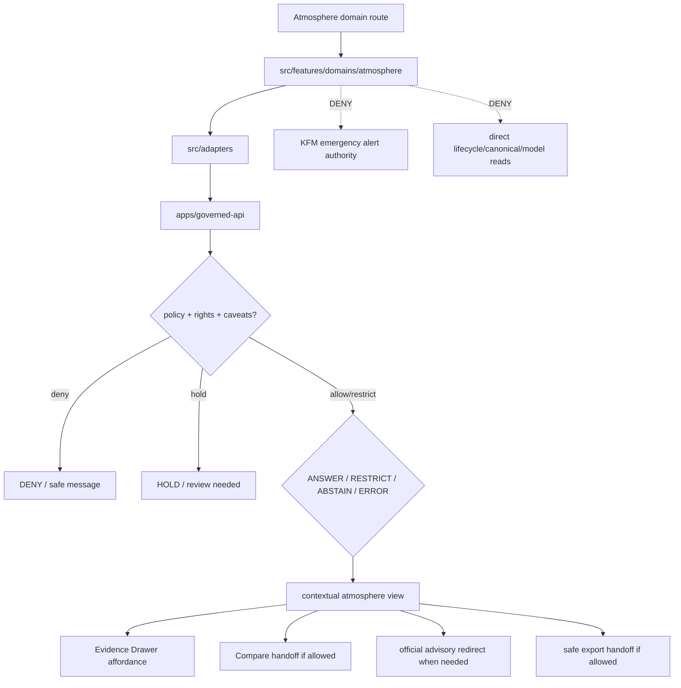

<!-- [KFM_META_BLOCK_V2]
doc_id: kfm://app/explorer-web/src/features/domains/atmosphere/readme
title: Explorer Web Atmosphere Domain Feature README
type: app-readme
version: v0.2
status: draft
owners: OWNER_TBD — Apps steward · UI steward · Atmosphere steward · Governed API steward · Policy steward · Docs steward
created: 2026-06-16
updated: 2026-07-09
policy_label: public
related:
  - ../../README.md
  - ../../../README.md
  - ../../../adapters/README.md
  - ../../../../README.md
  - ../../../../../README.md
  - ../../../../../governed-api/README.md
  - ../../../../../../README.md
  - ../../../../../../SECURITY.md
  - ../../../../../../docs/domains/atmosphere/README.md
  - ../../../../../../docs/domains/atmosphere/SENSITIVITY.md
  - ../../../../../../policy/domains/atmosphere/README.md
  - ../../../../../../packages/ui/README.md
  - ../../../../../../packages/maplibre/README.md
  - ../../../../../../packages/cesium/README.md
  - ../../../../../../policy/access/README.md
  - ../../../../../../policy/decision/README.md
  - ../../../../../../release/README.md
  - ../../../../../../data/README.md
  - ../../../../../../tools/validators/README.md
  - ../../../../../../tools/watchers/README.md
tags: [kfm, apps, explorer-web, domains, atmosphere, air, weather, climate, smoke, aod, advisory-context, feature, no-direct-data-root, anti-collapse]
notes:
  - "v0.2 updates the uploaded Atmosphere domain-feature README into a current repo-aware feature contract."
  - "apps/explorer-web/src/features/domains/atmosphere/README.md, apps/explorer-web/src/features/README.md, docs/domains/atmosphere/README.md, docs/domains/atmosphere/SENSITIVITY.md, and policy/domains/atmosphere/README.md were verified through the GitHub app in this update. Prior related Explorer Web adapter/source/app boundaries remain relevant, but adapter files, routes, runtime wiring, tests, and envelopes remain NEEDS VERIFICATION."
  - "Feature implementation files, route wiring, domain-view inventory, tests, fixtures, governed API envelopes, disclaimers, receipts, advisory redirects, export handoff, Focus Mode behavior, Evidence Drawer behavior, package scripts, runtime behavior, and deployment behavior remain NEEDS VERIFICATION."
  - "Atmosphere UI features may compose governed atmosphere envelopes into public/semi-public views, but they must not become emergency alerting, domain doctrine, policy authority, source truth, lifecycle storage, release authority, direct model-output truth, or a path around official issuing authorities."
  - "Slug drift air vs atmosphere remains a known conflict; this app path follows the requested atmosphere feature lane and does not resolve schema/contract naming."
[/KFM_META_BLOCK_V2] -->

<a id="top"></a>

<div align="center">

# Explorer Web Atmosphere Domain Feature

`apps/explorer-web/src/features/domains/atmosphere/`

**Domain-specific Explorer Web feature boundary for public-safe atmosphere views: air-quality, weather, smoke, AOD, climate, model-context, and advisory-context surfaces rendered only through governed envelopes.**


[Purpose](#1-purpose) · [Current evidence](#2-current-repo-evidence) · [Repo fit](#3-repo-fit) · [Boundary](#4-authority-boundary) · [Inputs](#6-inputs) · [Exclusions](#7-exclusions) · [Feature map](#8-atmosphere-feature-map) · [Definition of done](#15-definition-of-done)

</div>

---

> [!IMPORTANT]
> **Status:** draft / current README surface confirmed / implementation behavior `NEEDS VERIFICATION`  
> **Owners:** `OWNER_TBD` — Apps steward · UI steward · Atmosphere steward · Governed API steward · Policy steward · Docs steward  
> **Path:** `apps/explorer-web/src/features/domains/atmosphere/README.md`  
> **Responsibility root:** `apps/` — deployable application surfaces  
> **Truth posture:** CONFIRMED README path and supporting Atmosphere docs/policy README surfaces / PROPOSED domain-feature contract / UNKNOWN implementation files, route wiring, domain-view inventory, tests, fixtures, governed API envelopes, disclaimers, receipts, advisory redirects, export handoff, Focus Mode behavior, Evidence Drawer behavior, package scripts, runtime behavior, and deployment behavior

> [!CAUTION]
> Atmosphere UI is **context**, not emergency alerting or life-safety direction. It must redirect advisory-like states to official issuing authorities and must not collapse AQI into concentration, AOD into PM2.5, model fields into observations, low-cost sensor values into uncaveated public truth, or weather/smoke context into Hazards authority.

---

## Quick jump

- [1. Purpose](#1-purpose)
- [2. Current repo evidence](#2-current-repo-evidence)
- [3. Repo fit](#3-repo-fit)
- [4. Authority boundary](#4-authority-boundary)
- [5. Default posture](#5-default-posture)
- [6. Inputs](#6-inputs)
- [7. Exclusions](#7-exclusions)
- [8. Atmosphere feature map](#8-atmosphere-feature-map)
- [9. Diagram](#9-diagram)
- [10. Atmosphere UI obligations](#10-atmosphere-ui-obligations)
- [11. Per-view contract](#11-per-view-contract)
- [12. Inspection path](#12-inspection-path)
- [13. Validation expectations](#13-validation-expectations)
- [14. Safe change pattern](#14-safe-change-pattern)
- [15. Definition of done](#15-definition-of-done)
- [16. Open verification items](#16-open-verification-items)

---

## 1. Purpose

`apps/explorer-web/src/features/domains/atmosphere/` is the proposed app-local feature boundary for Atmosphere/Air-specific Explorer Web surfaces.

It may eventually hold route modules, panels, view models, hooks, and feature orchestration for public-safe atmosphere experiences such as:

- air-quality observations and AQI context;
- PM2.5, ozone, NO2, and other parameter views;
- weather and mesonet observation views;
- smoke plume and AOD context views;
- climate normals, anomalies, and departures;
- forecast/model context views with explicit model labels and uncertainty;
- official advisory context that redirects users to official sources;
- Evidence Drawer and Focus Mode handoffs for atmosphere claims;
- compare/export handoffs that preserve caveats, rights, release state, stale-state posture, and advisory boundaries.

This directory is not proof that any route, panel, hook, map layer, adapter, test, fixture, package script, governed API envelope, caveat metadata, disclaimer, receipt, advisory redirect, Evidence Drawer behavior, Focus Mode behavior, export handoff, or runtime wiring is implemented.

[Back to top](#top)

---

## 2. Current repo evidence

| Surface | Status | What it proves | What it does **not** prove |
|---|---|---|---|
| `apps/explorer-web/src/features/domains/atmosphere/README.md` | **CONFIRMED README** | This README exists and has been updated to v0.2. | Atmosphere UI implementation files, route wiring, domain-view inventory, tests, fixtures, governed API envelopes, receipts, advisory redirects, export handoff, or runtime behavior. |
| `apps/explorer-web/src/features/README.md` | **CONFIRMED parent features README** | Parent feature boundary exists and says feature modules must not treat map features, tiles, local files, model text, or lifecycle data as claim truth. | That domain feature modules, route inventory, tests, fixtures, or runtime wiring exist. |
| `apps/explorer-web/src/adapters/README.md` | **CONFIRMED prior related boundary** | Adapter README was previously verified in this session as the governed API / renderer / evidence / layer / export / diagnostics adapter boundary. | That atmosphere adapters or governed API client adapters are implemented. |
| `docs/domains/atmosphere/README.md` | **CONFIRMED domain-doc surface** | Atmosphere/Air/Climate domain lane is a human-facing control surface; it is context, not emergency alerting, and records slug drift `air` vs `atmosphere` as conflicted. | That app UI behavior, schemas, validators, policy bundles, source descriptors, or releases are implemented. |
| `docs/domains/atmosphere/SENSITIVITY.md` | **CONFIRMED sensitivity-doc surface** | Atmosphere/Air sensitivity docs define tiering, advisory/life-safety boundary, sensitive cross-lane joins, and deny-by-default cases. | That executable policy or UI enforcement is wired. |
| `policy/domains/atmosphere/README.md` | **CONFIRMED policy-lane scaffold** | Atmosphere policy-lane README exists. | It is still a greenfield scaffold and does not prove concrete policy files, tests, fixtures, CI binding, or runtime enforcement. |
| `apps/explorer-web/src/features/domains/README.md` | **NOT VERIFIED** | A parent domain-feature README was not confirmed in this update. | Does not prove absence across all refs; a future index remains useful if accepted. |
| Uploaded Atmosphere Markdown | **CONFIRMED source text for this update** | Provided the base Atmosphere domain-feature contract updated here. | Does not prove live implementation. |
| Implementation beyond README | **NEEDS VERIFICATION** | Checkable by repo scan, route inventory, fixtures, tests, package scripts, governed API envelopes, receipts, and runtime evidence. | Not claimed by this README. |

[Back to top](#top)

---

## 3. Repo fit

| Concern | Owning root | Expected relationship |
|---|---|---|
| Atmosphere domain feature source | `apps/explorer-web/src/features/domains/atmosphere/` | App-local Atmosphere/Air UI feature modules, if implemented and tested. |
| Feature boundary | `apps/explorer-web/src/features/` | Parent feature/root contract. |
| Domain-feature parent index | `apps/explorer-web/src/features/domains/` | **NEEDS VERIFICATION**; parent README was not confirmed in this update. |
| Adapter boundary | `apps/explorer-web/src/adapters/` | Governed API, evidence, layer, map, export, and diagnostics adapters. |
| Explorer Web source tree | `apps/explorer-web/src/` | Parent source-layout boundary. |
| Explorer Web app | `apps/explorer-web/` | Map-first public/semi-public shell. |
| Governed API | `apps/governed-api/` | Trust membrane and normal claim-bearing data path. |
| Atmosphere doctrine | `docs/domains/atmosphere/` | Domain scope, source roles, sensitivity, publication posture, and verification backlog. |
| Atmosphere policy | `policy/domains/atmosphere/` | Atmosphere admissibility and exposure policy lane, if executable wiring is accepted. |
| Hazards lane | `docs/domains/hazards/`, `policy/domains/hazards/` | Emergency/hazard truth and life-safety posture; Atmosphere may provide context only. |
| Shared UI components | `packages/ui/` | Reusable cards, badges, drawers, panels, and legends when shared. |
| Renderer wrappers | `packages/maplibre/`, `packages/cesium/` | Renderer behavior stays behind adapter/wrapper boundaries. |
| Release authority | `release/` | Publication, correction, supersession, rollback control. |
| Lifecycle artifacts | `data/` | Receipts, proofs, registry, catalog, triplets, and published artifacts. |
| Security posture | `SECURITY.md`, `docs/security/` | Secrets, sensitive-output, incident, exposure, and audit posture. |

[Back to top](#top)

---

## 4. Authority boundary

This feature renders governed Atmosphere/Air UI. It does not own Atmosphere doctrine, source admission, source rights, sensitivity decisions, policy decisions, schemas, contracts, lifecycle artifacts, release decisions, evidence truth, renderer authority, hazard emergency truth, official advisory authority, or AI output.

```text
apps/explorer-web/src/features/domains/atmosphere/ = app-local Atmosphere/Air UI feature
apps/explorer-web/src/features/                    = feature boundary
apps/explorer-web/src/adapters/                    = adapter boundary
apps/explorer-web/src/                             = Explorer Web implementation source
apps/explorer-web/                                 = map-first public/semi-public app boundary
apps/governed-api/                                 = trust membrane and normal data path
docs/domains/atmosphere/                           = Atmosphere doctrine and policy intent
policy/domains/atmosphere/                         = Atmosphere policy lane
packages/ui/                                       = shared UI primitives
packages/maplibre/                                 = renderer wrapper
packages/cesium/                                   = optional gated renderer wrapper
policy/                                            = finite policy decisions
schemas/                                           = machine-readable shape
contracts/                                         = object meaning
data/                                              = lifecycle artifacts, receipts, proofs, registries
release/                                           = publication, correction, rollback authority
```

Safe interpretation:

- **CONFIRMED:** this README surface, parent Explorer Web feature README, Atmosphere domain docs, Atmosphere sensitivity doc, and Atmosphere policy-lane scaffold exist.
- **PROPOSED:** Atmosphere feature modules may live here when they preserve governed API, source-role, evidence, sensitivity, rights, caveat, stale-state, advisory-boundary, model-label, release, correction, rollback, export, and public-boundary constraints.
- **NEEDS VERIFICATION:** Atmosphere modules, route wiring, domain-view inventory, adapter dependencies, fixtures, tests, package scripts, governed API envelopes, caveat metadata, receipts, disclaimers, official-source redirects, export handoff, Evidence Drawer behavior, Focus Mode behavior, runtime behavior, and deployment behavior.
- **DENY:** using this feature as emergency alerting, life-safety authority, Atmosphere truth, Hazards truth, policy authority, source authority, release authority, lifecycle store, schema/contract home, direct canonical/internal store client, direct model-output surface, renderer authority, export authority, or public-data shortcut.

[Back to top](#top)

---

## 5. Default posture

Atmosphere feature modules should fail safe, label uncertainty, distinguish data families, and preserve the strictest applicable rights, sensitivity, stale-state, and advisory-boundary posture.

A view should not render claim-bearing atmosphere content when any of these are unresolved:

- governed API envelope and response validation;
- object family or atmosphere domain slug;
- source role and provenance;
- rights or license posture;
- sensitivity tier or exact station-siting exposure risk;
- low-cost sensor correction/caveat/confidence posture;
- model-run label and uncertainty posture;
- AQI/concentration anti-collapse support;
- AOD/PM2.5 anti-collapse support;
- observation/model/advisory-context distinction;
- advisory/life-safety official-source redirect requirements;
- EvidenceRef or EvidenceBundle support;
- release, stale-state, correction, or rollback state.

[Back to top](#top)

---

## 6. Inputs

| Input family | Examples | Required posture |
|---|---|---|
| Atmosphere view state | air quality, AQI context, weather, smoke, AOD, climate, forecast/model context | Explicit finite states. |
| API envelope | answer, abstain, deny, error, hold, restricted, decision envelope, evidence payload | Runtime-validated before render. |
| Layer state | layer manifest, source role, legend, trust badges, valid time, selected feature id | Released or bounded-safe source only. |
| Evidence state | EvidenceRef, EvidenceBundle summary, citation validation, proof visibility | Required for claim-bearing detail. |
| Sensitivity state | open, generalized station siting, reviewer-only, rights-unresolved, advisory-boundary denial | Most restrictive posture wins. |
| Caveat state | low-cost sensor correction, model label, uncertainty, stale-state badge, operational disclaimer | Required when applicable. |
| Cross-lane state | hazards, agriculture, hydrology, habitat, fauna/flora, settlements, roads joins | Inherits strictest lane posture. |
| Advisory state | official source, advisory-like marker, life-safety redirect, issue time, expiration/stale-state | Official-source redirect required. |
| Release/correction state | release ref, rollback target, correction notice, supersession state | Required for public-facing claim and export support. |
| Export state | selected layer, bounds, citations, caveats, rights, release state, output mode | Governed export only. |
| Focus Mode state | prompt class, finite outcome, evidence handles, policy result | No direct model output as truth. |

[Back to top](#top)

---

## 7. Exclusions

| Does not belong here | Correct home |
|---|---|
| Atmosphere doctrine and scope | `docs/domains/atmosphere/` |
| Atmosphere policy bundles or policy decisions | `policy/domains/atmosphere/`, `policy/` |
| Emergency alerting or life-safety authority | Official issuing authorities and Hazards lane context, not Explorer Web Atmosphere UI. |
| Governed API implementation | `apps/governed-api/` |
| Adapter logic shared across feature families | `apps/explorer-web/src/adapters/` |
| Shared reusable UI primitives | `packages/ui/` |
| Renderer wrapper authority | `packages/maplibre/`, `packages/cesium/` |
| Atmosphere schemas and contracts | `schemas/contracts/v1/domains/atmosphere/`, `contracts/domains/atmosphere/` — slug remains `NEEDS VERIFICATION` |
| Lifecycle artifacts, receipts, proofs, catalog, triplets | `data/` |
| Release manifests, rollback cards, correction notices | `release/` |
| Source acquisition or source registry records | `connectors/`, `data/registry/`, source catalog lanes |
| Direct RAW / WORK / QUARANTINE / PROCESSED / CATALOG / TRIPLET / PUBLISHED reads | governed API, released artifacts, layer manifests, and bounded public-safe envelopes only |
| Direct model runtime behavior | `runtime/` behind governed API only |
| Secrets, credentials, tokens, private keys, exact restricted station details, source-restricted records | secret manager / deployment environment, not UI feature source or examples |
| Public-sensitive exports, exact restricted locations, living-person/DNA details, prompt/model traces | denied unless separately governed and public-safe |

[Back to top](#top)

---

## 8. Atmosphere feature map

Exact modules remain `NEEDS VERIFICATION`. Candidate views should be introduced only with route inventory, fixtures, governed API envelopes, caveat metadata, receipts, official-source redirect behavior, and tests.

| Candidate view | Purpose | Required safeguard | Status |
|---|---|---|---|
| `air-quality` | Show regulatory air observations and parameters. | Source role, release state, citation, time labels. | PROPOSED |
| `aqi-context` | Show AQI reports as context. | AQI is not concentration disclaimer. | PROPOSED |
| `weather-observations` | Show temperature, wind, precipitation, weather station context. | Observation/source/time labels. | PROPOSED |
| `smoke-context` | Show smoke plume or hotspot context. | Context only; official-source redirect where advisory-like. | PROPOSED |
| `aod-context` | Show aerosol optical depth or raster context. | AOD is not PM2.5 disclaimer and uncertainty. | PROPOSED |
| `climate-context` | Show normals, anomalies, departures. | Time window and methodology labels. | PROPOSED |
| `model-context` | Show forecast/model fields. | Model label, uncertainty, stale-state posture. | PROPOSED |
| `advisory-redirect` | Route advisory-like states to official issuing authorities. | KFM does not become alert authority. | PROPOSED |
| `domain-focus` | Atmosphere Focus Mode UI. | Finite outcomes; no direct model truth. | PROPOSED |
| `domain-export` | Atmosphere export handoff. | Citation, caveat, rights, release checks. | PROPOSED |
| `domain-compare` | Atmosphere compare handoff. | Time, freshness, caveat, release, and provenance preserved. | PROPOSED |
| `correction-status` | Public-safe stale/supersession/correction status. | Release/correction refs only; no unsupported claims. | PROPOSED |

> [!WARNING]
> Candidate view names are not implementation proof. Do not document a view as runnable until files, route wiring, tests, fixtures, package scripts, receipts, caveat metadata, official-source redirects, and governed API envelopes confirm it.

[Back to top](#top)

---

## 9. Diagram



[Back to top](#top)

---

## 10. Atmosphere UI obligations

| Obligation | Example effect |
|---|---|
| `governed_api_only` | Atmosphere feature state comes through governed API envelopes. |
| `not_alerting` | Emergency/life-safety behavior redirects to official issuing authorities. |
| `anti_collapse_required` | AQI, AOD, model fields, observations, advisories, and low-cost sensors remain clearly distinct. |
| `caveat_required` | Low-cost sensors, model fields, stale layers, and advisory-like contexts carry visible caveats. |
| `evidence_required` | Claim-bearing details link to EvidenceBundle-derived payloads. |
| `stale_state_visible` | Time and freshness state are visible where material. |
| `finite_states_required` | Views render answer, restrict, abstain, deny, error, hold, loading, and empty states safely. |
| `official_redirect_required` | Advisory-like states do not make KFM the issuer and point to official sources. |
| `safe_compare_required` | Compare handoff preserves time, freshness, caveats, provenance, and release state. |
| `safe_export_required` | Export handoff preserves citations, caveats, rights, release, and stale-state constraints. |
| `no_authority_fork` | Feature code does not redefine Atmosphere policy, schema, contract, source, release, or evidence logic. |
| `no_data_root_shortcut` | Feature code does not read lifecycle data roots, canonical/internal stores, local source files, or model output as claim sources. |
| `local_parity_preferred` | Atmosphere fixtures/tests should be runnable locally and in CI with the same inputs where practical. |

[Back to top](#top)

---

## 11. Per-view contract

Every long-lived Atmosphere domain view should document or encode:

- view purpose and route ownership;
- atmosphere object families and source families consumed;
- governed API envelope or adapter dependency;
- anti-collapse disclaimers and caveats;
- expected finite outcomes;
- evidence/citation display behavior;
- sensitivity, rights, release, stale-state, valid-time, and cross-lane inheritance behavior;
- loading, empty, deny, abstain, error, hold, restricted states;
- official-source redirect behavior where advisory-like;
- direct lifecycle/canonical/model-output denial posture;
- compare, Focus Mode, Evidence Drawer, or export behavior, if any;
- tests and fixtures proving trust-membrane, caveat, anti-collapse, and advisory-boundary behavior.

[Back to top](#top)

---

## 12. Inspection path

Atmosphere feature implementation files, route wiring, tests, fixtures, governed API envelopes, caveat metadata, release manifests, package scripts, and export handoff remain `NEEDS VERIFICATION`.

```bash
find apps/explorer-web/src/features/domains/atmosphere -maxdepth 5 -type f | sort
find apps/explorer-web/src apps/governed-api docs/domains/atmosphere policy/domains/atmosphere packages/ui packages/maplibre tests fixtures -maxdepth 6 -type f 2>/dev/null | grep -Ei 'atmosphere|air|weather|climate|smoke|aod|aqi|pm25|ozone|forecast|model|advisory|evidence|export|governed' | sort
find data/raw data/work data/quarantine data/processed data/catalog data/triplets data/published data/receipts data/proofs -maxdepth 2 -type f 2>/dev/null | sort
```

[Back to top](#top)

---

## 13. Validation expectations

Useful validation for this feature boundary should cover:

- no Atmosphere feature imports or reads lifecycle data roots directly;
- claim-bearing Atmosphere views consume governed API envelopes only;
- malformed Atmosphere envelopes render safe error or abstain states;
- emergency/life-safety requests do not render KFM alert authority and redirect to official issuing sources;
- AQI is not displayed as concentration, AOD is not displayed as PM2.5, model fields are not displayed as observations, and low-cost sensors are not displayed as uncaveated public truth;
- low-cost sensor views preserve correction, caveat, confidence, and limitation metadata;
- exact station siting and sensitive joins are generalized, restricted, held, or denied when required;
- cross-lane sensitive joins inherit the strictest lane posture;
- Evidence Drawer handoff preserves EvidenceRef/EvidenceBundle handles;
- Focus Mode renders finite outcomes and never direct model output as truth;
- compare and export handoffs require citation, caveat, rights, release, stale-state, and correction/rollback support;
- UI output does not expose secrets, exact restricted locations, source-restricted records, private data, or prompt/model traces.

[Back to top](#top)

---

## 14. Safe change pattern

For Atmosphere feature changes:

1. Add or update route inventory and per-view contract.
2. Add fixtures for open, generalized, restricted, denied, held, abstained, malformed, loading, and empty states.
3. Test lifecycle-data denial and governed API-only behavior.
4. Preserve caveats, time/freshness, source-role, release, rights, sensitivity, advisory redirects, and citation fields through UI state.
5. Verify anti-collapse checks for AQI/concentration, AOD/PM2.5, model/observation, and advisory/context behavior.
6. Verify compare, export, Focus Mode, and Evidence Drawer handoffs cannot bypass policy, caveat, evidence, release, correction, or rollback checks.
7. Update this README, parent `features/README.md`, adapter README, atmosphere docs, policy README, and parent app README when public behavior changes.

[Back to top](#top)

---

## 15. Definition of done

- [ ] Owners are confirmed and `OWNER_TBD` is replaced.
- [ ] Atmosphere feature file inventory and route ownership are documented.
- [ ] Governed API and adapter dependencies are explicit.
- [ ] Atmosphere sensitivity, rights, caveat, stale-state, and advisory-boundary states are represented in UI fixtures.
- [ ] Anti-collapse disclaimers survive feature composition.
- [ ] Direct lifecycle-data import/read checks are covered.
- [ ] Official-source redirect behavior is tested for advisory-like states.
- [ ] Cross-lane sensitivity inheritance is tested.
- [ ] Finite states cover answer, restrict, abstain, deny, error, hold, loading, and empty cases.
- [ ] Evidence Drawer, Focus Mode, Compare, and Export handoffs are tested for safe output if present.
- [ ] Parent feature/adapter/source/app READMEs and Atmosphere docs/policy surfaces are updated when public behavior changes.

[Back to top](#top)

---

## 16. Open verification items

| Item | Why it matters |
|---|---|
| Confirm Atmosphere feature implementation files beyond README | Prevents overclaiming feature maturity. |
| Confirm route inventory | Required for public/semi-public UI boundary review. |
| Confirm governed API Atmosphere envelopes | Required for trust membrane enforcement. |
| Confirm adapter dependency shape | Required so Atmosphere UI does not bypass governed adapters. |
| Confirm slug decision for `air` vs `atmosphere` schema/contract paths | Prevents silent path drift. |
| Confirm caveat and anti-collapse fixtures | Required before claim-bearing Atmosphere UI claims. |
| Confirm official-source redirect behavior | Required before advisory-like UI claims. |
| Confirm Focus Mode and Evidence Drawer behavior | Required before claim-bearing UI claims. |
| Confirm Compare handoff | Required before visual-difference claims. |
| Confirm export handoff | Required before public download workflows. |
| Confirm direct data-root denial | Required for public client trust membrane. |
| Confirm executable Atmosphere policy binding | Required before enforcement claims. |
| Confirm package scripts beyond TODO | Required before build/test claims. |

<details>
<summary>Appendix A — no-loss preservation note</summary>

The uploaded README replaced a greenfield Atmosphere domain-feature stub with a bounded Atmosphere feature contract without claiming Atmosphere routes, panels, hooks, adapters, fixtures, tests, package scripts, governed API envelopes, caveat metadata, release manifests, Focus Mode, Evidence Drawer, Compare, or export handoff are implemented. This v0.2 update preserves that structure while adding current repo evidence, parent feature linkage, supporting Atmosphere docs/policy evidence, stronger no-direct-data-root language, anti-collapse posture, advisory redirect posture, stale/correction/rollback posture, compare/export handoff posture, local-parity expectations, and expanded verification items.

Slug drift between `air` and `atmosphere` remains unresolved here by design. This README documents the requested app feature path and does not decide schema, contract, package, policy, or API naming.

</details>

## Status summary

`apps/explorer-web/src/features/domains/atmosphere/` should contain Atmosphere/Air-specific Explorer Web feature modules only after route contracts, governed API envelopes, caveat/stale-state posture, fixtures, tests, Evidence Drawer behavior, Focus Mode behavior, Compare behavior, and export handoff are verified.

It must preserve the trust membrane and Atmosphere boundary: the feature may show air-quality, weather, smoke, AOD, climate, model, and advisory context, but it must not become emergency alerting, Atmosphere truth, Hazards truth, policy authority, release authority, lifecycle storage, direct model-output truth, or a path around official issuing authorities.

<p align="right"><a href="#top">Back to top</a></p>
