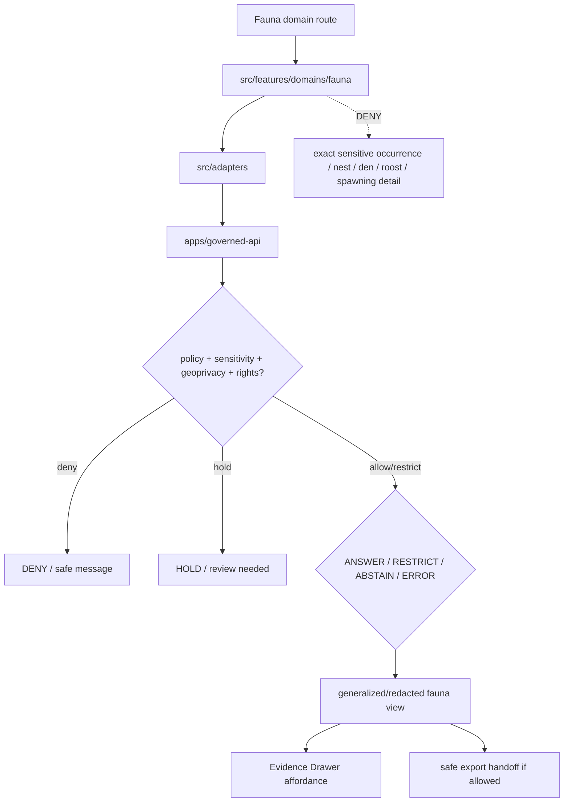

<!-- [KFM_META_BLOCK_V2]
doc_id: kfm://app/explorer-web/src/features/domains/fauna/readme
title: Explorer Web Fauna Domain Feature README
type: app-readme
version: v0.1
status: draft
owners: OWNER_TBD — Apps steward · UI steward · Fauna steward · Sensitivity reviewer · Governed API steward · Policy steward · Docs steward
created: 2026-06-16
updated: 2026-06-16
policy_label: public
related:
  - ../../README.md
  - ../../../README.md
  - ../../../adapters/README.md
  - ../../../../README.md
  - ../../../../../README.md
  - ../../../../../governed-api/README.md
  - ../../../../../../docs/domains/fauna/README.md
  - ../../../../../../docs/domains/fauna/SENSITIVITY.md
  - ../../../../../../policy/domains/fauna/README.md
  - ../../../../../../policy/sensitivity/fauna/
  - ../../../../../../packages/ui/README.md
  - ../../../../../../packages/maplibre/README.md
  - ../../../../../../policy/access/README.md
  - ../../../../../../policy/decision/README.md
  - ../../../../../../release/README.md
  - ../../../../../../data/README.md
tags: [kfm, apps, explorer-web, domains, fauna, feature, sensitive-occurrence, geoprivacy, redaction, evidence-drawer, map-first]
notes:
  - "Replaces the greenfield fauna domain feature stub with a governed feature README."
  - "Fauna UI features may compose governed fauna envelopes into public/semi-public views, but they must not expose exact sensitive occurrence geometry, nests, dens, roosts, hibernacula, spawning sites, steward-controlled records, or re-identifying joins without reviewed, receipt-backed policy support."
  - "Feature implementation files, route wiring, tests, fixtures, governed API envelopes, RedactionReceipts, AggregationReceipts, ReviewRecords, PolicyDecisions, and package scripts remain NEEDS VERIFICATION."
[/KFM_META_BLOCK_V2] -->

<a id="top"></a>

<div align="center">

# Explorer Web Fauna Domain Feature

`apps/explorer-web/src/features/domains/fauna/`

**Domain-specific Explorer Web feature boundary for public-safe fauna views: generalized occurrences, range summaries, monitoring context, seasonal movement context, invasive-species views, Evidence Drawer handoffs, Focus Mode answers, and release-aware map surfaces rendered only through governed envelopes.**


[Purpose](#1-purpose) · [Repo fit](#2-repo-fit) · [Boundary](#3-authority-boundary) · [Inputs](#5-inputs) · [Exclusions](#6-exclusions) · [Feature map](#7-fauna-feature-map) · [Definition of done](#14-definition-of-done)

</div>

---

> [!IMPORTANT]
> **Status:** draft / `NEEDS VERIFICATION`  
> **Owners:** `OWNER_TBD` — Apps steward · UI steward · Fauna steward · Sensitivity reviewer · Governed API steward · Policy steward · Docs steward  
> **Path:** `apps/explorer-web/src/features/domains/fauna/README.md`  
> **Responsibility root:** `apps/` — deployable application surfaces  
> **Truth posture:** CONFIRMED README path / CONFIRMED fauna doctrine and sensitivity docs / PROPOSED domain-feature contract / UNKNOWN implementation files, route wiring, tests, fixtures, and runtime behavior

> [!CAUTION]
> Fauna is a geoprivacy-sensitive lane. Public UI must fail closed for exact sensitive-taxon occurrences, nests, dens, roosts, hibernacula, spawning sites, steward-controlled records, private-parcel joins, and re-identifying combinations unless a documented geoprivacy transform and recorded review state authorize a bounded public-safe output.

---

## Quick jump

- [1. Purpose](#1-purpose)
- [2. Repo fit](#2-repo-fit)
- [3. Authority boundary](#3-authority-boundary)
- [4. Default posture](#4-default-posture)
- [5. Inputs](#5-inputs)
- [6. Exclusions](#6-exclusions)
- [7. Fauna feature map](#7-fauna-feature-map)
- [8. Diagram](#8-diagram)
- [9. Fauna UI obligations](#9-fauna-ui-obligations)
- [10. Per-view contract](#10-per-view-contract)
- [11. Inspection path](#11-inspection-path)
- [12. Validation expectations](#12-validation-expectations)
- [13. Safe change pattern](#13-safe-change-pattern)
- [14. Definition of done](#14-definition-of-done)
- [15. Open verification items](#15-open-verification-items)

---

## 1. Purpose

`apps/explorer-web/src/features/domains/fauna/` is the proposed app-local feature boundary for Fauna-specific Explorer Web surfaces.

It may eventually hold route modules, panels, view models, hooks, and feature orchestration for public-safe fauna experiences such as:

- generalized occurrence and monitoring maps;
- range, seasonal range, and migration-context summaries;
- public-safe invasive-species and mortality/disease context;
- sensitive-taxon denial, restriction, and stewardship-status messaging;
- Evidence Drawer handoffs that show only governed, redacted, audience-appropriate payloads;
- Focus Mode bounded fauna answers with citation discipline and AIReceipt support;
- compare/export handoffs that preserve geoprivacy, redaction, review, rights, release, and rollback state.

This directory is not proof that any route, panel, hook, map layer, adapter, test, fixture, package script, or governed API envelope is implemented.

[Back to top](#top)

---

## 2. Repo fit

| Concern | Owning root | Expected relationship |
|---|---|---|
| Fauna domain feature source | `apps/explorer-web/src/features/domains/fauna/` | App-local Fauna UI feature modules, if implemented and tested |
| Feature boundary | `apps/explorer-web/src/features/` | Parent feature/root contract |
| Adapter boundary | `apps/explorer-web/src/adapters/` | Governed API, evidence, layer, map, export, and diagnostics adapters |
| Explorer Web app | `apps/explorer-web/` | Map-first public/semi-public shell |
| Governed API | `apps/governed-api/` | Trust membrane and normal data path |
| Fauna doctrine | `docs/domains/fauna/` | Domain scope, source roles, sensitivity, object families, and verification backlog |
| Fauna policy | `policy/domains/fauna/`, `policy/sensitivity/fauna/` | Fauna admissibility, geoprivacy, and exposure policy, if executable wiring is accepted |
| Shared UI components | `packages/ui/` | Reusable cards, badges, drawers, panels, and legends when shared |
| Renderer wrappers | `packages/maplibre/`, `packages/cesium/` | Renderer behavior stays behind adapter/wrapper boundaries |
| Release authority | `release/` | Publication, correction, supersession, rollback control |
| Lifecycle artifacts | `data/` | Receipts, proofs, registry, catalog, triplets, and published artifacts |

## 3. Authority boundary

This feature renders governed Fauna UI. It does not own Fauna doctrine, source admission, source rights, sensitivity decisions, geoprivacy policy, schemas, contracts, lifecycle artifacts, release decisions, evidence truth, renderer authority, enforcement/alert authority, or AI output.

```text
apps/explorer-web/src/features/domains/fauna/ = app-local Fauna UI feature
apps/explorer-web/src/features/              = feature boundary
apps/explorer-web/src/adapters/              = adapter boundary
apps/governed-api/                           = trust membrane and normal data path
docs/domains/fauna/                          = Fauna doctrine and policy intent
policy/domains/fauna/                        = Fauna domain policy lane
policy/sensitivity/fauna/                    = proposed geoprivacy / sensitivity deny lane
packages/ui/                                 = shared UI primitives
policy/                                      = finite policy decisions
data/                                        = lifecycle artifacts, receipts, proofs, registries
release/                                     = publication, correction, rollback authority
```

## 4. Default posture

Fauna feature modules should fail closed, generalize before public release, and preserve the strictest applicable geoprivacy, rights, review, and release posture.

A view should not render claim-bearing fauna content when any of these are unresolved:

- governed API envelope and response validation;
- object family or fauna domain slug;
- taxonomic identity and conservation/legal status;
- exact geometry or sensitive occurrence exposure risk;
- sensitive-taxon, nest, den, roost, hibernacula, spawning-site, or steward-controlled status;
- private-parcel or re-identifying join risk;
- source role, rights, and provenance;
- EvidenceRef or EvidenceBundle support;
- geoprivacy transform, RedactionReceipt, AggregationReceipt, ReviewRecord, and PolicyDecision;
- release state, rollback target, correction path, stale-state, or supersession state;
- public audience or export destination.

## 5. Inputs

| Input family | Examples | Required posture |
|---|---|---|
| Fauna view state | occurrence, monitoring, range, seasonal range, migration, invasive, mortality, disease, domain Focus Mode | Explicit finite states |
| API envelope | answer, abstain, deny, error, hold, restricted, decision envelope, evidence payload | Runtime-validated before render |
| Sensitivity state | sensitive occurrence, nest/den/roost/hibernacula/spawning site, steward-controlled record, re-identifying join | Default T4 when unresolved |
| Layer state | layer manifest, source role, legend, trust badges, valid time, selected feature id | Released or bounded-safe source only |
| Evidence state | EvidenceRef, EvidenceBundle summary, citation validation, proof visibility | Required for claim-bearing detail |
| Transform state | geoprivacy generalization, suppression, aggregation, RedactionReceipt, AggregationReceipt | Required when reducing exposure risk |
| Cross-lane state | habitat, flora, hydrology, hazards, people/land, archaeology joins | Inherits strictest lane posture |
| Export state | selected generalized layer, bounds, citation bundle, redaction/geoprivacy profile, output mode | Governed export only |

## 6. Exclusions

| Does not belong here | Correct home |
|---|---|
| Fauna doctrine and scope | `docs/domains/fauna/` |
| Fauna policy bundles or geoprivacy decisions | `policy/domains/fauna/`, `policy/sensitivity/fauna/`, `policy/` |
| Governed API implementation | `apps/governed-api/` |
| Adapter logic shared across feature families | `apps/explorer-web/src/adapters/` |
| Shared reusable UI primitives | `packages/ui/` |
| Renderer wrapper authority | `packages/maplibre/`, `packages/cesium/` |
| Fauna schemas and contracts | `schemas/contracts/v1/domains/fauna/`, `contracts/domains/fauna/` |
| Lifecycle artifacts, receipts, proofs, catalog, triplets | `data/` |
| Release manifests, rollback cards, correction notices | `release/` |
| Exact sensitive occurrence coordinates or protected site geometry | Denied from public UI; governed internal lifecycle only |
| Source acquisition or source registry records | `connectors/`, `data/registry/`, source catalog lanes |
| Enforcement or emergency-alert authority | Official authorities / Hazards lane, not Explorer Web Fauna UI |
| Direct model runtime behavior | `runtime/` behind governed API only |
| Secrets, credentials, tokens, private keys | Secret manager / deployment environment |

## 7. Fauna feature map

Exact modules remain `NEEDS VERIFICATION`. Candidate views should be introduced only with route inventory, fixtures, and tests.

| Candidate view | Purpose | Required safeguard | Status |
|---|---|---|---|
| `generalized-occurrences` | Show public-safe occurrence context without sensitive exact geometry | Geoprivacy transform + receipt + review | PROPOSED |
| `range-summary` | Show range or seasonal range summaries | Aggregation/generalization and release state | PROPOSED |
| `monitoring-context` | Show monitoring effort or count context | Source role, valid-time, and caveats | PROPOSED |
| `migration-context` | Show movement or seasonal context | Public-safe scale and no sensitive site exposure | PROPOSED |
| `invasive-context` | Show invasive species public-reporting context | Private-parcel detail aggregated when needed | PROPOSED |
| `sensitive-denial` | Explain why exact sensitive details are unavailable | Safe reason code; no exposure hints | PROPOSED |
| `domain-focus` | Fauna Focus Mode UI | Finite outcomes; no direct model truth or protected detail | PROPOSED |
| `domain-evidence` | Evidence Drawer handoff | Redacted/audience-appropriate payload only | PROPOSED |
| `domain-export` | Fauna export handoff | Citation, redaction, geoprivacy, rights, review, release checks | PROPOSED |

> [!WARNING]
> Candidate view names are not implementation proof. Do not document a view as runnable until files, route wiring, tests, fixtures, package scripts, and governed API envelopes confirm it.

## 8. Diagram



## 9. Fauna UI obligations

| Obligation | Example effect |
|---|---|
| `governed_api_only` | Fauna feature state comes through governed API envelopes |
| `deny_exact_sensitive_by_default` | Sensitive exact occurrences and site geometry do not render publicly |
| `geoprivacy_required` | Public-safe surfaces require reviewed geoprivacy or aggregation transform support |
| `receipt_required` | RedactionReceipt, AggregationReceipt, ReviewRecord, and PolicyDecision are preserved where required |
| `evidence_required` | Claim-bearing details link to EvidenceBundle-derived payloads |
| `no_exposure_hints` | Denial messages do not reveal sensitive locations, parameters, or transformation details |
| `finite_states_required` | Views render answer, restrict, abstain, deny, error, hold, loading, and empty states safely |
| `safe_export_required` | Export handoff preserves citations, geoprivacy, redaction, rights, review, release, and rollback constraints |
| `no_authority_fork` | Feature code does not redefine Fauna policy, schema, contract, source, release, geoprivacy, or evidence logic |

## 10. Per-view contract

Every long-lived Fauna domain view should document or encode:

- view purpose and route ownership;
- fauna object families and source families consumed;
- governed API envelope or adapter dependency;
- geoprivacy, redaction, aggregation, and suppression obligations;
- taxonomic, legal/conservation status, and source-role display behavior;
- expected finite outcomes;
- evidence/citation display behavior;
- loading, empty, deny, abstain, error, hold, restricted states;
- export behavior, if any;
- tests and fixtures proving trust-membrane and sensitive-exposure boundaries.

## 11. Inspection path

Fauna feature implementation files, route wiring, tests, fixtures, governed API envelopes, geoprivacy receipts, review records, release manifests, package scripts, and export handoff remain `NEEDS VERIFICATION`.

```bash
find apps/explorer-web/src/features/domains/fauna -maxdepth 5 -type f | sort
find apps/explorer-web/src apps/governed-api docs/domains/fauna policy/domains/fauna policy/sensitivity/fauna packages/ui packages/maplibre tests fixtures -maxdepth 6 -type f 2>/dev/null | grep -Ei 'fauna|taxon|occurrence|range|monitoring|migration|nest|den|roost|hibernacula|spawning|geoprivacy|redaction|aggregation|evidence|release|rollback|governed' | sort
find data/raw data/work data/quarantine data/processed data/catalog data/triplets data/published data/receipts data/proofs -maxdepth 2 -type f 2>/dev/null | sort
```

## 12. Validation expectations

Useful validation for this feature boundary should cover:

- no Fauna feature imports or reads lifecycle data roots directly;
- claim-bearing Fauna views consume governed API envelopes only;
- malformed Fauna envelopes render safe error or abstain states;
- exact sensitive occurrence geometry, nests, dens, roosts, hibernacula, spawning sites, steward-controlled records, private-parcel joins, and re-identifying joins are denied or restricted by default;
- generalized views preserve geoprivacy transform state, sensitivity, rights, release, citation, and review metadata;
- denial messages do not leak locations, parameters, or transformation hints;
- Evidence Drawer handoff preserves EvidenceRef/EvidenceBundle handles without exposing protected content;
- Focus Mode renders finite outcomes and never direct model output as truth;
- export handoff requires citation, geoprivacy/redaction, rights, review, release, and rollback support.

## 13. Safe change pattern

For Fauna feature changes:

1. Add or update route inventory and per-view contract.
2. Add fixtures for generalized, restricted, denied, held, abstained, malformed, loading, and empty states.
3. Test lifecycle-data denial and governed API-only behavior.
4. Preserve geoprivacy, sensitivity, taxonomic/legal status, source role, review, release, rollback, rights, and citation fields through UI state.
5. Update this README, parent `features/README.md`, fauna docs, and parent app README when public behavior changes.

## 14. Definition of done

- [ ] Owners are confirmed and `OWNER_TBD` is replaced.
- [ ] Fauna feature file inventory and route ownership are documented.
- [ ] Governed API and adapter dependencies are explicit.
- [ ] Fauna sensitivity, geoprivacy, review, and rights states are represented in UI fixtures.
- [ ] Redaction/generalization/aggregation obligations survive feature composition.
- [ ] Direct lifecycle-data import/read checks are covered.
- [ ] Exact sensitive occurrence and protected-site denial states are tested.
- [ ] Finite states cover answer, restrict, abstain, deny, error, hold, loading, and empty cases.
- [ ] Export, Focus Mode, and Evidence Drawer handoffs are tested for safe output if present.

## 15. Open verification items

| Item | Why it matters |
|---|---|
| Confirm Fauna feature implementation files beyond README | Prevents overclaiming feature maturity |
| Confirm route inventory | Required for public/semi-public UI boundary review |
| Confirm governed API Fauna envelopes | Required for trust membrane enforcement |
| Confirm geoprivacy receipt and review-record linkage | Required before public-safe transformation claims |
| Confirm fixtures and tests | Required before implementation claims |
| Confirm Focus Mode and Evidence Drawer behavior | Required before claim-bearing Fauna UI claims |
| Confirm export handoff | Required before public download workflows |
| Confirm package scripts beyond TODO | Required before build/test claims |

<details>
<summary>Appendix A — no-loss preservation note</summary>

The previous README was a greenfield stub. This replacement adds a bounded Fauna domain-feature contract without claiming Fauna routes, panels, hooks, adapters, fixtures, tests, package scripts, governed API envelopes, geoprivacy receipts, ReviewRecords, PolicyDecisions, release manifests, Focus Mode, Evidence Drawer, or export handoff are implemented.

</details>

## Status summary

`apps/explorer-web/src/features/domains/fauna/` should contain Fauna-specific Explorer Web feature modules only after route contracts, governed API envelopes, geoprivacy/redaction posture, fixtures, tests, Evidence Drawer behavior, Focus Mode behavior, and export handoff are verified.

It must preserve the trust membrane and Fauna sensitivity posture: the feature may show generalized, aggregated, redacted, audience-appropriate, or restricted Fauna knowledge, but it must not expose exact sensitive occurrence geometry, nests, dens, roosts, hibernacula, spawning sites, steward-controlled records, private-parcel joins, or re-identifying joins; it must not become Fauna truth, bypass policy, publish, read lifecycle/canonical stores directly, or turn map features into unsupported claims.

<p align="right"><a href="#top">Back to top</a></p>
