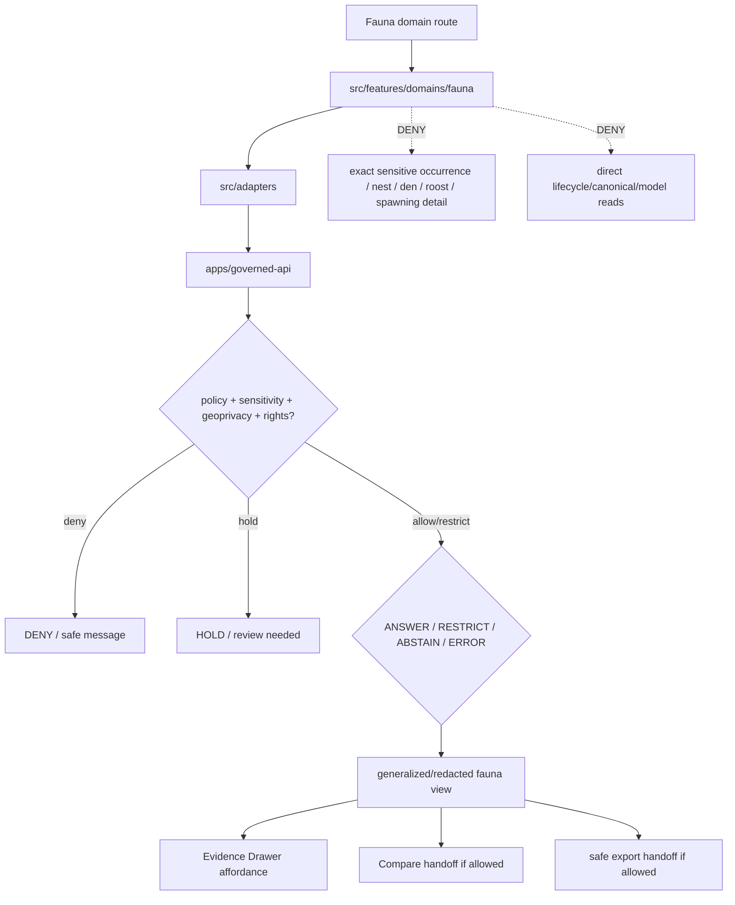

<!-- [KFM_META_BLOCK_V2]
doc_id: kfm://app/explorer-web/src/features/domains/fauna/readme
title: Explorer Web Fauna Domain Feature README
type: app-readme
version: v0.2
status: draft
owners: OWNER_TBD — Apps steward · UI steward · Fauna steward · Sensitivity reviewer · Governed API steward · Policy steward · Docs steward
created: 2026-06-16
updated: 2026-07-09
policy_label: public
related:
  - ../../README.md
  - ../../../README.md
  - ../../../adapters/README.md
  - ../../../../README.md
  - ../../../../../README.md
  - ../../../../../governed-api/README.md
  - ../../../../../../README.md
  - ../../../../../../SECURITY.md
  - ../../../../../../docs/domains/fauna/README.md
  - ../../../../../../docs/domains/fauna/SENSITIVITY.md
  - ../../../../../../policy/domains/fauna/README.md
  - ../../../../../../policy/sensitivity/fauna/README.md
  - ../../../../../../packages/ui/README.md
  - ../../../../../../packages/maplibre/README.md
  - ../../../../../../packages/cesium/README.md
  - ../../../../../../policy/access/README.md
  - ../../../../../../policy/decision/README.md
  - ../../../../../../release/README.md
  - ../../../../../../data/README.md
  - ../../../../../../tools/validators/README.md
  - ../../../../../../tools/watchers/README.md
tags: [kfm, apps, explorer-web, domains, fauna, feature, sensitive-occurrence, geoprivacy, redaction, evidence-drawer, map-first, no-direct-data-root, deny-by-default]
notes:
  - "v0.2 updates the uploaded Fauna domain-feature README into a current repo-aware feature contract."
  - "apps/explorer-web/src/features/domains/fauna/README.md, apps/explorer-web/src/features/README.md, docs/domains/fauna/README.md, docs/domains/fauna/SENSITIVITY.md, policy/domains/fauna/README.md, and policy/sensitivity/fauna/README.md were verified through the GitHub app in this update. Prior related Explorer Web adapter/source/app boundaries remain relevant, but adapter files, routes, runtime wiring, tests, and envelopes remain NEEDS VERIFICATION."
  - "Feature implementation files, route wiring, domain-view inventory, tests, fixtures, governed API envelopes, RedactionReceipts, AggregationReceipts, ReviewRecords, PolicyDecisions, release manifests, export handoff, Focus Mode behavior, Evidence Drawer behavior, package scripts, runtime behavior, and deployment behavior remain NEEDS VERIFICATION."
  - "Fauna UI features may compose governed fauna envelopes into public/semi-public views, but they must not expose exact sensitive occurrence geometry, nests, dens, roosts, hibernacula, spawning sites, steward-controlled records, private-parcel joins, or re-identifying joins without reviewed, receipt-backed policy support."
  - "Public Fauna UI must default to deny/hold/restrict when sensitivity, rights, geoprivacy transform, review, evidence, release, rollback, correction, policy, or export support is unresolved."
[/KFM_META_BLOCK_V2] -->

<a id="top"></a>

<div align="center">

# Explorer Web Fauna Domain Feature

`apps/explorer-web/src/features/domains/fauna/`

**Domain-specific Explorer Web feature boundary for public-safe fauna views: generalized occurrences, range summaries, monitoring context, seasonal movement context, invasive-species views, Evidence Drawer handoffs, Focus Mode answers, and release-aware map surfaces rendered only through governed envelopes.**


[Purpose](#1-purpose) · [Current evidence](#2-current-repo-evidence) · [Repo fit](#3-repo-fit) · [Boundary](#4-authority-boundary) · [Inputs](#6-inputs) · [Exclusions](#7-exclusions) · [Feature map](#8-fauna-feature-map) · [Definition of done](#15-definition-of-done)

</div>

---

> [!IMPORTANT]
> **Status:** draft / current README surface confirmed / implementation behavior `NEEDS VERIFICATION`  
> **Owners:** `OWNER_TBD` — Apps steward · UI steward · Fauna steward · Sensitivity reviewer · Governed API steward · Policy steward · Docs steward  
> **Path:** `apps/explorer-web/src/features/domains/fauna/README.md`  
> **Responsibility root:** `apps/` — deployable application surfaces  
> **Truth posture:** CONFIRMED README path and supporting Fauna docs/policy README surfaces / PROPOSED domain-feature contract / UNKNOWN implementation files, route wiring, domain-view inventory, tests, fixtures, governed API envelopes, RedactionReceipts, AggregationReceipts, ReviewRecords, PolicyDecisions, release manifests, export handoff, Focus Mode behavior, Evidence Drawer behavior, package scripts, runtime behavior, and deployment behavior

> [!CAUTION]
> Fauna is a geoprivacy-sensitive lane. Public UI must fail closed for exact sensitive-taxon occurrences, nests, dens, roosts, hibernacula, spawning sites, steward-controlled records, private-parcel joins, and re-identifying combinations unless a documented geoprivacy transform and recorded review state authorize a bounded public-safe output.

---

## Quick jump

- [1. Purpose](#1-purpose)
- [2. Current repo evidence](#2-current-repo-evidence)
- [3. Repo fit](#3-repo-fit)
- [4. Authority boundary](#4-authority-boundary)
- [5. Default posture](#5-default-posture)
- [6. Inputs](#6-inputs)
- [7. Exclusions](#7-exclusions)
- [8. Fauna feature map](#8-fauna-feature-map)
- [9. Diagram](#9-diagram)
- [10. Fauna UI obligations](#10-fauna-ui-obligations)
- [11. Per-view contract](#11-per-view-contract)
- [12. Inspection path](#12-inspection-path)
- [13. Validation expectations](#13-validation-expectations)
- [14. Safe change pattern](#14-safe-change-pattern)
- [15. Definition of done](#15-definition-of-done)
- [16. Open verification items](#16-open-verification-items)

---

## 1. Purpose

`apps/explorer-web/src/features/domains/fauna/` is the proposed app-local feature boundary for Fauna-specific Explorer Web surfaces.

It may eventually hold route modules, panels, view models, hooks, and feature orchestration for public-safe fauna experiences such as:

- generalized occurrence and monitoring maps;
- range, seasonal range, and migration-context summaries;
- public-safe invasive-species and mortality/disease context;
- sensitive-taxon denial, restriction, and stewardship-status messaging;
- Evidence Drawer handoffs that show only governed, redacted, audience-appropriate payloads;
- Focus Mode bounded fauna answers with citation discipline and AIReceipt support;
- compare/export handoffs that preserve geoprivacy, redaction, aggregation, review, rights, release, correction, and rollback state.

This directory is not proof that any route, panel, hook, map layer, adapter, test, fixture, package script, governed API envelope, geoprivacy receipt, RedactionReceipt, AggregationReceipt, ReviewRecord, PolicyDecision, release manifest, Evidence Drawer behavior, Focus Mode behavior, export handoff, or runtime wiring is implemented.

[Back to top](#top)

---

## 2. Current repo evidence

| Surface | Status | What it proves | What it does **not** prove |
|---|---|---|---|
| `apps/explorer-web/src/features/domains/fauna/README.md` | **CONFIRMED README** | This README exists and has been updated to v0.2. | Fauna UI implementation files, route wiring, domain-view inventory, tests, fixtures, governed API envelopes, receipts, review records, release manifests, export handoff, or runtime behavior. |
| `apps/explorer-web/src/features/README.md` | **CONFIRMED parent features README** | Parent feature boundary exists and says feature modules must not treat map features, tiles, local files, model text, or lifecycle data as claim truth. | That domain feature modules, route inventory, tests, fixtures, or runtime wiring exist. |
| `apps/explorer-web/src/adapters/README.md` | **CONFIRMED prior related boundary** | Adapter README was previously verified in this session as the governed API / renderer / evidence / layer / export / diagnostics adapter boundary. | That fauna adapters or governed API client adapters are implemented. |
| `docs/domains/fauna/README.md` | **CONFIRMED domain-doc surface** | Fauna domain docs define sensitive occurrence denial by default and require geoprivacy transform, receipt, review record, and policy decision before bounded public release. | That app UI behavior, schemas, validators, policy bundles, source descriptors, or releases are implemented. |
| `docs/domains/fauna/SENSITIVITY.md` | **CONFIRMED sensitivity-doc surface** | Fauna sensitivity docs define deny-by-default, fail-closed, generalize-before-release, reversible, receipt-bearing posture and deliberately avoid exposure-aiding details. | That executable policy or UI enforcement is wired. |
| `policy/domains/fauna/README.md` | **CONFIRMED policy-lane scaffold** | Fauna policy-lane README exists. | It is still a greenfield scaffold and does not prove concrete policy files, tests, fixtures, CI binding, or runtime enforcement. |
| `policy/sensitivity/fauna/README.md` | **CONFIRMED sensitivity-policy scaffold** | Fauna sensitivity-policy README exists as a proposed scaffold. | It says authoritative content, owners, validation status, and cross-links must be filled in before treating it as canonical truth. |
| `apps/explorer-web/src/features/domains/README.md` | **NOT VERIFIED** | A parent domain-feature README was not confirmed in this update. | Does not prove absence across all refs; a future index remains useful if accepted. |
| Uploaded Fauna Markdown | **CONFIRMED source text for this update** | Provided the base Fauna domain-feature contract updated here. | Does not prove live implementation. |
| Implementation beyond README | **NEEDS VERIFICATION** | Checkable by repo scan, route inventory, fixtures, tests, package scripts, governed API envelopes, receipts, release records, and runtime evidence. | Not claimed by this README. |

[Back to top](#top)

---

## 3. Repo fit

| Concern | Owning root | Expected relationship |
|---|---|---|
| Fauna domain feature source | `apps/explorer-web/src/features/domains/fauna/` | App-local Fauna UI feature modules, if implemented and tested. |
| Feature boundary | `apps/explorer-web/src/features/` | Parent feature/root contract. |
| Domain-feature parent index | `apps/explorer-web/src/features/domains/` | **NEEDS VERIFICATION**; parent README was not confirmed in this update. |
| Adapter boundary | `apps/explorer-web/src/adapters/` | Governed API, evidence, layer, map, export, and diagnostics adapters. |
| Explorer Web source tree | `apps/explorer-web/src/` | Parent source-layout boundary. |
| Explorer Web app | `apps/explorer-web/` | Map-first public/semi-public shell. |
| Governed API | `apps/governed-api/` | Trust membrane and normal claim-bearing data path. |
| Fauna doctrine | `docs/domains/fauna/` | Domain scope, source roles, sensitivity, object families, and verification backlog. |
| Fauna policy | `policy/domains/fauna/`, `policy/sensitivity/fauna/` | Fauna admissibility, geoprivacy, sensitivity, and exposure policy lanes, if executable wiring is accepted. |
| Shared UI components | `packages/ui/` | Reusable cards, badges, drawers, panels, and legends when shared. |
| Renderer wrappers | `packages/maplibre/`, `packages/cesium/` | Renderer behavior stays behind adapter/wrapper boundaries. |
| Release authority | `release/` | Publication, correction, supersession, rollback control. |
| Lifecycle artifacts | `data/` | Receipts, proofs, registry, catalog, triplets, and published artifacts. |
| Security posture | `SECURITY.md`, `docs/security/` | Secrets, sensitive-output, incident, exposure, and audit posture. |

[Back to top](#top)

---

## 4. Authority boundary

This feature renders governed Fauna UI. It does not own Fauna doctrine, source admission, source rights, sensitivity decisions, geoprivacy policy, schemas, contracts, lifecycle artifacts, release decisions, evidence truth, renderer authority, enforcement/alert authority, or AI output.

```text
apps/explorer-web/src/features/domains/fauna/ = app-local Fauna UI feature
apps/explorer-web/src/features/              = feature boundary
apps/explorer-web/src/adapters/              = adapter boundary
apps/explorer-web/src/                       = Explorer Web implementation source
apps/explorer-web/                           = map-first public/semi-public app boundary
apps/governed-api/                           = trust membrane and normal data path
docs/domains/fauna/                          = Fauna doctrine and policy intent
policy/domains/fauna/                        = Fauna domain policy lane
policy/sensitivity/fauna/                    = Fauna geoprivacy / sensitivity policy lane
packages/ui/                                 = shared UI primitives
packages/maplibre/                           = renderer wrapper
packages/cesium/                             = optional gated renderer wrapper
policy/                                      = finite policy decisions
schemas/                                     = machine-readable shape
contracts/                                   = object meaning
data/                                        = lifecycle artifacts, receipts, proofs, registries
release/                                     = publication, correction, rollback authority
```

Safe interpretation:

- **CONFIRMED:** this README surface, parent Explorer Web feature README, Fauna domain docs, Fauna sensitivity doc, Fauna domain policy scaffold, and Fauna sensitivity-policy scaffold exist.
- **PROPOSED:** Fauna feature modules may live here when they preserve governed API, geoprivacy, redaction, aggregation, source-role, evidence, sensitivity, rights, legal/conservation status, review, release, rollback, correction, export, and public-boundary constraints.
- **NEEDS VERIFICATION:** Fauna modules, route wiring, domain-view inventory, adapter dependencies, fixtures, tests, package scripts, governed API envelopes, geoprivacy receipts, RedactionReceipts, AggregationReceipts, ReviewRecords, PolicyDecisions, release manifests, export handoff, Evidence Drawer behavior, Focus Mode behavior, runtime behavior, and deployment behavior.
- **DENY:** using this feature as Fauna truth, policy authority, source authority, release authority, lifecycle store, schema/contract home, direct canonical/internal store client, direct model-output surface, exact sensitive-occurrence exposure path, renderer authority, export authority, enforcement authority, or public-data shortcut.

[Back to top](#top)

---

## 5. Default posture

Fauna feature modules should fail closed, generalize before public release, and preserve the strictest applicable geoprivacy, rights, review, sensitivity, and release posture.

A view should not render claim-bearing fauna content when any of these are unresolved:

- governed API envelope and response validation;
- object family or fauna domain slug;
- taxonomic identity and conservation/legal status;
- exact geometry or sensitive occurrence exposure risk;
- sensitive-taxon, nest, den, roost, hibernacula, spawning-site, or steward-controlled status;
- private-parcel or re-identifying join risk;
- source role, rights, and provenance;
- EvidenceRef or EvidenceBundle support;
- geoprivacy transform, RedactionReceipt, AggregationReceipt, ReviewRecord, and PolicyDecision;
- release state, rollback target, correction path, stale-state, or supersession state;
- public audience or export destination.

[Back to top](#top)

---

## 6. Inputs

| Input family | Examples | Required posture |
|---|---|---|
| Fauna view state | occurrence, monitoring, range, seasonal range, migration, invasive, mortality, disease, domain Focus Mode | Explicit finite states. |
| API envelope | answer, abstain, deny, error, hold, restricted, decision envelope, evidence payload | Runtime-validated before render. |
| Sensitivity state | sensitive occurrence, nest/den/roost/hibernacula/spawning site, steward-controlled record, re-identifying join | Default deny/fail-closed when unresolved. |
| Layer state | layer manifest, source role, legend, trust badges, valid time, selected feature id | Released or bounded-safe source only. |
| Evidence state | EvidenceRef, EvidenceBundle summary, citation validation, proof visibility | Required for claim-bearing detail. |
| Transform state | geoprivacy generalization, suppression, aggregation, RedactionReceipt, AggregationReceipt | Required when reducing exposure risk. |
| Review/policy state | ReviewRecord, PolicyDecision, sensitivity reviewer, release authority, rights state | Required for sensitive public-safe transforms. |
| Cross-lane state | habitat, flora, hydrology, hazards, people/land, archaeology joins | Inherits strictest lane posture. |
| Release/correction state | release ref, rollback target, correction notice, supersession state | Required for public-facing claim and export support. |
| Export state | selected generalized layer, bounds, citation bundle, redaction/geoprivacy profile, output mode | Governed export only. |
| Focus Mode state | prompt class, finite outcome, evidence handles, policy result | No direct model output as fauna truth. |

[Back to top](#top)

---

## 7. Exclusions

| Does not belong here | Correct home |
|---|---|
| Fauna doctrine and scope | `docs/domains/fauna/` |
| Fauna policy bundles or geoprivacy decisions | `policy/domains/fauna/`, `policy/sensitivity/fauna/`, `policy/` |
| Governed API implementation | `apps/governed-api/` |
| Adapter logic shared across feature families | `apps/explorer-web/src/adapters/` |
| Shared reusable UI primitives | `packages/ui/` |
| Renderer wrapper authority | `packages/maplibre/`, `packages/cesium/` |
| Fauna schemas and contracts | `schemas/contracts/v1/domains/fauna/`, `contracts/domains/fauna/` |
| Lifecycle artifacts, receipts, proofs, catalog, triplets | `data/` |
| Release manifests, rollback cards, correction notices | `release/` |
| Exact sensitive occurrence coordinates or protected site geometry | denied from public UI; governed internal lifecycle only |
| Source acquisition or source registry records | `connectors/`, `data/registry/`, source catalog lanes |
| Direct RAW / WORK / QUARANTINE / PROCESSED / CATALOG / TRIPLET / PUBLISHED reads | governed API, released artifacts, layer manifests, and bounded public-safe envelopes only |
| Enforcement or emergency-alert authority | official authorities / Hazards lane, not Explorer Web Fauna UI |
| Direct model runtime behavior | `runtime/` behind governed API only |
| Secrets, credentials, tokens, private keys, exact sensitive occurrence details, transformation parameters, exposure hints | secret manager / deployment environment, not UI feature source or examples |
| Public-sensitive exports, exact restricted locations, living-person/DNA details, source-restricted records, prompt/model traces | denied unless separately governed and public-safe |

[Back to top](#top)

---

## 8. Fauna feature map

Exact modules remain `NEEDS VERIFICATION`. Candidate views should be introduced only with route inventory, fixtures, governed API envelopes, geoprivacy receipts, review records, policy decisions, and tests.

| Candidate view | Purpose | Required safeguard | Status |
|---|---|---|---|
| `generalized-occurrences` | Show public-safe occurrence context without sensitive exact geometry. | Geoprivacy transform + receipt + review. | PROPOSED |
| `range-summary` | Show range or seasonal range summaries. | Aggregation/generalization and release state. | PROPOSED |
| `monitoring-context` | Show monitoring effort or count context. | Source role, valid-time, and caveats. | PROPOSED |
| `migration-context` | Show movement or seasonal context. | Public-safe scale and no sensitive site exposure. | PROPOSED |
| `invasive-context` | Show invasive species public-reporting context. | Private-parcel detail aggregated when needed. | PROPOSED |
| `mortality-disease-context` | Show public-safe mortality or disease context. | No sensitive site or private-land inference. | PROPOSED |
| `sensitive-denial` | Explain why exact sensitive details are unavailable. | Safe reason code; no exposure hints. | PROPOSED |
| `domain-focus` | Fauna Focus Mode UI. | Finite outcomes; no direct model truth or protected detail. | PROPOSED |
| `domain-evidence` | Evidence Drawer handoff. | Redacted/audience-appropriate payload only. | PROPOSED |
| `domain-export` | Fauna export handoff. | Citation, redaction, geoprivacy, rights, review, release checks. | PROPOSED |
| `domain-compare` | Fauna compare handoff. | Geoprivacy, time, release, review, provenance, and audience posture preserved. | PROPOSED |
| `correction-status` | Public-safe stale/supersession/correction status. | Release/correction refs only; no protected payloads. | PROPOSED |

> [!WARNING]
> Candidate view names are not implementation proof. Do not document a view as runnable until files, route wiring, tests, fixtures, package scripts, receipts, review records, policy decisions, and governed API envelopes confirm it.

[Back to top](#top)

---

## 9. Diagram



[Back to top](#top)

---

## 10. Fauna UI obligations

| Obligation | Example effect |
|---|---|
| `governed_api_only` | Fauna feature state comes through governed API envelopes. |
| `deny_exact_sensitive_by_default` | Sensitive exact occurrences and site geometry do not render publicly. |
| `geoprivacy_required` | Public-safe surfaces require reviewed geoprivacy or aggregation transform support. |
| `receipt_required` | RedactionReceipt, AggregationReceipt, ReviewRecord, and PolicyDecision are preserved where required. |
| `evidence_required` | Claim-bearing details link to EvidenceBundle-derived payloads. |
| `no_exposure_hints` | Denial messages do not reveal sensitive locations, parameters, transformation details, or reconstruction hints. |
| `finite_states_required` | Views render answer, restrict, abstain, deny, error, hold, loading, and empty states safely. |
| `safe_compare_required` | Compare handoff preserves geoprivacy, release, review, provenance, time, and finite-state posture. |
| `safe_export_required` | Export handoff preserves citations, geoprivacy, redaction, rights, review, release, correction, and rollback constraints. |
| `no_authority_fork` | Feature code does not redefine Fauna policy, schema, contract, source, release, geoprivacy, or evidence logic. |
| `no_data_root_shortcut` | Feature code does not read lifecycle data roots, canonical/internal stores, local source files, or model output as claim sources. |
| `local_parity_preferred` | Fauna fixtures/tests should be runnable locally and in CI with the same inputs where practical. |

[Back to top](#top)

---

## 11. Per-view contract

Every long-lived Fauna domain view should document or encode:

- view purpose and route ownership;
- fauna object families and source families consumed;
- governed API envelope or adapter dependency;
- geoprivacy, redaction, aggregation, and suppression obligations;
- taxonomic, legal/conservation status, and source-role display behavior;
- review, policy-decision, release, correction, and rollback behavior;
- expected finite outcomes;
- evidence/citation display behavior;
- loading, empty, deny, abstain, error, hold, restricted states;
- direct lifecycle/canonical/model-output denial posture;
- compare, Focus Mode, Evidence Drawer, or export behavior, if any;
- tests and fixtures proving trust-membrane and sensitive-exposure boundaries.

[Back to top](#top)

---

## 12. Inspection path

Fauna feature implementation files, route wiring, tests, fixtures, governed API envelopes, geoprivacy receipts, review records, release manifests, package scripts, and export handoff remain `NEEDS VERIFICATION`.

```bash
find apps/explorer-web/src/features/domains/fauna -maxdepth 5 -type f | sort
find apps/explorer-web/src apps/governed-api docs/domains/fauna policy/domains/fauna policy/sensitivity/fauna packages/ui packages/maplibre tests fixtures -maxdepth 6 -type f 2>/dev/null | grep -Ei 'fauna|taxon|occurrence|range|monitoring|migration|nest|den|roost|hibernacula|spawning|geoprivacy|redaction|aggregation|evidence|release|rollback|governed' | sort
find data/raw data/work data/quarantine data/processed data/catalog data/triplets data/published data/receipts data/proofs -maxdepth 2 -type f 2>/dev/null | sort
```

[Back to top](#top)

---

## 13. Validation expectations

Useful validation for this feature boundary should cover:

- no Fauna feature imports or reads lifecycle data roots directly;
- claim-bearing Fauna views consume governed API envelopes only;
- malformed Fauna envelopes render safe error or abstain states;
- exact sensitive occurrence geometry, nests, dens, roosts, hibernacula, spawning sites, steward-controlled records, private-parcel joins, and re-identifying joins are denied or restricted by default;
- generalized views preserve geoprivacy transform state, sensitivity, rights, release, citation, and review metadata;
- denial messages do not leak locations, parameters, transformation details, or reconstruction hints;
- cross-lane sensitive joins inherit the strictest lane posture;
- Evidence Drawer handoff preserves EvidenceRef/EvidenceBundle handles without exposing protected content;
- Focus Mode renders finite outcomes and never direct model output as truth;
- compare and export handoffs require citation, geoprivacy/redaction, rights, review, release, correction, and rollback support;
- UI output does not expose secrets, exact restricted locations, source-restricted records, private data, or prompt/model traces.

[Back to top](#top)

---

## 14. Safe change pattern

For Fauna feature changes:

1. Add or update route inventory and per-view contract.
2. Add fixtures for generalized, restricted, denied, held, abstained, malformed, loading, and empty states.
3. Test lifecycle-data denial and governed API-only behavior.
4. Preserve geoprivacy, sensitivity, taxonomic/legal status, source role, review, release, rollback, rights, and citation fields through UI state.
5. Verify denial messaging does not reveal exposure hints, transform parameters, reconstruction clues, or sensitive location detail.
6. Verify compare, export, Focus Mode, and Evidence Drawer handoffs cannot bypass policy, review, geoprivacy, release, correction, or rollback checks.
7. Update this README, parent `features/README.md`, adapter README, fauna docs, policy READMEs, and parent app README when public behavior changes.

[Back to top](#top)

---

## 15. Definition of done

- [ ] Owners are confirmed and `OWNER_TBD` is replaced.
- [ ] Fauna feature file inventory and route ownership are documented.
- [ ] Governed API and adapter dependencies are explicit.
- [ ] Fauna sensitivity, geoprivacy, review, and rights states are represented in UI fixtures.
- [ ] Redaction/generalization/aggregation obligations survive feature composition.
- [ ] Direct lifecycle-data import/read checks are covered.
- [ ] Exact sensitive occurrence and protected-site denial states are tested.
- [ ] Denial messaging is tested for no exposure hints.
- [ ] Cross-lane sensitivity inheritance is tested.
- [ ] Finite states cover answer, restrict, abstain, deny, error, hold, loading, and empty cases.
- [ ] Evidence Drawer, Focus Mode, Compare, and Export handoffs are tested for safe output if present.
- [ ] Parent feature/adapter/source/app READMEs and Fauna docs/policy surfaces are updated when public behavior changes.

[Back to top](#top)

---

## 16. Open verification items

| Item | Why it matters |
|---|---|
| Confirm Fauna feature implementation files beyond README | Prevents overclaiming feature maturity. |
| Confirm route inventory | Required for public/semi-public UI boundary review. |
| Confirm governed API Fauna envelopes | Required for trust membrane enforcement. |
| Confirm adapter dependency shape | Required so Fauna UI does not bypass governed adapters. |
| Confirm geoprivacy receipt and review-record linkage | Required before public-safe transformation claims. |
| Confirm policy-decision linkage | Required before enforcement claims. |
| Confirm release manifest / rollback / correction linkage | Required before publication-support claims. |
| Confirm fixtures and tests | Required before implementation claims. |
| Confirm Focus Mode and Evidence Drawer behavior | Required before claim-bearing Fauna UI claims. |
| Confirm Compare handoff | Required before visual-difference claims. |
| Confirm export handoff | Required before public download workflows. |
| Confirm direct data-root denial | Required for public client trust membrane. |
| Confirm executable Fauna policy and sensitivity-policy binding | Required before enforcement claims. |
| Confirm no exposure-hint messaging | Required before denial-state UI claims. |
| Confirm package scripts beyond TODO | Required before build/test claims. |

<details>
<summary>Appendix A — no-loss preservation note</summary>

The uploaded README replaced a greenfield Fauna domain-feature stub with a bounded Fauna feature contract without claiming Fauna routes, panels, hooks, adapters, fixtures, tests, package scripts, governed API envelopes, geoprivacy receipts, ReviewRecords, PolicyDecisions, release manifests, Focus Mode, Evidence Drawer, Compare, or export handoff are implemented. This v0.2 update preserves that structure while adding current repo evidence, parent feature linkage, supporting Fauna docs/policy evidence, stronger no-direct-data-root language, no-exposure-hints posture, cross-lane sensitivity inheritance, release/correction/rollback posture, compare/export handoff posture, local-parity expectations, and expanded verification items.

</details>

## Status summary

`apps/explorer-web/src/features/domains/fauna/` should contain Fauna-specific Explorer Web feature modules only after route contracts, governed API envelopes, geoprivacy/redaction posture, fixtures, tests, Evidence Drawer behavior, Focus Mode behavior, Compare behavior, and export handoff are verified.

It must preserve the trust membrane and Fauna sensitivity posture: the feature may show generalized, aggregated, redacted, audience-appropriate, or restricted Fauna knowledge, but it must not expose exact sensitive occurrence geometry, nests, dens, roosts, hibernacula, spawning sites, steward-controlled records, private-parcel joins, or re-identifying joins; it must not become Fauna truth, bypass policy, publish, read lifecycle/canonical stores directly, leak exposure hints, or turn map features into unsupported claims.

<p align="right"><a href="#top">Back to top</a></p>
