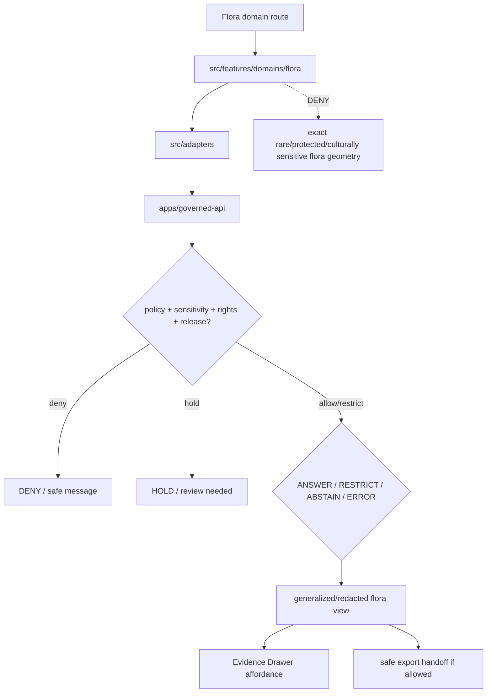

<!-- [KFM_META_BLOCK_V2]
doc_id: kfm://app/explorer-web/src/features/domains/flora/readme
title: Explorer Web Flora Domain Feature README
type: app-readme
version: v0.1
status: draft
owners: OWNER_TBD — Apps steward · UI steward · Flora steward · Sensitivity reviewer · Governed API steward · Policy steward · Docs steward
created: 2026-06-16
updated: 2026-06-16
policy_label: public
related:
  - ../../README.md
  - ../../../README.md
  - ../../../adapters/README.md
  - ../../../../README.md
  - ../../../../../README.md
  - ../../../../../governed-api/README.md
  - ../../../../../../docs/domains/flora/README.md
  - ../../../../../../docs/domains/flora/PUBLICATION_AND_ROLLBACK.md
  - ../../../../../../policy/domains/flora/README.md
  - ../../../../../../policy/sensitivity/flora/
  - ../../../../../../packages/ui/README.md
  - ../../../../../../packages/maplibre/README.md
  - ../../../../../../policy/access/README.md
  - ../../../../../../policy/decision/README.md
  - ../../../../../../release/README.md
  - ../../../../../../data/README.md
tags: [kfm, apps, explorer-web, domains, flora, feature, rare-plants, geoprivacy, redaction, evidence-drawer, map-first]
notes:
  - "Replaces the greenfield flora domain feature stub with a governed feature README."
  - "Flora UI features may compose governed flora envelopes into public/semi-public views, but they must not expose exact rare/protected/culturally sensitive flora geometry or steward-reviewed records without reviewed, receipt-backed policy support."
  - "Feature implementation files, route wiring, tests, fixtures, governed API envelopes, RedactionReceipts, ReleaseManifests, RollbackCards, and package scripts remain NEEDS VERIFICATION."
[/KFM_META_BLOCK_V2] -->

<a id="top"></a>

<div align="center">

# Explorer Web Flora Domain Feature

`apps/explorer-web/src/features/domains/flora/`

**Domain-specific Explorer Web feature boundary for public-safe flora views: plant taxonomic identity, generalized occurrences, specimens, vegetation communities, rare-plant controls, invasive plants, phenology, habitat associations, Evidence Drawer handoffs, Focus Mode answers, and release-aware map surfaces rendered only through governed envelopes.**


[Purpose](#1-purpose) · [Repo fit](#2-repo-fit) · [Boundary](#3-authority-boundary) · [Inputs](#5-inputs) · [Exclusions](#6-exclusions) · [Feature map](#7-flora-feature-map) · [Definition of done](#14-definition-of-done)

</div>

---

> [!IMPORTANT]
> **Status:** draft / `NEEDS VERIFICATION`  
> **Owners:** `OWNER_TBD` — Apps steward · UI steward · Flora steward · Sensitivity reviewer · Governed API steward · Policy steward · Docs steward  
> **Path:** `apps/explorer-web/src/features/domains/flora/README.md`  
> **Responsibility root:** `apps/` — deployable application surfaces  
> **Truth posture:** CONFIRMED README path / CONFIRMED flora doctrine and publication docs / PROPOSED domain-feature contract / UNKNOWN implementation files, route wiring, tests, fixtures, and runtime behavior

> [!CAUTION]
> Flora is a geoprivacy- and rights-sensitive lane. Public UI must fail closed for rare, protected, culturally sensitive, steward-reviewed, or exact-location plant records unless a documented transform, review state, policy decision, and receipt-backed release path explicitly permit a generalized, redacted, staged, restricted, or public-safe output.

---

## Quick jump

- [1. Purpose](#1-purpose)
- [2. Repo fit](#2-repo-fit)
- [3. Authority boundary](#3-authority-boundary)
- [4. Default posture](#4-default-posture)
- [5. Inputs](#5-inputs)
- [6. Exclusions](#6-exclusions)
- [7. Flora feature map](#7-flora-feature-map)
- [8. Diagram](#8-diagram)
- [9. Flora UI obligations](#9-flora-ui-obligations)
- [10. Per-view contract](#10-per-view-contract)
- [11. Inspection path](#11-inspection-path)
- [12. Validation expectations](#12-validation-expectations)
- [13. Safe change pattern](#13-safe-change-pattern)
- [14. Definition of done](#14-definition-of-done)
- [15. Open verification items](#15-open-verification-items)

---

## 1. Purpose

`apps/explorer-web/src/features/domains/flora/` is the proposed app-local feature boundary for Flora-specific Explorer Web surfaces.

It may eventually hold route modules, panels, view models, hooks, and feature orchestration for public-safe flora experiences such as:

- generalized plant occurrence and specimen views;
- vegetation community and distribution-surface views;
- rare/protected/culturally sensitive flora denial, restriction, and redaction messaging;
- invasive plant and restoration planting context;
- phenology observations and time-aware botanical summaries;
- habitat-association views that preserve habitat-lane ownership;
- Evidence Drawer handoffs that show only governed, redacted, audience-appropriate payloads;
- Focus Mode bounded flora answers with citation discipline and AIReceipt support;
- compare/export handoffs that preserve geoprivacy, redaction, review, rights, release, stale-state, and rollback state.

This directory is not proof that any route, panel, hook, map layer, adapter, test, fixture, package script, or governed API envelope is implemented.

[Back to top](#top)

---

## 2. Repo fit

| Concern | Owning root | Expected relationship |
|---|---|---|
| Flora domain feature source | `apps/explorer-web/src/features/domains/flora/` | App-local Flora UI feature modules, if implemented and tested |
| Feature boundary | `apps/explorer-web/src/features/` | Parent feature/root contract |
| Adapter boundary | `apps/explorer-web/src/adapters/` | Governed API, evidence, layer, map, export, and diagnostics adapters |
| Explorer Web app | `apps/explorer-web/` | Map-first public/semi-public shell |
| Governed API | `apps/governed-api/` | Trust membrane and normal data path |
| Flora doctrine | `docs/domains/flora/` | Domain scope, source roles, sensitivity, publication, rollback, and verification backlog |
| Flora policy | `policy/domains/flora/`, `policy/sensitivity/flora/` | Flora admissibility, geoprivacy, and exposure policy, if executable wiring is accepted |
| Shared UI components | `packages/ui/` | Reusable cards, badges, drawers, panels, and legends when shared |
| Renderer wrappers | `packages/maplibre/`, `packages/cesium/` | Renderer behavior stays behind adapter/wrapper boundaries |
| Release authority | `release/` | Publication, correction, supersession, rollback control |
| Lifecycle artifacts | `data/` | Receipts, proofs, registry, catalog, triplets, and published artifacts |

## 3. Authority boundary

This feature renders governed Flora UI. It does not own Flora doctrine, source admission, source rights, sensitivity decisions, geoprivacy policy, schemas, contracts, lifecycle artifacts, release decisions, evidence truth, renderer authority, habitat truth, or AI output.

```text
apps/explorer-web/src/features/domains/flora/ = app-local Flora UI feature
apps/explorer-web/src/features/              = feature boundary
apps/explorer-web/src/adapters/              = adapter boundary
apps/governed-api/                           = trust membrane and normal data path
docs/domains/flora/                          = Flora doctrine and policy intent
policy/domains/flora/                        = Flora domain policy lane
policy/sensitivity/flora/                    = proposed geoprivacy / sensitivity deny lane
packages/ui/                                 = shared UI primitives
policy/                                      = finite policy decisions
data/                                        = lifecycle artifacts, receipts, proofs, registries
release/                                     = publication, correction, rollback authority
```

## 4. Default posture

Flora feature modules should fail closed, generalize before public release when sensitivity applies, and preserve the strictest applicable geoprivacy, rights, review, release, stale-state, and rollback posture.

A view should not render claim-bearing flora content when any of these are unresolved:

- governed API envelope and response validation;
- object family or flora domain slug;
- plant taxonomic identity and protected/rare status;
- exact geometry or sensitive occurrence exposure risk;
- rare, protected, culturally sensitive, or steward-reviewed status;
- source role, rights, and provenance;
- cross-lane habitat, fauna, soil, hydrology, agriculture, hazards, archaeology, or people/land ownership;
- EvidenceRef or EvidenceBundle support;
- geoprivacy transform, RedactionReceipt, AggregationReceipt, ReviewRecord, PolicyDecision, or ReleaseManifest;
- release state, rollback target, correction path, stale-state, or supersession state;
- public audience or export destination.

## 5. Inputs

| Input family | Examples | Required posture |
|---|---|---|
| Flora view state | occurrence, specimen, vegetation community, range, distribution, invasive, phenology, restoration, domain Focus Mode | Explicit finite states |
| API envelope | answer, abstain, deny, error, hold, restricted, decision envelope, evidence payload | Runtime-validated before render |
| Sensitivity state | rare/protected occurrence, culturally sensitive flora, steward-reviewed record, exact geometry | Fail closed when unresolved |
| Layer state | layer manifest, source role, legend, trust badges, valid time, selected feature id | Released or bounded-safe source only |
| Evidence state | EvidenceRef, EvidenceBundle summary, citation validation, proof visibility | Required for claim-bearing detail |
| Transform state | geoprivacy generalization, suppression, aggregation, redaction, stale-state label | Required when reducing exposure risk |
| Cross-lane state | habitat, fauna, soil, hydrology, agriculture, hazards, archaeology, people/land joins | Inherits strictest lane posture |
| Export state | selected generalized layer, bounds, citation bundle, redaction/geoprivacy profile, output mode | Governed export only |

## 6. Exclusions

| Does not belong here | Correct home |
|---|---|
| Flora doctrine and scope | `docs/domains/flora/` |
| Flora policy bundles or geoprivacy decisions | `policy/domains/flora/`, `policy/sensitivity/flora/`, `policy/` |
| Governed API implementation | `apps/governed-api/` |
| Adapter logic shared across feature families | `apps/explorer-web/src/adapters/` |
| Shared reusable UI primitives | `packages/ui/` |
| Renderer wrapper authority | `packages/maplibre/`, `packages/cesium/` |
| Flora schemas and contracts | `schemas/contracts/v1/domains/flora/`, `contracts/domains/flora/` |
| Lifecycle artifacts, receipts, proofs, catalog, triplets | `data/` |
| Release manifests, rollback cards, correction notices | `release/` |
| Exact rare/protected/culturally sensitive plant coordinates | Denied from public UI unless reviewed transformed output is explicitly allowed |
| Habitat patches or suitability truth | Habitat lane, with governed relation from Flora when needed |
| Animal, soil, hydrology, agriculture, hazards, archaeology, or people/land truth | Owning domain lanes |
| Source acquisition or source registry records | `connectors/`, `data/registry/`, source catalog lanes |
| Direct model runtime behavior | `runtime/` behind governed API only |
| Secrets, credentials, tokens, private keys | Secret manager / deployment environment |

## 7. Flora feature map

Exact modules remain `NEEDS VERIFICATION`. Candidate views should be introduced only with route inventory, fixtures, and tests.

| Candidate view | Purpose | Required safeguard | Status |
|---|---|---|---|
| `generalized-occurrences` | Show public-safe occurrence context without sensitive exact geometry | Geoprivacy transform + receipt + review | PROPOSED |
| `specimen-summary` | Show specimen or collection context | Source role, evidence, and rights labels | PROPOSED |
| `vegetation-community` | Show vegetation community surfaces | Habitat/lane relation and release state | PROPOSED |
| `distribution-surface` | Show range or distribution products | Generalization, uncertainty, and release state | PROPOSED |
| `invasive-context` | Show invasive plant context | Public-safe layer and private-detail suppression | PROPOSED |
| `phenology-summary` | Show phenology observations and time-aware summaries | Valid-time and evidence support | PROPOSED |
| `sensitive-denial` | Explain why exact rare/protected detail is unavailable | Safe reason code; no exposure hints | PROPOSED |
| `domain-focus` | Flora Focus Mode UI | Finite outcomes; no direct model truth or protected detail | PROPOSED |
| `domain-evidence` | Evidence Drawer handoff | Redacted/audience-appropriate payload only | PROPOSED |
| `domain-export` | Flora export handoff | Citation, redaction, geoprivacy, rights, review, release checks | PROPOSED |

> [!WARNING]
> Candidate view names are not implementation proof. Do not document a view as runnable until files, route wiring, tests, fixtures, package scripts, and governed API envelopes confirm it.

## 8. Diagram



## 9. Flora UI obligations

| Obligation | Example effect |
|---|---|
| `governed_api_only` | Flora feature state comes through governed API envelopes |
| `deny_sensitive_exact_by_default` | Exact rare/protected/culturally sensitive flora geometry does not render publicly by default |
| `geoprivacy_required` | Public-safe surfaces require reviewed geoprivacy, aggregation, or redaction transform support |
| `receipt_required` | RedactionReceipt, AggregationReceipt, ReviewRecord, PolicyDecision, and ReleaseManifest are preserved where required |
| `evidence_required` | Claim-bearing details link to EvidenceBundle-derived payloads |
| `no_exposure_hints` | Denial messages do not reveal sensitive locations, parameters, or transformation details |
| `stale_state_visible` | Stale, corrected, superseded, withdrawn, and rollback states are visible where material |
| `finite_states_required` | Views render answer, restrict, abstain, deny, error, hold, loading, and empty states safely |
| `safe_export_required` | Export handoff preserves citations, geoprivacy, redaction, rights, review, release, and rollback constraints |
| `no_authority_fork` | Feature code does not redefine Flora policy, schema, contract, source, release, geoprivacy, or evidence logic |

## 10. Per-view contract

Every long-lived Flora domain view should document or encode:

- view purpose and route ownership;
- flora object families and source families consumed;
- governed API envelope or adapter dependency;
- geoprivacy, redaction, aggregation, and suppression obligations;
- taxonomic, source-role, rights, and sensitivity display behavior;
- release, stale-state, correction, supersession, and rollback behavior;
- expected finite outcomes;
- evidence/citation display behavior;
- loading, empty, deny, abstain, error, hold, restricted states;
- export behavior, if any;
- tests and fixtures proving trust-membrane and sensitive-exposure boundaries.

## 11. Inspection path

Flora feature implementation files, route wiring, tests, fixtures, governed API envelopes, geoprivacy receipts, review records, release manifests, rollback cards, package scripts, and export handoff remain `NEEDS VERIFICATION`.

```bash
find apps/explorer-web/src/features/domains/flora -maxdepth 5 -type f | sort
find apps/explorer-web/src apps/governed-api docs/domains/flora policy/domains/flora policy/sensitivity/flora packages/ui packages/maplibre tests fixtures -maxdepth 6 -type f 2>/dev/null | grep -Ei 'flora|plant|taxon|occurrence|specimen|rare|protected|vegetation|community|invasive|phenology|restoration|redaction|aggregation|evidence|release|rollback|governed' | sort
find data/raw data/work data/quarantine data/processed data/catalog data/triplets data/published data/receipts data/proofs -maxdepth 2 -type f 2>/dev/null | sort
```

## 12. Validation expectations

Useful validation for this feature boundary should cover:

- no Flora feature imports or reads lifecycle data roots directly;
- claim-bearing Flora views consume governed API envelopes only;
- malformed Flora envelopes render safe error or abstain states;
- exact rare/protected/culturally sensitive flora geometry and steward-reviewed records are denied, generalized, held, or restricted by default;
- generalized views preserve geoprivacy transform state, sensitivity, rights, release, stale-state, citation, and review metadata;
- denial messages do not leak locations, parameters, or transformation hints;
- Evidence Drawer handoff preserves EvidenceRef/EvidenceBundle handles without exposing protected content;
- Focus Mode renders finite outcomes and never direct model output as truth;
- export handoff requires citation, geoprivacy/redaction, rights, review, release, correction, and rollback support.

## 13. Safe change pattern

For Flora feature changes:

1. Add or update route inventory and per-view contract.
2. Add fixtures for generalized, restricted, denied, held, abstained, malformed, loading, stale, corrected, rolled-back, and empty states.
3. Test lifecycle-data denial and governed API-only behavior.
4. Preserve geoprivacy, sensitivity, taxonomic/source-role, review, release, rollback, rights, and citation fields through UI state.
5. Update this README, parent `features/README.md`, flora docs, and parent app README when public behavior changes.

## 14. Definition of done

- [ ] Owners are confirmed and `OWNER_TBD` is replaced.
- [ ] Flora feature file inventory and route ownership are documented.
- [ ] Governed API and adapter dependencies are explicit.
- [ ] Flora sensitivity, geoprivacy, review, rights, release, stale-state, and rollback states are represented in UI fixtures.
- [ ] Redaction/generalization/aggregation obligations survive feature composition.
- [ ] Direct lifecycle-data import/read checks are covered.
- [ ] Exact rare/protected/culturally sensitive flora denial states are tested.
- [ ] Finite states cover answer, restrict, abstain, deny, error, hold, loading, stale, corrected, rollback, and empty cases.
- [ ] Export, Focus Mode, and Evidence Drawer handoffs are tested for safe output if present.

## 15. Open verification items

| Item | Why it matters |
|---|---|
| Confirm Flora feature implementation files beyond README | Prevents overclaiming feature maturity |
| Confirm route inventory | Required for public/semi-public UI boundary review |
| Confirm governed API Flora envelopes | Required for trust membrane enforcement |
| Confirm geoprivacy/redaction receipt and review-record linkage | Required before public-safe transformation claims |
| Confirm release, correction, stale-state, and rollback states | Required before public map-layer claims |
| Confirm fixtures and tests | Required before implementation claims |
| Confirm Focus Mode and Evidence Drawer behavior | Required before claim-bearing Flora UI claims |
| Confirm export handoff | Required before public download workflows |
| Confirm package scripts beyond TODO | Required before build/test claims |

<details>
<summary>Appendix A — no-loss preservation note</summary>

The previous README was a greenfield stub. This replacement adds a bounded Flora domain-feature contract without claiming Flora routes, panels, hooks, adapters, fixtures, tests, package scripts, governed API envelopes, geoprivacy receipts, ReviewRecords, PolicyDecisions, ReleaseManifests, RollbackCards, Focus Mode, Evidence Drawer, or export handoff are implemented.

</details>

## Status summary

`apps/explorer-web/src/features/domains/flora/` should contain Flora-specific Explorer Web feature modules only after route contracts, governed API envelopes, geoprivacy/redaction posture, fixtures, tests, Evidence Drawer behavior, Focus Mode behavior, release/stale/rollback handling, and export handoff are verified.

It must preserve the trust membrane and Flora sensitivity posture: the feature may show generalized, aggregated, redacted, audience-appropriate, stale-labeled, corrected, or restricted Flora knowledge, but it must not expose exact rare/protected/culturally sensitive flora geometry, become Flora truth, bypass policy, publish, read lifecycle/canonical stores directly, or turn map features into unsupported claims.

<p align="right"><a href="#top">Back to top</a></p>
