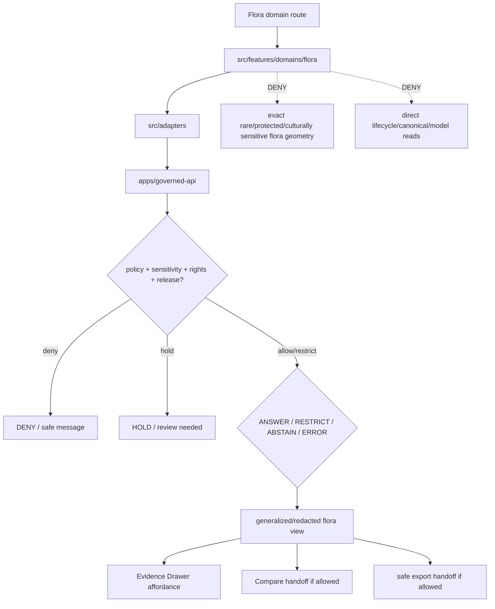

<!-- [KFM_META_BLOCK_V2]
doc_id: kfm://app/explorer-web/src/features/domains/flora/readme
title: Explorer Web Flora Domain Feature README
type: app-readme
version: v0.2
status: draft
owners: OWNER_TBD — Apps steward · UI steward · Flora steward · Sensitivity reviewer · Governed API steward · Policy steward · Docs steward
created: 2026-06-16
updated: 2026-07-09
policy_label: public
related:
  - ../../README.md
  - ../../../README.md
  - ../../../adapters/README.md
  - ../../../../README.md
  - ../../../../../README.md
  - ../../../../../governed-api/README.md
  - ../../../../../../README.md
  - ../../../../../../SECURITY.md
  - ../../../../../../docs/domains/flora/README.md
  - ../../../../../../docs/domains/flora/PUBLICATION_AND_ROLLBACK.md
  - ../../../../../../policy/domains/flora/README.md
  - ../../../../../../policy/sensitivity/flora/README.md
  - ../../../../../../packages/ui/README.md
  - ../../../../../../packages/maplibre/README.md
  - ../../../../../../packages/cesium/README.md
  - ../../../../../../policy/access/README.md
  - ../../../../../../policy/decision/README.md
  - ../../../../../../release/README.md
  - ../../../../../../data/README.md
  - ../../../../../../tools/validators/README.md
  - ../../../../../../tools/watchers/README.md
tags: [kfm, apps, explorer-web, domains, flora, feature, rare-plants, geoprivacy, redaction, evidence-drawer, map-first, no-direct-data-root, rollback-aware]
notes:
  - "v0.2 updates the uploaded Flora domain-feature README into a current repo-aware feature contract."
  - "apps/explorer-web/src/features/domains/flora/README.md, docs/domains/flora/README.md, docs/domains/flora/PUBLICATION_AND_ROLLBACK.md, policy/domains/flora/README.md, and policy/sensitivity/flora/README.md were verified through the GitHub app in this update. Prior related Explorer Web feature/adapter/source/app boundaries remain relevant, but adapter files, routes, runtime wiring, tests, and envelopes remain NEEDS VERIFICATION."
  - "Feature implementation files, route wiring, domain-view inventory, tests, fixtures, governed API envelopes, RedactionReceipts, AggregationReceipts, ReviewRecords, PolicyDecisions, ReleaseManifests, RollbackCards, correction notices, export handoff, Focus Mode behavior, Evidence Drawer behavior, package scripts, runtime behavior, and deployment behavior remain NEEDS VERIFICATION."
  - "Flora UI features may compose governed flora envelopes into public/semi-public views, but they must not expose exact rare/protected/culturally sensitive flora geometry or steward-reviewed records without reviewed, receipt-backed policy and release support."
  - "Public Flora UI must default to deny/hold/restrict when sensitivity, rights, geoprivacy transform, review, evidence, release, stale-state, rollback, correction, policy, or export support is unresolved."
[/KFM_META_BLOCK_V2] -->

<a id="top"></a>

<div align="center">

# Explorer Web Flora Domain Feature

`apps/explorer-web/src/features/domains/flora/`

**Domain-specific Explorer Web feature boundary for public-safe flora views: plant taxonomic identity, generalized occurrences, specimens, vegetation communities, rare-plant controls, invasive plants, phenology, habitat associations, Evidence Drawer handoffs, Focus Mode answers, and release-aware map surfaces rendered only through governed envelopes.**


[Purpose](#1-purpose) · [Current evidence](#2-current-repo-evidence) · [Repo fit](#3-repo-fit) · [Boundary](#4-authority-boundary) · [Inputs](#6-inputs) · [Exclusions](#7-exclusions) · [Feature map](#8-flora-feature-map) · [Definition of done](#15-definition-of-done)

</div>

---

> [!IMPORTANT]
> **Status:** draft / current README surface confirmed / implementation behavior `NEEDS VERIFICATION`  
> **Owners:** `OWNER_TBD` — Apps steward · UI steward · Flora steward · Sensitivity reviewer · Governed API steward · Policy steward · Docs steward  
> **Path:** `apps/explorer-web/src/features/domains/flora/README.md`  
> **Responsibility root:** `apps/` — deployable application surfaces  
> **Truth posture:** CONFIRMED README path and supporting Flora docs/policy README surfaces / PROPOSED domain-feature contract / UNKNOWN implementation files, route wiring, domain-view inventory, tests, fixtures, governed API envelopes, RedactionReceipts, AggregationReceipts, ReviewRecords, PolicyDecisions, ReleaseManifests, RollbackCards, correction notices, export handoff, Focus Mode behavior, Evidence Drawer behavior, package scripts, runtime behavior, and deployment behavior

> [!CAUTION]
> Flora is a geoprivacy- and rights-sensitive lane. Public UI must fail closed for rare, protected, culturally sensitive, steward-reviewed, or exact-location plant records unless a documented transform, review state, policy decision, and receipt-backed release path explicitly permit a generalized, redacted, staged, restricted, or public-safe output.

---

## Quick jump

- [1. Purpose](#1-purpose)
- [2. Current repo evidence](#2-current-repo-evidence)
- [3. Repo fit](#3-repo-fit)
- [4. Authority boundary](#4-authority-boundary)
- [5. Default posture](#5-default-posture)
- [6. Inputs](#6-inputs)
- [7. Exclusions](#7-exclusions)
- [8. Flora feature map](#8-flora-feature-map)
- [9. Diagram](#9-diagram)
- [10. Flora UI obligations](#10-flora-ui-obligations)
- [11. Per-view contract](#11-per-view-contract)
- [12. Inspection path](#12-inspection-path)
- [13. Validation expectations](#13-validation-expectations)
- [14. Safe change pattern](#14-safe-change-pattern)
- [15. Definition of done](#15-definition-of-done)
- [16. Open verification items](#16-open-verification-items)

---

## 1. Purpose

`apps/explorer-web/src/features/domains/flora/` is the proposed app-local feature boundary for Flora-specific Explorer Web surfaces.

It may eventually hold route modules, panels, view models, hooks, and feature orchestration for public-safe flora experiences such as:

- generalized plant occurrence and specimen views;
- vegetation community and distribution-surface views;
- rare/protected/culturally sensitive flora denial, restriction, and redaction messaging;
- invasive plant and restoration planting context;
- phenology observations and time-aware botanical summaries;
- habitat-association views that preserve habitat-lane ownership;
- Evidence Drawer handoffs that show only governed, redacted, audience-appropriate payloads;
- Focus Mode bounded flora answers with citation discipline and AIReceipt support;
- compare/export handoffs that preserve geoprivacy, redaction, review, rights, release, stale-state, correction, supersession, and rollback state.

This directory is not proof that any route, panel, hook, map layer, adapter, test, fixture, package script, governed API envelope, geoprivacy receipt, RedactionReceipt, AggregationReceipt, ReviewRecord, PolicyDecision, ReleaseManifest, RollbackCard, correction notice, Evidence Drawer behavior, Focus Mode behavior, export handoff, or runtime wiring is implemented.

[Back to top](#top)

---

## 2. Current repo evidence

| Surface | Status | What it proves | What it does **not** prove |
|---|---|---|---|
| `apps/explorer-web/src/features/domains/flora/README.md` | **CONFIRMED README** | This README exists and has been updated to v0.2. | Flora UI implementation files, route wiring, domain-view inventory, tests, fixtures, governed API envelopes, receipts, release manifests, rollback cards, export handoff, or runtime behavior. |
| `apps/explorer-web/src/features/README.md` | **CONFIRMED prior related boundary** | Parent feature README was previously verified in this session and says feature modules must not treat map features, tiles, local files, model text, or lifecycle data as claim truth. | That domain feature modules, route inventory, tests, fixtures, or runtime wiring exist. |
| `apps/explorer-web/src/adapters/README.md` | **CONFIRMED prior related boundary** | Adapter README was previously verified in this session as the governed API / renderer / evidence / layer / export / diagnostics adapter boundary. | That flora adapters or governed API client adapters are implemented. |
| `docs/domains/flora/README.md` | **CONFIRMED domain-doc surface** | Flora domain docs define Flora scope, deny-by-default sensitive plant location posture, and responsibility-root placement for Flora segments. | That app UI behavior, schemas, validators, policy bundles, source descriptors, releases, or routes are implemented. |
| `docs/domains/flora/PUBLICATION_AND_ROLLBACK.md` | **CONFIRMED publication/rollback doc surface** | Flora publication doctrine requires release gate decisions, ReleaseManifest, rollback target, correction path, stale-state handling, and rollback without erasing lineage. | That release integration, policy-as-code, or UI enforcement exists. |
| `policy/domains/flora/README.md` | **CONFIRMED policy-lane scaffold** | Flora policy-lane README exists. | It is still a greenfield scaffold and does not prove concrete policy files, tests, fixtures, CI binding, or runtime enforcement. |
| `policy/sensitivity/flora/README.md` | **CONFIRMED sensitivity-policy scaffold** | Flora sensitivity-policy README exists as a proposed scaffold. | It says authoritative content, owners, validation status, and cross-links must be filled in before treating it as canonical truth. |
| `apps/explorer-web/src/features/domains/README.md` | **NOT VERIFIED** | A parent domain-feature README was not confirmed in this update. | Does not prove absence across all refs; a future index remains useful if accepted. |
| Uploaded Flora Markdown | **CONFIRMED source text for this update** | Provided the base Flora domain-feature contract updated here. | Does not prove live implementation. |
| Implementation beyond README | **NEEDS VERIFICATION** | Checkable by repo scan, route inventory, fixtures, tests, package scripts, governed API envelopes, receipts, release records, and runtime evidence. | Not claimed by this README. |

[Back to top](#top)

---

## 3. Repo fit

| Concern | Owning root | Expected relationship |
|---|---|---|
| Flora domain feature source | `apps/explorer-web/src/features/domains/flora/` | App-local Flora UI feature modules, if implemented and tested. |
| Feature boundary | `apps/explorer-web/src/features/` | Parent feature/root contract. |
| Domain-feature parent index | `apps/explorer-web/src/features/domains/` | **NEEDS VERIFICATION**; parent README was not confirmed in this update. |
| Adapter boundary | `apps/explorer-web/src/adapters/` | Governed API, evidence, layer, map, export, and diagnostics adapters. |
| Explorer Web source tree | `apps/explorer-web/src/` | Parent source-layout boundary. |
| Explorer Web app | `apps/explorer-web/` | Map-first public/semi-public shell. |
| Governed API | `apps/governed-api/` | Trust membrane and normal claim-bearing data path. |
| Flora doctrine | `docs/domains/flora/` | Domain scope, source roles, sensitivity, publication, rollback, and verification backlog. |
| Flora policy | `policy/domains/flora/`, `policy/sensitivity/flora/` | Flora admissibility, geoprivacy, sensitivity, and exposure policy lanes, if executable wiring is accepted. |
| Shared UI components | `packages/ui/` | Reusable cards, badges, drawers, panels, and legends when shared. |
| Renderer wrappers | `packages/maplibre/`, `packages/cesium/` | Renderer behavior stays behind adapter/wrapper boundaries. |
| Release authority | `release/` | Publication, correction, supersession, rollback control. |
| Lifecycle artifacts | `data/` | Receipts, proofs, registry, catalog, triplets, and published artifacts. |
| Security posture | `SECURITY.md`, `docs/security/` | Secrets, sensitive-output, incident, exposure, and audit posture. |

[Back to top](#top)

---

## 4. Authority boundary

This feature renders governed Flora UI. It does not own Flora doctrine, source admission, source rights, sensitivity decisions, geoprivacy policy, schemas, contracts, lifecycle artifacts, release decisions, evidence truth, renderer authority, habitat truth, release authority, rollback authority, correction authority, or AI output.

```text
apps/explorer-web/src/features/domains/flora/ = app-local Flora UI feature
apps/explorer-web/src/features/              = feature boundary
apps/explorer-web/src/adapters/              = adapter boundary
apps/explorer-web/src/                       = Explorer Web implementation source
apps/explorer-web/                           = map-first public/semi-public app boundary
apps/governed-api/                           = trust membrane and normal data path
docs/domains/flora/                          = Flora doctrine and policy intent
policy/domains/flora/                        = Flora domain policy lane
policy/sensitivity/flora/                    = Flora geoprivacy / sensitivity policy lane
packages/ui/                                 = shared UI primitives
packages/maplibre/                           = renderer wrapper
packages/cesium/                             = optional gated renderer wrapper
policy/                                      = finite policy decisions
schemas/                                     = machine-readable shape
contracts/                                   = object meaning
data/                                        = lifecycle artifacts, receipts, proofs, registries
release/                                     = publication, correction, rollback authority
```

Safe interpretation:

- **CONFIRMED:** this README surface, Flora domain docs, Flora publication/rollback doc, Flora domain policy scaffold, and Flora sensitivity-policy scaffold exist.
- **PROPOSED:** Flora feature modules may live here when they preserve governed API, geoprivacy, redaction, aggregation, source-role, evidence, sensitivity, rights, rare/protected/cultural sensitivity status, review, release, stale-state, rollback, correction, export, and public-boundary constraints.
- **NEEDS VERIFICATION:** Flora modules, route wiring, domain-view inventory, adapter dependencies, fixtures, tests, package scripts, governed API envelopes, geoprivacy receipts, RedactionReceipts, AggregationReceipts, ReviewRecords, PolicyDecisions, ReleaseManifests, RollbackCards, correction notices, export handoff, Evidence Drawer behavior, Focus Mode behavior, runtime behavior, and deployment behavior.
- **DENY:** using this feature as Flora truth, Habitat truth, policy authority, source authority, release authority, rollback authority, lifecycle store, schema/contract home, direct canonical/internal store client, direct model-output surface, exact sensitive-flora exposure path, renderer authority, export authority, or public-data shortcut.

[Back to top](#top)

---

## 5. Default posture

Flora feature modules should fail closed, generalize before public release when sensitivity applies, and preserve the strictest applicable geoprivacy, rights, review, release, stale-state, correction, and rollback posture.

A view should not render claim-bearing flora content when any of these are unresolved:

- governed API envelope and response validation;
- object family or flora domain slug;
- plant taxonomic identity and protected/rare status;
- exact geometry or sensitive occurrence exposure risk;
- rare, protected, culturally sensitive, or steward-reviewed status;
- source role, rights, and provenance;
- cross-lane habitat, fauna, soil, hydrology, agriculture, hazards, archaeology, or people/land ownership;
- EvidenceRef or EvidenceBundle support;
- geoprivacy transform, RedactionReceipt, AggregationReceipt, ReviewRecord, PolicyDecision, or ReleaseManifest;
- release state, rollback target, correction path, stale-state, withdrawal, or supersession state;
- public audience or export destination.

[Back to top](#top)

---

## 6. Inputs

| Input family | Examples | Required posture |
|---|---|---|
| Flora view state | occurrence, specimen, vegetation community, range, distribution, invasive, phenology, restoration, domain Focus Mode | Explicit finite states. |
| API envelope | answer, abstain, deny, error, hold, restricted, decision envelope, evidence payload | Runtime-validated before render. |
| Sensitivity state | rare/protected occurrence, culturally sensitive flora, steward-reviewed record, exact geometry | Fail closed when unresolved. |
| Layer state | layer manifest, source role, legend, trust badges, valid time, selected feature id | Released or bounded-safe source only. |
| Evidence state | EvidenceRef, EvidenceBundle summary, citation validation, proof visibility | Required for claim-bearing detail. |
| Transform state | geoprivacy generalization, suppression, aggregation, redaction, stale-state label | Required when reducing exposure risk. |
| Review/policy state | ReviewRecord, PolicyDecision, sensitivity reviewer, release authority, rights state | Required for sensitive public-safe transforms. |
| Cross-lane state | habitat, fauna, soil, hydrology, agriculture, hazards, archaeology, people/land joins | Inherits strictest lane posture. |
| Release/correction state | release ref, rollback target, correction notice, stale-state, supersession, withdrawal | Required for public-facing claim and export support. |
| Export state | selected generalized layer, bounds, citation bundle, redaction/geoprivacy profile, output mode | Governed export only. |
| Focus Mode state | prompt class, finite outcome, evidence handles, policy result | No direct model output as flora truth. |

[Back to top](#top)

---

## 7. Exclusions

| Does not belong here | Correct home |
|---|---|
| Flora doctrine and scope | `docs/domains/flora/` |
| Flora policy bundles or geoprivacy decisions | `policy/domains/flora/`, `policy/sensitivity/flora/`, `policy/` |
| Governed API implementation | `apps/governed-api/` |
| Adapter logic shared across feature families | `apps/explorer-web/src/adapters/` |
| Shared reusable UI primitives | `packages/ui/` |
| Renderer wrapper authority | `packages/maplibre/`, `packages/cesium/` |
| Flora schemas and contracts | `schemas/contracts/v1/domains/flora/`, `contracts/domains/flora/` |
| Lifecycle artifacts, receipts, proofs, catalog, triplets | `data/` |
| Release manifests, rollback cards, correction notices | `release/` |
| Exact rare/protected/culturally sensitive plant coordinates | denied from public UI unless reviewed transformed output is explicitly allowed |
| Habitat patches or suitability truth | Habitat lane, with governed relation from Flora when needed. |
| Animal, soil, hydrology, agriculture, hazards, archaeology, or people/land truth | Owning domain lanes. |
| Source acquisition or source registry records | `connectors/`, `data/registry/`, source catalog lanes. |
| Direct RAW / WORK / QUARANTINE / PROCESSED / CATALOG / TRIPLET / PUBLISHED reads | governed API, released artifacts, layer manifests, and bounded public-safe envelopes only. |
| Direct model runtime behavior | `runtime/` behind governed API only. |
| Secrets, credentials, tokens, private keys, exact sensitive flora details, transformation parameters, exposure hints | secret manager / deployment environment, not UI feature source or examples. |
| Public-sensitive exports, exact restricted locations, living-person/DNA details, source-restricted records, prompt/model traces | denied unless separately governed and public-safe. |

[Back to top](#top)

---

## 8. Flora feature map

Exact modules remain `NEEDS VERIFICATION`. Candidate views should be introduced only with route inventory, fixtures, governed API envelopes, geoprivacy receipts, review records, policy decisions, release manifests, rollback cards, and tests.

| Candidate view | Purpose | Required safeguard | Status |
|---|---|---|---|
| `generalized-occurrences` | Show public-safe occurrence context without sensitive exact geometry. | Geoprivacy transform + receipt + review. | PROPOSED |
| `specimen-summary` | Show specimen or collection context. | Source role, evidence, and rights labels. | PROPOSED |
| `vegetation-community` | Show vegetation community surfaces. | Habitat/lane relation and release state. | PROPOSED |
| `distribution-surface` | Show range or distribution products. | Generalization, uncertainty, and release state. | PROPOSED |
| `invasive-context` | Show invasive plant context. | Public-safe layer and private-detail suppression. | PROPOSED |
| `phenology-summary` | Show phenology observations and time-aware summaries. | Valid-time and evidence support. | PROPOSED |
| `restoration-context` | Show restoration planting context. | Source-role, rights, and no-private-site inference. | PROPOSED |
| `sensitive-denial` | Explain why exact rare/protected detail is unavailable. | Safe reason code; no exposure hints. | PROPOSED |
| `domain-focus` | Flora Focus Mode UI. | Finite outcomes; no direct model truth or protected detail. | PROPOSED |
| `domain-evidence` | Evidence Drawer handoff. | Redacted/audience-appropriate payload only. | PROPOSED |
| `domain-export` | Flora export handoff. | Citation, redaction, geoprivacy, rights, review, release checks. | PROPOSED |
| `domain-compare` | Flora compare handoff. | Geoprivacy, time, release, review, provenance, stale-state, and audience posture preserved. | PROPOSED |
| `correction-status` | Public-safe stale/supersession/correction/rollback status. | Release/correction/rollback refs only; no protected payloads. | PROPOSED |

> [!WARNING]
> Candidate view names are not implementation proof. Do not document a view as runnable until files, route wiring, tests, fixtures, package scripts, receipts, review records, policy decisions, release manifests, rollback cards, and governed API envelopes confirm it.

[Back to top](#top)

---

## 9. Diagram



[Back to top](#top)

---

## 10. Flora UI obligations

| Obligation | Example effect |
|---|---|
| `governed_api_only` | Flora feature state comes through governed API envelopes. |
| `deny_sensitive_exact_by_default` | Exact rare/protected/culturally sensitive flora geometry does not render publicly by default. |
| `geoprivacy_required` | Public-safe surfaces require reviewed geoprivacy, aggregation, or redaction transform support. |
| `receipt_required` | RedactionReceipt, AggregationReceipt, ReviewRecord, PolicyDecision, ReleaseManifest, and RollbackCard are preserved where required. |
| `evidence_required` | Claim-bearing details link to EvidenceBundle-derived payloads. |
| `no_exposure_hints` | Denial messages do not reveal sensitive locations, parameters, transformation details, or reconstruction hints. |
| `stale_state_visible` | Stale, corrected, superseded, withdrawn, and rollback states are visible where material. |
| `finite_states_required` | Views render answer, restrict, abstain, deny, error, hold, loading, stale, corrected, rollback, and empty states safely. |
| `safe_compare_required` | Compare handoff preserves geoprivacy, release, review, provenance, time, stale-state, and finite-state posture. |
| `safe_export_required` | Export handoff preserves citations, geoprivacy, redaction, rights, review, release, correction, and rollback constraints. |
| `no_authority_fork` | Feature code does not redefine Flora policy, schema, contract, source, release, geoprivacy, or evidence logic. |
| `no_data_root_shortcut` | Feature code does not read lifecycle data roots, canonical/internal stores, local source files, or model output as claim sources. |
| `local_parity_preferred` | Flora fixtures/tests should be runnable locally and in CI with the same inputs where practical. |

[Back to top](#top)

---

## 11. Per-view contract

Every long-lived Flora domain view should document or encode:

- view purpose and route ownership;
- flora object families and source families consumed;
- governed API envelope or adapter dependency;
- geoprivacy, redaction, aggregation, and suppression obligations;
- taxonomic, source-role, rights, and sensitivity display behavior;
- review, policy-decision, release, correction, stale-state, supersession, withdrawal, and rollback behavior;
- expected finite outcomes;
- evidence/citation display behavior;
- loading, empty, deny, abstain, error, hold, restricted, stale, corrected, and rollback states;
- direct lifecycle/canonical/model-output denial posture;
- compare, Focus Mode, Evidence Drawer, or export behavior, if any;
- tests and fixtures proving trust-membrane and sensitive-exposure boundaries.

[Back to top](#top)

---

## 12. Inspection path

Flora feature implementation files, route wiring, tests, fixtures, governed API envelopes, geoprivacy receipts, review records, release manifests, rollback cards, package scripts, and export handoff remain `NEEDS VERIFICATION`.

```bash
find apps/explorer-web/src/features/domains/flora -maxdepth 5 -type f | sort
find apps/explorer-web/src apps/governed-api docs/domains/flora policy/domains/flora policy/sensitivity/flora packages/ui packages/maplibre tests fixtures -maxdepth 6 -type f 2>/dev/null | grep -Ei 'flora|plant|taxon|occurrence|specimen|rare|protected|vegetation|community|invasive|phenology|restoration|redaction|aggregation|evidence|release|rollback|governed' | sort
find data/raw data/work data/quarantine data/processed data/catalog data/triplets data/published data/receipts data/proofs -maxdepth 2 -type f 2>/dev/null | sort
```

[Back to top](#top)

---

## 13. Validation expectations

Useful validation for this feature boundary should cover:

- no Flora feature imports or reads lifecycle data roots directly;
- claim-bearing Flora views consume governed API envelopes only;
- malformed Flora envelopes render safe error or abstain states;
- exact rare/protected/culturally sensitive flora geometry and steward-reviewed records are denied, generalized, held, or restricted by default;
- generalized views preserve geoprivacy transform state, sensitivity, rights, release, stale-state, citation, and review metadata;
- denial messages do not leak locations, parameters, transformation details, or reconstruction hints;
- cross-lane sensitive joins inherit the strictest lane posture;
- Evidence Drawer handoff preserves EvidenceRef/EvidenceBundle handles without exposing protected content;
- Focus Mode renders finite outcomes and never direct model output as truth;
- compare and export handoffs require citation, geoprivacy/redaction, rights, review, release, correction, and rollback support;
- UI output does not expose secrets, exact restricted locations, source-restricted records, private data, or prompt/model traces.

[Back to top](#top)

---

## 14. Safe change pattern

For Flora feature changes:

1. Add or update route inventory and per-view contract.
2. Add fixtures for generalized, restricted, denied, held, abstained, malformed, loading, stale, corrected, rolled-back, and empty states.
3. Test lifecycle-data denial and governed API-only behavior.
4. Preserve geoprivacy, sensitivity, taxonomic/source-role, review, release, rollback, rights, and citation fields through UI state.
5. Verify denial messaging does not reveal exposure hints, transform parameters, reconstruction clues, or sensitive location detail.
6. Verify compare, export, Focus Mode, and Evidence Drawer handoffs cannot bypass policy, review, geoprivacy, release, correction, or rollback checks.
7. Update this README, parent `features/README.md`, adapter README, flora docs, policy READMEs, publication/rollback docs, and parent app README when public behavior changes.

[Back to top](#top)

---

## 15. Definition of done

- [ ] Owners are confirmed and `OWNER_TBD` is replaced.
- [ ] Flora feature file inventory and route ownership are documented.
- [ ] Governed API and adapter dependencies are explicit.
- [ ] Flora sensitivity, geoprivacy, review, rights, release, stale-state, and rollback states are represented in UI fixtures.
- [ ] Redaction/generalization/aggregation obligations survive feature composition.
- [ ] Direct lifecycle-data import/read checks are covered.
- [ ] Exact rare/protected/culturally sensitive flora denial states are tested.
- [ ] Denial messaging is tested for no exposure hints.
- [ ] Cross-lane sensitivity inheritance is tested.
- [ ] Finite states cover answer, restrict, abstain, deny, error, hold, loading, stale, corrected, rollback, and empty cases.
- [ ] Evidence Drawer, Focus Mode, Compare, and Export handoffs are tested for safe output if present.
- [ ] Parent feature/adapter/source/app READMEs and Flora docs/policy surfaces are updated when public behavior changes.

[Back to top](#top)

---

## 16. Open verification items

| Item | Why it matters |
|---|---|
| Confirm Flora feature implementation files beyond README | Prevents overclaiming feature maturity. |
| Confirm route inventory | Required for public/semi-public UI boundary review. |
| Confirm governed API Flora envelopes | Required for trust membrane enforcement. |
| Confirm adapter dependency shape | Required so Flora UI does not bypass governed adapters. |
| Confirm geoprivacy/redaction receipt and review-record linkage | Required before public-safe transformation claims. |
| Confirm policy-decision linkage | Required before enforcement claims. |
| Confirm release, correction, stale-state, supersession, withdrawal, and rollback states | Required before public map-layer claims. |
| Confirm release manifest and rollback-card linkage | Required before publication-support claims. |
| Confirm fixtures and tests | Required before implementation claims. |
| Confirm Focus Mode and Evidence Drawer behavior | Required before claim-bearing Flora UI claims. |
| Confirm Compare handoff | Required before visual-difference claims. |
| Confirm export handoff | Required before public download workflows. |
| Confirm direct data-root denial | Required for public client trust membrane. |
| Confirm executable Flora policy and sensitivity-policy binding | Required before enforcement claims. |
| Confirm no exposure-hint messaging | Required before denial-state UI claims. |
| Confirm package scripts beyond TODO | Required before build/test claims. |

<details>
<summary>Appendix A — no-loss preservation note</summary>

The uploaded README replaced a greenfield Flora domain-feature stub with a bounded Flora feature contract without claiming Flora routes, panels, hooks, adapters, fixtures, tests, package scripts, governed API envelopes, geoprivacy receipts, ReviewRecords, PolicyDecisions, ReleaseManifests, RollbackCards, Focus Mode, Evidence Drawer, Compare, or export handoff are implemented. This v0.2 update preserves that structure while adding current repo evidence, supporting Flora docs/policy evidence, stronger no-direct-data-root language, no-exposure-hints posture, cross-lane sensitivity inheritance, release/correction/rollback posture, compare/export handoff posture, local-parity expectations, and expanded verification items.

</details>

## Status summary

`apps/explorer-web/src/features/domains/flora/` should contain Flora-specific Explorer Web feature modules only after route contracts, governed API envelopes, geoprivacy/redaction posture, fixtures, tests, Evidence Drawer behavior, Focus Mode behavior, Compare behavior, release/stale/rollback handling, and export handoff are verified.

It must preserve the trust membrane and Flora sensitivity posture: the feature may show generalized, aggregated, redacted, audience-appropriate, stale-labeled, corrected, or restricted Flora knowledge, but it must not expose exact rare/protected/culturally sensitive flora geometry, become Flora truth, bypass policy, publish, read lifecycle/canonical stores directly, leak exposure hints, or turn map features into unsupported claims.

<p align="right"><a href="#top">Back to top</a></p>
