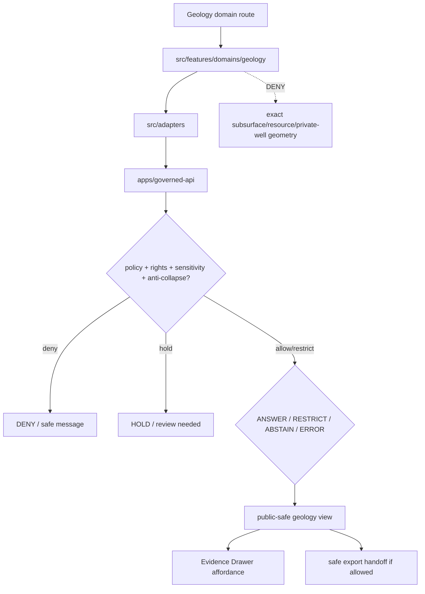

<!-- [KFM_META_BLOCK_V2]
doc_id: kfm://app/explorer-web/src/features/domains/geology/readme
title: Explorer Web Geology Domain Feature README
type: app-readme
version: v0.1
status: draft
owners: OWNER_TBD — Apps steward · UI steward · Geology steward · Governed API steward · Policy steward · Docs steward
created: 2026-06-16
updated: 2026-06-16
policy_label: public
related:
  - ../../README.md
  - ../../../README.md
  - ../../../adapters/README.md
  - ../../../../README.md
  - ../../../../../README.md
  - ../../../../../governed-api/README.md
  - ../../../../../../docs/domains/geology/README.md
  - ../../../../../../docs/domains/geology/POLICY.md
  - ../../../../../../policy/domains/geology/README.md
  - ../../../../../../packages/ui/README.md
  - ../../../../../../packages/maplibre/README.md
  - ../../../../../../policy/access/README.md
  - ../../../../../../policy/decision/README.md
  - ../../../../../../release/README.md
  - ../../../../../../data/README.md
tags: [kfm, apps, explorer-web, domains, geology, natural-resources, feature, public-safe-geometry, anti-collapse, evidence-drawer]
notes:
  - "Replaces the greenfield geology domain feature stub with a governed feature README."
  - "Geology UI features may compose governed geology envelopes into public/semi-public views, but they must not expose exact borehole/core/well-log/private-well/sensitive-resource geometry or collapse occurrence, deposit, estimate, permit, production, and reserve claims."
  - "Feature implementation files, route wiring, tests, fixtures, governed API envelopes, RedactionReceipts, AggregationReceipts, ReviewRecords, PolicyDecisions, ReleaseManifests, and package scripts remain NEEDS VERIFICATION."
[/KFM_META_BLOCK_V2] -->

<a id="top"></a>

<div align="center">

# Explorer Web Geology Domain Feature

`apps/explorer-web/src/features/domains/geology/`

**Domain-specific Explorer Web feature boundary for public-safe geology and natural-resource views: bedrock, surficial geology, stratigraphy, structures, subsurface context, resource summaries, Evidence Drawer handoffs, Focus Mode answers, and release-aware map surfaces rendered only through governed envelopes.**


[Purpose](#1-purpose) · [Repo fit](#2-repo-fit) · [Boundary](#3-authority-boundary) · [Inputs](#5-inputs) · [Exclusions](#6-exclusions) · [Feature map](#7-geology-feature-map) · [Definition of done](#14-definition-of-done)

</div>

---

> [!IMPORTANT]
> **Status:** draft / `NEEDS VERIFICATION`  
> **Owners:** `OWNER_TBD` — Apps steward · UI steward · Geology steward · Governed API steward · Policy steward · Docs steward  
> **Path:** `apps/explorer-web/src/features/domains/geology/README.md`  
> **Responsibility root:** `apps/` — deployable application surfaces  
> **Truth posture:** CONFIRMED README path / CONFIRMED geology doctrine and policy docs / PROPOSED domain-feature contract / UNKNOWN implementation files, route wiring, tests, fixtures, and runtime behavior

> [!CAUTION]
> Geology UI is public-safe interpretation, not extraction targeting, lease/title/permit authority, or raw subsurface disclosure. It must fail closed for exact borehole, core, well-log, private-well, and sensitive resource locations, and it must keep occurrence, deposit, estimate, permit, production, and reserve claims distinct.

---

## Quick jump

- [1. Purpose](#1-purpose)
- [2. Repo fit](#2-repo-fit)
- [3. Authority boundary](#3-authority-boundary)
- [4. Default posture](#4-default-posture)
- [5. Inputs](#5-inputs)
- [6. Exclusions](#6-exclusions)
- [7. Geology feature map](#7-geology-feature-map)
- [8. Diagram](#8-diagram)
- [9. Geology UI obligations](#9-geology-ui-obligations)
- [10. Per-view contract](#10-per-view-contract)
- [11. Inspection path](#11-inspection-path)
- [12. Validation expectations](#12-validation-expectations)
- [13. Safe change pattern](#13-safe-change-pattern)
- [14. Definition of done](#14-definition-of-done)
- [15. Open verification items](#15-open-verification-items)

---

## 1. Purpose

`apps/explorer-web/src/features/domains/geology/` is the proposed app-local feature boundary for Geology and Natural Resources Explorer Web surfaces.

It may eventually hold route modules, panels, view models, hooks, and feature orchestration for public-safe geology experiences such as:

- bedrock and surficial geology map views;
- stratigraphy, lithology, structure, fault, and geomorphology context;
- public-safe borehole, core, well-log, and geophysical/geochemical summaries;
- mineral occurrence and resource-context summaries that do not become extraction targeting;
- hydrostratigraphy context that preserves Hydrology lane ownership;
- Evidence Drawer handoffs that show governed, role-typed, audience-appropriate payloads;
- Focus Mode bounded geology answers with citation discipline and AIReceipt support;
- compare/export handoffs that preserve public-safe geometry, redaction, rights, release, correction, and rollback state.

This directory is not proof that any route, panel, hook, map layer, adapter, test, fixture, package script, or governed API envelope is implemented.

[Back to top](#top)

---

## 2. Repo fit

| Concern | Owning root | Expected relationship |
|---|---|---|
| Geology domain feature source | `apps/explorer-web/src/features/domains/geology/` | App-local Geology UI feature modules, if implemented and tested |
| Feature boundary | `apps/explorer-web/src/features/` | Parent feature/root contract |
| Adapter boundary | `apps/explorer-web/src/adapters/` | Governed API, evidence, layer, map, export, and diagnostics adapters |
| Explorer Web app | `apps/explorer-web/` | Map-first public/semi-public shell |
| Governed API | `apps/governed-api/` | Trust membrane and normal data path |
| Geology doctrine | `docs/domains/geology/` | Domain scope, anti-collapse, source roles, policy intent, and verification backlog |
| Geology policy | `policy/domains/geology/` | Geology admissibility and exposure policy, if executable wiring is accepted |
| Shared UI components | `packages/ui/` | Reusable cards, badges, drawers, panels, and legends when shared |
| Renderer wrappers | `packages/maplibre/`, `packages/cesium/` | Renderer behavior stays behind adapter/wrapper boundaries |
| Release authority | `release/` | Publication, correction, supersession, rollback control |
| Lifecycle artifacts | `data/` | Receipts, proofs, registry, catalog, triplets, and published artifacts |

## 3. Authority boundary

This feature renders governed Geology UI. It does not own Geology doctrine, source admission, source rights, sensitivity decisions, resource policy, schemas, contracts, lifecycle artifacts, release decisions, evidence truth, renderer authority, lease/title/permit truth, hydrology truth, or AI output.

```text
apps/explorer-web/src/features/domains/geology/ = app-local Geology UI feature
apps/explorer-web/src/features/                = feature boundary
apps/explorer-web/src/adapters/                = adapter boundary
apps/governed-api/                             = trust membrane and normal data path
docs/domains/geology/                          = Geology doctrine and policy intent
policy/domains/geology/                        = Geology domain policy lane
packages/ui/                                   = shared UI primitives
policy/                                        = finite policy decisions
data/                                          = lifecycle artifacts, receipts, proofs, registries
release/                                       = publication, correction, rollback authority
```

## 4. Default posture

Geology feature modules should fail closed, preserve anti-collapse labels, generalize sensitive geometry before public release, and keep the strictest applicable rights, source-role, review, release, stale-state, and rollback posture.

A view should not render claim-bearing geology content when any of these are unresolved:

- governed API envelope and response validation;
- object family or geology domain slug;
- source role, provenance, and dated observation context;
- rights or license posture;
- exact borehole/core/sample/well-log/private-well/sensitive-resource geometry exposure risk;
- mineral occurrence, deposit, estimate, permit, production, reserve, lease, or title distinction;
- hydrostratigraphy or cross-lane hydrology relation posture;
- EvidenceRef or EvidenceBundle support;
- RedactionReceipt, AggregationReceipt, ReviewRecord, PolicyDecision, or ReleaseManifest support;
- release state, rollback target, correction path, stale-state, or supersession state;
- public audience or export destination.

## 5. Inputs

| Input family | Examples | Required posture |
|---|---|---|
| Geology view state | bedrock, surficial, stratigraphy, lithology, structure, borehole summary, resource context, domain Focus Mode | Explicit finite states |
| API envelope | answer, abstain, deny, error, hold, restricted, decision envelope, evidence payload | Runtime-validated before render |
| Sensitivity state | exact borehole, core, well-log, private well, sensitive resource, extraction-targetable location | Default deny/restrict when unresolved |
| Layer state | layer manifest, source role, legend, trust badges, valid time, selected feature id | Released or bounded-safe source only |
| Evidence state | EvidenceRef, EvidenceBundle summary, citation validation, proof visibility | Required for claim-bearing detail |
| Transform state | generalized geometry, suppression, aggregation, redaction, stale-state label | Required when reducing exposure risk |
| Cross-lane state | hydrology, soils, hazards, infrastructure, people/land, archaeology joins | Inherits strictest lane posture |
| Export state | selected generalized layer, bounds, citation bundle, redaction/generalization profile, output mode | Governed export only |

## 6. Exclusions

| Does not belong here | Correct home |
|---|---|
| Geology doctrine and scope | `docs/domains/geology/` |
| Geology policy bundles or sensitive-resource decisions | `policy/domains/geology/`, `policy/` |
| Governed API implementation | `apps/governed-api/` |
| Adapter logic shared across feature families | `apps/explorer-web/src/adapters/` |
| Shared reusable UI primitives | `packages/ui/` |
| Renderer wrapper authority | `packages/maplibre/`, `packages/cesium/` |
| Geology schemas and contracts | `schemas/contracts/v1/domains/geology/`, `contracts/domains/geology/` — lane-path form remains `NEEDS VERIFICATION` |
| Lifecycle artifacts, receipts, proofs, catalog, triplets | `data/` |
| Release manifests, rollback cards, correction notices | `release/` |
| Exact borehole/core/well-log/private-well/sensitive-resource coordinates | Denied from public UI unless reviewed transformed output is explicitly allowed |
| Lease, title, permit, ownership, reserve, or production authority | Owning regulatory/source authority and governed API context only |
| Hydrologic canonical observations | Hydrology lane; Geology may supply hydrostratigraphy context only |
| Source acquisition or source registry records | `connectors/`, `data/registry/`, source catalog lanes |
| Direct model runtime behavior | `runtime/` behind governed API only |
| Secrets, credentials, tokens, private keys | Secret manager / deployment environment |

## 7. Geology feature map

Exact modules remain `NEEDS VERIFICATION`. Candidate views should be introduced only with route inventory, fixtures, and tests.

| Candidate view | Purpose | Required safeguard | Status |
|---|---|---|---|
| `bedrock-map` | Show bedrock geologic unit context | Source role, legend, release state | PROPOSED |
| `surficial-map` | Show surficial geology context | Source role, scale, release state | PROPOSED |
| `stratigraphy-summary` | Show stratigraphy/lithology/correlation context | Evidence and uncertainty labels | PROPOSED |
| `structure-context` | Show faults, folds, geomorphology, structural context | Map scale and source-role labels | PROPOSED |
| `subsurface-summary` | Show public-safe borehole/core/well-log summaries | Generalized geometry and rights check | PROPOSED |
| `resource-context` | Show mineral/resource occurrence summaries | Anti-collapse labels; no extraction targeting | PROPOSED |
| `hydrostratigraphy-context` | Show geology-to-hydrology context | Hydrology lane ownership preserved | PROPOSED |
| `sensitive-denial` | Explain why exact resource/subsurface detail is unavailable | Safe reason code; no exposure hints | PROPOSED |
| `domain-focus` | Geology Focus Mode UI | Finite outcomes; no direct model truth or protected detail | PROPOSED |
| `domain-evidence` | Evidence Drawer handoff | Audience-appropriate payload only | PROPOSED |
| `domain-export` | Geology export handoff | Citation, redaction, rights, review, release checks | PROPOSED |

> [!WARNING]
> Candidate view names are not implementation proof. Do not document a view as runnable until files, route wiring, tests, fixtures, package scripts, and governed API envelopes confirm it.

## 8. Diagram



## 9. Geology UI obligations

| Obligation | Example effect |
|---|---|
| `governed_api_only` | Geology feature state comes through governed API envelopes |
| `anti_collapse_required` | Occurrence, deposit, estimate, permit, production, and reserve stay visibly distinct |
| `deny_exact_sensitive_by_default` | Exact subsurface/resource/private-well geometry does not render publicly by default |
| `public_safe_geometry_required` | Sensitive point data requires reviewed generalization, redaction, or aggregation support |
| `receipt_required` | RedactionReceipt, AggregationReceipt, ReviewRecord, PolicyDecision, and ReleaseManifest are preserved where required |
| `evidence_required` | Claim-bearing details link to EvidenceBundle-derived payloads |
| `no_exposure_hints` | Denial messages do not reveal sensitive coordinates, targeting clues, or transform parameters |
| `finite_states_required` | Views render answer, restrict, abstain, deny, error, hold, loading, and empty states safely |
| `safe_export_required` | Export handoff preserves citations, redaction/generalization, rights, review, release, and rollback constraints |
| `no_authority_fork` | Feature code does not redefine Geology policy, schema, contract, source, release, resource, or evidence logic |

## 10. Per-view contract

Every long-lived Geology domain view should document or encode:

- view purpose and route ownership;
- geology object families and source families consumed;
- governed API envelope or adapter dependency;
- anti-collapse labels and claim-type distinctions;
- public-safe geometry, redaction, aggregation, and suppression obligations;
- source-role, rights, uncertainty, and scale display behavior;
- release, stale-state, correction, supersession, and rollback behavior;
- expected finite outcomes;
- evidence/citation display behavior;
- loading, empty, deny, abstain, error, hold, restricted states;
- export behavior, if any;
- tests and fixtures proving trust-membrane and sensitive-exposure boundaries.

## 11. Inspection path

Geology feature implementation files, route wiring, tests, fixtures, governed API envelopes, redaction/generalization receipts, review records, release manifests, rollback cards, package scripts, and export handoff remain `NEEDS VERIFICATION`.

```bash
find apps/explorer-web/src/features/domains/geology -maxdepth 5 -type f | sort
find apps/explorer-web/src apps/governed-api docs/domains/geology policy/domains/geology packages/ui packages/maplibre tests fixtures -maxdepth 6 -type f 2>/dev/null | grep -Ei 'geology|geologic|bedrock|surficial|stratigraphy|lithology|fault|borehole|core|well|log|mineral|deposit|reserve|resource|hydrostrat|redaction|aggregation|evidence|release|rollback|governed' | sort
find data/raw data/work data/quarantine data/processed data/catalog data/triplets data/published data/receipts data/proofs -maxdepth 2 -type f 2>/dev/null | sort
```

## 12. Validation expectations

Useful validation for this feature boundary should cover:

- no Geology feature imports or reads lifecycle data roots directly;
- claim-bearing Geology views consume governed API envelopes only;
- malformed Geology envelopes render safe error or abstain states;
- exact borehole/core/well-log/private-well/sensitive-resource coordinates are denied, generalized, held, or restricted by default;
- occurrence, deposit, estimate, permit, production, and reserve claims remain distinct;
- generalized views preserve public-safe geometry transform state, sensitivity, rights, release, stale-state, citation, and review metadata;
- denial messages do not leak coordinates, targeting clues, or transformation hints;
- Evidence Drawer handoff preserves EvidenceRef/EvidenceBundle handles without exposing protected content;
- Focus Mode renders finite outcomes and never direct model output as truth;
- export handoff requires citation, redaction/generalization, rights, review, release, correction, and rollback support.

## 13. Safe change pattern

For Geology feature changes:

1. Add or update route inventory and per-view contract.
2. Add fixtures for open, generalized, restricted, denied, held, abstained, malformed, loading, stale, corrected, rolled-back, and empty states.
3. Test lifecycle-data denial and governed API-only behavior.
4. Preserve public-safe geometry, source-role, rights, anti-collapse labels, review, release, rollback, and citation fields through UI state.
5. Update this README, parent `features/README.md`, geology docs, and parent app README when public behavior changes.

## 14. Definition of done

- [ ] Owners are confirmed and `OWNER_TBD` is replaced.
- [ ] Geology feature file inventory and route ownership are documented.
- [ ] Governed API and adapter dependencies are explicit.
- [ ] Geology sensitivity, public-safe geometry, rights, anti-collapse, release, stale-state, and rollback states are represented in UI fixtures.
- [ ] Redaction/generalization/aggregation obligations survive feature composition.
- [ ] Direct lifecycle-data import/read checks are covered.
- [ ] Exact subsurface/resource/private-well denial states are tested.
- [ ] Claim-type anti-collapse states are tested.
- [ ] Finite states cover answer, restrict, abstain, deny, error, hold, loading, stale, corrected, rollback, and empty cases.
- [ ] Export, Focus Mode, and Evidence Drawer handoffs are tested for safe output if present.

## 15. Open verification items

| Item | Why it matters |
|---|---|
| Confirm Geology feature implementation files beyond README | Prevents overclaiming feature maturity |
| Confirm route inventory | Required for public/semi-public UI boundary review |
| Confirm governed API Geology envelopes | Required for trust membrane enforcement |
| Confirm public-safe geometry receipt and review-record linkage | Required before public-safe transformation claims |
| Confirm anti-collapse fixtures | Prevents occurrence/deposit/estimate/permit/production/reserve drift |
| Confirm release, correction, stale-state, and rollback states | Required before public map-layer claims |
| Confirm Focus Mode and Evidence Drawer behavior | Required before claim-bearing Geology UI claims |
| Confirm export handoff | Required before public download workflows |
| Confirm package scripts beyond TODO | Required before build/test claims |

<details>
<summary>Appendix A — no-loss preservation note</summary>

The previous README was a greenfield stub. This replacement adds a bounded Geology domain-feature contract without claiming Geology routes, panels, hooks, adapters, fixtures, tests, package scripts, governed API envelopes, public-safe geometry receipts, ReviewRecords, PolicyDecisions, ReleaseManifests, RollbackCards, Focus Mode, Evidence Drawer, or export handoff are implemented.

</details>

## Status summary

`apps/explorer-web/src/features/domains/geology/` should contain Geology-specific Explorer Web feature modules only after route contracts, governed API envelopes, public-safe geometry posture, fixtures, tests, anti-collapse behavior, Evidence Drawer behavior, Focus Mode behavior, release/stale/rollback handling, and export handoff are verified.

It must preserve the trust membrane and Geology sensitivity posture: the feature may show generalized, aggregated, redacted, audience-appropriate, stale-labeled, corrected, or restricted Geology knowledge, but it must not expose exact subsurface/resource/private-well geometry, become Geology truth, bypass policy, publish, read lifecycle/canonical stores directly, collapse resource claim types, or turn map features into unsupported claims.

<p align="right"><a href="#top">Back to top</a></p>
