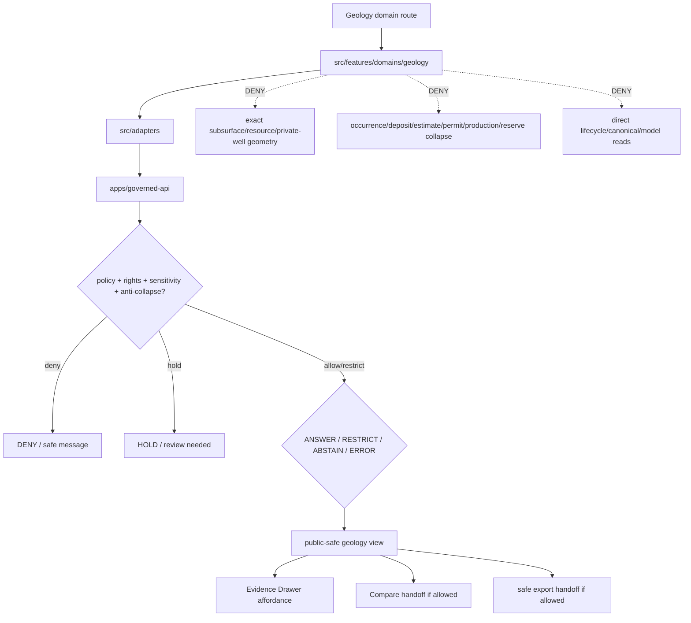

<!-- [KFM_META_BLOCK_V2]
doc_id: kfm://app/explorer-web/src/features/domains/geology/readme
title: Explorer Web Geology Domain Feature README
type: app-readme
version: v0.2
status: draft
owners: OWNER_TBD — Apps steward · UI steward · Geology steward · Governed API steward · Policy steward · Docs steward
created: 2026-06-16
updated: 2026-07-09
policy_label: public
related:
  - ../../README.md
  - ../../../README.md
  - ../../../adapters/README.md
  - ../../../../README.md
  - ../../../../../README.md
  - ../../../../../governed-api/README.md
  - ../../../../../../README.md
  - ../../../../../../SECURITY.md
  - ../../../../../../docs/domains/geology/README.md
  - ../../../../../../docs/domains/geology/POLICY.md
  - ../../../../../../policy/domains/geology/README.md
  - ../../../../../../packages/ui/README.md
  - ../../../../../../packages/maplibre/README.md
  - ../../../../../../packages/cesium/README.md
  - ../../../../../../policy/access/README.md
  - ../../../../../../policy/decision/README.md
  - ../../../../../../release/README.md
  - ../../../../../../data/README.md
  - ../../../../../../tools/validators/README.md
  - ../../../../../../tools/watchers/README.md
tags: [kfm, apps, explorer-web, domains, geology, natural-resources, feature, public-safe-geometry, anti-collapse, evidence-drawer, no-direct-data-root, rollback-aware]
notes:
  - "v0.2 updates the uploaded Geology domain-feature README into a current repo-aware feature contract."
  - "apps/explorer-web/src/features/domains/geology/README.md, apps/explorer-web/src/features/README.md, docs/domains/geology/README.md, docs/domains/geology/POLICY.md, and policy/domains/geology/README.md were verified through the GitHub app in this update. Prior related Explorer Web adapter/source/app boundaries remain relevant, but adapter files, routes, runtime wiring, tests, and envelopes remain NEEDS VERIFICATION."
  - "Feature implementation files, route wiring, domain-view inventory, tests, fixtures, governed API envelopes, RedactionReceipts, AggregationReceipts, ReviewRecords, PolicyDecisions, ReleaseManifests, RollbackCards, correction notices, export handoff, Focus Mode behavior, Evidence Drawer behavior, package scripts, runtime behavior, and deployment behavior remain NEEDS VERIFICATION."
  - "Geology UI features may compose governed geology envelopes into public/semi-public views, but they must not expose exact borehole/core/well-log/private-well/sensitive-resource geometry or collapse occurrence, deposit, estimate, permit, production, reserve, lease, title, or ownership claims."
  - "Public Geology UI must default to deny/hold/restrict when rights, sensitivity, public-safe geometry transform, review, evidence, release, stale-state, rollback, correction, policy, anti-collapse support, or export support is unresolved."
[/KFM_META_BLOCK_V2] -->

<a id="top"></a>

<div align="center">

# Explorer Web Geology Domain Feature

`apps/explorer-web/src/features/domains/geology/`

**Domain-specific Explorer Web feature boundary for public-safe geology and natural-resource views: bedrock, surficial geology, stratigraphy, structures, subsurface context, resource summaries, Evidence Drawer handoffs, Focus Mode answers, and release-aware map surfaces rendered only through governed envelopes.**


[Purpose](#1-purpose) · [Current evidence](#2-current-repo-evidence) · [Repo fit](#3-repo-fit) · [Boundary](#4-authority-boundary) · [Inputs](#6-inputs) · [Exclusions](#7-exclusions) · [Feature map](#8-geology-feature-map) · [Definition of done](#15-definition-of-done)

</div>

---

> [!IMPORTANT]
> **Status:** draft / current README surface confirmed / implementation behavior `NEEDS VERIFICATION`  
> **Owners:** `OWNER_TBD` — Apps steward · UI steward · Geology steward · Governed API steward · Policy steward · Docs steward  
> **Path:** `apps/explorer-web/src/features/domains/geology/README.md`  
> **Responsibility root:** `apps/` — deployable application surfaces  
> **Truth posture:** CONFIRMED README path and supporting Geology docs/policy README surfaces / PROPOSED domain-feature contract / UNKNOWN implementation files, route wiring, domain-view inventory, tests, fixtures, governed API envelopes, RedactionReceipts, AggregationReceipts, ReviewRecords, PolicyDecisions, ReleaseManifests, RollbackCards, correction notices, export handoff, Focus Mode behavior, Evidence Drawer behavior, package scripts, runtime behavior, and deployment behavior

> [!CAUTION]
> Geology UI is public-safe interpretation, not extraction targeting, lease/title/permit authority, private-well disclosure, reserve certification, or raw subsurface disclosure. It must fail closed for exact borehole, core, well-log, private-well, sample, and sensitive-resource locations, and it must keep occurrence, deposit, estimate, permit, production, reserve, lease, title, and ownership claims distinct.

---

## Quick jump

- [1. Purpose](#1-purpose)
- [2. Current repo evidence](#2-current-repo-evidence)
- [3. Repo fit](#3-repo-fit)
- [4. Authority boundary](#4-authority-boundary)
- [5. Default posture](#5-default-posture)
- [6. Inputs](#6-inputs)
- [7. Exclusions](#7-exclusions)
- [8. Geology feature map](#8-geology-feature-map)
- [9. Diagram](#9-diagram)
- [10. Geology UI obligations](#10-geology-ui-obligations)
- [11. Per-view contract](#11-per-view-contract)
- [12. Inspection path](#12-inspection-path)
- [13. Validation expectations](#13-validation-expectations)
- [14. Safe change pattern](#14-safe-change-pattern)
- [15. Definition of done](#15-definition-of-done)
- [16. Open verification items](#16-open-verification-items)

---

## 1. Purpose

`apps/explorer-web/src/features/domains/geology/` is the proposed app-local feature boundary for Geology and Natural Resources Explorer Web surfaces.

It may eventually hold route modules, panels, view models, hooks, and feature orchestration for public-safe geology experiences such as:

- bedrock and surficial geology map views;
- stratigraphy, lithology, structure, fault, and geomorphology context;
- public-safe borehole, core, well-log, and geophysical/geochemical summaries;
- mineral occurrence and resource-context summaries that do not become extraction targeting;
- public-safe hydrostratigraphy context that preserves Hydrology lane ownership;
- anti-collapse messaging that keeps occurrence, deposit, estimate, permit, production, and reserve claims distinct;
- Evidence Drawer handoffs that show governed, role-typed, audience-appropriate payloads;
- Focus Mode bounded geology answers with citation discipline and AIReceipt support;
- compare/export handoffs that preserve public-safe geometry, redaction, rights, release, stale-state, correction, supersession, and rollback state.

This directory is not proof that any route, panel, hook, map layer, adapter, test, fixture, package script, governed API envelope, public-safe geometry receipt, RedactionReceipt, AggregationReceipt, ReviewRecord, PolicyDecision, ReleaseManifest, RollbackCard, correction notice, Evidence Drawer behavior, Focus Mode behavior, export handoff, or runtime wiring is implemented.

[Back to top](#top)

---

## 2. Current repo evidence

| Surface | Status | What it proves | What it does **not** prove |
|---|---|---|---|
| `apps/explorer-web/src/features/domains/geology/README.md` | **CONFIRMED README** | This README exists and has been updated to v0.2. | Geology UI implementation files, route wiring, domain-view inventory, tests, fixtures, governed API envelopes, receipts, release manifests, rollback cards, export handoff, or runtime behavior. |
| `apps/explorer-web/src/features/README.md` | **CONFIRMED parent features README** | Parent feature boundary says feature modules must not treat map features, tiles, local files, model text, or lifecycle data as claim truth. | That domain feature modules, route inventory, tests, fixtures, or runtime wiring exist. |
| `apps/explorer-web/src/adapters/README.md` | **CONFIRMED prior related boundary** | Adapter README was previously verified in this session as the governed API / renderer / evidence / layer / export / diagnostics adapter boundary. | That geology adapters or governed API client adapters are implemented. |
| `docs/domains/geology/README.md` | **CONFIRMED domain-doc surface** | Geology domain docs define anti-collapse, exact-location deny-by-default posture, public trust path via governed API, and lane-path conflicts as open/conflicted instead of silently resolved. | That app UI behavior, schemas, validators, policy bundles, source descriptors, releases, or routes are implemented. |
| `docs/domains/geology/POLICY.md` | **CONFIRMED policy-intent doc surface** | Geology policy docs state deny-by-default posture for exact borehole/sample/sensitive-resource/well-log/private-well locations and require occurrence/deposit/estimate/permit/production/reserve claims to remain distinct. | That executable policy, route enforcement, fixtures, tests, CI binding, or runtime checks exist. |
| `policy/domains/geology/README.md` | **CONFIRMED policy-lane scaffold** | Geology policy-lane README exists. | It is still a greenfield scaffold and does not prove concrete policy files, tests, fixtures, CI binding, release integration, or runtime enforcement. |
| `apps/explorer-web/src/features/domains/README.md` | **NOT VERIFIED** | A parent domain-feature README was not confirmed in this update. | Does not prove absence across all refs; a future index remains useful if accepted. |
| Uploaded Geology Markdown | **CONFIRMED source text for this update** | Provided the base Geology domain-feature contract updated here. | Does not prove live implementation. |
| Implementation beyond README | **NEEDS VERIFICATION** | Checkable by repo scan, route inventory, fixtures, tests, package scripts, governed API envelopes, receipts, release records, and runtime evidence. | Not claimed by this README. |

[Back to top](#top)

---

## 3. Repo fit

| Concern | Owning root | Expected relationship |
|---|---|---|
| Geology domain feature source | `apps/explorer-web/src/features/domains/geology/` | App-local Geology UI feature modules, if implemented and tested. |
| Feature boundary | `apps/explorer-web/src/features/` | Parent feature/root contract. |
| Domain-feature parent index | `apps/explorer-web/src/features/domains/` | **NEEDS VERIFICATION**; parent README was not confirmed in this update. |
| Adapter boundary | `apps/explorer-web/src/adapters/` | Governed API, evidence, layer, map, export, and diagnostics adapters. |
| Explorer Web source tree | `apps/explorer-web/src/` | Parent source-layout boundary. |
| Explorer Web app | `apps/explorer-web/` | Map-first public/semi-public shell. |
| Governed API | `apps/governed-api/` | Trust membrane and normal claim-bearing data path. |
| Geology doctrine | `docs/domains/geology/` | Domain scope, anti-collapse, source roles, rights, policy intent, and verification backlog. |
| Geology policy | `policy/domains/geology/` | Geology admissibility and exposure policy lane, if executable wiring is accepted. |
| Hydrology lane | `docs/domains/hydrology/`, `policy/domains/hydrology/` | Hydrologic observation and water truth; geology may supply hydrostratigraphy context only. |
| Shared UI components | `packages/ui/` | Reusable cards, badges, drawers, panels, and legends when shared. |
| Renderer wrappers | `packages/maplibre/`, `packages/cesium/` | Renderer behavior stays behind adapter/wrapper boundaries. |
| Release authority | `release/` | Publication, correction, supersession, rollback control. |
| Lifecycle artifacts | `data/` | Receipts, proofs, registry, catalog, triplets, and published artifacts. |
| Security posture | `SECURITY.md`, `docs/security/` | Secrets, sensitive-output, incident, exposure, and audit posture. |

[Back to top](#top)

---

## 4. Authority boundary

This feature renders governed Geology UI. It does not own Geology doctrine, source admission, source rights, sensitivity decisions, resource policy, schemas, contracts, lifecycle artifacts, release decisions, evidence truth, renderer authority, lease/title/permit truth, hydrology truth, reserve certification, enforcement authority, or AI output.

```text
apps/explorer-web/src/features/domains/geology/ = app-local Geology UI feature
apps/explorer-web/src/features/                = feature boundary
apps/explorer-web/src/adapters/                = adapter boundary
apps/explorer-web/src/                         = Explorer Web implementation source
apps/explorer-web/                             = map-first public/semi-public app boundary
apps/governed-api/                             = trust membrane and normal data path
docs/domains/geology/                          = Geology doctrine and policy intent
policy/domains/geology/                        = Geology domain policy lane
packages/ui/                                   = shared UI primitives
packages/maplibre/                             = renderer wrapper
packages/cesium/                               = optional gated renderer wrapper
policy/                                        = finite policy decisions
schemas/                                       = machine-readable shape
contracts/                                     = object meaning
data/                                          = lifecycle artifacts, receipts, proofs, registries
release/                                       = publication, correction, rollback authority
```

Safe interpretation:

- **CONFIRMED:** this README surface, parent Explorer Web feature README, Geology domain README, Geology policy-intent doc, and Geology policy-lane scaffold exist.
- **PROPOSED:** Geology feature modules may live here when they preserve governed API, public-safe geometry, redaction, aggregation, source-role, evidence, sensitivity, rights, anti-collapse labels, scale/uncertainty labels, review, release, stale-state, rollback, correction, export, and public-boundary constraints.
- **NEEDS VERIFICATION:** Geology modules, route wiring, domain-view inventory, adapter dependencies, fixtures, tests, package scripts, governed API envelopes, public-safe geometry receipts, RedactionReceipts, AggregationReceipts, ReviewRecords, PolicyDecisions, ReleaseManifests, RollbackCards, correction notices, export handoff, Evidence Drawer behavior, Focus Mode behavior, runtime behavior, and deployment behavior.
- **DENY:** using this feature as Geology truth, resource truth, reserve certification, lease/title/permit authority, hydrology truth, policy authority, source authority, release authority, rollback authority, lifecycle store, schema/contract home, direct canonical/internal store client, direct model-output surface, exact sensitive-resource exposure path, renderer authority, export authority, enforcement authority, or public-data shortcut.

[Back to top](#top)

---

## 5. Default posture

Geology feature modules should fail closed, preserve anti-collapse labels, generalize sensitive geometry before public release, and keep the strictest applicable rights, source-role, review, release, stale-state, correction, and rollback posture.

A view should not render claim-bearing geology content when any of these are unresolved:

- governed API envelope and response validation;
- object family or geology domain slug;
- source role, provenance, and dated observation context;
- rights or license posture;
- exact borehole/core/sample/well-log/private-well/sensitive-resource geometry exposure risk;
- mineral occurrence, deposit, estimate, permit, production, reserve, lease, title, ownership, or regulatory distinction;
- hydrostratigraphy or cross-lane hydrology relation posture;
- cross-lane people/land, infrastructure, archaeology, hazards, or hydrology sensitivity posture;
- EvidenceRef or EvidenceBundle support;
- RedactionReceipt, AggregationReceipt, ReviewRecord, PolicyDecision, or ReleaseManifest support;
- release state, rollback target, correction path, stale-state, withdrawal, or supersession state;
- public audience or export destination.

[Back to top](#top)

---

## 6. Inputs

| Input family | Examples | Required posture |
|---|---|---|
| Geology view state | bedrock, surficial, stratigraphy, lithology, structure, borehole summary, resource context, domain Focus Mode | Explicit finite states. |
| API envelope | answer, abstain, deny, error, hold, restricted, decision envelope, evidence payload | Runtime-validated before render. |
| Sensitivity state | exact borehole, core, well-log, sample, private well, sensitive resource, extraction-targetable location | Default deny/restrict when unresolved. |
| Layer state | layer manifest, source role, legend, trust badges, valid time, selected feature id | Released or bounded-safe source only. |
| Evidence state | EvidenceRef, EvidenceBundle summary, citation validation, proof visibility | Required for claim-bearing detail. |
| Transform state | generalized geometry, suppression, aggregation, redaction, stale-state label | Required when reducing exposure risk. |
| Review/policy state | ReviewRecord, PolicyDecision, sensitivity reviewer, release authority, rights state | Required for sensitive public-safe transforms. |
| Anti-collapse state | occurrence, deposit, estimate, permit, production, reserve, lease, title, ownership, hydrostratigraphy | Required labels; never inferred from visual geometry alone. |
| Cross-lane state | hydrology, soils, hazards, infrastructure, people/land, archaeology joins | Inherits strictest lane posture. |
| Release/correction state | release ref, rollback target, correction notice, stale-state, supersession, withdrawal | Required for public-facing claim and export support. |
| Export state | selected generalized layer, bounds, citation bundle, redaction/generalization profile, output mode | Governed export only. |
| Focus Mode state | prompt class, finite outcome, evidence handles, policy result | No direct model output as geology truth. |

[Back to top](#top)

---

## 7. Exclusions

| Does not belong here | Correct home |
|---|---|
| Geology doctrine and scope | `docs/domains/geology/` |
| Geology policy bundles or sensitive-resource decisions | `policy/domains/geology/`, `policy/` |
| Governed API implementation | `apps/governed-api/` |
| Adapter logic shared across feature families | `apps/explorer-web/src/adapters/` |
| Shared reusable UI primitives | `packages/ui/` |
| Renderer wrapper authority | `packages/maplibre/`, `packages/cesium/` |
| Geology schemas and contracts | `schemas/contracts/v1/domains/geology/`, `contracts/domains/geology/` — lane-path form remains `NEEDS VERIFICATION` |
| Lifecycle artifacts, receipts, proofs, catalog, triplets | `data/` |
| Release manifests, rollback cards, correction notices | `release/` |
| Exact borehole/core/well-log/private-well/sample/sensitive-resource coordinates | denied from public UI unless reviewed transformed output is explicitly allowed |
| Lease, title, permit, ownership, reserve, or production authority | owning regulatory/source authority and governed API context only |
| Hydrologic canonical observations | Hydrology lane; Geology may supply hydrostratigraphy context only. |
| Source acquisition or source registry records | `connectors/`, `data/registry/`, source catalog lanes. |
| Direct RAW / WORK / QUARANTINE / PROCESSED / CATALOG / TRIPLET / PUBLISHED reads | governed API, released artifacts, layer manifests, and bounded public-safe envelopes only. |
| Direct model runtime behavior | `runtime/` behind governed API only. |
| Secrets, credentials, tokens, private keys, exact sensitive-resource details, transformation parameters, exposure hints | secret manager / deployment environment, not UI feature source or examples. |
| Public-sensitive exports, exact restricted locations, living-person/DNA details, source-restricted records, prompt/model traces | denied unless separately governed and public-safe. |

[Back to top](#top)

---

## 8. Geology feature map

Exact modules remain `NEEDS VERIFICATION`. Candidate views should be introduced only with route inventory, fixtures, governed API envelopes, public-safe geometry receipts, review records, policy decisions, release manifests, rollback cards, and tests.

| Candidate view | Purpose | Required safeguard | Status |
|---|---|---|---|
| `bedrock-map` | Show bedrock geologic unit context. | Source role, legend, scale, release state. | PROPOSED |
| `surficial-map` | Show surficial geology context. | Source role, scale, release state. | PROPOSED |
| `stratigraphy-summary` | Show stratigraphy/lithology/correlation context. | Evidence, uncertainty, and dated-observation labels. | PROPOSED |
| `structure-context` | Show faults, folds, geomorphology, structural context. | Map scale and source-role labels. | PROPOSED |
| `subsurface-summary` | Show public-safe borehole/core/well-log summaries. | Generalized geometry and rights check. | PROPOSED |
| `resource-context` | Show mineral/resource occurrence summaries. | Anti-collapse labels; no extraction targeting. | PROPOSED |
| `hydrostratigraphy-context` | Show geology-to-hydrology context. | Hydrology lane ownership preserved. | PROPOSED |
| `reclamation-context` | Show public-safe extraction/reclamation context. | Permit/production/reclamation distinctions preserved. | PROPOSED |
| `sensitive-denial` | Explain why exact resource/subsurface detail is unavailable. | Safe reason code; no exposure hints. | PROPOSED |
| `domain-focus` | Geology Focus Mode UI. | Finite outcomes; no direct model truth or protected detail. | PROPOSED |
| `domain-evidence` | Evidence Drawer handoff. | Audience-appropriate payload only. | PROPOSED |
| `domain-export` | Geology export handoff. | Citation, redaction, rights, review, release checks. | PROPOSED |
| `domain-compare` | Geology compare handoff. | Public-safe geometry, time, release, review, provenance, stale-state, and anti-collapse posture preserved. | PROPOSED |
| `correction-status` | Public-safe stale/supersession/correction/rollback status. | Release/correction/rollback refs only; no protected payloads. | PROPOSED |

> [!WARNING]
> Candidate view names are not implementation proof. Do not document a view as runnable until files, route wiring, tests, fixtures, package scripts, receipts, review records, policy decisions, release manifests, rollback cards, and governed API envelopes confirm it.

[Back to top](#top)

---

## 9. Diagram



[Back to top](#top)

---

## 10. Geology UI obligations

| Obligation | Example effect |
|---|---|
| `governed_api_only` | Geology feature state comes through governed API envelopes. |
| `anti_collapse_required` | Occurrence, deposit, estimate, permit, production, reserve, lease, title, and ownership stay visibly distinct. |
| `deny_exact_sensitive_by_default` | Exact subsurface/resource/private-well/sample geometry does not render publicly by default. |
| `public_safe_geometry_required` | Sensitive point data requires reviewed generalization, redaction, or aggregation support. |
| `receipt_required` | RedactionReceipt, AggregationReceipt, ReviewRecord, PolicyDecision, ReleaseManifest, and RollbackCard are preserved where required. |
| `evidence_required` | Claim-bearing details link to EvidenceBundle-derived payloads. |
| `no_exposure_hints` | Denial messages do not reveal sensitive coordinates, targeting clues, transformation details, or reconstruction hints. |
| `scale_uncertainty_visible` | Scale, uncertainty, dated observation, source-role, and method labels remain visible where material. |
| `finite_states_required` | Views render answer, restrict, abstain, deny, error, hold, loading, stale, corrected, rollback, and empty states safely. |
| `safe_compare_required` | Compare handoff preserves public-safe geometry, anti-collapse labels, release, review, provenance, time, stale-state, and finite-state posture. |
| `safe_export_required` | Export handoff preserves citations, redaction/generalization, rights, review, release, correction, and rollback constraints. |
| `no_authority_fork` | Feature code does not redefine Geology policy, schema, contract, source, release, resource, or evidence logic. |
| `no_data_root_shortcut` | Feature code does not read lifecycle data roots, canonical/internal stores, local source files, or model output as claim sources. |
| `local_parity_preferred` | Geology fixtures/tests should be runnable locally and in CI with the same inputs where practical. |

[Back to top](#top)

---

## 11. Per-view contract

Every long-lived Geology domain view should document or encode:

- view purpose and route ownership;
- geology object families and source families consumed;
- governed API envelope or adapter dependency;
- anti-collapse labels and claim-type distinctions;
- public-safe geometry, redaction, aggregation, and suppression obligations;
- source-role, rights, uncertainty, dated-observation, and scale display behavior;
- review, policy-decision, release, correction, stale-state, supersession, withdrawal, and rollback behavior;
- expected finite outcomes;
- evidence/citation display behavior;
- loading, empty, deny, abstain, error, hold, restricted, stale, corrected, and rollback states;
- direct lifecycle/canonical/model-output denial posture;
- compare, Focus Mode, Evidence Drawer, or export behavior, if any;
- tests and fixtures proving trust-membrane, anti-collapse, and sensitive-exposure boundaries.

[Back to top](#top)

---

## 12. Inspection path

Geology feature implementation files, route wiring, tests, fixtures, governed API envelopes, public-safe geometry receipts, review records, release manifests, rollback cards, package scripts, and export handoff remain `NEEDS VERIFICATION`.

```bash
find apps/explorer-web/src/features/domains/geology -maxdepth 5 -type f | sort
find apps/explorer-web/src apps/governed-api docs/domains/geology policy/domains/geology packages/ui packages/maplibre tests fixtures -maxdepth 6 -type f 2>/dev/null | grep -Ei 'geology|geologic|bedrock|surficial|stratigraphy|lithology|fault|borehole|core|well|log|mineral|deposit|reserve|resource|hydrostrat|redaction|aggregation|evidence|release|rollback|governed' | sort
find data/raw data/work data/quarantine data/processed data/catalog data/triplets data/published data/receipts data/proofs -maxdepth 2 -type f 2>/dev/null | sort
```

[Back to top](#top)

---

## 13. Validation expectations

Useful validation for this feature boundary should cover:

- no Geology feature imports or reads lifecycle data roots directly;
- claim-bearing Geology views consume governed API envelopes only;
- malformed Geology envelopes render safe error or abstain states;
- exact borehole/core/well-log/private-well/sample/sensitive-resource coordinates are denied, generalized, held, or restricted by default;
- occurrence, deposit, estimate, permit, production, reserve, lease, title, and ownership claims remain distinct;
- generalized views preserve public-safe geometry transform state, sensitivity, rights, release, stale-state, citation, and review metadata;
- denial messages do not leak coordinates, targeting clues, transformation details, or reconstruction hints;
- cross-lane sensitive joins inherit the strictest lane posture;
- Evidence Drawer handoff preserves EvidenceRef/EvidenceBundle handles without exposing protected content;
- Focus Mode renders finite outcomes and never direct model output as truth;
- compare and export handoffs require citation, redaction/generalization, rights, review, release, correction, and rollback support;
- UI output does not expose secrets, exact restricted locations, source-restricted records, private data, or prompt/model traces.

[Back to top](#top)

---

## 14. Safe change pattern

For Geology feature changes:

1. Add or update route inventory and per-view contract.
2. Add fixtures for open, generalized, restricted, denied, held, abstained, malformed, loading, stale, corrected, rolled-back, and empty states.
3. Test lifecycle-data denial and governed API-only behavior.
4. Preserve public-safe geometry, source-role, rights, anti-collapse labels, review, release, rollback, scale, uncertainty, and citation fields through UI state.
5. Verify denial messaging does not reveal exposure hints, transform parameters, reconstruction clues, targeting clues, or sensitive location detail.
6. Verify compare, export, Focus Mode, and Evidence Drawer handoffs cannot bypass policy, review, public-safe geometry, anti-collapse, release, correction, or rollback checks.
7. Update this README, parent `features/README.md`, adapter README, geology docs, policy README, and parent app README when public behavior changes.

[Back to top](#top)

---

## 15. Definition of done

- [ ] Owners are confirmed and `OWNER_TBD` is replaced.
- [ ] Geology feature file inventory and route ownership are documented.
- [ ] Governed API and adapter dependencies are explicit.
- [ ] Geology sensitivity, public-safe geometry, rights, anti-collapse, release, stale-state, and rollback states are represented in UI fixtures.
- [ ] Redaction/generalization/aggregation obligations survive feature composition.
- [ ] Direct lifecycle-data import/read checks are covered.
- [ ] Exact subsurface/resource/private-well denial states are tested.
- [ ] Claim-type anti-collapse states are tested.
- [ ] Denial messaging is tested for no exposure hints.
- [ ] Cross-lane sensitivity inheritance is tested.
- [ ] Finite states cover answer, restrict, abstain, deny, error, hold, loading, stale, corrected, rollback, and empty cases.
- [ ] Evidence Drawer, Focus Mode, Compare, and Export handoffs are tested for safe output if present.
- [ ] Parent feature/adapter/source/app READMEs and Geology docs/policy surfaces are updated when public behavior changes.

[Back to top](#top)

---

## 16. Open verification items

| Item | Why it matters |
|---|---|
| Confirm Geology feature implementation files beyond README | Prevents overclaiming feature maturity. |
| Confirm route inventory | Required for public/semi-public UI boundary review. |
| Confirm governed API Geology envelopes | Required for trust membrane enforcement. |
| Confirm adapter dependency shape | Required so Geology UI does not bypass governed adapters. |
| Confirm public-safe geometry receipt and review-record linkage | Required before public-safe transformation claims. |
| Confirm policy-decision linkage | Required before enforcement claims. |
| Confirm anti-collapse fixtures | Prevents occurrence/deposit/estimate/permit/production/reserve drift. |
| Confirm release, correction, stale-state, supersession, withdrawal, and rollback states | Required before public map-layer claims. |
| Confirm release manifest and rollback-card linkage | Required before publication-support claims. |
| Confirm fixtures and tests | Required before implementation claims. |
| Confirm Focus Mode and Evidence Drawer behavior | Required before claim-bearing Geology UI claims. |
| Confirm Compare handoff | Required before visual-difference claims. |
| Confirm export handoff | Required before public download workflows. |
| Confirm direct data-root denial | Required for public client trust membrane. |
| Confirm executable Geology policy binding | Required before enforcement claims. |
| Confirm no exposure-hint messaging | Required before denial-state UI claims. |
| Confirm lane-path decision for segment-vs-flat geology schema/policy homes | Prevents silent path drift. |
| Confirm package scripts beyond TODO | Required before build/test claims. |

<details>
<summary>Appendix A — no-loss preservation note</summary>

The uploaded README replaced a greenfield Geology domain-feature stub with a bounded Geology feature contract without claiming Geology routes, panels, hooks, adapters, fixtures, tests, package scripts, governed API envelopes, public-safe geometry receipts, ReviewRecords, PolicyDecisions, ReleaseManifests, RollbackCards, Focus Mode, Evidence Drawer, Compare, or export handoff are implemented. This v0.2 update preserves that structure while adding current repo evidence, parent feature linkage, supporting Geology docs/policy evidence, stronger no-direct-data-root language, no-exposure-hints posture, claim-type anti-collapse enforcement posture, cross-lane sensitivity inheritance, release/correction/rollback posture, compare/export handoff posture, local-parity expectations, and expanded verification items.

</details>

## Status summary

`apps/explorer-web/src/features/domains/geology/` should contain Geology-specific Explorer Web feature modules only after route contracts, governed API envelopes, public-safe geometry posture, fixtures, tests, anti-collapse behavior, Evidence Drawer behavior, Focus Mode behavior, Compare behavior, release/stale/rollback handling, and export handoff are verified.

It must preserve the trust membrane and Geology sensitivity posture: the feature may show generalized, aggregated, redacted, audience-appropriate, stale-labeled, corrected, or restricted Geology knowledge, but it must not expose exact subsurface/resource/private-well geometry, become Geology truth, bypass policy, publish, read lifecycle/canonical stores directly, leak exposure hints, collapse resource claim types, or turn map features into unsupported claims.

<p align="right"><a href="#top">Back to top</a></p>
