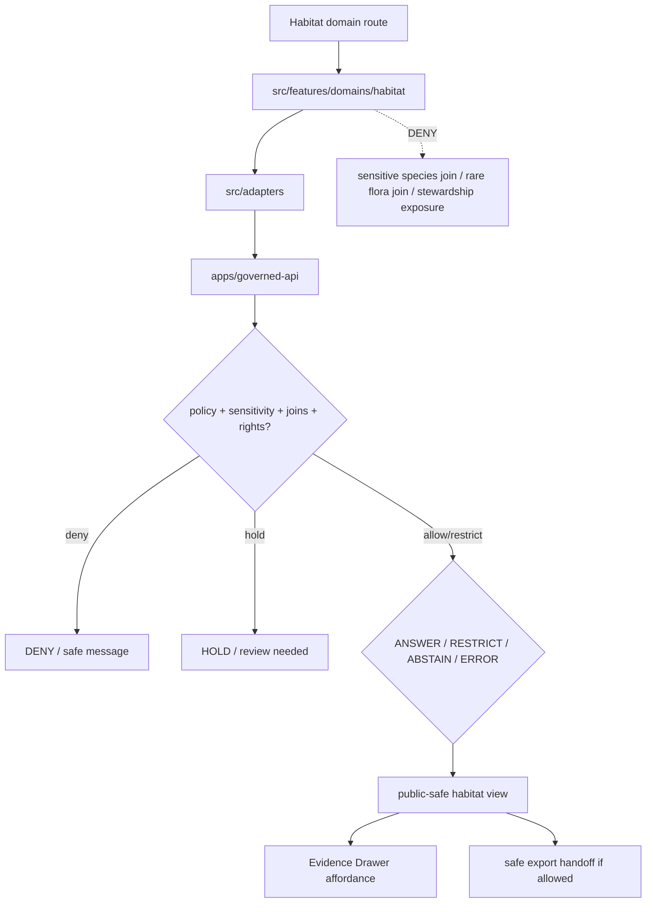

<!-- [KFM_META_BLOCK_V2]
doc_id: kfm://app/explorer-web/src/features/domains/habitat/readme
title: Explorer Web Habitat Domain Feature README
type: app-readme
version: v0.1
status: draft
owners: OWNER_TBD — Apps steward · UI steward · Habitat steward · Sensitivity reviewer · Governed API steward · Policy steward · Docs steward
created: 2026-06-16
updated: 2026-06-16
policy_label: public
related:
  - ../../README.md
  - ../../../README.md
  - ../../../adapters/README.md
  - ../../../../README.md
  - ../../../../../README.md
  - ../../../../../governed-api/README.md
  - ../../../../../../docs/domains/habitat/README.md
  - ../../../../../../docs/domains/habitat/SENSITIVITY.md
  - ../../../../../../policy/domains/habitat/README.md
  - ../../../../../../packages/ui/README.md
  - ../../../../../../packages/maplibre/README.md
  - ../../../../../../policy/access/README.md
  - ../../../../../../policy/decision/README.md
  - ../../../../../../release/README.md
  - ../../../../../../data/README.md
tags: [kfm, apps, explorer-web, domains, habitat, feature, suitability, connectivity, restoration, sensitivity-join, evidence-drawer, map-first]
notes:
  - "Replaces the greenfield habitat domain feature stub with a governed feature README."
  - "Habitat UI features may compose governed habitat envelopes into public/semi-public views, but they must not expose sensitive species joins, rare-plant joins, stewardship zones, private-parcel inference, or suitability surfaces that reconstruct protected locations without reviewed, receipt-backed policy support."
  - "Feature implementation files, route wiring, tests, fixtures, governed API envelopes, RedactionReceipts, AggregationReceipts, ReviewRecords, PolicyDecisions, ReleaseManifests, and package scripts remain NEEDS VERIFICATION."
[/KFM_META_BLOCK_V2] -->

<a id="top"></a>

<div align="center">

# Explorer Web Habitat Domain Feature

`apps/explorer-web/src/features/domains/habitat/`

**Domain-specific Explorer Web feature boundary for public-safe habitat views: habitat patches, classes, suitability, connectivity, corridors, restoration opportunity, stewardship zones, Evidence Drawer handoffs, Focus Mode answers, and release-aware map surfaces rendered only through governed envelopes.**


[Purpose](#1-purpose) · [Repo fit](#2-repo-fit) · [Boundary](#3-authority-boundary) · [Inputs](#5-inputs) · [Exclusions](#6-exclusions) · [Feature map](#7-habitat-feature-map) · [Definition of done](#14-definition-of-done)

</div>

---

> [!IMPORTANT]
> **Status:** draft / `NEEDS VERIFICATION`  
> **Owners:** `OWNER_TBD` — Apps steward · UI steward · Habitat steward · Sensitivity reviewer · Governed API steward · Policy steward · Docs steward  
> **Path:** `apps/explorer-web/src/features/domains/habitat/README.md`  
> **Responsibility root:** `apps/` — deployable application surfaces  
> **Truth posture:** CONFIRMED README path / CONFIRMED habitat doctrine and sensitivity docs / PROPOSED domain-feature contract / UNKNOWN implementation files, route wiring, tests, fixtures, and runtime behavior

> [!CAUTION]
> Habitat is often safe only until joined. Public UI must fail closed for habitat × sensitive fauna, habitat × rare flora, stewardship-zone, private-parcel, suitability-training, corridor, or coordinate-level outputs that could reveal protected species, protected places, or steward-withheld knowledge.

---

## Quick jump

- [1. Purpose](#1-purpose)
- [2. Repo fit](#2-repo-fit)
- [3. Authority boundary](#3-authority-boundary)
- [4. Default posture](#4-default-posture)
- [5. Inputs](#5-inputs)
- [6. Exclusions](#6-exclusions)
- [7. Habitat feature map](#7-habitat-feature-map)
- [8. Diagram](#8-diagram)
- [9. Habitat UI obligations](#9-habitat-ui-obligations)
- [10. Per-view contract](#10-per-view-contract)
- [11. Inspection path](#11-inspection-path)
- [12. Validation expectations](#12-validation-expectations)
- [13. Safe change pattern](#13-safe-change-pattern)
- [14. Definition of done](#14-definition-of-done)
- [15. Open verification items](#15-open-verification-items)

---

## 1. Purpose

`apps/explorer-web/src/features/domains/habitat/` is the proposed app-local feature boundary for Habitat-specific Explorer Web surfaces.

It may eventually hold route modules, panels, view models, hooks, and feature orchestration for public-safe habitat experiences such as:

- habitat patch and habitat-class map views;
- habitat quality and suitability summaries;
- connectivity, corridor, and stewardship-zone views;
- restoration opportunity context with private-parcel risk controls;
- sensitivity-aware habitat × fauna and habitat × flora relation messaging;
- Evidence Drawer handoffs that show governed, redacted, audience-appropriate payloads;
- Focus Mode bounded habitat answers with citation discipline and AIReceipt support;
- compare/export handoffs that preserve source role, sensitivity, redaction, rights, release, stale-state, and rollback state.

This directory is not proof that any route, panel, hook, map layer, adapter, test, fixture, package script, or governed API envelope is implemented.

[Back to top](#top)

---

## 2. Repo fit

| Concern | Owning root | Expected relationship |
|---|---|---|
| Habitat domain feature source | `apps/explorer-web/src/features/domains/habitat/` | App-local Habitat UI feature modules, if implemented and tested |
| Feature boundary | `apps/explorer-web/src/features/` | Parent feature/root contract |
| Adapter boundary | `apps/explorer-web/src/adapters/` | Governed API, evidence, layer, map, export, and diagnostics adapters |
| Explorer Web app | `apps/explorer-web/` | Map-first public/semi-public shell |
| Governed API | `apps/governed-api/` | Trust membrane and normal data path |
| Habitat doctrine | `docs/domains/habitat/` | Domain scope, source roles, sensitivity, object families, and verification backlog |
| Habitat policy | `policy/domains/habitat/` | Habitat admissibility and exposure policy, if executable wiring is accepted |
| Shared UI components | `packages/ui/` | Reusable cards, badges, drawers, panels, and legends when shared |
| Renderer wrappers | `packages/maplibre/`, `packages/cesium/` | Renderer behavior stays behind adapter/wrapper boundaries |
| Release authority | `release/` | Publication, correction, supersession, rollback control |
| Lifecycle artifacts | `data/` | Receipts, proofs, registry, catalog, triplets, and published artifacts |

## 3. Authority boundary

This feature renders governed Habitat UI. It does not own species occurrence truth, plant specimen truth, hydrology truth, soil truth, agriculture truth, source admission, source rights, sensitivity decisions, schemas, contracts, lifecycle artifacts, release decisions, evidence truth, renderer authority, or AI output.

```text
apps/explorer-web/src/features/domains/habitat/ = app-local Habitat UI feature
apps/explorer-web/src/features/                = feature boundary
apps/explorer-web/src/adapters/                = adapter boundary
apps/governed-api/                             = trust membrane and normal data path
docs/domains/habitat/                          = Habitat doctrine and policy intent
policy/domains/habitat/                        = Habitat domain policy lane
packages/ui/                                   = shared UI primitives
policy/                                        = finite policy decisions
data/                                          = lifecycle artifacts, receipts, proofs, registries
release/                                       = publication, correction, rollback authority
```

## 4. Default posture

Habitat feature modules should fail closed, preserve source-role labels, evaluate the produced output rather than assuming input safety, and apply the most restrictive joined-lane posture.

A view should not render claim-bearing habitat content when any of these are unresolved:

- governed API envelope and response validation;
- object family or habitat domain slug;
- source role and provenance;
- rights or license posture;
- model fitness, uncertainty, training support, or suitability caveat;
- habitat × sensitive fauna or habitat × rare flora join posture;
- stewardship, sovereign, or steward-withheld status;
- private-parcel or re-identifying join risk;
- EvidenceRef or EvidenceBundle support;
- RedactionReceipt, AggregationReceipt, ReviewRecord, PolicyDecision, or ReleaseManifest support;
- release state, rollback target, correction path, stale-state, or supersession state;
- public audience or export destination.

## 5. Inputs

| Input family | Examples | Required posture |
|---|---|---|
| Habitat view state | patch, class, suitability, connectivity, corridor, restoration, stewardship, domain Focus Mode | Explicit finite states |
| API envelope | answer, abstain, deny, error, hold, restricted, decision envelope, evidence payload | Runtime-validated before render |
| Sensitivity state | sensitive fauna join, rare-plant join, stewardship zone, private-parcel relation, reconstruction risk | Most restrictive output tier wins |
| Layer state | layer manifest, source role, legend, trust badges, valid time, selected feature id | Released or bounded-safe source only |
| Evidence state | EvidenceRef, EvidenceBundle summary, citation validation, proof visibility | Required for claim-bearing detail |
| Transform state | geoprivacy generalization, aggregation, redaction, suppression, precision degradation | Required when reducing exposure risk |
| Cross-lane state | fauna, flora, hydrology, soil, agriculture, hazards, people/land, archaeology joins | Inherits strictest lane posture |
| Export state | selected generalized layer, bounds, citation bundle, redaction/geoprivacy profile, output mode | Governed export only |

## 6. Exclusions

| Does not belong here | Correct home |
|---|---|
| Habitat doctrine and scope | `docs/domains/habitat/` |
| Habitat policy bundles or exposure decisions | `policy/domains/habitat/`, `policy/` |
| Fauna occurrence truth | Fauna lane; Habitat may cite occurrence context only under geoprivacy |
| Flora taxonomic/specimen/rare-plant truth | Flora lane; Habitat may cite vegetation-community context only |
| Hydrology, soil, agriculture, hazards, archaeology, or people/land truth | Owning domain lanes |
| Governed API implementation | `apps/governed-api/` |
| Adapter logic shared across feature families | `apps/explorer-web/src/adapters/` |
| Shared reusable UI primitives | `packages/ui/` |
| Renderer wrapper authority | `packages/maplibre/`, `packages/cesium/` |
| Habitat schemas and contracts | `schemas/contracts/v1/domains/habitat/`, `contracts/domains/habitat/` |
| Lifecycle artifacts, receipts, proofs, catalog, triplets | `data/` |
| Release manifests, rollback cards, correction notices | `release/` |
| Source acquisition or source registry records | `connectors/`, `data/registry/`, source catalog lanes |
| Direct model runtime behavior | `runtime/` behind governed API only |
| Secrets, credentials, tokens, private keys | Secret manager / deployment environment |

## 7. Habitat feature map

Exact modules remain `NEEDS VERIFICATION`. Candidate views should be introduced only with route inventory, fixtures, and tests.

| Candidate view | Purpose | Required safeguard | Status |
|---|---|---|---|
| `habitat-patches` | Show habitat patch or class context | Source role, release state, evidence | PROPOSED |
| `suitability-summary` | Show habitat suitability surfaces | Model label, uncertainty, sensitivity audit | PROPOSED |
| `connectivity-context` | Show connectivity edges or corridors | Sensitive endpoint and route-risk review | PROPOSED |
| `restoration-opportunity` | Show restoration opportunity context | Private-parcel and stewardship checks | PROPOSED |
| `stewardship-zones` | Show public-safe stewardship context | Sovereign/steward controls preserved | PROPOSED |
| `sensitive-denial` | Explain why a habitat detail is unavailable | Safe reason code; no exposure hints | PROPOSED |
| `domain-focus` | Habitat Focus Mode UI | Finite outcomes; no direct model truth or protected detail | PROPOSED |
| `domain-evidence` | Evidence Drawer handoff | Redacted/audience-appropriate payload only | PROPOSED |
| `domain-export` | Habitat export handoff | Citation, redaction, geoprivacy, rights, review, release checks | PROPOSED |

> [!WARNING]
> Candidate view names are not implementation proof. Do not document a view as runnable until files, route wiring, tests, fixtures, package scripts, and governed API envelopes confirm it.

## 8. Diagram



## 9. Habitat UI obligations

| Obligation | Example effect |
|---|---|
| `governed_api_only` | Habitat feature state comes through governed API envelopes |
| `landscape_not_species_truth` | Habitat owns landscape models, not Fauna/Flora occurrence truth |
| `source_role_preserved` | Observed, regulatory, modeled, aggregate, administrative, candidate, and synthetic roles remain distinct |
| `output_tier_evaluated` | The produced output is tiered; input safety alone never authorizes release |
| `join_sensitivity_required` | Sensitive fauna/flora/steward/private joins fail closed or generalize before public display |
| `receipt_required` | RedactionReceipt, AggregationReceipt, ReviewRecord, PolicyDecision, and ReleaseManifest are preserved where required |
| `evidence_required` | Claim-bearing details link to EvidenceBundle-derived payloads |
| `no_exposure_hints` | Denial messages do not reveal sensitive locations, model support, parameters, or transform details |
| `safe_export_required` | Export handoff preserves citations, geoprivacy, redaction, rights, review, release, and rollback constraints |
| `no_authority_fork` | Feature code does not redefine Habitat policy, schema, contract, source, release, model, or evidence logic |

## 10. Per-view contract

Every long-lived Habitat domain view should document or encode:

- view purpose and route ownership;
- habitat object families and source families consumed;
- governed API envelope or adapter dependency;
- source-role, model label, uncertainty, and fitness display behavior;
- sensitivity, joined-lane inheritance, redaction, aggregation, and precision-degradation obligations;
- release, stale-state, correction, supersession, and rollback behavior;
- expected finite outcomes;
- evidence/citation display behavior;
- loading, empty, deny, abstain, error, hold, restricted states;
- export behavior, if any;
- tests and fixtures proving trust-membrane and sensitive-join boundaries.

## 11. Inspection path

Habitat feature implementation files, route wiring, tests, fixtures, governed API envelopes, geoprivacy receipts, review records, release manifests, rollback cards, package scripts, and export handoff remain `NEEDS VERIFICATION`.

```bash
find apps/explorer-web/src/features/domains/habitat -maxdepth 5 -type f | sort
find apps/explorer-web/src apps/governed-api docs/domains/habitat policy/domains/habitat packages/ui packages/maplibre tests fixtures -maxdepth 6 -type f 2>/dev/null | grep -Ei 'habitat|patch|suitability|connectivity|corridor|restoration|stewardship|fauna|flora|sensitive|redaction|aggregation|evidence|release|rollback|governed' | sort
find data/raw data/work data/quarantine data/processed data/catalog data/triplets data/published data/receipts data/proofs -maxdepth 2 -type f 2>/dev/null | sort
```

## 12. Validation expectations

Useful validation for this feature boundary should cover:

- no Habitat feature imports or reads lifecycle data roots directly;
- claim-bearing Habitat views consume governed API envelopes only;
- malformed Habitat envelopes render safe error or abstain states;
- suitability rasters are not treated as occurrence truth or regulatory critical-habitat designations unless the source role says so;
- habitat × sensitive fauna, habitat × rare flora, stewardship-zone, private-parcel, and re-identifying joins are denied, generalized, held, or restricted by default;
- generalized views preserve source role, sensitivity, rights, release, stale-state, citation, review, and transform metadata;
- denial messages do not leak sensitive locations, training support, parameters, or transformation hints;
- Evidence Drawer handoff preserves EvidenceRef/EvidenceBundle handles without exposing protected content;
- Focus Mode renders finite outcomes and never direct model output as truth;
- export handoff requires citation, geoprivacy/redaction, rights, review, release, correction, and rollback support.

## 13. Safe change pattern

For Habitat feature changes:

1. Add or update route inventory and per-view contract.
2. Add fixtures for open, generalized, restricted, denied, held, abstained, malformed, loading, stale, corrected, rolled-back, and empty states.
3. Test lifecycle-data denial and governed API-only behavior.
4. Preserve source role, sensitivity, model/caveat state, joined-lane inheritance, review, release, rollback, rights, and citation fields through UI state.
5. Update this README, parent `features/README.md`, habitat docs, and parent app README when public behavior changes.

## 14. Definition of done

- [ ] Owners are confirmed and `OWNER_TBD` is replaced.
- [ ] Habitat feature file inventory and route ownership are documented.
- [ ] Governed API and adapter dependencies are explicit.
- [ ] Habitat sensitivity, joined-lane inheritance, geoprivacy, review, rights, release, stale-state, and rollback states are represented in UI fixtures.
- [ ] Redaction/generalization/aggregation obligations survive feature composition.
- [ ] Direct lifecycle-data import/read checks are covered.
- [ ] Sensitive-join and stewardship-zone denial states are tested.
- [ ] Source-role anti-collapse states are tested.
- [ ] Finite states cover answer, restrict, abstain, deny, error, hold, loading, stale, corrected, rollback, and empty cases.
- [ ] Export, Focus Mode, and Evidence Drawer handoffs are tested for safe output if present.

## 15. Open verification items

| Item | Why it matters |
|---|---|
| Confirm Habitat feature implementation files beyond README | Prevents overclaiming feature maturity |
| Confirm route inventory | Required for public/semi-public UI boundary review |
| Confirm governed API Habitat envelopes | Required for trust membrane enforcement |
| Confirm sensitivity/redaction receipt and review-record linkage | Required before public-safe transformation claims |
| Confirm source-role anti-collapse fixtures | Prevents modeled/regulatory/observed/aggregate role drift |
| Confirm release, correction, stale-state, and rollback states | Required before public map-layer claims |
| Confirm Focus Mode and Evidence Drawer behavior | Required before claim-bearing Habitat UI claims |
| Confirm export handoff | Required before public download workflows |
| Confirm package scripts beyond TODO | Required before build/test claims |

<details>
<summary>Appendix A — no-loss preservation note</summary>

The previous README was a greenfield stub. This replacement adds a bounded Habitat domain-feature contract without claiming Habitat routes, panels, hooks, adapters, fixtures, tests, package scripts, governed API envelopes, geoprivacy receipts, ReviewRecords, PolicyDecisions, ReleaseManifests, RollbackCards, Focus Mode, Evidence Drawer, or export handoff are implemented.

</details>

## Status summary

`apps/explorer-web/src/features/domains/habitat/` should contain Habitat-specific Explorer Web feature modules only after route contracts, governed API envelopes, sensitivity-join/redaction posture, fixtures, tests, Evidence Drawer behavior, Focus Mode behavior, release/stale/rollback handling, and export handoff are verified.

It must preserve the trust membrane and Habitat sensitivity posture: the feature may show generalized, aggregated, redacted, audience-appropriate, stale-labeled, corrected, or restricted Habitat knowledge, but it must not expose sensitive species joins, rare flora joins, private-parcel inference, stewardship-controlled knowledge, or model support that reconstructs protected locations; it must not become Habitat truth, species truth, policy authority, release authority, lifecycle storage, or a direct model-output surface.

<p align="right"><a href="#top">Back to top</a></p>
