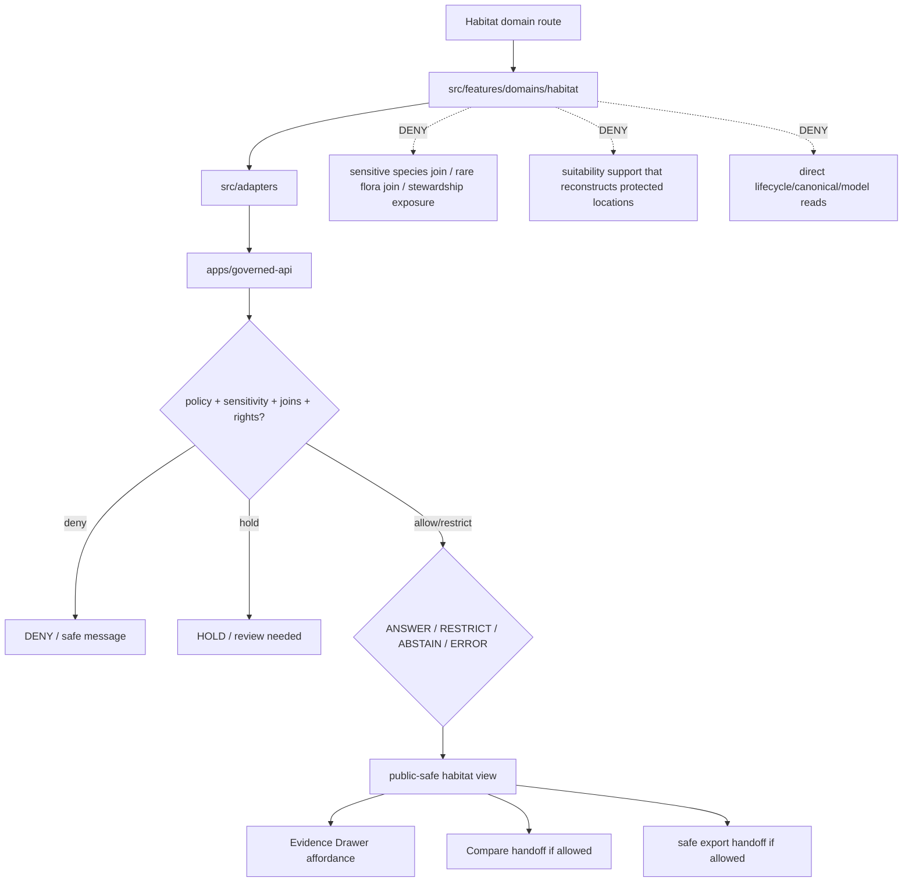

<!-- [KFM_META_BLOCK_V2]
doc_id: kfm://app/explorer-web/src/features/domains/habitat/readme
title: Explorer Web Habitat Domain Feature README
type: app-readme
version: v0.2
status: draft
owners: OWNER_TBD — Apps steward · UI steward · Habitat steward · Sensitivity reviewer · Governed API steward · Policy steward · Docs steward
created: 2026-06-16
updated: 2026-07-09
policy_label: public
related:
  - ../../README.md
  - ../../../README.md
  - ../../../adapters/README.md
  - ../../../../README.md
  - ../../../../../README.md
  - ../../../../../governed-api/README.md
  - ../../../../../../README.md
  - ../../../../../../SECURITY.md
  - ../../../../../../docs/domains/habitat/README.md
  - ../../../../../../docs/domains/habitat/SENSITIVITY.md
  - ../../../../../../policy/domains/habitat/README.md
  - ../../../../../../packages/ui/README.md
  - ../../../../../../packages/maplibre/README.md
  - ../../../../../../packages/cesium/README.md
  - ../../../../../../policy/access/README.md
  - ../../../../../../policy/decision/README.md
  - ../../../../../../release/README.md
  - ../../../../../../data/README.md
  - ../../../../../../tools/validators/README.md
  - ../../../../../../tools/watchers/README.md
tags: [kfm, apps, explorer-web, domains, habitat, feature, suitability, connectivity, restoration, sensitivity-join, evidence-drawer, map-first, no-direct-data-root, output-tier-evaluated]
notes:
  - "v0.2 updates the uploaded Habitat domain-feature README into a current repo-aware feature contract."
  - "apps/explorer-web/src/features/domains/habitat/README.md, apps/explorer-web/src/features/README.md, docs/domains/habitat/README.md, docs/domains/habitat/SENSITIVITY.md, and policy/domains/habitat/README.md were verified through the GitHub app in this update. Prior related Explorer Web adapter/source/app boundaries remain relevant, but adapter files, routes, runtime wiring, tests, and envelopes remain NEEDS VERIFICATION."
  - "Feature implementation files, route wiring, domain-view inventory, tests, fixtures, governed API envelopes, RedactionReceipts, AggregationReceipts, ReviewRecords, PolicyDecisions, ReleaseManifests, RollbackCards, correction notices, export handoff, Focus Mode behavior, Evidence Drawer behavior, package scripts, runtime behavior, and deployment behavior remain NEEDS VERIFICATION."
  - "Habitat UI features may compose governed habitat envelopes into public/semi-public views, but they must not expose sensitive species joins, rare-plant joins, stewardship zones, private-parcel inference, suitability-training support, corridor endpoint risk, or outputs that reconstruct protected locations without reviewed, receipt-backed policy support."
  - "Public Habitat UI must default to deny/hold/restrict when sensitivity, rights, output-tier evaluation, joined-lane inheritance, geoprivacy transform, review, evidence, release, stale-state, rollback, correction, policy, or export support is unresolved."
[/KFM_META_BLOCK_V2] -->

<a id="top"></a>

<div align="center">

# Explorer Web Habitat Domain Feature

`apps/explorer-web/src/features/domains/habitat/`

**Domain-specific Explorer Web feature boundary for public-safe habitat views: habitat patches, classes, suitability, connectivity, corridors, restoration opportunity, stewardship zones, Evidence Drawer handoffs, Focus Mode answers, and release-aware map surfaces rendered only through governed envelopes.**


[Purpose](#1-purpose) · [Current evidence](#2-current-repo-evidence) · [Repo fit](#3-repo-fit) · [Boundary](#4-authority-boundary) · [Inputs](#6-inputs) · [Exclusions](#7-exclusions) · [Feature map](#8-habitat-feature-map) · [Definition of done](#15-definition-of-done)

</div>

---

> [!IMPORTANT]
> **Status:** draft / current README surface confirmed / implementation behavior `NEEDS VERIFICATION`  
> **Owners:** `OWNER_TBD` — Apps steward · UI steward · Habitat steward · Sensitivity reviewer · Governed API steward · Policy steward · Docs steward  
> **Path:** `apps/explorer-web/src/features/domains/habitat/README.md`  
> **Responsibility root:** `apps/` — deployable application surfaces  
> **Truth posture:** CONFIRMED README path and supporting Habitat docs/policy README surfaces / PROPOSED domain-feature contract / UNKNOWN implementation files, route wiring, domain-view inventory, tests, fixtures, governed API envelopes, RedactionReceipts, AggregationReceipts, ReviewRecords, PolicyDecisions, ReleaseManifests, RollbackCards, correction notices, export handoff, Focus Mode behavior, Evidence Drawer behavior, package scripts, runtime behavior, and deployment behavior

> [!CAUTION]
> Habitat is often safe only until joined. Public UI must fail closed for habitat × sensitive fauna, habitat × rare flora, stewardship-zone, private-parcel, suitability-training, corridor, coordinate-level, or model-support outputs that could reveal protected species, protected places, or steward-withheld knowledge.

---

## Quick jump

- [1. Purpose](#1-purpose)
- [2. Current repo evidence](#2-current-repo-evidence)
- [3. Repo fit](#3-repo-fit)
- [4. Authority boundary](#4-authority-boundary)
- [5. Default posture](#5-default-posture)
- [6. Inputs](#6-inputs)
- [7. Exclusions](#7-exclusions)
- [8. Habitat feature map](#8-habitat-feature-map)
- [9. Diagram](#9-diagram)
- [10. Habitat UI obligations](#10-habitat-ui-obligations)
- [11. Per-view contract](#11-per-view-contract)
- [12. Inspection path](#12-inspection-path)
- [13. Validation expectations](#13-validation-expectations)
- [14. Safe change pattern](#14-safe-change-pattern)
- [15. Definition of done](#15-definition-of-done)
- [16. Open verification items](#16-open-verification-items)

---

## 1. Purpose

`apps/explorer-web/src/features/domains/habitat/` is the proposed app-local feature boundary for Habitat-specific Explorer Web surfaces.

It may eventually hold route modules, panels, view models, hooks, and feature orchestration for public-safe habitat experiences such as:

- habitat patch and habitat-class map views;
- habitat quality and suitability summaries;
- connectivity, corridor, and stewardship-zone views;
- restoration opportunity context with private-parcel risk controls;
- sensitivity-aware habitat × fauna and habitat × flora relation messaging;
- model-support and suitability caveat displays;
- Evidence Drawer handoffs that show governed, redacted, audience-appropriate payloads;
- Focus Mode bounded habitat answers with citation discipline and AIReceipt support;
- compare/export handoffs that preserve source role, sensitivity, redaction, rights, release, stale-state, correction, supersession, and rollback state.

This directory is not proof that any route, panel, hook, map layer, adapter, test, fixture, package script, governed API envelope, geoprivacy receipt, RedactionReceipt, AggregationReceipt, ReviewRecord, PolicyDecision, ReleaseManifest, RollbackCard, correction notice, Evidence Drawer behavior, Focus Mode behavior, export handoff, or runtime wiring is implemented.

[Back to top](#top)

---

## 2. Current repo evidence

| Surface | Status | What it proves | What it does **not** prove |
|---|---|---|---|
| `apps/explorer-web/src/features/domains/habitat/README.md` | **CONFIRMED README** | This README exists and has been updated to v0.2. | Habitat UI implementation files, route wiring, domain-view inventory, tests, fixtures, governed API envelopes, receipts, release manifests, rollback cards, export handoff, or runtime behavior. |
| `apps/explorer-web/src/features/README.md` | **CONFIRMED parent features README** | Parent feature boundary says feature modules must not treat map features, tiles, local files, model text, or lifecycle data as claim truth. | That domain feature modules, route inventory, tests, fixtures, or runtime wiring exist. |
| `apps/explorer-web/src/adapters/README.md` | **CONFIRMED prior related boundary** | Adapter README was previously verified in this session as the governed API / renderer / evidence / layer / export / diagnostics adapter boundary. | That habitat adapters or governed API client adapters are implemented. |
| `docs/domains/habitat/README.md` | **CONFIRMED domain-doc surface** | Habitat domain docs define Habitat as landscape/model lane, not species truth; implementation maturity remains proposed pending verification. | That app UI behavior, schemas, validators, policy bundles, source descriptors, releases, or routes are implemented. |
| `docs/domains/habitat/SENSITIVITY.md` | **CONFIRMED sensitivity-doc surface** | Habitat sensitivity docs define join-induced sensitivity, output-tier evaluation, most-restrictive-row posture, and fail-closed behavior for sensitive habitat outputs. | That executable policy, route enforcement, fixtures, tests, CI binding, or runtime checks exist. |
| `policy/domains/habitat/README.md` | **CONFIRMED policy-lane scaffold** | Habitat policy-lane README exists. | It is still a greenfield scaffold and does not prove concrete policy files, tests, fixtures, CI binding, release integration, or runtime enforcement. |
| `apps/explorer-web/src/features/domains/README.md` | **NOT VERIFIED** | A parent domain-feature README was not confirmed in this update. | Does not prove absence across all refs; a future index remains useful if accepted. |
| Uploaded Habitat Markdown | **CONFIRMED source text for this update** | Provided the base Habitat domain-feature contract updated here. | Does not prove live implementation. |
| Implementation beyond README | **NEEDS VERIFICATION** | Checkable by repo scan, route inventory, fixtures, tests, package scripts, governed API envelopes, receipts, release records, and runtime evidence. | Not claimed by this README. |

[Back to top](#top)

---

## 3. Repo fit

| Concern | Owning root | Expected relationship |
|---|---|---|
| Habitat domain feature source | `apps/explorer-web/src/features/domains/habitat/` | App-local Habitat UI feature modules, if implemented and tested. |
| Feature boundary | `apps/explorer-web/src/features/` | Parent feature/root contract. |
| Domain-feature parent index | `apps/explorer-web/src/features/domains/` | **NEEDS VERIFICATION**; parent README was not confirmed in this update. |
| Adapter boundary | `apps/explorer-web/src/adapters/` | Governed API, evidence, layer, map, export, and diagnostics adapters. |
| Explorer Web source tree | `apps/explorer-web/src/` | Parent source-layout boundary. |
| Explorer Web app | `apps/explorer-web/` | Map-first public/semi-public shell. |
| Governed API | `apps/governed-api/` | Trust membrane and normal claim-bearing data path. |
| Habitat doctrine | `docs/domains/habitat/` | Domain scope, source roles, sensitivity, object families, and verification backlog. |
| Habitat policy | `policy/domains/habitat/` | Habitat admissibility and exposure policy lane, if executable wiring is accepted. |
| Fauna / Flora lanes | `docs/domains/fauna/`, `docs/domains/flora/` | Species/plant occurrence truth; Habitat may join only through governed relationships. |
| Shared UI components | `packages/ui/` | Reusable cards, badges, drawers, panels, and legends when shared. |
| Renderer wrappers | `packages/maplibre/`, `packages/cesium/` | Renderer behavior stays behind adapter/wrapper boundaries. |
| Release authority | `release/` | Publication, correction, supersession, rollback control. |
| Lifecycle artifacts | `data/` | Receipts, proofs, registry, catalog, triplets, and published artifacts. |
| Security posture | `SECURITY.md`, `docs/security/` | Secrets, sensitive-output, incident, exposure, and audit posture. |

[Back to top](#top)

---

## 4. Authority boundary

This feature renders governed Habitat UI. It does not own species occurrence truth, plant specimen truth, hydrology truth, soil truth, agriculture truth, hazards truth, archaeology truth, people/land truth, source admission, source rights, sensitivity decisions, schemas, contracts, lifecycle artifacts, release decisions, evidence truth, renderer authority, model truth, suitability truth, or AI output.

```text
apps/explorer-web/src/features/domains/habitat/ = app-local Habitat UI feature
apps/explorer-web/src/features/                = feature boundary
apps/explorer-web/src/adapters/                = adapter boundary
apps/explorer-web/src/                         = Explorer Web implementation source
apps/explorer-web/                             = map-first public/semi-public app boundary
apps/governed-api/                             = trust membrane and normal data path
docs/domains/habitat/                          = Habitat doctrine and policy intent
policy/domains/habitat/                        = Habitat domain policy lane
packages/ui/                                   = shared UI primitives
packages/maplibre/                             = renderer wrapper
packages/cesium/                               = optional gated renderer wrapper
policy/                                        = finite policy decisions
schemas/                                       = machine-readable shape
contracts/                                     = object meaning
data/                                          = lifecycle artifacts, receipts, proofs, registries
release/                                       = publication, correction, rollback authority
```

Safe interpretation:

- **CONFIRMED:** this README surface, parent Explorer Web feature README, Habitat domain README, Habitat sensitivity doc, and Habitat policy-lane scaffold exist.
- **PROPOSED:** Habitat feature modules may live here when they preserve governed API, output-tier evaluation, joined-lane inheritance, redaction, aggregation, source-role, evidence, sensitivity, rights, model-label, uncertainty, fitness, review, release, stale-state, rollback, correction, export, and public-boundary constraints.
- **NEEDS VERIFICATION:** Habitat modules, route wiring, domain-view inventory, adapter dependencies, fixtures, tests, package scripts, governed API envelopes, geoprivacy receipts, RedactionReceipts, AggregationReceipts, ReviewRecords, PolicyDecisions, ReleaseManifests, RollbackCards, correction notices, export handoff, Evidence Drawer behavior, Focus Mode behavior, runtime behavior, and deployment behavior.
- **DENY:** using this feature as Habitat truth, species truth, rare-plant truth, regulatory designation truth, policy authority, source authority, release authority, lifecycle store, schema/contract home, direct canonical/internal store client, direct model-output surface, sensitive-join exposure path, renderer authority, export authority, or public-data shortcut.

[Back to top](#top)

---

## 5. Default posture

Habitat feature modules should fail closed, preserve source-role labels, evaluate the produced output rather than assuming input safety, and apply the most restrictive joined-lane posture.

A view should not render claim-bearing habitat content when any of these are unresolved:

- governed API envelope and response validation;
- object family or habitat domain slug;
- source role and provenance;
- rights or license posture;
- model fitness, uncertainty, training support, or suitability caveat;
- habitat × sensitive fauna or habitat × rare flora join posture;
- stewardship, sovereign, or steward-withheld status;
- private-parcel or re-identifying join risk;
- corridor endpoint, connectivity edge, or suitability surface reconstruction risk;
- EvidenceRef or EvidenceBundle support;
- RedactionReceipt, AggregationReceipt, ReviewRecord, PolicyDecision, or ReleaseManifest support;
- release state, rollback target, correction path, stale-state, withdrawal, or supersession state;
- public audience or export destination.

[Back to top](#top)

---

## 6. Inputs

| Input family | Examples | Required posture |
|---|---|---|
| Habitat view state | patch, class, suitability, connectivity, corridor, restoration, stewardship, domain Focus Mode | Explicit finite states. |
| API envelope | answer, abstain, deny, error, hold, restricted, decision envelope, evidence payload | Runtime-validated before render. |
| Sensitivity state | sensitive fauna join, rare-plant join, stewardship zone, private-parcel relation, reconstruction risk | Most restrictive output tier wins. |
| Layer state | layer manifest, source role, legend, trust badges, valid time, selected feature id | Released or bounded-safe source only. |
| Evidence state | EvidenceRef, EvidenceBundle summary, citation validation, proof visibility | Required for claim-bearing detail. |
| Transform state | geoprivacy generalization, aggregation, redaction, suppression, precision degradation | Required when reducing exposure risk. |
| Model state | suitability model id, source role, training support class, uncertainty, fitness, caveat label | Required for model-derived displays. |
| Cross-lane state | fauna, flora, hydrology, soil, agriculture, hazards, people/land, archaeology joins | Inherits strictest lane posture. |
| Release/correction state | release ref, rollback target, correction notice, stale-state, supersession, withdrawal | Required for public-facing claim and export support. |
| Export state | selected generalized layer, bounds, citation bundle, redaction/geoprivacy profile, output mode | Governed export only. |
| Focus Mode state | prompt class, finite outcome, evidence handles, policy result | No direct model output as habitat truth. |

[Back to top](#top)

---

## 7. Exclusions

| Does not belong here | Correct home |
|---|---|
| Habitat doctrine and scope | `docs/domains/habitat/` |
| Habitat policy bundles or exposure decisions | `policy/domains/habitat/`, `policy/` |
| Fauna occurrence truth | Fauna lane; Habitat may cite occurrence context only under geoprivacy. |
| Flora taxonomic/specimen/rare-plant truth | Flora lane; Habitat may cite vegetation-community context only. |
| Hydrology, soil, agriculture, hazards, archaeology, or people/land truth | Owning domain lanes. |
| Governed API implementation | `apps/governed-api/` |
| Adapter logic shared across feature families | `apps/explorer-web/src/adapters/` |
| Shared reusable UI primitives | `packages/ui/` |
| Renderer wrapper authority | `packages/maplibre/`, `packages/cesium/` |
| Habitat schemas and contracts | `schemas/contracts/v1/domains/habitat/`, `contracts/domains/habitat/` |
| Lifecycle artifacts, receipts, proofs, catalog, triplets | `data/` |
| Release manifests, rollback cards, correction notices | `release/` |
| Source acquisition or source registry records | `connectors/`, `data/registry/`, source catalog lanes. |
| Direct RAW / WORK / QUARANTINE / PROCESSED / CATALOG / TRIPLET / PUBLISHED reads | governed API, released artifacts, layer manifests, and bounded public-safe envelopes only. |
| Direct model runtime behavior | `runtime/` behind governed API only. |
| Secrets, credentials, tokens, private keys, exact sensitive species/rare plant joins, transform parameters, training support details, exposure hints | secret manager / deployment environment, not UI feature source or examples. |
| Public-sensitive exports, exact restricted locations, living-person/DNA details, source-restricted records, prompt/model traces | denied unless separately governed and public-safe. |

[Back to top](#top)

---

## 8. Habitat feature map

Exact modules remain `NEEDS VERIFICATION`. Candidate views should be introduced only with route inventory, fixtures, governed API envelopes, geoprivacy receipts, review records, policy decisions, release manifests, rollback cards, and tests.

| Candidate view | Purpose | Required safeguard | Status |
|---|---|---|---|
| `habitat-patches` | Show habitat patch or class context. | Source role, release state, evidence. | PROPOSED |
| `suitability-summary` | Show habitat suitability surfaces. | Model label, uncertainty, sensitivity audit. | PROPOSED |
| `connectivity-context` | Show connectivity edges or corridors. | Sensitive endpoint and route-risk review. | PROPOSED |
| `restoration-opportunity` | Show restoration opportunity context. | Private-parcel and stewardship checks. | PROPOSED |
| `stewardship-zones` | Show public-safe stewardship context. | Sovereign/steward controls preserved. | PROPOSED |
| `model-caveats` | Show model fitness, uncertainty, and source-role caveats. | No training-support leakage. | PROPOSED |
| `sensitive-denial` | Explain why a habitat detail is unavailable. | Safe reason code; no exposure hints. | PROPOSED |
| `domain-focus` | Habitat Focus Mode UI. | Finite outcomes; no direct model truth or protected detail. | PROPOSED |
| `domain-evidence` | Evidence Drawer handoff. | Redacted/audience-appropriate payload only. | PROPOSED |
| `domain-export` | Habitat export handoff. | Citation, redaction, geoprivacy, rights, review, release checks. | PROPOSED |
| `domain-compare` | Habitat compare handoff. | Join sensitivity, model caveats, time, release, review, provenance, and stale-state preserved. | PROPOSED |
| `correction-status` | Public-safe stale/supersession/correction/rollback status. | Release/correction/rollback refs only; no protected payloads. | PROPOSED |

> [!WARNING]
> Candidate view names are not implementation proof. Do not document a view as runnable until files, route wiring, tests, fixtures, package scripts, receipts, review records, policy decisions, release manifests, rollback cards, and governed API envelopes confirm it.

[Back to top](#top)

---

## 9. Diagram



[Back to top](#top)

---

## 10. Habitat UI obligations

| Obligation | Example effect |
|---|---|
| `governed_api_only` | Habitat feature state comes through governed API envelopes. |
| `landscape_not_species_truth` | Habitat owns landscape models, not Fauna/Flora occurrence truth. |
| `source_role_preserved` | Observed, regulatory, modeled, aggregate, administrative, candidate, and synthetic roles remain distinct. |
| `output_tier_evaluated` | The produced output is tiered; input safety alone never authorizes release. |
| `join_sensitivity_required` | Sensitive fauna/flora/steward/private joins fail closed or generalize before public display. |
| `model_caveats_required` | Suitability surfaces expose model labels, uncertainty, and fitness without revealing sensitive training support. |
| `receipt_required` | RedactionReceipt, AggregationReceipt, ReviewRecord, PolicyDecision, ReleaseManifest, and RollbackCard are preserved where required. |
| `evidence_required` | Claim-bearing details link to EvidenceBundle-derived payloads. |
| `no_exposure_hints` | Denial messages do not reveal sensitive locations, model support, parameters, training details, or transform details. |
| `safe_compare_required` | Compare handoff preserves join sensitivity, release, review, provenance, model caveats, time, stale-state, and finite-state posture. |
| `safe_export_required` | Export handoff preserves citations, geoprivacy, redaction, rights, review, release, correction, and rollback constraints. |
| `no_authority_fork` | Feature code does not redefine Habitat policy, schema, contract, source, release, model, or evidence logic. |
| `no_data_root_shortcut` | Feature code does not read lifecycle data roots, canonical/internal stores, local source files, or model output as claim sources. |
| `local_parity_preferred` | Habitat fixtures/tests should be runnable locally and in CI with the same inputs where practical. |

[Back to top](#top)

---

## 11. Per-view contract

Every long-lived Habitat domain view should document or encode:

- view purpose and route ownership;
- habitat object families and source families consumed;
- governed API envelope or adapter dependency;
- source-role, model label, uncertainty, and fitness display behavior;
- sensitivity, joined-lane inheritance, redaction, aggregation, and precision-degradation obligations;
- review, policy-decision, release, correction, stale-state, supersession, withdrawal, and rollback behavior;
- expected finite outcomes;
- evidence/citation display behavior;
- loading, empty, deny, abstain, error, hold, restricted, stale, corrected, and rollback states;
- direct lifecycle/canonical/model-output denial posture;
- compare, Focus Mode, Evidence Drawer, or export behavior, if any;
- tests and fixtures proving trust-membrane and sensitive-join boundaries.

[Back to top](#top)

---

## 12. Inspection path

Habitat feature implementation files, route wiring, tests, fixtures, governed API envelopes, geoprivacy receipts, review records, release manifests, rollback cards, package scripts, and export handoff remain `NEEDS VERIFICATION`.

```bash
find apps/explorer-web/src/features/domains/habitat -maxdepth 5 -type f | sort
find apps/explorer-web/src apps/governed-api docs/domains/habitat policy/domains/habitat packages/ui packages/maplibre tests fixtures -maxdepth 6 -type f 2>/dev/null | grep -Ei 'habitat|patch|suitability|connectivity|corridor|restoration|stewardship|fauna|flora|sensitive|redaction|aggregation|evidence|release|rollback|governed' | sort
find data/raw data/work data/quarantine data/processed data/catalog data/triplets data/published data/receipts data/proofs -maxdepth 2 -type f 2>/dev/null | sort
```

[Back to top](#top)

---

## 13. Validation expectations

Useful validation for this feature boundary should cover:

- no Habitat feature imports or reads lifecycle data roots directly;
- claim-bearing Habitat views consume governed API envelopes only;
- malformed Habitat envelopes render safe error or abstain states;
- suitability rasters are not treated as occurrence truth or regulatory critical-habitat designations unless the source role says so;
- habitat × sensitive fauna, habitat × rare flora, stewardship-zone, private-parcel, re-identifying, corridor endpoint, and model-support joins are denied, generalized, held, or restricted by default;
- generalized views preserve source role, sensitivity, rights, release, stale-state, citation, review, and transform metadata;
- denial messages do not leak sensitive locations, training support, parameters, model support, or transformation hints;
- cross-lane sensitive joins inherit the strictest lane posture;
- Evidence Drawer handoff preserves EvidenceRef/EvidenceBundle handles without exposing protected content;
- Focus Mode renders finite outcomes and never direct model output as truth;
- compare and export handoffs require citation, geoprivacy/redaction, rights, review, release, correction, and rollback support;
- UI output does not expose secrets, exact restricted locations, source-restricted records, private data, or prompt/model traces.

[Back to top](#top)

---

## 14. Safe change pattern

For Habitat feature changes:

1. Add or update route inventory and per-view contract.
2. Add fixtures for open, generalized, restricted, denied, held, abstained, malformed, loading, stale, corrected, rolled-back, and empty states.
3. Test lifecycle-data denial and governed API-only behavior.
4. Preserve source role, sensitivity, model/caveat state, joined-lane inheritance, review, release, rollback, rights, and citation fields through UI state.
5. Verify denial messaging does not reveal exposure hints, transform parameters, reconstruction clues, sensitive model support, or sensitive location detail.
6. Verify compare, export, Focus Mode, and Evidence Drawer handoffs cannot bypass policy, review, geoprivacy, joined-lane inheritance, release, correction, or rollback checks.
7. Update this README, parent `features/README.md`, adapter README, habitat docs, policy README, and parent app README when public behavior changes.

[Back to top](#top)

---

## 15. Definition of done

- [ ] Owners are confirmed and `OWNER_TBD` is replaced.
- [ ] Habitat feature file inventory and route ownership are documented.
- [ ] Governed API and adapter dependencies are explicit.
- [ ] Habitat sensitivity, joined-lane inheritance, geoprivacy, review, rights, release, stale-state, and rollback states are represented in UI fixtures.
- [ ] Redaction/generalization/aggregation obligations survive feature composition.
- [ ] Direct lifecycle-data import/read checks are covered.
- [ ] Sensitive-join and stewardship-zone denial states are tested.
- [ ] Model-caveat and source-role anti-collapse states are tested.
- [ ] Denial messaging is tested for no exposure hints.
- [ ] Cross-lane sensitivity inheritance is tested.
- [ ] Finite states cover answer, restrict, abstain, deny, error, hold, loading, stale, corrected, rollback, and empty cases.
- [ ] Evidence Drawer, Focus Mode, Compare, and Export handoffs are tested for safe output if present.
- [ ] Parent feature/adapter/source/app READMEs and Habitat docs/policy surfaces are updated when public behavior changes.

[Back to top](#top)

---

## 16. Open verification items

| Item | Why it matters |
|---|---|
| Confirm Habitat feature implementation files beyond README | Prevents overclaiming feature maturity. |
| Confirm route inventory | Required for public/semi-public UI boundary review. |
| Confirm governed API Habitat envelopes | Required for trust membrane enforcement. |
| Confirm adapter dependency shape | Required so Habitat UI does not bypass governed adapters. |
| Confirm sensitivity/redaction receipt and review-record linkage | Required before public-safe transformation claims. |
| Confirm policy-decision linkage | Required before enforcement claims. |
| Confirm source-role/model-caveat anti-collapse fixtures | Prevents modeled/regulatory/observed/aggregate role drift. |
| Confirm release, correction, stale-state, supersession, withdrawal, and rollback states | Required before public map-layer claims. |
| Confirm release manifest and rollback-card linkage | Required before publication-support claims. |
| Confirm fixtures and tests | Required before implementation claims. |
| Confirm Focus Mode and Evidence Drawer behavior | Required before claim-bearing Habitat UI claims. |
| Confirm Compare handoff | Required before visual-difference claims. |
| Confirm export handoff | Required before public download workflows. |
| Confirm direct data-root denial | Required for public client trust membrane. |
| Confirm executable Habitat policy binding | Required before enforcement claims. |
| Confirm no exposure-hint messaging | Required before denial-state UI claims. |
| Confirm parent domain-feature README/index | Useful for feature-lane navigation; not required for this leaf README. |
| Confirm package scripts beyond TODO | Required before build/test claims. |

<details>
<summary>Appendix A — no-loss preservation note</summary>

The uploaded README replaced a greenfield Habitat domain-feature stub with a bounded Habitat feature contract without claiming Habitat routes, panels, hooks, adapters, fixtures, tests, package scripts, governed API envelopes, geoprivacy receipts, ReviewRecords, PolicyDecisions, ReleaseManifests, RollbackCards, Focus Mode, Evidence Drawer, Compare, or export handoff are implemented. This v0.2 update preserves that structure while adding current repo evidence, parent feature linkage, supporting Habitat docs/policy evidence, stronger no-direct-data-root language, output-tier evaluation posture, no-exposure-hints posture, model-caveat posture, joined-lane sensitivity inheritance, release/correction/rollback posture, compare/export handoff posture, local-parity expectations, and expanded verification items.

</details>

## Status summary

`apps/explorer-web/src/features/domains/habitat/` should contain Habitat-specific Explorer Web feature modules only after route contracts, governed API envelopes, sensitivity-join/redaction posture, fixtures, tests, Evidence Drawer behavior, Focus Mode behavior, Compare behavior, release/stale/rollback handling, and export handoff are verified.

It must preserve the trust membrane and Habitat sensitivity posture: the feature may show generalized, aggregated, redacted, audience-appropriate, stale-labeled, corrected, or restricted Habitat knowledge, but it must not expose sensitive species joins, rare flora joins, private-parcel inference, stewardship-controlled knowledge, training support, or model support that reconstructs protected locations; it must not become Habitat truth, species truth, policy authority, release authority, lifecycle storage, direct model-output surface, or a source of unsupported claims.

<p align="right"><a href="#top">Back to top</a></p>
