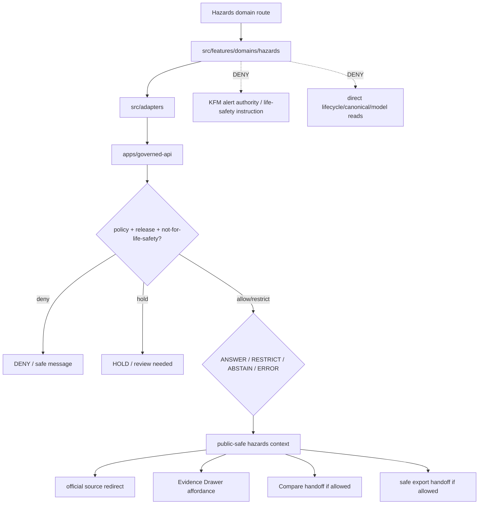

<!-- [KFM_META_BLOCK_V2]
doc_id: kfm://app/explorer-web/src/features/domains/hazards/readme
title: Explorer Web Hazards Domain Feature README
type: app-readme
version: v0.2
status: draft
owners: OWNER_TBD — Apps steward · UI steward · Hazards steward · Release authority · Governed API steward · Policy steward · Docs steward
created: 2026-06-16
updated: 2026-07-09
policy_label: public
related:
  - ../../README.md
  - ../../../README.md
  - ../../../adapters/README.md
  - ../../../../README.md
  - ../../../../../README.md
  - ../../../../../governed-api/README.md
  - ../../../../../../README.md
  - ../../../../../../SECURITY.md
  - ../../../../../../docs/domains/hazards/README.md
  - ../../../../../../docs/domains/hazards/PUBLICATION_AND_BOUNDARY.md
  - ../../../../../../policy/domains/hazards/README.md
  - ../../../../../../packages/ui/README.md
  - ../../../../../../packages/maplibre/README.md
  - ../../../../../../packages/cesium/README.md
  - ../../../../../../policy/access/README.md
  - ../../../../../../policy/decision/README.md
  - ../../../../../../release/README.md
  - ../../../../../../data/README.md
  - ../../../../../../tools/validators/README.md
  - ../../../../../../tools/watchers/README.md
tags: [kfm, apps, explorer-web, domains, hazards, feature, not-for-life-safety, official-source-redirect, evidence-drawer, map-first, no-direct-data-root, alert-authority-denied]
notes:
  - "v0.2 updates the uploaded Hazards domain-feature README into a current repo-aware feature contract."
  - "apps/explorer-web/src/features/domains/hazards/README.md, apps/explorer-web/src/features/README.md, docs/domains/hazards/README.md, docs/domains/hazards/PUBLICATION_AND_BOUNDARY.md, and policy/domains/hazards/README.md were verified through the GitHub app in this update. policy/release/hazards/README.md was NOT VERIFIED because a direct fetch returned Not Found. Prior related Explorer Web adapter/source/app boundaries remain relevant, but adapter files, routes, runtime wiring, tests, and envelopes remain NEEDS VERIFICATION."
  - "Feature implementation files, route wiring, domain-view inventory, tests, fixtures, governed API envelopes, not-for-life-safety disclaimers, official-source redirects, RedactionReceipts, AggregationReceipts, ReviewRecords, PolicyDecisions, ReleaseManifests, RollbackCards, CorrectionNotices, stale-state rules, export handoff, Focus Mode behavior, Evidence Drawer behavior, package scripts, runtime behavior, and deployment behavior remain NEEDS VERIFICATION."
  - "Hazards UI features may compose governed hazards envelopes into public/semi-public views, but they must not become emergency alerting, life-safety instruction, current warning authority, regulatory determination, official-source substitute, release authority, or direct model-output truth."
  - "Public Hazards UI must default to deny/hold/restrict when source role, freshness, expiry, official-source redirect, not-for-life-safety posture, evidence, release, stale-state, rollback, correction, policy, sensitivity, cross-lane ownership, or export support is unresolved."
[/KFM_META_BLOCK_V2] -->

<a id="top"></a>

<div align="center">

# Explorer Web Hazards Domain Feature

`apps/explorer-web/src/features/domains/hazards/`

**Domain-specific Explorer Web feature boundary for public-safe hazards views: historical events, warning/advisory context, disaster declarations, flood context, wildfire detection, smoke context, drought indicators, exposure summaries, resilience summaries, Evidence Drawer handoffs, Focus Mode answers, and release-aware map surfaces rendered only through governed envelopes.**


[Purpose](#1-purpose) · [Current evidence](#2-current-repo-evidence) · [Repo fit](#3-repo-fit) · [Boundary](#4-authority-boundary) · [Inputs](#6-inputs) · [Exclusions](#7-exclusions) · [Feature map](#8-hazards-feature-map) · [Definition of done](#15-definition-of-done)

</div>

---

> [!IMPORTANT]
> **Status:** draft / current README surface confirmed / implementation behavior `NEEDS VERIFICATION`  
> **Owners:** `OWNER_TBD` — Apps steward · UI steward · Hazards steward · Release authority · Governed API steward · Policy steward · Docs steward  
> **Path:** `apps/explorer-web/src/features/domains/hazards/README.md`  
> **Responsibility root:** `apps/` — deployable application surfaces  
> **Truth posture:** CONFIRMED README path and supporting Hazards docs/policy README surfaces / PROPOSED domain-feature contract / UNKNOWN implementation files, route wiring, domain-view inventory, tests, fixtures, governed API envelopes, not-for-life-safety disclaimers, official-source redirects, RedactionReceipts, AggregationReceipts, ReviewRecords, PolicyDecisions, ReleaseManifests, RollbackCards, CorrectionNotices, stale-state rules, export handoff, Focus Mode behavior, Evidence Drawer behavior, package scripts, runtime behavior, and deployment behavior

> [!CAUTION]
> Hazards UI is **not for life safety**. It must never present KFM as an emergency alert system, life-safety instruction surface, current warning authority, regulatory determination, or substitute for official sources. Advisory/watch/warning material may appear only as governed context with visible expiry, source, freshness, historical/current-status labels, and official-source redirects.

---

## Quick jump

- [1. Purpose](#1-purpose)
- [2. Current repo evidence](#2-current-repo-evidence)
- [3. Repo fit](#3-repo-fit)
- [4. Authority boundary](#4-authority-boundary)
- [5. Default posture](#5-default-posture)
- [6. Inputs](#6-inputs)
- [7. Exclusions](#7-exclusions)
- [8. Hazards feature map](#8-hazards-feature-map)
- [9. Diagram](#9-diagram)
- [10. Hazards UI obligations](#10-hazards-ui-obligations)
- [11. Per-view contract](#11-per-view-contract)
- [12. Inspection path](#12-inspection-path)
- [13. Validation expectations](#13-validation-expectations)
- [14. Safe change pattern](#14-safe-change-pattern)
- [15. Definition of done](#15-definition-of-done)
- [16. Open verification items](#16-open-verification-items)

---

## 1. Purpose

`apps/explorer-web/src/features/domains/hazards/` is the proposed app-local feature boundary for Hazards-specific Explorer Web surfaces.

It may eventually hold route modules, panels, view models, hooks, and feature orchestration for public-safe hazards experiences such as:

- historical hazard event and timeline views;
- warning and advisory context views with visible expiry, stale-state, historical/current-status labels, and official-source redirects;
- disaster declaration and regulatory hazard context;
- flood, wildfire, smoke, drought, earthquake, heat, and cold context surfaces;
- exposure and resilience summaries that preserve upstream sensitivity and aggregation state;
- not-for-life-safety banners and official-source link panels;
- source-role and temporal-role anti-collapse messaging;
- Evidence Drawer handoffs that show governed, role-typed, audience-appropriate payloads;
- Focus Mode bounded hazards answers with citation discipline and AIReceipt support;
- compare/export handoffs that preserve freshness, expiration, evidence, policy, release, stale-state, correction, supersession, and rollback state.

This directory is not proof that any route, panel, hook, map layer, adapter, test, fixture, package script, governed API envelope, not-for-life-safety disclaimer, official-source redirect, ReleaseManifest, RollbackCard, CorrectionNotice, stale-state rule, Evidence Drawer behavior, Focus Mode behavior, export handoff, or runtime wiring is implemented.

[Back to top](#top)

---

## 2. Current repo evidence

| Surface | Status | What it proves | What it does **not** prove |
|---|---|---|---|
| `apps/explorer-web/src/features/domains/hazards/README.md` | **CONFIRMED README** | This README exists and has been updated to v0.2. | Hazards UI implementation files, route wiring, domain-view inventory, tests, fixtures, governed API envelopes, disclaimers, release manifests, rollback cards, export handoff, or runtime behavior. |
| `apps/explorer-web/src/features/README.md` | **CONFIRMED parent features README** | Parent feature boundary says feature modules must not treat map features, tiles, local files, model text, or lifecycle data as claim truth. | That domain feature modules, route inventory, tests, fixtures, or runtime wiring exist. |
| `apps/explorer-web/src/adapters/README.md` | **CONFIRMED prior related boundary** | Adapter README was previously verified in this session as the governed API / renderer / evidence / layer / export / diagnostics adapter boundary. | That hazards adapters or governed API client adapters are implemented. |
| `docs/domains/hazards/README.md` | **CONFIRMED domain-doc surface** | Hazards domain docs define the not-for-life-safety boundary, official-source redirect posture, cross-lane non-ownership, and KFM-as-alert-authority as T4 forever. | That app UI behavior, schemas, validators, policy bundles, source descriptors, releases, or routes are implemented. |
| `docs/domains/hazards/PUBLICATION_AND_BOUNDARY.md` | **CONFIRMED publication/boundary doc surface** | Hazards publication docs state that KFM may publish hazard context through governed paths but must never become emergency alerting, life-safety instruction, or regulatory determination. | That executable policy, route enforcement, fixtures, tests, CI binding, release gate, or runtime checks exist. |
| `policy/domains/hazards/README.md` | **CONFIRMED policy-lane scaffold** | Hazards policy-lane README exists. | It is still a greenfield scaffold and does not prove concrete policy files, tests, fixtures, CI binding, release integration, or runtime enforcement. |
| `policy/release/hazards/README.md` | **NOT VERIFIED** | A direct fetch returned Not Found in this update. | Does not prove no release-gate path exists elsewhere; it only prevents claiming this README path exists. |
| `apps/explorer-web/src/features/domains/README.md` | **NOT VERIFIED** | A parent domain-feature README was not confirmed in this update. | Does not prove absence across all refs; a future index remains useful if accepted. |
| Uploaded Hazards Markdown | **CONFIRMED source text for this update** | Provided the base Hazards domain-feature contract updated here. | Does not prove live implementation. |
| Implementation beyond README | **NEEDS VERIFICATION** | Checkable by repo scan, route inventory, fixtures, tests, package scripts, governed API envelopes, receipts, release records, and runtime evidence. | Not claimed by this README. |

[Back to top](#top)

---

## 3. Repo fit

| Concern | Owning root | Expected relationship |
|---|---|---|
| Hazards domain feature source | `apps/explorer-web/src/features/domains/hazards/` | App-local Hazards UI feature modules, if implemented and tested. |
| Feature boundary | `apps/explorer-web/src/features/` | Parent feature/root contract. |
| Domain-feature parent index | `apps/explorer-web/src/features/domains/` | **NEEDS VERIFICATION**; parent README was not confirmed in this update. |
| Adapter boundary | `apps/explorer-web/src/adapters/` | Governed API, evidence, layer, map, export, and diagnostics adapters. |
| Explorer Web source tree | `apps/explorer-web/src/` | Parent source-layout boundary. |
| Explorer Web app | `apps/explorer-web/` | Map-first public/semi-public shell. |
| Governed API | `apps/governed-api/` | Trust membrane and normal claim-bearing data path. |
| Hazards doctrine | `docs/domains/hazards/` | Domain scope, not-for-life-safety boundary, source roles, publication, and verification backlog. |
| Hazards policy | `policy/domains/hazards/` | Hazards admissibility and exposure policy lane, if executable wiring is accepted. |
| Hazards release policy | `policy/release/hazards/` | **NEEDS VERIFICATION**; release-gate README was not confirmed in this update. |
| Hydrology / Atmosphere / Infrastructure / Roads lanes | `docs/domains/hydrology/`, `docs/domains/atmosphere/`, infrastructure and roads lanes | Canonical truth owners for cross-lane source material; Hazards consumes bounded context. |
| Shared UI components | `packages/ui/` | Reusable cards, badges, warning banners, drawers, panels, and legends when shared. |
| Renderer wrappers | `packages/maplibre/`, `packages/cesium/` | Renderer behavior stays behind adapter/wrapper boundaries. |
| Release authority | `release/` | Publication, correction, supersession, rollback control. |
| Lifecycle artifacts | `data/` | Receipts, proofs, registry, catalog, triplets, and published artifacts. |
| Security posture | `SECURITY.md`, `docs/security/` | Secrets, sensitive-output, incident, exposure, and audit posture. |

[Back to top](#top)

---

## 4. Authority boundary

This feature renders governed Hazards UI. It does not own emergency alerting, life-safety instructions, operational warning issuance, regulatory determinations, hydrology truth, atmosphere truth, infrastructure truth, roads truth, settlement truth, source admission, source rights, schemas, contracts, lifecycle artifacts, release decisions, evidence truth, renderer authority, official-source truth, or AI output.

```text
apps/explorer-web/src/features/domains/hazards/ = app-local Hazards UI feature
apps/explorer-web/src/features/                = feature boundary
apps/explorer-web/src/adapters/                = adapter boundary
apps/explorer-web/src/                         = Explorer Web implementation source
apps/explorer-web/                             = map-first public/semi-public app boundary
apps/governed-api/                             = trust membrane and normal data path
docs/domains/hazards/                          = Hazards doctrine and publication-boundary intent
policy/domains/hazards/                        = Hazards domain policy lane
policy/release/hazards/                        = proposed/not-yet-verified not-for-life-safety release gate lane
packages/ui/                                   = shared UI primitives
packages/maplibre/                             = renderer wrapper
packages/cesium/                               = optional gated renderer wrapper
policy/                                        = finite policy decisions
schemas/                                       = machine-readable shape
contracts/                                     = object meaning
data/                                          = lifecycle artifacts, receipts, proofs, registries
release/                                       = publication, correction, rollback authority
```

Safe interpretation:

- **CONFIRMED:** this README surface, parent Explorer Web feature README, Hazards domain README, Hazards publication/boundary doc, and Hazards policy-lane scaffold exist.
- **NOT VERIFIED:** `policy/release/hazards/README.md` was not found by direct fetch in this update.
- **PROPOSED:** Hazards feature modules may live here when they preserve governed API, not-for-life-safety boundary, official-source redirect, source-role, temporal-role, evidence, sensitivity, rights, stale-state, review, release, rollback, correction, export, and public-boundary constraints.
- **NEEDS VERIFICATION:** Hazards modules, route wiring, domain-view inventory, adapter dependencies, fixtures, tests, package scripts, governed API envelopes, not-for-life-safety disclaimers, official-source redirects, ReviewRecords, PolicyDecisions, ReleaseManifests, RollbackCards, CorrectionNotices, stale-state rules, export handoff, Evidence Drawer behavior, Focus Mode behavior, runtime behavior, and deployment behavior.
- **DENY:** using this feature as emergency alerting, life-safety instruction, current warning authority, regulatory determination, official-source substitute, Hazards truth, policy authority, release authority, lifecycle store, schema/contract home, direct canonical/internal store client, direct model-output surface, renderer authority, export authority, or public-data shortcut.

[Back to top](#top)

---

## 5. Default posture

Hazards feature modules should fail closed, preserve source-role and temporal labels, display the not-for-life-safety posture, and redirect action to official sources.

A view should not render claim-bearing hazards content when any of these are unresolved:

- governed API envelope and response validation;
- object family or hazards domain slug;
- source role, provenance, and official source identity;
- rights or license posture;
- freshness, expiry, effective date, closed date, or stale-state posture;
- warning/advisory/watch temporal role and historical-context status;
- hydrology, atmosphere, infrastructure, roads, settlements, habitat, people/land, or other cross-lane ownership;
- EvidenceRef or EvidenceBundle support;
- not-for-life-safety disclaimer and official-source redirect;
- PolicyDecision, ReleaseManifest, RollbackCard, CorrectionNotice, or stale-state rule;
- sensitivity, aggregation, redaction, critical-infrastructure exposure, or public-safety inference posture;
- public audience or export destination.

[Back to top](#top)

---

## 6. Inputs

| Input family | Examples | Required posture |
|---|---|---|
| Hazards view state | hazard event, warning/advisory context, declaration, flood, wildfire, smoke, drought, earthquake, heat/cold, exposure, resilience | Explicit finite states. |
| API envelope | answer, abstain, deny, error, hold, restricted, decision envelope, evidence payload | Runtime-validated before render. |
| Boundary state | not-for-life-safety, official-source redirect, expiry, current-vs-historical status | Required for operational-context objects. |
| Layer state | layer manifest, source role, legend, trust badges, valid/effective time, selected feature id | Released or bounded-safe source only. |
| Evidence state | EvidenceRef, EvidenceBundle summary, citation validation, proof visibility | Required for claim-bearing detail. |
| Transform state | aggregation, redaction, critical-infrastructure suppression, stale-state label | Required when reducing exposure risk. |
| Cross-lane state | hydrology, atmosphere, infrastructure, roads, settlements, people/land, habitat joins | Inherits strictest lane posture. |
| Release/correction state | release ref, rollback target, correction notice, stale-state, supersession, withdrawal | Required for public-facing claim and export support. |
| Export state | selected public-safe layer, bounds, citations, disclaimer, release state, output mode | Governed export only. |
| Focus Mode state | prompt class, finite outcome, evidence handles, policy result | No direct model output as hazards truth or safety instruction. |

[Back to top](#top)

---

## 7. Exclusions

| Does not belong here | Correct home |
|---|---|
| Hazards doctrine and publication boundary | `docs/domains/hazards/` |
| Hazards policy bundles or release-gate decisions | `policy/domains/hazards/`, `policy/release/hazards/`, `policy/` |
| Emergency alerting, warning issuance, or life-safety instructions | Official issuing authorities, never Explorer Web Hazards UI. |
| Hydrology canonical observations and NFHL identity | Hydrology lane; Hazards may consume `FloodContext` references. |
| Atmosphere/Air canonical observations and smoke/weather truth | Atmosphere lane; Hazards may consume `SmokeContext` / `AdvisoryContext` references. |
| Settlement, infrastructure, roads, and rail canonical truth | Owning domain lanes; Hazards may consume exposure/resilience projections. |
| Governed API implementation | `apps/governed-api/` |
| Adapter logic shared across feature families | `apps/explorer-web/src/adapters/` |
| Shared reusable UI primitives | `packages/ui/` |
| Renderer wrapper authority | `packages/maplibre/`, `packages/cesium/` |
| Hazards schemas and contracts | `schemas/contracts/v1/domains/hazards/`, `contracts/domains/hazards/` |
| Lifecycle artifacts, receipts, proofs, catalog, triplets | `data/` |
| Release manifests, rollback cards, correction notices | `release/` |
| Source acquisition or source registry records | `connectors/`, `data/registry/`, source catalog lanes. |
| Direct RAW / WORK / QUARANTINE / PROCESSED / CATALOG / TRIPLET / PUBLISHED reads | governed API, released artifacts, layer manifests, and bounded public-safe envelopes only. |
| Direct model runtime behavior | `runtime/` behind governed API only. |
| Secrets, credentials, tokens, private keys, critical-infrastructure details, official-source credentials, internal warning feed state | secret manager / deployment environment, not UI feature source or examples. |
| Public-sensitive exports, exact restricted locations, living-person/DNA details, source-restricted records, prompt/model traces, life-safety instructions | denied unless separately governed and public-safe; life-safety instruction is always denied. |

[Back to top](#top)

---

## 8. Hazards feature map

Exact modules remain `NEEDS VERIFICATION`. Candidate views should be introduced only with route inventory, fixtures, governed API envelopes, not-for-life-safety disclaimers, official-source redirects, release manifests, rollback cards, and tests.

| Candidate view | Purpose | Required safeguard | Status |
|---|---|---|---|
| `event-history` | Show historical hazard events and timelines. | Evidence, time, source-role, release state. | PROPOSED |
| `warning-context` | Show warnings/watches/advisories as context. | Expiry, historical status, official-source redirect. | PROPOSED |
| `flood-context` | Show NFHL/regulatory flood context. | Version-pinned; not observed flood extent. | PROPOSED |
| `wildfire-detection` | Show thermal detection or wildfire context. | Detection is not perimeter; confidence visible. | PROPOSED |
| `smoke-context` | Show smoke context. | Atmosphere relation and analyst/model caveat. | PROPOSED |
| `drought-indicators` | Show drought indicator context. | Cadence and modeled/aggregate posture. | PROPOSED |
| `heat-cold-context` | Show heat/cold context. | Official alerting redirect where advisory-like. | PROPOSED |
| `exposure-summary` | Show aggregate exposure/resilience summaries. | Critical-infrastructure and upstream-tier checks. | PROPOSED |
| `not-for-life-safety` | Display boundary and official-source redirects. | Always visible for operational context. | PROPOSED |
| `domain-focus` | Hazards Focus Mode UI. | Finite outcomes; no life-safety instruction. | PROPOSED |
| `domain-evidence` | Evidence Drawer handoff. | Audience-appropriate payload only. | PROPOSED |
| `domain-export` | Hazards export handoff. | Citation, disclaimer, release, stale-state checks. | PROPOSED |
| `domain-compare` | Hazards compare handoff. | Freshness, expiry, source-role, release, and not-for-life-safety posture preserved. | PROPOSED |
| `correction-status` | Public-safe stale/supersession/correction/rollback status. | Release/correction/rollback refs only; no actionable warning instruction. | PROPOSED |

> [!WARNING]
> Candidate view names are not implementation proof. Do not document a view as runnable until files, route wiring, tests, fixtures, package scripts, disclaimers, official-source redirects, release manifests, rollback cards, and governed API envelopes confirm it.

[Back to top](#top)

---

## 9. Diagram



[Back to top](#top)

---

## 10. Hazards UI obligations

| Obligation | Example effect |
|---|---|
| `governed_api_only` | Hazards feature state comes through governed API envelopes. |
| `not_for_life_safety_required` | Every operational-context surface displays the boundary and official-source redirect. |
| `alert_authority_denied` | KFM-as-alert-authority is never rendered as a public capability. |
| `temporal_state_required` | Warning/advisory/watch surfaces show expiry, historical status, freshness, and stale state. |
| `source_role_preserved` | Observed, regulatory, modeled, aggregate, administrative, candidate, and synthetic roles remain distinct. |
| `cross_lane_truth_preserved` | Hydrology, Atmosphere, Infrastructure, Roads, and Settlements keep canonical truth ownership. |
| `evidence_required` | Claim-bearing details link to EvidenceBundle-derived payloads. |
| `official_redirect_required` | Emergency action is redirected to official issuing authorities. |
| `finite_states_required` | Views render answer, restrict, abstain, deny, error, hold, loading, stale, expired, corrected, rollback, and empty states safely. |
| `safe_compare_required` | Compare handoff preserves freshness, expiry, source role, release, stale-state, disclaimer, and official-source posture. |
| `safe_export_required` | Export handoff preserves citations, disclaimers, freshness, release, correction, and rollback constraints. |
| `no_authority_fork` | Feature code does not redefine Hazards policy, schema, contract, source, release, alerting, or evidence logic. |
| `no_data_root_shortcut` | Feature code does not read lifecycle data roots, canonical/internal stores, local source files, or model output as claim sources. |
| `local_parity_preferred` | Hazards fixtures/tests should be runnable locally and in CI with the same inputs where practical. |

[Back to top](#top)

---

## 11. Per-view contract

Every long-lived Hazards domain view should document or encode:

- view purpose and route ownership;
- hazards object families and source families consumed;
- governed API envelope or adapter dependency;
- not-for-life-safety disclaimer and official-source redirect behavior;
- source-role, temporal-role, expiry, freshness, stale-state, and effective-date behavior;
- sensitivity, redaction, aggregation, critical-infrastructure, and cross-lane inheritance behavior;
- review, policy-decision, release, correction, supersession, withdrawal, and rollback behavior;
- expected finite outcomes;
- evidence/citation display behavior;
- loading, empty, deny, abstain, error, hold, restricted, stale, expired, corrected, and rollback states;
- direct lifecycle/canonical/model-output denial posture;
- compare, Focus Mode, Evidence Drawer, or export behavior, if any;
- tests and fixtures proving trust-membrane and not-for-life-safety boundaries.

[Back to top](#top)

---

## 12. Inspection path

Hazards feature implementation files, route wiring, tests, fixtures, governed API envelopes, boundary disclaimers, review records, release manifests, rollback cards, stale-state rules, package scripts, and export handoff remain `NEEDS VERIFICATION`.

```bash
find apps/explorer-web/src/features/domains/hazards -maxdepth 5 -type f | sort
find apps/explorer-web/src apps/governed-api docs/domains/hazards policy/domains/hazards policy/release/hazards packages/ui packages/maplibre tests fixtures -maxdepth 6 -type f 2>/dev/null | grep -Ei 'hazard|warning|advisory|watch|flood|wildfire|smoke|drought|earthquake|heat|cold|exposure|resilience|not-for-life-safety|official|evidence|release|rollback|governed' | sort
find data/raw data/work data/quarantine data/processed data/catalog data/triplets data/published data/receipts data/proofs -maxdepth 2 -type f 2>/dev/null | sort
```

[Back to top](#top)

---

## 13. Validation expectations

Useful validation for this feature boundary should cover:

- no Hazards feature imports or reads lifecycle data roots directly;
- claim-bearing Hazards views consume governed API envelopes only;
- malformed Hazards envelopes render safe error or abstain states;
- all warning/advisory/watch context is visibly not-for-life-safety, source-labeled, expired/historical when appropriate, and redirected to official sources;
- KFM-as-alert-authority and life-safety instruction surfaces are denied forever;
- FloodContext does not render as observed flood extent or forecast unless a governed source role supports that distinct claim;
- wildfire detection does not render as legal fire perimeter or legal fire status;
- smoke context preserves Atmosphere ownership and analyst/model caveats;
- ExposureSummary and ImpactArea outputs preserve upstream sensitivity and critical-infrastructure controls;
- Evidence Drawer handoff preserves EvidenceRef/EvidenceBundle handles without exposing protected content;
- Focus Mode renders finite outcomes and never direct model output as hazards truth or safety instruction;
- compare and export handoffs require citation, disclaimer, freshness, release, correction, and rollback support;
- UI output does not expose secrets, exact restricted locations, critical-infrastructure details, source-restricted records, private data, prompt/model traces, or life-safety instructions.

[Back to top](#top)

---

## 14. Safe change pattern

For Hazards feature changes:

1. Add or update route inventory and per-view contract.
2. Add fixtures for open, historical, expired, stale, restricted, denied, held, abstained, malformed, loading, corrected, rolled-back, and empty states.
3. Test lifecycle-data denial and governed API-only behavior.
4. Preserve not-for-life-safety disclaimers, official-source redirects, source role, temporal role, expiry, freshness, review, release, rollback, rights, and citation fields through UI state.
5. Verify KFM-as-alert-authority and life-safety instruction surfaces are always denied.
6. Verify compare, export, Focus Mode, and Evidence Drawer handoffs cannot bypass policy, official-source posture, release, correction, stale-state, or rollback checks.
7. Update this README, parent `features/README.md`, adapter README, hazards docs, policy README, and parent app README when public behavior changes.

[Back to top](#top)

---

## 15. Definition of done

- [ ] Owners are confirmed and `OWNER_TBD` is replaced.
- [ ] Hazards feature file inventory and route ownership are documented.
- [ ] Governed API and adapter dependencies are explicit.
- [ ] Not-for-life-safety, official-source redirect, source-role, temporal-role, expiry, stale-state, release, and rollback states are represented in UI fixtures.
- [ ] Critical-infrastructure, exposure, redaction, and aggregation obligations survive feature composition.
- [ ] Direct lifecycle-data import/read checks are covered.
- [ ] Alert-authority denial states are tested.
- [ ] Source-role and temporal-role anti-collapse states are tested.
- [ ] Official-source redirect behavior is tested.
- [ ] Finite states cover answer, restrict, abstain, deny, error, hold, loading, stale, expired, corrected, rollback, and empty cases.
- [ ] Evidence Drawer, Focus Mode, Compare, and Export handoffs are tested for safe output if present.
- [ ] Parent feature/adapter/source/app READMEs and Hazards docs/policy surfaces are updated when public behavior changes.

[Back to top](#top)

---

## 16. Open verification items

| Item | Why it matters |
|---|---|
| Confirm Hazards feature implementation files beyond README | Prevents overclaiming feature maturity. |
| Confirm route inventory | Required for public/semi-public UI boundary review. |
| Confirm governed API Hazards envelopes | Required for trust membrane enforcement. |
| Confirm not-for-life-safety fixtures | Required before operational-context UI claims. |
| Confirm official-source redirect behavior | Required before public warning/advisory context claims. |
| Confirm alert-authority denial gate | Required to preserve the T4-forever boundary. |
| Confirm source-role and temporal-role anti-collapse fixtures | Prevents modeled/regulatory/observed/current/historical role drift. |
| Confirm release, correction, stale-state, supersession, withdrawal, and rollback states | Required before public map-layer claims. |
| Confirm release manifest and rollback-card linkage | Required before publication-support claims. |
| Confirm `policy/release/hazards/README.md` or accepted release-policy path | Required before claiming a dedicated release-gate policy lane exists. |
| Confirm fixtures and tests | Required before implementation claims. |
| Confirm Focus Mode and Evidence Drawer behavior | Required before claim-bearing Hazards UI claims. |
| Confirm Compare handoff | Required before visual-difference claims. |
| Confirm export handoff | Required before public download workflows. |
| Confirm direct data-root denial | Required for public client trust membrane. |
| Confirm executable Hazards policy binding | Required before enforcement claims. |
| Confirm package scripts beyond TODO | Required before build/test claims. |

<details>
<summary>Appendix A — no-loss preservation note</summary>

The uploaded README replaced a greenfield Hazards domain-feature stub with a bounded Hazards feature contract without claiming Hazards routes, panels, hooks, adapters, fixtures, tests, package scripts, governed API envelopes, not-for-life-safety disclaimers, official-source redirects, ReleaseManifests, RollbackCards, Focus Mode, Evidence Drawer, Compare, or export handoff are implemented. This v0.2 update preserves that structure while adding current repo evidence, parent feature linkage, supporting Hazards docs/policy evidence, stronger no-direct-data-root language, not-for-life-safety T4-forever posture, official-source redirect posture, source-role/temporal-role anti-collapse posture, release/correction/rollback posture, compare/export handoff posture, local-parity expectations, and expanded verification items.

</details>

## Status summary

`apps/explorer-web/src/features/domains/hazards/` should contain Hazards-specific Explorer Web feature modules only after route contracts, governed API envelopes, not-for-life-safety posture, official-source redirects, fixtures, tests, Evidence Drawer behavior, Focus Mode behavior, Compare behavior, release/stale/rollback handling, and export handoff are verified.

It must preserve the trust membrane and Hazards boundary: the feature may show historical, regulatory, observed, modeled, exposure, resilience, and advisory context, but it must not become emergency alerting, life-safety instruction, regulatory determination, official warning issuance, release authority, lifecycle storage, direct model-output surface, or a source of unsupported hazards claims.

<p align="right"><a href="#top">Back to top</a></p>
