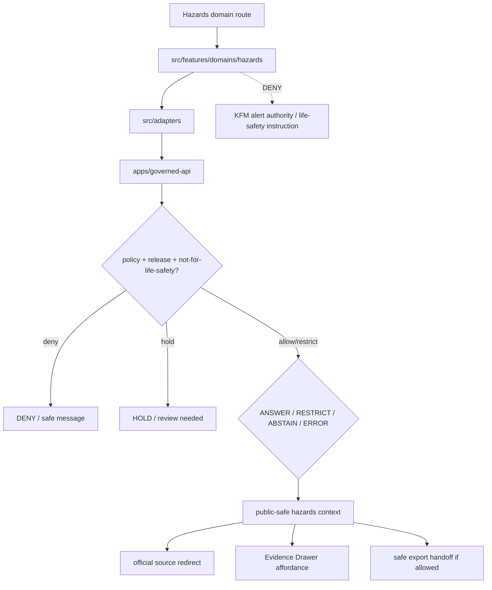

<!-- [KFM_META_BLOCK_V2]
doc_id: kfm://app/explorer-web/src/features/domains/hazards/readme
title: Explorer Web Hazards Domain Feature README
type: app-readme
version: v0.1
status: draft
owners: OWNER_TBD — Apps steward · UI steward · Hazards steward · Release authority · Governed API steward · Policy steward · Docs steward
created: 2026-06-16
updated: 2026-06-16
policy_label: public
related:
  - ../../README.md
  - ../../../README.md
  - ../../../adapters/README.md
  - ../../../../README.md
  - ../../../../../README.md
  - ../../../../../governed-api/README.md
  - ../../../../../../docs/domains/hazards/README.md
  - ../../../../../../docs/domains/hazards/PUBLICATION_AND_BOUNDARY.md
  - ../../../../../../policy/domains/hazards/README.md
  - ../../../../../../packages/ui/README.md
  - ../../../../../../packages/maplibre/README.md
  - ../../../../../../policy/access/README.md
  - ../../../../../../policy/decision/README.md
  - ../../../../../../release/README.md
  - ../../../../../../data/README.md
tags: [kfm, apps, explorer-web, domains, hazards, feature, not-for-life-safety, official-source-redirect, evidence-drawer, map-first]
notes:
  - "Replaces the greenfield hazards domain feature stub with a governed feature README."
  - "Hazards UI features may compose governed hazards envelopes into public/semi-public views, but they must not become emergency alerting, life-safety instruction, regulatory determination, or direct-current warning authority."
  - "Feature implementation files, route wiring, tests, fixtures, governed API envelopes, not-for-life-safety disclaimers, ReleaseManifests, RollbackCards, stale-state rules, and package scripts remain NEEDS VERIFICATION."
[/KFM_META_BLOCK_V2] -->

<a id="top"></a>

<div align="center">

# Explorer Web Hazards Domain Feature

`apps/explorer-web/src/features/domains/hazards/`

**Domain-specific Explorer Web feature boundary for public-safe hazards views: historical events, warning/advisory context, disaster declarations, flood context, wildfire detection, smoke context, drought indicators, exposure summaries, resilience summaries, Evidence Drawer handoffs, Focus Mode answers, and release-aware map surfaces rendered only through governed envelopes.**


[Purpose](#1-purpose) · [Repo fit](#2-repo-fit) · [Boundary](#3-authority-boundary) · [Inputs](#5-inputs) · [Exclusions](#6-exclusions) · [Feature map](#7-hazards-feature-map) · [Definition of done](#14-definition-of-done)

</div>

---

> [!IMPORTANT]
> **Status:** draft / `NEEDS VERIFICATION`  
> **Owners:** `OWNER_TBD` — Apps steward · UI steward · Hazards steward · Release authority · Governed API steward · Policy steward · Docs steward  
> **Path:** `apps/explorer-web/src/features/domains/hazards/README.md`  
> **Responsibility root:** `apps/` — deployable application surfaces  
> **Truth posture:** CONFIRMED README path / CONFIRMED hazards doctrine and publication-boundary docs / PROPOSED domain-feature contract / UNKNOWN implementation files, route wiring, tests, fixtures, and runtime behavior

> [!CAUTION]
> Hazards UI is **not for life safety**. It must never present KFM as an emergency alert system, life-safety instruction surface, current warning authority, regulatory determination, or substitute for official sources. Advisory/watch/warning material may appear only as governed context with visible expiry, source, freshness, and official-source redirects.

---

## Quick jump

- [1. Purpose](#1-purpose)
- [2. Repo fit](#2-repo-fit)
- [3. Authority boundary](#3-authority-boundary)
- [4. Default posture](#4-default-posture)
- [5. Inputs](#5-inputs)
- [6. Exclusions](#6-exclusions)
- [7. Hazards feature map](#7-hazards-feature-map)
- [8. Diagram](#8-diagram)
- [9. Hazards UI obligations](#9-hazards-ui-obligations)
- [10. Per-view contract](#10-per-view-contract)
- [11. Inspection path](#11-inspection-path)
- [12. Validation expectations](#12-validation-expectations)
- [13. Safe change pattern](#13-safe-change-pattern)
- [14. Definition of done](#14-definition-of-done)
- [15. Open verification items](#15-open-verification-items)

---

## 1. Purpose

`apps/explorer-web/src/features/domains/hazards/` is the proposed app-local feature boundary for Hazards-specific Explorer Web surfaces.

It may eventually hold route modules, panels, view models, hooks, and feature orchestration for public-safe hazards experiences such as:

- historical hazard event and timeline views;
- warning and advisory context views with visible expiry and official-source redirects;
- disaster declaration and regulatory hazard context;
- flood, wildfire, smoke, drought, earthquake, heat, and cold context surfaces;
- exposure and resilience summaries that preserve upstream sensitivity and aggregation state;
- not-for-life-safety banners and official-source link panels;
- Evidence Drawer handoffs that show governed, role-typed, audience-appropriate payloads;
- Focus Mode bounded hazards answers with citation discipline and AIReceipt support;
- compare/export handoffs that preserve freshness, expiration, evidence, policy, release, stale-state, correction, and rollback state.

This directory is not proof that any route, panel, hook, map layer, adapter, test, fixture, package script, or governed API envelope is implemented.

[Back to top](#top)

---

## 2. Repo fit

| Concern | Owning root | Expected relationship |
|---|---|---|
| Hazards domain feature source | `apps/explorer-web/src/features/domains/hazards/` | App-local Hazards UI feature modules, if implemented and tested |
| Feature boundary | `apps/explorer-web/src/features/` | Parent feature/root contract |
| Adapter boundary | `apps/explorer-web/src/adapters/` | Governed API, evidence, layer, map, export, and diagnostics adapters |
| Explorer Web app | `apps/explorer-web/` | Map-first public/semi-public shell |
| Governed API | `apps/governed-api/` | Trust membrane and normal data path |
| Hazards doctrine | `docs/domains/hazards/` | Domain scope, not-for-life-safety boundary, source roles, publication, and verification backlog |
| Hazards policy | `policy/domains/hazards/`, `policy/release/hazards/` | Hazards admissibility and release-gate policy, if executable wiring is accepted |
| Shared UI components | `packages/ui/` | Reusable cards, badges, warning banners, drawers, panels, and legends when shared |
| Renderer wrappers | `packages/maplibre/`, `packages/cesium/` | Renderer behavior stays behind adapter/wrapper boundaries |
| Release authority | `release/` | Publication, correction, supersession, rollback control |
| Lifecycle artifacts | `data/` | Receipts, proofs, registry, catalog, triplets, and published artifacts |

## 3. Authority boundary

This feature renders governed Hazards UI. It does not own emergency alerting, life-safety instructions, operational warning issuance, regulatory determinations, hydrology truth, atmosphere truth, infrastructure truth, roads truth, source admission, source rights, schemas, contracts, lifecycle artifacts, release decisions, evidence truth, renderer authority, or AI output.

```text
apps/explorer-web/src/features/domains/hazards/ = app-local Hazards UI feature
apps/explorer-web/src/features/                = feature boundary
apps/explorer-web/src/adapters/                = adapter boundary
apps/governed-api/                             = trust membrane and normal data path
docs/domains/hazards/                          = Hazards doctrine and publication-boundary intent
policy/domains/hazards/                        = Hazards domain policy lane
policy/release/hazards/                        = proposed not-for-life-safety release gate lane
packages/ui/                                   = shared UI primitives
policy/                                        = finite policy decisions
data/                                          = lifecycle artifacts, receipts, proofs, registries
release/                                       = publication, correction, rollback authority
```

## 4. Default posture

Hazards feature modules should fail closed, preserve source-role and temporal labels, display the not-for-life-safety posture, and redirect action to official sources.

A view should not render claim-bearing hazards content when any of these are unresolved:

- governed API envelope and response validation;
- object family or hazards domain slug;
- source role, provenance, and official source identity;
- rights or license posture;
- freshness, expiry, effective date, closed date, or stale-state posture;
- warning/advisory/watch temporal role and historical-context status;
- hydrology, atmosphere, infrastructure, roads, or other cross-lane ownership;
- EvidenceRef or EvidenceBundle support;
- not-for-life-safety disclaimer and official-source redirect;
- PolicyDecision, ReleaseManifest, RollbackCard, CorrectionNotice, or stale-state rule;
- sensitivity, aggregation, redaction, or critical-infrastructure exposure posture;
- public audience or export destination.

## 5. Inputs

| Input family | Examples | Required posture |
|---|---|---|
| Hazards view state | hazard event, warning/advisory context, declaration, flood, wildfire, smoke, drought, earthquake, heat/cold, exposure, resilience | Explicit finite states |
| API envelope | answer, abstain, deny, error, hold, restricted, decision envelope, evidence payload | Runtime-validated before render |
| Boundary state | not-for-life-safety, official-source redirect, expiry, current-vs-historical status | Required for operational-context objects |
| Layer state | layer manifest, source role, legend, trust badges, valid/effective time, selected feature id | Released or bounded-safe source only |
| Evidence state | EvidenceRef, EvidenceBundle summary, citation validation, proof visibility | Required for claim-bearing detail |
| Transform state | aggregation, redaction, critical-infrastructure suppression, stale-state label | Required when reducing exposure risk |
| Cross-lane state | hydrology, atmosphere, infrastructure, roads, settlements, people/land, habitat joins | Inherits strictest lane posture |
| Export state | selected public-safe layer, bounds, citations, disclaimer, release state, output mode | Governed export only |

## 6. Exclusions

| Does not belong here | Correct home |
|---|---|
| Hazards doctrine and publication boundary | `docs/domains/hazards/` |
| Hazards policy bundles or release-gate decisions | `policy/domains/hazards/`, `policy/release/hazards/`, `policy/` |
| Emergency alerting, warning issuance, or life-safety instructions | Official issuing authorities, never Explorer Web Hazards UI |
| Hydrology canonical observations and NFHL identity | Hydrology lane; Hazards may consume `FloodContext` references |
| Atmosphere/Air canonical observations and smoke/weather truth | Atmosphere lane; Hazards may consume `SmokeContext` / `AdvisoryContext` references |
| Settlement, infrastructure, roads, and rail canonical truth | Owning domain lanes; Hazards may consume exposure/resilience projections |
| Governed API implementation | `apps/governed-api/` |
| Adapter logic shared across feature families | `apps/explorer-web/src/adapters/` |
| Shared reusable UI primitives | `packages/ui/` |
| Renderer wrapper authority | `packages/maplibre/`, `packages/cesium/` |
| Hazards schemas and contracts | `schemas/contracts/v1/domains/hazards/`, `contracts/domains/hazards/` |
| Lifecycle artifacts, receipts, proofs, catalog, triplets | `data/` |
| Release manifests, rollback cards, correction notices | `release/` |
| Source acquisition or source registry records | `connectors/`, `data/registry/`, source catalog lanes |
| Direct model runtime behavior | `runtime/` behind governed API only |
| Secrets, credentials, tokens, private keys | Secret manager / deployment environment |

## 7. Hazards feature map

Exact modules remain `NEEDS VERIFICATION`. Candidate views should be introduced only with route inventory, fixtures, and tests.

| Candidate view | Purpose | Required safeguard | Status |
|---|---|---|---|
| `event-history` | Show historical hazard events and timelines | Evidence, time, source-role, release state | PROPOSED |
| `warning-context` | Show warnings/watches/advisories as context | Expiry, historical status, official-source redirect | PROPOSED |
| `flood-context` | Show NFHL/regulatory flood context | Version-pinned; not observed flood extent | PROPOSED |
| `wildfire-detection` | Show thermal detection or wildfire context | Detection ≠ perimeter; confidence visible | PROPOSED |
| `smoke-context` | Show smoke context | Atmosphere relation and analyst/model caveat | PROPOSED |
| `drought-indicators` | Show drought indicator context | Cadence and modeled/aggregate posture | PROPOSED |
| `exposure-summary` | Show aggregate exposure/resilience summaries | Critical-infrastructure and upstream-tier checks | PROPOSED |
| `not-for-life-safety` | Display boundary and official-source redirects | Always visible for operational context | PROPOSED |
| `domain-focus` | Hazards Focus Mode UI | Finite outcomes; no life-safety instruction | PROPOSED |
| `domain-evidence` | Evidence Drawer handoff | Audience-appropriate payload only | PROPOSED |
| `domain-export` | Hazards export handoff | Citation, disclaimer, release, stale-state checks | PROPOSED |

> [!WARNING]
> Candidate view names are not implementation proof. Do not document a view as runnable until files, route wiring, tests, fixtures, package scripts, and governed API envelopes confirm it.

## 8. Diagram



## 9. Hazards UI obligations

| Obligation | Example effect |
|---|---|
| `governed_api_only` | Hazards feature state comes through governed API envelopes |
| `not_for_life_safety_required` | Every operational-context surface displays the boundary and official-source redirect |
| `alert_authority_denied` | KFM-as-alert-authority is never rendered as a public capability |
| `temporal_state_required` | Warning/advisory/watch surfaces show expiry, historical status, freshness, and stale state |
| `source_role_preserved` | Observed, regulatory, modeled, aggregate, administrative, candidate, and synthetic roles remain distinct |
| `cross_lane_truth_preserved` | Hydrology, Atmosphere, Infrastructure, Roads, and Settlements keep canonical truth ownership |
| `evidence_required` | Claim-bearing details link to EvidenceBundle-derived payloads |
| `finite_states_required` | Views render answer, restrict, abstain, deny, error, hold, loading, stale, expired, and empty states safely |
| `safe_export_required` | Export handoff preserves citations, disclaimers, freshness, release, correction, and rollback constraints |
| `no_authority_fork` | Feature code does not redefine Hazards policy, schema, contract, source, release, alerting, or evidence logic |

## 10. Per-view contract

Every long-lived Hazards domain view should document or encode:

- view purpose and route ownership;
- hazards object families and source families consumed;
- governed API envelope or adapter dependency;
- not-for-life-safety disclaimer and official-source redirect behavior;
- source-role, temporal-role, expiry, freshness, stale-state, and effective-date behavior;
- sensitivity, redaction, aggregation, critical-infrastructure, and cross-lane inheritance behavior;
- release, correction, supersession, and rollback behavior;
- expected finite outcomes;
- evidence/citation display behavior;
- loading, empty, deny, abstain, error, hold, restricted, stale, and expired states;
- export behavior, if any;
- tests and fixtures proving trust-membrane and not-for-life-safety boundaries.

## 11. Inspection path

Hazards feature implementation files, route wiring, tests, fixtures, governed API envelopes, boundary disclaimers, review records, release manifests, rollback cards, stale-state rules, package scripts, and export handoff remain `NEEDS VERIFICATION`.

```bash
find apps/explorer-web/src/features/domains/hazards -maxdepth 5 -type f | sort
find apps/explorer-web/src apps/governed-api docs/domains/hazards policy/domains/hazards policy/release/hazards packages/ui packages/maplibre tests fixtures -maxdepth 6 -type f 2>/dev/null | grep -Ei 'hazard|warning|advisory|watch|flood|wildfire|smoke|drought|earthquake|heat|cold|exposure|resilience|not-for-life-safety|official|evidence|release|rollback|governed' | sort
find data/raw data/work data/quarantine data/processed data/catalog data/triplets data/published data/receipts data/proofs -maxdepth 2 -type f 2>/dev/null | sort
```

## 12. Validation expectations

Useful validation for this feature boundary should cover:

- no Hazards feature imports or reads lifecycle data roots directly;
- claim-bearing Hazards views consume governed API envelopes only;
- malformed Hazards envelopes render safe error or abstain states;
- all warning/advisory/watch context is visibly not-for-life-safety, source-labeled, expired/historical when appropriate, and redirected to official sources;
- KFM-as-alert-authority and life-safety instruction surfaces are denied forever;
- FloodContext does not render as observed flood extent or forecast unless a governed source role supports that distinct claim;
- wildfire detection does not render as legal fire perimeter or legal fire status;
- ExposureSummary and ImpactArea outputs preserve upstream sensitivity and critical-infrastructure controls;
- Evidence Drawer handoff preserves EvidenceRef/EvidenceBundle handles without exposing protected content;
- Focus Mode renders finite outcomes and never direct model output as hazards truth or safety instruction;
- export handoff requires citation, disclaimer, freshness, release, correction, and rollback support.

## 13. Safe change pattern

For Hazards feature changes:

1. Add or update route inventory and per-view contract.
2. Add fixtures for open, historical, expired, stale, restricted, denied, held, abstained, malformed, loading, corrected, rolled-back, and empty states.
3. Test lifecycle-data denial and governed API-only behavior.
4. Preserve not-for-life-safety disclaimers, official-source redirects, source role, temporal role, expiry, freshness, review, release, rollback, rights, and citation fields through UI state.
5. Update this README, parent `features/README.md`, hazards docs, and parent app README when public behavior changes.

## 14. Definition of done

- [ ] Owners are confirmed and `OWNER_TBD` is replaced.
- [ ] Hazards feature file inventory and route ownership are documented.
- [ ] Governed API and adapter dependencies are explicit.
- [ ] Not-for-life-safety, official-source redirect, source-role, temporal-role, expiry, stale-state, release, and rollback states are represented in UI fixtures.
- [ ] Critical-infrastructure, exposure, redaction, and aggregation obligations survive feature composition.
- [ ] Direct lifecycle-data import/read checks are covered.
- [ ] Alert-authority denial states are tested.
- [ ] Source-role and temporal-role anti-collapse states are tested.
- [ ] Finite states cover answer, restrict, abstain, deny, error, hold, loading, stale, expired, corrected, rollback, and empty cases.
- [ ] Export, Focus Mode, and Evidence Drawer handoffs are tested for safe output if present.

## 15. Open verification items

| Item | Why it matters |
|---|---|
| Confirm Hazards feature implementation files beyond README | Prevents overclaiming feature maturity |
| Confirm route inventory | Required for public/semi-public UI boundary review |
| Confirm governed API Hazards envelopes | Required for trust membrane enforcement |
| Confirm not-for-life-safety fixtures | Required before operational-context UI claims |
| Confirm official-source redirect behavior | Required before public warning/advisory context claims |
| Confirm release, correction, stale-state, and rollback states | Required before public map-layer claims |
| Confirm Focus Mode and Evidence Drawer behavior | Required before claim-bearing Hazards UI claims |
| Confirm export handoff | Required before public download workflows |
| Confirm package scripts beyond TODO | Required before build/test claims |

<details>
<summary>Appendix A — no-loss preservation note</summary>

The previous README was a greenfield stub. This replacement adds a bounded Hazards domain-feature contract without claiming Hazards routes, panels, hooks, adapters, fixtures, tests, package scripts, governed API envelopes, not-for-life-safety disclaimers, official-source redirects, ReleaseManifests, RollbackCards, Focus Mode, Evidence Drawer, or export handoff are implemented.

</details>

## Status summary

`apps/explorer-web/src/features/domains/hazards/` should contain Hazards-specific Explorer Web feature modules only after route contracts, governed API envelopes, not-for-life-safety posture, fixtures, tests, Evidence Drawer behavior, Focus Mode behavior, release/stale/rollback handling, and export handoff are verified.

It must preserve the trust membrane and Hazards boundary: the feature may show historical, regulatory, observed, modeled, exposure, resilience, and advisory context, but it must not become emergency alerting, life-safety instruction, regulatory determination, official warning issuance, release authority, lifecycle storage, or a direct model-output surface.

<p align="right"><a href="#top">Back to top</a></p>
