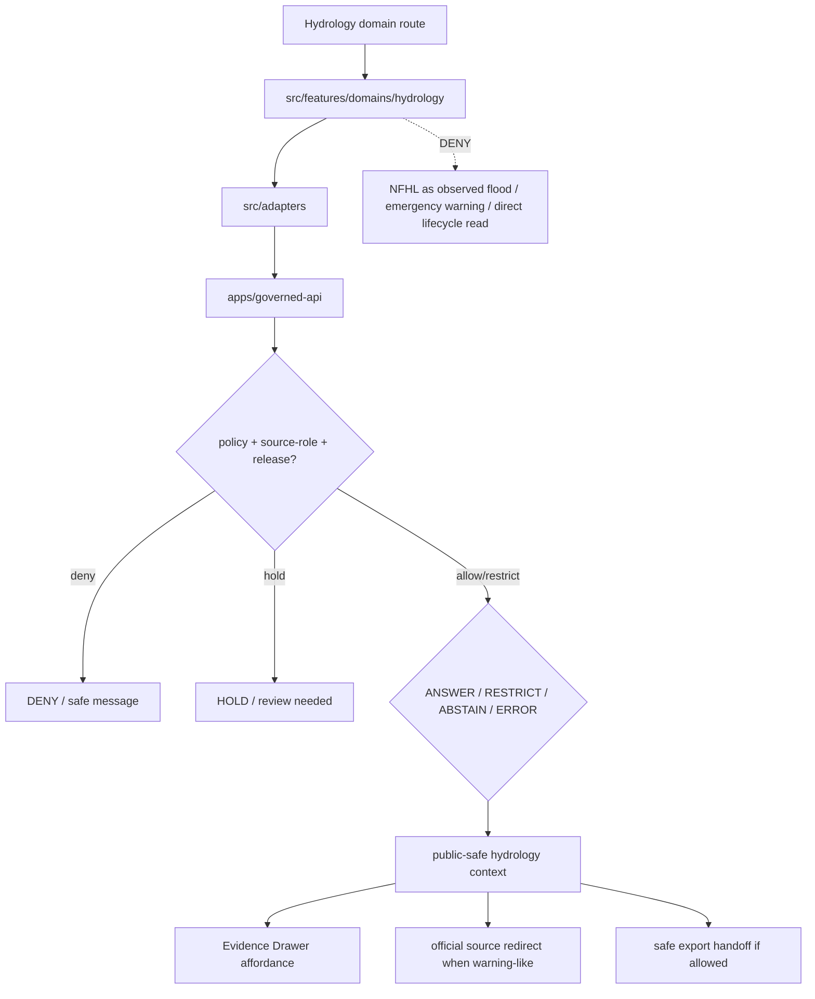

<!-- [KFM_META_BLOCK_V2]
doc_id: kfm://app/explorer-web/src/features/domains/hydrology/readme
title: Explorer Web Hydrology Domain Feature README
type: app-readme
version: v0.1
status: draft
owners: OWNER_TBD — Apps steward · UI steward · Hydrology steward · Governed API steward · Policy steward · Docs steward
created: 2026-06-16
updated: 2026-06-16
policy_label: public
related:
  - ../../README.md
  - ../../../README.md
  - ../../../adapters/README.md
  - ../../../../README.md
  - ../../../../../README.md
  - ../../../../../governed-api/README.md
  - ../../../../../../docs/domains/hydrology/README.md
  - ../../../../../../docs/domains/hydrology/PUBLICATION_POSTURE.md
  - ../../../../../../policy/domains/hydrology/README.md
  - ../../../../../../packages/ui/README.md
  - ../../../../../../packages/maplibre/README.md
  - ../../../../../../policy/access/README.md
  - ../../../../../../policy/decision/README.md
  - ../../../../../../release/README.md
  - ../../../../../../data/README.md
tags: [kfm, apps, explorer-web, domains, hydrology, feature, watershed, huc, gauge, nfhl, not-for-life-safety, evidence-drawer, map-first]
notes:
  - "Replaces the greenfield hydrology domain feature stub with a governed feature README."
  - "Hydrology UI features may compose governed hydrology envelopes into public/semi-public views, but they must not become emergency flood-warning, observed-flood authority, regulatory determination, lifecycle storage, source truth, or direct model-output truth."
  - "Feature implementation files, route wiring, tests, fixtures, governed API envelopes, NFHL role checks, ReleaseManifests, RollbackCards, and package scripts remain NEEDS VERIFICATION."
[/KFM_META_BLOCK_V2] -->

<a id="top"></a>

<div align="center">

# Explorer Web Hydrology Domain Feature

`apps/explorer-web/src/features/domains/hydrology/`

**Domain-specific Explorer Web feature boundary for public-safe hydrology views: watersheds, HUCs, reaches, gauges, observations, groundwater, water quality, NFHL regulatory context, upstream traces, Evidence Drawer handoffs, Focus Mode answers, and release-aware map surfaces rendered only through governed envelopes.**


[Purpose](#1-purpose) · [Repo fit](#2-repo-fit) · [Boundary](#3-authority-boundary) · [Inputs](#5-inputs) · [Exclusions](#6-exclusions) · [Feature map](#7-hydrology-feature-map) · [Definition of done](#14-definition-of-done)

</div>

---

> [!IMPORTANT]
> **Status:** draft / `NEEDS VERIFICATION`  
> **Owners:** `OWNER_TBD` — Apps steward · UI steward · Hydrology steward · Governed API steward · Policy steward · Docs steward  
> **Path:** `apps/explorer-web/src/features/domains/hydrology/README.md`  
> **Responsibility root:** `apps/` — deployable application surfaces  
> **Truth posture:** CONFIRMED README path / CONFIRMED hydrology doctrine and publication docs / PROPOSED domain-feature contract / UNKNOWN implementation files, route wiring, tests, fixtures, and runtime behavior

> [!CAUTION]
> Hydrology UI is not an emergency flood-warning system. It must never collapse observed gauge readings, regulatory NFHL zones, modeled hydrographs, and operational warnings into one truth class. NFHL is regulatory context only unless a governed source role and evidence path support a distinct claim.

---

## Quick jump

- [1. Purpose](#1-purpose)
- [2. Repo fit](#2-repo-fit)
- [3. Authority boundary](#3-authority-boundary)
- [4. Default posture](#4-default-posture)
- [5. Inputs](#5-inputs)
- [6. Exclusions](#6-exclusions)
- [7. Hydrology feature map](#7-hydrology-feature-map)
- [8. Diagram](#8-diagram)
- [9. Hydrology UI obligations](#9-hydrology-ui-obligations)
- [10. Per-view contract](#10-per-view-contract)
- [11. Inspection path](#11-inspection-path)
- [12. Validation expectations](#12-validation-expectations)
- [13. Safe change pattern](#13-safe-change-pattern)
- [14. Definition of done](#14-definition-of-done)
- [15. Open verification items](#15-open-verification-items)

---

## 1. Purpose

`apps/explorer-web/src/features/domains/hydrology/` is the proposed app-local feature boundary for Hydrology-specific Explorer Web surfaces.

It may eventually hold route modules, panels, view models, hooks, and feature orchestration for public-safe hydrology experiences such as:

- watershed, HUC, reach, and hydro-feature map views;
- gauge, groundwater-well, hydrograph, and water-quality observation summaries;
- NFHL and flood-zone regulatory context that is visibly not observed inundation;
- upstream/downstream trace and hydrologic topology views;
- drought, irrigation, water-use, and hydrostratigraphy relation context while preserving other lane ownership;
- Evidence Drawer handoffs that show governed, time-aware, role-typed payloads;
- Focus Mode bounded hydrology answers with citation discipline and AIReceipt support;
- compare/export handoffs that preserve source role, rights, freshness, release, stale-state, correction, and rollback state.

This directory is not proof that any route, panel, hook, map layer, adapter, test, fixture, package script, or governed API envelope is implemented.

[Back to top](#top)

---

## 2. Repo fit

| Concern | Owning root | Expected relationship |
|---|---|---|
| Hydrology domain feature source | `apps/explorer-web/src/features/domains/hydrology/` | App-local Hydrology UI feature modules, if implemented and tested |
| Feature boundary | `apps/explorer-web/src/features/` | Parent feature/root contract |
| Adapter boundary | `apps/explorer-web/src/adapters/` | Governed API, evidence, layer, map, export, and diagnostics adapters |
| Explorer Web app | `apps/explorer-web/` | Map-first public/semi-public shell |
| Governed API | `apps/governed-api/` | Trust membrane and normal data path |
| Hydrology doctrine | `docs/domains/hydrology/` | Domain scope, source roles, NFHL posture, publication, and verification backlog |
| Hydrology policy | `policy/domains/hydrology/` | Hydrology admissibility and exposure policy, if executable wiring is accepted |
| Shared UI components | `packages/ui/` | Reusable cards, badges, drawers, panels, hydrograph widgets, and legends when shared |
| Renderer wrappers | `packages/maplibre/`, `packages/cesium/` | Renderer behavior stays behind adapter/wrapper boundaries |
| Release authority | `release/` | Publication, correction, supersession, rollback control |
| Lifecycle artifacts | `data/` | Receipts, proofs, registry, catalog, triplets, and published artifacts |

## 3. Authority boundary

This feature renders governed Hydrology UI. It does not own emergency alerts, life-safety instructions, observed flood authority, FEMA/NFHL regulatory authority, source admission, source rights, schemas, contracts, lifecycle artifacts, release decisions, evidence truth, renderer authority, hydrologic canonical stores, or AI output.

```text
apps/explorer-web/src/features/domains/hydrology/ = app-local Hydrology UI feature
apps/explorer-web/src/features/                  = feature boundary
apps/explorer-web/src/adapters/                  = adapter boundary
apps/governed-api/                               = trust membrane and normal data path
docs/domains/hydrology/                          = Hydrology doctrine and publication posture
policy/domains/hydrology/                        = Hydrology domain policy lane
packages/ui/                                     = shared UI primitives
policy/                                          = finite policy decisions
data/                                            = lifecycle artifacts, receipts, proofs, registries
release/                                         = publication, correction, rollback authority
```

## 4. Default posture

Hydrology feature modules should fail closed, preserve source-role and time-kind labels, keep regulatory, observed, modeled, and operational contexts distinct, and redirect emergency action to official sources.

A view should not render claim-bearing hydrology content when any of these are unresolved:

- governed API envelope and response validation;
- object family or hydrology domain slug;
- source role, provenance, and official source identity;
- rights or license posture;
- observation time, valid time, retrieval time, release time, correction time, freshness, or stale-state posture;
- NFHL regulatory-context label and non-observed-flood distinction;
- modeled hydrograph `ModelRunReceipt` or model/observation distinction;
- emergency/life-safety boundary and official-source redirect;
- EvidenceRef or EvidenceBundle support;
- PolicyDecision, ReleaseManifest, RollbackCard, CorrectionNotice, or stale-state rule;
- sensitivity, aggregation, redaction, private-property, infrastructure, or cross-lane exposure posture;
- public audience or export destination.

## 5. Inputs

| Input family | Examples | Required posture |
|---|---|---|
| Hydrology view state | watershed, HUC, reach, gauge, groundwater well, hydrograph, water quality, NFHL, upstream trace, domain Focus Mode | Explicit finite states |
| API envelope | answer, abstain, deny, error, hold, restricted, decision envelope, evidence payload | Runtime-validated before render |
| Boundary state | not emergency warning, NFHL regulatory context, observed/model/regulatory distinction | Required for flood and operational contexts |
| Layer state | layer manifest, source role, legend, trust badges, valid/effective time, selected feature id | Released or bounded-safe source only |
| Evidence state | EvidenceRef, EvidenceBundle summary, citation validation, proof visibility | Required for claim-bearing detail |
| Transform state | aggregation, redaction, private-property suppression, stale-state label | Required when reducing exposure risk |
| Cross-lane state | hazards, atmosphere, geology, soil, agriculture, infrastructure, people/land joins | Inherits strictest lane posture |
| Export state | selected public-safe layer, bounds, citations, disclaimer, release state, output mode | Governed export only |

## 6. Exclusions

| Does not belong here | Correct home |
|---|---|
| Hydrology doctrine and publication posture | `docs/domains/hydrology/` |
| Hydrology policy bundles or release-gate decisions | `policy/domains/hydrology/`, `policy/` |
| Emergency alerting, flood warning issuance, or life-safety instructions | Official issuing authorities / Hazards lane context, never Explorer Web Hydrology UI |
| FEMA/NFHL regulatory authority | FEMA/NFHL source authority; Hydrology UI may render version-pinned regulatory context only |
| Observed inundation, flood forecast, or hydraulic-model truth | Owning source/model lane and governed API context only; never inferred from NFHL |
| Geology, soil, agriculture, hazards, atmosphere, infrastructure, or people/land canonical truth | Owning domain lanes; Hydrology may consume governed relation context |
| Governed API implementation | `apps/governed-api/` |
| Adapter logic shared across feature families | `apps/explorer-web/src/adapters/` |
| Shared reusable UI primitives | `packages/ui/` |
| Renderer wrapper authority | `packages/maplibre/`, `packages/cesium/` |
| Hydrology schemas and contracts | `schemas/contracts/v1/domains/hydrology/`, `contracts/domains/hydrology/` — path form remains `NEEDS VERIFICATION` |
| Lifecycle artifacts, receipts, proofs, catalog, triplets | `data/` |
| Release manifests, rollback cards, correction notices | `release/` |
| Source acquisition or source registry records | `connectors/`, `data/registry/`, source catalog lanes |
| Direct model runtime behavior | `runtime/` behind governed API only |
| Secrets, credentials, tokens, private keys | Secret manager / deployment environment |

## 7. Hydrology feature map

Exact modules remain `NEEDS VERIFICATION`. Candidate views should be introduced only with route inventory, fixtures, and tests.

| Candidate view | Purpose | Required safeguard | Status |
|---|---|---|---|
| `watersheds` | Show watershed/HUC context | Source role, identity, release state | PROPOSED |
| `reaches` | Show stream/river identity and reach topology | Evidence and topology labels | PROPOSED |
| `gauges` | Show gauge/well observation sites | Observation/source/time labels | PROPOSED |
| `hydrographs` | Show flow or water-level time series | Observed vs modeled distinction and freshness | PROPOSED |
| `water-quality` | Show water-quality observation context | Parameter, method, unit, and evidence labels | PROPOSED |
| `nfhl-context` | Show flood-zone regulatory context | NFHL ≠ observed inundation disclaimer | PROPOSED |
| `upstream-trace` | Show hydrologic topology and upstream/downstream relation | Topology evidence and uncertainty visible | PROPOSED |
| `sensitive-denial` | Explain why exact/private/sensitive detail is unavailable | Safe reason code; no exposure hints | PROPOSED |
| `domain-focus` | Hydrology Focus Mode UI | Finite outcomes; no emergency instruction | PROPOSED |
| `domain-evidence` | Evidence Drawer handoff | Audience-appropriate payload only | PROPOSED |
| `domain-export` | Hydrology export handoff | Citation, disclaimer, rights, release checks | PROPOSED |

> [!WARNING]
> Candidate view names are not implementation proof. Do not document a view as runnable until files, route wiring, tests, fixtures, package scripts, and governed API envelopes confirm it.

## 8. Diagram



## 9. Hydrology UI obligations

| Obligation | Example effect |
|---|---|
| `governed_api_only` | Hydrology feature state comes through governed API envelopes |
| `not_emergency_warning` | Warning-like or flood-safety content redirects to official sources |
| `nfhl_context_only` | NFHL is regulatory context and is never presented as observed inundation or forecast |
| `source_role_preserved` | Observed, regulatory, modeled, aggregate, administrative, candidate, and synthetic roles remain distinct |
| `time_kind_visible` | Observation, valid, retrieval, release, correction, freshness, expiry, and stale states remain visible where material |
| `model_not_observation` | Modeled hydrographs keep `ModelRunReceipt` and are not relabeled observations |
| `evidence_required` | Claim-bearing details link to EvidenceBundle-derived payloads |
| `finite_states_required` | Views render answer, restrict, abstain, deny, error, hold, loading, stale, expired, and empty states safely |
| `safe_export_required` | Export handoff preserves citations, disclaimers, freshness, rights, release, correction, and rollback constraints |
| `no_authority_fork` | Feature code does not redefine Hydrology policy, schema, contract, source, release, flood authority, or evidence logic |

## 10. Per-view contract

Every long-lived Hydrology domain view should document or encode:

- view purpose and route ownership;
- hydrology object families and source families consumed;
- governed API envelope or adapter dependency;
- source-role, temporal-role, freshness, stale-state, and valid-time behavior;
- NFHL/regulatory context disclaimer and non-observed-flood behavior;
- sensitivity, redaction, aggregation, private-property, infrastructure, and cross-lane inheritance behavior;
- release, correction, supersession, and rollback behavior;
- expected finite outcomes;
- evidence/citation display behavior;
- loading, empty, deny, abstain, error, hold, restricted, stale, and expired states;
- export behavior, if any;
- tests and fixtures proving trust-membrane and flood-role anti-collapse boundaries.

## 11. Inspection path

Hydrology feature implementation files, route wiring, tests, fixtures, governed API envelopes, boundary disclaimers, review records, release manifests, rollback cards, stale-state rules, package scripts, and export handoff remain `NEEDS VERIFICATION`.

```bash
find apps/explorer-web/src/features/domains/hydrology -maxdepth 5 -type f | sort
find apps/explorer-web/src apps/governed-api docs/domains/hydrology policy/domains/hydrology packages/ui packages/maplibre tests fixtures -maxdepth 6 -type f 2>/dev/null | grep -Ei 'hydrology|watershed|huc|reach|gauge|well|flow|water|quality|aquifer|hydrograph|nfhl|flood|upstream|evidence|release|rollback|governed' | sort
find data/raw data/work data/quarantine data/processed data/catalog data/triplets data/published data/receipts data/proofs -maxdepth 2 -type f 2>/dev/null | sort
```

## 12. Validation expectations

Useful validation for this feature boundary should cover:

- no Hydrology feature imports or reads lifecycle data roots directly;
- claim-bearing Hydrology views consume governed API envelopes only;
- malformed Hydrology envelopes render safe error or abstain states;
- NFHL flood zones never render as observed flood extent, emergency warning, hydraulic forecast, or current safety instruction;
- observed gauge readings, regulatory NFHL zones, modeled hydrographs, and operational warnings remain distinct;
- modeled reconstructions preserve `ModelRunReceipt` and model/observation distinction;
- public outputs preserve source role, time-kind, rights, release, stale-state, citation, review, and transform metadata;
- Evidence Drawer handoff preserves EvidenceRef/EvidenceBundle handles without exposing protected content;
- Focus Mode renders finite outcomes and never direct model output as hydrology truth or safety instruction;
- export handoff requires citation, disclaimer, freshness, rights, release, correction, and rollback support.

## 13. Safe change pattern

For Hydrology feature changes:

1. Add or update route inventory and per-view contract.
2. Add fixtures for open, regulatory, observed, modeled, generalized, restricted, denied, held, abstained, malformed, loading, stale, corrected, rolled-back, and empty states.
3. Test lifecycle-data denial and governed API-only behavior.
4. Preserve source role, time-kind, NFHL context, model/observation distinction, review, release, rollback, rights, and citation fields through UI state.
5. Update this README, parent `features/README.md`, hydrology docs, and parent app README when public behavior changes.

## 14. Definition of done

- [ ] Owners are confirmed and `OWNER_TBD` is replaced.
- [ ] Hydrology feature file inventory and route ownership are documented.
- [ ] Governed API and adapter dependencies are explicit.
- [ ] NFHL/regulatory-context, observed/model distinction, source-role, time-kind, stale-state, release, and rollback states are represented in UI fixtures.
- [ ] Flood-role anti-collapse states are tested.
- [ ] Direct lifecycle-data import/read checks are covered.
- [ ] Emergency/life-safety denial states are tested.
- [ ] Finite states cover answer, restrict, abstain, deny, error, hold, loading, stale, expired, corrected, rollback, and empty cases.
- [ ] Export, Focus Mode, and Evidence Drawer handoffs are tested for safe output if present.

## 15. Open verification items

| Item | Why it matters |
|---|---|
| Confirm Hydrology feature implementation files beyond README | Prevents overclaiming feature maturity |
| Confirm route inventory | Required for public/semi-public UI boundary review |
| Confirm governed API Hydrology envelopes | Required for trust membrane enforcement |
| Confirm NFHL/flood-role anti-collapse fixtures | Required before flood-context UI claims |
| Confirm source-role and time-kind rendering | Required before claim-bearing Hydrology UI claims |
| Confirm release, correction, stale-state, and rollback states | Required before public map-layer claims |
| Confirm Focus Mode and Evidence Drawer behavior | Required before claim-bearing Hydrology UI claims |
| Confirm export handoff | Required before public download workflows |
| Confirm package scripts beyond TODO | Required before build/test claims |

<details>
<summary>Appendix A — no-loss preservation note</summary>

The previous README was a greenfield stub. This replacement adds a bounded Hydrology domain-feature contract without claiming Hydrology routes, panels, hooks, adapters, fixtures, tests, package scripts, governed API envelopes, NFHL role checks, ReleaseManifests, RollbackCards, Focus Mode, Evidence Drawer, or export handoff are implemented.

</details>

## Status summary

`apps/explorer-web/src/features/domains/hydrology/` should contain Hydrology-specific Explorer Web feature modules only after route contracts, governed API envelopes, NFHL/flood-role posture, fixtures, tests, Evidence Drawer behavior, Focus Mode behavior, release/stale/rollback handling, and export handoff are verified.

It must preserve the trust membrane and Hydrology boundary: the feature may show watersheds, HUCs, reaches, gauges, observations, hydrographs, water quality, groundwater, NFHL regulatory context, and upstream traces, but it must not become emergency warning, observed-flood authority, NFHL regulatory authority, release authority, lifecycle storage, or a direct model-output surface.

<p align="right"><a href="#top">Back to top</a></p>
