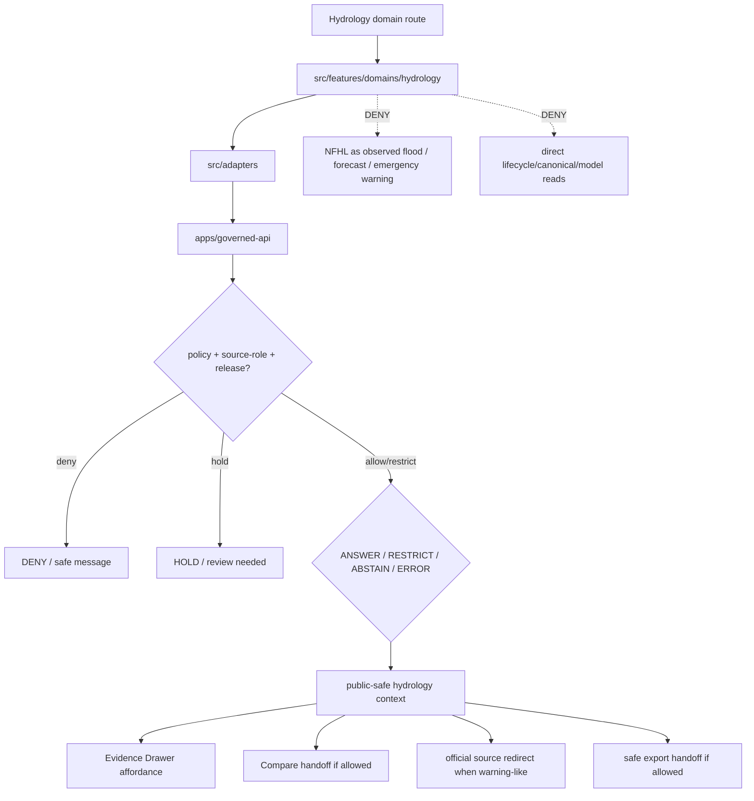

<!-- [KFM_META_BLOCK_V2]
doc_id: kfm://app/explorer-web/src/features/domains/hydrology/readme
title: Explorer Web Hydrology Domain Feature README
type: app-readme
version: v0.2
status: draft
owners: OWNER_TBD — Apps steward · UI steward · Hydrology steward · Governed API steward · Policy steward · Docs steward
created: 2026-06-16
updated: 2026-07-09
policy_label: public
related:
  - ../../README.md
  - ../../../README.md
  - ../../../adapters/README.md
  - ../../../../README.md
  - ../../../../../README.md
  - ../../../../../governed-api/README.md
  - ../../../../../../README.md
  - ../../../../../../SECURITY.md
  - ../../../../../../docs/domains/hydrology/README.md
  - ../../../../../../docs/domains/hydrology/PUBLICATION_POSTURE.md
  - ../../../../../../policy/domains/hydrology/README.md
  - ../../../../../../packages/ui/README.md
  - ../../../../../../packages/maplibre/README.md
  - ../../../../../../packages/cesium/README.md
  - ../../../../../../policy/access/README.md
  - ../../../../../../policy/decision/README.md
  - ../../../../../../release/README.md
  - ../../../../../../data/README.md
  - ../../../../../../tools/validators/README.md
  - ../../../../../../tools/watchers/README.md
tags: [kfm, apps, explorer-web, domains, hydrology, feature, watershed, huc, gauge, nfhl, not-for-life-safety, evidence-drawer, map-first, no-direct-data-root, flood-role-anti-collapse]
notes:
  - "v0.2 updates the uploaded Hydrology domain-feature README into a current repo-aware feature contract."
  - "apps/explorer-web/src/features/domains/hydrology/README.md, docs/domains/hydrology/README.md, docs/domains/hydrology/PUBLICATION_POSTURE.md, and policy/domains/hydrology/README.md were verified through the GitHub app in this update. Prior related Explorer Web feature/adapter/source/app boundaries remain relevant, but adapter files, routes, runtime wiring, tests, and envelopes remain NEEDS VERIFICATION."
  - "Feature implementation files, route wiring, domain-view inventory, tests, fixtures, governed API envelopes, NFHL role checks, ModelRunReceipts, RedactionReceipts, AggregationReceipts, ReviewRecords, PolicyDecisions, ReleaseManifests, RollbackCards, CorrectionNotices, stale-state rules, export handoff, Focus Mode behavior, Evidence Drawer behavior, package scripts, runtime behavior, and deployment behavior remain NEEDS VERIFICATION."
  - "Hydrology UI features may compose governed hydrology envelopes into public/semi-public views, but they must not become emergency flood-warning, observed-flood authority, FEMA/NFHL authority, regulatory determination, lifecycle storage, source truth, direct model-output truth, or a route around official issuing authorities."
  - "Public Hydrology UI must default to deny/hold/restrict when source role, time kind, NFHL role, model/observation distinction, freshness, evidence, release, stale-state, rollback, correction, policy, sensitivity, cross-lane ownership, or export support is unresolved."
[/KFM_META_BLOCK_V2] -->

<a id="top"></a>

<div align="center">

# Explorer Web Hydrology Domain Feature

`apps/explorer-web/src/features/domains/hydrology/`

**Domain-specific Explorer Web feature boundary for public-safe hydrology views: watersheds, HUCs, reaches, gauges, observations, groundwater, water quality, NFHL regulatory context, upstream traces, Evidence Drawer handoffs, Focus Mode answers, and release-aware map surfaces rendered only through governed envelopes.**


[Purpose](#1-purpose) · [Current evidence](#2-current-repo-evidence) · [Repo fit](#3-repo-fit) · [Boundary](#4-authority-boundary) · [Inputs](#6-inputs) · [Exclusions](#7-exclusions) · [Feature map](#8-hydrology-feature-map) · [Definition of done](#15-definition-of-done)

</div>

---

> [!IMPORTANT]
> **Status:** draft / current README surface confirmed / implementation behavior `NEEDS VERIFICATION`  
> **Owners:** `OWNER_TBD` — Apps steward · UI steward · Hydrology steward · Governed API steward · Policy steward · Docs steward  
> **Path:** `apps/explorer-web/src/features/domains/hydrology/README.md`  
> **Responsibility root:** `apps/` — deployable application surfaces  
> **Truth posture:** CONFIRMED README path and supporting Hydrology docs/policy README surfaces / PROPOSED domain-feature contract / UNKNOWN implementation files, route wiring, domain-view inventory, tests, fixtures, governed API envelopes, NFHL role checks, ModelRunReceipts, RedactionReceipts, AggregationReceipts, ReviewRecords, PolicyDecisions, ReleaseManifests, RollbackCards, CorrectionNotices, stale-state rules, export handoff, Focus Mode behavior, Evidence Drawer behavior, package scripts, runtime behavior, and deployment behavior

> [!CAUTION]
> Hydrology UI is not an emergency flood-warning system. It must never collapse observed gauge readings, regulatory NFHL zones, modeled hydrographs, hydraulic forecasts, and operational warnings into one truth class. NFHL is regulatory context only unless a governed source role and evidence path support a distinct claim.

---

## Quick jump

- [1. Purpose](#1-purpose)
- [2. Current repo evidence](#2-current-repo-evidence)
- [3. Repo fit](#3-repo-fit)
- [4. Authority boundary](#4-authority-boundary)
- [5. Default posture](#5-default-posture)
- [6. Inputs](#6-inputs)
- [7. Exclusions](#7-exclusions)
- [8. Hydrology feature map](#8-hydrology-feature-map)
- [9. Diagram](#9-diagram)
- [10. Hydrology UI obligations](#10-hydrology-ui-obligations)
- [11. Per-view contract](#11-per-view-contract)
- [12. Inspection path](#12-inspection-path)
- [13. Validation expectations](#13-validation-expectations)
- [14. Safe change pattern](#14-safe-change-pattern)
- [15. Definition of done](#15-definition-of-done)
- [16. Open verification items](#16-open-verification-items)

---

## 1. Purpose

`apps/explorer-web/src/features/domains/hydrology/` is the proposed app-local feature boundary for Hydrology-specific Explorer Web surfaces.

It may eventually hold route modules, panels, view models, hooks, and feature orchestration for public-safe hydrology experiences such as:

- watershed, HUC, reach, and hydro-feature map views;
- gauge, groundwater-well, hydrograph, and water-quality observation summaries;
- NFHL and flood-zone regulatory context that is visibly not observed inundation;
- upstream/downstream trace and hydrologic topology views;
- drought, irrigation, water-use, hydrostratigraphy, and hazard relation context while preserving other lane ownership;
- source-role, time-kind, NFHL, and model/observation anti-collapse messaging;
- Evidence Drawer handoffs that show governed, time-aware, role-typed payloads;
- Focus Mode bounded hydrology answers with citation discipline and AIReceipt support;
- compare/export handoffs that preserve source role, rights, freshness, release, stale-state, correction, supersession, and rollback state.

This directory is not proof that any route, panel, hook, map layer, adapter, test, fixture, package script, governed API envelope, NFHL role check, ModelRunReceipt, ReleaseManifest, RollbackCard, CorrectionNotice, stale-state rule, Evidence Drawer behavior, Focus Mode behavior, export handoff, or runtime wiring is implemented.

[Back to top](#top)

---

## 2. Current repo evidence

| Surface | Status | What it proves | What it does **not** prove |
|---|---|---|---|
| `apps/explorer-web/src/features/domains/hydrology/README.md` | **CONFIRMED README** | This README exists and has been updated to v0.2. | Hydrology UI implementation files, route wiring, domain-view inventory, tests, fixtures, governed API envelopes, NFHL checks, release manifests, rollback cards, export handoff, or runtime behavior. |
| `apps/explorer-web/src/features/README.md` | **CONFIRMED prior related boundary** | Parent feature README was previously verified in this session and says feature modules must not treat map features, tiles, local files, model text, or lifecycle data as claim truth. | That domain feature modules, route inventory, tests, fixtures, or runtime wiring exist. |
| `apps/explorer-web/src/adapters/README.md` | **CONFIRMED prior related boundary** | Adapter README was previously verified in this session as the governed API / renderer / evidence / layer / export / diagnostics adapter boundary. | That hydrology adapters or governed API client adapters are implemented. |
| `docs/domains/hydrology/README.md` | **CONFIRMED domain-doc surface** | Hydrology domain docs define Hydrology as evidence-bound/time-aware, not an emergency flood-warning system, and NFHL as regulatory context only. | That app UI behavior, schemas, validators, policy bundles, source descriptors, releases, or routes are implemented. |
| `docs/domains/hydrology/PUBLICATION_POSTURE.md` | **CONFIRMED publication-posture doc surface** | Hydrology publication docs define publish/hold/generalize/deny posture, release-proof requirements, and warn that repo paths/routes/schemas/validators remain PROPOSED or NEEDS VERIFICATION unless confirmed. | That executable policy, route enforcement, fixtures, tests, CI binding, release gate, or runtime checks exist. |
| `policy/domains/hydrology/README.md` | **CONFIRMED policy-lane scaffold** | Hydrology policy-lane README exists. | It is still a greenfield scaffold and does not prove concrete policy files, tests, fixtures, CI binding, release integration, or runtime enforcement. |
| `apps/explorer-web/src/features/domains/README.md` | **NOT VERIFIED** | A parent domain-feature README was not confirmed in this update. | Does not prove absence across all refs; a future index remains useful if accepted. |
| Uploaded Hydrology Markdown | **CONFIRMED source text for this update** | Provided the base Hydrology domain-feature contract updated here. | Does not prove live implementation. |
| Implementation beyond README | **NEEDS VERIFICATION** | Checkable by repo scan, route inventory, fixtures, tests, package scripts, governed API envelopes, receipts, release records, and runtime evidence. | Not claimed by this README. |

[Back to top](#top)

---

## 3. Repo fit

| Concern | Owning root | Expected relationship |
|---|---|---|
| Hydrology domain feature source | `apps/explorer-web/src/features/domains/hydrology/` | App-local Hydrology UI feature modules, if implemented and tested. |
| Feature boundary | `apps/explorer-web/src/features/` | Parent feature/root contract. |
| Domain-feature parent index | `apps/explorer-web/src/features/domains/` | **NEEDS VERIFICATION**; parent README was not confirmed in this update. |
| Adapter boundary | `apps/explorer-web/src/adapters/` | Governed API, evidence, layer, map, export, and diagnostics adapters. |
| Explorer Web source tree | `apps/explorer-web/src/` | Parent source-layout boundary. |
| Explorer Web app | `apps/explorer-web/` | Map-first public/semi-public shell. |
| Governed API | `apps/governed-api/` | Trust membrane and normal claim-bearing data path. |
| Hydrology doctrine | `docs/domains/hydrology/` | Domain scope, source roles, NFHL posture, publication, path conflicts, and verification backlog. |
| Hydrology policy | `policy/domains/hydrology/` | Hydrology admissibility and exposure policy lane, if executable wiring is accepted. |
| Hazards / Atmosphere / Geology / Soil / Agriculture lanes | domain docs and policy lanes | Canonical truth owners for cross-lane source material; Hydrology consumes bounded context. |
| Shared UI components | `packages/ui/` | Reusable cards, badges, drawers, panels, hydrograph widgets, and legends when shared. |
| Renderer wrappers | `packages/maplibre/`, `packages/cesium/` | Renderer behavior stays behind adapter/wrapper boundaries. |
| Release authority | `release/` | Publication, correction, supersession, rollback control. |
| Lifecycle artifacts | `data/` | Receipts, proofs, registry, catalog, triplets, and published artifacts. |
| Security posture | `SECURITY.md`, `docs/security/` | Secrets, sensitive-output, incident, exposure, and audit posture. |

[Back to top](#top)

---

## 4. Authority boundary

This feature renders governed Hydrology UI. It does not own emergency alerts, life-safety instructions, observed flood authority, FEMA/NFHL regulatory authority, hydraulic model authority, source admission, source rights, schemas, contracts, lifecycle artifacts, release decisions, evidence truth, renderer authority, hydrologic canonical stores, official-source truth, or AI output.

```text
apps/explorer-web/src/features/domains/hydrology/ = app-local Hydrology UI feature
apps/explorer-web/src/features/                  = feature boundary
apps/explorer-web/src/adapters/                  = adapter boundary
apps/explorer-web/src/                           = Explorer Web implementation source
apps/explorer-web/                               = map-first public/semi-public app boundary
apps/governed-api/                               = trust membrane and normal data path
docs/domains/hydrology/                          = Hydrology doctrine and publication posture
policy/domains/hydrology/                        = Hydrology domain policy lane
packages/ui/                                     = shared UI primitives
packages/maplibre/                               = renderer wrapper
packages/cesium/                                 = optional gated renderer wrapper
policy/                                          = finite policy decisions
schemas/                                         = machine-readable shape
contracts/                                       = object meaning
data/                                            = lifecycle artifacts, receipts, proofs, registries
release/                                         = publication, correction, rollback authority
```

Safe interpretation:

- **CONFIRMED:** this README surface, Hydrology domain README, Hydrology publication-posture doc, and Hydrology policy-lane scaffold exist.
- **PROPOSED:** Hydrology feature modules may live here when they preserve governed API, source-role, time-kind, NFHL/flood-role anti-collapse, model/observation distinction, evidence, sensitivity, rights, stale-state, review, release, rollback, correction, export, and public-boundary constraints.
- **NEEDS VERIFICATION:** Hydrology modules, route wiring, domain-view inventory, adapter dependencies, fixtures, tests, package scripts, governed API envelopes, NFHL role checks, ModelRunReceipts, RedactionReceipts, AggregationReceipts, ReviewRecords, PolicyDecisions, ReleaseManifests, RollbackCards, CorrectionNotices, stale-state rules, export handoff, Evidence Drawer behavior, Focus Mode behavior, runtime behavior, and deployment behavior.
- **DENY:** using this feature as emergency flood-warning, life-safety instruction, observed-flood authority, FEMA/NFHL authority, regulatory determination, Hydrology truth, policy authority, release authority, lifecycle store, schema/contract home, direct canonical/internal store client, direct model-output surface, renderer authority, export authority, or public-data shortcut.

[Back to top](#top)

---

## 5. Default posture

Hydrology feature modules should fail closed, preserve source-role and time-kind labels, keep regulatory, observed, modeled, and operational contexts distinct, and redirect emergency action to official sources.

A view should not render claim-bearing hydrology content when any of these are unresolved:

- governed API envelope and response validation;
- object family or hydrology domain slug;
- source role, provenance, and official source identity;
- rights or license posture;
- observation time, valid time, retrieval time, release time, correction time, freshness, or stale-state posture;
- NFHL regulatory-context label and non-observed-flood distinction;
- modeled hydrograph `ModelRunReceipt` or model/observation distinction;
- emergency/life-safety boundary and official-source redirect;
- EvidenceRef or EvidenceBundle support;
- PolicyDecision, ReleaseManifest, RollbackCard, CorrectionNotice, or stale-state rule;
- sensitivity, aggregation, redaction, private-property, infrastructure, or cross-lane exposure posture;
- public audience or export destination.

[Back to top](#top)

---

## 6. Inputs

| Input family | Examples | Required posture |
|---|---|---|
| Hydrology view state | watershed, HUC, reach, gauge, groundwater well, hydrograph, water quality, NFHL, upstream trace, domain Focus Mode | Explicit finite states. |
| API envelope | answer, abstain, deny, error, hold, restricted, decision envelope, evidence payload | Runtime-validated before render. |
| Boundary state | not emergency warning, NFHL regulatory context, observed/model/regulatory distinction | Required for flood and operational contexts. |
| Layer state | layer manifest, source role, legend, trust badges, valid/effective time, selected feature id | Released or bounded-safe source only. |
| Evidence state | EvidenceRef, EvidenceBundle summary, citation validation, proof visibility | Required for claim-bearing detail. |
| Transform state | aggregation, redaction, private-property suppression, stale-state label | Required when reducing exposure risk. |
| Cross-lane state | hazards, atmosphere, geology, soil, agriculture, infrastructure, people/land joins | Inherits strictest lane posture. |
| Release/correction state | release ref, rollback target, correction notice, stale-state, supersession, withdrawal | Required for public-facing claim and export support. |
| Export state | selected public-safe layer, bounds, citations, disclaimer, release state, output mode | Governed export only. |
| Focus Mode state | prompt class, finite outcome, evidence handles, policy result | No direct model output as hydrology truth or safety instruction. |

[Back to top](#top)

---

## 7. Exclusions

| Does not belong here | Correct home |
|---|---|
| Hydrology doctrine and publication posture | `docs/domains/hydrology/` |
| Hydrology policy bundles or release-gate decisions | `policy/domains/hydrology/`, `policy/` |
| Emergency alerting, flood warning issuance, or life-safety instructions | Official issuing authorities / Hazards lane context, never Explorer Web Hydrology UI. |
| FEMA/NFHL regulatory authority | FEMA/NFHL source authority; Hydrology UI may render version-pinned regulatory context only. |
| Observed inundation, flood forecast, or hydraulic-model truth | Owning source/model lane and governed API context only; never inferred from NFHL. |
| Geology, soil, agriculture, hazards, atmosphere, infrastructure, or people/land canonical truth | Owning domain lanes; Hydrology may consume governed relation context. |
| Governed API implementation | `apps/governed-api/` |
| Adapter logic shared across feature families | `apps/explorer-web/src/adapters/` |
| Shared reusable UI primitives | `packages/ui/` |
| Renderer wrapper authority | `packages/maplibre/`, `packages/cesium/` |
| Hydrology schemas and contracts | `schemas/contracts/v1/domains/hydrology/`, `contracts/domains/hydrology/` — path form remains `NEEDS VERIFICATION` |
| Lifecycle artifacts, receipts, proofs, catalog, triplets | `data/` |
| Release manifests, rollback cards, correction notices | `release/` |
| Source acquisition or source registry records | `connectors/`, `data/registry/`, source catalog lanes. |
| Direct RAW / WORK / QUARANTINE / PROCESSED / CATALOG / TRIPLET / PUBLISHED reads | governed API, released artifacts, layer manifests, and bounded public-safe envelopes only. |
| Direct model runtime behavior | `runtime/` behind governed API only. |
| Secrets, credentials, tokens, private keys, private-property details, official-source credentials, internal warning feed state | secret manager / deployment environment, not UI feature source or examples. |
| Public-sensitive exports, exact restricted locations, living-person/DNA details, source-restricted records, prompt/model traces, life-safety instructions | denied unless separately governed and public-safe; life-safety instruction is always denied. |

[Back to top](#top)

---

## 8. Hydrology feature map

Exact modules remain `NEEDS VERIFICATION`. Candidate views should be introduced only with route inventory, fixtures, governed API envelopes, NFHL/flood-role checks, release manifests, rollback cards, and tests.

| Candidate view | Purpose | Required safeguard | Status |
|---|---|---|---|
| `watersheds` | Show watershed/HUC context. | Source role, identity, release state. | PROPOSED |
| `reaches` | Show stream/river identity and reach topology. | Evidence and topology labels. | PROPOSED |
| `gauges` | Show gauge/well observation sites. | Observation/source/time labels. | PROPOSED |
| `hydrographs` | Show flow or water-level time series. | Observed vs modeled distinction and freshness. | PROPOSED |
| `water-quality` | Show water-quality observation context. | Parameter, method, unit, and evidence labels. | PROPOSED |
| `nfhl-context` | Show flood-zone regulatory context. | NFHL is not observed inundation or forecast. | PROPOSED |
| `upstream-trace` | Show hydrologic topology and upstream/downstream relation. | Topology evidence and uncertainty visible. | PROPOSED |
| `groundwater-context` | Show groundwater-well or aquifer observation context. | Private-property and source-role checks. | PROPOSED |
| `model-context` | Show model-derived hydrology context. | ModelRunReceipt and model/observation separation. | PROPOSED |
| `sensitive-denial` | Explain why exact/private/sensitive detail is unavailable. | Safe reason code; no exposure hints. | PROPOSED |
| `domain-focus` | Hydrology Focus Mode UI. | Finite outcomes; no emergency instruction. | PROPOSED |
| `domain-evidence` | Evidence Drawer handoff. | Audience-appropriate payload only. | PROPOSED |
| `domain-export` | Hydrology export handoff. | Citation, disclaimer, rights, release checks. | PROPOSED |
| `domain-compare` | Hydrology compare handoff. | Source role, time-kind, NFHL posture, release, and freshness preserved. | PROPOSED |
| `correction-status` | Public-safe stale/supersession/correction/rollback status. | Release/correction/rollback refs only; no flood-warning instruction. | PROPOSED |

> [!WARNING]
> Candidate view names are not implementation proof. Do not document a view as runnable until files, route wiring, tests, fixtures, package scripts, NFHL role checks, release manifests, rollback cards, and governed API envelopes confirm it.

[Back to top](#top)

---

## 9. Diagram



[Back to top](#top)

---

## 10. Hydrology UI obligations

| Obligation | Example effect |
|---|---|
| `governed_api_only` | Hydrology feature state comes through governed API envelopes. |
| `not_emergency_warning` | Warning-like or flood-safety content redirects to official sources. |
| `nfhl_context_only` | NFHL is regulatory context and is never presented as observed inundation or forecast. |
| `source_role_preserved` | Observed, regulatory, modeled, aggregate, administrative, candidate, and synthetic roles remain distinct. |
| `time_kind_visible` | Observation, valid, retrieval, release, correction, freshness, expiry, and stale states remain visible where material. |
| `model_not_observation` | Modeled hydrographs keep `ModelRunReceipt` and are not relabeled observations. |
| `evidence_required` | Claim-bearing details link to EvidenceBundle-derived payloads. |
| `official_redirect_required` | Emergency action is redirected to official issuing authorities. |
| `finite_states_required` | Views render answer, restrict, abstain, deny, error, hold, loading, stale, expired, corrected, rollback, and empty states safely. |
| `safe_compare_required` | Compare handoff preserves source role, time-kind, NFHL posture, freshness, release, stale-state, and disclaimer posture. |
| `safe_export_required` | Export handoff preserves citations, disclaimers, freshness, rights, release, correction, and rollback constraints. |
| `no_authority_fork` | Feature code does not redefine Hydrology policy, schema, contract, source, release, flood authority, or evidence logic. |
| `no_data_root_shortcut` | Feature code does not read lifecycle data roots, canonical/internal stores, local source files, or model output as claim sources. |
| `local_parity_preferred` | Hydrology fixtures/tests should be runnable locally and in CI with the same inputs where practical. |

[Back to top](#top)

---

## 11. Per-view contract

Every long-lived Hydrology domain view should document or encode:

- view purpose and route ownership;
- hydrology object families and source families consumed;
- governed API envelope or adapter dependency;
- source-role, temporal-role, freshness, stale-state, and valid-time behavior;
- NFHL/regulatory context disclaimer and non-observed-flood behavior;
- model/observation distinction and ModelRunReceipt handling;
- sensitivity, redaction, aggregation, private-property, infrastructure, and cross-lane inheritance behavior;
- review, policy-decision, release, correction, supersession, withdrawal, and rollback behavior;
- expected finite outcomes;
- evidence/citation display behavior;
- loading, empty, deny, abstain, error, hold, restricted, stale, expired, corrected, and rollback states;
- direct lifecycle/canonical/model-output denial posture;
- compare, Focus Mode, Evidence Drawer, or export behavior, if any;
- tests and fixtures proving trust-membrane and flood-role anti-collapse boundaries.

[Back to top](#top)

---

## 12. Inspection path

Hydrology feature implementation files, route wiring, tests, fixtures, governed API envelopes, boundary disclaimers, review records, release manifests, rollback cards, stale-state rules, package scripts, and export handoff remain `NEEDS VERIFICATION`.

```bash
find apps/explorer-web/src/features/domains/hydrology -maxdepth 5 -type f | sort
find apps/explorer-web/src apps/governed-api docs/domains/hydrology policy/domains/hydrology packages/ui packages/maplibre tests fixtures -maxdepth 6 -type f 2>/dev/null | grep -Ei 'hydrology|watershed|huc|reach|gauge|well|flow|water|quality|aquifer|hydrograph|nfhl|flood|upstream|evidence|release|rollback|governed' | sort
find data/raw data/work data/quarantine data/processed data/catalog data/triplets data/published data/receipts data/proofs -maxdepth 2 -type f 2>/dev/null | sort
```

[Back to top](#top)

---

## 13. Validation expectations

Useful validation for this feature boundary should cover:

- no Hydrology feature imports or reads lifecycle data roots directly;
- claim-bearing Hydrology views consume governed API envelopes only;
- malformed Hydrology envelopes render safe error or abstain states;
- NFHL flood zones never render as observed flood extent, emergency warning, hydraulic forecast, or current safety instruction;
- observed gauge readings, regulatory NFHL zones, modeled hydrographs, hydraulic forecasts, and operational warnings remain distinct;
- modeled reconstructions preserve `ModelRunReceipt` and model/observation distinction;
- public outputs preserve source role, time-kind, rights, release, stale-state, citation, review, and transform metadata;
- denial messages do not leak private-property details, sensitive infrastructure, transform parameters, or reconstruction hints;
- cross-lane sensitive joins inherit the strictest lane posture;
- Evidence Drawer handoff preserves EvidenceRef/EvidenceBundle handles without exposing protected content;
- Focus Mode renders finite outcomes and never direct model output as hydrology truth or safety instruction;
- compare and export handoffs require citation, disclaimer, freshness, rights, release, correction, and rollback support;
- UI output does not expose secrets, exact restricted locations, infrastructure details, source-restricted records, private data, prompt/model traces, or life-safety instructions.

[Back to top](#top)

---

## 14. Safe change pattern

For Hydrology feature changes:

1. Add or update route inventory and per-view contract.
2. Add fixtures for open, regulatory, observed, modeled, generalized, restricted, denied, held, abstained, malformed, loading, stale, corrected, rolled-back, and empty states.
3. Test lifecycle-data denial and governed API-only behavior.
4. Preserve source role, time-kind, NFHL context, model/observation distinction, review, release, rollback, rights, and citation fields through UI state.
5. Verify NFHL, observed inundation, hydraulic forecast, modeled hydrograph, and emergency-warning states cannot collapse into one truth class.
6. Verify compare, export, Focus Mode, and Evidence Drawer handoffs cannot bypass policy, official-source posture, source-role discipline, release, correction, stale-state, or rollback checks.
7. Update this README, parent `features/README.md`, adapter README, hydrology docs, policy README, and parent app README when public behavior changes.

[Back to top](#top)

---

## 15. Definition of done

- [ ] Owners are confirmed and `OWNER_TBD` is replaced.
- [ ] Hydrology feature file inventory and route ownership are documented.
- [ ] Governed API and adapter dependencies are explicit.
- [ ] NFHL/regulatory-context, observed/model distinction, source-role, time-kind, stale-state, release, and rollback states are represented in UI fixtures.
- [ ] Flood-role anti-collapse states are tested.
- [ ] Direct lifecycle-data import/read checks are covered.
- [ ] Emergency/life-safety denial states are tested.
- [ ] Official-source redirect behavior is tested.
- [ ] Cross-lane sensitivity inheritance is tested.
- [ ] Finite states cover answer, restrict, abstain, deny, error, hold, loading, stale, expired, corrected, rollback, and empty cases.
- [ ] Evidence Drawer, Focus Mode, Compare, and Export handoffs are tested for safe output if present.
- [ ] Parent feature/adapter/source/app READMEs and Hydrology docs/policy surfaces are updated when public behavior changes.

[Back to top](#top)

---

## 16. Open verification items

| Item | Why it matters |
|---|---|
| Confirm Hydrology feature implementation files beyond README | Prevents overclaiming feature maturity. |
| Confirm route inventory | Required for public/semi-public UI boundary review. |
| Confirm governed API Hydrology envelopes | Required for trust membrane enforcement. |
| Confirm NFHL/flood-role anti-collapse fixtures | Required before flood-context UI claims. |
| Confirm source-role and time-kind rendering | Required before claim-bearing Hydrology UI claims. |
| Confirm ModelRunReceipt handling | Required before modeled hydrograph UI claims. |
| Confirm release, correction, stale-state, supersession, withdrawal, and rollback states | Required before public map-layer claims. |
| Confirm release manifest and rollback-card linkage | Required before publication-support claims. |
| Confirm fixtures and tests | Required before implementation claims. |
| Confirm Focus Mode and Evidence Drawer behavior | Required before claim-bearing Hydrology UI claims. |
| Confirm Compare handoff | Required before visual-difference claims. |
| Confirm export handoff | Required before public download workflows. |
| Confirm direct data-root denial | Required for public client trust membrane. |
| Confirm executable Hydrology policy binding | Required before enforcement claims. |
| Confirm path-form decision for segment-vs-flat Hydrology schema/contract homes | Prevents silent path drift. |
| Confirm package scripts beyond TODO | Required before build/test claims. |

<details>
<summary>Appendix A — no-loss preservation note</summary>

The uploaded README replaced a greenfield Hydrology domain-feature stub with a bounded Hydrology feature contract without claiming Hydrology routes, panels, hooks, adapters, fixtures, tests, package scripts, governed API envelopes, NFHL role checks, ModelRunReceipts, ReleaseManifests, RollbackCards, Focus Mode, Evidence Drawer, Compare, or export handoff are implemented. This v0.2 update preserves that structure while adding current repo evidence, supporting Hydrology docs/policy evidence, stronger no-direct-data-root language, NFHL/flood-role anti-collapse posture, source-role/time-kind posture, model/observation separation, release/correction/rollback posture, compare/export handoff posture, local-parity expectations, and expanded verification items.

</details>

## Status summary

`apps/explorer-web/src/features/domains/hydrology/` should contain Hydrology-specific Explorer Web feature modules only after route contracts, governed API envelopes, NFHL/flood-role posture, fixtures, tests, Evidence Drawer behavior, Focus Mode behavior, Compare behavior, release/stale/rollback handling, and export handoff are verified.

It must preserve the trust membrane and Hydrology boundary: the feature may show watersheds, HUCs, reaches, gauges, observations, hydrographs, water quality, groundwater, NFHL regulatory context, and upstream traces, but it must not become emergency warning, observed-flood authority, NFHL regulatory authority, release authority, lifecycle storage, direct model-output truth, or a source of unsupported hydrology claims.

<p align="right"><a href="#top">Back to top</a></p>
