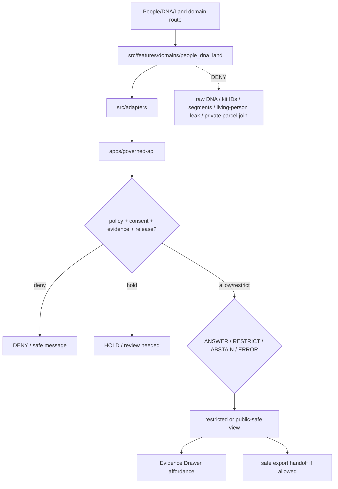

<!-- [KFM_META_BLOCK_V2]
doc_id: kfm://app/explorer-web/src/features/domains/people_dna_land/readme
title: Explorer Web People DNA Land Domain Feature README
type: app-readme
version: v0.1
status: draft
owners: OWNER_TBD — Apps steward · UI steward · People-DNA-Land steward · Consent steward · Sensitivity reviewer · Governed API steward · Policy steward · Docs steward
created: 2026-06-16
updated: 2026-06-16
policy_label: restricted
related:
  - ../../README.md
  - ../../../README.md
  - ../../../adapters/README.md
  - ../../../../README.md
  - ../../../../../README.md
  - ../../../../../governed-api/README.md
  - ../../../../../../docs/domains/people-dna-land/README.md
  - ../../../../../../docs/domains/people-dna-land/SENSITIVITY.md
  - ../../../../../../policy/consent/people-dna-land/README.md
  - ../../../../../../policy/domains/people-dna-land/README.md
  - ../../../../../../packages/ui/README.md
  - ../../../../../../packages/maplibre/README.md
  - ../../../../../../policy/access/README.md
  - ../../../../../../policy/decision/README.md
  - ../../../../../../release/README.md
  - ../../../../../../data/README.md
tags: [kfm, apps, explorer-web, domains, people-dna-land, people, genealogy, dna, land-ownership, consent, restricted-domain, feature]
notes:
  - "Replaces the greenfield people-dna-land domain feature stub with a governed feature README."
  - "This app path uses the requested underscore directory `people_dna_land`; governing docs use the domain segment `people-dna-land` and carry an unresolved short-segment conflict for some roots. This README does not resolve that ADR-level naming conflict."
  - "People/DNA/Land UI features may compose governed envelopes into restricted or public-safe views, but they must not expose living-person fields, raw DNA, kit IDs, segment data, person-parcel joins, title assertions, or parcel-boundary claims without consent, policy, review, evidence, release, correction, and rollback support."
  - "Feature implementation files, route wiring, tests, fixtures, governed API envelopes, ConsentDecision receipts, ReviewRecords, PolicyDecisions, ReleaseManifests, and package scripts remain NEEDS VERIFICATION."
[/KFM_META_BLOCK_V2] -->

<a id="top"></a>

<div align="center">

# Explorer Web People DNA Land Domain Feature

`apps/explorer-web/src/features/domains/people_dna_land/`

**Domain-specific Explorer Web feature boundary for restricted People, Genealogy, DNA, and Land Ownership views: assertion-first people records, genealogy relationships, consent-bound DNA summaries, land instruments, ownership intervals, chain-of-title context, Evidence Drawer handoffs, Focus Mode answers, and release-aware map surfaces rendered only through governed envelopes.**


[Purpose](#1-purpose) · [Repo fit](#2-repo-fit) · [Boundary](#3-authority-boundary) · [Inputs](#5-inputs) · [Exclusions](#6-exclusions) · [Feature map](#7-people-dna-land-feature-map) · [Definition of done](#14-definition-of-done)

</div>

---

> [!IMPORTANT]
> **Status:** draft / `NEEDS VERIFICATION`  
> **Owners:** `OWNER_TBD` — Apps steward · UI steward · People-DNA-Land steward · Consent steward · Sensitivity reviewer · Governed API steward · Policy steward · Docs steward  
> **Path:** `apps/explorer-web/src/features/domains/people_dna_land/README.md`  
> **Responsibility root:** `apps/` — deployable application surfaces  
> **Truth posture:** CONFIRMED README path / CONFIRMED People-DNA-Land doctrine and consent docs / PROPOSED domain-feature contract / UNKNOWN implementation files, route wiring, tests, fixtures, and runtime behavior

> [!CAUTION]
> People/DNA/Land is the most restricted Explorer Web domain feature lane. Living-person fields, raw DNA, kit IDs, segment data, DNA-derived hypotheses, private person-parcel joins, title assertions, and parcel-boundary claims must fail closed unless every required evidence, consent, policy, review, release, correction, and rollback gate is satisfied.

---

## Quick jump

- [1. Purpose](#1-purpose)
- [2. Repo fit](#2-repo-fit)
- [3. Authority boundary](#3-authority-boundary)
- [4. Default posture](#4-default-posture)
- [5. Inputs](#5-inputs)
- [6. Exclusions](#6-exclusions)
- [7. People-DNA-Land feature map](#7-people-dna-land-feature-map)
- [8. Diagram](#8-diagram)
- [9. People-DNA-Land UI obligations](#9-people-dna-land-ui-obligations)
- [10. Per-view contract](#10-per-view-contract)
- [11. Inspection path](#11-inspection-path)
- [12. Validation expectations](#12-validation-expectations)
- [13. Safe change pattern](#13-safe-change-pattern)
- [14. Definition of done](#14-definition-of-done)
- [15. Open verification items](#15-open-verification-items)

---

## 1. Purpose

`apps/explorer-web/src/features/domains/people_dna_land/` is the proposed app-local feature boundary for People, Genealogy, DNA, and Land Ownership Explorer Web surfaces.

It may eventually hold route modules, panels, view models, hooks, and feature orchestration for restricted or public-safe experiences such as:

- assertion-first person and genealogy evidence views;
- consent-bound relationship, lineage, and residence-event summaries;
- DNA-derived aggregate or k-anonymized views only, never raw vendor/segment material;
- land instrument, ownership interval, and chain-of-title context;
- assessor, tax, and parcel context that is visibly not title or boundary proof;
- private person-parcel join denial, restriction, or review-state messaging;
- Evidence Drawer handoffs that show governed, consent-aware, audience-appropriate payloads;
- Focus Mode bounded People/DNA/Land answers with citation discipline and AIReceipt support;
- compare/export handoffs that preserve consent, sensitivity, rights, release, revocation, correction, tombstone, and rollback state.

This directory is not proof that any route, panel, hook, map layer, adapter, test, fixture, package script, or governed API envelope is implemented.

[Back to top](#top)

---

## 2. Repo fit

| Concern | Owning root | Expected relationship |
|---|---|---|
| People/DNA/Land domain feature source | `apps/explorer-web/src/features/domains/people_dna_land/` | App-local UI feature modules, if implemented and tested |
| Feature boundary | `apps/explorer-web/src/features/` | Parent feature/root contract |
| Adapter boundary | `apps/explorer-web/src/adapters/` | Governed API, evidence, layer, map, export, and diagnostics adapters |
| Explorer Web app | `apps/explorer-web/` | Map-first public/semi-public shell; restricted surfaces require policy/audience controls |
| Governed API | `apps/governed-api/` | Trust membrane and normal data path |
| Domain doctrine | `docs/domains/people-dna-land/` | Domain scope, consent, sensitivity, people model, land ownership posture, and verification backlog |
| Consent policy | `policy/consent/people-dna-land/` | Domain consent lane, if accepted by placement ADR |
| Domain policy | `policy/domains/people-dna-land/` | Domain admissibility and exposure policy, if executable wiring is accepted |
| Shared UI components | `packages/ui/` | Reusable cards, badges, drawers, panels, warnings, and legends when shared |
| Renderer wrappers | `packages/maplibre/`, `packages/cesium/` | Renderer behavior stays behind adapter/wrapper boundaries |
| Release authority | `release/` | Publication, correction, supersession, rollback control |
| Lifecycle artifacts | `data/` | Receipts, proofs, registry, catalog, triplets, and published artifacts |

## 3. Authority boundary

This feature renders governed People/DNA/Land UI. It does not own identity truth, DNA truth, title truth, boundary proof, consent policy, sensitivity policy, schemas, contracts, lifecycle artifacts, release decisions, evidence truth, renderer authority, source admission, or AI output.

```text
apps/explorer-web/src/features/domains/people_dna_land/ = app-local People/DNA/Land UI feature
apps/explorer-web/src/features/                        = feature boundary
apps/explorer-web/src/adapters/                        = adapter boundary
apps/governed-api/                                     = trust membrane and normal data path
docs/domains/people-dna-land/                          = People/DNA/Land doctrine and boundary posture
policy/consent/people-dna-land/                        = proposed domain consent lane
policy/domains/people-dna-land/                        = domain policy lane
packages/ui/                                           = shared UI primitives
policy/                                                = finite policy decisions
data/                                                  = lifecycle artifacts, receipts, proofs, registries
release/                                               = publication, correction, rollback authority
```

## 4. Default posture

People/DNA/Land feature modules should fail closed, hide sensitive detail by default, preserve assertion-first language, and require consent and policy gates before any person-linked, DNA-derived, or land-linked person claim is materialized.

A view should not render claim-bearing People/DNA/Land content when any of these are unresolved:

- governed API envelope and response validation;
- object family or domain slug;
- living-person, deceased-person, DNA, genealogy, land-instrument, ownership-interval, parcel, or title-claim posture;
- consent grant, purpose, audience, retention, revocation, or subject binding;
- source role, provenance, and evidence support;
- rights or license posture;
- EvidenceRef or EvidenceBundle support;
- PolicyDecision, ConsentDecision, ReviewRecord, ReleaseManifest, RollbackCard, CorrectionNotice, tombstone, or revocation receipt;
- person-parcel join, private-land, assessor/tax, title, boundary, or legal-description exposure risk;
- public audience or export destination.

## 5. Inputs

| Input family | Examples | Required posture |
|---|---|---|
| People view state | person assertion, name assertion, life event, residence event, migration event, relationship hypothesis, family group | Assertion-first; never uncited identity truth |
| DNA view state | DNA match evidence, kit token, segment, triangulation, derived hypothesis | Aggregate/k-anonymized or restricted only; raw public render denied |
| Land view state | land instrument, deed, title, ownership assertion, ownership interval, parcel, assessor/tax context | Not title/boundary truth without governing evidence and review |
| API envelope | answer, abstain, deny, error, hold, restricted, decision envelope, evidence payload | Runtime-validated before render |
| Consent state | consent grant, subject binding, purpose, audience, retention, revocation, dispute | Required when person/DNA/relationship/land-linked claims materialize |
| Evidence state | EvidenceRef, EvidenceBundle summary, citation validation, proof visibility | Required for claim-bearing detail |
| Transform state | aggregation, k-anonymity, redaction, tombstone, suppression, embargo, cache invalidation | Required when reducing exposure risk |
| Cross-lane state | settlements, roads, archaeology, agriculture, frontier matrix, spatial foundation, hazards, hydrology, soil joins | Context only; inherits strictest lane posture |
| Export state | selected payload, citations, consent scope, redaction profile, release state, output mode | Governed export only |

## 6. Exclusions

| Does not belong here | Correct home |
|---|---|
| People/DNA/Land doctrine and scope | `docs/domains/people-dna-land/` |
| Consent policy bundles or consent decisions | `policy/consent/people-dna-land/`, `policy/consent/`, `policy/` |
| Sensitivity and exposure policy | `policy/sensitivity/<segment>/`, `policy/domains/people-dna-land/`, `policy/` — segment conflict remains open |
| Governed API implementation | `apps/governed-api/` |
| Adapter logic shared across feature families | `apps/explorer-web/src/adapters/` |
| Shared reusable UI primitives | `packages/ui/` |
| Renderer wrapper authority | `packages/maplibre/`, `packages/cesium/` |
| Schemas and contracts | `schemas/contracts/v1/<segment>/`, `contracts/<segment>/` — segment name remains CONFLICTED |
| Lifecycle artifacts, receipts, proofs, catalog, triplets | `data/` |
| Release manifests, rollback cards, correction notices | `release/` |
| Raw DNA, kit IDs, segment data, vendor exports, or triangulation outputs | Denied from public UI; restricted lifecycle/policy-controlled context only |
| Unreviewed living-person fields or private person-parcel joins | Denied, held, or restricted unless consent/policy/review/release support exists |
| Title, parcel-boundary, legal ownership, or regulatory authority | Source and legal authorities; UI renders only governed, evidence-bound context |
| Source acquisition or source registry records | `connectors/`, `data/registry/`, source catalog lanes |
| Direct model runtime behavior | `runtime/` behind governed API only |
| Secrets, credentials, tokens, private keys | Secret manager / deployment environment |

## 7. People-DNA-Land feature map

Exact modules remain `NEEDS VERIFICATION`. Candidate views should be introduced only with route inventory, fixtures, and tests.

| Candidate view | Purpose | Required safeguard | Status |
|---|---|---|---|
| `person-assertions` | Show assertion-first person evidence | EvidenceBundle, source role, living-person gate | PROPOSED |
| `genealogy-context` | Show relationship and family-group context | Hypothesis labels, citations, review state | PROPOSED |
| `dna-summary` | Show aggregate/k-anonymized DNA-derived context | Consent, k-anonymity, no raw segment render | PROPOSED |
| `land-instruments` | Show deed/title instrument context | Source role and title-boundary disclaimers | PROPOSED |
| `ownership-intervals` | Show evidence-bound ownership intervals | Valid time, instrument evidence, review state | PROPOSED |
| `parcel-context` | Show parcel and assessor/tax context | Geometry is not boundary/title proof | PROPOSED |
| `consent-denial` | Explain denied/held/restricted person or DNA request | Safe reason code; no exposure hints | PROPOSED |
| `domain-focus` | People/DNA/Land Focus Mode UI | Finite outcomes; no direct model truth or protected detail | PROPOSED |
| `domain-evidence` | Evidence Drawer handoff | Redacted/audience-appropriate payload only | PROPOSED |
| `domain-export` | Domain export handoff | Consent, citation, redaction, rights, release checks | PROPOSED |

> [!WARNING]
> Candidate view names are not implementation proof. Do not document a view as runnable until files, route wiring, tests, fixtures, package scripts, governed API envelopes, consent gates, and policy decisions confirm it.

## 8. Diagram



## 9. People-DNA-Land UI obligations

| Obligation | Example effect |
|---|---|
| `governed_api_only` | Feature state comes through governed API envelopes |
| `assertion_first` | Person, relationship, and land claims render as evidence-bound assertions, not uncited facts |
| `consent_required` | Living-person, DNA, relationship, derivative, and land-linked person materialization requires scoped consent where applicable |
| `revocation_honored` | Revocation triggers tombstone/downstream cleanup/cache invalidation posture in UI state |
| `raw_dna_denied` | Raw kit IDs, segment data, vendor exports, and triangulation outputs do not render publicly |
| `parcel_not_title` | Assessor/tax/parcel geometry is not displayed as title or boundary proof |
| `evidence_required` | Claim-bearing details link to EvidenceBundle-derived payloads |
| `no_exposure_hints` | Denial messages do not reveal private relation, DNA, parcel, or consent state detail |
| `safe_export_required` | Export handoff preserves consent, citations, redaction, rights, review, release, correction, and rollback constraints |
| `no_authority_fork` | Feature code does not redefine identity, DNA, land-title, consent, policy, schema, contract, release, or evidence logic |

## 10. Per-view contract

Every long-lived People/DNA/Land domain view should document or encode:

- view purpose and route ownership;
- object families and source families consumed;
- governed API envelope or adapter dependency;
- assertion-first language and source-role behavior;
- consent, purpose, audience, retention, revocation, and dispute behavior;
- living-person, DNA, private-parcel, land-title, assessor/tax, and parcel-boundary exposure behavior;
- release, stale-state, correction, supersession, tombstone, and rollback behavior;
- expected finite outcomes;
- evidence/citation display behavior;
- loading, empty, deny, abstain, error, hold, restricted, revoked, tombstoned, stale, and expired states;
- export behavior, if any;
- tests and fixtures proving trust-membrane, consent, and sensitive-exposure boundaries.

## 11. Inspection path

People/DNA/Land feature implementation files, route wiring, tests, fixtures, governed API envelopes, consent decisions, review records, release manifests, rollback cards, tombstone/revocation behavior, package scripts, and export handoff remain `NEEDS VERIFICATION`.

```bash
find apps/explorer-web/src/features/domains/people_dna_land -maxdepth 5 -type f | sort
find apps/explorer-web/src apps/governed-api docs/domains/people-dna-land policy/consent/people-dna-land policy/domains/people-dna-land packages/ui packages/maplibre tests fixtures -maxdepth 6 -type f 2>/dev/null | grep -Ei 'people|person|genealogy|dna|kit|segment|consent|revocation|parcel|ownership|title|deed|assessor|tax|evidence|release|rollback|governed' | sort
find data/raw data/work data/quarantine data/processed data/catalog data/triplets data/published data/receipts data/proofs -maxdepth 2 -type f 2>/dev/null | sort
```

## 12. Validation expectations

Useful validation for this feature boundary should cover:

- no People/DNA/Land feature imports or reads lifecycle data roots directly;
- claim-bearing domain views consume governed API envelopes only;
- malformed envelopes render safe error or abstain states;
- living-person fields, raw DNA, kit IDs, segment data, vendor exports, triangulation outputs, and private person-parcel joins are denied, held, or restricted by default;
- consent grant, purpose, audience, retention, revocation, and subject binding are enforced where applicable;
- person identity, genealogy relationship, ownership interval, parcel geometry, assessor/tax record, deed/title instrument, and title/boundary claims remain distinct;
- denial messages do not leak private person, DNA, relationship, consent, or parcel detail;
- Evidence Drawer handoff preserves EvidenceRef/EvidenceBundle handles without exposing protected content;
- Focus Mode renders finite outcomes and never direct model output as identity, DNA, relationship, title, or boundary truth;
- export handoff requires consent, citation, redaction, rights, review, release, correction, tombstone, revocation, and rollback support.

## 13. Safe change pattern

For People/DNA/Land feature changes:

1. Add or update route inventory and per-view contract.
2. Add fixtures for open, restricted, denied, held, revoked, tombstoned, abstained, malformed, loading, stale, corrected, rolled-back, and empty states.
3. Test lifecycle-data denial and governed API-only behavior.
4. Preserve assertion-first labels, consent, revocation, sensitivity, source role, review, release, rollback, rights, and citation fields through UI state.
5. Update this README, parent `features/README.md`, People/DNA/Land docs, consent policy docs, and parent app README when public or restricted behavior changes.

## 14. Definition of done

- [ ] Owners are confirmed and `OWNER_TBD` is replaced.
- [ ] Feature file inventory and route ownership are documented.
- [ ] Governed API and adapter dependencies are explicit.
- [ ] Consent, revocation, sensitivity, review, rights, release, stale-state, tombstone, and rollback states are represented in UI fixtures.
- [ ] Raw DNA, living-person, private person-parcel, title/boundary, and consent-denial states are tested.
- [ ] Direct lifecycle-data import/read checks are covered.
- [ ] Assertion-first and anti-collapse states are tested.
- [ ] Finite states cover answer, restrict, abstain, deny, error, hold, revoked, tombstoned, loading, stale, corrected, rollback, and empty cases.
- [ ] Export, Focus Mode, and Evidence Drawer handoffs are tested for safe output if present.

## 15. Open verification items

| Item | Why it matters |
|---|---|
| Confirm People/DNA/Land feature implementation files beyond README | Prevents overclaiming feature maturity |
| Confirm route inventory | Required for restricted/public UI boundary review |
| Confirm governed API People/DNA/Land envelopes | Required for trust membrane enforcement |
| Confirm consent-decision and revocation fixtures | Required before restricted rendering claims |
| Confirm segment naming decision for people vs people-dna-land | Prevents silent schema/contract/policy drift |
| Confirm release, correction, tombstone, stale-state, and rollback states | Required before public or restricted map-layer claims |
| Confirm Focus Mode and Evidence Drawer behavior | Required before claim-bearing UI claims |
| Confirm export handoff | Required before download workflows |
| Confirm package scripts beyond TODO | Required before build/test claims |

<details>
<summary>Appendix A — no-loss preservation note</summary>

The previous README was a greenfield stub. This replacement adds a bounded People/DNA/Land domain-feature contract without claiming routes, panels, hooks, adapters, fixtures, tests, package scripts, governed API envelopes, consent-decision receipts, revocation infrastructure, ReviewRecords, PolicyDecisions, ReleaseManifests, RollbackCards, Focus Mode, Evidence Drawer, or export handoff are implemented.

</details>

## Status summary

`apps/explorer-web/src/features/domains/people_dna_land/` should contain People/DNA/Land-specific Explorer Web feature modules only after route contracts, governed API envelopes, consent/revocation posture, fixtures, tests, Evidence Drawer behavior, Focus Mode behavior, release/stale/tombstone/rollback handling, and export handoff are verified.

It must preserve the trust membrane and People/DNA/Land sensitivity posture: the feature may show assertion-first, consent-aware, redacted, aggregate, k-anonymized, restricted, or public-safe domain knowledge, but it must not expose living-person fields, raw DNA, kit IDs, segment data, private person-parcel joins, title assertions, or parcel-boundary claims; it must not become identity truth, DNA truth, land-title truth, boundary proof, policy authority, release authority, lifecycle storage, or a direct model-output surface.

<p align="right"><a href="#top">Back to top</a></p>
