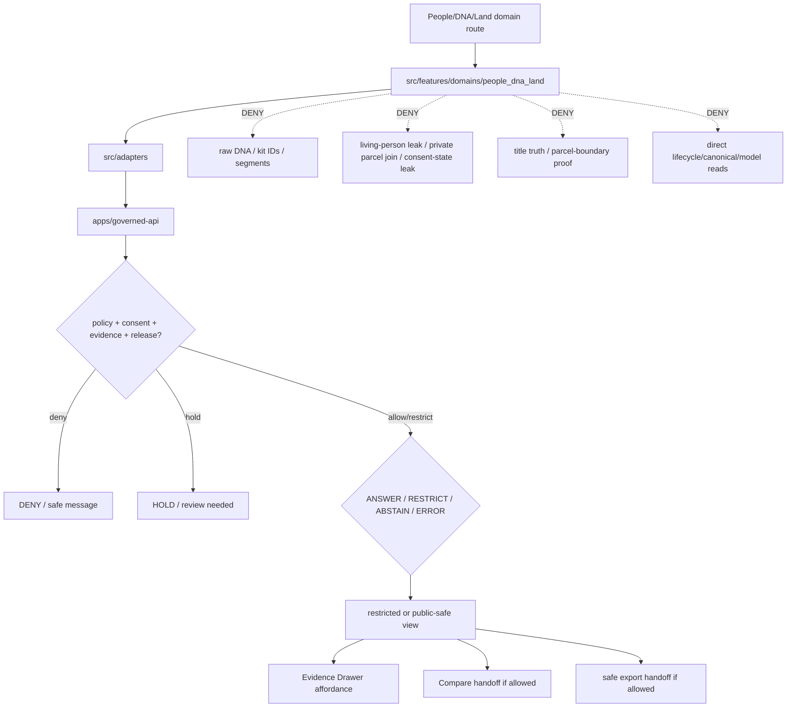

<!-- [KFM_META_BLOCK_V2]
doc_id: kfm://app/explorer-web/src/features/domains/people_dna_land/readme
title: Explorer Web People DNA Land Domain Feature README
type: app-readme
version: v0.2
status: draft
owners: OWNER_TBD — Apps steward · UI steward · People-DNA-Land steward · Consent steward · Sensitivity reviewer · Rights-holder representative · Governed API steward · Policy steward · Docs steward
created: 2026-06-16
updated: 2026-07-09
policy_label: restricted
related:
  - ../../README.md
  - ../../../README.md
  - ../../../adapters/README.md
  - ../../../../README.md
  - ../../../../../README.md
  - ../../../../../governed-api/README.md
  - ../../../../../../README.md
  - ../../../../../../SECURITY.md
  - ../../../../../../docs/domains/people-dna-land/README.md
  - ../../../../../../docs/domains/people-dna-land/SENSITIVITY.md
  - ../../../../../../policy/consent/people-dna-land/README.md
  - ../../../../../../policy/domains/people-dna-land/README.md
  - ../../../../../../packages/ui/README.md
  - ../../../../../../packages/maplibre/README.md
  - ../../../../../../packages/cesium/README.md
  - ../../../../../../policy/access/README.md
  - ../../../../../../policy/decision/README.md
  - ../../../../../../release/README.md
  - ../../../../../../data/README.md
  - ../../../../../../tools/validators/README.md
  - ../../../../../../tools/watchers/README.md
tags: [kfm, apps, explorer-web, domains, people-dna-land, people, genealogy, dna, land-ownership, consent, restricted-domain, feature, no-direct-data-root, assertion-first]
notes:
  - "v0.2 updates the uploaded People/DNA/Land domain-feature README into a current repo-aware feature contract."
  - "apps/explorer-web/src/features/domains/people_dna_land/README.md, apps/explorer-web/src/features/README.md, docs/domains/people-dna-land/README.md, docs/domains/people-dna-land/SENSITIVITY.md, policy/consent/people-dna-land/README.md, and policy/domains/people-dna-land/README.md were verified through the GitHub app in this update. Prior related Explorer Web adapter/source/app boundaries remain relevant, but adapter files, routes, runtime wiring, tests, and envelopes remain NEEDS VERIFICATION."
  - "policy/sensitivity/people-dna-land/README.md and policy/sensitivity/people/README.md were NOT VERIFIED because direct fetches returned Not Found; this README records the segment conflict without resolving it."
  - "This app path uses the requested underscore directory people_dna_land; governing docs use people-dna-land for many responsibility roots and carry an unresolved short-segment conflict for schemas/contracts/policy-sensitivity/policy-consent roots. This README does not resolve that ADR-level naming conflict."
  - "Feature implementation files, route wiring, domain-view inventory, tests, fixtures, governed API envelopes, ConsentDecision receipts, RevocationReceipts, ReviewRecords, PolicyDecisions, ReleaseManifests, RollbackCards, CorrectionNotices, tombstones, export handoff, Focus Mode behavior, Evidence Drawer behavior, package scripts, runtime behavior, and deployment behavior remain NEEDS VERIFICATION."
  - "People/DNA/Land UI features may compose governed envelopes into restricted or public-safe views, but they must not expose living-person fields, raw DNA, kit IDs, segment data, person-parcel joins, title assertions, parcel-boundary claims, private relationship details, or consent state details without consent, policy, review, evidence, release, correction, tombstone, revocation, and rollback support."
[/KFM_META_BLOCK_V2] -->

<a id="top"></a>

<div align="center">

# Explorer Web People DNA Land Domain Feature

`apps/explorer-web/src/features/domains/people_dna_land/`

**Domain-specific Explorer Web feature boundary for restricted People, Genealogy, DNA, and Land Ownership views: assertion-first people records, genealogy relationships, consent-bound DNA summaries, land instruments, ownership intervals, chain-of-title context, Evidence Drawer handoffs, Focus Mode answers, and release-aware map surfaces rendered only through governed envelopes.**


[Purpose](#1-purpose) · [Current evidence](#2-current-repo-evidence) · [Repo fit](#3-repo-fit) · [Boundary](#4-authority-boundary) · [Inputs](#6-inputs) · [Exclusions](#7-exclusions) · [Feature map](#8-people-dna-land-feature-map) · [Definition of done](#15-definition-of-done)

</div>

---

> [!IMPORTANT]
> **Status:** draft / current README surface confirmed / implementation behavior `NEEDS VERIFICATION`  
> **Owners:** `OWNER_TBD` — Apps steward · UI steward · People-DNA-Land steward · Consent steward · Sensitivity reviewer · Rights-holder representative · Governed API steward · Policy steward · Docs steward  
> **Path:** `apps/explorer-web/src/features/domains/people_dna_land/README.md`  
> **Responsibility root:** `apps/` — deployable application surfaces  
> **Truth posture:** CONFIRMED README path and supporting People/DNA/Land docs/policy README surfaces / PROPOSED domain-feature contract / UNKNOWN implementation files, route wiring, domain-view inventory, tests, fixtures, governed API envelopes, ConsentDecision receipts, RevocationReceipts, ReviewRecords, PolicyDecisions, ReleaseManifests, RollbackCards, CorrectionNotices, tombstones, export handoff, Focus Mode behavior, Evidence Drawer behavior, package scripts, runtime behavior, and deployment behavior

> [!CAUTION]
> People/DNA/Land is the most restricted Explorer Web domain feature lane. Living-person fields, raw DNA, kit IDs, segment data, DNA-derived hypotheses, private person-parcel joins, title assertions, parcel-boundary claims, private relationship details, and consent-state details must fail closed unless every required evidence, consent, policy, review, release, correction, tombstone, revocation, and rollback gate is satisfied.

---

## Quick jump

- [1. Purpose](#1-purpose)
- [2. Current repo evidence](#2-current-repo-evidence)
- [3. Repo fit](#3-repo-fit)
- [4. Authority boundary](#4-authority-boundary)
- [5. Default posture](#5-default-posture)
- [6. Inputs](#6-inputs)
- [7. Exclusions](#7-exclusions)
- [8. People-DNA-Land feature map](#8-people-dna-land-feature-map)
- [9. Diagram](#9-diagram)
- [10. People-DNA-Land UI obligations](#10-people-dna-land-ui-obligations)
- [11. Per-view contract](#11-per-view-contract)
- [12. Inspection path](#12-inspection-path)
- [13. Validation expectations](#13-validation-expectations)
- [14. Safe change pattern](#14-safe-change-pattern)
- [15. Definition of done](#15-definition-of-done)
- [16. Open verification items](#16-open-verification-items)

---

## 1. Purpose

`apps/explorer-web/src/features/domains/people_dna_land/` is the proposed app-local feature boundary for People, Genealogy, DNA, and Land Ownership Explorer Web surfaces.

It may eventually hold route modules, panels, view models, hooks, and feature orchestration for restricted or public-safe experiences such as:

- assertion-first person and genealogy evidence views;
- consent-bound relationship, lineage, and residence-event summaries;
- DNA-derived aggregate, k-anonymized, or restricted views only, never raw vendor/segment material;
- land instrument, ownership interval, and chain-of-title context;
- assessor, tax, and parcel context that is visibly not title or boundary proof;
- private person-parcel join denial, restriction, or review-state messaging;
- consent, revocation, tombstone, correction, and rollback status surfaces;
- Evidence Drawer handoffs that show governed, consent-aware, audience-appropriate payloads;
- Focus Mode bounded People/DNA/Land answers with citation discipline and AIReceipt support;
- compare/export handoffs that preserve consent, sensitivity, rights, release, revocation, correction, tombstone, and rollback state.

This directory is not proof that any route, panel, hook, map layer, adapter, test, fixture, package script, governed API envelope, consent-decision receipt, revocation infrastructure, release manifest, rollback card, tombstone behavior, Evidence Drawer behavior, Focus Mode behavior, export handoff, or runtime wiring is implemented.

[Back to top](#top)

---

## 2. Current repo evidence

| Surface | Status | What it proves | What it does **not** prove |
|---|---|---|---|
| `apps/explorer-web/src/features/domains/people_dna_land/README.md` | **CONFIRMED README** | This README exists and has been updated to v0.2. | People/DNA/Land UI implementation files, route wiring, domain-view inventory, tests, fixtures, governed API envelopes, consent receipts, release manifests, rollback cards, export handoff, or runtime behavior. |
| `apps/explorer-web/src/features/README.md` | **CONFIRMED parent features README** | Parent feature boundary says feature modules must not treat map features, tiles, local files, model text, or lifecycle data as claim truth. | That domain feature modules, route inventory, tests, fixtures, or runtime wiring exist. |
| `apps/explorer-web/src/adapters/README.md` | **CONFIRMED prior related boundary** | Adapter README was previously verified in this session as the governed API / renderer / evidence / layer / export / diagnostics adapter boundary. | That People/DNA/Land adapters or governed API client adapters are implemented. |
| `docs/domains/people-dna-land/README.md` | **CONFIRMED domain-doc surface** | Domain docs define this as the strictest sensitivity lane, require assertion-first person evidence, deny raw DNA public outputs, define parcel geometry as not title proof, and record the segment-name conflict. | That app UI behavior, schemas, validators, policy bundles, source descriptors, releases, or routes are implemented. |
| `docs/domains/people-dna-land/SENSITIVITY.md` | **CONFIRMED boundary-doc surface** | Boundary docs define the People/DNA/Land lane as T4/deny-by-default and stress that neighboring context must not weaken living-person, DNA, title, or parcel-boundary controls. | That executable policy, route enforcement, fixtures, tests, CI binding, or runtime checks exist. |
| `policy/consent/people-dna-land/README.md` | **CONFIRMED consent-policy README** | Consent-policy README exists and says consent constrains render-time materialization but does not replace evidence, rights, sensitivity, validation, review, release, correction, or rollback gates. | Runtime enforcement, schemas, fixtures, tests, revocation infrastructure, consent-decision receipts, and consent-register binding remain NEEDS VERIFICATION. |
| `policy/domains/people-dna-land/README.md` | **CONFIRMED policy-lane scaffold** | Domain policy-lane README exists. | It is still a greenfield scaffold and does not prove concrete policy files, tests, fixtures, CI binding, release integration, or runtime enforcement. |
| `policy/sensitivity/people-dna-land/README.md` | **NOT VERIFIED** | A direct fetch returned Not Found in this update. | Does not resolve the segment conflict or prove no sensitivity-policy path exists elsewhere. |
| `policy/sensitivity/people/README.md` | **NOT VERIFIED** | A direct fetch returned Not Found in this update. | Does not resolve the segment conflict or prove no sensitivity-policy path exists elsewhere. |
| `apps/explorer-web/src/features/domains/README.md` | **NOT VERIFIED** | A parent domain-feature README was not confirmed in this update. | Does not prove absence across all refs; a future index remains useful if accepted. |
| Uploaded People/DNA/Land Markdown | **CONFIRMED source text for this update** | Provided the base People/DNA/Land domain-feature contract updated here. | Does not prove live implementation. |
| Implementation beyond README | **NEEDS VERIFICATION** | Checkable by repo scan, route inventory, fixtures, tests, package scripts, governed API envelopes, consent/revocation receipts, release records, and runtime evidence. | Not claimed by this README. |

[Back to top](#top)

---

## 3. Repo fit

| Concern | Owning root | Expected relationship |
|---|---|---|
| People/DNA/Land domain feature source | `apps/explorer-web/src/features/domains/people_dna_land/` | App-local restricted UI feature modules, if implemented and tested. |
| Feature boundary | `apps/explorer-web/src/features/` | Parent feature/root contract. |
| Domain-feature parent index | `apps/explorer-web/src/features/domains/` | **NEEDS VERIFICATION**; parent README was not confirmed in this update. |
| Adapter boundary | `apps/explorer-web/src/adapters/` | Governed API, evidence, layer, map, export, and diagnostics adapters. |
| Explorer Web source tree | `apps/explorer-web/src/` | Parent source-layout boundary. |
| Explorer Web app | `apps/explorer-web/` | Map-first public/semi-public shell; restricted surfaces require policy and audience controls. |
| Governed API | `apps/governed-api/` | Trust membrane and normal claim-bearing data path. |
| Domain doctrine | `docs/domains/people-dna-land/` | Domain scope, consent, sensitivity, people model, land ownership posture, and verification backlog. |
| Consent policy | `policy/consent/people-dna-land/` | Domain consent lane scaffold; runtime enforcement remains NEEDS VERIFICATION. |
| Domain policy | `policy/domains/people-dna-land/` | Domain admissibility and exposure policy lane, if executable wiring is accepted. |
| Sensitivity policy | `policy/sensitivity/<segment>/` | **NEEDS VERIFICATION**; both checked candidate README paths were not found in this update. |
| Shared UI components | `packages/ui/` | Reusable cards, badges, drawers, panels, warnings, and legends when shared. |
| Renderer wrappers | `packages/maplibre/`, `packages/cesium/` | Renderer behavior stays behind adapter/wrapper boundaries. |
| Release authority | `release/` | Publication, correction, supersession, rollback control. |
| Lifecycle artifacts | `data/` | Receipts, proofs, registry, catalog, triplets, and published artifacts. |
| Security posture | `SECURITY.md`, `docs/security/` | Secrets, sensitive-output, incident, exposure, and audit posture. |

[Back to top](#top)

---

## 4. Authority boundary

This feature renders governed People/DNA/Land UI. It does not own identity truth, DNA truth, title truth, boundary proof, consent policy, sensitivity policy, schemas, contracts, lifecycle artifacts, release decisions, evidence truth, renderer authority, source admission, legal advice, or AI output.

```text
apps/explorer-web/src/features/domains/people_dna_land/ = app-local People/DNA/Land UI feature
apps/explorer-web/src/features/                        = feature boundary
apps/explorer-web/src/adapters/                        = adapter boundary
apps/explorer-web/src/                                 = Explorer Web implementation source
apps/explorer-web/                                     = map-first public/semi-public app boundary
apps/governed-api/                                     = trust membrane and normal data path
docs/domains/people-dna-land/                          = People/DNA/Land doctrine and boundary posture
policy/consent/people-dna-land/                        = proposed domain consent lane
policy/domains/people-dna-land/                        = domain policy lane
policy/sensitivity/<segment>/                          = unresolved / not verified sensitivity-policy lane
packages/ui/                                           = shared UI primitives
packages/maplibre/                                     = renderer wrapper
packages/cesium/                                       = optional gated renderer wrapper
policy/                                                = finite policy decisions
schemas/                                               = machine-readable shape; segment conflict unresolved
contracts/                                             = object meaning; segment conflict unresolved
data/                                                  = lifecycle artifacts, receipts, proofs, registries
release/                                               = publication, correction, rollback authority
```

Safe interpretation:

- **CONFIRMED:** this README surface, parent Explorer Web feature README, People/DNA/Land domain README, boundary/sensitivity doc, consent-policy README, and domain policy-lane scaffold exist.
- **PROPOSED:** People/DNA/Land feature modules may live here when they preserve governed API, assertion-first language, consent, revocation, tombstone, evidence, sensitivity, rights, review, release, rollback, correction, export, and public/restricted-boundary constraints.
- **CONFLICTED:** app path uses `people_dna_land`; governing docs use `people-dna-land` for many responsibility roots and record an unresolved short-segment conflict for schemas/contracts/policy-sensitivity/policy-consent roots.
- **NEEDS VERIFICATION:** modules, route wiring, domain-view inventory, adapter dependencies, fixtures, tests, package scripts, governed API envelopes, consent-decision receipts, revocation infrastructure, ReviewRecords, PolicyDecisions, ReleaseManifests, RollbackCards, CorrectionNotices, tombstones, export handoff, Evidence Drawer behavior, Focus Mode behavior, runtime behavior, and deployment behavior.
- **DENY:** using this feature as identity truth, DNA truth, title truth, parcel-boundary proof, consent authority, policy authority, release authority, lifecycle store, schema/contract home, direct canonical/internal store client, direct model-output surface, renderer authority, export authority, legal authority, or public-data shortcut.

[Back to top](#top)

---

## 5. Default posture

People/DNA/Land feature modules should fail closed, hide sensitive detail by default, preserve assertion-first language, and require consent and policy gates before any person-linked, DNA-derived, or land-linked person claim is materialized.

A view should not render claim-bearing People/DNA/Land content when any of these are unresolved:

- governed API envelope and response validation;
- object family or domain slug;
- living-person, deceased-person, DNA, genealogy, land-instrument, ownership-interval, parcel, assessor/tax, or title-claim posture;
- consent grant, purpose, audience, retention, precision, revocation, subject binding, or dispute state;
- source role, provenance, and evidence support;
- rights or license posture;
- EvidenceRef or EvidenceBundle support;
- PolicyDecision, ConsentDecision, ReviewRecord, ReleaseManifest, RollbackCard, CorrectionNotice, tombstone, or RevocationReceipt;
- person-parcel join, private-land, assessor/tax, title, boundary, legal-description, or private relationship exposure risk;
- public audience, restricted audience, or export destination.

[Back to top](#top)

---

## 6. Inputs

| Input family | Examples | Required posture |
|---|---|---|
| People view state | person assertion, name assertion, life event, residence event, migration event, relationship hypothesis, family group | Assertion-first; never uncited identity truth. |
| DNA view state | DNA match evidence, kit token, segment, triangulation, derived hypothesis | Aggregate/k-anonymized or restricted only; raw public render denied. |
| Land view state | land instrument, deed, title, ownership assertion, ownership interval, parcel, assessor/tax context | Not title/boundary truth without governing evidence and review. |
| API envelope | answer, abstain, deny, error, hold, restricted, decision envelope, evidence payload | Runtime-validated before render. |
| Consent state | consent grant, subject binding, purpose, audience, retention, revocation, dispute | Required when person/DNA/relationship/land-linked claims materialize. |
| Evidence state | EvidenceRef, EvidenceBundle summary, citation validation, proof visibility | Required for claim-bearing detail. |
| Transform state | aggregation, k-anonymity, redaction, tombstone, suppression, embargo, cache invalidation | Required when reducing exposure risk. |
| Review/release state | ReviewRecord, PolicyDecision, ConsentDecision, ReleaseManifest, RollbackCard, CorrectionNotice | Required for restricted or public-safe materialization. |
| Cross-lane state | settlements, roads, archaeology, agriculture, frontier matrix, spatial foundation, hazards, hydrology, soil joins | Context only; inherits strictest lane posture. |
| Export state | selected payload, citations, consent scope, redaction profile, release state, output mode | Governed export only. |
| Focus Mode state | prompt class, finite outcome, evidence handles, policy result | No direct model output as identity, DNA, relationship, title, boundary, or consent truth. |

[Back to top](#top)

---

## 7. Exclusions

| Does not belong here | Correct home |
|---|---|
| People/DNA/Land doctrine and scope | `docs/domains/people-dna-land/` |
| Consent policy bundles or consent decisions | `policy/consent/people-dna-land/`, `policy/consent/`, `policy/` |
| Sensitivity and exposure policy | `policy/sensitivity/<segment>/`, `policy/domains/people-dna-land/`, `policy/` — segment conflict remains open and sensitivity-policy README paths were not verified in this update. |
| Governed API implementation | `apps/governed-api/` |
| Adapter logic shared across feature families | `apps/explorer-web/src/adapters/` |
| Shared reusable UI primitives | `packages/ui/` |
| Renderer wrapper authority | `packages/maplibre/`, `packages/cesium/` |
| Schemas and contracts | `schemas/contracts/v1/<segment>/`, `contracts/<segment>/` — segment name remains CONFLICTED. |
| Lifecycle artifacts, receipts, proofs, catalog, triplets | `data/` |
| Release manifests, rollback cards, correction notices | `release/` |
| Raw DNA, kit IDs, segment data, vendor exports, or triangulation outputs | Denied from public UI; restricted lifecycle/policy-controlled context only. |
| Unreviewed living-person fields or private person-parcel joins | Denied, held, or restricted unless consent/policy/review/release support exists. |
| Title, parcel-boundary, legal ownership, or regulatory authority | Source and legal authorities; UI renders only governed, evidence-bound context. |
| Source acquisition or source registry records | `connectors/`, `data/registry/`, source catalog lanes. |
| Direct RAW / WORK / QUARANTINE / PROCESSED / CATALOG / TRIPLET / PUBLISHED reads | governed API, released artifacts, layer manifests, and bounded public-safe envelopes only. |
| Direct model runtime behavior | `runtime/` behind governed API only. |
| Secrets, credentials, tokens, private keys, consent-register secrets, DNA vendor credentials, identity-provider credentials | secret manager / deployment environment, not UI feature source or examples. |
| Public-sensitive exports, exact restricted locations, living-person/DNA details, source-restricted records, prompt/model traces, legal advice | denied unless separately governed and public-safe; legal advice is outside this UI feature lane. |

[Back to top](#top)

---

## 8. People-DNA-Land feature map

Exact modules remain `NEEDS VERIFICATION`. Candidate views should be introduced only with route inventory, fixtures, governed API envelopes, consent gates, policy decisions, release manifests, rollback cards, revocation/tombstone behavior, and tests.

| Candidate view | Purpose | Required safeguard | Status |
|---|---|---|---|
| `person-assertions` | Show assertion-first person evidence. | EvidenceBundle, source role, living-person gate. | PROPOSED |
| `genealogy-context` | Show relationship and family-group context. | Hypothesis labels, citations, review state. | PROPOSED |
| `dna-summary` | Show aggregate/k-anonymized DNA-derived context. | Consent, k-anonymity, no raw segment render. | PROPOSED |
| `land-instruments` | Show deed/title instrument context. | Source role and title-boundary disclaimers. | PROPOSED |
| `ownership-intervals` | Show evidence-bound ownership intervals. | Valid time, instrument evidence, review state. | PROPOSED |
| `parcel-context` | Show parcel and assessor/tax context. | Geometry is not boundary/title proof. | PROPOSED |
| `consent-denial` | Explain denied/held/restricted person or DNA request. | Safe reason code; no exposure hints. | PROPOSED |
| `revocation-status` | Show revocation/tombstone/correction posture. | No private consent-state leakage. | PROPOSED |
| `domain-focus` | People/DNA/Land Focus Mode UI. | Finite outcomes; no direct model truth or protected detail. | PROPOSED |
| `domain-evidence` | Evidence Drawer handoff. | Redacted/audience-appropriate payload only. | PROPOSED |
| `domain-export` | Domain export handoff. | Consent, citation, redaction, rights, release checks. | PROPOSED |
| `domain-compare` | Domain compare handoff. | Consent, revocation, tombstone, release, review, provenance, and audience posture preserved. | PROPOSED |
| `correction-status` | Public-safe or restricted stale/supersession/correction/rollback status. | Release/correction/rollback refs only; no protected payloads. | PROPOSED |

> [!WARNING]
> Candidate view names are not implementation proof. Do not document a view as runnable until files, route wiring, tests, fixtures, package scripts, governed API envelopes, consent gates, revocation receipts, policy decisions, and release support confirm it.

[Back to top](#top)

---

## 9. Diagram



[Back to top](#top)

---

## 10. People-DNA-Land UI obligations

| Obligation | Example effect |
|---|---|
| `governed_api_only` | Feature state comes through governed API envelopes. |
| `assertion_first` | Person, relationship, and land claims render as evidence-bound assertions, not uncited facts. |
| `consent_required` | Living-person, DNA, relationship, derivative, and land-linked person materialization requires scoped consent where applicable. |
| `revocation_honored` | Revocation triggers tombstone, downstream cleanup, cache invalidation, and safe UI state where supported. |
| `raw_dna_denied` | Raw kit IDs, segment data, vendor exports, and triangulation outputs do not render publicly. |
| `parcel_not_title` | Assessor/tax/parcel geometry is not displayed as title or boundary proof. |
| `evidence_required` | Claim-bearing details link to EvidenceBundle-derived payloads. |
| `no_exposure_hints` | Denial messages do not reveal private relation, DNA, parcel, consent-state, revocation, or identity detail. |
| `finite_states_required` | Views render answer, restrict, abstain, deny, error, hold, revoked, tombstoned, loading, stale, corrected, rollback, and empty states safely. |
| `safe_compare_required` | Compare handoff preserves consent, revocation, tombstone, release, review, provenance, audience, and finite-state posture. |
| `safe_export_required` | Export handoff preserves consent, citations, redaction, rights, review, release, correction, tombstone, revocation, and rollback constraints. |
| `no_authority_fork` | Feature code does not redefine identity, DNA, land-title, consent, policy, schema, contract, release, or evidence logic. |
| `no_data_root_shortcut` | Feature code does not read lifecycle data roots, canonical/internal stores, local source files, or model output as claim sources. |
| `local_parity_preferred` | Restricted fixtures/tests should be runnable locally and in CI with synthetic/public-safe data where practical. |

[Back to top](#top)

---

## 11. Per-view contract

Every long-lived People/DNA/Land domain view should document or encode:

- view purpose and route ownership;
- object families and source families consumed;
- governed API envelope or adapter dependency;
- assertion-first language and source-role behavior;
- consent, purpose, audience, retention, revocation, dispute, and subject-binding behavior;
- living-person, DNA, private-parcel, land-title, assessor/tax, and parcel-boundary exposure behavior;
- release, stale-state, correction, supersession, tombstone, and rollback behavior;
- expected finite outcomes;
- evidence/citation display behavior;
- loading, empty, deny, abstain, error, hold, restricted, revoked, tombstoned, stale, corrected, rollback, and expired states;
- direct lifecycle/canonical/model-output denial posture;
- compare, Focus Mode, Evidence Drawer, or export behavior, if any;
- tests and fixtures proving trust-membrane, consent, revocation, assertion-first, and sensitive-exposure boundaries.

[Back to top](#top)

---

## 12. Inspection path

People/DNA/Land feature implementation files, route wiring, tests, fixtures, governed API envelopes, consent decisions, review records, release manifests, rollback cards, tombstone/revocation behavior, package scripts, and export handoff remain `NEEDS VERIFICATION`.

```bash
find apps/explorer-web/src/features/domains/people_dna_land -maxdepth 5 -type f | sort
find apps/explorer-web/src apps/governed-api docs/domains/people-dna-land policy/consent/people-dna-land policy/domains/people-dna-land policy/sensitivity packages/ui packages/maplibre tests fixtures -maxdepth 6 -type f 2>/dev/null | grep -Ei 'people|person|genealogy|dna|kit|segment|consent|revocation|tombstone|parcel|ownership|title|deed|assessor|tax|evidence|release|rollback|governed' | sort
find data/raw data/work data/quarantine data/processed data/catalog data/triplets data/published data/receipts data/proofs -maxdepth 2 -type f 2>/dev/null | sort
```

[Back to top](#top)

---

## 13. Validation expectations

Useful validation for this feature boundary should cover:

- no People/DNA/Land feature imports or reads lifecycle data roots directly;
- claim-bearing domain views consume governed API envelopes only;
- malformed envelopes render safe error or abstain states;
- living-person fields, raw DNA, kit IDs, segment data, vendor exports, triangulation outputs, and private person-parcel joins are denied, held, or restricted by default;
- consent grant, purpose, audience, retention, revocation, dispute, and subject binding are enforced where applicable;
- person identity, genealogy relationship, ownership interval, parcel geometry, assessor/tax record, deed/title instrument, and title/boundary claims remain distinct;
- revocation and tombstone states invalidate or suppress downstream UI state where required;
- denial messages do not leak private person, DNA, relationship, consent, revocation, or parcel detail;
- cross-lane context inherits the strictest lane posture;
- Evidence Drawer handoff preserves EvidenceRef/EvidenceBundle handles without exposing protected content;
- Focus Mode renders finite outcomes and never direct model output as identity, DNA, relationship, title, boundary, or consent truth;
- compare and export handoffs require consent, citation, redaction, rights, review, release, correction, tombstone, revocation, and rollback support;
- UI output does not expose secrets, exact restricted locations, living-person/DNA details, source-restricted records, private data, prompt/model traces, or legal advice.

[Back to top](#top)

---

## 14. Safe change pattern

For People/DNA/Land feature changes:

1. Add or update route inventory and per-view contract.
2. Add fixtures for open, restricted, denied, held, revoked, tombstoned, abstained, malformed, loading, stale, corrected, rolled-back, and empty states.
3. Test lifecycle-data denial and governed API-only behavior.
4. Preserve assertion-first labels, consent, revocation, sensitivity, source role, review, release, rollback, rights, and citation fields through UI state.
5. Verify denial messaging does not reveal exposure hints, private relationships, DNA details, parcel joins, consent state, revocation state, or reconstruction clues.
6. Verify compare, export, Focus Mode, and Evidence Drawer handoffs cannot bypass consent, policy, review, release, correction, tombstone, revocation, or rollback checks.
7. Update this README, parent `features/README.md`, adapter README, People/DNA/Land docs, consent policy docs, domain policy README, and parent app README when public or restricted behavior changes.

[Back to top](#top)

---

## 15. Definition of done

- [ ] Owners are confirmed and `OWNER_TBD` is replaced.
- [ ] Feature file inventory and route ownership are documented.
- [ ] Governed API and adapter dependencies are explicit.
- [ ] Consent, revocation, sensitivity, review, rights, release, stale-state, tombstone, and rollback states are represented in UI fixtures.
- [ ] Raw DNA, living-person, private person-parcel, title/boundary, and consent-denial states are tested.
- [ ] Direct lifecycle-data import/read checks are covered.
- [ ] Assertion-first and anti-collapse states are tested.
- [ ] Revocation/tombstone/cache-invalidation states are tested where applicable.
- [ ] Denial messaging is tested for no exposure hints.
- [ ] Finite states cover answer, restrict, abstain, deny, error, hold, revoked, tombstoned, loading, stale, corrected, rollback, and empty cases.
- [ ] Evidence Drawer, Focus Mode, Compare, and Export handoffs are tested for safe output if present.
- [ ] Parent feature/adapter/source/app READMEs and People/DNA/Land docs/policy surfaces are updated when public or restricted behavior changes.

[Back to top](#top)

---

## 16. Open verification items

| Item | Why it matters |
|---|---|
| Confirm People/DNA/Land feature implementation files beyond README | Prevents overclaiming feature maturity. |
| Confirm route inventory | Required for restricted/public UI boundary review. |
| Confirm governed API People/DNA/Land envelopes | Required for trust membrane enforcement. |
| Confirm consent-decision and revocation fixtures | Required before restricted rendering claims. |
| Confirm consent-register binding | Required before consent enforcement claims. |
| Confirm runtime consent enforcement | Required before saying consent is enforced. |
| Confirm sensitivity-policy path and segment naming decision | Prevents silent schema/contract/policy drift. |
| Confirm segment naming decision for people vs people-dna-land | Prevents mismatched schema, contract, policy, and app lanes. |
| Confirm release, correction, tombstone, stale-state, and rollback states | Required before public or restricted map-layer claims. |
| Confirm release manifest and rollback-card linkage | Required before publication-support claims. |
| Confirm fixtures and tests | Required before implementation claims. |
| Confirm Focus Mode and Evidence Drawer behavior | Required before claim-bearing UI claims. |
| Confirm Compare handoff | Required before visual-difference claims. |
| Confirm export handoff | Required before download workflows. |
| Confirm direct data-root denial | Required for public/restricted client trust membrane. |
| Confirm no exposure-hint messaging | Required before denial-state UI claims. |
| Confirm package scripts beyond TODO | Required before build/test claims. |

<details>
<summary>Appendix A — no-loss preservation note</summary>

The uploaded README replaced a greenfield People/DNA/Land domain-feature stub with a bounded restricted-domain feature contract without claiming routes, panels, hooks, adapters, fixtures, tests, package scripts, governed API envelopes, consent-decision receipts, revocation infrastructure, ReviewRecords, PolicyDecisions, ReleaseManifests, RollbackCards, Focus Mode, Evidence Drawer, Compare, or export handoff are implemented. This v0.2 update preserves that structure while adding current repo evidence, supporting People/DNA/Land docs/policy evidence, stronger no-direct-data-root language, no-exposure-hints posture, revocation/tombstone posture, segment-conflict handling, compare/export handoff posture, local-parity expectations, and expanded verification items.

The app path `people_dna_land` is documented here because it is the requested Explorer Web feature path. It does not decide the unresolved ADR-level segment conflict among `people_dna_land`, `people-dna-land`, and `people` forms used across app paths, docs, schemas, contracts, policy/sensitivity, and policy/consent roots.

</details>

## Status summary

`apps/explorer-web/src/features/domains/people_dna_land/` should contain People/DNA/Land-specific Explorer Web feature modules only after route contracts, governed API envelopes, consent/revocation posture, fixtures, tests, Evidence Drawer behavior, Focus Mode behavior, Compare behavior, release/stale/tombstone/rollback handling, and export handoff are verified.

It must preserve the trust membrane and People/DNA/Land sensitivity posture: the feature may show assertion-first, consent-aware, redacted, aggregate, k-anonymized, restricted, or public-safe domain knowledge, but it must not expose living-person fields, raw DNA, kit IDs, segment data, private person-parcel joins, title assertions, parcel-boundary claims, private consent-state details, or private relationship details; it must not become identity truth, DNA truth, land-title truth, boundary proof, policy authority, release authority, lifecycle storage, or a direct model-output surface.

<p align="right"><a href="#top">Back to top</a></p>
