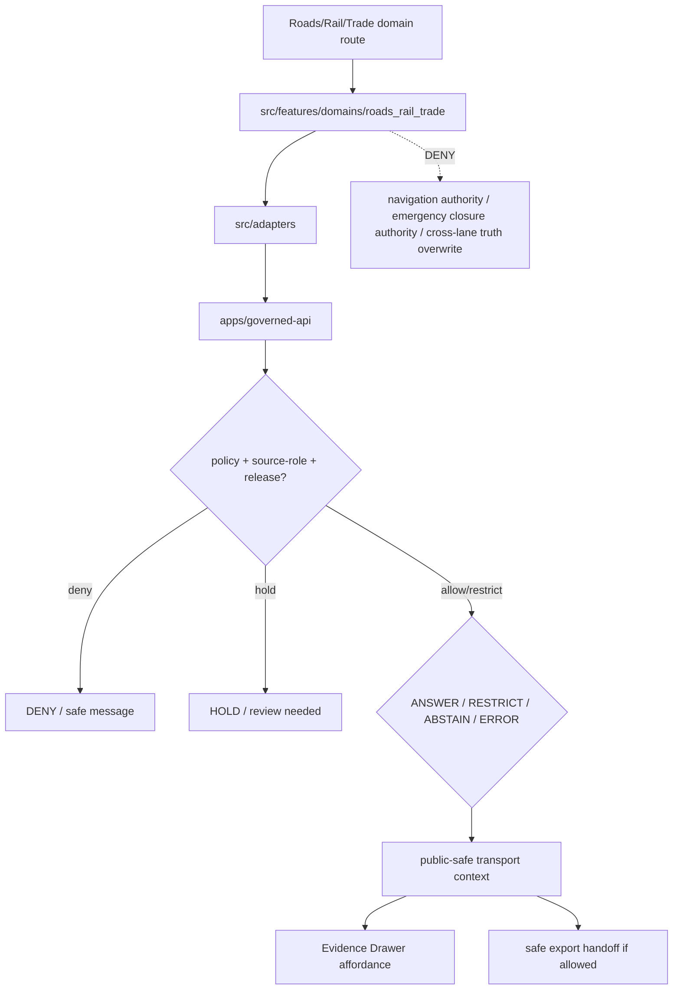

<!-- [KFM_META_BLOCK_V2]
doc_id: kfm://app/explorer-web/src/features/domains/roads_rail_trade/readme
title: Explorer Web Roads Rail Trade Domain Feature README
type: app-readme
version: v0.1
status: draft
owners: OWNER_TBD — Apps steward · UI steward · Roads-Rail-Trade steward · Governed API steward · Policy steward · Docs steward
created: 2026-06-16
updated: 2026-06-16
policy_label: public
related:
  - ../../README.md
  - ../../../README.md
  - ../../../adapters/README.md
  - ../../../../README.md
  - ../../../../../README.md
  - ../../../../../governed-api/README.md
  - ../../../../../../docs/domains/roads-rail-trade/README.md
  - ../../../../../../docs/domains/roads-rail-trade/OBJECT_FAMILIES.md
  - ../../../../../../docs/domains/roads-rail-trade/PIPELINE.md
  - ../../../../../../policy/domains/roads-rail-trade/README.md
  - ../../../../../../contracts/transport/
  - ../../../../../../schemas/contracts/v1/transport/
  - ../../../../../../packages/ui/README.md
  - ../../../../../../packages/maplibre/README.md
  - ../../../../../../policy/access/README.md
  - ../../../../../../policy/decision/README.md
  - ../../../../../../release/README.md
  - ../../../../../../data/README.md
tags: [kfm, apps, explorer-web, domains, roads-rail-trade, transport, roads, rail, trade-routes, network, feature]
notes:
  - "Replaces the greenfield roads-rail-trade domain feature stub with a governed feature README."
  - "This app path uses the requested underscore directory `roads_rail_trade`; governing docs use `roads-rail-trade` for most domain-lane roots and `transport` for schema/contract homes. This README does not resolve that ADR-level naming split."
  - "Roads/Rail/Trade UI features may compose governed transport envelopes into public/semi-public views, but they must not become route authority, emergency closure authority, settlement/infrastructure truth, hydrology truth, archaeology truth, living-person/land truth, or direct model-output truth."
  - "Feature implementation files, route wiring, tests, fixtures, governed API envelopes, graph projections, ReleaseManifests, RollbackCards, and package scripts remain NEEDS VERIFICATION."
[/KFM_META_BLOCK_V2] -->

<a id="top"></a>

<div align="center">

# Explorer Web Roads Rail Trade Domain Feature

`apps/explorer-web/src/features/domains/roads_rail_trade/`

**Domain-specific Explorer Web feature boundary for public-safe roads, rail, historic route, trade corridor, facility, restriction, network-edge, movement-story, Evidence Drawer, Focus Mode, and release-aware map surfaces rendered only through governed envelopes.**


[Purpose](#1-purpose) · [Repo fit](#2-repo-fit) · [Boundary](#3-authority-boundary) · [Inputs](#5-inputs) · [Exclusions](#6-exclusions) · [Feature map](#7-roads-rail-trade-feature-map) · [Definition of done](#14-definition-of-done)

</div>

---

> [!IMPORTANT]
> **Status:** draft / `NEEDS VERIFICATION`  
> **Owners:** `OWNER_TBD` — Apps steward · UI steward · Roads-Rail-Trade steward · Governed API steward · Policy steward · Docs steward  
> **Path:** `apps/explorer-web/src/features/domains/roads_rail_trade/README.md`  
> **Responsibility root:** `apps/` — deployable application surfaces  
> **Truth posture:** CONFIRMED README path / CONFIRMED Roads-Rail-Trade doctrine docs / PROPOSED domain-feature contract / UNKNOWN implementation files, route wiring, tests, fixtures, and runtime behavior

> [!CAUTION]
> Roads/Rail/Trade UI is a governed transport-context surface, not current navigation, legal routing, emergency closure authority, bridge safety determination, rail operating authority, or title/land ownership authority. Public views must preserve source role, valid time, release state, and cross-lane ownership.

---

## Quick jump

- [1. Purpose](#1-purpose)
- [2. Repo fit](#2-repo-fit)
- [3. Authority boundary](#3-authority-boundary)
- [4. Default posture](#4-default-posture)
- [5. Inputs](#5-inputs)
- [6. Exclusions](#6-exclusions)
- [7. Roads-Rail-Trade feature map](#7-roads-rail-trade-feature-map)
- [8. Diagram](#8-diagram)
- [9. Roads-Rail-Trade UI obligations](#9-roads-rail-trade-ui-obligations)
- [10. Per-view contract](#10-per-view-contract)
- [11. Inspection path](#11-inspection-path)
- [12. Validation expectations](#12-validation-expectations)
- [13. Safe change pattern](#13-safe-change-pattern)
- [14. Definition of done](#14-definition-of-done)
- [15. Open verification items](#15-open-verification-items)

---

## 1. Purpose

`apps/explorer-web/src/features/domains/roads_rail_trade/` is the proposed app-local feature boundary for Roads, Rail, and Trade Routes Explorer Web surfaces.

It may eventually hold route modules, panels, view models, hooks, and feature orchestration for public-safe transport experiences such as:

- road segment, historic route, rail segment, bridge, ferry, crossing, depot, siding, and yard views;
- freight corridor, trade route, movement-story, and route-event context;
- access restriction and operator-status displays with source role and valid-time labels;
- network-edge and graph projection views that remain derived and non-canonical;
- Evidence Drawer handoffs that show governed, role-typed, time-aware payloads;
- Focus Mode bounded transport answers with citation discipline and AIReceipt support;
- compare/export handoffs that preserve source role, evidence, rights, release, correction, and rollback state.

This directory is not proof that any route, panel, hook, map layer, adapter, test, fixture, package script, graph projection, or governed API envelope is implemented.

[Back to top](#top)

---

## 2. Repo fit

| Concern | Owning root | Expected relationship |
|---|---|---|
| Roads/Rail/Trade domain feature source | `apps/explorer-web/src/features/domains/roads_rail_trade/` | App-local Roads/Rail/Trade UI feature modules, if implemented and tested |
| Feature boundary | `apps/explorer-web/src/features/` | Parent feature/root contract |
| Adapter boundary | `apps/explorer-web/src/adapters/` | Governed API, evidence, layer, map, export, and diagnostics adapters |
| Explorer Web app | `apps/explorer-web/` | Map-first public/semi-public shell |
| Governed API | `apps/governed-api/` | Trust membrane and normal data path |
| Domain doctrine | `docs/domains/roads-rail-trade/` | Domain scope, object families, source roles, transport slug split, publication, and verification backlog |
| Domain policy | `policy/domains/roads-rail-trade/` | Domain admissibility and exposure policy, if executable wiring is accepted |
| Transport contracts | `contracts/transport/` | Object meaning for network identity governance; presence remains `NEEDS VERIFICATION` |
| Transport schemas | `schemas/contracts/v1/transport/` | Machine shape for transport surfaces; presence remains `NEEDS VERIFICATION` |
| Shared UI components | `packages/ui/` | Reusable cards, badges, drawers, panels, route legends, and network widgets when shared |
| Renderer wrappers | `packages/maplibre/`, `packages/cesium/` | Renderer behavior stays behind adapter/wrapper boundaries |
| Release authority | `release/` | Publication, correction, supersession, rollback control |
| Lifecycle artifacts | `data/` | Receipts, proofs, registry, catalog, triplets, and published artifacts |

## 3. Authority boundary

This feature renders governed Roads/Rail/Trade UI. It does not own current navigation authority, emergency closure authority, settlement/infrastructure truth, hydrology truth, archaeology truth, hazard authority, living-person or land-ownership truth, schemas, contracts, lifecycle artifacts, release decisions, evidence truth, renderer authority, source admission, or AI output.

```text
apps/explorer-web/src/features/domains/roads_rail_trade/ = app-local Roads/Rail/Trade UI feature
apps/explorer-web/src/features/                         = feature boundary
apps/explorer-web/src/adapters/                         = adapter boundary
apps/governed-api/                                      = trust membrane and normal data path
docs/domains/roads-rail-trade/                          = Roads/Rail/Trade doctrine and lane posture
policy/domains/roads-rail-trade/                        = domain policy lane
contracts/transport/                                    = transport object meaning, if present and accepted
schemas/contracts/v1/transport/                         = transport machine shape, if present and accepted
packages/ui/                                            = shared UI primitives
policy/                                                 = finite policy decisions
data/                                                   = lifecycle artifacts, receipts, proofs, registries
release/                                                = publication, correction, rollback authority
```

## 4. Default posture

Roads/Rail/Trade feature modules should fail closed, preserve source-role and time labels, keep historic, modern, regulatory, operational, administrative, modeled, and graph-projection claims distinct, and avoid treating derived route geometry as canonical truth.

A view should not render claim-bearing transport content when any of these are unresolved:

- governed API envelope and response validation;
- object family or lane slug;
- source role, provenance, and source identity;
- rights or license posture;
- valid time, source time, retrieval time, release time, correction time, freshness, or stale-state posture;
- operator-status, restriction, route-event, closure, or hazard-derived context;
- graph projection, network-edge, or derived route-generalization support;
- cross-lane settlement, hydrology, archaeology, hazards, infrastructure, roads/rail, or people/land ownership;
- EvidenceRef or EvidenceBundle support;
- PolicyDecision, ReleaseManifest, RollbackCard, CorrectionNotice, or stale-state rule;
- sensitivity, aggregation, redaction, private-property, infrastructure, cultural-resource, or safety exposure posture;
- public audience or export destination.

## 5. Inputs

| Input family | Examples | Required posture |
|---|---|---|
| Transport view state | road segment, historic route, rail segment, depot, siding, yard, crossing, bridge, ferry, freight corridor, route event, operator status, access restriction, network edge | Explicit finite states |
| API envelope | answer, abstain, deny, error, hold, restricted, decision envelope, evidence payload | Runtime-validated before render |
| Layer state | layer manifest, source role, legend, trust badges, valid/effective time, selected feature id | Released or bounded-safe source only |
| Evidence state | EvidenceRef, EvidenceBundle summary, citation validation, proof visibility | Required for claim-bearing detail |
| Graph state | network edge, route generalization, graph projection, routing cost, movement story node | Derived and labeled; not canonical truth |
| Transform state | generalization, aggregation, redaction, suppression, stale-state label | Required when reducing exposure risk |
| Cross-lane state | settlements, hydrology, archaeology, hazards, infrastructure, people/land joins | Context only; inherits strictest lane posture |
| Export state | selected public-safe layer, bounds, citations, disclaimer, release state, output mode | Governed export only |

## 6. Exclusions

| Does not belong here | Correct home |
|---|---|
| Roads/Rail/Trade doctrine and scope | `docs/domains/roads-rail-trade/` |
| Domain policy bundles or admission decisions | `policy/domains/roads-rail-trade/`, `policy/` |
| Transport contracts and schemas | `contracts/transport/`, `schemas/contracts/v1/transport/` |
| Current navigation, emergency routing, or real-time closure authority | Official issuing/operational authorities; Hazards context where appropriate |
| Settlement and infrastructure canonical truth | Settlements/Infrastructure lane; transport may cite governed context |
| Hydrology canonical water evidence | Hydrology lane; transport may cite river/ferry/crossing context |
| Archaeology site identity or exact protected coordinates | Archaeology lane; transport may cite governed context only |
| Living-person residency or land-ownership history | People/DNA/Land lane; transport may cite governed context only |
| Governed API implementation | `apps/governed-api/` |
| Adapter logic shared across feature families | `apps/explorer-web/src/adapters/` |
| Shared reusable UI primitives | `packages/ui/` |
| Renderer wrapper authority | `packages/maplibre/`, `packages/cesium/` |
| Lifecycle artifacts, receipts, proofs, catalog, triplets | `data/` |
| Release manifests, rollback cards, correction notices | `release/` |
| Source acquisition or source registry records | `connectors/`, `data/registry/`, source catalog lanes |
| Direct model runtime behavior | `runtime/` behind governed API only |
| Secrets, credentials, tokens, private keys | Secret manager / deployment environment |

## 7. Roads-Rail-Trade feature map

Exact modules remain `NEEDS VERIFICATION`. Candidate views should be introduced only with route inventory, fixtures, and tests.

| Candidate view | Purpose | Required safeguard | Status |
|---|---|---|---|
| `road-segments` | Show road segment context | Source role, valid time, release state | PROPOSED |
| `historic-routes` | Show wagon, military, mail, stage, cattle, emigrant, or trade route context | Historic-source caveats and evidence labels | PROPOSED |
| `rail-network` | Show rail segments, depots, sidings, yards, crossings | Operator-status and time labels | PROPOSED |
| `bridges-crossings-ferries` | Show transport crossing context | Hydrology/settlement cross-lane ownership preserved | PROPOSED |
| `access-restrictions` | Show restrictions or closures as context | Source, effective time, and not-authority caveats | PROPOSED |
| `freight-corridors` | Show freight/trade corridor context | Derived status and release state | PROPOSED |
| `network-edges` | Show graph projection edges | Derived label; not source geometry truth | PROPOSED |
| `movement-story` | Show narrative spatial-temporal route nodes | Evidence, provenance, and sensitivity checks | PROPOSED |
| `domain-focus` | Roads/Rail/Trade Focus Mode UI | Finite outcomes; no direct model truth or route authority | PROPOSED |
| `domain-evidence` | Evidence Drawer handoff | Audience-appropriate payload only | PROPOSED |
| `domain-export` | Domain export handoff | Citation, disclaimer, rights, release checks | PROPOSED |

> [!WARNING]
> Candidate view names are not implementation proof. Do not document a view as runnable until files, route wiring, tests, fixtures, package scripts, governed API envelopes, graph projections, and release artifacts confirm it.

## 8. Diagram



## 9. Roads-Rail-Trade UI obligations

| Obligation | Example effect |
|---|---|
| `governed_api_only` | Feature state comes through governed API envelopes |
| `transport_slug_acknowledged` | UI docs acknowledge `roads-rail-trade` lane vs `transport` schema/contract split |
| `source_role_preserved` | Observed, regulatory, modeled, aggregate, administrative, candidate, and synthetic roles remain distinct |
| `time_kind_visible` | Source, valid, retrieval, release, correction, freshness, and stale states remain visible where material |
| `graph_projection_labeled` | Network edges and route projections are derived layers, not canonical source truth |
| `cross_lane_truth_preserved` | Settlement, hydrology, archaeology, hazards, infrastructure, and people/land truth stay with owning lanes |
| `evidence_required` | Claim-bearing details link to EvidenceBundle-derived payloads |
| `finite_states_required` | Views render answer, restrict, abstain, deny, error, hold, loading, stale, and empty states safely |
| `safe_export_required` | Export handoff preserves citations, disclaimers, rights, release, correction, and rollback constraints |
| `no_authority_fork` | Feature code does not redefine transport policy, schema, contract, source, release, routing authority, or evidence logic |

## 10. Per-view contract

Every long-lived Roads/Rail/Trade domain view should document or encode:

- view purpose and route ownership;
- transport object families and source families consumed;
- governed API envelope or adapter dependency;
- source-role, temporal-role, freshness, stale-state, and valid-time behavior;
- graph-projection, route-generalization, and derived-layer labels;
- cross-lane ownership, sensitivity, redaction, aggregation, and exposure behavior;
- release, correction, supersession, and rollback behavior;
- expected finite outcomes;
- evidence/citation display behavior;
- loading, empty, deny, abstain, error, hold, restricted, and stale states;
- export behavior, if any;
- tests and fixtures proving trust-membrane, source-role anti-collapse, and cross-lane ownership boundaries.

## 11. Inspection path

Roads/Rail/Trade feature implementation files, route wiring, tests, fixtures, governed API envelopes, graph projections, release manifests, rollback cards, stale-state rules, package scripts, and export handoff remain `NEEDS VERIFICATION`.

```bash
find apps/explorer-web/src/features/domains/roads_rail_trade -maxdepth 5 -type f | sort
find apps/explorer-web/src apps/governed-api docs/domains/roads-rail-trade policy/domains/roads-rail-trade contracts/transport schemas/contracts/v1/transport packages/ui packages/maplibre tests fixtures -maxdepth 6 -type f 2>/dev/null | grep -Ei 'roads|rail|trade|transport|route|corridor|segment|bridge|ferry|crossing|depot|siding|yard|restriction|operator|network|graph|evidence|release|rollback|governed' | sort
find data/raw data/work data/quarantine data/processed data/catalog data/triplets data/published data/receipts data/proofs -maxdepth 2 -type f 2>/dev/null | sort
```

## 12. Validation expectations

Useful validation for this feature boundary should cover:

- no Roads/Rail/Trade feature imports or reads lifecycle data roots directly;
- claim-bearing transport views consume governed API envelopes only;
- malformed transport envelopes render safe error or abstain states;
- `roads-rail-trade` app/domain segment and `transport` schema/contract segment are documented and not silently mixed;
- road, rail, historic route, route event, operator status, access restriction, and network-edge claims remain distinct;
- graph projections and movement-story nodes are visibly derived and evidence-bound;
- settlement, hydrology, archaeology, hazards, infrastructure, people/land, and other cross-lane truth is not overwritten by transport UI;
- Evidence Drawer handoff preserves EvidenceRef/EvidenceBundle handles without exposing protected content;
- Focus Mode renders finite outcomes and never direct model output as route, closure, title, or operational truth;
- export handoff requires citation, disclaimer, rights, release, correction, and rollback support.

## 13. Safe change pattern

For Roads/Rail/Trade feature changes:

1. Add or update route inventory and per-view contract.
2. Add fixtures for open, historical, regulatory, modeled, derived, restricted, denied, held, abstained, malformed, loading, stale, corrected, rolled-back, and empty states.
3. Test lifecycle-data denial and governed API-only behavior.
4. Preserve source role, time-kind, graph/derived labels, cross-lane ownership, review, release, rollback, rights, and citation fields through UI state.
5. Update this README, parent `features/README.md`, roads/rail/trade docs, and parent app README when public behavior changes.

## 14. Definition of done

- [ ] Owners are confirmed and `OWNER_TBD` is replaced.
- [ ] Roads/Rail/Trade feature file inventory and route ownership are documented.
- [ ] Governed API and adapter dependencies are explicit.
- [ ] Source-role, graph-projection, cross-lane ownership, release, stale-state, and rollback states are represented in UI fixtures.
- [ ] Transport slug split is handled intentionally.
- [ ] Direct lifecycle-data import/read checks are covered.
- [ ] Navigation/closure-authority denial states are tested.
- [ ] Source-role and object-family anti-collapse states are tested.
- [ ] Finite states cover answer, restrict, abstain, deny, error, hold, loading, stale, corrected, rollback, and empty cases.
- [ ] Export, Focus Mode, and Evidence Drawer handoffs are tested for safe output if present.

## 15. Open verification items

| Item | Why it matters |
|---|---|
| Confirm Roads/Rail/Trade feature implementation files beyond README | Prevents overclaiming feature maturity |
| Confirm route inventory | Required for public/semi-public UI boundary review |
| Confirm governed API transport envelopes | Required for trust membrane enforcement |
| Confirm `roads-rail-trade` vs `transport` slug handling | Prevents schema/contract path drift |
| Confirm source-role and object-family fixtures | Required before claim-bearing transport UI claims |
| Confirm graph projection and movement-story behavior | Required before derived network claims |
| Confirm release, correction, stale-state, and rollback states | Required before public map-layer claims |
| Confirm Focus Mode and Evidence Drawer behavior | Required before claim-bearing UI claims |
| Confirm export handoff | Required before public download workflows |
| Confirm package scripts beyond TODO | Required before build/test claims |

<details>
<summary>Appendix A — no-loss preservation note</summary>

The previous README was a greenfield stub. This replacement adds a bounded Roads/Rail/Trade domain-feature contract without claiming routes, panels, hooks, adapters, fixtures, tests, package scripts, governed API envelopes, graph projections, ReleaseManifests, RollbackCards, Focus Mode, Evidence Drawer, or export handoff are implemented.

</details>

## Status summary

`apps/explorer-web/src/features/domains/roads_rail_trade/` should contain Roads/Rail/Trade-specific Explorer Web feature modules only after route contracts, governed API envelopes, graph-projection posture, fixtures, tests, Evidence Drawer behavior, Focus Mode behavior, release/stale/rollback handling, and export handoff are verified.

It must preserve the trust membrane and transport boundary: the feature may show roads, rail, historic routes, trade corridors, transport facilities, restrictions, operator status, graph projections, and movement-story context, but it must not become route authority, emergency closure authority, settlement/infrastructure truth, hydrology truth, archaeology truth, land ownership truth, release authority, lifecycle storage, or a direct model-output surface.

<p align="right"><a href="#top">Back to top</a></p>
