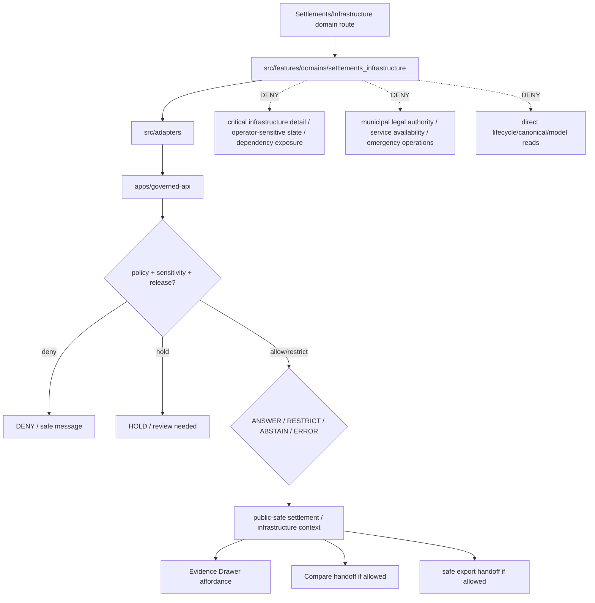

<!-- [KFM_META_BLOCK_V2]
doc_id: kfm://app/explorer-web/src/features/domains/settlements_infrastructure/readme
title: Explorer Web Settlements Infrastructure Domain Feature README
type: app-readme
version: v0.2
status: draft
owners: OWNER_TBD — Apps steward · UI steward · Settlements-Infrastructure steward · Governed API steward · Policy steward · Docs steward · Security reviewer
created: 2026-06-16
updated: 2026-07-09
policy_label: public
related:
  - ../../README.md
  - ../../../README.md
  - ../../../adapters/README.md
  - ../../../../README.md
  - ../../../../../README.md
  - ../../../../../governed-api/README.md
  - ../../../../../../README.md
  - ../../../../../../SECURITY.md
  - ../../../../../../docs/domains/settlements-infrastructure/README.md
  - ../../../../../../policy/domains/settlements-infrastructure/README.md
  - ../../../../../../packages/ui/README.md
  - ../../../../../../packages/maplibre/README.md
  - ../../../../../../packages/cesium/README.md
  - ../../../../../../policy/access/README.md
  - ../../../../../../policy/decision/README.md
  - ../../../../../../release/README.md
  - ../../../../../../data/README.md
  - ../../../../../../tools/validators/README.md
  - ../../../../../../tools/watchers/README.md
tags: [kfm, apps, explorer-web, domains, settlements-infrastructure, settlements, infrastructure, critical-infrastructure, service-areas, dependencies, feature, no-direct-data-root, security-reviewed]
notes:
  - "v0.2 updates the uploaded Settlements/Infrastructure domain-feature README into a current repo-aware feature contract."
  - "apps/explorer-web/src/features/domains/settlements_infrastructure/README.md, apps/explorer-web/src/features/README.md, docs/domains/settlements-infrastructure/README.md, and policy/domains/settlements-infrastructure/README.md were verified through the GitHub app in this update. Prior related Explorer Web adapter/source/app boundaries remain relevant, but adapter files, routes, runtime wiring, tests, and envelopes remain NEEDS VERIFICATION."
  - "policy/sensitivity/settlements-infrastructure/README.md was NOT VERIFIED because a direct fetch returned Not Found; this README records the missing sensitivity-policy surface without resolving policy placement."
  - "This app path uses the requested underscore directory settlements_infrastructure; governing docs use the domain segment settlements-infrastructure. This README does not resolve route inventory, schema/contract placement, or sensitivity-policy placement beyond this app feature boundary."
  - "Feature implementation files, route wiring, domain-view inventory, tests, fixtures, governed API envelopes, CriticalInfrastructureRedactionReceipts, RedactionReceipts, AggregationReceipts, ReviewRecords, PolicyDecisions, ReleaseManifests, RollbackCards, CorrectionNotices, export handoff, Focus Mode behavior, Evidence Drawer behavior, package scripts, runtime behavior, and deployment behavior remain NEEDS VERIFICATION."
  - "Settlements/Infrastructure UI features may compose governed domain envelopes into public/semi-public views, but they must not become settlement legal authority, infrastructure security disclosure, utility/operator truth, service availability promise, hazard authority, land ownership truth, parcel/title proof, emergency operations authority, or direct model-output truth."
[/KFM_META_BLOCK_V2] -->

<a id="top"></a>

<div align="center">

# Explorer Web Settlements Infrastructure Domain Feature

`apps/explorer-web/src/features/domains/settlements_infrastructure/`

**Domain-specific Explorer Web feature boundary for public-safe settlements and infrastructure views: settlements, municipalities, census places, historic townsites, ghost towns, forts, missions, reservation communities, facilities, service areas, operators, condition observations, dependencies, Evidence Drawer handoffs, Focus Mode answers, compare/export flows, and release-aware map surfaces rendered only through governed envelopes.**


[Purpose](#1-purpose) · [Current evidence](#2-current-repo-evidence) · [Repo fit](#3-repo-fit) · [Boundary](#4-authority-boundary) · [Inputs](#6-inputs) · [Exclusions](#7-exclusions) · [Feature map](#8-settlements-infrastructure-feature-map) · [Definition of done](#15-definition-of-done)

</div>

---

> [!IMPORTANT]
> **Status:** draft / current README surface confirmed / implementation behavior `NEEDS VERIFICATION`  
> **Owners:** `OWNER_TBD` — Apps steward · UI steward · Settlements-Infrastructure steward · Governed API steward · Policy steward · Docs steward · Security reviewer  
> **Path:** `apps/explorer-web/src/features/domains/settlements_infrastructure/README.md`  
> **Responsibility root:** `apps/` — deployable application surfaces  
> **Truth posture:** CONFIRMED README path and supporting Settlements/Infrastructure docs/policy README surfaces / PROPOSED domain-feature contract / UNKNOWN implementation files, route wiring, domain-view inventory, tests, fixtures, governed API envelopes, critical-infrastructure redaction receipts, ReviewRecords, PolicyDecisions, ReleaseManifests, RollbackCards, CorrectionNotices, export handoff, Focus Mode behavior, Evidence Drawer behavior, package scripts, runtime behavior, and deployment behavior

> [!CAUTION]
> Settlements/Infrastructure UI is a governed context surface, not municipal legal authority, current utility or service-availability authority, emergency operations authority, infrastructure security disclosure, land/title proof, parcel-boundary proof, or operator truth. Public views must fail closed for critical infrastructure, utilities, condition, dependencies, operator-sensitive details, exact facility geometry, and private or security-relevant joins unless reviewed policy support authorizes a public-safe output.

---

## Quick jump

- [1. Purpose](#1-purpose)
- [2. Current repo evidence](#2-current-repo-evidence)
- [3. Repo fit](#3-repo-fit)
- [4. Authority boundary](#4-authority-boundary)
- [5. Default posture](#5-default-posture)
- [6. Inputs](#6-inputs)
- [7. Exclusions](#7-exclusions)
- [8. Settlements-Infrastructure feature map](#8-settlements-infrastructure-feature-map)
- [9. Diagram](#9-diagram)
- [10. Settlements-Infrastructure UI obligations](#10-settlements-infrastructure-ui-obligations)
- [11. Per-view contract](#11-per-view-contract)
- [12. Inspection path](#12-inspection-path)
- [13. Validation expectations](#13-validation-expectations)
- [14. Safe change pattern](#14-safe-change-pattern)
- [15. Definition of done](#15-definition-of-done)
- [16. Open verification items](#16-open-verification-items)

---

## 1. Purpose

`apps/explorer-web/src/features/domains/settlements_infrastructure/` is the proposed app-local feature boundary for Settlements and Infrastructure Explorer Web surfaces.

It may eventually hold route modules, panels, view models, hooks, and feature orchestration for public-safe settlement and infrastructure experiences such as:

- settlement, municipality, census place, historic townsite, and ghost-town views;
- fort, mission, reservation community, and public-place context;
- infrastructure asset, network node, network segment, facility, and service-area views;
- operator, condition observation, and dependency summaries with review and sensitivity controls;
- critical-infrastructure denial, restriction, redaction, generalization, or aggregation messaging;
- service-area and dependency context that does not promise live availability or operational status;
- Evidence Drawer handoffs that show governed, role-typed, time-aware payloads;
- Focus Mode bounded settlement/infrastructure answers with citation discipline and AIReceipt support;
- compare/export handoffs that preserve source role, sensitivity, rights, release, correction, stale-state, and rollback state.

This directory is not proof that any route, panel, hook, map layer, adapter, test, fixture, package script, governed API envelope, critical-infrastructure redaction receipt, ReleaseManifest, RollbackCard, CorrectionNotice, Evidence Drawer behavior, Focus Mode behavior, export handoff, or runtime wiring is implemented.

[Back to top](#top)

---

## 2. Current repo evidence

| Surface | Status | What it proves | What it does **not** prove |
|---|---|---|---|
| `apps/explorer-web/src/features/domains/settlements_infrastructure/README.md` | **CONFIRMED README** | This README exists and has been updated to v0.2. | Settlements/Infrastructure UI implementation files, route wiring, domain-view inventory, tests, fixtures, governed API envelopes, critical-infrastructure receipts, release manifests, rollback cards, export handoff, or runtime behavior. |
| `apps/explorer-web/src/features/README.md` | **CONFIRMED parent features README** | Parent feature boundary says feature modules must not treat map features, tiles, local files, model text, or lifecycle data as claim truth. | That domain feature modules, route inventory, tests, fixtures, or runtime wiring exist. |
| `apps/explorer-web/src/adapters/README.md` | **CONFIRMED prior related boundary** | Adapter README was previously verified in this session as the governed API / renderer / evidence / layer / export / diagnostics adapter boundary. | That settlements/infrastructure adapters or governed API client adapters are implemented. |
| `docs/domains/settlements-infrastructure/README.md` | **CONFIRMED domain-doc surface** | Domain docs define Settlements/Infrastructure scope, object families, RAW → PUBLISHED lifecycle doctrine, cross-lane relations, and critical-infrastructure review default. | That app UI behavior, schemas, validators, policy bundles, source descriptors, releases, or routes are implemented. |
| `policy/domains/settlements-infrastructure/README.md` | **CONFIRMED policy-lane scaffold** | Domain policy-lane README exists. | It is still a greenfield scaffold and does not prove concrete policy files, tests, fixtures, CI binding, release integration, sensitivity logic, or runtime enforcement. |
| `policy/sensitivity/settlements-infrastructure/README.md` | **NOT VERIFIED** | A direct fetch returned Not Found in this update. | Does not prove no sensitivity policy exists elsewhere; it only prevents claiming this exact README path exists. |
| `apps/explorer-web/src/features/domains/README.md` | **NOT VERIFIED** | A parent domain-feature README was not confirmed in this update. | Does not prove absence across all refs; a future index remains useful if accepted. |
| Uploaded Settlements/Infrastructure Markdown | **CONFIRMED source text for this update** | Provided the base Settlements/Infrastructure domain-feature contract updated here. | Does not prove live implementation. |
| Implementation beyond README | **NEEDS VERIFICATION** | Checkable by repo scan, route inventory, fixtures, tests, package scripts, governed API envelopes, receipts, release records, and runtime evidence. | Not claimed by this README. |

[Back to top](#top)

---

## 3. Repo fit

| Concern | Owning root | Expected relationship |
|---|---|---|
| Settlements/Infrastructure domain feature source | `apps/explorer-web/src/features/domains/settlements_infrastructure/` | App-local Settlements/Infrastructure UI feature modules, if implemented and tested. |
| Feature boundary | `apps/explorer-web/src/features/` | Parent feature/root contract. |
| Domain-feature parent index | `apps/explorer-web/src/features/domains/` | **NEEDS VERIFICATION**; parent README was not confirmed in this update. |
| Adapter boundary | `apps/explorer-web/src/adapters/` | Governed API, evidence, layer, map, export, and diagnostics adapters. |
| Explorer Web source tree | `apps/explorer-web/src/` | Parent source-layout boundary. |
| Explorer Web app | `apps/explorer-web/` | Map-first public/semi-public shell. |
| Governed API | `apps/governed-api/` | Trust membrane and normal claim-bearing data path. |
| Domain doctrine | `docs/domains/settlements-infrastructure/` | Domain scope, object families, source roles, sensitivity posture, publication, cross-lane relations, and verification backlog. |
| Domain policy | `policy/domains/settlements-infrastructure/` | Domain admissibility and exposure policy lane, if executable wiring is accepted. |
| Sensitivity policy | `policy/sensitivity/settlements-infrastructure/` | **NEEDS VERIFICATION**; README path was not confirmed in this update. |
| Shared UI components | `packages/ui/` | Reusable cards, badges, drawers, panels, facility legends, and dependency widgets when shared. |
| Renderer wrappers | `packages/maplibre/`, `packages/cesium/` | Renderer behavior stays behind adapter/wrapper boundaries. |
| Release authority | `release/` | Publication, correction, supersession, rollback control. |
| Lifecycle artifacts | `data/` | Receipts, proofs, registry, catalog, triplets, and published artifacts. |
| Security posture | `SECURITY.md`, `docs/security/` | Secrets, sensitive-output, incident, exposure, and audit posture. |

[Back to top](#top)

---

## 4. Authority boundary

This feature renders governed Settlements/Infrastructure UI. It does not own transport route truth, hydrology truth, hazard authority, people/land ownership truth, legal title proof, parcel-boundary proof, emergency operations, utility operation, infrastructure security policy, schemas, contracts, lifecycle artifacts, release decisions, evidence truth, renderer authority, source admission, or AI output.

```text
apps/explorer-web/src/features/domains/settlements_infrastructure/ = app-local Settlements/Infrastructure UI feature
apps/explorer-web/src/features/                                  = feature boundary
apps/explorer-web/src/adapters/                                  = adapter boundary
apps/explorer-web/src/                                           = Explorer Web implementation source
apps/explorer-web/                                               = map-first public/semi-public app boundary
apps/governed-api/                                               = trust membrane and normal data path
docs/domains/settlements-infrastructure/                         = Settlements/Infrastructure doctrine and lane posture
policy/domains/settlements-infrastructure/                       = domain policy lane
policy/sensitivity/settlements-infrastructure/                   = proposed/not-yet-verified sensitivity policy lane
packages/ui/                                                     = shared UI primitives
packages/maplibre/                                               = renderer wrapper
packages/cesium/                                                 = optional gated renderer wrapper
policy/                                                          = finite policy decisions
schemas/                                                         = machine-readable shape
contracts/                                                       = object meaning
data/                                                            = lifecycle artifacts, receipts, proofs, registries
release/                                                         = publication, correction, rollback authority
```

Safe interpretation:

- **CONFIRMED:** this README surface, parent Explorer Web feature README, Settlements/Infrastructure domain README, and domain policy-lane scaffold exist.
- **NOT VERIFIED:** `policy/sensitivity/settlements-infrastructure/README.md` was not found by direct fetch in this update.
- **PROPOSED:** Settlements/Infrastructure feature modules may live here when they preserve governed API, source-role, time-kind, critical-infrastructure review, redaction/aggregation, evidence, sensitivity, rights, review, release, rollback, correction, export, and public-boundary constraints.
- **NEEDS VERIFICATION:** modules, route wiring, domain-view inventory, adapter dependencies, fixtures, tests, package scripts, governed API envelopes, CriticalInfrastructureRedactionReceipts, RedactionReceipts, AggregationReceipts, ReviewRecords, PolicyDecisions, ReleaseManifests, RollbackCards, CorrectionNotices, export handoff, Evidence Drawer behavior, Focus Mode behavior, runtime behavior, and deployment behavior.
- **DENY:** using this feature as municipal legal authority, emergency operations authority, utility or service-availability authority, infrastructure security disclosure, operator truth, hazard authority, land/title authority, parcel-boundary proof, policy authority, release authority, lifecycle store, schema/contract home, direct canonical/internal store client, direct model-output surface, renderer authority, export authority, or public-data shortcut.

[Back to top](#top)

---

## 5. Default posture

Settlements/Infrastructure feature modules should fail closed, preserve source-role and time labels, keep administrative, historical, infrastructure, condition, operator, service-area, dependency, and derived claims distinct, and avoid treating public map geometry as legal, operational, service, or security truth.

A view should not render claim-bearing settlement or infrastructure content when any of these are unresolved:

- governed API envelope and response validation;
- object family or lane slug;
- source role, provenance, and source identity;
- rights or license posture;
- valid time, source time, retrieval time, release time, correction time, freshness, or stale-state posture;
- legal status, municipal boundary, census geography, facility, operator, condition, dependency, service-area, or infrastructure asset role;
- critical infrastructure, utility, operator-sensitive, exact facility, condition, dependency, service-availability, or security exposure posture;
- cross-lane roads/rail, hydrology, hazards, people/land, archaeology, agriculture, habitat, or transport ownership;
- EvidenceRef or EvidenceBundle support;
- PolicyDecision, ReleaseManifest, RollbackCard, CorrectionNotice, RedactionReceipt, AggregationReceipt, or critical-infrastructure review support;
- sensitivity, aggregation, redaction, private-property, infrastructure, security, or dependency-chain exposure posture;
- public audience or export destination.

[Back to top](#top)

---

## 6. Inputs

| Input family | Examples | Required posture |
|---|---|---|
| Settlement view state | settlement, municipality, census place, townsite, ghost town, fort, mission, reservation community | Explicit finite states and source-role labels. |
| Infrastructure view state | infrastructure asset, network node, network segment, facility, service area, operator, condition observation, dependency | Review and sensitivity posture before render. |
| API envelope | answer, abstain, deny, error, hold, restricted, decision envelope, evidence payload | Runtime-validated before render. |
| Layer state | layer manifest, source role, legend, trust badges, valid/effective time, selected feature id | Released or bounded-safe source only. |
| Evidence state | EvidenceRef, EvidenceBundle summary, citation validation, proof visibility | Required for claim-bearing detail. |
| Transform state | generalization, aggregation, redaction, suppression, critical-infrastructure masking, stale-state label | Required when reducing exposure risk. |
| Security/review state | critical-infrastructure review, operator sensitivity, service dependency, facility precision, audience tier | Fail closed when unresolved. |
| Cross-lane state | roads/rail, hydrology, hazards, people/land, archaeology, agriculture, habitat joins | Context only; inherits strictest lane posture. |
| Release/correction state | release ref, rollback target, correction notice, stale-state, supersession, withdrawal | Required for public-facing claim and export support. |
| Export state | selected public-safe layer, bounds, citations, disclaimer, release state, output mode | Governed export only. |
| Focus Mode state | prompt class, finite outcome, evidence handles, policy result | No direct model output as settlement, infrastructure, service, operator, legal, or security truth. |

[Back to top](#top)

---

## 7. Exclusions

| Does not belong here | Correct home |
|---|---|
| Settlements/Infrastructure doctrine and scope | `docs/domains/settlements-infrastructure/` |
| Domain policy bundles or admission decisions | `policy/domains/settlements-infrastructure/`, `policy/` |
| Sensitivity policy decisions | `policy/sensitivity/settlements-infrastructure/` or accepted successor path; README path was not verified in this update. |
| Settlement legal status or boundary authority beyond governed context | Official source authority; UI renders evidence-bound context only. |
| Current utility/service availability or operational authority | Official operators and regulated authorities. |
| Critical-infrastructure security detail | Denied, restricted, generalized, or aggregated unless reviewed public-safe release exists. |
| Roads, rail, depots as transport routes | Roads/Rail/Trade lane; settlements may cite governed context. |
| Hydrologic evidence | Hydrology lane; settlements may cite governed relation context. |
| Hazard events, warnings, and declarations | Hazards lane; settlements may cite exposure/resilience projections. |
| Ownership, parcels, living-person privacy | People/DNA/Land lane; settlements may cite governed context only. |
| Agriculture, habitat, fauna, flora, archaeology, or other domain truth | Owning domain lanes. |
| Governed API implementation | `apps/governed-api/` |
| Adapter logic shared across feature families | `apps/explorer-web/src/adapters/` |
| Shared reusable UI primitives | `packages/ui/` |
| Renderer wrapper authority | `packages/maplibre/`, `packages/cesium/` |
| Schemas and contracts | `schemas/contracts/v1/domains/settlements-infrastructure/`, `contracts/domains/settlements-infrastructure/` |
| Lifecycle artifacts, receipts, proofs, catalog, triplets | `data/` |
| Release manifests, rollback cards, correction notices | `release/` |
| Source acquisition or source registry records | `connectors/`, `data/registry/`, source catalog lanes. |
| Direct RAW / WORK / QUARANTINE / PROCESSED / CATALOG / TRIPLET / PUBLISHED reads | governed API, released artifacts, layer manifests, and bounded public-safe envelopes only. |
| Direct model runtime behavior | `runtime/` behind governed API only. |
| Secrets, credentials, tokens, private keys, operational-feed credentials, private operator data, facility-security detail | secret manager / deployment environment, not UI feature source or examples. |
| Public-sensitive exports, exact restricted locations, critical-infrastructure details, source-restricted records, private data, prompt/model traces, service-availability promises | denied unless separately governed and public-safe. |

[Back to top](#top)

---

## 8. Settlements-Infrastructure feature map

Exact modules remain `NEEDS VERIFICATION`. Candidate views should be introduced only with route inventory, fixtures, governed API envelopes, critical-infrastructure review fixtures, redaction/aggregation receipts, release manifests, rollback cards, and tests.

| Candidate view | Purpose | Required safeguard | Status |
|---|---|---|---|
| `settlements` | Show settlement and place context. | Source role, valid time, release state. | PROPOSED |
| `municipalities` | Show municipality/legal-place context. | Legal-source caveats and effective dates. | PROPOSED |
| `historic-places` | Show townsites, ghost towns, forts, missions, and reservation-community context. | Historic-source caveats and evidence labels. | PROPOSED |
| `facilities-assets` | Show facilities and infrastructure assets. | Critical-infrastructure review and redaction. | PROPOSED |
| `service-areas` | Show service-area context. | Operator/source/time caveats; no availability promise. | PROPOSED |
| `condition-dependencies` | Show condition and dependency summaries. | Aggregate/restricted unless reviewed. | PROPOSED |
| `operator-context` | Show operator context. | Role and authority limits visible. | PROPOSED |
| `dependency-context` | Show dependency relation context. | No sensitive chain or security-state leakage. | PROPOSED |
| `sensitive-denial` | Explain why infrastructure detail is unavailable. | Safe reason code; no exposure hints. | PROPOSED |
| `domain-focus` | Settlements/Infrastructure Focus Mode UI. | Finite outcomes; no direct model truth or operational authority. | PROPOSED |
| `domain-evidence` | Evidence Drawer handoff. | Audience-appropriate payload only. | PROPOSED |
| `domain-export` | Domain export handoff. | Citation, redaction, rights, release checks. | PROPOSED |
| `domain-compare` | Domain compare handoff. | Source role, time, redaction, release, review, provenance, and stale-state preserved. | PROPOSED |
| `correction-status` | Public-safe stale/supersession/correction/rollback status. | Release/correction/rollback refs only; no operational instruction. | PROPOSED |

> [!WARNING]
> Candidate view names are not implementation proof. Do not document a view as runnable until files, route wiring, tests, fixtures, package scripts, governed API envelopes, redaction/aggregation receipts, release artifacts, and public-boundary checks confirm it.

[Back to top](#top)

---

## 9. Diagram



[Back to top](#top)

---

## 10. Settlements-Infrastructure UI obligations

| Obligation | Example effect |
|---|---|
| `governed_api_only` | Feature state comes through governed API envelopes. |
| `source_role_preserved` | Administrative, historical, observed, modeled, aggregate, operator, condition, dependency, and candidate roles remain distinct. |
| `time_kind_visible` | Source, valid, retrieval, release, correction, freshness, and stale states remain visible where material. |
| `critical_infrastructure_review` | Critical infrastructure, utilities, operators, condition, dependencies, and exact facility geometry fail closed or generalize before public display. |
| `no_service_promise` | Service-area and utility displays do not promise current availability, reliability, or operational status. |
| `cross_lane_truth_preserved` | Transport, Hydrology, Hazards, People/Land, Archaeology, Agriculture, Habitat, and other truth stays with owning lanes. |
| `evidence_required` | Claim-bearing details link to EvidenceBundle-derived payloads. |
| `no_exposure_hints` | Denial messages do not reveal sensitive facility locations, operator state, dependency chain, transform parameters, or security posture. |
| `finite_states_required` | Views render answer, restrict, abstain, deny, error, hold, loading, stale, corrected, rollback, and empty states safely. |
| `safe_compare_required` | Compare handoff preserves source role, redaction, release, review, provenance, time, stale-state, and finite-state posture. |
| `safe_export_required` | Export handoff preserves citations, disclaimers, redaction, rights, release, correction, and rollback constraints. |
| `no_authority_fork` | Feature code does not redefine settlement, infrastructure, utility, operator, policy, schema, contract, source, release, security, or evidence logic. |
| `no_data_root_shortcut` | Feature code does not read lifecycle data roots, canonical/internal stores, local source files, or model output as claim sources. |
| `local_parity_preferred` | Settlements/Infrastructure fixtures/tests should be runnable locally and in CI with the same inputs where practical. |

[Back to top](#top)

---

## 11. Per-view contract

Every long-lived Settlements/Infrastructure domain view should document or encode:

- view purpose and route ownership;
- settlement/infrastructure object families and source families consumed;
- governed API envelope or adapter dependency;
- source-role, temporal-role, freshness, stale-state, and valid-time behavior;
- critical-infrastructure, facility, operator, condition, dependency, redaction, aggregation, and exposure behavior;
- cross-lane ownership and sensitivity inheritance behavior;
- release, correction, supersession, withdrawal, and rollback behavior;
- expected finite outcomes;
- evidence/citation display behavior;
- loading, empty, deny, abstain, error, hold, restricted, stale, corrected, and rollback states;
- direct lifecycle/canonical/model-output denial posture;
- compare, Focus Mode, Evidence Drawer, or export behavior, if any;
- tests and fixtures proving trust-membrane, critical-infrastructure, source-role, and cross-lane ownership boundaries.

[Back to top](#top)

---

## 12. Inspection path

Settlements/Infrastructure feature implementation files, route wiring, tests, fixtures, governed API envelopes, redaction/aggregation receipts, release manifests, rollback cards, stale-state rules, package scripts, and export handoff remain `NEEDS VERIFICATION`.

```bash
find apps/explorer-web/src/features/domains/settlements_infrastructure -maxdepth 5 -type f | sort
find apps/explorer-web/src apps/governed-api docs/domains/settlements-infrastructure policy/domains/settlements-infrastructure policy/sensitivity/settlements-infrastructure packages/ui packages/maplibre tests fixtures -maxdepth 6 -type f 2>/dev/null | grep -Ei 'settlement|municipal|census|townsite|ghost|fort|mission|reservation|infrastructure|facility|operator|condition|dependency|service|asset|network|redaction|aggregation|evidence|release|rollback|governed' | sort
find data/raw data/work data/quarantine data/processed data/catalog data/triplets data/published data/receipts data/proofs -maxdepth 2 -type f 2>/dev/null | sort
```

[Back to top](#top)

---

## 13. Validation expectations

Useful validation for this feature boundary should cover:

- no Settlements/Infrastructure feature imports or reads lifecycle data roots directly;
- claim-bearing domain views consume governed API envelopes only;
- malformed envelopes render safe error or abstain states;
- settlement, municipality, census place, historic townsite, facility, operator, condition, dependency, and service-area claims remain distinct;
- critical infrastructure, utilities, condition, dependencies, operator-sensitive details, exact facility geometry, private joins, and security-relevant outputs are denied, generalized, held, or restricted by default;
- source role, time-kind, rights, release, stale-state, citation, review, and transform metadata are preserved;
- service-area and utility displays do not imply current service availability or operational instruction;
- denial messages do not leak facility, operator, dependency, service, or security-sensitive hints;
- cross-lane context inherits the strictest lane posture;
- Evidence Drawer handoff preserves EvidenceRef/EvidenceBundle handles without exposing protected content;
- Focus Mode renders finite outcomes and never direct model output as settlement, infrastructure, utility, service, operator, legal, or security truth;
- compare and export handoffs require citation, disclaimer, redaction, rights, review, release, correction, and rollback support;
- UI output does not expose secrets, exact restricted locations, critical-infrastructure details, source-restricted records, private data, prompt/model traces, emergency-operation detail, or service-availability promises.

[Back to top](#top)

---

## 14. Safe change pattern

For Settlements/Infrastructure feature changes:

1. Add or update route inventory and per-view contract.
2. Add fixtures for open, restricted, denied, held, generalized, aggregated, redacted, abstained, malformed, loading, stale, corrected, rolled-back, and empty states.
3. Test lifecycle-data denial and governed API-only behavior.
4. Preserve source role, time-kind, critical-infrastructure controls, review, release, rollback, rights, and citation fields through UI state.
5. Verify denial messaging does not reveal exposure hints, operator state, dependency-chain detail, facility-security state, transform parameters, or reconstruction clues.
6. Verify compare, export, Focus Mode, and Evidence Drawer handoffs cannot bypass policy, critical-infrastructure review, source-role discipline, release, correction, stale-state, or rollback checks.
7. Update this README, parent `features/README.md`, adapter README, settlements/infrastructure docs, policy README, and parent app README when public behavior changes.

[Back to top](#top)

---

## 15. Definition of done

- [ ] Owners are confirmed and `OWNER_TBD` is replaced.
- [ ] Settlements/Infrastructure feature file inventory and route ownership are documented.
- [ ] Governed API and adapter dependencies are explicit.
- [ ] Source-role, critical-infrastructure, operator-sensitive, cross-lane ownership, release, stale-state, and rollback states are represented in UI fixtures.
- [ ] Redaction/generalization/aggregation obligations survive feature composition.
- [ ] Direct lifecycle-data import/read checks are covered.
- [ ] Infrastructure-security and utility/operator/service-availability authority denial states are tested.
- [ ] Source-role and object-family anti-collapse states are tested.
- [ ] Denial messaging is tested for no exposure hints.
- [ ] Cross-lane ownership inheritance is tested.
- [ ] Finite states cover answer, restrict, abstain, deny, error, hold, loading, stale, corrected, rollback, and empty cases.
- [ ] Evidence Drawer, Focus Mode, Compare, and Export handoffs are tested for safe output if present.
- [ ] Parent feature/adapter/source/app READMEs and Settlements/Infrastructure docs/policy/sensitivity surfaces are updated when public behavior changes.

[Back to top](#top)

---

## 16. Open verification items

| Item | Why it matters |
|---|---|
| Confirm Settlements/Infrastructure feature implementation files beyond README | Prevents overclaiming feature maturity. |
| Confirm route inventory | Required for public/semi-public UI boundary review. |
| Confirm governed API Settlements/Infrastructure envelopes | Required for trust membrane enforcement. |
| Confirm critical-infrastructure redaction/aggregation receipts | Required before public-safe transformation claims. |
| Confirm source-role and object-family fixtures | Required before claim-bearing UI claims. |
| Confirm sensitivity-policy path or accepted successor | Required before claiming a dedicated sensitivity-policy lane exists. |
| Confirm executable Settlements/Infrastructure policy binding | Required before enforcement claims. |
| Confirm release, correction, stale-state, supersession, withdrawal, and rollback states | Required before public map-layer claims. |
| Confirm release manifest and rollback-card linkage | Required before publication-support claims. |
| Confirm fixtures and tests | Required before implementation claims. |
| Confirm Focus Mode and Evidence Drawer behavior | Required before claim-bearing UI claims. |
| Confirm Compare handoff | Required before visual-difference claims. |
| Confirm export handoff | Required before public download workflows. |
| Confirm direct data-root denial | Required for public client trust membrane. |
| Confirm no exposure-hint messaging | Required before denial-state UI claims. |
| Confirm package scripts beyond TODO | Required before build/test claims. |

<details>
<summary>Appendix A — no-loss preservation note</summary>

The uploaded README replaced a greenfield Settlements/Infrastructure domain-feature stub with a bounded feature contract without claiming routes, panels, hooks, adapters, fixtures, tests, package scripts, governed API envelopes, critical-infrastructure redaction receipts, aggregation receipts, ReleaseManifests, RollbackCards, Focus Mode, Evidence Drawer, Compare, or export handoff are implemented. This v0.2 update preserves that structure while adding current repo evidence, supporting Settlements/Infrastructure docs/policy evidence, stronger no-direct-data-root language, critical-infrastructure review posture, no-exposure-hints posture, cross-lane ownership posture, service-availability denial, release/correction/rollback posture, compare/export handoff posture, local-parity expectations, and expanded verification items.

The app path `settlements_infrastructure` is documented here because it is the requested Explorer Web feature path. It does not decide naming, route inventory, schema/contract placement, or missing sensitivity-policy placement beyond this app feature README.

</details>

## Status summary

`apps/explorer-web/src/features/domains/settlements_infrastructure/` should contain Settlements/Infrastructure-specific Explorer Web feature modules only after route contracts, governed API envelopes, critical-infrastructure/redaction posture, fixtures, tests, Evidence Drawer behavior, Focus Mode behavior, Compare behavior, release/stale/rollback handling, and export handoff are verified.

It must preserve the trust membrane and Settlements/Infrastructure sensitivity posture: the feature may show settlements, municipalities, census places, historic townsites, ghost towns, forts, missions, reservation communities, facilities, service areas, operators, condition observations, and dependencies, but it must not expose critical infrastructure detail, operator-sensitive state, condition/dependency exposure, private joins, emergency operations, legal/title claims, service-availability promises, release authority, lifecycle storage, or a direct model-output surface.

<p align="right"><a href="#top">Back to top</a></p>
