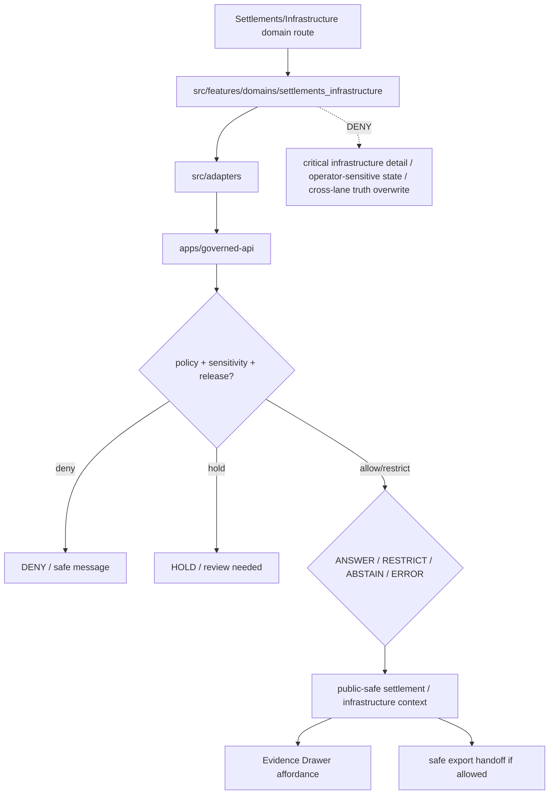

<!-- [KFM_META_BLOCK_V2]
doc_id: kfm://app/explorer-web/src/features/domains/settlements_infrastructure/readme
title: Explorer Web Settlements Infrastructure Domain Feature README
type: app-readme
version: v0.1
status: draft
owners: OWNER_TBD — Apps steward · UI steward · Settlements-Infrastructure steward · Governed API steward · Policy steward · Docs steward
created: 2026-06-16
updated: 2026-06-16
policy_label: public
related:
  - ../../README.md
  - ../../../README.md
  - ../../../adapters/README.md
  - ../../../../README.md
  - ../../../../../README.md
  - ../../../../../governed-api/README.md
  - ../../../../../../docs/domains/settlements-infrastructure/README.md
  - ../../../../../../policy/domains/settlements-infrastructure/README.md
  - ../../../../../../packages/ui/README.md
  - ../../../../../../packages/maplibre/README.md
  - ../../../../../../policy/access/README.md
  - ../../../../../../policy/decision/README.md
  - ../../../../../../release/README.md
  - ../../../../../../data/README.md
tags: [kfm, apps, explorer-web, domains, settlements-infrastructure, settlements, infrastructure, critical-infrastructure, service-areas, dependencies, feature]
notes:
  - "Replaces the greenfield settlements-infrastructure domain feature stub with a governed feature README."
  - "This app path uses the requested underscore directory `settlements_infrastructure`; governing docs use the domain segment `settlements-infrastructure`. This README does not resolve naming or route inventory beyond this confirmed app README path."
  - "Settlements/Infrastructure UI features may compose governed domain envelopes into public/semi-public views, but they must not become settlement legal authority, infrastructure security disclosure, utility/operator truth, service availability promise, hazard authority, land ownership truth, or direct model-output truth."
  - "Feature implementation files, route wiring, tests, fixtures, governed API envelopes, critical-infrastructure redaction, ReleaseManifests, RollbackCards, and package scripts remain NEEDS VERIFICATION."
[/KFM_META_BLOCK_V2] -->

<a id="top"></a>

<div align="center">

# Explorer Web Settlements Infrastructure Domain Feature

`apps/explorer-web/src/features/domains/settlements_infrastructure/`

**Domain-specific Explorer Web feature boundary for public-safe settlements and infrastructure views: settlements, municipalities, census places, historic townsites, ghost towns, forts, missions, reservation communities, facilities, service areas, operators, condition observations, dependencies, Evidence Drawer handoffs, Focus Mode answers, and release-aware map surfaces rendered only through governed envelopes.**


[Purpose](#1-purpose) · [Repo fit](#2-repo-fit) · [Boundary](#3-authority-boundary) · [Inputs](#5-inputs) · [Exclusions](#6-exclusions) · [Feature map](#7-settlements-infrastructure-feature-map) · [Definition of done](#14-definition-of-done)

</div>

---

> [!IMPORTANT]
> **Status:** draft / `NEEDS VERIFICATION`  
> **Owners:** `OWNER_TBD` — Apps steward · UI steward · Settlements-Infrastructure steward · Governed API steward · Policy steward · Docs steward  
> **Path:** `apps/explorer-web/src/features/domains/settlements_infrastructure/README.md`  
> **Responsibility root:** `apps/` — deployable application surfaces  
> **Truth posture:** CONFIRMED README path / CONFIRMED Settlements-Infrastructure doctrine docs / PROPOSED domain-feature contract / UNKNOWN implementation files, route wiring, tests, fixtures, and runtime behavior

> [!CAUTION]
> Settlements/Infrastructure UI is a governed context surface, not municipal legal authority, current utility or service-availability authority, emergency operations authority, infrastructure security disclosure, land/title proof, or operator truth. Public views must fail closed for critical infrastructure, utilities, condition, dependencies, operator-sensitive details, exact facility geometry, and private or security-relevant joins unless reviewed policy support authorizes a public-safe output.

---

## Quick jump

- [1. Purpose](#1-purpose)
- [2. Repo fit](#2-repo-fit)
- [3. Authority boundary](#3-authority-boundary)
- [4. Default posture](#4-default-posture)
- [5. Inputs](#5-inputs)
- [6. Exclusions](#6-exclusions)
- [7. Settlements-Infrastructure feature map](#7-settlements-infrastructure-feature-map)
- [8. Diagram](#8-diagram)
- [9. Settlements-Infrastructure UI obligations](#9-settlements-infrastructure-ui-obligations)
- [10. Per-view contract](#10-per-view-contract)
- [11. Inspection path](#11-inspection-path)
- [12. Validation expectations](#12-validation-expectations)
- [13. Safe change pattern](#13-safe-change-pattern)
- [14. Definition of done](#14-definition-of-done)
- [15. Open verification items](#15-open-verification-items)

---

## 1. Purpose

`apps/explorer-web/src/features/domains/settlements_infrastructure/` is the proposed app-local feature boundary for Settlements and Infrastructure Explorer Web surfaces.

It may eventually hold route modules, panels, view models, hooks, and feature orchestration for public-safe settlement and infrastructure experiences such as:

- settlement, municipality, census place, historic townsite, and ghost-town views;
- fort, mission, reservation community, and public-place context;
- infrastructure asset, network node, network segment, facility, and service-area views;
- operator, condition observation, and dependency summaries with review and sensitivity controls;
- critical-infrastructure denial, restriction, redaction, or aggregation messaging;
- Evidence Drawer handoffs that show governed, role-typed, time-aware payloads;
- Focus Mode bounded settlement/infrastructure answers with citation discipline and AIReceipt support;
- compare/export handoffs that preserve source role, sensitivity, rights, release, correction, and rollback state.

This directory is not proof that any route, panel, hook, map layer, adapter, test, fixture, package script, or governed API envelope is implemented.

[Back to top](#top)

---

## 2. Repo fit

| Concern | Owning root | Expected relationship |
|---|---|---|
| Settlements/Infrastructure domain feature source | `apps/explorer-web/src/features/domains/settlements_infrastructure/` | App-local Settlements/Infrastructure UI feature modules, if implemented and tested |
| Feature boundary | `apps/explorer-web/src/features/` | Parent feature/root contract |
| Adapter boundary | `apps/explorer-web/src/adapters/` | Governed API, evidence, layer, map, export, and diagnostics adapters |
| Explorer Web app | `apps/explorer-web/` | Map-first public/semi-public shell |
| Governed API | `apps/governed-api/` | Trust membrane and normal data path |
| Domain doctrine | `docs/domains/settlements-infrastructure/` | Domain scope, object families, source roles, sensitivity posture, publication, and verification backlog |
| Domain policy | `policy/domains/settlements-infrastructure/` | Domain admissibility and exposure policy, if executable wiring is accepted |
| Shared UI components | `packages/ui/` | Reusable cards, badges, drawers, panels, facility legends, and dependency widgets when shared |
| Renderer wrappers | `packages/maplibre/`, `packages/cesium/` | Renderer behavior stays behind adapter/wrapper boundaries |
| Release authority | `release/` | Publication, correction, supersession, rollback control |
| Lifecycle artifacts | `data/` | Receipts, proofs, registry, catalog, triplets, and published artifacts |

## 3. Authority boundary

This feature renders governed Settlements/Infrastructure UI. It does not own transport route truth, hydrology truth, hazard authority, people/land ownership truth, legal title proof, emergency operations, utility operation, infrastructure security policy, schemas, contracts, lifecycle artifacts, release decisions, evidence truth, renderer authority, source admission, or AI output.

```text
apps/explorer-web/src/features/domains/settlements_infrastructure/ = app-local Settlements/Infrastructure UI feature
apps/explorer-web/src/features/                                  = feature boundary
apps/explorer-web/src/adapters/                                  = adapter boundary
apps/governed-api/                                               = trust membrane and normal data path
docs/domains/settlements-infrastructure/                         = Settlements/Infrastructure doctrine and lane posture
policy/domains/settlements-infrastructure/                       = domain policy lane
packages/ui/                                                     = shared UI primitives
policy/                                                          = finite policy decisions
data/                                                            = lifecycle artifacts, receipts, proofs, registries
release/                                                         = publication, correction, rollback authority
```

## 4. Default posture

Settlements/Infrastructure feature modules should fail closed, preserve source-role and time labels, keep administrative, historical, infrastructure, condition, operator, service-area, dependency, and derived claims distinct, and avoid treating public map geometry as legal, operational, or security truth.

A view should not render claim-bearing settlement or infrastructure content when any of these are unresolved:

- governed API envelope and response validation;
- object family or lane slug;
- source role, provenance, and source identity;
- rights or license posture;
- valid time, source time, retrieval time, release time, correction time, freshness, or stale-state posture;
- legal status, municipal boundary, census geography, facility, operator, condition, dependency, service-area, or infrastructure asset role;
- critical infrastructure, utility, operator-sensitive, exact facility, condition, dependency, or security exposure posture;
- cross-lane roads/rail, hydrology, hazards, people/land, archaeology, agriculture, or habitat ownership;
- EvidenceRef or EvidenceBundle support;
- PolicyDecision, ReleaseManifest, RollbackCard, CorrectionNotice, RedactionReceipt, or AggregationReceipt;
- public audience or export destination.

## 5. Inputs

| Input family | Examples | Required posture |
|---|---|---|
| Settlement view state | settlement, municipality, census place, townsite, ghost town, fort, mission, reservation community | Explicit finite states and source-role labels |
| Infrastructure view state | infrastructure asset, network node, network segment, facility, service area, operator, condition observation, dependency | Review and sensitivity posture before render |
| API envelope | answer, abstain, deny, error, hold, restricted, decision envelope, evidence payload | Runtime-validated before render |
| Layer state | layer manifest, source role, legend, trust badges, valid/effective time, selected feature id | Released or bounded-safe source only |
| Evidence state | EvidenceRef, EvidenceBundle summary, citation validation, proof visibility | Required for claim-bearing detail |
| Transform state | generalization, aggregation, redaction, suppression, critical-infrastructure masking, stale-state label | Required when reducing exposure risk |
| Cross-lane state | roads/rail, hydrology, hazards, people/land, archaeology, agriculture, habitat joins | Context only; inherits strictest lane posture |
| Export state | selected public-safe layer, bounds, citations, disclaimer, release state, output mode | Governed export only |

## 6. Exclusions

| Does not belong here | Correct home |
|---|---|
| Settlements/Infrastructure doctrine and scope | `docs/domains/settlements-infrastructure/` |
| Domain policy bundles or admission decisions | `policy/domains/settlements-infrastructure/`, `policy/` |
| Settlement legal status or boundary authority beyond governed context | Official source authority; UI renders evidence-bound context only |
| Current utility/service availability or operational authority | Official operators and regulated authorities |
| Critical-infrastructure security detail | Denied, restricted, generalized, or aggregated unless reviewed public-safe release exists |
| Roads, rail, depots as transport routes | Roads/Rail/Trade lane; settlements may cite governed context |
| Hydrologic evidence | Hydrology lane; settlements may cite governed relation context |
| Hazard events, warnings, and declarations | Hazards lane; settlements may cite exposure/resilience projections |
| Ownership, parcels, living-person privacy | People/DNA/Land lane; settlements may cite governed context only |
| Governed API implementation | `apps/governed-api/` |
| Adapter logic shared across feature families | `apps/explorer-web/src/adapters/` |
| Shared reusable UI primitives | `packages/ui/` |
| Renderer wrapper authority | `packages/maplibre/`, `packages/cesium/` |
| Schemas and contracts | `schemas/contracts/v1/domains/settlements-infrastructure/`, `contracts/domains/settlements-infrastructure/` |
| Lifecycle artifacts, receipts, proofs, catalog, triplets | `data/` |
| Release manifests, rollback cards, correction notices | `release/` |
| Source acquisition or source registry records | `connectors/`, `data/registry/`, source catalog lanes |
| Direct model runtime behavior | `runtime/` behind governed API only |
| Secrets, credentials, tokens, private keys | Secret manager / deployment environment |

## 7. Settlements-Infrastructure feature map

Exact modules remain `NEEDS VERIFICATION`. Candidate views should be introduced only with route inventory, fixtures, and tests.

| Candidate view | Purpose | Required safeguard | Status |
|---|---|---|---|
| `settlements` | Show settlement and place context | Source role, valid time, release state | PROPOSED |
| `municipalities` | Show municipality/legal-place context | Legal-source caveats and effective dates | PROPOSED |
| `historic-places` | Show townsites, ghost towns, forts, missions, and reservation-community context | Historic-source caveats and evidence labels | PROPOSED |
| `facilities-assets` | Show facilities and infrastructure assets | Critical-infrastructure review and redaction | PROPOSED |
| `service-areas` | Show service-area context | Operator/source/time caveats; no availability promise | PROPOSED |
| `condition-dependencies` | Show condition and dependency summaries | Aggregate/restricted unless reviewed | PROPOSED |
| `operator-context` | Show operator context | Role and authority limits visible | PROPOSED |
| `sensitive-denial` | Explain why infrastructure detail is unavailable | Safe reason code; no exposure hints | PROPOSED |
| `domain-focus` | Settlements/Infrastructure Focus Mode UI | Finite outcomes; no direct model truth or operational authority | PROPOSED |
| `domain-evidence` | Evidence Drawer handoff | Audience-appropriate payload only | PROPOSED |
| `domain-export` | Domain export handoff | Citation, redaction, rights, release checks | PROPOSED |

> [!WARNING]
> Candidate view names are not implementation proof. Do not document a view as runnable until files, route wiring, tests, fixtures, package scripts, governed API envelopes, and release artifacts confirm it.

## 8. Diagram



## 9. Settlements-Infrastructure UI obligations

| Obligation | Example effect |
|---|---|
| `governed_api_only` | Feature state comes through governed API envelopes |
| `source_role_preserved` | Administrative, historical, observed, modeled, aggregate, operator, condition, dependency, and candidate roles remain distinct |
| `time_kind_visible` | Source, valid, retrieval, release, correction, freshness, and stale states remain visible where material |
| `critical_infrastructure_review` | Critical infrastructure, utilities, operators, condition, dependencies, and exact facility geometry fail closed or generalize before public display |
| `cross_lane_truth_preserved` | Transport, Hydrology, Hazards, People/Land, Archaeology, and other truth stays with owning lanes |
| `evidence_required` | Claim-bearing details link to EvidenceBundle-derived payloads |
| `no_exposure_hints` | Denial messages do not reveal sensitive facility locations, operator state, dependency chain, or transform parameters |
| `finite_states_required` | Views render answer, restrict, abstain, deny, error, hold, loading, stale, and empty states safely |
| `safe_export_required` | Export handoff preserves citations, disclaimers, redaction, rights, release, correction, and rollback constraints |
| `no_authority_fork` | Feature code does not redefine settlement, infrastructure, utility, operator, policy, schema, contract, source, release, or evidence logic |

## 10. Per-view contract

Every long-lived Settlements/Infrastructure domain view should document or encode:

- view purpose and route ownership;
- settlement/infrastructure object families and source families consumed;
- governed API envelope or adapter dependency;
- source-role, temporal-role, freshness, stale-state, and valid-time behavior;
- critical-infrastructure, facility, operator, condition, dependency, redaction, aggregation, and exposure behavior;
- cross-lane ownership and sensitivity inheritance behavior;
- release, correction, supersession, and rollback behavior;
- expected finite outcomes;
- evidence/citation display behavior;
- loading, empty, deny, abstain, error, hold, restricted, and stale states;
- export behavior, if any;
- tests and fixtures proving trust-membrane, critical-infrastructure, source-role, and cross-lane ownership boundaries.

## 11. Inspection path

Settlements/Infrastructure feature implementation files, route wiring, tests, fixtures, governed API envelopes, redaction/aggregation receipts, release manifests, rollback cards, stale-state rules, package scripts, and export handoff remain `NEEDS VERIFICATION`.

```bash
find apps/explorer-web/src/features/domains/settlements_infrastructure -maxdepth 5 -type f | sort
find apps/explorer-web/src apps/governed-api docs/domains/settlements-infrastructure policy/domains/settlements-infrastructure packages/ui packages/maplibre tests fixtures -maxdepth 6 -type f 2>/dev/null | grep -Ei 'settlement|municipal|census|townsite|ghost|fort|mission|reservation|infrastructure|facility|operator|condition|dependency|service|asset|network|redaction|aggregation|evidence|release|rollback|governed' | sort
find data/raw data/work data/quarantine data/processed data/catalog data/triplets data/published data/receipts data/proofs -maxdepth 2 -type f 2>/dev/null | sort
```

## 12. Validation expectations

Useful validation for this feature boundary should cover:

- no Settlements/Infrastructure feature imports or reads lifecycle data roots directly;
- claim-bearing domain views consume governed API envelopes only;
- malformed envelopes render safe error or abstain states;
- settlement, municipality, census place, historic townsite, facility, operator, condition, dependency, and service-area claims remain distinct;
- critical infrastructure, utilities, condition, dependencies, operator-sensitive details, exact facility geometry, private joins, and security-relevant outputs are denied, generalized, held, or restricted by default;
- source role, time-kind, rights, release, stale-state, citation, review, and transform metadata are preserved;
- denial messages do not leak facility, operator, dependency, or security-sensitive hints;
- Evidence Drawer handoff preserves EvidenceRef/EvidenceBundle handles without exposing protected content;
- Focus Mode renders finite outcomes and never direct model output as settlement, infrastructure, utility, service, operator, or legal truth;
- export handoff requires citation, disclaimer, redaction, rights, review, release, correction, and rollback support.

## 13. Safe change pattern

For Settlements/Infrastructure feature changes:

1. Add or update route inventory and per-view contract.
2. Add fixtures for open, restricted, denied, held, generalized, aggregated, redacted, abstained, malformed, loading, stale, corrected, rolled-back, and empty states.
3. Test lifecycle-data denial and governed API-only behavior.
4. Preserve source role, time-kind, critical-infrastructure controls, review, release, rollback, rights, and citation fields through UI state.
5. Update this README, parent `features/README.md`, settlements/infrastructure docs, and parent app README when public behavior changes.

## 14. Definition of done

- [ ] Owners are confirmed and `OWNER_TBD` is replaced.
- [ ] Settlements/Infrastructure feature file inventory and route ownership are documented.
- [ ] Governed API and adapter dependencies are explicit.
- [ ] Source-role, critical-infrastructure, operator-sensitive, cross-lane ownership, release, stale-state, and rollback states are represented in UI fixtures.
- [ ] Redaction/generalization/aggregation obligations survive feature composition.
- [ ] Direct lifecycle-data import/read checks are covered.
- [ ] Infrastructure-security and utility/operator authority denial states are tested.
- [ ] Source-role and object-family anti-collapse states are tested.
- [ ] Finite states cover answer, restrict, abstain, deny, error, hold, loading, stale, corrected, rollback, and empty cases.
- [ ] Export, Focus Mode, and Evidence Drawer handoffs are tested for safe output if present.

## 15. Open verification items

| Item | Why it matters |
|---|---|
| Confirm Settlements/Infrastructure feature implementation files beyond README | Prevents overclaiming feature maturity |
| Confirm route inventory | Required for public/semi-public UI boundary review |
| Confirm governed API Settlements/Infrastructure envelopes | Required for trust membrane enforcement |
| Confirm critical-infrastructure redaction/aggregation receipts | Required before public-safe transformation claims |
| Confirm source-role and object-family fixtures | Required before claim-bearing UI claims |
| Confirm release, correction, stale-state, and rollback states | Required before public map-layer claims |
| Confirm Focus Mode and Evidence Drawer behavior | Required before claim-bearing UI claims |
| Confirm export handoff | Required before public download workflows |
| Confirm package scripts beyond TODO | Required before build/test claims |

<details>
<summary>Appendix A — no-loss preservation note</summary>

The previous README was a greenfield stub. This replacement adds a bounded Settlements/Infrastructure domain-feature contract without claiming routes, panels, hooks, adapters, fixtures, tests, package scripts, governed API envelopes, redaction receipts, aggregation receipts, ReleaseManifests, RollbackCards, Focus Mode, Evidence Drawer, or export handoff are implemented.

</details>

## Status summary

`apps/explorer-web/src/features/domains/settlements_infrastructure/` should contain Settlements/Infrastructure-specific Explorer Web feature modules only after route contracts, governed API envelopes, critical-infrastructure/redaction posture, fixtures, tests, Evidence Drawer behavior, Focus Mode behavior, release/stale/rollback handling, and export handoff are verified.

It must preserve the trust membrane and Settlements/Infrastructure sensitivity posture: the feature may show settlements, municipalities, census places, historic townsites, ghost towns, forts, missions, reservation communities, facilities, service areas, operators, condition observations, and dependencies, but it must not expose critical infrastructure detail, operator-sensitive state, condition/dependency exposure, private joins, emergency operations, legal/title claims, release authority, lifecycle storage, or a direct model-output surface.

<p align="right"><a href="#top">Back to top</a></p>
