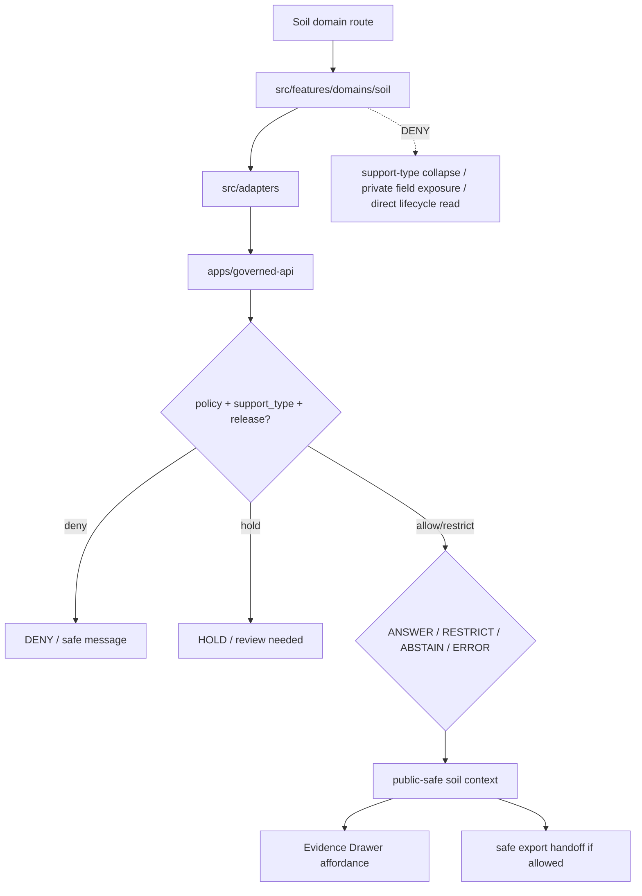

<!-- [KFM_META_BLOCK_V2]
doc_id: kfm://app/explorer-web/src/features/domains/soil/readme
title: Explorer Web Soil Domain Feature README
type: app-readme
version: v0.1
status: draft
owners: OWNER_TBD — Apps steward · UI steward · Soil steward · Governed API steward · Policy steward · Evidence steward · Docs steward
created: 2026-06-16
updated: 2026-07-09
policy_label: public
related:
  - ../../README.md
  - ../../../README.md
  - ../../../adapters/README.md
  - ../../../../README.md
  - ../../../../../README.md
  - ../../../../../governed-api/README.md
  - ../../../../../../docs/domains/soil/README.md
  - ../../../../../../packages/domains/soil/README.md
  - ../../../../../../policy/domains/soil/README.md
  - ../../../../../../contracts/domains/soil/
  - ../../../../../../schemas/contracts/v1/domains/soil/
  - ../../../../../../packages/ui/README.md
  - ../../../../../../packages/maplibre/README.md
  - ../../../../../../policy/access/README.md
  - ../../../../../../policy/decision/README.md
  - ../../../../../../release/README.md
  - ../../../../../../data/README.md
tags: [kfm, apps, explorer-web, domains, soil, feature, ssurgo, sda, gssurgo, gnatsgo, mesonet, scan, uscrn, smap, support-type, evidence-drawer]
notes:
  - "Replaces the greenfield soil domain feature stub with a governed feature README."
  - "Soil UI features may compose governed soil envelopes into public/semi-public views, but they must not become source truth, soil survey authority, station truth, raster truth, policy authority, lifecycle storage, release authority, or direct model-output truth."
  - "Feature implementation files, route wiring, tests, fixtures, governed API envelopes, support-type labels, ReleaseManifests, RollbackCards, and package scripts remain NEEDS VERIFICATION."
  - "The current docs/domains/soil/README.md is a greenfield placeholder; this README relies on current repo evidence from the soil package README for support-type and trust-boundary posture while keeping implementation maturity bounded."
  - "2026-07-09 revision checked current GitHub repo evidence for this README path, parent Explorer Web/feature boundaries, the soil package README, and the soil domain-doc placeholder before updating."
[/KFM_META_BLOCK_V2] -->

<a id="top"></a>

<div align="center">

# Explorer Web Soil Domain Feature

`apps/explorer-web/src/features/domains/soil/`

**Domain-specific Explorer Web feature boundary for public-safe soil views: soil survey units, components, horizons, hydric context, soil moisture, station and satellite context, gridded derivatives, interpretations, Evidence Drawer handoffs, Focus Mode answers, and release-aware map surfaces rendered only through governed envelopes.**


[Evidence](#0-evidence-basis-for-this-revision) · [Purpose](#1-purpose) · [Repo fit](#2-repo-fit) · [Boundary](#3-authority-boundary) · [Inputs](#5-inputs) · [Exclusions](#6-exclusions) · [Feature map](#7-soil-feature-map) · [Definition of done](#14-definition-of-done)

</div>

---

> [!IMPORTANT]
> **Status:** draft / `NEEDS VERIFICATION`  
> **Owners:** `OWNER_TBD` — Apps steward · UI steward · Soil steward · Governed API steward · Policy steward · Evidence steward · Docs steward  
> **Path:** `apps/explorer-web/src/features/domains/soil/README.md`  
> **Responsibility root:** `apps/` — deployable application surfaces  
> **Truth posture:** CONFIRMED current GitHub target README path / CONFIRMED parent Explorer Web and feature-boundary README posture / CONFIRMED soil package support-type and trust-boundary posture / CONFIRMED soil domain-doc placeholder / PROPOSED domain-feature contract / UNKNOWN implementation files, route wiring, tests, fixtures, package scripts, and runtime behavior

> [!CAUTION]
> Soil UI must preserve support type. Static survey records, station readings, satellite grids, raster derivatives, pedon/profile evidence, and interpretations are not interchangeable truth classes. Soil data may also become sensitive when it involves private field observations, farm-level submissions, partner station metadata, proprietary agronomic data, or exact locations that expose operations or private property patterns.

---

## Quick jump

- [0. Evidence basis for this revision](#0-evidence-basis-for-this-revision)
- [1. Purpose](#1-purpose)
- [2. Repo fit](#2-repo-fit)
- [3. Authority boundary](#3-authority-boundary)
- [4. Default posture](#4-default-posture)
- [5. Inputs](#5-inputs)
- [6. Exclusions](#6-exclusions)
- [7. Soil feature map](#7-soil-feature-map)
- [8. Diagram](#8-diagram)
- [9. Soil UI obligations](#9-soil-ui-obligations)
- [10. Per-view contract](#10-per-view-contract)
- [11. Inspection path](#11-inspection-path)
- [12. Validation expectations](#12-validation-expectations)
- [13. Safe change pattern](#13-safe-change-pattern)
- [14. Definition of done](#14-definition-of-done)
- [15. Open verification items](#15-open-verification-items)

---

## 0. Evidence basis for this revision

This README is a documentation boundary, not runtime proof. The 2026-07-09 revision uses the attached Markdown as the baseline and applies the KFM repository Markdown authoring prompt in `revise-existing-doc` mode: preserve strong content, repair weak evidence posture, and keep implementation maturity bounded.

Current GitHub connector evidence checked for this revision:

| Evidence item | Status | What it supports | What it does not prove |
|---|---|---|---|
| `apps/explorer-web/src/features/domains/soil/README.md` exists on `main`. | CONFIRMED | This is an existing README update, not a new path proposal. | It does not prove route modules, panels, hooks, fixtures, tests, or runtime behavior exist. |
| `apps/explorer-web/README.md` exists and identifies Explorer Web as the map-first public/semi-public shell. | CONFIRMED | Soil UI belongs under the Explorer Web application boundary when it is app-local UI composition. | It does not prove Soil feature wiring. |
| `apps/explorer-web/src/features/README.md` exists and defines feature modules as UI composition surfaces. | CONFIRMED | Soil feature code should compose governed results and stay downstream of evidence, policy, and release. | It does not prove the specific Soil feature family is implemented. |
| `packages/domains/soil/README.md` exists and documents soil support-type / helper boundaries. | CONFIRMED | Soil UI must preserve support type and not collapse static survey, station, satellite, raster, profile, interpretation, or change evidence. | It does not prove the helper package has executable implementation beyond README evidence. |
| `docs/domains/soil/README.md` currently contains only a greenfield placeholder. | CONFIRMED | This README must not claim mature Soil doctrine in the docs lane yet. | It does not prove the intended final Soil doctrine is absent forever. |

[Back to top](#top)

---

## 1. Purpose

`apps/explorer-web/src/features/domains/soil/` is the proposed app-local feature boundary for Soil-specific Explorer Web surfaces.

It may eventually hold route modules, panels, view models, hooks, and feature orchestration for public-safe soil experiences such as:

- static soil survey map-unit, component, and horizon views;
- SSURGO, gSSURGO, gNATSGO, and SDA-backed context views;
- hydric soil and interpretation summaries with method and limitation labels;
- station soil-moisture and reference station soil-climate views;
- satellite soil-moisture and gridded derivative views;
- pedon/profile evidence summaries;
- private field, farm-level, or partner-data denial/restriction messaging;
- Evidence Drawer handoffs that show governed, support-typed, audience-appropriate payloads;
- Focus Mode bounded soil answers with citation discipline and AIReceipt support;
- compare/export handoffs that preserve support type, source role, rights, release, correction, and rollback state.

This directory is not proof that any route, panel, hook, map layer, adapter, test, fixture, package script, or governed API envelope is implemented.

[Back to top](#top)

---

## 2. Repo fit

| Concern | Owning root | Expected relationship |
|---|---|---|
| Soil domain feature source | `apps/explorer-web/src/features/domains/soil/` | App-local Soil UI feature modules, if implemented and tested |
| Feature boundary | `apps/explorer-web/src/features/` | Parent feature/root contract |
| Adapter boundary | `apps/explorer-web/src/adapters/` | Governed API, evidence, layer, map, export, and diagnostics adapters |
| Explorer Web app | `apps/explorer-web/` | Map-first public/semi-public shell |
| Governed API | `apps/governed-api/` | Trust membrane and normal data path |
| Soil doctrine | `docs/domains/soil/` | Domain scope and doctrine home; current README is a placeholder and needs expansion |
| Soil package helpers | `packages/domains/soil/` | Reusable deterministic helper code; not a public truth path |
| Soil policy | `policy/domains/soil/` | Soil admissibility and exposure policy, if executable wiring is accepted |
| Soil contracts | `contracts/domains/soil/` | Object meaning authority, if present and accepted |
| Soil schemas | `schemas/contracts/v1/domains/soil/` | Machine shape authority, if present and accepted |
| Shared UI components | `packages/ui/` | Reusable cards, badges, drawers, panels, hydrograph-style charts, and legends when shared |
| Renderer wrappers | `packages/maplibre/`, `packages/cesium/` | Renderer behavior stays behind adapter/wrapper boundaries |
| Release authority | `release/` | Publication, correction, supersession, rollback control |
| Lifecycle artifacts | `data/` | Receipts, proofs, registry, catalog, triplets, and published artifacts |

## 3. Authority boundary

This feature renders governed Soil UI. It does not own soil doctrine, source admission, source rights, sensitivity decisions, policy decisions, schemas, contracts, lifecycle artifacts, release decisions, EvidenceBundle truth, renderer authority, soil survey authority, station truth, satellite truth, raster truth, hydrology truth, agriculture truth, or AI output.

```text
apps/explorer-web/src/features/domains/soil/ = app-local Soil UI feature
apps/explorer-web/src/features/              = feature boundary
apps/explorer-web/src/adapters/              = adapter boundary
apps/governed-api/                           = trust membrane and normal data path
docs/domains/soil/                           = Soil doctrine home, currently placeholder
packages/domains/soil/                       = shared helpers only, not truth or policy
policy/domains/soil/                         = domain policy lane
contracts/domains/soil/                      = soil object meaning, if present and accepted
schemas/contracts/v1/domains/soil/           = soil machine shape, if present and accepted
packages/ui/                                 = shared UI primitives
policy/                                      = finite policy decisions
data/                                        = lifecycle artifacts, receipts, proofs, registries
release/                                     = publication, correction, rollback authority
```

## 4. Default posture

Soil feature modules should fail closed, preserve support-type labels, preserve source role and time basis, and keep static survey, station, satellite, raster, profile, interpretation, and derived-change evidence distinct. Public map labels, popups, drawers, exports, and Focus Mode answers are downstream carriers; they are not soil truth unless the governed envelope carries evidence, support type, policy, release, correction, and rollback state.

A view should not render claim-bearing soil content when any of these are unresolved:

- governed API envelope and response validation;
- object family or soil domain slug;
- source role, provenance, source version, query hash, geometry hash, or source identity;
- rights, license, consent, or source limitation posture;
- support type such as `authoritative_static_soil`, `gridded_derivative_soil`, `station_soil_moisture`, `reference_station_soil_climate`, `satellite_soil_moisture_grid`, `profile_soil_evidence`, `soil_interpretation`, or `governed_change_evidence`;
- unit, depth basis, timestamp, timezone, QC, freshness, or stale-state posture;
- private field observation, farm-level submission, partner station metadata, proprietary agronomic data, or exact-location exposure risk;
- hydrology, agriculture, habitat, geology, hazards, people/land, or infrastructure cross-lane posture;
- EvidenceRef or EvidenceBundle support;
- PolicyDecision, ReleaseManifest, RollbackCard, CorrectionNotice, RedactionReceipt, AggregationReceipt, or ValidationReport;
- public audience or export destination.

## 5. Inputs

| Input family | Examples | Required posture |
|---|---|---|
| Static survey view state | `mukey`, `cokey`, `chkey`, `areasymbol`, `musym`, map unit, component, horizon | Source version, query hash, join path, source refs, support type |
| Station view state | station id, depth, timestamp, soil moisture, soil temperature, QC flags | Timezone, UTC timestamp, units, depth basis, freshness |
| Raster/grid view state | gSSURGO/gNATSGO rasters, COG/PMTiles, grid-cell id, product version | Resolution, asset refs, support label, derivation limits |
| Satellite view state | SMAP or equivalent product id, granule id, time window, QA flags | Grid support label, latency, masking, not station truth |
| Profile/pedon view state | profile, pedon, horizon evidence, analytical fields | Field provenance, depth basis, source-supported values only |
| Interpretation view state | hydric, erosion, suitability, limitation, interpretation summary | Method, aggregation basis, source interpretation vs KFM-derived summary |
| API envelope | answer, abstain, deny, error, hold, restricted, decision envelope, evidence payload | Runtime-validated before render |
| Evidence state | EvidenceRef, EvidenceBundle summary, citation validation, proof visibility | Required for claim-bearing detail |
| Export state | selected public-safe layer, bounds, citations, disclaimer, release state, output mode | Governed export only |

## 6. Exclusions

| Does not belong here | Correct home |
|---|---|
| Soil doctrine and scope | `docs/domains/soil/` |
| Soil policy bundles or exposure decisions | `policy/domains/soil/`, `policy/sensitivity/`, `policy/rights/`, `policy/` |
| Soil contracts and schemas | `contracts/domains/soil/`, `schemas/contracts/v1/domains/soil/` |
| Soil helper code | `packages/domains/soil/` |
| Soil source descriptors | `data/registry/sources/soil/` |
| SSURGO/SDA/gSSURGO/gNATSGO/Kansas Mesonet/SCAN/USCRN/SMAP source acquisition | `connectors/`, `data/registry/`, source catalog lanes |
| Executable ingest/normalize/emit pipelines | `pipelines/domains/soil/` |
| Declarative source/AOI/query specs | `pipeline_specs/soil/` |
| Governed API implementation | `apps/governed-api/` |
| Adapter logic shared across feature families | `apps/explorer-web/src/adapters/` |
| Shared reusable UI primitives | `packages/ui/` |
| Renderer wrapper authority | `packages/maplibre/`, `packages/cesium/` |
| Lifecycle artifacts, receipts, proofs, catalog, triplets | `data/` |
| Release manifests, rollback cards, correction notices | `release/` |
| Private field/farm/operator exact observations | Denied, held, generalized, aggregated, or restricted unless reviewed public-safe release exists |
| Hydrology, agriculture, habitat, geology, hazard, infrastructure, or people/land truth | Owning domain lanes; Soil may cite governed relation context only |
| Direct model runtime behavior | `runtime/` behind governed API only |
| Secrets, credentials, tokens, private keys | Secret manager / deployment environment |

## 7. Soil feature map

Exact modules remain `NEEDS VERIFICATION`. Candidate views should be introduced only with route inventory, fixtures, and tests.

| Candidate view | Purpose | Required safeguard | Status |
|---|---|---|---|
| `soil-map-units` | Show map unit context | `mukey`/source version/query hash/source role | PROPOSED |
| `components-horizons` | Show component and horizon summaries | `cokey`/`chkey`, units, depth basis, source refs | PROPOSED |
| `hydric-context` | Show hydric soil or interpretation context | Method and interpretation limits visible | PROPOSED |
| `soil-moisture-stations` | Show station soil-moisture context | QC, timezone, depth, freshness, not satellite truth | PROPOSED |
| `reference-station-climate` | Show reference soil-climate station context | Network identity, cadence, QC/status labels | PROPOSED |
| `satellite-soil-moisture` | Show satellite/grid context | Product, QA, latency, masking, not station reading | PROPOSED |
| `gridded-derivatives` | Show gSSURGO/gNATSGO/raster-derived context | Resolution, product version, derivation limits | PROPOSED |
| `profile-evidence` | Show pedon/profile evidence | Field provenance and supported analytical fields | PROPOSED |
| `sensitive-denial` | Explain why private/proprietary soil detail is unavailable | Safe reason code; no exposure hints | PROPOSED |
| `domain-focus` | Soil Focus Mode UI | Finite outcomes; no direct model truth | PROPOSED |
| `domain-evidence` | Evidence Drawer handoff | Audience-appropriate payload only | PROPOSED |
| `domain-export` | Domain export handoff | Citation, support type, rights, release checks | PROPOSED |

> [!WARNING]
> Candidate view names are not implementation proof. Do not document a view as runnable until files, route wiring, tests, fixtures, package scripts, governed API envelopes, support-type labels, and release artifacts confirm it.

## 8. Diagram



## 9. Soil UI obligations

| Obligation | Example effect |
|---|---|
| `governed_api_only` | Soil feature state comes through governed API envelopes |
| `support_type_required` | Static survey, station, satellite, raster, profile, interpretation, and change evidence remain distinct |
| `source_role_preserved` | Authority, observation, model, interpretation, aggregate, candidate, and synthetic roles remain distinct |
| `time_depth_unit_visible` | Depth basis, units, timezone, valid/retrieval/release/correction times, QC, and freshness remain visible where material |
| `privacy_rights_preserved` | Consent, rights, policy labels, source limitations, and private-field restrictions are never dropped |
| `cross_lane_truth_preserved` | Hydrology, Agriculture, Habitat, Geology, Hazards, Infrastructure, and People/Land truth stays with owning lanes |
| `evidence_required` | Claim-bearing details link to EvidenceBundle-derived payloads |
| `finite_states_required` | Views render answer, restrict, abstain, deny, error, hold, loading, stale, and empty states safely |
| `safe_export_required` | Export handoff preserves citations, support type, disclaimers, rights, release, correction, and rollback constraints |
| `no_authority_fork` | Feature code does not redefine Soil policy, schema, contract, source, release, EvidenceBundle, or support-type authority |

## 10. Per-view contract

Every long-lived Soil domain view should document or encode:

- view purpose and route ownership;
- soil object families and source families consumed;
- governed API envelope or adapter dependency;
- support type, source role, units, depth, QC, freshness, and valid-time behavior;
- static survey, station, satellite, raster, profile, interpretation, and derived-change anti-collapse behavior;
- privacy, consent, rights, source limitation, redaction, aggregation, and private-field exposure behavior;
- cross-lane ownership and sensitivity inheritance behavior;
- release, correction, supersession, and rollback behavior;
- expected finite outcomes;
- evidence/citation display behavior;
- loading, empty, deny, abstain, error, hold, restricted, and stale states;
- export behavior, if any;
- tests and fixtures proving trust-membrane, support-type, privacy, and cross-lane ownership boundaries.

## 11. Inspection path

Soil feature implementation files, route wiring, tests, fixtures, governed API envelopes, support-type labels, redaction/aggregation receipts, release manifests, rollback cards, stale-state rules, package scripts, and export handoff remain `NEEDS VERIFICATION`.

```bash
find apps/explorer-web/src/features/domains/soil -maxdepth 5 -type f | sort
find apps/explorer-web/src apps/governed-api docs/domains/soil packages/domains/soil policy/domains/soil contracts/domains/soil schemas/contracts/v1/domains/soil packages/ui packages/maplibre tests fixtures -maxdepth 6 -type f 2>/dev/null | grep -Ei 'soil|ssurgo|gssurgo|gnatsgo|sda|mesonet|scan|uscrn|smap|mukey|cokey|chkey|hydric|pedon|profile|moisture|horizon|support|evidence|release|rollback|governed' | sort
find data/raw data/work data/quarantine data/processed data/catalog data/triplets data/published data/receipts data/proofs -maxdepth 2 -type f 2>/dev/null | sort
```

## 12. Validation expectations

Useful validation for this feature boundary should cover:

- no Soil feature imports or reads lifecycle data roots directly;
- claim-bearing Soil views consume governed API envelopes only;
- malformed Soil envelopes render safe error or abstain states;
- static soil survey support, gridded derivatives, station readings, reference station climate, satellite grids, profile evidence, soil interpretations, and governed change evidence remain distinct;
- `mukey`, `cokey`, `chkey`, source refs, support type, query hash, geometry hash, units, depth basis, QC flags, and source limitations are preserved;
- private field observations, farm-level submissions, partner station metadata, proprietary agronomic data, and exact operation-revealing locations are denied, generalized, held, or restricted by default;
- denial messages do not leak private field, farm/operator, partner metadata, or transform hints;
- Evidence Drawer handoff preserves EvidenceRef/EvidenceBundle handles without exposing protected content;
- Focus Mode renders finite outcomes and never direct model output as soil truth;
- README links, target homes, and relative paths remain consistent with parent Explorer Web boundaries;
- export handoff requires citation, support type, disclaimer, rights, release, correction, and rollback support.

## 13. Safe change pattern

For Soil feature changes:

1. Add or update route inventory and per-view contract.
2. Add fixtures for static survey, station, satellite, raster, profile, interpretation, restricted, denied, held, abstained, malformed, loading, stale, corrected, rolled-back, and empty states.
3. Test lifecycle-data denial and governed API-only behavior.
4. Preserve support type, source role, time/depth/unit/QC, privacy, review, release, rollback, rights, and citation fields through UI state.
5. Update this README, parent `features/README.md`, soil docs/package docs, and parent app README when public behavior changes.

## 14. Definition of done

- [ ] Owners are confirmed and `OWNER_TBD` is replaced.
- [ ] Evidence basis is refreshed when parent README, soil package, soil docs, governed API, policy, schema, release, or fixture evidence changes.
- [ ] Soil feature file inventory and route ownership are documented.
- [ ] Governed API and adapter dependencies are explicit.
- [ ] Support type, source-role, time/depth/unit/QC, privacy, release, stale-state, and rollback states are represented in UI fixtures.
- [ ] Support-type anti-collapse states are tested.
- [ ] Direct lifecycle-data import/read checks are covered.
- [ ] Private field/farm/operator and partner-data denial states are tested.
- [ ] Source ids, native ids, evidence refs, and policy labels survive feature composition.
- [ ] Finite states cover answer, restrict, abstain, deny, error, hold, loading, stale, corrected, rollback, and empty cases.
- [ ] Export, Focus Mode, and Evidence Drawer handoffs are tested for safe output if present.

## 15. Open verification items

| Item | Why it matters |
|---|---|
| Confirm Soil feature implementation files beyond README | Prevents overclaiming feature maturity |
| Confirm route inventory | Required for public/semi-public UI boundary review |
| Confirm governed API Soil envelopes | Required for trust membrane enforcement |
| Confirm soil docs expansion beyond placeholder | Required before doctrine maturity claims |
| Confirm support-type fixtures | Required before claim-bearing Soil UI claims |
| Confirm privacy/rights/source-limitation fixtures | Required before public release claims |
| Confirm release, correction, stale-state, and rollback states | Required before public map-layer claims |
| Confirm Focus Mode and Evidence Drawer behavior | Required before claim-bearing UI claims |
| Confirm export handoff | Required before public download workflows |
| Confirm package scripts beyond TODO | Required before build/test claims |
| Confirm relative links after recursive inventory | Required before treating all related paths as current implementation evidence |

<details>
<summary>Appendix A — no-loss preservation note</summary>

The previous README was a greenfield stub. This replacement adds a bounded Soil domain-feature contract without claiming routes, panels, hooks, adapters, fixtures, tests, package scripts, governed API envelopes, support-type labels, RedactionReceipts, AggregationReceipts, ReleaseManifests, RollbackCards, Focus Mode, Evidence Drawer, or export handoff are implemented.

</details>

## Status summary

`apps/explorer-web/src/features/domains/soil/` should contain Soil-specific Explorer Web feature modules only after route contracts, governed API envelopes, support-type posture, fixtures, tests, Evidence Drawer behavior, Focus Mode behavior, release/stale/rollback handling, and export handoff are verified.

It must preserve the trust membrane and Soil support-type posture: the feature may show static soil survey, station, satellite, raster, profile, interpretation, and governed-change context, but it must not collapse support types, become source truth, policy authority, release authority, lifecycle storage, or a direct model-output surface; it must not expose private field, farm/operator, partner station, proprietary agronomic, or operation-revealing exact-location detail without reviewed public-safe support.

<p align="right"><a href="#top">Back to top</a></p>
