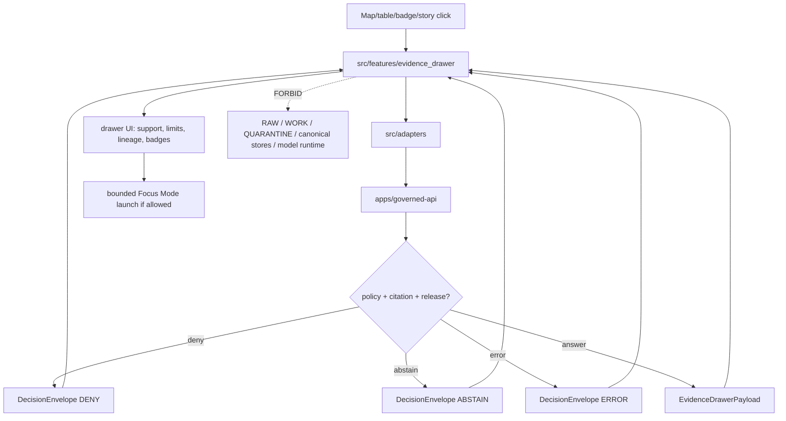

<!-- [KFM_META_BLOCK_V2]
doc_id: kfm://app/explorer-web/src/features/evidence_drawer/readme
title: Explorer Web Evidence Drawer Feature README
type: app-readme
version: v0.1
status: draft
owners: OWNER_TBD — Apps steward · UI steward · Evidence steward · Governed API steward · Policy steward · Accessibility steward · Docs steward
created: 2026-06-16
updated: 2026-06-16
policy_label: public
related:
  - ../README.md
  - ../../README.md
  - ../../adapters/README.md
  - ../../../README.md
  - ../../../../README.md
  - ../../../../governed-api/README.md
  - ../../../../../docs/architecture/ui/EVIDENCE_DRAWER.md
  - ../../../../../docs/architecture/evidence-drawer.md
  - ../../../../../packages/evidence/README.md
  - ../../../../../packages/evidence-resolver/README.md
  - ../../../../../packages/ui/README.md
  - ../../../../../packages/maplibre/README.md
  - ../../../../../policy/access/README.md
  - ../../../../../policy/decision/README.md
  - ../../../../../release/README.md
  - ../../../../../data/README.md
tags: [kfm, apps, explorer-web, features, evidence-drawer, evidencebundle, decision-envelope, trust-panel, accessibility, finite-outcomes]
notes:
  - "Replaces the greenfield Evidence Drawer feature stub with a governed feature README."
  - "Evidence Drawer UI features may render governed evidence projections, but they must not become canonical evidence, source registry, citation authority, policy engine, release authority, correction authority, renderer truth, or direct model-output truth."
  - "Feature implementation files, route wiring, tests, fixtures, governed API envelopes, schemas, adapters, accessibility behavior, telemetry, and package scripts remain NEEDS VERIFICATION."
[/KFM_META_BLOCK_V2] -->

<a id="top"></a>

<div align="center">

# Explorer Web Evidence Drawer Feature

`apps/explorer-web/src/features/evidence_drawer/`

**App-local Explorer Web feature boundary for the mandatory trust panel that resolves clicked features, badges, and consequential map claims into governed EvidenceDrawerPayload surfaces with EvidenceBundle references, citations, policy state, release state, limitations, finite outcomes, and correction/rollback affordances.**


[Purpose](#1-purpose) · [Repo fit](#2-repo-fit) · [Boundary](#3-authority-boundary) · [Inputs](#5-inputs) · [Exclusions](#6-exclusions) · [Feature map](#7-evidence-drawer-feature-map) · [Definition of done](#14-definition-of-done)

</div>

---

> [!IMPORTANT]
> **Status:** draft / `NEEDS VERIFICATION`  
> **Owners:** `OWNER_TBD` — Apps steward · UI steward · Evidence steward · Governed API steward · Policy steward · Accessibility steward · Docs steward  
> **Path:** `apps/explorer-web/src/features/evidence_drawer/README.md`  
> **Responsibility root:** `apps/` — deployable application surfaces  
> **Truth posture:** CONFIRMED README path / CONFIRMED Evidence Drawer architecture doctrine / PROPOSED feature contract / UNKNOWN implementation files, route wiring, tests, fixtures, schemas, and runtime behavior

> [!CAUTION]
> The Evidence Drawer is a browser-side projection, not the evidence source. It must not read RAW, WORK, QUARANTINE, PROCESSED, CATALOG/TRIPLET, canonical stores, unsigned evidence, local files, model runtimes, or renderer feature properties as truth. It renders governed API projections only.

---

## Quick jump

- [1. Purpose](#1-purpose)
- [2. Repo fit](#2-repo-fit)
- [3. Authority boundary](#3-authority-boundary)
- [4. Default posture](#4-default-posture)
- [5. Inputs](#5-inputs)
- [6. Exclusions](#6-exclusions)
- [7. Evidence Drawer feature map](#7-evidence-drawer-feature-map)
- [8. Diagram](#8-diagram)
- [9. Evidence Drawer UI obligations](#9-evidence-drawer-ui-obligations)
- [10. Per-view contract](#10-per-view-contract)
- [11. Inspection path](#11-inspection-path)
- [12. Validation expectations](#12-validation-expectations)
- [13. Safe change pattern](#13-safe-change-pattern)
- [14. Definition of done](#14-definition-of-done)
- [15. Open verification items](#15-open-verification-items)

---

## 1. Purpose

`apps/explorer-web/src/features/evidence_drawer/` is the proposed app-local feature boundary for Evidence Drawer source modules inside Explorer Web.

It may eventually hold route modules, panels, view models, hooks, finite-state renderers, keyboard/focus behavior, and feature orchestration for:

- opening the drawer from released map features, trust badges, layer assertions, table rows, compare results, Story Nodes, and Focus Mode references;
- rendering governed `EvidenceDrawerPayload` projections returned by the governed API;
- displaying `DecisionEnvelope` outcomes and negative states such as `ANSWER`, `ABSTAIN`, `DENY`, and `ERROR`;
- rendering EvidenceRef, EvidenceBundle reference summaries, citations, source summaries, policy state, release state, review state, correction state, limitations, and rollback links;
- launching bounded Focus Mode only from already-resolved governed evidence context;
- exposing correction-submission and report-an-issue affordances without becoming correction authority;
- preserving accessibility as governance: keyboard navigation, ARIA labels, non-color trust badges, reduced-motion behavior, and non-map alternatives.

This directory is not proof that any drawer component, route, hook, adapter, schema, fixture, test, package script, governed API route, or accessibility behavior is implemented.

[Back to top](#top)

---

## 2. Repo fit

| Concern | Owning root | Expected relationship |
|---|---|---|
| Evidence Drawer feature source | `apps/explorer-web/src/features/evidence_drawer/` | App-local drawer feature modules, if implemented and tested |
| Feature boundary | `apps/explorer-web/src/features/` | Parent feature/root contract |
| Adapter boundary | `apps/explorer-web/src/adapters/` | Governed API, evidence, layer, map, export, and diagnostics adapters |
| Explorer Web app | `apps/explorer-web/` | Map-first public/semi-public shell |
| Governed API | `apps/governed-api/` | Trust membrane and normal claim-resolution path |
| Evidence Drawer architecture | `docs/architecture/ui/EVIDENCE_DRAWER.md` | Doctrine and UI trust-panel standard |
| Evidence packages | `packages/evidence/`, `packages/evidence-resolver/` | Shared evidence helpers/resolvers if accepted and verified |
| Shared UI components | `packages/ui/` | Reusable drawer shell, cards, badges, accordions, tables, and accessibility primitives when shared |
| Renderer wrappers | `packages/maplibre/`, `packages/cesium/` | Renderer behavior stays behind adapter/wrapper boundaries |
| Policy gates | `policy/` | Access, sensitivity, rights, release, and decision policy |
| Release authority | `release/` | Publication, correction, supersession, rollback control |
| Lifecycle artifacts | `data/` | Receipts, proofs, registry, catalog, triplets, published artifacts |

## 3. Authority boundary

This feature renders governed Evidence Drawer UI. It does not own canonical evidence, EvidenceBundle construction, source registry records, citation validation, policy decisions, release decisions, correction approval, rollback approval, schemas, contracts, lifecycle artifacts, renderer authority, Focus Mode truth, telemetry truth, or AI output.

```text
apps/explorer-web/src/features/evidence_drawer/ = app-local drawer UI feature
apps/explorer-web/src/features/                 = feature boundary
apps/explorer-web/src/adapters/                 = adapter boundary
apps/governed-api/                              = trust membrane and claim-resolution path
docs/architecture/ui/EVIDENCE_DRAWER.md         = Evidence Drawer architecture doctrine
packages/evidence*/                             = shared evidence helpers/resolvers, if verified
packages/ui/                                    = shared UI primitives
policy/                                         = finite policy decisions
data/                                           = lifecycle artifacts, receipts, proofs, registries
release/                                        = publication, correction, rollback authority
```

## 4. Default posture

Evidence Drawer feature modules should fail closed, show finite bounded states, and never silently degrade missing evidence into an answer.

A drawer view should not render claim-bearing content when any of these are unresolved:

- governed API envelope and response validation;
- `EvidenceDrawerPayload` schema validation;
- `DecisionEnvelope` outcome;
- opened-from context, feature reference, layer id, claim label, valid time, or release state;
- EvidenceRef or EvidenceBundle reference support;
- source summary, source role, authority scope, and knowledge character;
- citations and citation-validation state;
- rights, sensitivity, policy state, review state, freshness, correction state, or release state;
- transforms, limitations, generalizations, redactions, degraded state, or stale state;
- `ReleaseManifest`, `RollbackCard`, `CorrectionNotice`, review record, or receipt references;
- accessibility state for keyboard, screen reader, focus, non-color labels, and reduced motion.

## 5. Inputs

| Input family | Examples | Required posture |
|---|---|---|
| Launch context | map click, badge click, table row, compare row, story node, focus-mode citation | Never treated as claim truth by itself |
| API envelope | `EvidenceDrawerPayload`, `DecisionEnvelope`, `ANSWER`, `ABSTAIN`, `DENY`, `ERROR` | Runtime-validated before render |
| Evidence refs | `evidence_refs[]`, `bundle_ref`, EvidenceRef summary | Canonical bundle pointer, not raw bundle fetch |
| Source state | source role, authority, knowledge character, source descriptor summary | Rendered as supplied by governed API |
| Citation state | citations, validation status, source URLs/labels where allowed | Display validation result, do not recompute in browser |
| Trust state | rights, sensitivity, review state, freshness, release state, correction state | Text labels required; color is secondary |
| Lineage state | release manifest ref, rollback card ref, correction notice, transforms, limitations | Visible when material |
| UI state | loading, denied, abstained, error, stale, restricted, empty, copied, corrected, closed | Finite and tested states |
| Accessibility state | focus trap, return focus, ARIA labels, keyboard path, reduced motion | Required for trust-bearing drawer |

## 6. Exclusions

| Does not belong here | Correct home |
|---|---|
| Governed API claim-resolution implementation | `apps/governed-api/` |
| EvidenceBundle construction or canonical resolver authority | `packages/evidence-resolver/`, governed API, evidence services — exact home `NEEDS VERIFICATION` |
| EvidenceBundle canonical records | `data/`, evidence store, or verified canonical evidence home |
| Source descriptors and source registry | `data/registry/sources/` or verified registry home |
| Citation validation implementation | governed API / validation packages, not browser UI |
| Policy evaluation or sensitivity decisions | `policy/`, governed API policy runtime |
| Release manifests, rollback cards, correction notices | `release/`, `data/receipts/`, `data/proofs/` as accepted |
| Schemas and contracts | `schemas/contracts/v1/ui/`, `schemas/contracts/v1/evidence/`, `contracts/` |
| Renderer wrapper authority | `packages/maplibre/`, `packages/cesium/` |
| Shared reusable UI primitives | `packages/ui/` |
| Lifecycle artifacts, receipts, proofs, catalog, triplets | `data/` |
| Direct model runtime behavior | `runtime/` behind governed API only |
| Raw/unsigned evidence, local source files, or lifecycle data | Forbidden from browser drawer |
| Secrets, credentials, tokens, private keys | Secret manager / deployment environment |

## 7. Evidence Drawer feature map

Exact modules remain `NEEDS VERIFICATION`. Candidate modules should be introduced only with route inventory, fixtures, and tests.

| Candidate module | Purpose | Required safeguard | Status |
|---|---|---|---|
| `drawer-shell` | Drawer layout, resize/close, focus trap, keyboard path | Accessibility and focus-return tests | PROPOSED |
| `claim-header` | Claim label, feature id, layer id, valid time, release state | Stable opened-from context | PROPOSED |
| `decision-state` | Render `ANSWER`, `ABSTAIN`, `DENY`, `ERROR` | Finite state coverage | PROPOSED |
| `source-summary` | Show source role, authority, knowledge character | SourceDescriptor-derived payload only | PROPOSED |
| `citation-list` | Show citations and validation state | Display only; no browser recomputation | PROPOSED |
| `policy-badges` | Show rights, sensitivity, review, freshness, release, correction | Text labels and ARIA labels required | PROPOSED |
| `lineage-panel` | Show release, correction, rollback, transforms, limitations | No hidden lineage breaks | PROPOSED |
| `negative-state-panel` | Show evidence-missing/restricted/stale/conflict/invalid/policy-denied states | No silent claim rendering | PROPOSED |
| `focus-launch` | Start bounded Focus Mode from resolved evidence | No direct model path | PROPOSED |
| `correction-affordance` | Link to correction/report flow | Does not approve correction | PROPOSED |

> [!WARNING]
> Candidate module names are not implementation proof. Do not document a drawer module as runnable until files, route wiring, tests, fixtures, package scripts, governed API envelopes, and schemas confirm it.

## 8. Diagram



## 9. Evidence Drawer UI obligations

| Obligation | Example effect |
|---|---|
| `governed_api_only` | Drawer state comes through governed claim-resolution envelopes |
| `projection_only` | Drawer displays EvidenceBundle-derived projection; it is not canonical evidence |
| `no_feature_property_truth` | Map feature properties can launch the drawer but cannot prove the claim |
| `finite_outcomes_required` | `ANSWER`, `ABSTAIN`, `DENY`, and `ERROR` are explicit UI states |
| `negative_states_visible` | Evidence missing, restricted, stale, conflict, invalid payload, and policy denied states are displayed |
| `trust_badges_text_first` | Rights, sensitivity, review, freshness, release, correction, and source-role badges have text and ARIA labels |
| `lineage_visible` | Release, correction, rollback, transforms, limitations, and degraded states remain inspectable |
| `focus_bounded` | Focus Mode launch inherits drawer evidence/policy scope and cannot bypass the trust membrane |
| `safe_correction_path` | Correction/report affordances submit to governed flows but do not approve or publish |
| `no_authority_fork` | Feature code does not redefine evidence, citation, policy, release, correction, schema, contract, or renderer authority |

## 10. Per-view contract

Every long-lived Evidence Drawer view should document or encode:

- launch source and opened-from context;
- governed API envelope dependency;
- `EvidenceDrawerPayload` schema dependency;
- finite outcomes and negative state behavior;
- EvidenceRef and bundle-ref rendering behavior;
- source summary, citation, policy, release, review, correction, limitation, and rollback behavior;
- domain-specific payload specialization by fixtures rather than bespoke schemas;
- loading, empty, denied, abstained, stale, restricted, conflict, invalid-payload, and error states;
- Focus Mode and correction/report handoffs, if present;
- accessibility behavior for keyboard, screen reader, focus trap, reduced motion, non-map alternative, and non-color trust badges;
- tests and fixtures proving trust-membrane, evidence, policy, release, and accessibility boundaries.

## 11. Inspection path

Evidence Drawer implementation files, route wiring, tests, fixtures, governed API envelopes, schema bindings, accessibility behavior, telemetry, package scripts, and Focus Mode/correction handoffs remain `NEEDS VERIFICATION`.

```bash
find apps/explorer-web/src/features/evidence_drawer -maxdepth 5 -type f | sort
find apps/explorer-web/src apps/governed-api docs/architecture/ui packages/evidence packages/evidence-resolver packages/ui packages/maplibre schemas contracts policy release data tests fixtures -maxdepth 6 -type f 2>/dev/null | grep -Ei 'evidence.?drawer|EvidenceDrawerPayload|EvidenceBundle|EvidenceRef|DecisionEnvelope|citation|policy|release|rollback|correction|focus|drawer|a11y|accessibility' | sort
find data/raw data/work data/quarantine data/processed data/catalog data/triplets data/published data/receipts data/proofs -maxdepth 2 -type f 2>/dev/null | sort
```

## 12. Validation expectations

Useful validation for this feature boundary should cover:

- no Evidence Drawer feature imports or reads lifecycle/canonical data roots directly;
- claim-bearing drawer views consume governed API envelopes only;
- malformed `EvidenceDrawerPayload` renders `ERROR`, never a partial `ANSWER`;
- missing evidence renders `ABSTAIN` with reason, not silence;
- restricted/sensitive/rights-blocked claims render `DENY` with safe reason and obligation;
- stale or conflict states are visible and accessible;
- source role, citations, policy state, release state, review state, correction state, limitations, transforms, and rollback targets survive feature composition;
- map popups and badges launch the drawer but never substitute for proof details;
- Focus Mode launch cannot bypass the drawer/governed API evidence scope;
- accessibility tests cover keyboard, focus trap, return focus, screen reader labels, reduced motion, non-map alternative, and color-independent trust badges.

## 13. Safe change pattern

For Evidence Drawer feature changes:

1. Add or update route inventory and per-view contract.
2. Add fixtures for answer, abstain, deny, error, evidence-missing, restricted, stale, conflict, invalid-payload, loading, empty, correction, and rollback states.
3. Test lifecycle/canonical-data denial and governed API-only behavior.
4. Preserve EvidenceRef, bundle refs, citations, source role, policy, release, review, correction, rollback, limitations, and transform fields through UI state.
5. Test keyboard/screen-reader/reduced-motion paths before claiming trust-bearing drawer usability.
6. Update this README, parent `features/README.md`, Evidence Drawer architecture docs, and parent app README when public behavior changes.

## 14. Definition of done

- [ ] Owners are confirmed and `OWNER_TBD` is replaced.
- [ ] Evidence Drawer feature file inventory and route ownership are documented.
- [ ] Governed API and adapter dependencies are explicit.
- [ ] `EvidenceDrawerPayload` schema binding is verified.
- [ ] `DecisionEnvelope` outcomes and negative states are represented in UI fixtures.
- [ ] Direct lifecycle/canonical-data import/read checks are covered.
- [ ] Citation, policy, release, review, correction, rollback, limitations, and transform fields are preserved.
- [ ] Focus Mode and correction/report handoffs are tested for safe bounded behavior if present.
- [ ] Accessibility behavior is tested for keyboard, focus, ARIA, reduced motion, non-map alternatives, and non-color badges.
- [ ] Export, Compare, Story, map popup, and domain-feature launch paths open the same governed drawer contract when applicable.

## 15. Open verification items

| Item | Why it matters |
|---|---|
| Confirm Evidence Drawer implementation files beyond README | Prevents overclaiming feature maturity |
| Confirm route inventory and launch surfaces | Required for public/semi-public UI boundary review |
| Confirm governed API claim-resolution envelope | Required for trust membrane enforcement |
| Confirm `EvidenceDrawerPayload` schema and fixtures | Required before claim-bearing drawer UI claims |
| Confirm negative-state fixtures | Required to avoid silent evidence failures |
| Confirm accessibility tests | Required because trust signals must be accessible |
| Confirm Focus Mode and correction/report handoffs | Required before downstream workflow claims |
| Confirm telemetry is safe and non-secret | Required before diagnostics/observability claims |
| Confirm package scripts beyond TODO | Required before build/test claims |

<details>
<summary>Appendix A — no-loss preservation note</summary>

The previous README was a greenfield stub. This replacement adds a bounded Evidence Drawer feature contract without claiming drawer components, routes, hooks, adapters, fixtures, tests, package scripts, governed API envelopes, schemas, accessibility behavior, telemetry, Focus Mode launch, correction flow, or export/compare/story integrations are implemented.

</details>

## Status summary

`apps/explorer-web/src/features/evidence_drawer/` should contain Evidence Drawer feature modules only after route contracts, governed API envelopes, schema bindings, negative-state fixtures, accessibility tests, Focus Mode/correction handoffs, and launch-surface integrations are verified.

It must preserve the trust membrane and projection boundary: the drawer may show governed evidence projections, citations, policy state, release state, review state, correction state, limitations, and rollback affordances, but it must not become canonical evidence, citation authority, policy authority, release authority, correction authority, lifecycle storage, renderer truth, or a direct model-output surface.

<p align="right"><a href="#top">Back to top</a></p>
