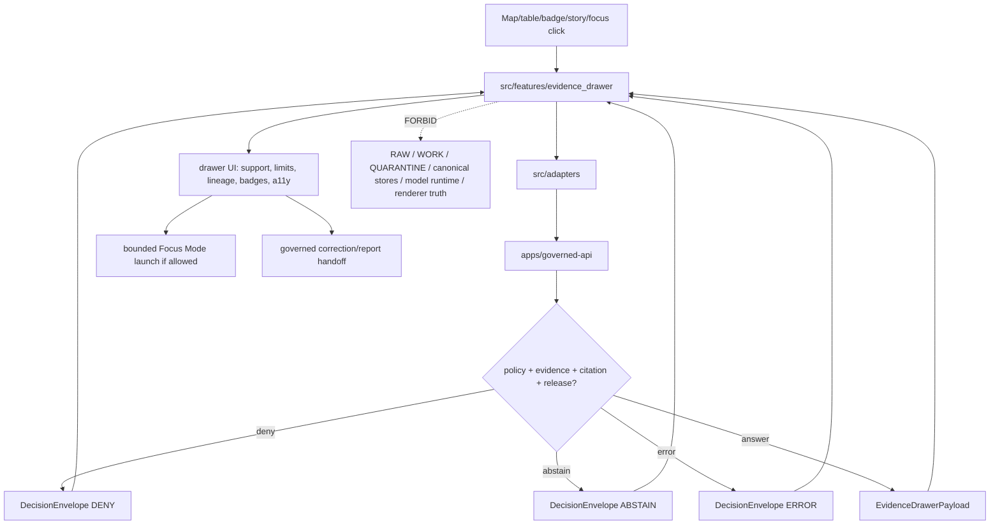

<!-- [KFM_META_BLOCK_V2]
doc_id: kfm://app/explorer-web/src/features/evidence_drawer/readme
title: Explorer Web Evidence Drawer Feature README
type: app-readme
version: v0.2
status: draft
owners: OWNER_TBD — Apps steward · UI steward · Evidence steward · Governed API steward · Policy steward · Accessibility steward · Docs steward
created: 2026-06-16
updated: 2026-07-09
policy_label: public
related:
  - ../README.md
  - ../../README.md
  - ../../adapters/README.md
  - ../../../README.md
  - ../../../../README.md
  - ../../../../governed-api/README.md
  - ../../../../../docs/doctrine/directory-rules.md
  - ../../../../../docs/architecture/ui/EVIDENCE_DRAWER.md
  - ../../../../../docs/architecture/evidence-drawer.md
  - ../../../../../packages/evidence/README.md
  - ../../../../../packages/evidence-resolver/README.md
  - ../../../../../packages/ui/README.md
  - ../../../../../packages/maplibre/README.md
  - ../../../../../policy/access/README.md
  - ../../../../../policy/decision/README.md
  - ../../../../../release/README.md
  - ../../../../../data/README.md
tags: [kfm, apps, explorer-web, features, evidence-drawer, evidencebundle, evidenceref, decision-envelope, trust-panel, accessibility, finite-outcomes]
notes:
  - "Replaces the greenfield Evidence Drawer feature stub with a governed feature README."
  - "Evidence Drawer UI features may render governed evidence projections, but they must not become canonical evidence, source registry, citation authority, policy engine, release authority, correction authority, renderer truth, or direct model-output truth."
  - "Feature implementation files, route wiring, tests, fixtures, governed API envelopes, schemas, adapters, accessibility behavior, telemetry, and package scripts remain NEEDS VERIFICATION."
  - "v0.2 refreshes the evidence basis, aligns the truth posture with current GitHub evidence, adds a minimum safe implementation slice, and strengthens reviewer anti-bypass checks without claiming runtime maturity."
[/KFM_META_BLOCK_V2] -->

<a id="top"></a>

<div align="center">

# Explorer Web Evidence Drawer Feature

`apps/explorer-web/src/features/evidence_drawer/`

**App-local Explorer Web feature boundary for the mandatory trust panel that resolves clicked features, badges, tables, Story Nodes, Focus Mode references, and consequential map claims into governed EvidenceDrawerPayload surfaces with EvidenceRef / EvidenceBundle references, citations, policy state, release state, limitations, finite outcomes, accessibility guarantees, and correction/rollback affordances.**


[Evidence](#0-evidence-basis-for-this-revision) · [Purpose](#1-purpose) · [Repo fit](#2-repo-fit) · [Boundary](#3-authority-boundary) · [Inputs](#5-inputs) · [Exclusions](#6-exclusions) · [Feature map](#7-evidence-drawer-feature-map) · [Minimum slice](#8-minimum-safe-implementation-slice) · [Definition of done](#16-definition-of-done)

</div>

---

> [!IMPORTANT]
> **Status:** draft / `NEEDS VERIFICATION`  
> **Owners:** `OWNER_TBD` — Apps steward · UI steward · Evidence steward · Governed API steward · Policy steward · Accessibility steward · Docs steward  
> **Path:** `apps/explorer-web/src/features/evidence_drawer/README.md`  
> **Responsibility root:** `apps/` — deployable application surfaces  
> **Directory Rules basis:** deployable application feature code belongs under `apps/`; the drawer is an app-local UI composition surface, not a new root, evidence store, policy home, schema home, contract home, source registry, release home, or lifecycle-data lane.  
> **Truth posture:** CONFIRMED current GitHub README path / CONFIRMED parent feature-boundary README posture / CONFIRMED Evidence Drawer architecture docs exist / CONFIRMED evidence helper and resolver package READMEs exist / PROPOSED feature contract / UNKNOWN implementation files, route wiring, tests, fixtures, schemas, package scripts, accessibility behavior, telemetry, and runtime behavior

> [!CAUTION]
> The Evidence Drawer is a browser-side projection, not the evidence source. It must not read RAW, WORK, QUARANTINE, PROCESSED, CATALOG/TRIPLET, canonical stores, unsigned evidence, local files, model runtimes, renderer feature properties, map popups, badge labels, or AI text as truth. It renders governed API projections only.

---

## Quick jump

- [0. Evidence basis for this revision](#0-evidence-basis-for-this-revision)
- [1. Purpose](#1-purpose)
- [2. Repo fit](#2-repo-fit)
- [3. Authority boundary](#3-authority-boundary)
- [4. Default posture](#4-default-posture)
- [5. Inputs](#5-inputs)
- [6. Exclusions](#6-exclusions)
- [7. Evidence Drawer feature map](#7-evidence-drawer-feature-map)
- [8. Minimum safe implementation slice](#8-minimum-safe-implementation-slice)
- [9. Diagram](#9-diagram)
- [10. Evidence Drawer UI obligations](#10-evidence-drawer-ui-obligations)
- [11. Per-view contract](#11-per-view-contract)
- [12. Runtime anti-bypass matrix](#12-runtime-anti-bypass-matrix)
- [13. Inspection path](#13-inspection-path)
- [14. Validation expectations](#14-validation-expectations)
- [15. Safe change pattern](#15-safe-change-pattern)
- [16. Definition of done](#16-definition-of-done)
- [17. Open verification items](#17-open-verification-items)

---

## 0. Evidence basis for this revision

This README is a documentation boundary, not runtime proof. The 2026-07-09 revision updates an existing README and keeps implementation maturity bounded while aligning the feature contract with current repository evidence.

| Evidence item | Status | What it supports | What it does not prove |
|---|---|---|---|
| `apps/explorer-web/src/features/evidence_drawer/README.md` exists on `main`. | CONFIRMED | This is an existing README update, not a new path proposal. | It does not prove drawer components, hooks, routes, tests, fixtures, schemas, or runtime behavior exist. |
| `apps/explorer-web/src/features/README.md` exists and defines feature modules as UI composition surfaces. | CONFIRMED | Evidence Drawer belongs under the Explorer Web feature boundary when it is app-local UI composition. | It does not prove the Evidence Drawer is wired into routes or launch surfaces. |
| `docs/doctrine/directory-rules.md` confirms `apps/` as the deployable-application responsibility root. | CONFIRMED | The target path is within the correct responsibility root for app-local feature code. | It does not decide whether the feature is complete or release-ready. |
| `docs/architecture/ui/EVIDENCE_DRAWER.md` exists and states the drawer resolves clicked features and claims into governed evidence. | CONFIRMED document presence and doctrine posture | The feature README should remain a browser projection boundary downstream of governed evidence. | It does not prove implementation, schema wiring, or tests. |
| `docs/architecture/evidence-drawer.md` exists and states the drawer is a projection of EvidenceBundle, not the source of truth. | CONFIRMED document presence and doctrine posture | The UI feature must not become evidence, policy, release, or correction authority. | It does not prove all referenced paths are implemented. |
| `packages/evidence/README.md` and `packages/evidence-resolver/README.md` exist. | CONFIRMED README presence | Shared evidence helper / resolver lanes are distinct from UI and canonical evidence stores. | It does not prove package source files, API bindings, or resolver runtime behavior. |

[Back to top](#top)

---

## 1. Purpose

`apps/explorer-web/src/features/evidence_drawer/` is the proposed app-local feature boundary for Evidence Drawer source modules inside Explorer Web.

It may eventually hold route modules, panels, view models, hooks, finite-state renderers, keyboard/focus behavior, and feature orchestration for:

- opening the drawer from released map features, trust badges, layer assertions, table rows, compare results, Story Nodes, Focus Mode references, and domain feature citations;
- rendering governed `EvidenceDrawerPayload` projections returned by the governed API;
- displaying `DecisionEnvelope` outcomes and negative states such as `ANSWER`, `ABSTAIN`, `DENY`, `ERROR`, `HOLD`, `RESTRICTED`, `STALE`, and `EMPTY` where the accepted runtime grammar supports them;
- rendering EvidenceRef, EvidenceBundle reference summaries, citations, source summaries, policy state, release state, review state, correction state, limitations, transforms, and rollback links;
- launching bounded Focus Mode only from already-resolved governed evidence context;
- exposing correction-submission and report-an-issue affordances without becoming correction authority;
- preserving accessibility as governance: keyboard navigation, focus return, ARIA labels, non-color trust badges, reduced-motion behavior, text-first status labels, and non-map alternatives.

This directory is not proof that any drawer component, route, hook, adapter, schema, fixture, test, package script, governed API route, telemetry behavior, accessibility behavior, or launch-surface integration is implemented.

[Back to top](#top)

---

## 2. Repo fit

| Concern | Owning root | Expected relationship |
|---|---|---|
| Evidence Drawer feature source | `apps/explorer-web/src/features/evidence_drawer/` | App-local drawer feature modules, if implemented and tested |
| Feature boundary | `apps/explorer-web/src/features/` | Parent feature/root contract |
| Adapter boundary | `apps/explorer-web/src/adapters/` | Governed API, evidence, layer, map, export, and diagnostics adapters |
| Explorer Web app | `apps/explorer-web/` | Map-first public/semi-public shell |
| Governed API | `apps/governed-api/` | Trust membrane and normal claim-resolution path |
| Evidence Drawer architecture | `docs/architecture/ui/EVIDENCE_DRAWER.md`, `docs/architecture/evidence-drawer.md` | Doctrine and UI trust-panel standards |
| Evidence helper package | `packages/evidence/` | Shared evidence value/reference helpers only, if verified |
| Evidence resolver package | `packages/evidence-resolver/` | EvidenceRef → EvidenceBundle closure-validation helpers only, if verified |
| Shared UI components | `packages/ui/` | Reusable drawer shell, cards, badges, accordions, tables, and accessibility primitives when shared |
| Renderer wrapper | `packages/maplibre/` | Renderer behavior stays behind adapter/wrapper boundaries |
| Policy gates | `policy/` | Access, sensitivity, rights, release, and decision policy |
| Release authority | `release/` | Publication, correction, supersession, rollback control |
| Lifecycle artifacts | `data/` | Receipts, proofs, registry, catalog, triplets, published artifacts |
| Contracts and schemas | `contracts/`, `schemas/contracts/v1/` | Object meaning and machine shape; this feature references, not owns |

## 3. Authority boundary

This feature renders governed Evidence Drawer UI. It does not own canonical evidence, EvidenceBundle construction, EvidenceRef resolution authority, source registry records, citation validation, policy decisions, release decisions, correction approval, rollback approval, schemas, contracts, lifecycle artifacts, renderer authority, Focus Mode truth, telemetry truth, or AI output.

```text
apps/explorer-web/src/features/evidence_drawer/ = app-local drawer UI feature
apps/explorer-web/src/features/                 = feature boundary
apps/explorer-web/src/adapters/                 = adapter boundary
apps/governed-api/                              = trust membrane and claim-resolution path
docs/architecture/ui/EVIDENCE_DRAWER.md         = Evidence Drawer UI architecture doctrine
docs/architecture/evidence-drawer.md            = Evidence Drawer architecture doctrine
packages/evidence/                              = evidence helper lane, if verified
packages/evidence-resolver/                     = resolver helper lane, if verified
packages/ui/                                    = shared UI primitives
packages/maplibre/                              = renderer wrapper
policy/                                         = finite policy decisions
schemas/contracts/v1/                           = machine-readable shape
contracts/                                      = object meaning
data/                                           = lifecycle artifacts, receipts, proofs, registries
release/                                        = publication, correction, rollback authority
```

## 4. Default posture

Evidence Drawer feature modules should fail closed, show finite bounded states, and never silently degrade missing evidence into an answer.

A drawer view should not render claim-bearing content when any of these are unresolved:

- governed API envelope and response validation;
- `EvidenceDrawerPayload` schema validation;
- `DecisionEnvelope` outcome;
- opened-from context, feature reference, layer id, claim label, valid time, or release state;
- EvidenceRef or EvidenceBundle reference support;
- source summary, source role, authority scope, knowledge character, and source limitations;
- citations and citation-validation state;
- rights, sensitivity, policy state, review state, freshness, correction state, or release state;
- transforms, limitations, generalizations, redactions, degraded state, conflict state, or stale state;
- `ReleaseManifest`, `RollbackCard`, `CorrectionNotice`, review record, receipt reference, or proof reference when material;
- accessibility state for keyboard, screen reader, focus, non-color labels, and reduced motion.

## 5. Inputs

| Input family | Examples | Required posture |
|---|---|---|
| Launch context | map click, badge click, table row, compare row, story node, focus-mode citation, domain feature link | Never treated as claim truth by itself |
| API envelope | `EvidenceDrawerPayload`, `DecisionEnvelope`, `ANSWER`, `ABSTAIN`, `DENY`, `ERROR`, restricted/hold/stale states if accepted | Runtime-validated before render |
| Evidence refs | `evidence_refs[]`, `bundle_ref`, EvidenceRef summary | Canonical bundle pointer, not raw bundle fetch |
| Source state | source role, authority, knowledge character, source descriptor summary | Rendered as supplied by governed API |
| Citation state | citations, validation status, source URLs/labels where allowed | Display validation result; do not recompute in browser |
| Trust state | rights, sensitivity, review state, freshness, release state, correction state | Text labels required; color is secondary |
| Lineage state | release manifest ref, rollback card ref, correction notice, transforms, limitations | Visible when material |
| UI state | loading, denied, abstained, error, stale, restricted, empty, copied, corrected, closed | Finite and tested states |
| Accessibility state | focus trap, return focus, ARIA labels, keyboard path, reduced motion, non-map alternative | Required for trust-bearing drawer |
| Telemetry state | drawer open/close, copied citation, report issue, failed payload validation | Non-secret, policy-safe, no protected content |

## 6. Exclusions

| Does not belong here | Correct home |
|---|---|
| Governed API claim-resolution implementation | `apps/governed-api/` |
| EvidenceBundle construction or canonical resolver authority | `packages/evidence-resolver/`, governed API, evidence services — exact home `NEEDS VERIFICATION` |
| EvidenceBundle canonical records | `data/`, evidence store, or verified canonical evidence home |
| Source descriptors and source registry | `data/registry/sources/` or verified registry home |
| Citation validation implementation | governed API / validation packages, not browser UI |
| Policy evaluation or sensitivity decisions | `policy/`, governed API policy runtime |
| Release manifests, rollback cards, correction notices | `release/`, `data/receipts/`, `data/proofs/` as accepted |
| Schemas and contracts | `schemas/contracts/v1/ui/`, `schemas/contracts/v1/evidence/`, `contracts/` |
| Renderer wrapper authority | `packages/maplibre/` |
| Shared reusable UI primitives | `packages/ui/` |
| Lifecycle artifacts, receipts, proofs, catalog, triplets | `data/` |
| Direct model runtime behavior | `runtime/` behind governed API only |
| Raw/unsigned evidence, local source files, or lifecycle data | Forbidden from browser drawer |
| Secrets, credentials, tokens, private keys | Secret manager / deployment environment |

## 7. Evidence Drawer feature map

Exact modules remain `NEEDS VERIFICATION`. Candidate modules should be introduced only with route inventory, fixtures, and tests.

| Candidate module | Purpose | Required safeguard | Status |
|---|---|---|---|
| `drawer-shell` | Drawer layout, resize/close, focus trap, keyboard path | Accessibility and focus-return tests | PROPOSED |
| `claim-header` | Claim label, feature id, layer id, valid time, release state | Stable opened-from context | PROPOSED |
| `decision-state` | Render finite `DecisionEnvelope` outcomes | Finite state coverage | PROPOSED |
| `source-summary` | Show source role, authority, knowledge character | SourceDescriptor-derived payload only | PROPOSED |
| `citation-list` | Show citations and validation state | Display only; no browser recomputation | PROPOSED |
| `policy-badges` | Show rights, sensitivity, review, freshness, release, correction | Text labels and ARIA labels required | PROPOSED |
| `lineage-panel` | Show release, correction, rollback, transforms, limitations | No hidden lineage breaks | PROPOSED |
| `negative-state-panel` | Show evidence-missing/restricted/stale/conflict/invalid/policy-denied states | No silent claim rendering | PROPOSED |
| `focus-launch` | Start bounded Focus Mode from resolved evidence | No direct model path | PROPOSED |
| `correction-affordance` | Link to correction/report flow | Does not approve correction | PROPOSED |
| `telemetry-guard` | Emit non-secret usage and validation diagnostics | No protected content in telemetry | PROPOSED |

> [!WARNING]
> Candidate module names are not implementation proof. Do not document a drawer module as runnable until files, route wiring, tests, fixtures, package scripts, governed API envelopes, schemas, and accessibility checks confirm it.

## 8. Minimum safe implementation slice

A smallest useful Evidence Drawer slice should prove the trust membrane before adding polish.

| Slice item | Minimum requirement | Why it is required |
|---|---|---|
| Launch contract | Accept only governed opened-from context, not raw map feature truth | Prevents renderer-property authority |
| Envelope parser | Validate governed API envelope and finite outcome | Prevents malformed payloads becoming partial answers |
| Negative states | Render deny, abstain, error, restricted, stale, and empty states | Prevents silent evidence failure |
| Evidence summary | Show EvidenceRef / bundle-ref and citation status supplied by API | Keeps cite-or-abstain visible |
| Policy/release labels | Show sensitivity, rights, review, release, correction, and rollback state when supplied | Keeps publication and rollback inspectable |
| Accessibility path | Keyboard open/close, focus trap, return focus, labels, and non-color status | Makes trust usable without a mouse or color-only cues |
| Lifecycle denial test | Prove browser code does not import/read lifecycle roots or canonical stores | Preserves public-client boundary |

This slice is still `PROPOSED` until files, fixtures, tests, and route wiring are verified.

## 9. Diagram



## 10. Evidence Drawer UI obligations

| Obligation | Example effect |
|---|---|
| `governed_api_only` | Drawer state comes through governed claim-resolution envelopes |
| `projection_only` | Drawer displays EvidenceBundle-derived projection; it is not canonical evidence |
| `no_feature_property_truth` | Map feature properties can launch the drawer but cannot prove the claim |
| `finite_outcomes_required` | `ANSWER`, `ABSTAIN`, `DENY`, and `ERROR` are explicit UI states; additional states must be accepted contract states |
| `negative_states_visible` | Evidence missing, restricted, stale, conflict, invalid payload, and policy denied states are displayed |
| `trust_badges_text_first` | Rights, sensitivity, review, freshness, release, correction, and source-role badges have text and ARIA labels |
| `lineage_visible` | Release, correction, rollback, transforms, limitations, and degraded states remain inspectable |
| `focus_bounded` | Focus Mode launch inherits drawer evidence/policy scope and cannot bypass the trust membrane |
| `safe_correction_path` | Correction/report affordances submit to governed flows but do not approve or publish |
| `safe_telemetry_only` | Telemetry omits protected values, raw evidence, secret URLs, and hidden identifiers |
| `no_authority_fork` | Feature code does not redefine evidence, citation, policy, release, correction, schema, contract, or renderer authority |

## 11. Per-view contract

Every long-lived Evidence Drawer view should document or encode:

- launch source and opened-from context;
- governed API envelope dependency;
- `EvidenceDrawerPayload` schema dependency;
- finite outcomes and negative state behavior;
- EvidenceRef and bundle-ref rendering behavior;
- source summary, citation, policy, release, review, correction, limitation, transform, and rollback behavior;
- domain-specific payload specialization by fixtures rather than bespoke authority schemas;
- loading, empty, denied, abstained, stale, restricted, conflict, invalid-payload, and error states;
- Focus Mode and correction/report handoffs, if present;
- safe telemetry behavior, if present;
- accessibility behavior for keyboard, screen reader, focus trap, reduced motion, non-map alternative, and non-color trust badges;
- tests and fixtures proving trust-membrane, evidence, policy, release, telemetry, and accessibility boundaries.

## 12. Runtime anti-bypass matrix

| Bypass risk | Required behavior | Review signal |
|---|---|---|
| Browser reads `data/` or canonical evidence directly | Deny at import/build/test review; route through governed API | No direct lifecycle-root imports or fetches |
| Map feature properties treated as truth | Use only as launch context; drawer resolves claim through API | Feature id/layer id is not enough to render proof |
| Popup or badge replaces drawer | Popup/badge opens drawer; proof details live in drawer | Click path to drawer exists where claim is consequential |
| AI text treated as evidence | AI output can cite evidence; drawer shows governed evidence projection | AI receipt and EvidenceRef remain separate |
| UI recomputes policy or citation validity | Render supplied `PolicyDecision` and citation status only | No client-side policy/citation authority fork |
| Hidden stale/correction state | Show stale, corrected, superseded, rollback, and limitation labels | Finite stale/correction fixtures exist |
| Sensitive detail leaked through denial | Use safe reason code and no source-access hints | Denial fixture has no protected coordinates/details |
| Telemetry captures protected content | Emit non-secret event metadata only | Telemetry fixture excludes raw evidence, citations with secrets, and private identifiers |

## 13. Inspection path

Evidence Drawer implementation files, route wiring, tests, fixtures, governed API envelopes, schema bindings, accessibility behavior, telemetry, package scripts, and Focus Mode/correction handoffs remain `NEEDS VERIFICATION`.

```bash
find apps/explorer-web/src/features/evidence_drawer -maxdepth 5 -type f | sort
find apps/explorer-web/src apps/governed-api docs/architecture/ui packages/evidence packages/evidence-resolver packages/ui packages/maplibre schemas contracts policy release data tests fixtures -maxdepth 6 -type f 2>/dev/null | grep -Ei 'evidence.?drawer|EvidenceDrawerPayload|EvidenceBundle|EvidenceRef|DecisionEnvelope|citation|policy|release|rollback|correction|focus|drawer|a11y|accessibility|telemetry' | sort
find data/raw data/work data/quarantine data/processed data/catalog data/triplets data/published data/receipts data/proofs -maxdepth 2 -type f 2>/dev/null | sort
```

## 14. Validation expectations

Useful validation for this feature boundary should cover:

- no Evidence Drawer feature imports or reads lifecycle/canonical data roots directly;
- claim-bearing drawer views consume governed API envelopes only;
- malformed `EvidenceDrawerPayload` renders `ERROR`, never a partial `ANSWER`;
- missing evidence renders `ABSTAIN` with reason, not silence;
- restricted/sensitive/rights-blocked claims render `DENY` with safe reason and obligation;
- stale, corrected, superseded, rollback, or conflict states are visible and accessible;
- source role, citations, policy state, release state, review state, correction state, limitations, transforms, and rollback targets survive feature composition;
- map popups and badges launch the drawer but never substitute for proof details;
- Focus Mode launch cannot bypass the drawer/governed API evidence scope;
- telemetry, if present, excludes protected values, raw evidence, secret URLs, and hidden identifiers;
- accessibility tests cover keyboard, focus trap, return focus, screen reader labels, reduced motion, non-map alternative, and color-independent trust badges.

## 15. Safe change pattern

For Evidence Drawer feature changes:

1. Add or update route inventory and per-view contract.
2. Add fixtures for answer, abstain, deny, error, evidence-missing, restricted, stale, corrected, superseded, rollback, conflict, invalid-payload, loading, empty, telemetry-denied, correction, and rollback states.
3. Test lifecycle/canonical-data denial and governed API-only behavior.
4. Preserve EvidenceRef, bundle refs, citations, source role, policy, release, review, correction, rollback, limitations, and transform fields through UI state.
5. Test keyboard/screen-reader/reduced-motion paths before claiming trust-bearing drawer usability.
6. Update this README, parent `features/README.md`, Evidence Drawer architecture docs, and parent app README when public behavior changes.

## 16. Definition of done

- [ ] Owners are confirmed and `OWNER_TBD` is replaced.
- [ ] Evidence basis is refreshed when parent README, architecture docs, evidence packages, governed API, policy, schema, release, telemetry, or fixture evidence changes.
- [ ] Evidence Drawer feature file inventory and route ownership are documented.
- [ ] Governed API and adapter dependencies are explicit.
- [ ] `EvidenceDrawerPayload` schema binding is verified.
- [ ] `DecisionEnvelope` outcomes and negative states are represented in UI fixtures.
- [ ] Direct lifecycle/canonical-data import/read checks are covered.
- [ ] Citation, policy, release, review, correction, rollback, limitations, and transform fields are preserved.
- [ ] Focus Mode and correction/report handoffs are tested for safe bounded behavior if present.
- [ ] Telemetry is tested as non-secret and policy-safe if present.
- [ ] Accessibility behavior is tested for keyboard, focus, ARIA, reduced motion, non-map alternatives, and non-color badges.
- [ ] Export, Compare, Story, map popup, domain-feature, and Focus Mode launch paths open the same governed drawer contract when applicable.

## 17. Open verification items

| Item | Why it matters |
|---|---|
| Confirm Evidence Drawer implementation files beyond README | Prevents overclaiming feature maturity |
| Confirm route inventory and launch surfaces | Required for public/semi-public UI boundary review |
| Confirm governed API claim-resolution envelope | Required for trust membrane enforcement |
| Confirm `EvidenceDrawerPayload` schema and fixtures | Required before claim-bearing drawer UI claims |
| Confirm negative-state fixtures | Required to avoid silent evidence failures |
| Confirm accessibility tests | Required because trust signals must be accessible |
| Confirm Focus Mode and correction/report handoffs | Required before downstream workflow claims |
| Confirm telemetry is safe and non-secret | Required before diagnostics/observability claims |
| Confirm package scripts beyond TODO | Required before build/test claims |
| Confirm architecture-doc links and relative paths after recursive inventory | Required before treating all related paths as current implementation evidence |

<details>
<summary>Appendix A — no-loss preservation note</summary>

The previous README already contained a strong Evidence Drawer feature contract. This revision preserves that contract, refreshes metadata, adds a current evidence-basis section, strengthens anti-bypass and telemetry safeguards, and keeps implementation claims bounded. It does not claim drawer components, routes, hooks, adapters, fixtures, tests, package scripts, governed API envelopes, schemas, accessibility behavior, telemetry, Focus Mode launch, correction flow, or export/compare/story integrations are implemented.

</details>

## Status summary

`apps/explorer-web/src/features/evidence_drawer/` should contain Evidence Drawer feature modules only after route contracts, governed API envelopes, schema bindings, negative-state fixtures, accessibility tests, telemetry safeguards, Focus Mode/correction handoffs, and launch-surface integrations are verified.

It must preserve the trust membrane and projection boundary: the drawer may show governed evidence projections, citations, policy state, release state, review state, correction state, limitations, transforms, stale state, and rollback affordances, but it must not become canonical evidence, citation authority, policy authority, release authority, correction authority, lifecycle storage, renderer truth, or a direct model-output surface.

<p align="right"><a href="#top">Back to top</a></p>
